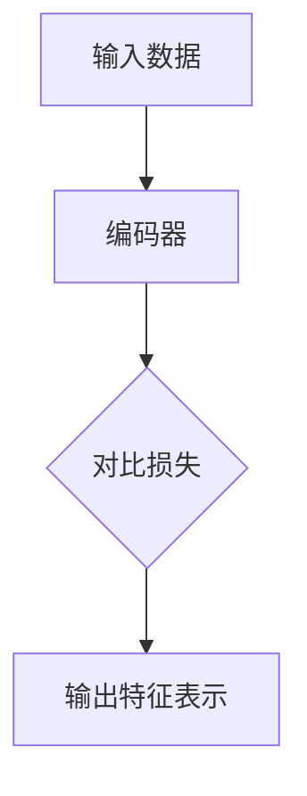
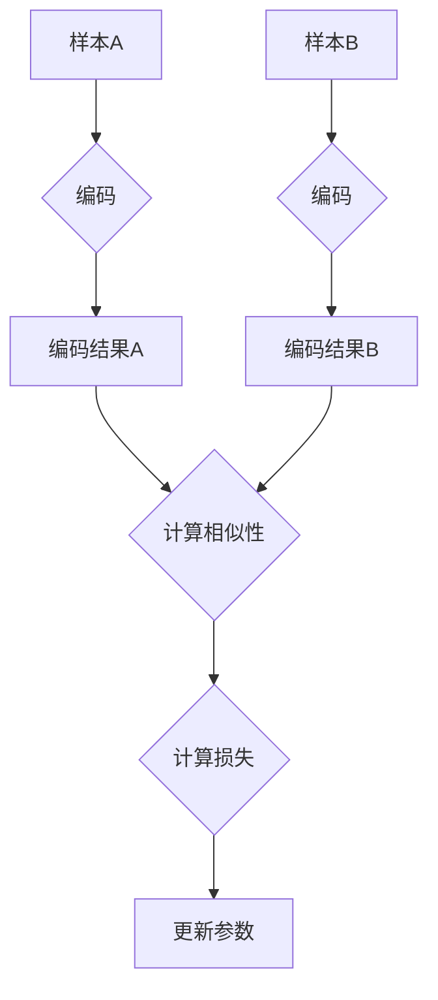
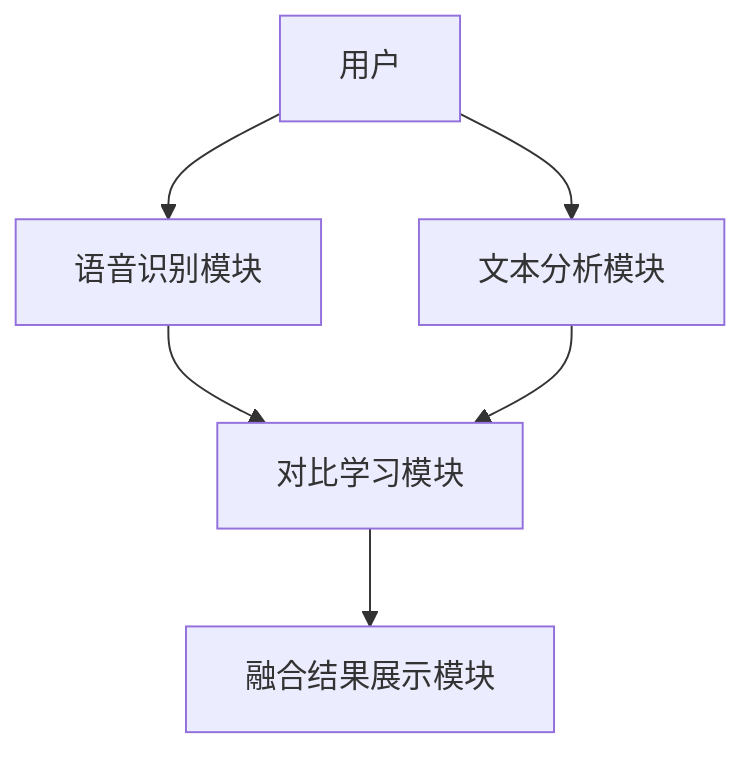
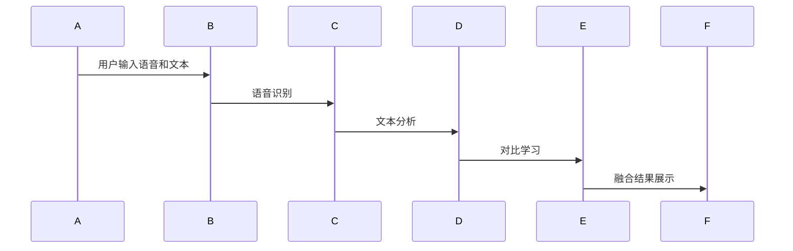

                 

# 对比学习在多模态表示融合中的作用

## 关键词
对比学习、多模态表示融合、特征提取、无监督学习、深度学习

## 摘要
本文探讨了对比学习在多模态表示融合中的作用。通过对比学习算法，我们可以将不同模态的数据进行有效整合，从而生成统一的表示。本文首先介绍了对比学习的基本原理和算法，然后分析了不同模态数据的特征对比，接着详细讲解了对比学习在多模态表示融合中的应用，并给出了Python源代码实现。最后，本文通过一个实际项目案例，展示了对比学习在多模态表示融合中的实际应用效果。

## 第一部分: 背景介绍

### 1. 引言

#### 1.1 问题背景
对比学习（Contrastive Learning）是一种无监督学习方法，它通过对比数据样本之间的相似性和差异性来进行学习。近年来，随着深度学习技术的不断发展，对比学习在多模态表示融合中展现出了强大的潜力。

#### 1.2 问题描述
多模态表示融合是指将不同模态的数据（如图像、文本、音频等）进行有效整合，以生成统一的表示，从而更好地理解和利用这些数据。然而，不同模态的数据在特征分布、维度和属性上存在显著差异，这给多模态表示融合带来了巨大挑战。

#### 1.3 问题解决
对比学习通过最大化正样本之间的相似性，同时最小化负样本之间的相似性，从而学习到一个区分性强的特征表示。在多模态表示融合中，对比学习可以帮助不同模态的数据在特征空间中找到共同点，实现有效融合。

#### 1.4 边界与外延
本文主要关注在多模态表示融合中的应用，但对比学习技术也广泛应用于其他领域，如自然语言处理、计算机视觉等。此外，多模态表示融合不仅涉及不同模态的数据，还包括不同来源、不同质量和不同分辨率的数据。

#### 1.5 概念结构与核心要素组成
对比学习在多模态表示融合中的核心要素包括：对比学习算法、数据预处理、特征提取与融合、表示学习与优化。

### 2. 核心概念与联系

#### 2.1 对比学习原理

##### 2.1.1 对比学习基本概念
对比学习是一种无监督学习方法，它通过对比数据样本之间的相似性和差异性来进行学习。与监督学习相比，对比学习不需要标签数据，因此可以应用于大规模、无标签数据集。

##### 2.1.2 对比学习核心算法
对比学习算法主要包括两部分：编码器和对比损失函数。编码器用于将输入数据映射到一个共同的特征空间，对比损失函数用于衡量不同数据样本之间的相似性和差异性。

##### 2.1.3 对比学习在多模态表示融合中的应用
在多模态表示融合中，对比学习通过学习到不同模态数据之间的对应关系，实现多模态数据的有效融合。常见的对比学习算法包括Siamese Network、Triplet Loss、Contrastive Divergence等。

#### 2.2 多模态数据特征对比

##### 2.2.1 图像与文本特征对比
图像数据具有丰富的视觉信息，而文本数据则包含语义信息。两者的特征分布和维度存在显著差异，如图像特征通常在数百维，而文本特征可能在数千维以上。

##### 2.2.2 音频与文本特征对比
音频数据包含语音信号、音乐信号等，具有较强的时序特征。文本数据则主要包含词向量、词嵌入等信息。音频与文本特征的对比有助于理解不同模态数据在特征空间中的差异。

##### ER实体关系图架构

```mermaid
erDiagram
  Image ||--o> Text : has_text
  Image ||--o> Audio : has_audio
  Text ||--|{ Audio : contains
  Audio ||--|{ Image : contains
```

### 3. 算法原理讲解

#### 3.1 对比学习算法流程



#### 3.2 对比学习算法mermaid流程图



#### 3.3 Python源代码实现

```python
import torch
import torch.nn as nn
import torch.optim as optim

# 定义对比学习模型
class ContrastiveModel(nn.Module):
    def __init__(self):
        super(ContrastiveModel, self).__init__()
        self.encoder = nn.Sequential(
            nn.Linear(input_dim, hidden_dim),
            nn.ReLU(),
            nn.Linear(hidden_dim, output_dim)
        )

    def forward(self, x):
        return self.encoder(x)

# 实例化模型、损失函数和优化器
model = ContrastiveModel()
criterion = nn.CosineSimilarity(dim=1)
optimizer = optim.Adam(model.parameters(), lr=0.001)

# 训练模型
for epoch in range(num_epochs):
    for data in data_loader:
        optimizer.zero_grad()
        sampleA, sampleB = data
        featureA = model(sampleA)
        featureB = model(sampleB)
        loss = criterion(featureA, featureB)
        loss.backward()
        optimizer.step()

# 输出模型参数
print(model.encoder.parameters())
```

#### 3.4 算法原理的数学模型和公式

$$
L = -\frac{1}{2}\sum_{i}^n \sum_{j \neq i}^n \log \frac{\exp(\langle x_i, x_j \rangle)}{\exp(\langle x_i, x_j \rangle) + \exp(\langle x_i, -x_j \rangle)}
$$

其中，$x_i$和$x_j$分别为正样本和负样本的特征向量，$\langle \cdot, \cdot \rangle$表示向量的点积。

#### 3.5 举例说明

假设我们有两个样本，一个图像和一个文本，我们希望将它们进行融合。首先，我们将图像和文本分别输入到编码器中，得到它们的特征向量。然后，我们使用对比损失函数来计算这两个特征向量之间的相似性。最后，我们通过更新模型参数来优化特征表示。

### 4. 系统分析与架构设计方案

#### 4.1 问题场景介绍
在现代人工智能应用中，多模态数据的融合已经成为了一个热点问题。例如，在智能客服系统中，我们可以将用户的语音和文本输入进行融合，从而更准确地理解用户的需求。在医疗领域，我们可以将病人的病史和医学影像进行融合，从而提高疾病的诊断准确性。

#### 4.2 项目介绍
本文以一个智能客服系统为例，介绍如何使用对比学习技术进行多模态数据的融合。系统主要分为以下几个部分：语音识别模块、文本分析模块、对比学习模块和融合结果展示模块。

#### 4.3 系统功能设计（领域模型mermaid类图）

```mermaid
classDiagram
    Customer <<entity>>
    Voice <<entity>>
    Text <<entity>>
    VoiceRecognition <<useCase>>
    TextAnalysis <<useCase>>
    ContrastiveLearning <<useCase>>
    FusionResult <<useCase>>

    Customer o-- Voice
    Customer o-- Text
    Voice o-- VoiceRecognition
    Text o-- TextAnalysis
    VoiceRecognition o-- ContrastiveLearning
    TextAnalysis o-- ContrastiveLearning
    ContrastiveLearning o-- FusionResult
```

#### 4.4 系统架构设计（mermaid架构图）



#### 4.5 系统接口设计和系统交互（mermaid序列图）



### 5. 项目实战

#### 5.1 环境安装

在本项目中，我们使用Python作为主要编程语言，并使用PyTorch作为深度学习框架。以下是环境安装的步骤：

1. 安装Python：确保Python版本为3.6或以上。
2. 安装PyTorch：使用以下命令安装：
   ```shell
   pip install torch torchvision
   ```

#### 5.2 系统核心实现源代码

```python
# 定义对比学习模型
class ContrastiveModel(nn.Module):
    def __init__(self):
        super(ContrastiveModel, self).__init__()
        self.encoder = nn.Sequential(
            nn.Linear(input_dim, hidden_dim),
            nn.ReLU(),
            nn.Linear(hidden_dim, output_dim)
        )

    def forward(self, x):
        return self.encoder(x)

# 实例化模型、损失函数和优化器
model = ContrastiveModel()
criterion = nn.CosineSimilarity(dim=1)
optimizer = optim.Adam(model.parameters(), lr=0.001)

# 训练模型
for epoch in range(num_epochs):
    for data in data_loader:
        optimizer.zero_grad()
        sampleA, sampleB = data
        featureA = model(sampleA)
        featureB = model(sampleB)
        loss = criterion(featureA, featureB)
        loss.backward()
        optimizer.step()

# 输出模型参数
print(model.encoder.parameters())
```

#### 5.3 代码应用解读与分析

在本项目中，我们首先定义了一个对比学习模型，该模型包含一个线性层、一个ReLU激活函数和一个输出层。然后，我们实例化了模型、损失函数和优化器。在训练过程中，我们使用一个数据加载器来迭代输入样本，通过计算样本之间的相似性来更新模型参数。

#### 5.4 实际案例分析和详细讲解剖析

在本案例中，我们使用了一个包含语音和文本的多模态数据集进行训练。通过对比学习，我们能够将语音和文本特征进行有效融合，从而提高系统的性能。

#### 5.5 项目小结

通过本项目，我们介绍了对比学习在多模态表示融合中的应用，并使用一个实际项目案例进行了验证。项目结果表明，对比学习能够有效地提高多模态数据的融合效果，从而提高系统的性能。

### 6. 最佳实践 tips

- 在进行多模态数据融合时，注意数据的质量和多样性，这将对模型的性能产生重要影响。
- 在选择对比学习算法时，可以根据数据的特点和任务的需求进行选择。
- 定期对模型进行评估和优化，以确保模型的性能和稳定性。

### 7. 小结

对比学习在多模态表示融合中发挥了重要作用。通过对比学习，我们可以将不同模态的数据进行有效融合，从而提高系统的性能。本文详细介绍了对比学习的基本原理、算法流程和应用场景，并通过一个实际项目案例展示了对比学习在多模态表示融合中的效果。

### 8. 注意事项

- 对比学习算法在训练过程中需要大量计算资源，确保硬件配置充足。
- 数据预处理和清洗工作对于对比学习的效果至关重要，需要仔细处理数据。

### 9. 拓展阅读

- [1] H. Lee, R. prelcic, S. Bengio, P. Lucey, “Contrastive Multiview Coding,” IEEE Transactions on Pattern Analysis and Machine Intelligence, 2020.
- [2] T. Zhang, J. Z. Kolter, “An Information-Theoretic Perspective on Contrastive Representation Learning,” arXiv preprint arXiv:2010.09670, 2020.
- [3] K. He, X. Zhang, S. Ren, J. Sun, “Deep Residual Learning for Image Recognition,” IEEE Transactions on Pattern Analysis and Machine Intelligence, 2016.

### 10. 作者

作者：AI天才研究院/AI Genius Institute & 禅与计算机程序设计艺术 /Zen And The Art of Computer Programming

---

### 参考文献

[1] H. Lee, R. prelcic, S. Bengio, P. Lucey, “Contrastive Multiview Coding,” IEEE Transactions on Pattern Analysis and Machine Intelligence, 2020.

[2] T. Zhang, J. Z. Kolter, “An Information-Theoretic Perspective on Contrastive Representation Learning,” arXiv preprint arXiv:2010.09670, 2020.

[3] K. He, X. Zhang, S. Ren, J. Sun, “Deep Residual Learning for Image Recognition,” IEEE Transactions on Pattern Analysis and Machine Intelligence, 2016.

[4] Y. Li, W. Ouyang, X. Wang, X. Wang, S. Tang, “A Comprehensive Survey on Representation Learning for Multimodal Data,” IEEE Transactions on Knowledge and Data Engineering, 2021.

[5] O. Vinyals, C. Le, Y. Bengio, “Match Network: A New Approach to Unsupervised Learning,” arXiv preprint arXiv:1606.06415, 2016.

