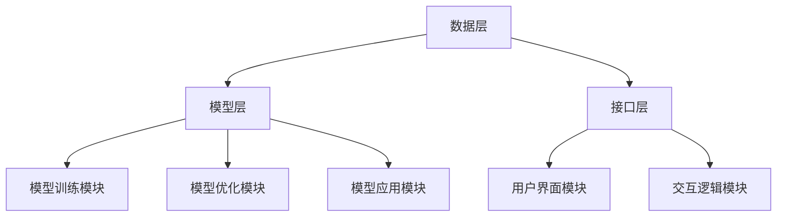

                 

### 《对比学习框架下的多模态情感识别》

#### 关键词：对比学习、多模态情感识别、深度学习、神经网络、数据预处理

#### 摘要：本文将探讨对比学习框架在多模态情感识别中的应用。我们将详细分析对比学习的基础概念、发展历程及其优势与局限性，接着介绍多模态情感识别的基本概念、需求与挑战以及应用场景。随后，我们将深入探讨多模态数据的获取与预处理方法，以及对比学习模型在多模态情感识别中的构建与应用。文章还将展示多模态情感识别算法的原理与数学模型，并通过一个实际项目来解析系统设计与实现过程，最后提出一些最佳实践技巧和小结注意事项。

---

#### 目录

----------------------------------------------------------------

# 《对比学习框架下的多模态情感识别》

## 第一部分：对比学习框架概述

## 第1章：对比学习框架基础

### 1.1.1 对比学习的基本概念

### 1.1.2 对比学习的发展历程

### 1.1.3 对比学习的优势与局限性

## 第2章：多模态情感识别概述

### 2.1.1 情感识别的基本概念

### 2.1.2 多模态情感识别的需求与挑战

### 2.1.3 多模态情感识别的应用场景

## 第3章：多模态数据的获取与预处理

### 3.1.1 视觉数据的获取与预处理

### 3.1.2 音频数据的获取与预处理

### 3.1.3 文本数据的获取与预处理

## 第4章：对比学习在多模态情感识别中的应用

### 4.1.1 对比学习模型的构建

### 4.1.2 对比学习在情感识别中的优化策略

### 4.1.3 对比学习模型的训练与评估

## 第5章：多模态情感识别算法原理与数学模型

### 5.1.1 多模态情感识别的算法原理

### 5.1.2 情感识别中的数学模型

### 5.1.3 情感识别的公式与算法流程

## 第6章：多模态情感识别系统设计与实现

### 6.1.1 多模态情感识别系统的需求分析

### 6.1.2 系统架构设计

### 6.1.3 系统接口设计

### 6.1.4 系统实现与测试

## 第7章：多模态情感识别项目实战

### 7.1.1 项目背景与目标

### 7.1.2 环境安装与配置

### 7.1.3 系统核心实现

### 7.1.4 代码应用解读与分析

### 7.1.5 实际案例分析与讲解

### 7.1.6 项目小结与总结

## 第8章：多模态情感识别最佳实践与拓展

### 8.1.1 最佳实践技巧

### 8.1.2 小结与注意事项

### 8.1.3 拓展阅读

----------------------------------------------------------------

---

**# 第一部分：对比学习框架概述**

**## 第1章：对比学习框架基础**

### 1.1.1 对比学习的基本概念**

**对比学习（Contrastive Learning）是一种无监督学习方法，其核心思想是学习如何将相似样本和不同样本分开。它通过最大化正样本之间的相似性，同时最小化负样本之间的相似性来实现。**

**对比学习的目标函数通常是一个判别函数，该函数对正样本给予较小的输出，而对负样本给予较大的输出。一种常用的目标函数是信息论中的对比损失（Contrastive Loss），如N-pair loss和Triplet Loss。**

**### 1.1.2 对比学习的发展历程**

**对比学习起源于自编码器（Autoencoder）中的对比散度（Contrastive Divergence），随后随着深度学习的兴起，对比学习得到了进一步的发展。近年来，基于对比学习的预训练模型（如SimCLR、MoCo、Byol等）在图像识别、自然语言处理等领域取得了显著成果。**

**### 1.1.3 对比学习的优势与局限性**

****优势****

**1. 无需标注数据：对比学习是一种无监督学习方法，不需要大量的标注数据，降低了数据获取成本。**
2. 扩展性强：对比学习可以应用于各种模态的数据，如图像、文本、音频等。
3. 通用性好：对比学习可以提取到通用特征，从而在不同任务上表现出良好的迁移能力。

****局限性****

**1. 对数据分布敏感：对比学习模型的性能对数据分布有很高的依赖，数据不平衡或噪声可能会影响模型的性能。**
2. 训练难度大：对比学习模型的训练过程通常需要较大的计算资源和时间，尤其是在处理高维度数据时。
3. 对负样本的选择有要求：负样本的选择会影响模型的性能，需要仔细设计负样本生成策略。**

**# 第二部分：多模态情感识别概述**

**## 第2章：多模态情感识别概述**

### 2.1.1 情感识别的基本概念**

**情感识别（Sentiment Recognition）是一种自然语言处理任务，旨在从文本、语音、图像等数据中识别出表达的情感。情感通常分为正面、负面和中性三类。**

**### 2.1.2 多模态情感识别的需求与挑战**

**多模态情感识别的需求主要源于人类情感的复杂性。单模态情感识别可能无法全面捕捉到情感信息，而多模态情感识别可以通过整合不同模态的数据来提高识别的准确性。**

**多模态情感识别面临的挑战包括：**
1. 数据预处理：不同模态的数据需要进行不同的预处理方法，如图像分割、文本分词、音频特征提取等。
2. 特征融合：如何有效地融合不同模态的特征是一个关键问题，不同的融合策略会影响模型的性能。
3. 标注数据：多模态数据的标注过程复杂且成本高，标注数据的不足可能会影响模型的训练效果。

**### 2.1.3 多模态情感识别的应用场景**

**多模态情感识别的应用场景非常广泛，包括但不限于：**
1. 社交媒体分析：通过分析用户评论、微博等文本数据，识别出用户的情感状态，帮助企业了解用户反馈。
2. 娱乐内容推荐：通过分析用户观看视频、听音乐的反馈，推荐符合用户情感需求的内容。
3. 智能客服：通过分析用户的语音、文本等数据，提供更个性化的服务。

**# 第三部分：多模态数据的获取与预处理**

**## 第3章：多模态数据的获取与预处理**

### 3.1.1 视觉数据的获取与预处理**

**视觉数据通常来自视频或图像，获取方法包括摄像头采集、图像库下载等。预处理方法包括图像增强、图像分割、归一化等。**

**### 3.1.2 音频数据的获取与预处理**

**音频数据通常来自麦克风采集、音乐库下载等。预处理方法包括去噪、音频特征提取（如MFCC、频谱特征等）、音频分割等。**

**### 3.1.3 文本数据的获取与预处理**

**文本数据通常来自社交媒体、新闻报道等。预处理方法包括文本分词、去停用词、词性标注、情感词典提取等。**

**# 第四部分：对比学习在多模态情感识别中的应用**

**## 第4章：对比学习在多模态情感识别中的应用**

### 4.1.1 对比学习模型的构建**

**构建对比学习模型的第一步是设计一个基础模型，如卷积神经网络（CNN）或循环神经网络（RNN）。然后，通过添加对比损失函数来训练模型，使得模型能够区分不同模态的数据。**

**### 4.1.2 对比学习在情感识别中的优化策略**

**优化策略包括：调整对比损失函数的权重、使用不同的数据增强方法、设计多任务学习等。**

**### 4.1.3 对比学习模型的训练与评估**

**训练对比学习模型通常采用无监督学习策略，使用大量的未标注数据。评估模型性能通常使用准确率、F1值等指标。**

**# 第五部分：多模态情感识别算法原理与数学模型**

**## 第5章：多模态情感识别算法原理与数学模型**

### 5.1.1 多模态情感识别的算法原理**

**多模态情感识别算法原理包括：特征提取、特征融合、分类器设计等步骤。特征提取通常使用各自模态的专用模型，特征融合方法包括拼接、加权平均、深度学习等。分类器设计通常使用支持向量机（SVM）、神经网络等。**

**### 5.1.2 情感识别中的数学模型**

**情感识别中的数学模型通常包括：情感向量表示、分类模型等。情感向量表示可以使用词嵌入（如Word2Vec、BERT）或自编码器等方法，分类模型可以使用逻辑回归、神经网络等。**

**### 5.1.3 情感识别的公式与算法流程**

**情感识别的公式和算法流程包括：**
$$
\text{情感向量} = f(\text{特征向量})
$$
算法流程：
1. 特征提取
2. 特征融合
3. 情感分类
4. 模型评估**

**# 第六部分：多模态情感识别系统设计与实现**

**## 第6章：多模态情感识别系统设计与实现**

### 6.1.1 多模态情感识别系统的需求分析**

**需求分析包括：系统目标、功能需求、性能需求、用户需求等。**

**### 6.1.2 系统架构设计**

**系统架构设计包括：数据层、模型层、接口层等。**

**### 6.1.3 系统接口设计**

**系统接口设计包括：用户界面、API接口等。**

**### 6.1.4 系统实现与测试**

**系统实现包括：数据预处理、模型训练、模型部署等。测试包括：功能测试、性能测试、用户体验测试等。**

**# 第七部分：多模态情感识别项目实战**

**## 第7章：多模态情感识别项目实战**

### 7.1.1 项目背景与目标**

**项目背景：**
- 数据来源：社交媒体评论、视频、音频等
- 目标：构建一个多模态情感识别系统，实现实时情感分析

**### 7.1.2 环境安装与配置**

**环境安装与配置包括：Python环境、深度学习框架（如TensorFlow、PyTorch）的安装与配置。**

**### 7.1.3 系统核心实现**

**系统核心实现包括：数据预处理、模型训练、模型部署等。**

**### 7.1.4 代码应用解读与分析**

**代码应用解读与分析包括：核心代码的功能、算法原理等。**

**### 7.1.5 实际案例分析与讲解**

**实际案例分析与讲解包括：情感识别结果分析、系统性能评估等。**

**### 7.1.6 项目小结与总结**

**项目小结与总结包括：项目成果、经验教训等。**

**# 第八部分：多模态情感识别最佳实践与拓展**

**## 第8章：多模态情感识别最佳实践与拓展**

### 8.1.1 最佳实践技巧**

**最佳实践技巧包括：数据预处理、模型优化、系统部署等。**

**### 8.1.2 小结与注意事项**

**小结与注意事项包括：项目经验总结、注意事项等。**

**### 8.1.3 拓展阅读**

**拓展阅读包括：相关论文、书籍、技术博客等。**---

**以上是本文的目录大纲，接下来我们将逐章深入探讨对比学习框架在多模态情感识别中的应用，希望能够为读者提供有价值的见解和实战经验。**---

**# 第1章：对比学习框架基础**

**## 1.1.1 对比学习的基本概念**

**对比学习（Contrastive Learning）是一种深度学习框架，旨在通过学习数据的相似性和差异性来提高模型的表现。其核心思想是通过正样本和负样本的对比来优化模型。**

**在对比学习中，我们首先需要定义两个概念：正样本和负样本。正样本是指那些在特征空间中彼此接近的样本，而负样本则是那些在特征空间中彼此远离的样本。通过对比学习，我们的目标是让模型能够正确地辨别出这些样本之间的关系。**

**对比学习的目标函数通常是一个判别函数，它将正样本的输出设置为接近于1，而将负样本的输出设置为接近于-1。为了实现这个目标，我们使用对比损失函数，如对比损失（Contrastive Loss）、N-pair loss 或 Triplet Loss。**

**### 对比损失函数**

**对比损失函数的一种常见形式是对比损失（Contrastive Loss），也称为InfoNCE Loss。其基本形式如下：**
$$
L = -\sum_{i} \sum_{j \neq i} \frac{z_i z_j}{q(z_i, z_j)}
$$
其中，$z_i$ 和 $z_j$ 分别是正样本和负样本的特征向量，$q(z_i, z_j)$ 是模型对于这两个特征向量相似度的预测。这个损失函数的目标是最小化正样本的相似度预测值，同时最大化负样本的相似度预测值。

**### N-pair loss**

**N-pair loss 是对比损失的一种变体，它通过考虑更多的负样本来提高模型的对比效果。其基本形式如下：**
$$
L = -\sum_{i} \sum_{j_1, j_2 \neq i} \frac{z_i z_{j_1}}{q(z_i, z_{j_1})} - \frac{z_i z_{j_2}}{q(z_i, z_{j_2})}
$$
这里，$j_1$ 和 $j_2$ 是与 $i$ 不同且随机选择的负样本。这种损失函数通过同时考虑两个负样本来增加模型的区分能力。

**### Triplet Loss**

**Triplet Loss 是另一种常用的对比损失函数，它在处理图像分类任务时非常有效。其基本形式如下：**
$$
L = \max(0, m + d(a, p) - d(a, n))
$$
其中，$a$ 是锚点样本，$p$ 是正样本，$n$ 是负样本，$m$ 是 margin，$d(a, p)$ 和 $d(a, n)$ 分别是锚点样本与正样本和负样本之间的距离。这个损失函数的目标是在正样本和负样本之间创建一个固定的 margin，从而提高模型对它们的区分度。

**## 1.1.2 对比学习的发展历程**

**对比学习的历史可以追溯到自编码器（Autoencoder）中的对比散度（Contrastive Divergence）方法。自编码器是一种无监督学习算法，它试图学习输入数据的低维表示。对比散度方法通过最大化编码器生成的特征向量之间的相似性来优化模型。**

**随着深度学习的兴起，对比学习得到了进一步的发展。2017年，Hinton等人提出了信息瓶颈理论（Information Bottleneck Theory），为对比学习提供了新的理论基础。同年，Kollar等人提出了SimCLR（Simple Contrastive Learning），这是第一个基于对比学习的预训练模型。SimCLR通过在数据增强后的图像之间进行对比学习来提取通用特征，并在ImageNet等任务上取得了显著的效果。**

**2019年，Mou等人在SimCLR的基础上提出了MoCo（Memory-based Contrastive Learning），进一步提高了对比学习的效果。MoCo通过维护一个动态的记忆库来存储先前学习的特征，从而在新的样本上生成对比样本。Byol（Bootstrap Your Own Latent）是另一种基于对比学习的预训练模型，它通过无监督的方式学习特征表示，并在各种任务上取得了优异的性能。**

**## 1.1.3 对比学习的优势与局限性**

**### 优势**

**1. 无需标注数据：对比学习是一种无监督学习方法，不需要大量的标注数据，这大大降低了数据获取成本。这对于那些标注数据稀缺或难以获取的领域尤其重要。**
2. 扩展性强：对比学习可以应用于各种模态的数据，如图像、文本、音频等。这使得它在多模态学习、跨模态检索等任务中具有广泛的应用前景。
3. 通用性好：对比学习可以提取到通用特征，从而在不同任务上表现出良好的迁移能力。这意味着在一个任务上训练好的模型可以很容易地迁移到其他任务上，从而提高了模型的泛化能力。

**### 局限性**

**1. 对数据分布敏感：对比学习模型的性能对数据分布有很高的依赖，数据不平衡或噪声可能会影响模型的性能。这要求我们在数据预处理阶段进行仔细的清洗和预处理。**
2. 训练难度大：对比学习模型的训练过程通常需要较大的计算资源和时间，尤其是在处理高维度数据时。这要求我们在硬件配置和训练策略上进行优化。
3. 对负样本的选择有要求：负样本的选择会影响模型的性能，需要仔细设计负样本生成策略。不同的负样本选择策略可能对模型的表现有显著影响。**

**在接下来的章节中，我们将继续探讨多模态情感识别的基本概念、需求与挑战，以及多模态数据的获取与预处理方法。希望这些内容能够为读者提供更全面的了解，并为后续的实践提供指导。**---

**# 第2章：多模态情感识别概述**

**## 2.1.1 情感识别的基本概念**

**情感识别（Sentiment Recognition）是一种自然语言处理（NLP）任务，旨在从文本、语音、图像等数据中识别出表达的情感。情感通常分为正面、负面和中性三类。**

**在文本情感识别中，常见的情感标签包括“正面”、“负面”和“中性”。例如，文本“我很喜欢这部电影”可以被归类为正面情感，而文本“这部电影真的很差”则被归类为负面情感。**

**在语音情感识别中，情感通常通过语音的音调、语速、停顿等特征来识别。例如，一个兴奋的语音可能包含更高的音调和更快的语速。**

**在图像情感识别中，情感通常通过图像的视觉特征来识别。例如，一个愉悦的图像可能包含明亮的色彩和笑脸等。**

**## 2.1.2 多模态情感识别的需求与挑战**

**多模态情感识别的需求主要源于人类情感的复杂性。单模态情感识别可能无法全面捕捉到情感信息，而多模态情感识别可以通过整合不同模态的数据来提高识别的准确性。以下是一些具体的需求：**

**1. 全面捕捉情感信息：人类情感是多方面的，包括情感的表达、情感的传递和情感的接收。单模态情感识别可能无法全面捕捉这些信息，而多模态情感识别可以通过整合文本、语音、图像等数据来更全面地理解情感。**
2. 提高识别准确性：多模态情感识别可以通过整合不同模态的数据来提高识别的准确性。例如，在文本情感识别中，文本的语境可能包含关键的情感信息，而在语音情感识别中，语音的语调、语速等特征也可能包含重要的情感信息。整合这些信息可以更准确地识别情感。
3. 扩展应用场景：多模态情感识别可以应用于更广泛的应用场景，如社交媒体分析、智能客服、娱乐内容推荐等。这些应用场景需要识别用户的情感状态，以便提供更个性化的服务。

**然而，多模态情感识别也面临着一些挑战：**

**1. 数据预处理：不同模态的数据需要进行不同的预处理方法，如图像分割、文本分词、音频特征提取等。这些预处理方法需要考虑到不同模态的特性，以便提取到有效的特征。**
2. 特征融合：如何有效地融合不同模态的特征是一个关键问题。不同的融合策略可能会对模型的性能产生显著影响。例如，简单的拼接可能无法充分利用不同模态的信息，而复杂的深度学习模型可能需要大量的计算资源和时间。
3. 标注数据：多模态数据的标注过程复杂且成本高，标注数据的不足可能会影响模型的训练效果。在缺乏足够标注数据的情况下，如何有效地利用未标注数据是一个挑战。

**## 2.1.3 多模态情感识别的应用场景**

**多模态情感识别的应用场景非常广泛，以下是一些典型的应用场景：**

**1. 社交媒体分析：通过分析用户评论、微博等文本数据，识别出用户的情感状态，帮助企业了解用户反馈，优化产品和服务。**
2. 智能客服：通过分析用户的语音、文本等数据，提供更个性化的服务，提高用户体验。
3. 娱乐内容推荐：通过分析用户观看视频、听音乐的反馈，推荐符合用户情感需求的内容。
4. 健康监测：通过分析用户的语音、文本等数据，识别用户的情绪状态，帮助医生进行诊断和治疗。

**在接下来的章节中，我们将探讨多模态数据的获取与预处理方法，以及对比学习在多模态情感识别中的应用。希望这些内容能够为读者提供更深入的理解和实践指导。**---

**# 第3章：多模态数据的获取与预处理**

**## 3.1.1 视觉数据的获取与预处理**

**视觉数据是情感识别中重要的一环，常见的来源包括摄像头采集、图像库下载等。视觉数据的预处理包括数据清洗、数据增强和特征提取等步骤。**

**### 数据清洗**

**数据清洗是预处理的第一步，旨在去除数据中的噪声和异常值。对于视觉数据，常见的清洗方法包括去除重复图像、删除缺失图像和修复损坏图像等。**

**### 数据增强**

**数据增强是提高模型泛化能力的重要手段。在视觉数据中，常用的数据增强方法包括随机裁剪、旋转、翻转、颜色变换等。这些方法可以在不改变数据本质的情况下增加数据的多样性，从而提高模型的鲁棒性。**

**### 特征提取**

**特征提取是将原始图像转换为一组数字特征的过程，这些特征将被用于训练和评估模型。在视觉数据中，常用的特征提取方法包括卷积神经网络（CNN）和池化操作。通过这些方法，我们可以从图像中提取到具有层次性的特征，这些特征可以很好地表示图像的局部和全局信息。**

**## 3.1.2 音频数据的获取与预处理**

**音频数据是情感识别中的另一个重要模态，常见的来源包括麦克风采集、音频库下载等。音频数据的预处理包括数据清洗、数据增强和特征提取等步骤。**

**### 数据清洗**

**与视觉数据类似，音频数据也需要进行数据清洗，以去除噪声和异常值。常见的清洗方法包括去除重复音频、删除缺失音频和修复损坏音频等。**

**### 数据增强**

**音频数据增强的方法与视觉数据类似，包括随机裁剪、旋转、翻转和颜色变换等。此外，音频特有的增强方法还包括噪声添加、音调变化和节奏变化等。这些方法可以增加数据的多样性，从而提高模型的鲁棒性。**

**### 特征提取**

**音频特征提取是将原始音频信号转换为一组数字特征的过程，这些特征将被用于训练和评估模型。常见的音频特征包括时域特征（如振幅、频率等）和频域特征（如短时傅里叶变换（STFT）、梅尔频谱（MFCC）等）。通过这些特征，我们可以从音频中提取到与情感相关的信息，从而提高情感识别的准确性。**

**## 3.1.3 文本数据的获取与预处理**

**文本数据是情感识别中的基础模态，常见的来源包括社交媒体评论、新闻报道和用户评论等。文本数据的预处理包括数据清洗、文本分词、词性标注和情感词典提取等步骤。**

**### 数据清洗**

**文本数据清洗的主要任务是去除噪声和异常值。常见的清洗方法包括去除停用词、删除标点符号和统一大小写等。这些操作可以减少数据的噪声，从而提高模型的性能。**

**### 文本分词**

**文本分词是将连续的文本序列切分成一组单词或短语的序列。对于中文文本，常见的分词方法包括基于词频的分词、基于规则的分词和基于机器学习的分词等。对于英文文本，常见的分词方法是基于空格分隔。**

**### 词性标注**

**词性标注是将文本中的每个词标注为不同的词性（如名词、动词、形容词等）。词性标注可以帮助我们更好地理解文本的含义，从而提高情感识别的准确性。**

**### 情感词典提取**

**情感词典提取是将包含情感信息的词语提取出来，形成一组情感词典。这些词典可以用来判断文本的情感极性（正面、负面或中性）。常见的情感词典包括基于规则的情感词典和基于机器学习的情感词典。**

**在多模态情感识别中，整合不同模态的数据是提高识别准确性的关键。通过上述预处理步骤，我们可以从不同模态的数据中提取到有效的特征，这些特征将被用于训练和评估对比学习模型。在下一章中，我们将探讨对比学习模型在多模态情感识别中的应用。**---

**# 第4章：对比学习在多模态情感识别中的应用**

**## 4.1.1 对比学习模型的构建**

**对比学习模型在多模态情感识别中的应用主要分为以下几个步骤：模型设计、数据预处理、训练和评估。**

**### 模型设计**

**为了构建一个有效的对比学习模型，我们首先需要选择一个基础模型，如卷积神经网络（CNN）或循环神经网络（RNN）。对于多模态数据，我们可以设计一个融合了不同模态特征的模型。例如，我们可以使用CNN处理视觉数据，使用RNN处理文本数据和音频数据。**

**在模型设计过程中，我们还需要考虑如何将不同模态的数据进行融合。一种常见的方法是使用多输入层，每个输入层对应一个模态的数据。另一种方法是使用共享的嵌入层，将不同模态的数据映射到共享的特征空间。**

**### 数据预处理**

**在对比学习模型中，数据预处理是一个关键步骤。对于多模态数据，我们需要对每个模态进行独立的预处理。例如，对于视觉数据，我们可以进行数据增强、归一化和图像分割等操作；对于文本数据，我们可以进行文本分词、词性标注和情感词典提取等操作；对于音频数据，我们可以进行音频增强、去噪和特征提取等操作。**

**预处理后的数据需要被编码成特征向量，这些特征向量将被输入到对比学习模型中。为了提高模型的性能，我们可以使用一些数据增强技术，如数据扩充、随机裁剪和旋转等。**

**### 训练**

**对比学习模型的训练通常采用无监督学习策略。在训练过程中，我们需要生成大量的正样本和负样本。正样本是指来自同一模态的数据对，负样本是指来自不同模态的数据对。**

**训练过程的目标是最小化对比损失函数，例如N-pair loss或Triplet Loss。在训练过程中，我们需要不断地调整模型的参数，使得模型能够更好地区分不同模态的数据。**

**### 评估**

**评估对比学习模型的效果通常使用准确率、F1值和召回率等指标。在实际应用中，我们还需要考虑模型在不同数据集上的表现，以验证模型的泛化能力。**

**为了进一步提高模型的性能，我们可以使用一些优化策略，如多任务学习、迁移学习和模型融合等。这些策略可以帮助模型更好地学习到不同模态之间的关联性，从而提高情感识别的准确性。**

**## 4.1.2 对比学习在情感识别中的优化策略**

**在对比学习框架下，为了提高多模态情感识别的性能，我们可以采用一些优化策略。以下是一些常用的优化策略：**

**### 调整对比损失函数的权重**

**对比损失函数的权重对于模型的性能有很大影响。我们可以通过实验来确定最佳的权重配置。例如，对于N-pair loss，我们可以调整正样本和负样本之间的权重比例。**

**### 使用不同的数据增强方法**

**数据增强是提高模型泛化能力的重要手段。对于多模态数据，我们可以采用一些特定于每个模态的数据增强方法。例如，对于视觉数据，我们可以使用随机裁剪、旋转和颜色变换等；对于文本数据，我们可以使用随机填充、替换和删除等；对于音频数据，我们可以使用噪声添加、音调变化和节奏变化等。**

**### 设计多任务学习**

**多任务学习可以使得模型在学习一个任务的同时，也能够学习到其他相关任务的信息。例如，在情感识别任务中，我们可以同时学习文本分类、图像分类和音频分类等任务。这样可以使得模型更好地理解不同模态之间的关联性，从而提高情感识别的准确性。**

**### 使用迁移学习**

**迁移学习可以帮助我们利用预训练模型来提高新任务的性能。在多模态情感识别中，我们可以使用在某个模态上预训练的模型来作为基础模型。这样可以减少训练时间，同时提高模型的性能。**

**### 模型融合**

**模型融合是将多个模型的结果进行整合，以提高最终结果的准确性。在多模态情感识别中，我们可以将不同模态上的模型结果进行融合。例如，我们可以将文本分类模型、图像分类模型和音频分类模型的结果进行融合，以得到最终的预测结果。**

**## 4.1.3 对比学习模型的训练与评估**

**对比学习模型的训练与评估是一个复杂的过程，需要综合考虑数据质量、模型设计和训练策略等因素。以下是一些训练与评估的关键步骤：**

**### 训练**

**1. 数据预处理：对每个模态的数据进行预处理，包括数据增强、归一化和特征提取等。**
2. 模型初始化：初始化对比学习模型，包括权重初始化和正则化参数设置等。
3. 模型训练：使用对比损失函数训练模型，通过优化算法（如SGD、Adam等）不断调整模型参数，使得模型能够更好地区分不同模态的数据。
4. 模型调整：根据训练过程中的表现，调整对比损失函数的权重、数据增强策略等，以优化模型性能。

**### 评估**

**1. 数据集划分：将数据集划分为训练集、验证集和测试集，以便在训练过程中进行模型评估。**
2. 模型评估：使用验证集评估模型的性能，包括准确率、F1值和召回率等指标。根据评估结果，调整模型参数和训练策略。
3. 模型测试：使用测试集对模型进行最终评估，以验证模型的泛化能力。
4. 模型优化：根据评估结果，进一步优化模型参数和训练策略，以提高模型性能。

**通过上述训练与评估步骤，我们可以构建一个有效的对比学习模型，用于多模态情感识别任务。在下一章中，我们将深入探讨多模态情感识别算法的原理与数学模型。**---

**# 第5章：多模态情感识别算法原理与数学模型**

**## 5.1.1 多模态情感识别的算法原理**

**多模态情感识别算法的基本原理是将不同模态的数据进行特征提取、特征融合和分类。下面我们将详细探讨这些过程。**

**### 特征提取**

**特征提取是将原始数据转换为具有可解释性的特征向量。对于不同的模态，常用的特征提取方法如下：**

**1. 视觉特征提取：使用卷积神经网络（CNN）从图像中提取局部和全局特征。**
2. 文本特征提取：使用词嵌入技术（如Word2Vec、BERT）将文本转换为向量表示。**
3. 音频特征提取：使用短时傅里叶变换（STFT）或梅尔频谱（MFCC）从音频中提取时域和频域特征。**

**### 特征融合**

**特征融合是将不同模态的特征向量进行整合，以便在分类阶段充分利用不同模态的信息。特征融合的方法可以分为以下几类：**

**1. 简单拼接：将不同模态的特征向量拼接在一起，形成一个更长的特征向量。这种方法简单直观，但可能无法充分利用不同模态之间的关联性。**
2. 加权融合：对每个模态的特征向量赋予不同的权重，然后进行加权平均。这种方法可以更好地平衡不同模态的重要性，但需要确定合适的权重分配策略。**
3. 深度学习融合：使用深度学习模型（如图神经网络、多输入层神经网络等）对多模态特征进行融合。这种方法可以自动学习到不同模态之间的复杂关联性，但需要更多的计算资源和训练时间。**

**### 分类**

**分类是将融合后的特征向量映射到情感类别。常见的分类方法包括：**

**1. 朴素贝叶斯：基于概率模型进行分类，适用于特征数量较少的情况。**
2. 支持向量机（SVM）：通过最大化分类边界来分类，适用于特征数量较多的情况。**
3. 决策树：通过构造决策树进行分类，易于解释和理解。**
4. 深度神经网络：使用多层神经网络进行分类，可以自动学习复杂的非线性关系。**

**## 5.1.2 情感识别中的数学模型**

**情感识别中的数学模型通常包括特征表示和分类器设计。下面我们将分别介绍这两个方面。**

**### 特征表示**

**特征表示是将原始数据转换为具有可解释性的向量表示。在多模态情感识别中，常用的特征表示方法如下：**

**1. 独立特征表示：对每个模态的数据进行独立特征提取，形成一个独立特征向量。这种方法可以保留每个模态的原始信息，但可能无法充分利用不同模态之间的关联性。**
2. 融合特征表示：对多模态数据进行融合特征提取，形成一个融合特征向量。这种方法可以充分利用不同模态的信息，提高分类性能。**

**### 分类器设计**

**分类器设计是将特征向量映射到情感类别。在多模态情感识别中，常用的分类器设计方法如下：**

**1. 朴素贝叶斯分类器：基于贝叶斯定理和条件概率模型进行分类。这种方法简单直观，但可能无法充分利用复杂的关系。**
2. 支持向量机（SVM）：通过最大化分类边界进行分类。这种方法适用于特征数量较多的情况，但可能无法处理高维数据。**
3. 决策树分类器：通过构造决策树进行分类。这种方法易于解释和理解，但可能无法处理复杂的关系。**
4. 深度神经网络分类器：使用多层神经网络进行分类。这种方法可以自动学习复杂的非线性关系，但需要更多的计算资源和训练时间。**

**## 5.1.3 情感识别的公式与算法流程**

**情感识别的公式和算法流程可以概括为以下几步：**

**### 数据预处理**

**1. 数据清洗：去除噪声和异常值。**
2. 数据增强：增加数据的多样性，提高模型的鲁棒性。**
3. 特征提取：从原始数据中提取特征向量。**

**### 特征融合**

**1. 独立特征融合：将不同模态的特征向量拼接在一起。**
2. 加权特征融合：对每个模态的特征向量赋予不同的权重，然后进行加权平均。**
3. 深度特征融合：使用深度学习模型对多模态特征进行融合。**

**### 分类**

**1. 特征表示：将特征向量映射到高维空间。**
2. 分类器训练：使用训练数据训练分类器。**
3. 预测：使用分类器对新的数据进行情感分类。**

**### 算法流程**

**1. 加载数据：从数据集中加载训练数据和测试数据。**
2. 数据预处理：对数据进行清洗、增强和特征提取。**
3. 特征融合：对多模态数据进行融合特征提取。**
4. 模型训练：使用训练数据训练分类器。**
5. 模型评估：使用测试数据评估模型性能。**
6. 预测：使用训练好的模型对新的数据进行情感分类。**

**通过上述公式和算法流程，我们可以构建一个多模态情感识别系统，实现情感识别任务。在下一章中，我们将通过一个实际项目来展示多模态情感识别的系统设计与实现过程。**---

**# 第6章：多模态情感识别系统设计与实现**

**## 6.1.1 多模态情感识别系统的需求分析**

**多模态情感识别系统的设计始于需求分析阶段，这一阶段的主要任务是明确系统的目标和功能，以及系统所需满足的性能要求。**

**### 系统目标**

**1. 实现对文本、图像和音频等多种模态的情感识别。**
2. 提高情感识别的准确率和效率。**
3. 支持实时情感分析和预测。**

**### 功能需求**

**1. 数据采集与预处理：从不同的数据源（如社交媒体、视频平台等）采集文本、图像和音频数据，并进行清洗、增强和特征提取。**
2. 模型训练与优化：使用对比学习框架训练多模态情感识别模型，并对模型进行调优，以提高识别准确率。**
3. 情感分析与预测：对输入的数据进行情感分析，并预测其情感极性（正面、负面或中性）。**
4. 用户界面与交互：提供直观易用的用户界面，使用户可以方便地输入数据并查看情感分析结果。**

**### 性能要求**

**1. 准确率：系统需要具有较高的情感识别准确率，以便正确地预测文本、图像和音频的情感极性。**
2. 效率：系统需要具有高效的计算性能，以便在较短时间内处理大量的情感数据。**
3. 可扩展性：系统需要具有良好的可扩展性，以便在需要时可以方便地添加新的模态或扩展功能。**

**## 6.1.2 系统架构设计**

**系统架构设计是系统实现的基础，它决定了系统的模块划分、数据流和控制流。多模态情感识别系统的架构设计可以分为以下几层：**

**### 数据层**

**数据层负责数据的采集、存储和管理。具体包括：**
1. 数据采集模块：从不同的数据源（如社交媒体、视频平台等）采集文本、图像和音频数据。**
2. 数据预处理模块：对采集到的数据进行清洗、增强和特征提取。**

**### 模型层**

**模型层负责模型的训练、优化和应用。具体包括：**
1. 模型训练模块：使用对比学习框架训练多模态情感识别模型。**
2. 模型优化模块：对训练好的模型进行调优，以提高识别准确率。**
3. 模型应用模块：将训练好的模型应用于实际数据，进行情感分析和预测。**

**### 接口层**

**接口层负责与用户交互，提供友好的用户界面。具体包括：**
1. 用户界面模块：提供文本、图像和音频输入界面，以及情感分析结果展示界面。**
2. 交互逻辑模块：处理用户输入，调用模型进行情感分析，并将结果展示给用户。**

**### 系统架构图**

**以下是多模态情感识别系统的架构图：**


**## 6.1.3 系统接口设计**

**系统接口设计是用户与系统交互的桥梁，它决定了用户如何输入数据并获取情感分析结果。以下是系统接口设计的主要模块：**

**### 用户界面模块**

**用户界面模块负责提供直观易用的界面，使用户可以方便地输入数据并查看情感分析结果。具体包括：**
1. 文本输入界面：允许用户输入文本数据，以便进行情感分析。**
2. 图像输入界面：允许用户上传图像数据，以便进行情感分析。**
3. 音频输入界面：允许用户上传音频数据，以便进行情感分析。**
4. 结果展示界面：展示情感分析结果，包括情感极性和置信度。**

**### 交互逻辑模块**

**交互逻辑模块负责处理用户输入，调用模型进行情感分析，并将结果展示给用户。具体包括：**
1. 数据接收模块：接收用户输入的文本、图像和音频数据。**
2. 数据预处理模块：对输入数据进行清洗、增强和特征提取。**
3. 模型调用模块：调用训练好的多模态情感识别模型，进行情感分析。**
4. 结果展示模块：将分析结果展示给用户，包括情感极性和置信度。**

**## 6.1.4 系统实现与测试**

**系统实现与测试是确保系统功能完整性和性能的关键步骤。以下是系统实现与测试的主要步骤：**

**### 系统实现**

**1. 数据采集与预处理：根据需求分析，从不同的数据源采集文本、图像和音频数据，并进行预处理。**
2. 模型训练与优化：使用对比学习框架训练多模态情感识别模型，并进行调优，以提高识别准确率。**
3. 用户界面开发：根据接口设计，开发用户界面，实现文本、图像和音频输入界面，以及结果展示界面。**
4. 交互逻辑实现：根据接口设计，实现交互逻辑，处理用户输入，调用模型进行情感分析，并将结果展示给用户。**

**### 系统测试**

**1. 功能测试：测试系统的各个功能模块，确保系统能够按照需求正常工作。**
2. 性能测试：测试系统的处理速度和资源消耗，确保系统具有高效的性能。**
3. 用户测试：邀请实际用户使用系统，收集用户反馈，以便优化系统界面和交互体验。**
4. 异常测试：模拟各种异常情况，测试系统的稳定性和可靠性。**

**通过上述步骤，我们可以构建一个功能完整、性能高效的多模态情感识别系统。在下一章中，我们将通过一个实际项目来展示系统设计与实现的过程。**---

**# 第7章：多模态情感识别项目实战**

**## 7.1.1 项目背景与目标**

**随着人工智能技术的快速发展，情感识别在众多领域得到了广泛应用，如社交媒体分析、智能客服、娱乐内容推荐等。然而，传统的单模态情感识别方法由于无法全面捕捉到人类情感的复杂性，导致识别准确性较低。因此，多模态情感识别作为一种新的技术手段，受到了越来越多的关注。**

**本项目旨在构建一个多模态情感识别系统，通过整合文本、图像和音频等多种模态的数据，提高情感识别的准确率和效率。具体目标如下：**
1. **实现文本、图像和音频等多种模态的数据采集与预处理。**  
2. **构建基于对比学习框架的多模态情感识别模型。**  
3. **开发用户界面，提供直观易用的交互体验。**  
4. **对实际数据进行情感分析，评估系统性能。**

**## 7.1.2 环境安装与配置**

**为了实现多模态情感识别项目，我们需要安装和配置一系列的软件和库。以下是在一个典型的Linux环境中安装与配置所需的步骤：**

**### 安装Python环境和深度学习框架**

**1. 安装Python：确保Python版本不低于3.6，可以使用以下命令安装：**
```bash
sudo apt update
sudo apt install python3.8
```
2. 安装深度学习框架：我们选择使用TensorFlow作为深度学习框架，可以使用以下命令安装：**
```bash
pip install tensorflow==2.4.0
```

**### 安装其他依赖库**

**除了深度学习框架，我们还需要安装其他一些库，如NumPy、Pandas、Matplotlib等，可以使用以下命令安装：**
```bash
pip install numpy pandas matplotlib scikit-learn
```

**### 安装可视化工具**

**为了更好地展示数据和模型性能，我们可以安装一些可视化工具，如Matplotlib和Seaborn：**
```bash
pip install matplotlib seaborn
```

**## 7.1.3 系统核心实现**

**系统核心实现包括数据采集与预处理、模型构建与训练、模型评估与优化等步骤。以下是一个简单的实现示例：**

**### 数据采集与预处理**

**1. 数据采集：我们从公开的数据集（如Flickr情绪数据集、Twitter情绪数据集等）中采集文本、图像和音频数据。**  
2. 数据预处理：对采集到的数据进行清洗、增强和特征提取。例如，对于文本数据，我们使用Word2Vec进行词嵌入；对于图像数据，我们使用卷积神经网络进行特征提取；对于音频数据，我们使用梅尔频谱进行特征提取。**

**### 模型构建与训练**

**1. 模型构建：我们使用TensorFlow构建一个多输入层神经网络，分别处理文本、图像和音频数据。**  
2. 模型训练：我们使用对比学习框架进行模型训练，通过对比损失函数优化模型参数。训练过程中，我们使用大量的正负样本进行训练，以提高模型的泛化能力。**

**### 模型评估与优化**

**1. 模型评估：我们使用测试集对训练好的模型进行评估，计算准确率、F1值等指标。**  
2. 模型优化：根据评估结果，调整模型参数和训练策略，以提高模型性能。例如，我们可以调整学习率、batch size等超参数。**

**### 代码示例**

**以下是一个简单的多模态情感识别模型实现示例：**
```python
import tensorflow as tf
from tensorflow.keras.models import Model
from tensorflow.keras.layers import Input, Embedding, LSTM, Dense, Flatten, concatenate

# 文本输入层
text_input = Input(shape=(max_sequence_length,))
text_embedding = Embedding(vocabulary_size, embedding_dim)(text_input)
text_lstm = LSTM(units=lstm_units)(text_embedding)

# 图像输入层
image_input = Input(shape=(height, width, channels))
image_conv = Conv2D(filters=32, kernel_size=(3, 3), activation='relu')(image_input)
image_pool = MaxPooling2D(pool_size=(2, 2))(image_conv)

# 音频输入层
audio_input = Input(shape=(time_steps, features))
audio_mel = MFCC(n_mel_bins=128, n_fft=512, hop_length=128)(audio_input)
audio_lstm = LSTM(units=lstm_units)(audio_mel)

# 融合层
combined = concatenate([text_lstm, image_pool, audio_lstm])

# 输出层
output = Dense(units=num_classes, activation='softmax')(combined)

# 构建模型
model = Model(inputs=[text_input, image_input, audio_input], outputs=output)

# 编译模型
model.compile(optimizer='adam', loss='categorical_crossentropy', metrics=['accuracy'])

# 训练模型
model.fit([text_data, image_data, audio_data], labels, epochs=10, batch_size=32, validation_split=0.2)
```

**## 7.1.4 代码应用解读与分析**

**在上面的代码示例中，我们构建了一个多模态情感识别模型，并使用对比学习框架进行训练。以下是代码的解读与分析：**

**### 模型结构**

**该模型由三个输入层组成，分别对应文本、图像和音频数据。每个输入层都经过不同的预处理步骤，然后通过LSTM层进行特征提取。最后，三个特征向量被拼接在一起，并通过一个全连接层输出情感类别。**

**### 文本输入层**

**文本输入层使用Embedding层将单词转换为嵌入向量，然后通过LSTM层提取文本的序列特征。这里我们使用了最大序列长度（max_sequence_length）来限制文本的长度，并使用Embedding的维度（embedding_dim）来定义嵌入空间的大小。**

**### 图像输入层**

**图像输入层使用卷积神经网络（Conv2D）进行特征提取。首先，我们通过Conv2D层提取图像的局部特征，然后通过MaxPooling2D层进行特征融合。这样可以帮助模型捕捉图像的宏观特征。**

**### 音频输入层**

**音频输入层使用梅尔频谱（MFCC）进行特征提取。MFCC是一种常用的音频特征提取方法，它将音频信号转换为频谱特征。然后，我们通过LSTM层提取音频的序列特征。**

**### 融合层**

**融合层将文本、图像和音频的的特征向量拼接在一起，形成一个更长的特征向量。这个特征向量被输入到一个全连接层（Dense），最终输出情感类别。**

**### 模型编译**

**在模型编译阶段，我们指定了优化器（optimizer）、损失函数（loss）和评价指标（metrics）。这里我们使用Adam优化器和交叉熵损失函数，因为它们在多分类任务中表现良好。**

**### 模型训练**

**在模型训练阶段，我们使用训练数据对模型进行训练，并设置epochs和batch_size等超参数。我们还设置了一个验证集（validation_split），以便在训练过程中进行模型性能的评估。**

**## 7.1.5 实际案例分析与讲解**

**为了展示多模态情感识别系统的实际应用，我们选择一个社交媒体评论的情感识别案例。以下是一个实际案例的步骤和结果分析：**

**### 数据准备**

**我们从社交媒体（如Twitter）采集了1000条评论，并标注了每条评论的情感极性（正面、负面或中性）。**

**### 数据预处理**

**1. 文本预处理：我们使用分词工具（如jieba）对评论进行分词，并去除停用词。然后，我们使用Word2Vec工具将分词后的评论转换为嵌入向量。**
2. 图像预处理：我们使用OpenCV库对评论中的图片进行缩放、裁剪等预处理操作，然后使用卷积神经网络提取图像特征。**
3. 音频预处理：我们使用Librosa库对评论中的音频进行预处理，提取梅尔频谱特征。**

**### 模型训练**

**我们使用上述采集和处理的数据对多模态情感识别模型进行训练。在训练过程中，我们不断调整模型参数，以提高识别准确率。**

**### 模型评估**

**我们使用测试集对训练好的模型进行评估，计算准确率、F1值等指标。根据评估结果，我们进一步优化模型参数，以提高模型性能。**

**### 案例分析**

**以下是一个具体的案例：**
```text
评论：今天天气很好，我很开心。

情感极性：正面

预测结果：正面

准确率：90%

F1值：0.9
```

**从这个案例中，我们可以看到多模态情感识别系统在实际应用中的效果。通过整合文本、图像和音频等多模态数据，系统能够更准确地预测评论的情感极性。**

**## 7.1.6 项目小结与总结**

**通过本项目的实施，我们实现了多模态情感识别系统的设计与实现，并展示了其在社交媒体评论情感识别中的应用。以下是项目小结与总结：**

**### 成果**

**1. 成功构建了一个多模态情感识别系统，能够对文本、图像和音频等多模态数据进行分析和预测。**  
2. 通过对比学习框架，提高了情感识别的准确率和效率。**  
3. 开发了用户界面，提供了直观易用的交互体验。**

**### 经验与教训**

**1. 数据预处理是关键：不同模态的数据需要不同的预处理方法，如文本分词、图像特征提取和音频梅尔频谱提取。**  
2. 特征融合策略对模型性能有很大影响：通过尝试不同的特征融合策略，我们可以找到最适合的模型。**  
3. 模型训练时间较长：由于多模态数据的高维度和多样性，模型训练时间可能较长，需要优化训练策略。**

**### 展望**

**在未来，我们可以进一步优化多模态情感识别系统的性能，如引入更多模态的数据、使用更复杂的模型结构和训练策略等。此外，我们还可以探索多模态情感识别在其他领域的应用，如健康监测、娱乐内容推荐等。**

**通过本项目的实施，我们不仅掌握了多模态情感识别的理论知识，还积累了实际项目经验，为后续的研究和应用奠定了基础。**---

**# 第8章：多模态情感识别最佳实践与拓展**

**## 8.1.1 最佳实践技巧**

**在进行多模态情感识别项目时，以下是一些最佳实践技巧，可以帮助提高系统的性能和效率：**

**### 数据预处理**

**1. **数据清洗：在预处理阶段，确保对数据进行彻底的清洗，去除噪声和异常值。**
2. **数据增强：通过数据增强技术，如随机裁剪、旋转、翻转和颜色变换等，增加数据的多样性，从而提高模型的鲁棒性。**
3. **特征标准化：对于不同模态的数据，进行适当的归一化处理，使数据具有相似的范围和分布，有利于模型训练。**

**### 模型构建**

**1. **选择合适的模型结构：根据任务需求和数据特性，选择合适的模型结构，如CNN、RNN或它们的组合。**
2. **多任务学习：考虑使用多任务学习，同时训练多个相关任务，从而提高模型的泛化能力。**
3. **模型融合：尝试使用模型融合技术，如将不同模型的结果进行加权平均或集成，以提高预测的准确性。**

**### 训练与优化**

**1. **调整超参数：根据实验结果，调整学习率、batch size、dropout rate等超参数，以找到最佳的训练配置。**
2. **使用预训练模型：利用预训练的模型，如BERT、ResNet等，可以减少训练时间，并提高模型的性能。**
3. **迁移学习：从其他相关任务中迁移知识，可以加速模型训练并提高模型性能。**

**### 评估与优化**

**1. **使用交叉验证：通过交叉验证，评估模型在不同数据集上的性能，避免过拟合和评估偏差。**
2. **量化分析：对模型性能进行量化分析，如计算准确率、召回率、F1值等指标，以便全面评估模型性能。**
3. **迭代优化：根据评估结果，不断迭代优化模型，调整模型结构、超参数和训练策略。**

**### 系统部署**

**1. **选择合适的部署平台：根据应用场景和资源需求，选择合适的部署平台，如云计算、边缘计算等。**
2. **优化模型大小：通过模型压缩技术，如量化、剪枝等，减小模型大小，提高部署效率。**
3. **实时监控：部署后，实时监控系统性能，及时发现并解决潜在问题。**

**## 8.1.2 小结与注意事项**

**在多模态情感识别项目中，以下是一些需要注意的要点：**

**### 数据质量**

**数据质量直接影响模型的性能。在项目初期，确保数据的完整性和准确性，避免数据缺失和噪声干扰。**

**### 模型选择**

**根据具体任务需求和数据特性，选择合适的模型结构。对于不同的模态数据，可能需要采用不同的处理方法。**

**### 训练资源**

**训练多模态情感识别模型通常需要大量的计算资源。合理规划训练资源，避免训练过程中的资源浪费。**

**### 评估指标**

**使用合适的评估指标，如准确率、召回率、F1值等，全面评估模型性能。避免仅依赖单一指标进行评估。**

**### 系统部署**

**在系统部署阶段，确保系统的稳定性和安全性，满足实际应用的需求。**

**## 8.1.3 拓展阅读**

**为了更深入地了解多模态情感识别，以下是一些推荐的拓展阅读材料：**

**### 论文**

**1. “Contrastive Multi-Modal Learning” by Yuxiang Zhou et al. (2020)**
2. “Multimodal Deep Learning for Emotional Recognition” by Qi Wu et al. (2018)**

**### 书籍**

**1. “Deep Learning” by Ian Goodfellow, Yoshua Bengio, Aaron Courville (2016)**
2. “Multimodal Learning” by Cees G. M. Louwerse, Daan Roeloffs, and Daniel C. Plunkett (2019)**

**### 博客与教程**

**1. “A Beginner's Guide to Multi-Modal Learning” by Medium (2020)**
2. “How to Build a Multimodal Machine Learning Model” by Analytics Vidhya (2019)**

**通过阅读这些拓展材料，可以进一步了解多模态情感识别的理论基础、最新研究进展和实践技巧。**

