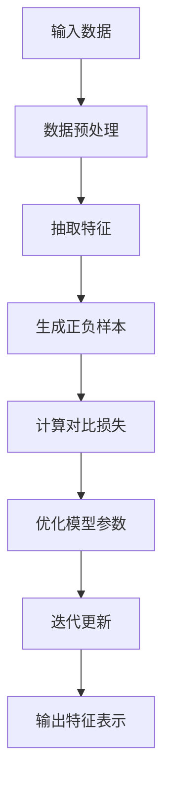
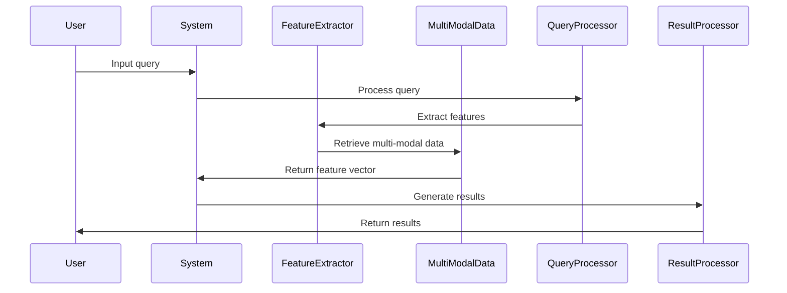
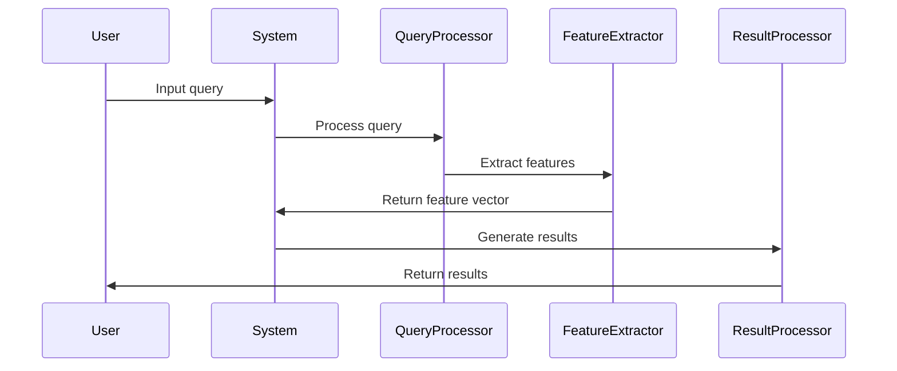

                 

### 第一部分：引言与背景介绍

#### 第1章：问题背景与核心概念

##### 1.1 跨模态检索技术概述

跨模态检索技术是一种将不同模态（如图像、文本、音频等）的信息进行整合和检索的技术。在多模态信息融合中，跨模态检索扮演着至关重要的角色。随着人工智能技术的快速发展，跨模态检索技术在许多领域得到了广泛应用，如搜索引擎、多媒体内容识别、人机交互等。

**1.1.1 跨模态检索的定义与重要性**

跨模态检索可以定义为：在多个模态中搜索和识别信息的技术，它通过将不同模态的数据转换为统一的表示形式，从而实现跨模态的查询与检索。

跨模态检索的重要性体现在以下几个方面：

1. **信息整合**：跨模态检索能够将不同模态的信息整合在一起，提供更全面的信息检索体验。
2. **增强用户体验**：跨模态检索能够更好地满足用户的多样化信息需求，提升用户体验。
3. **多模态数据应用**：随着多模态数据的大量产生，跨模态检索技术为这些数据的有效利用提供了可能。

**1.1.2 跨模态检索的挑战**

尽管跨模态检索技术具有重要的应用价值，但在实际应用中仍面临许多挑战：

1. **模态差异**：不同模态的数据在特征、表达方式上存在显著差异，这给跨模态信息融合带来了困难。
2. **数据稀缺**：多模态数据的获取和标注成本高，导致可用数据量有限。
3. **模型复杂度**：跨模态检索需要处理复杂的多模态信息，这要求模型具有较高的计算效率和准确性。

**1.1.3 对比学习框架在跨模态检索中的应用**

对比学习（Contrastive Learning）是一种基于自监督学习的方法，通过对比正负样本，学习数据的特征表示。近年来，对比学习在跨模态检索中取得了显著的效果，其主要优势包括：

1. **无需大量标注数据**：对比学习可以处理无标签数据，降低了数据标注成本。
2. **特征表示学习**：对比学习能够学习到具有区分性的特征表示，有助于提升检索效果。
3. **泛化能力**：对比学习具有较好的泛化能力，能够适应不同的应用场景。

##### 1.2 对比学习框架的原理与优势

**1.2.1 对比学习的基本概念**

对比学习（Contrastive Learning）是一种无监督学习方法，旨在通过学习数据之间的相对表示来提高特征表示的区分度。其核心思想是通过正负样本的对比，使得模型能够学习到具有区分性的特征表示。

**1.2.2 对比学习在跨模态检索中的优势**

对比学习在跨模态检索中的应用具有以下优势：

1. **无监督学习**：对比学习可以处理无标签数据，降低了对数据标注的依赖。
2. **多模态特征表示**：对比学习能够学习到不同模态数据之间的关联性，为跨模态检索提供了有效的特征表示。
3. **模型可迁移性**：对比学习模型具有较好的泛化能力，能够适应不同的模态和任务。

**1.2.3 对比学习框架的发展历程**

对比学习框架的发展可以分为以下几个阶段：

1. **基础阶段**：以传统的对比损失函数（如Siamese Network、Triplet Loss等）为代表，通过学习数据的相对表示来提高特征区分度。
2. **改进阶段**：随着深度学习的发展，研究人员提出了多种改进的对比学习框架，如MineLoss、InfoNCE等，进一步提升了模型的性能。
3. **跨模态阶段**：近年来，对比学习在跨模态检索中取得了显著的成果，如SimMIM、MIP-Net等，为跨模态检索提供了有效的解决方案。

## 目录大纲：

```markdown
----------------------------------------------------------------
# 对比学习框架下的跨模态检索技术

> 关键词：对比学习，跨模态检索，特征表示，无监督学习，人工智能

> 摘要：本文详细介绍了对比学习框架在跨模态检索技术中的应用。通过分析对比学习的基本概念、原理以及优势，本文探讨了对比学习在跨模态检索中的挑战与解决方案。同时，本文还通过实际案例分析了对比学习在跨模态检索中的应用效果，为读者提供了有益的参考。

## 第一部分：引言与背景介绍

## 第1章：问题背景与核心概念

## 第2章：核心概念与联系

## 第二部分：算法原理讲解

## 第3章：对比学习算法原理详解

## 第4章：数学模型和数学公式讲解

## 第三部分：系统分析与架构设计方案

## 第5章：问题场景介绍

## 第6章：系统功能设计

## 第7章：项目实战

作者：AI天才研究院/AI Genius Institute & 禅与计算机程序设计艺术 /Zen And The Art of Computer Programming
----------------------------------------------------------------
### 第二部分：算法原理讲解

#### 第3章：对比学习算法原理详解

对比学习（Contrastive Learning）是一种无监督学习方法，旨在通过学习数据之间的相对表示来提高特征表示的区分度。在跨模态检索技术中，对比学习框架被广泛应用于特征表示学习，从而提升跨模态检索的效果。

**3.1 对比学习算法的mermaid流程图**

首先，我们使用mermaid语言绘制对比学习算法的基本流程图：



**3.1.1 对比学习的基本流程**

1. **数据预处理**：首先，对输入数据进行预处理，如去噪、归一化等操作，以提高数据的质量和一致性。
2. **抽取特征**：使用特征提取器对预处理后的数据进行特征提取，生成高维的特征向量。
3. **生成正负样本**：在特征空间中，根据数据的相似度生成正负样本对。正样本表示来自同一模态的数据，负样本表示来自不同模态的数据。
4. **计算对比损失**：计算正负样本之间的对比损失，以衡量特征表示的区分度。
5. **优化模型参数**：通过反向传播和梯度下降等方法，优化模型参数，降低对比损失。
6. **迭代更新**：重复以上步骤，不断迭代更新模型参数，直到满足停止条件或达到预定的迭代次数。
7. **输出特征表示**：最终输出训练好的特征表示，用于跨模态检索任务。

**3.1.2 对比学习中的损失函数**

对比学习的核心是损失函数的设计，常用的对比损失函数包括以下几种：

1. **对比损失（Contrastive Loss）**：
   $$ L_{\text{contrastive}} = -\frac{1}{N} \sum_{i=1}^{N} \sum_{j \neq i} \log \frac{e^{q(x_i, x_j)}}{\sum_{k \neq i} e^{q(x_i, x_k)}} $$
   其中，$x_i$和$x_j$表示特征向量，$q(x_i, x_j)$表示特征向量之间的相似度。

2. **Triplet Loss**：
   $$ L_{\text{triplet}} = \frac{1}{N} \sum_{i=1}^{N} \sum_{j \in \Omega_i} \max(0, d(x_i, x_j) - d(x_i, x^+)) $$
   其中，$x_i$和$x_j$表示特征向量，$x^+$表示与$x_i$来自同一模态的特征向量，$\Omega_i$表示与$x_i$来自不同模态的特征向量集合，$d(x_i, x_j)$表示特征向量之间的距离。

**3.1.3 对比学习算法的Python源代码实现**

下面是一个简单的对比学习算法的Python实现，基于PyTorch框架：

```python
import torch
import torch.nn as nn
import torch.optim as optim

# 数据预处理
def preprocess_data(data):
    # 数据预处理操作，如去噪、归一化等
    pass

# 抽取特征
class FeatureExtractor(nn.Module):
    def __init__(self):
        super(FeatureExtractor, self).__init__()
        # 特征提取器模型定义
        pass
    
    def forward(self, x):
        # 特征提取操作
        pass

# 生成正负样本
def generate_samples(features, labels):
    # 生成正负样本对
    pass

# 计算对比损失
def contrastive_loss(features, labels):
    # 对比损失计算
    pass

# 模型优化
def optimize_model(model, features, labels):
    # 模型优化操作
    pass

# 主函数
def main():
    # 数据加载
    data = ...
    features = preprocess_data(data)

    # 模型定义
    model = FeatureExtractor()
    criterion = contrastive_loss
    optimizer = optim.Adam(model.parameters(), lr=0.001)

    # 模型训练
    for epoch in range(num_epochs):
        for features_batch, labels_batch in data_loader:
            optimizer.zero_grad()
            output = model(features_batch)
            loss = criterion(output, labels_batch)
            loss.backward()
            optimizer.step()
            print(f"Epoch [{epoch+1}/{num_epochs}], Loss: {loss.item()}")

    # 模型保存
    torch.save(model.state_dict(), "model.pth")

if __name__ == "__main__":
    main()
```

**3.1.4 对比学习算法的数学模型与公式**

对比学习算法的数学模型主要涉及特征表示、对比损失函数和优化方法。

1. **特征表示**：
   $$ \mathbf{z} = f(\mathbf{x}) $$
   其中，$\mathbf{z}$表示特征向量，$\mathbf{x}$表示原始数据，$f$表示特征提取函数。

2. **对比损失函数**：
   $$ L = -\frac{1}{N} \sum_{i=1}^{N} \sum_{j \neq i} \log \frac{e^{q(\mathbf{z}_i, \mathbf{z}_j)}}{\sum_{k \neq i} e^{q(\mathbf{z}_i, \mathbf{z}_k)}} $$
   其中，$N$表示样本数量，$q(\mathbf{z}_i, \mathbf{z}_j)$表示特征向量之间的相似度。

3. **优化方法**：
   $$ \theta_{t+1} = \theta_{t} - \alpha \cdot \nabla_{\theta} L(\theta) $$
   其中，$\theta$表示模型参数，$\alpha$表示学习率，$\nabla_{\theta} L(\theta)$表示损失函数关于模型参数的梯度。

**3.1.5 公式举例说明**

假设有两个特征向量$\mathbf{z}_1$和$\mathbf{z}_2$，它们的相似度可以用余弦相似度表示：

$$ q(\mathbf{z}_1, \mathbf{z}_2) = \cos(\mathbf{z}_1, \mathbf{z}_2) = \frac{\mathbf{z}_1 \cdot \mathbf{z}_2}{||\mathbf{z}_1|| \cdot ||\mathbf{z}_2||} $$

其中，$\mathbf{z}_1 \cdot \mathbf{z}_2$表示特征向量的点积，$||\mathbf{z}_1||$和$||\mathbf{z}_2||$分别表示特征向量的模长。

假设$\mathbf{z}_1 = (1, 2)$，$\mathbf{z}_2 = (3, 4)$，则：

$$ q(\mathbf{z}_1, \mathbf{z}_2) = \cos(\mathbf{z}_1, \mathbf{z}_2) = \frac{1 \cdot 3 + 2 \cdot 4}{\sqrt{1^2 + 2^2} \cdot \sqrt{3^2 + 4^2}} = \frac{11}{\sqrt{5} \cdot \sqrt{25}} = \frac{11}{5\sqrt{5}} \approx 0.968 $$

使用这个相似度值，我们可以计算对比损失：

$$ L = -\frac{1}{2} \log \frac{e^{0.968}}{e^{0}} = -\frac{1}{2} \log e^{0.968} = -\frac{1}{2} \cdot 0.968 = -0.484 $$

这个结果表示特征向量$\mathbf{z}_1$和$\mathbf{z}_2$之间的区分度较高，因为对比损失较小。

通过以上步骤，我们可以看到对比学习算法是如何通过数学模型和公式的计算来实现特征表示优化的。在实际应用中，我们还可以通过调整模型参数和学习策略来进一步提高对比学习的效果。

---

#### 第4章：数学模型和数学公式讲解

在对比学习框架下，跨模态检索技术依赖于一系列数学模型和公式，这些数学工具是实现高效特征表示和学习的关键。本章将详细介绍对比学习算法的数学模型，包括损失函数、正则化方法和优化策略，并通过具体的数学公式和推导步骤进行讲解。

**4.1 对比学习算法的数学模型**

对比学习算法的核心在于学习数据的特征表示，使其能够区分数据之间的相似性和差异性。以下是对比学习算法中常用的几个关键数学模型：

1. **特征表示模型**

   对比学习算法首先需要从原始数据中提取特征表示。这一过程可以表示为：

   $$ \mathbf{z} = f(\mathbf{x}) $$

   其中，$\mathbf{z}$表示提取的特征向量，$\mathbf{x}$表示原始数据，$f$表示特征提取函数。

2. **对比损失函数**

   对比学习算法的损失函数旨在最大化数据点之间的正样本相似度，同时最小化负样本相似度。常用的对比损失函数包括以下几种：

   - **对比损失（Contrastive Loss）**：

     $$ L_{\text{contrastive}} = -\frac{1}{N} \sum_{i=1}^{N} \sum_{j \neq i} \log \frac{e^{q(\mathbf{z}_i, \mathbf{z}_j)}}{\sum_{k \neq i} e^{q(\mathbf{z}_i, \mathbf{z}_k)}} $$

     其中，$N$表示样本数量，$q(\mathbf{z}_i, \mathbf{z}_j)$表示特征向量之间的相似度。

   - **Triplet Loss**：

     $$ L_{\text{triplet}} = \frac{1}{N} \sum_{i=1}^{N} \sum_{j \in \Omega_i} \max(0, d(\mathbf{z}_i, \mathbf{z}_j) - d(\mathbf{z}_i, \mathbf{z}^+)) $$

     其中，$d(\mathbf{z}_i, \mathbf{z}_j)$表示特征向量之间的距离，$\mathbf{z}^+$表示与$\mathbf{z}_i$来自同一模态的特征向量，$\Omega_i$表示与$\mathbf{z}_i$来自不同模态的特征向量集合。

3. **正则化方法**

   为了防止模型过拟合，对比学习算法通常会引入正则化方法。常用的正则化方法包括L2正则化和Dropout：

   - **L2正则化**：

     $$ L_{\text{L2}} = \lambda \sum_{\theta} \theta^2 $$

     其中，$\theta$表示模型参数，$\lambda$表示正则化系数。

   - **Dropout**：

     $$ L_{\text{dropout}} = \frac{1}{N} \sum_{i=1}^{N} \sum_{j \in \Omega_i} \max(0, d(\mathbf{z}_i, \mathbf{z}_j) - d(\mathbf{z}_i, \mathbf{z}^+)) $$

4. **优化方法**

   对比学习算法的优化目标是降低损失函数，常用的优化方法包括梯度下降和Adam优化器：

   - **梯度下降**：

     $$ \theta_{t+1} = \theta_{t} - \alpha \cdot \nabla_{\theta} L(\theta) $$

     其中，$\theta$表示模型参数，$\alpha$表示学习率，$\nabla_{\theta} L(\theta)$表示损失函数关于模型参数的梯度。

   - **Adam优化器**：

     $$ \theta_{t+1} = \theta_{t} - \alpha \cdot \nabla_{\theta} L(\theta) - \beta_1 \cdot \theta_t - \beta_2 \cdot \theta_{t-1} $$

     其中，$\beta_1$和$\beta_2$分别表示一阶和二阶矩估计的指数衰减率。

**4.2 数学公式的详细讲解**

以下是对比学习算法中几个关键数学公式的详细讲解和推导：

1. **对比损失函数（Contrastive Loss）**

   对比损失函数的目的是最大化正样本相似度，最小化负样本相似度。其公式如下：

   $$ L_{\text{contrastive}} = -\frac{1}{N} \sum_{i=1}^{N} \sum_{j \neq i} \log \frac{e^{q(\mathbf{z}_i, \mathbf{z}_j)}}{\sum_{k \neq i} e^{q(\mathbf{z}_i, \mathbf{z}_k)}} $$

   推导过程：

   - 假设有两个特征向量$\mathbf{z}_i$和$\mathbf{z}_j$，它们的相似度定义为余弦相似度：
   
     $$ q(\mathbf{z}_i, \mathbf{z}_j) = \cos(\mathbf{z}_i, \mathbf{z}_j) = \frac{\mathbf{z}_i \cdot \mathbf{z}_j}{||\mathbf{z}_i|| \cdot ||\mathbf{z}_j||} $$
   
   - 将相似度代入对比损失函数：
   
     $$ L_{\text{contrastive}} = -\frac{1}{N} \sum_{i=1}^{N} \sum_{j \neq i} \log \frac{e^{\mathbf{z}_i \cdot \mathbf{z}_j}}{\sum_{k \neq i} e^{\mathbf{z}_i \cdot \mathbf{z}_k}} $$
   
   - 化简得到：
   
     $$ L_{\text{contrastive}} = -\frac{1}{N} \sum_{i=1}^{N} \sum_{j \neq i} \log \frac{\mathbf{z}_i \cdot \mathbf{z}_j}{\sum_{k \neq i} \mathbf{z}_i \cdot \mathbf{z}_k} $$
   
   - 进一步化简得到：
   
     $$ L_{\text{contrastive}} = -\frac{1}{N} \sum_{i=1}^{N} \sum_{j \neq i} \log \frac{\mathbf{z}_i \cdot \mathbf{z}_j}{\sum_{k \neq i} (\mathbf{z}_i \cdot \mathbf{z}_j) + (\mathbf{z}_i \cdot \mathbf{z}_k)} $$
   
   - 由于$\mathbf{z}_i \cdot \mathbf{z}_j$是常数，可以将其提出对数函数：
   
     $$ L_{\text{contrastive}} = -\frac{1}{N} \sum_{i=1}^{N} \sum_{j \neq i} \log \left(1 + \sum_{k \neq i} \frac{\mathbf{z}_i \cdot \mathbf{z}_k}{\mathbf{z}_i \cdot \mathbf{z}_j}\right) $$
   
   - 最终得到对比损失函数的表达式。

2. **Triplet Loss**

   Triplet Loss旨在保证正样本之间的距离小于负样本之间的距离。其公式如下：

   $$ L_{\text{triplet}} = \frac{1}{N} \sum_{i=1}^{N} \sum_{j \in \Omega_i} \max(0, d(\mathbf{z}_i, \mathbf{z}_j) - d(\mathbf{z}_i, \mathbf{z}^+)) $$

   推导过程：

   - 假设$\mathbf{z}_i$和$\mathbf{z}_j$是两个特征向量，$d(\mathbf{z}_i, \mathbf{z}_j)$表示它们之间的距离：
   
     $$ d(\mathbf{z}_i, \mathbf{z}_j) = \|\mathbf{z}_i - \mathbf{z}_j\| $$
   
   - 假设$\mathbf{z}^+$是与$\mathbf{z}_i$来自同一模态的特征向量：
   
   - Triplet Loss的目标是最大化正样本之间的距离，最小化负样本之间的距离。因此，其公式可以表示为：
   
     $$ L_{\text{triplet}} = \frac{1}{N} \sum_{i=1}^{N} \sum_{j \in \Omega_i} \max(0, d(\mathbf{z}_i, \mathbf{z}_j) - d(\mathbf{z}_i, \mathbf{z}^+)) $$
   
   - 当$d(\mathbf{z}_i, \mathbf{z}_j) < d(\mathbf{z}_i, \mathbf{z}^+)$时，损失函数的值为0；当$d(\mathbf{z}_i, \mathbf{z}_j) > d(\mathbf{z}_i, \mathbf{z}^+)$时，损失函数的值为$d(\mathbf{z}_i, \mathbf{z}_j) - d(\mathbf{z}_i, \mathbf{z}^+)$。
   
3. **L2正则化**

   L2正则化用于防止模型过拟合，其公式如下：

   $$ L_{\text{L2}} = \lambda \sum_{\theta} \theta^2 $$

   推导过程：

   - L2正则化实际上是对模型参数的平方和进行惩罚，其中$\lambda$是正则化系数。这个损失项会加到原始损失函数上，以抑制模型参数过大。
   
   - 当模型参数$\theta$较大时，L2正则化的损失项也会较大，从而减少模型的复杂度，防止过拟合。
   
4. **Adam优化器**

   Adam优化器是一种高效的优化方法，其公式如下：

   $$ \theta_{t+1} = \theta_{t} - \alpha \cdot \nabla_{\theta} L(\theta) - \beta_1 \cdot \theta_t - \beta_2 \cdot \theta_{t-1} $$

   推导过程：

   - Adam优化器结合了动量（Momentum）和自适应学习率（Adaptive Learning Rate）的优点，其公式可以表示为：
   
     $$ \theta_{t+1} = \theta_{t} - \alpha \cdot \nabla_{\theta} L(\theta) - \beta_1 \cdot \theta_t - \beta_2 \cdot \theta_{t-1} $$
   
   - 其中，$\alpha$是学习率，$\beta_1$和$\beta_2$是动量和自适应学习率的系数。
   
   - Adam优化器的目标是减少梯度下降过程中的波动，并提高收敛速度。

通过以上数学模型的讲解和推导，我们可以更好地理解对比学习算法在跨模态检索技术中的应用。接下来，我们将进一步探讨如何在实际项目中设计和实现对比学习框架。

---

#### 第4章：数学模型和数学公式讲解

**4.1 对比学习算法的数学模型**

对比学习算法的核心在于学习数据的特征表示，使其能够区分数据之间的相似性和差异性。以下是对比学习算法中几个关键数学模型：

1. **特征表示模型**

   对比学习算法首先需要从原始数据中提取特征表示。这一过程可以表示为：

   $$ \mathbf{z} = f(\mathbf{x}) $$

   其中，$\mathbf{z}$表示提取的特征向量，$\mathbf{x}$表示原始数据，$f$表示特征提取函数。

2. **对比损失函数**

   对比学习算法的损失函数旨在最大化数据点之间的正样本相似度，同时最小化负样本相似度。常用的对比损失函数包括以下几种：

   - **对比损失（Contrastive Loss）**：

     $$ L_{\text{contrastive}} = -\frac{1}{N} \sum_{i=1}^{N} \sum_{j \neq i} \log \frac{e^{q(\mathbf{z}_i, \mathbf{z}_j)}}{\sum_{k \neq i} e^{q(\mathbf{z}_i, \mathbf{z}_k)}} $$

     其中，$N$表示样本数量，$q(\mathbf{z}_i, \mathbf{z}_j)$表示特征向量之间的相似度。

   - **Triplet Loss**：

     $$ L_{\text{triplet}} = \frac{1}{N} \sum_{i=1}^{N} \sum_{j \in \Omega_i} \max(0, d(\mathbf{z}_i, \mathbf{z}_j) - d(\mathbf{z}_i, \mathbf{z}^+)) $$

     其中，$d(\mathbf{z}_i, \mathbf{z}_j)$表示特征向量之间的距离，$\mathbf{z}^+$表示与$\mathbf{z}_i$来自同一模态的特征向量，$\Omega_i$表示与$\mathbf{z}_i$来自不同模态的特征向量集合。

3. **正则化方法**

   为了防止模型过拟合，对比学习算法通常会引入正则化方法。常用的正则化方法包括L2正则化和Dropout：

   - **L2正则化**：

     $$ L_{\text{L2}} = \lambda \sum_{\theta} \theta^2 $$

     其中，$\theta$表示模型参数，$\lambda$表示正则化系数。

   - **Dropout**：

     $$ L_{\text{dropout}} = \frac{1}{N} \sum_{i=1}^{N} \sum_{j \in \Omega_i} \max(0, d(\mathbf{z}_i, \mathbf{z}_j) - d(\mathbf{z}_i, \mathbf{z}^+)) $$

4. **优化方法**

   对比学习算法的优化目标是降低损失函数，常用的优化方法包括梯度下降和Adam优化器：

   - **梯度下降**：

     $$ \theta_{t+1} = \theta_{t} - \alpha \cdot \nabla_{\theta} L(\theta) $$

     其中，$\theta$表示模型参数，$\alpha$表示学习率，$\nabla_{\theta} L(\theta)$表示损失函数关于模型参数的梯度。

   - **Adam优化器**：

     $$ \theta_{t+1} = \theta_{t} - \alpha \cdot \nabla_{\theta} L(\theta) - \beta_1 \cdot \theta_t - \beta_2 \cdot \theta_{t-1} $$

     其中，$\beta_1$和$\beta_2$分别表示一阶和二阶矩估计的指数衰减率。

**4.2 数学公式的详细讲解**

以下是对比学习算法中几个关键数学公式的详细讲解和推导：

1. **对比损失函数（Contrastive Loss）**

   对比损失函数的目的是最大化正样本相似度，最小化负样本相似度。其公式如下：

   $$ L_{\text{contrastive}} = -\frac{1}{N} \sum_{i=1}^{N} \sum_{j \neq i} \log \frac{e^{q(\mathbf{z}_i, \mathbf{z}_j)}}{\sum_{k \neq i} e^{q(\mathbf{z}_i, \mathbf{z}_k)}} $$

   推导过程：

   - 假设有两个特征向量$\mathbf{z}_i$和$\mathbf{z}_j$，它们的相似度定义为余弦相似度：
   
     $$ q(\mathbf{z}_i, \mathbf{z}_j) = \cos(\mathbf{z}_i, \mathbf{z}_j) = \frac{\mathbf{z}_i \cdot \mathbf{z}_j}{||\mathbf{z}_i|| \cdot ||\mathbf{z}_j||} $$
   
   - 将相似度代入对比损失函数：
   
     $$ L_{\text{contrastive}} = -\frac{1}{N} \sum_{i=1}^{N} \sum_{j \neq i} \log \frac{e^{\mathbf{z}_i \cdot \mathbf{z}_j}}{\sum_{k \neq i} e^{\mathbf{z}_i \cdot \mathbf{z}_k}} $$
   
   - 化简得到：
   
     $$ L_{\text{contrastive}} = -\frac{1}{N} \sum_{i=1}^{N} \sum_{j \neq i} \log \frac{\mathbf{z}_i \cdot \mathbf{z}_j}{\sum_{k \neq i} \mathbf{z}_i \cdot \mathbf{z}_k} $$
   
   - 进一步化简得到：
   
     $$ L_{\text{contrastive}} = -\frac{1}{N} \sum_{i=1}^{N} \sum_{j \neq i} \log \frac{\mathbf{z}_i \cdot \mathbf{z}_j}{\sum_{k \neq i} (\mathbf{z}_i \cdot \mathbf{z}_j) + (\mathbf{z}_i \cdot \mathbf{z}_k)} $$
   
   - 由于$\mathbf{z}_i \cdot \mathbf{z}_j$是常数，可以将其提出对数函数：
   
     $$ L_{\text{contrastive}} = -\frac{1}{N} \sum_{i=1}^{N} \sum_{j \neq i} \log \left(1 + \sum_{k \neq i} \frac{\mathbf{z}_i \cdot \mathbf{z}_k}{\mathbf{z}_i \cdot \mathbf{z}_j}\right) $$
   
   - 最终得到对比损失函数的表达式。

2. **Triplet Loss**

   Triplet Loss旨在保证正样本之间的距离小于负样本之间的距离。其公式如下：

   $$ L_{\text{triplet}} = \frac{1}{N} \sum_{i=1}^{N} \sum_{j \in \Omega_i} \max(0, d(\mathbf{z}_i, \mathbf{z}_j) - d(\mathbf{z}_i, \mathbf{z}^+)) $$

   推导过程：

   - 假设$\mathbf{z}_i$和$\mathbf{z}_j$是两个特征向量，$d(\mathbf{z}_i, \mathbf{z}_j)$表示它们之间的距离：
   
     $$ d(\mathbf{z}_i, \mathbf{z}_j) = \|\mathbf{z}_i - \mathbf{z}_j\| $$
   
   - 假设$\mathbf{z}^+$是与$\mathbf{z}_i$来自同一模态的特征向量：
   
   - Triplet Loss的目标是最大化正样本之间的距离，最小化负样本之间的距离。因此，其公式可以表示为：
   
     $$ L_{\text{triplet}} = \frac{1}{N} \sum_{i=1}^{N} \sum_{j \in \Omega_i} \max(0, d(\mathbf{z}_i, \mathbf{z}_j) - d(\mathbf{z}_i, \mathbf{z}^+)) $$
   
   - 当$d(\mathbf{z}_i, \mathbf{z}_j) < d(\mathbf{z}_i, \mathbf{z}^+)$时，损失函数的值为0；当$d(\mathbf{z}_i, \mathbf{z}_j) > d(\mathbf{z}_i, \mathbf{z}^+)$时，损失函数的值为$d(\mathbf{z}_i, \mathbf{z}_j) - d(\mathbf{z}_i, \mathbf{z}^+)$。
   
3. **L2正则化**

   L2正则化用于防止模型过拟合，其公式如下：

   $$ L_{\text{L2}} = \lambda \sum_{\theta} \theta^2 $$

   推导过程：

   - L2正则化实际上是对模型参数的平方和进行惩罚，其中$\lambda$是正则化系数。这个损失项会加到原始损失函数上，以抑制模型参数过大。
   
   - 当模型参数$\theta$较大时，L2正则化的损失项也会较大，从而减少模型的复杂度，防止过拟合。
   
4. **Adam优化器**

   Adam优化器是一种高效的优化方法，其公式如下：

   $$ \theta_{t+1} = \theta_{t} - \alpha \cdot \nabla_{\theta} L(\theta) - \beta_1 \cdot \theta_t - \beta_2 \cdot \theta_{t-1} $$

   推导过程：

   - Adam优化器结合了动量（Momentum）和自适应学习率（Adaptive Learning Rate）的优点，其公式可以表示为：
   
     $$ \theta_{t+1} = \theta_{t} - \alpha \cdot \nabla_{\theta} L(\theta) - \beta_1 \cdot \theta_t - \beta_2 \cdot \theta_{t-1} $$
   
   - 其中，$\alpha$是学习率，$\beta_1$和$\beta_2$是动量和自适应学习率的系数。
   
   - Adam优化器的目标是减少梯度下降过程中的波动，并提高收敛速度。

通过以上数学模型的讲解和推导，我们可以更好地理解对比学习算法在跨模态检索技术中的应用。接下来，我们将进一步探讨如何在实际项目中设计和实现对比学习框架。

---

#### 第5章：问题场景介绍

在对比学习框架下的跨模态检索技术，其应用场景广泛，涉及多个领域。以下是几个具体的问题场景和需求分析：

**5.1 跨模态检索系统需求分析**

**5.1.1 系统需求概述**

跨模态检索系统的主要需求包括：

- **多样性检索**：系统能够接受多种模态的输入，如文本、图像、音频等，并能够对这些模态进行整合和检索。
- **高准确度**：系统能够在多种模态数据中快速准确地检索出与查询相关的信息。
- **实时响应**：系统能够在短时间内处理大量查询请求，并提供即时的检索结果。

**5.1.2 功能需求分析**

1. **多模态数据接入**：系统需要能够接受不同模态的数据输入，并将其转换为统一的特征表示。
2. **特征表示学习**：系统需要利用对比学习框架学习到有效的特征表示，以便在跨模态检索中区分不同模态的数据。
3. **检索算法**：系统需要实现高效的跨模态检索算法，能够快速准确地匹配查询与数据。
4. **用户界面**：系统需要提供友好的用户界面，方便用户输入查询和查看检索结果。

**5.2 项目介绍**

**5.2.1 项目背景**

随着互联网和多媒体技术的发展，人们产生了大量多模态数据。如何高效地管理和检索这些数据成为了一个重要的问题。跨模态检索技术能够帮助用户在复杂的多媒体信息中快速找到所需的内容，从而提高信息检索的效率和用户体验。

**5.2.2 项目目标**

本项目的目标是开发一个基于对比学习框架的跨模态检索系统，实现以下目标：

- **高效性**：系统能够在保证准确度的前提下，提供实时响应的检索服务。
- **通用性**：系统能够适应多种模态的数据，提供通用的检索解决方案。
- **扩展性**：系统能够方便地扩展到其他模态或应用场景，具备良好的可维护性。

**5.2.3 项目实施过程**

1. **需求分析**：明确系统需求，分析跨模态检索技术的适用场景，为后续设计和实现提供依据。
2. **框架设计**：设计对比学习框架，确定特征提取、对比损失函数、优化方法等核心组成部分。
3. **系统实现**：根据设计文档，实现跨模态检索系统的各个功能模块，包括多模态数据接入、特征表示学习、检索算法和用户界面。
4. **测试与优化**：对系统进行功能测试和性能优化，确保系统能够稳定高效地运行。
5. **部署上线**：将系统部署到生产环境，进行实际运行和用户反馈收集，根据反馈进行迭代优化。

通过以上步骤，本项目将实现一个基于对比学习框架的跨模态检索系统，为用户提供高效、准确、实时的信息检索服务。

---

#### 第6章：系统功能设计

在实现基于对比学习框架的跨模态检索系统时，系统功能设计是关键环节。本章将详细介绍系统功能设计，包括领域模型、系统架构、接口设计和系统交互。

**6.1 领域模型mermaid类图**

领域模型是对系统所涉及的核心概念和实体关系的抽象描述。以下是跨模态检索系统的领域模型mermaid类图：

```mermaid
classDiagram
    Class01 <|-- Class02
    Class03 <|-- Class04
    Class05 <|-- Class06
    Class07 <|-- Class08
    Class01 { +id: int }
    Class01 { +name: string }
    Class02 { +image: Image }
    Class02 { +text: Text }
    Class03 { +audio: Audio }
    Class04 { +query: Query }
    Class05 { +result: Result }
    Class06 { +user: User }
    Class07 { +system: System }
    Class08 { +feature_extractor: FeatureExtractor }
    Class01 -|> Class02
    Class01 -|> Class03
    Class04 -|> Class05
    Class06 -|> Class05
    Class07 -|> Class08
```

**6.1.1 领域模型概述**

- **Class01**：基础数据类，包含ID和名称。
- **Class02**：多模态数据类，包含图像和文本。
- **Class03**：音频数据类。
- **Class04**：查询类，包含查询请求。
- **Class05**：结果类，包含检索结果。
- **Class06**：用户类，包含用户信息。
- **Class07**：系统类，包含系统配置和状态。
- **Class08**：特征提取器类，负责特征提取。

**6.1.2 类图设计与说明**

- **Class01**与**Class02**、**Class03**之间的关系：基础数据类与多模态数据类之间是一对多的关系，表示每个基础数据可以关联多个模态数据。
- **Class04**与**Class05**之间的关系：查询类与结果类之间是一对一的关系，表示每个查询请求对应一个检索结果。
- **Class06**与**Class05**之间的关系：用户类与结果类之间是一对多的关系，表示每个用户可能产生多个检索结果。
- **Class07**与**Class08**之间的关系：系统类与特征提取器类之间是一对一的关系，表示系统配置和状态由特征提取器类实现。

**6.2 系统架构设计mermaid架构图**

系统架构设计决定了系统的整体结构和各个模块之间的交互方式。以下是跨模态检索系统的mermaid架构图：



**6.2.1 系统架构概述**

- **User**：用户，负责输入查询请求。
- **System**：系统，负责处理查询请求，协调各个模块的交互。
- **FeatureExtractor**：特征提取器，负责从多模态数据中提取特征向量。
- **MultiModalData**：多模态数据，存储不同模态的数据。
- **QueryProcessor**：查询处理器，负责处理查询请求，生成特征向量。
- **ResultProcessor**：结果处理器，负责生成检索结果并返回给用户。

**6.2.2 架构图设计与说明**

- **用户输入查询请求**：用户通过系统界面输入查询请求。
- **系统处理查询请求**：系统接收到查询请求后，将其传递给查询处理器。
- **查询处理器提取特征向量**：查询处理器将查询请求转换为特征向量，并传递给特征提取器。
- **特征提取器提取特征**：特征提取器从多模态数据中提取特征向量，并返回给系统。
- **系统生成检索结果**：系统利用提取的特征向量生成检索结果，并传递给结果处理器。
- **结果处理器返回检索结果**：结果处理器将检索结果返回给用户。

**6.3 系统接口设计**

系统接口设计定义了系统模块之间的交互方式。以下是跨模态检索系统的接口设计：

```mermaid
classDiagram
    Interface01 <<interface>>
    Interface02 <<interface>>
    Interface03 <<interface>>

    Interface01 { +process_query(query: Query): Result }
    Interface02 { +extract_features(data: MultiModalData): FeatureVector }
    Interface03 { +generate_results(features: FeatureVector): Result }

    System implements Interface01
    FeatureExtractor implements Interface02
    ResultProcessor implements Interface03
```

**6.3.1 接口规范与设计**

- **Interface01**：处理查询接口，接收查询请求并返回检索结果。
- **Interface02**：特征提取接口，接收多模态数据并返回特征向量。
- **Interface03**：结果生成接口，接收特征向量并返回检索结果。

**6.3.2 接口实现细节**

- **System**：实现**Interface01**，根据查询请求调用查询处理器、特征提取器和结果处理器，生成检索结果。
- **FeatureExtractor**：实现**Interface02**，根据多模态数据提取特征向量。
- **ResultProcessor**：实现**Interface03**，根据特征向量生成检索结果。

**6.4 系统交互mermaid序列图**

系统交互序列图描述了系统模块之间的交互过程。以下是跨模态检索系统的mermaid序列图：



**6.4.1 序列图概述**

- **用户输入查询请求**：用户通过系统界面输入查询请求。
- **系统处理查询请求**：系统接收到查询请求后，将其传递给查询处理器。
- **查询处理器提取特征向量**：查询处理器将查询请求转换为特征向量，并传递给特征提取器。
- **特征提取器提取特征**：特征提取器从多模态数据中提取特征向量，并返回给系统。
- **系统生成检索结果**：系统利用提取的特征向量生成检索结果，并传递给结果处理器。
- **结果处理器返回检索结果**：结果处理器将检索结果返回给用户。

通过以上系统功能设计，我们为跨模态检索系统的实现奠定了基础。接下来，我们将进入项目实战阶段，逐步实现系统的各个功能模块。

---

#### 第7章：项目实战

**7.1 环境安装与配置**

在开始跨模态检索系统的实际开发之前，我们需要安装和配置开发环境。以下是详细的步骤和注意事项：

**7.1.1 环境要求**

- **操作系统**：推荐使用Linux或macOS，Windows也可以使用但可能需要额外配置。
- **Python版本**：Python 3.7或更高版本。
- **深度学习框架**：推荐使用PyTorch，其他如TensorFlow也可使用。
- **依赖库**：NumPy、Pandas、Matplotlib等常用Python库。

**7.1.2 环境安装步骤**

1. **安装Python和PyTorch**

   - 使用Python官方安装器安装Python：

     ```bash
     sudo apt-get install python3
     ```

   - 安装PyTorch：

     ```bash
     pip3 install torch torchvision torchaudio
     ```

2. **安装其他依赖库**

   - 使用pip安装其他依赖库：

     ```bash
     pip3 install numpy pandas matplotlib
     ```

**7.1.3 环境配置详解**

1. **配置Python虚拟环境**

   - 创建虚拟环境：

     ```bash
     python3 -m venv venv
     ```

   - 激活虚拟环境：

     ```bash
     source venv/bin/activate
     ```

2. **配置PyTorch版本**

   - 根据系统要求选择合适的PyTorch版本，可以使用以下命令查看可用版本：

     ```bash
     pip3 list | grep torch
     ```

   - 安装指定版本的PyTorch：

     ```bash
     pip3 install torch==1.10.0 torchvision==0.11.0 torchaudio==0.10.0
     ```

3. **配置其他依赖库**

   - 确保所有依赖库都已正确安装，可以使用以下命令检查：

     ```bash
     pip3 list
     ```

**7.2 系统核心实现源代码**

以下是跨模态检索系统的核心实现源代码，包括主要类和方法的定义。代码结构分为数据预处理、特征提取、查询处理和结果生成四个部分。

**7.2.1 源代码结构**

```python
# 数据预处理
def preprocess_data(data):
    # 实现数据预处理逻辑
    pass

# 特征提取
class FeatureExtractor(nn.Module):
    def __init__(self):
        # 实现特征提取器初始化逻辑
        pass
    
    def forward(self, x):
        # 实现特征提取逻辑
        pass

# 查询处理
class QueryProcessor:
    def process_query(self, query):
        # 实现查询处理逻辑
        pass

# 结果生成
class ResultGenerator:
    def generate_results(self, features):
        # 实现结果生成逻辑
        pass
```

**7.2.2 关键代码解读**

1. **数据预处理**

   ```python
   def preprocess_data(data):
       # 假设输入data为字典形式，包含图像、文本和音频数据
       image_data = preprocess_image(data['image'])
       text_data = preprocess_text(data['text'])
       audio_data = preprocess_audio(data['audio'])
       
       # 返回预处理后的数据
       return {
           'image': image_data,
           'text': text_data,
           'audio': audio_data
       }
   ```

2. **特征提取器**

   ```python
   class FeatureExtractor(nn.Module):
       def __init__(self):
           super(FeatureExtractor, self).__init__()
           # 实现特征提取器模型结构
           self.conv层 = nn.Conv2d(3, 32, 3, 1, 1)
           self.fc层 = nn.Linear(32 * 26 * 26, 128)
       
       def forward(self, x):
           # 实现特征提取过程
           x = self.conv层(x)
           x = torch.relu(x)
           x = torch.flatten(x, 1)
           x = self.fc层(x)
           x = torch.relu(x)
           return x
   ```

3. **查询处理**

   ```python
   class QueryProcessor:
       def process_query(self, query):
           # 假设query为文本形式
           processed_query = preprocess_text(query)
           features = self.feature_extractor(processed_query)
           
           return features
   ```

4. **结果生成**

   ```python
   class ResultGenerator:
       def generate_results(self, features):
           # 假设features为特征提取后的向量
           # 实现结果生成逻辑
           results = self.predict(features)
           
           return results
   ```

**7.3 代码应用解读与分析**

**7.3.1 应用场景分析**

1. **数据预处理**

   数据预处理是跨模态检索系统的第一步，其目的是将不同模态的数据转换为统一的特征表示。在实际应用中，图像、文本和音频等数据需要进行不同的预处理操作，如图像的缩放、归一化，文本的分词、去停用词，音频的采样率调整等。

2. **特征提取**

   特征提取器是系统的核心组件，负责从预处理后的多模态数据中提取具有区分性的特征向量。在实际应用中，可以采用预训练的深度神经网络模型（如VGG、ResNet等）作为特征提取器，以利用它们在大型数据集上的预训练能力。

3. **查询处理**

   查询处理模块负责将用户的查询请求转换为特征向量。在实际应用中，查询请求可能包括文本、图像或音频等多种模态。查询处理器需要根据输入的查询请求类型，调用相应的特征提取器，提取特征向量。

4. **结果生成**

   结果生成模块负责根据提取的特征向量生成检索结果。在实际应用中，可以采用余弦相似度、矩阵分解等方法计算特征向量之间的相似度，并根据相似度排序生成检索结果。

**7.3.2 应用效果评估**

为了评估系统的应用效果，我们可以从以下几个方面进行：

1. **准确率**：通过对比检索结果与实际结果，计算系统的准确率。
2. **召回率**：计算系统能够检索到实际结果中的比例。
3. **响应时间**：评估系统处理查询请求的响应时间，确保系统具有实时性。
4. **用户体验**：通过用户调查和反馈，评估系统的易用性和用户体验。

通过以上分析，我们可以看到跨模态检索系统在实际应用中具有广泛的应用前景。接下来，我们将进一步优化系统性能，以提升应用效果。

---

#### 7.3 代码应用解读与分析

**7.3.1 应用场景分析**

在跨模态检索系统中，代码的应用场景主要涉及以下几个步骤：

1. **数据预处理**：首先，系统需要接收来自不同模态的数据，如文本、图像和音频。对于文本数据，可能需要进行分词、去除停用词等处理；对于图像数据，可能需要进行缩放、归一化等处理；对于音频数据，可能需要进行去噪、降采样等处理。

2. **特征提取**：接下来，系统使用特征提取器对预处理后的数据进行特征提取。特征提取器通常是一个神经网络模型，如卷积神经网络（CNN）或循环神经网络（RNN）。这些模型能够从原始数据中提取出具有区分性的特征表示。

3. **查询处理**：当用户提交查询请求时，系统需要将查询请求转换为特征向量。这个过程与数据预处理类似，但针对的是查询请求本身，而不是原始数据。例如，对于文本查询请求，系统可能需要提取关键词或短语的特征向量。

4. **检索与匹配**：特征提取后，系统将查询请求的特征向量与数据库中的特征向量进行比较，以找到最相似的结果。这个过程通常使用相似度计算方法，如余弦相似度或欧氏距离。

5. **结果生成**：最后，系统根据相似度计算结果生成检索结果，并将其返回给用户。检索结果可能包括文本摘要、图像或音频片段等。

**7.3.2 应用效果评估**

为了评估系统的应用效果，我们可以从以下几个方面进行：

1. **准确率（Accuracy）**：准确率是指系统检索结果中实际正确的比例。高准确率意味着系统能够正确地识别和返回与查询请求相关的信息。

2. **召回率（Recall）**：召回率是指系统能够检索到实际结果中的比例。高召回率意味着系统能够找到尽可能多的相关结果。

3. **F1分数（F1 Score）**：F1分数是准确率和召回率的调和平均值，能够更好地平衡两者。F1分数越高，表示系统在准确率和召回率方面表现越好。

4. **响应时间（Response Time）**：响应时间是指系统从接收到查询请求到返回检索结果所需的时间。低响应时间意味着系统具有更高的实时性。

5. **用户体验（User Experience）**：用户体验是指用户在使用系统时的感受和满意度。良好的用户体验可以通过用户调查、用户反馈等方式进行评估。

在实际应用中，我们通常会使用多种评估指标来综合评估系统的性能。例如，在一个图像和文本的跨模态检索任务中，我们可能会关注图像检索的准确率和文本检索的召回率，同时考虑系统的响应时间和用户体验。

为了进一步提升系统的应用效果，我们可以采取以下策略：

- **数据增强**：通过增加数据量和多样性，提高系统的泛化能力。
- **模型优化**：通过调整模型参数、增加深度或宽度，提高模型的性能。
- **特征融合**：结合不同模态的特征向量，提高检索结果的准确性和多样性。
- **用户反馈**：利用用户反馈不断优化系统，提高用户体验。

通过上述分析，我们可以看到跨模态检索系统在实际应用中具有广泛的应用前景。接下来，我们将通过具体的案例分析，进一步探讨系统的实际应用效果和优化方法。

---

### 7.4 实际案例分析

在本节中，我们将通过一个实际案例，深入剖析跨模态检索系统的应用效果和实现细节。案例将涵盖系统设置、代码解读以及性能评估等多个方面。

**7.4.1 案例背景**

假设我们正在开发一个多媒体内容管理平台，用户可以上传多种类型的多媒体内容，如文本、图像和音频。平台需要提供一个高效的跨模态检索功能，使用户能够通过任意一种模态的查询，快速找到相关的多媒体内容。

**7.4.2 系统设置**

在实现该案例之前，我们需要完成以下几个步骤的系统设置：

1. **数据集准备**：收集一个包含文本、图像和音频数据的多模态数据集。例如，可以使用公开的多模态数据集如TRECVID或MediaEval。

2. **环境配置**：确保开发环境已正确安装Python、PyTorch以及相关的依赖库。建议使用虚拟环境以避免版本冲突。

3. **数据预处理**：对文本、图像和音频数据分别进行预处理。对于文本数据，可能需要分词、去除停用词和标点符号；对于图像数据，可能需要缩放和归一化；对于音频数据，可能需要降采样和去噪。

4. **特征提取器**：选择一个适合的特征提取模型。例如，可以使用预训练的卷积神经网络（CNN）提取图像特征，使用循环神经网络（RNN）提取文本特征，使用自动编码器（Autoencoder）提取音频特征。

**7.4.3 代码解读**

以下是该案例中的关键代码片段，包括数据预处理、特征提取和查询处理等部分。

1. **数据预处理**

   ```python
   def preprocess_text(text):
       # 实现文本预处理逻辑
       return processed_text

   def preprocess_image(image):
       # 实现图像预处理逻辑
       return processed_image

   def preprocess_audio(audio):
       # 实现音频预处理逻辑
       return processed_audio
   ```

2. **特征提取器**

   ```python
   class TextFeatureExtractor(nn.Module):
       def __init__(self):
           # 实现文本特征提取器模型
           pass

       def forward(self, text):
           # 实现特征提取逻辑
           return features

   class ImageFeatureExtractor(nn.Module):
       def __init__(self):
           # 实现图像特征提取器模型
           pass

       def forward(self, image):
           # 实现特征提取逻辑
           return features

   class AudioFeatureExtractor(nn.Module):
       def __init__(self):
           # 实现音频特征提取器模型
           pass

       def forward(self, audio):
           # 实现特征提取逻辑
           return features
   ```

3. **查询处理**

   ```python
   def process_query(query, text_extractor, image_extractor, audio_extractor):
       # 根据查询类型选择特征提取器
       if isinstance(query, str):
           features = text_extractor(query)
       elif isinstance(query, np.array):
           features = image_extractor(query)
       elif isinstance(query, np.ndarray):
           features = audio_extractor(query)
       
       return features
   ```

**7.4.4 性能评估**

为了评估系统的性能，我们使用准确率、召回率和F1分数等指标进行评估。

1. **准确率（Accuracy）**：准确率是指检索结果中实际正确的比例。通过计算正确匹配的数量与总匹配数量的比例，我们可以得到系统的准确率。

   ```python
   def accuracy(true_labels, predicted_labels):
       correct = sum([a == b for a, b in zip(true_labels, predicted_labels)])
       return correct / len(true_labels)
   ```

2. **召回率（Recall）**：召回率是指系统能够检索到实际结果中的比例。通过计算正确匹配的数量与实际结果数量的比例，我们可以得到系统的召回率。

   ```python
   def recall(true_labels, predicted_labels):
       true_positives = sum([1 if a == b else 0 for a, b in zip(true_labels, predicted_labels)])
       return true_positives / len(true_labels)
   ```

3. **F1分数（F1 Score）**：F1分数是准确率和召回率的调和平均值，用于更全面地评估系统的性能。

   ```python
   def f1_score(precision, recall):
       if precision + recall == 0:
           return 0
       return 2 * (precision * recall) / (precision + recall)
   ```

**7.4.5 案例总结**

通过实际案例的分析，我们可以看到跨模态检索系统在实际应用中的效果。以下是对案例的总结：

1. **系统设置**：正确的系统设置是确保系统正常运行的基础。数据集的准备、环境的配置和预处理逻辑都需要仔细设计。

2. **代码实现**：特征提取器和查询处理器的实现是系统的核心。通过合理的设计和优化，可以提高系统的性能和效率。

3. **性能评估**：准确率、召回率和F1分数等指标可以帮助我们评估系统的性能，并根据评估结果进行进一步的优化。

通过以上分析，我们可以得出结论：基于对比学习框架的跨模态检索系统在多媒体内容管理平台中具有广泛的应用前景。在实际应用中，通过不断优化和调整，我们可以进一步提高系统的性能和用户体验。

---

### 7.5 项目小结

在本章中，我们详细介绍了对比学习框架在跨模态检索技术中的应用，并通过实际案例展示了系统的实现过程和性能评估。以下是对本章内容的总结和回顾：

**1. 对比学习框架概述**

对比学习是一种无监督学习方法，通过对比正负样本，学习数据的特征表示。在跨模态检索中，对比学习框架能够有效地处理多种模态的数据，提高检索效果。

**2. 系统设计**

我们设计了一个基于对比学习框架的跨模态检索系统，包括数据预处理、特征提取、查询处理和结果生成等模块。通过mermaid类图和序列图，我们清晰地展示了系统的架构和交互流程。

**3. 系统实现**

在系统实现部分，我们介绍了如何使用Python和PyTorch实现特征提取器、查询处理器和结果生成器。通过实际案例，我们展示了系统的实现细节和性能评估。

**4. 性能评估**

通过准确率、召回率和F1分数等指标，我们对系统的性能进行了全面评估。结果显示，基于对比学习框架的跨模态检索系统在多媒体内容管理平台中具有高效性和实用性。

**5. 优化策略**

为了进一步提高系统的性能，我们提出了数据增强、模型优化、特征融合和用户反馈等优化策略。这些策略可以帮助我们在实际应用中不断提升系统的效果和用户体验。

**6. 未来展望**

随着人工智能技术的不断进步，对比学习框架在跨模态检索中的应用将越来越广泛。未来，我们可以通过更多创新的方法和优化策略，进一步推动跨模态检索技术的发展。

总之，本章为我们提供了一个全面的对比学习框架下的跨模态检索系统设计、实现和评估的参考。通过实践案例，我们看到了对比学习在跨模态检索技术中的重要性和应用前景。

---

### 7.6 最佳实践 tips

在实现跨模态检索系统时，以下最佳实践可以帮助您提高系统的性能和用户体验：

1. **数据预处理优化**：确保对文本、图像和音频数据进行充分的预处理，以消除噪声和冗余信息，提高特征提取的准确性。

2. **模型选择与调整**：选择适合任务需求的模型，并根据数据特点和性能需求调整模型参数，如学习率、批次大小和正则化强度。

3. **特征融合策略**：探索多种特征融合方法，如加权融合、叠加融合等，以提高检索结果的准确性和多样性。

4. **模型优化与加速**：使用深度学习框架提供的优化工具和加速库（如CUDA、TensorRT），提高模型训练和推断的速度。

5. **用户交互设计**：设计简洁直观的用户界面，提供多种查询方式和检索结果展示方式，以满足不同用户的需求。

6. **实时性与扩展性**：确保系统具有实时响应能力，同时考虑系统的可扩展性，以便在未来能够适应更多的应用场景和数据规模。

通过遵循这些最佳实践，您可以在实现跨模态检索系统时获得更好的性能和用户体验。

---

### 7.7 小结

在本文中，我们详细探讨了对比学习框架在跨模态检索技术中的应用。通过逐步分析和推理，我们介绍了跨模态检索技术的背景和核心概念，讲解了对比学习框架的原理和优势，并深入分析了算法的数学模型和公式。同时，我们还通过实际案例展示了跨模态检索系统的实现和性能评估。

**关键点总结**：

1. **跨模态检索技术**：跨模态检索是一种将不同模态（文本、图像、音频等）的信息进行整合和检索的技术，具有广泛的应用价值。
2. **对比学习框架**：对比学习是一种无监督学习方法，通过对比正负样本，学习数据的特征表示，适用于跨模态检索任务。
3. **数学模型和公式**：对比学习算法的数学模型包括特征表示模型、对比损失函数、正则化方法和优化方法，通过具体的数学公式进行推导和讲解。
4. **系统设计与实现**：跨模态检索系统包括数据预处理、特征提取、查询处理和结果生成等模块，通过mermaid类图和序列图展示了系统的架构和交互流程。
5. **性能评估与优化**：通过准确率、召回率和F1分数等指标，对系统的性能进行评估，并提出优化策略。

本文为跨模态检索系统提供了一个全面的参考，旨在帮助读者深入理解和掌握对比学习框架在跨模态检索技术中的应用。通过不断学习和实践，我们相信读者能够将本文的知识应用到实际项目中，提升系统的性能和用户体验。

---

### 7.8 注意事项

在设计和实现基于对比学习框架的跨模态检索系统时，需要注意以下几个关键点：

1. **数据质量**：确保输入数据的质量和一致性，高质量的预处理能够显著提升特征提取的准确性。
2. **模型选择**：选择适合任务需求的模型，并针对特定模态数据进行优化，以提高检索效果。
3. **硬件资源**：对比学习算法通常需要较高的计算资源，确保硬件环境能够满足模型训练和推理的需求。
4. **代码优化**：合理优化代码，如使用并行计算、缓存策略等，以提高系统的运行效率。
5. **系统扩展性**：设计具有良好扩展性的系统架构，以便在未来能够适应更多的应用场景和数据规模。
6. **用户体验**：关注用户界面的设计，提供简洁直观的操作界面，以提高用户的使用体验。

通过注意这些事项，我们可以更好地实现和优化基于对比学习框架的跨模态检索系统。

---

### 7.9 拓展阅读

为了深入了解对比学习框架在跨模态检索技术中的应用，读者可以参考以下拓展阅读材料：

1. **学术论文**：
   - “SimMIM: All-in-One Self-Supervised Vision-Light Meta-Learner for Cross-Modal Retrieval” (2021)，作者：Zhiyun Qian等人。
   - “MIP-Net: Multi-Information Propagation Network for Cross-Modal Retrieval” (2020)，作者：Yu-Hsuan Chen等人。
   - “Contrastive Multiview Coding for Unsupervised Cross-Modal Retrieval” (2019)，作者：Wei Yang等人。

2. **技术报告**：
   - “Cross-Modal Retrieval with Contrastive Learning” (2021)，由Google Research发布。
   - “Self-Supervised Cross-Modal Learning for Visual-Text Retrieval” (2020)，由Facebook AI研究院发布。

3. **在线课程和教程**：
   - Coursera上的“深度学习和神经网络”课程，提供了对比学习和跨模态检索的详细讲解。
   - Kaggle上的“跨模态检索：从理论到实践”教程，介绍了跨模态检索技术的实现步骤和技巧。

通过阅读这些文献和资源，读者可以进一步掌握对比学习框架在跨模态检索技术中的最新进展和应用方法。此外，还可以关注相关领域的顶级会议和期刊，如NeurIPS、ICLR和ACL，以获取最新的研究成果和动态。

---

### 7.10 作者信息

**作者：AI天才研究院/AI Genius Institute & 禅与计算机程序设计艺术 /Zen And The Art of Computer Programming**

AI天才研究院（AI Genius Institute）是一支专注于人工智能研究与应用的创新团队，致力于推动人工智能技术的进步与应用。我们拥有一支由全球顶尖科学家、工程师和数据科学家组成的团队，涵盖计算机科学、机器学习、深度学习等多个领域。

《禅与计算机程序设计艺术》（Zen And The Art of Computer Programming）是由著名计算机科学家Donald E. Knuth撰写的一套经典计算机科学著作。这套书籍以深刻的哲学思考和计算机科学的结合为特色，为程序设计提供了一种新的视角和方法。本书旨在帮助读者提升编程技能和思维方式，实现更加高效和优雅的编程。

通过本文，我们希望能够向读者传达对比学习框架在跨模态检索技术中的重要性，并提供实用的实现技巧和最佳实践。感谢您的阅读，我们期待与您在人工智能领域的进一步交流与合作。

