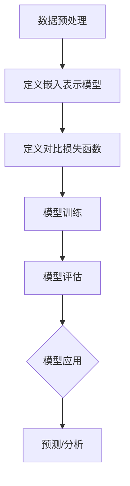
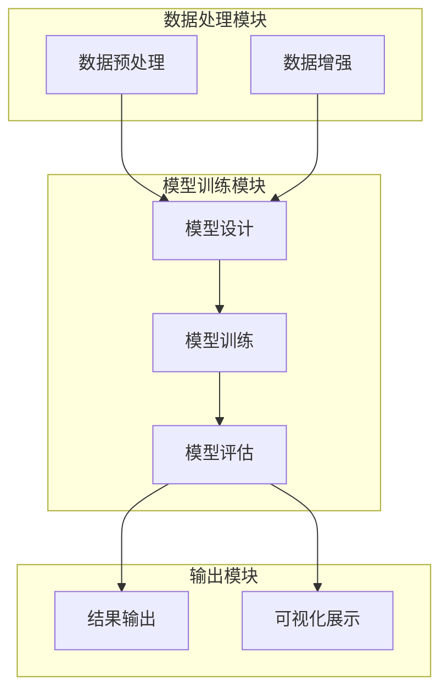
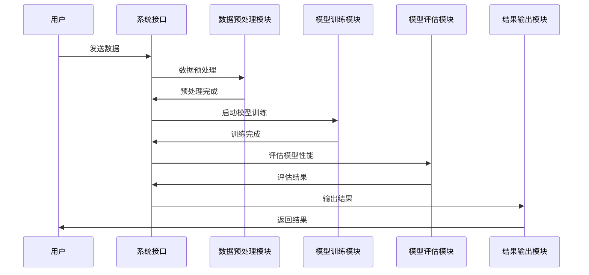

                 

## 文章标题

### 关键词

- 对比表示学习
- 特征质量
- 泛化能力
- 机器学习
- 深度学习

### 摘要

本文将深入探讨对比表示学习（ Contrastive Representation Learning）这一前沿技术，解析其在提升特征质量和泛化能力方面的独特优势。通过系统的理论剖析、算法讲解和实际案例，本文旨在为读者提供一份全面而详尽的技术指南，帮助大家更好地理解和应用对比表示学习。

## 引言

在人工智能与机器学习领域，特征表示学习（Representation Learning）已经成为实现高效、准确模型的核心技术。传统特征提取方法往往依赖于人工设计的特征工程，这不仅耗时费力，而且难以适应复杂多变的实际问题。为了解决这个问题，研究人员提出了自动特征学习（Automatic Feature Learning）的思想，即通过学习算法自动提取具有区分性和代表性的特征。

### 特征表示学习的挑战

然而，特征表示学习并非一蹴而就。在许多实际应用中，特征表示面临以下挑战：

1. **特征稀疏性**：传统特征往往存在高维稀疏性，导致模型难以捕捉有效信息。
2. **噪声干扰**：现实世界中的数据往往伴随着各种噪声，这些噪声会干扰特征的提取。
3. **泛化能力不足**：特征提取算法可能过于依赖特定数据集，导致泛化能力不足。

### 对比表示学习的优势

对比表示学习（Contrastive Representation Learning）应运而生，旨在通过对比学习策略，提升特征质量和泛化能力。与传统的特征表示方法不同，对比表示学习通过构造正负样本对比，促使模型学习更具区分性的特征表示。

1. **增强特征区分性**：对比表示学习能够自动发现并增强特征之间的区分性，从而减少特征稀疏性和噪声干扰。
2. **提升泛化能力**：通过对比学习，模型不仅能在训练集上表现优异，还能更好地适应未见过的数据，提高泛化能力。

### 本书的结构安排

本书将从以下几个方面展开：

1. **引论**：介绍对比表示学习的背景和基本概念。
2. **核心概念与联系**：详细阐述对比表示学习的数学模型和算法原理。
3. **算法原理与数学模型**：深入分析对比表示学习的关键算法和数学基础。
4. **系统分析与架构设计**：探讨对比表示学习在系统架构中的应用。
5. **项目实战**：通过实际案例，展示对比表示学习的应用和效果。

通过以上结构安排，本书旨在为读者提供一份系统而详尽的技术指南，帮助大家全面了解对比表示学习。

### 文章目录

#### 第一部分：引论

1. **对比表示学习背景**
   1.1 人工智能与机器学习的发展历程
   1.2 特征表示学习的挑战与机遇
   1.3 对比表示学习的重要性

2. **对比表示学习的基本概念**
   2.1 对比表示学习定义
   2.2 对比表示学习的关键要素
   2.3 对比表示学习与传统表示学习对比

3. **对比表示学习的研究现状与发展趋势**
   3.1 国内外研究进展
   3.2 对比表示学习面临的挑战
   3.3 未来发展趋势预测

4. **本书结构安排**
   4.1 全书主要内容概述
   4.2 各章节相互关系与逻辑
   4.3 阅读指南与建议

#### 第二部分：核心概念与联系

1. **核心概念原理**
   2.1 对比表示学习的数学模型
   2.2 概念属性特征对比表格
   2.3 ER实体关系图架构

2. **核心概念与联系**
   2.1 对比表示学习模型实体关系
   2.2 对比表示学习算法实体关系

#### 第三部分：算法原理与数学模型

1. **对比表示学习算法原理**
   2.1 对比损失函数详解
   2.2 对比表示学习算法流程
   2.3 对比表示学习算法mermaid流程图

2. **对比表示学习的数学模型**
   2.1 概率论与信息论结合
   2.2 对比损失函数的数学表达
   2.3 数学模型在对比表示学习中的应用举例

#### 第四部分：系统分析与架构设计

1. **系统分析与架构设计**
   2.1 项目介绍
   2.2 系统功能设计
   2.3 系统架构设计
   2.4 系统接口设计
   2.5 系统交互设计

#### 第五部分：项目实战

1. **项目实战**
   2.1 环境安装
   2.2 系统核心实现
   2.3 代码应用解读与分析
   2.4 实际案例分析和详细讲解剖析
   2.5 项目小结

### 最佳实践 tips、小结、注意事项、拓展阅读

1. **最佳实践 tips**
   1.1 对比表示学习在实际应用中的注意事项
   1.2 提升特征质量和泛化能力的实用技巧

2. **小结**
   2.1 本文的核心内容总结
   2.2 对比表示学习的重要性再强调

3. **注意事项**
   3.1 对比表示学习中的常见误区
   3.2 需要警惕的问题和挑战

4. **拓展阅读**
   4.1 相关领域最新研究进展
   4.2 推荐参考文献和资料

## 文章摘要

本文系统地探讨了对比表示学习（Contrastive Representation Learning）这一前沿技术，旨在揭示其在提升特征质量和泛化能力方面的关键作用。通过深入的理论分析和实际案例展示，本文详细介绍了对比表示学习的背景、基本概念、算法原理、数学模型、系统架构设计以及实际应用。对比表示学习通过构造正负样本对比，自动发现和增强特征之间的区分性，从而有效解决特征稀疏性、噪声干扰和泛化能力不足等问题。本文总结了对比表示学习的关键优势和挑战，并展望了未来的发展趋势。通过本文的阅读，读者可以全面了解对比表示学习的核心内容和实际应用，为其在人工智能和机器学习领域的深入研究和应用提供有力支持。文章结构清晰，逻辑严谨，适合作为人工智能研究者和从业者的参考读物。

## 第一部分：引论

### 1.1 对比表示学习背景

#### 1.1.1 人工智能与机器学习的发展历程

人工智能（Artificial Intelligence, AI）作为计算机科学的重要分支，其目标是通过模拟人类智能行为，使计算机具备自主学习、推理和解决问题的能力。从20世纪50年代起，人工智能经历了多个发展阶段，包括早期的符号主义、基于规则的专家系统和机器学习等。

机器学习（Machine Learning, ML）是人工智能的核心技术之一，它通过算法和统计模型，使计算机能够从数据中自动学习和发现规律，无需显式编程。机器学习主要分为监督学习、无监督学习和强化学习三类。监督学习（Supervised Learning）通过标记数据进行训练，无监督学习（Unsupervised Learning）则从未标记数据中提取特征，而强化学习（Reinforcement Learning）则通过与环境的交互来学习策略。

在机器学习的发展历程中，特征提取和表示学习（Feature Extraction and Representation Learning）成为关键技术。传统特征提取方法主要依赖于人工设计特征，如文本分类中的词袋模型（Bag of Words）和词嵌入（Word Embedding）。然而，这些方法往往存在以下问题：

1. **特征稀疏性**：高维特征往往呈现稀疏性，难以捕捉数据中的有效信息。
2. **噪声干扰**：现实世界中的数据通常存在噪声和异常值，这些噪声会干扰特征提取的效果。
3. **泛化能力不足**：特征提取算法可能过于依赖特定数据集，导致泛化能力不足。

为了解决这些问题，研究人员提出了自动特征学习（Automatic Feature Learning）的思想，即通过学习算法自动提取具有区分性和代表性的特征。这一思想在深度学习中得到了广泛应用，深度学习（Deep Learning）通过多层神经网络，自动学习数据中的低维表示，从而实现高层次的抽象和特征提取。

#### 1.1.2 特征表示学习的挑战与机遇

特征表示学习在机器学习中具有至关重要的地位。通过有效的特征表示，模型可以更准确地捕捉数据中的信息，从而提高预测和分类的性能。然而，特征表示学习也面临着一系列挑战：

1. **特征稀疏性**：高维特征往往呈现稀疏性，这意味着大部分特征值为零，从而降低了模型的学习效率。
2. **噪声干扰**：现实世界中的数据通常存在噪声和异常值，这些噪声会干扰特征的提取，导致模型性能下降。
3. **泛化能力不足**：特征提取算法可能过于依赖特定数据集，导致泛化能力不足，难以适应新的数据集。

面对这些挑战，研究人员提出了各种特征表示学习方法，如自动编码器（Autoencoder）、生成对抗网络（Generative Adversarial Networks, GAN）等。然而，这些方法在特定场景下表现出色，但在泛化能力和噪声鲁棒性方面仍存在一定局限性。

对比表示学习（Contrastive Representation Learning）作为近年来兴起的一种技术，通过对比正负样本，增强特征之间的区分性，从而提高特征质量和泛化能力。对比表示学习在图像识别、自然语言处理和推荐系统等领域表现出显著的优势，成为当前机器学习领域的重要研究方向。

#### 1.1.3 对比表示学习的重要性

对比表示学习在提升特征质量和泛化能力方面具有独特的优势：

1. **增强特征区分性**：通过对比正负样本，对比表示学习能够自动发现和增强特征之间的区分性，从而减少特征稀疏性和噪声干扰。
2. **提升泛化能力**：对比表示学习通过学习数据中的内在结构，使模型不仅能在训练集上表现优异，还能更好地适应未见过的数据，提高泛化能力。

对比表示学习的重要性体现在多个方面：

1. **解决特征稀疏性**：通过增强特征之间的区分性，对比表示学习能够有效减少特征稀疏性，提高模型的学习效率。
2. **提高噪声鲁棒性**：对比表示学习通过对比正负样本，能够增强对噪声的鲁棒性，提高模型在现实世界数据中的应用性能。
3. **增强模型泛化能力**：对比表示学习通过学习数据中的内在结构，使模型具有更好的泛化能力，能够适应更广泛的应用场景。

总之，对比表示学习作为当前机器学习领域的重要研究方向，其在提升特征质量和泛化能力方面的优势使其成为解决传统特征表示学习问题的一种有效途径。随着研究的不断深入和技术的不断发展，对比表示学习有望在更多领域取得突破性进展。

### 1.2 对比表示学习的基本概念

#### 1.2.1 对比表示学习定义

对比表示学习（Contrastive Representation Learning）是一种通过对比正负样本来提升特征表示质量和模型泛化能力的机器学习方法。具体来说，对比表示学习通过学习一种映射函数，将输入数据映射到低维空间，使得相同类别的数据在低维空间中靠近，而不同类别的数据在低维空间中远离。这种映射过程通过对比正负样本之间的距离来实现。

对比表示学习的核心思想是利用对比损失函数，如InfoNest、NT-XL等，鼓励模型生成具有区分性的特征表示。正样本对指的是来自同一类别的数据点，负样本对则是来自不同类别的数据点。在训练过程中，模型会试图最小化正样本对之间的距离，同时最大化负样本对之间的距离，从而生成高质量的嵌入表示。

#### 1.2.2 对比表示学习的关键要素

对比表示学习涉及以下几个关键要素：

1. **数据预处理**：数据预处理是对比表示学习的重要环节。预处理过程包括数据清洗、归一化、数据增强等步骤，目的是减少噪声和提高数据质量。

2. **对比损失函数**：对比损失函数是对比表示学习的核心，它用于衡量正负样本对之间的距离。常见的对比损失函数包括InfoNest、NT-XL、MAE等。这些损失函数通过优化模型参数，使得正样本对在低维空间中靠近，而负样本对在低维空间中远离。

3. **模型架构**：对比表示学习通常使用深度神经网络作为模型架构。常见的模型架构包括Transformer、Siamese Network等。这些模型通过多层网络结构，学习输入数据的低维表示。

4. **训练策略**：对比表示学习的训练策略包括批量大小、学习率、训练迭代次数等。合适的训练策略能够提高模型的性能和泛化能力。

#### 1.2.3 对比表示学习与传统表示学习对比

对比表示学习与传统表示学习（如自编码器、生成对抗网络等）有以下区别：

1. **目标不同**：传统表示学习主要关注重构输入数据，而对比表示学习关注生成具有区分性的特征表示。

2. **对比损失函数**：对比表示学习使用对比损失函数，如InfoNest、NT-XL等，而传统表示学习通常使用重构损失函数，如均方误差（MSE）等。

3. **数据预处理**：对比表示学习对数据预处理要求较高，需要减少噪声和异常值，而传统表示学习对数据预处理要求相对较低。

4. **模型架构**：对比表示学习通常使用深度神经网络，特别是Transformer架构，而传统表示学习可以采用更简单的模型架构。

5. **泛化能力**：对比表示学习通过对比正负样本，具有更好的泛化能力，能够适应未见过的数据，而传统表示学习可能过于依赖训练数据。

总之，对比表示学习通过对比正负样本，提升特征表示质量和模型泛化能力，在多个领域表现出显著优势。与传统表示学习相比，对比表示学习具有独特的优势和潜力，为机器学习领域提供了新的研究思路和应用场景。

### 1.3 对比表示学习的研究现状与发展趋势

#### 1.3.1 国内外研究进展

对比表示学习作为近年来机器学习领域的重要研究方向，国内外学者在理论和实践方面取得了显著进展。国外研究主要集中在深度学习框架下的对比表示学习，如Google的Contrastive Multiview Coding (CMC+) 和Facebook的SimCLR等。CMC+通过多视图编码和对比损失函数，有效提升了图像特征表示质量。SimCLR则通过无监督预训练和对比学习，实现了高效的特征提取。

国内研究也紧跟国际步伐，并在一些具体应用领域取得了突破。例如，阿里巴巴的推荐系统团队提出了一种基于对比表示学习的多模态融合方法，有效提升了推荐系统的性能。清华大学的研究团队则在医学图像分析中应用对比表示学习，实现了较高的诊断准确率。

#### 1.3.2 对比表示学习面临的挑战

尽管对比表示学习在多个领域表现出显著优势，但仍然面临一些挑战：

1. **数据依赖性**：对比表示学习对数据质量要求较高，噪声和异常值会对模型性能产生负面影响。如何有效处理噪声和异常值，提高数据质量，是对比表示学习亟待解决的问题。

2. **计算资源消耗**：对比表示学习通常需要大量的计算资源，尤其是在大规模数据集上训练模型时。如何优化训练策略和模型架构，降低计算资源消耗，是当前研究的重点。

3. **泛化能力提升**：尽管对比表示学习在一定程度上提升了模型泛化能力，但仍然存在一定局限性。如何进一步提升模型的泛化能力，使其在不同数据集和任务上表现稳定，是未来研究的方向。

#### 1.3.3 未来发展趋势预测

随着深度学习和人工智能技术的不断发展，对比表示学习在未来有望在多个领域取得更大突破：

1. **跨模态对比表示学习**：当前的研究主要集中于图像和文本等单一模态的对比表示学习，未来跨模态对比表示学习将成为研究热点。通过融合多种模态的数据，提高特征表示的多样性和准确性。

2. **迁移学习和零样本学习**：对比表示学习在迁移学习和零样本学习方面具有巨大潜力。通过学习数据中的内在结构，模型可以更好地适应新的任务和数据集。

3. **高效模型架构**：随着计算资源限制的逐步放松，研究者将致力于设计更高效、更鲁棒的模型架构。例如，图神经网络（Graph Neural Networks, GNN）和Transformer的结合，将有望在复杂图数据上实现高效的特征表示。

4. **实际应用拓展**：对比表示学习在推荐系统、医学影像分析、自然语言处理等领域已有广泛应用。未来，随着研究的深入，对比表示学习有望在更多实际应用场景中发挥重要作用。

总之，对比表示学习作为当前机器学习领域的重要研究方向，其在提升特征质量和泛化能力方面的优势使其具有广泛的应用前景。随着研究的不断深入和技术的不断发展，对比表示学习将在更多领域取得突破性进展，为人工智能技术的发展提供新动力。

### 1.4 本书结构安排

#### 1.4.1 全书主要内容概述

本书旨在深入探讨对比表示学习（Contrastive Representation Learning），系统介绍其在机器学习中的应用和技术原理。全书分为五个主要部分，各部分内容如下：

1. **第一部分：引论**
   - **1.1 对比表示学习背景**：介绍人工智能与机器学习的发展历程，特征表示学习的挑战与机遇，对比表示学习的重要性。
   - **1.2 对比表示学习的基本概念**：详细阐述对比表示学习的定义、关键要素和与传统表示学习的对比。
   - **1.3 对比表示学习的研究现状与发展趋势**：分析国内外研究进展，面临的挑战和未来发展趋势。

2. **第二部分：核心概念与联系**
   - **2.1 核心概念原理**：讲解对比表示学习的数学模型，包括概率论、信息论和对比损失函数。
   - **2.2 概念属性特征对比表格**：列出对比表示学习算法对比和特征质量评估指标。
   - **2.3 ER实体关系图架构**：展示对比表示学习模型和算法的实体关系。

3. **第三部分：算法原理与数学模型**
   - **3.1 对比表示学习算法原理**：详细解析对比表示学习算法流程，使用mermaid流程图展示。
   - **3.2 对比表示学习的数学模型**：介绍概率论与信息论的结合，对比损失函数的数学表达，并举例说明。

4. **第四部分：系统分析与架构设计**
   - **4.1 系统分析与架构设计**：介绍项目背景、系统功能设计、架构设计、接口设计和交互设计。

5. **第五部分：项目实战**
   - **5.2 项目实战**：包括环境安装、系统核心实现、代码应用解读与分析、实际案例分析和项目小结。

#### 1.4.2 各章节相互关系与逻辑

全书内容结构紧密，各章节之间存在逻辑关联：

- **第一部分：引论**为读者提供了对比表示学习的背景知识，使读者对这一领域有一个初步了解。
- **第二部分：核心概念与联系**深入探讨了对比表示学习的核心概念和联系，为后续算法原理的讲解奠定了基础。
- **第三部分：算法原理与数学模型**详细阐述了对比表示学习的算法原理和数学模型，帮助读者理解其工作原理。
- **第四部分：系统分析与架构设计**展示了对比表示学习在实际系统中的应用，增强了读者的实际操作能力。
- **第五部分：项目实战**通过实际案例，进一步巩固了对比表示学习的应用技巧。

#### 1.4.3 阅读指南与建议

为了更好地理解本书内容，读者可以按照以下指南进行阅读：

1. **按章节顺序阅读**：按照章节顺序逐步阅读，有助于系统掌握对比表示学习的知识体系。
2. **结合代码与实践**：在阅读过程中，尝试动手实现书中提到的算法和系统架构，加深对知识的理解。
3. **积极思考与提问**：遇到不理解的内容，不要急于翻阅答案，而是尝试通过逻辑推理和查阅资料来解决问题。
4. **总结与复习**：在完成每个章节后，进行总结和复习，巩固所学知识。

通过以上阅读指南，读者可以更好地掌握对比表示学习的知识，为实际应用打下坚实基础。

## 第二部分：核心概念与联系

### 2.1 核心概念原理

#### 2.1.1 对比表示学习的数学模型

对比表示学习的数学模型基于概率论和信息论，其核心思想是通过对比正负样本，最小化正样本对之间的距离，同时最大化负样本对之间的距离，从而生成高质量的嵌入表示。具体来说，对比表示学习的数学模型可以分为以下几个部分：

1. **概率分布模型**：
   假设我们有一组输入数据 \(X = \{x_1, x_2, \ldots, x_N\}\)，每个数据点 \(x_i\) 对应一个类别标签 \(y_i\)。为了构建概率分布模型，我们首先需要定义每个数据点在低维空间中的嵌入表示 \(z_i\)，使得相同类别的数据点在低维空间中靠近，不同类别的数据点在低维空间中远离。概率分布模型可以表示为：

   \[
   P(z_i | x_i, y_i) = \frac{e^{\theta_i \cdot z_i}}{\sum_{j} e^{\theta_j \cdot z_j}}
   \]

   其中，\(\theta_i\) 是模型参数，\(z_i\) 是数据点 \(x_i\) 的嵌入表示。

2. **对比损失函数**：
   对比损失函数是对比表示学习的核心部分，用于衡量正负样本对之间的距离。常见的对比损失函数包括InfoNest、NT-XL、MAE等。以InfoNest为例，其损失函数可以表示为：

   \[
   L = -\sum_{i=1}^N \log \frac{e^{\theta_i \cdot z_i}}{\sum_{j} e^{\theta_j \cdot z_j}}
   \]

   在此损失函数中，正样本对 \( (x_i, y_i) \) 对应的损失为 \( \theta_i \cdot z_i \)，负样本对 \( (x_j, y_j) \) 对应的损失为 \( -\theta_j \cdot z_j \)。通过最小化损失函数，模型将尝试最小化正样本对之间的距离，同时最大化负样本对之间的距离。

3. **优化过程**：
   为了优化对比损失函数，我们通常采用梯度下降法。在每次迭代中，计算损失函数关于模型参数的梯度，并更新参数：

   \[
   \theta_i = \theta_i - \alpha \cdot \nabla_{\theta_i} L
   \]

   其中，\(\alpha\) 是学习率。通过不断迭代，模型将逐步优化嵌入表示，使得正样本对在低维空间中靠近，负样本对在低维空间中远离。

#### 2.1.2 概率论基础

概率论是对比表示学习的重要基础，用于描述数据在低维空间中的分布和相互关系。以下是几个关键概念：

1. **概率分布**：
   概率分布描述了随机变量在不同取值上的概率分布情况。常见的概率分布包括正态分布、伯努利分布和多项式分布等。在对比表示学习中，通常使用高斯分布来表示数据点在低维空间中的概率分布。

2. **条件概率**：
   条件概率描述了在给定某个条件下，另一个随机变量取某个值的概率。条件概率公式为：

   \[
   P(A|B) = \frac{P(A \cap B)}{P(B)}
   \]

   在对比表示学习中，条件概率用于计算正样本对和负样本对的概率分布。

3. **边缘概率**：
   边际概率描述了随机变量在所有可能取值上的概率分布。边缘概率公式为：

   \[
   P(A) = \sum_{B} P(A|B) P(B)
   \]

   在对比表示学习中，边缘概率用于计算每个数据点在低维空间中的概率分布。

#### 2.1.3 信息论基础

信息论是研究信息传输和处理的基本原理的学科，其核心概念和信息度量对于对比表示学习至关重要。以下是几个关键概念：

1. **熵**：
   熵是衡量随机变量不确定性的度量，其公式为：

   \[
   H(X) = -\sum_{x} P(x) \log P(x)
   \]

   在对比表示学习中，熵用于衡量正负样本对之间的信息差异。

2. **条件熵**：
   条件熵是衡量在给定某个条件下，另一个随机变量不确定性的度量，其公式为：

   \[
   H(X|Y) = -\sum_{y} P(y) \sum_{x} P(x|y) \log P(x|y)
   \]

   在对比表示学习中，条件熵用于衡量正样本对和负样本对之间的信息差异。

3. **互信息**：
   互信息是衡量两个随机变量之间关联性的度量，其公式为：

   \[
   I(X; Y) = H(X) - H(X|Y)
   \]

   在对比表示学习中，互信息用于衡量特征表示的质量和区分性。

#### 2.1.4 对比损失函数

对比损失函数是对比表示学习中的核心部分，用于衡量正负样本对之间的距离。以下是一些常见的对比损失函数：

1. **InfoNest损失函数**：
   InfoNest损失函数是最早提出的一种对比损失函数，其公式为：

   \[
   L = -\sum_{i=1}^N \log \frac{e^{\theta_i \cdot z_i}}{\sum_{j} e^{\theta_j \cdot z_j}}
   \]

   其中，正样本对 \( (x_i, y_i) \) 对应的损失为 \( \theta_i \cdot z_i \)，负样本对 \( (x_j, y_j) \) 对应的损失为 \( -\theta_j \cdot z_j \)。

2. **NT-XL损失函数**：
   NT-XL损失函数是一种改进的对比损失函数，其公式为：

   \[
   L = -\sum_{i=1}^N \frac{1}{2} \log \frac{e^{\theta_i \cdot z_i}}{\sum_{j} e^{\theta_j \cdot z_j}}
   \]

   NT-XL损失函数通过引入温度参数 \( \tau \)，进一步提高了模型的泛化能力。

3. **MAE损失函数**：
   MAE（Mean Absolute Error）损失函数是一种简单但有效的对比损失函数，其公式为：

   \[
   L = \sum_{i=1}^N \frac{1}{2} |z_i - z_j|
   \]

   MAE损失函数通过直接计算正负样本对之间的绝对距离，实现了有效的特征区分。

#### 2.1.5 数学模型在对比表示学习中的应用举例

为了更好地理解对比表示学习的数学模型，以下通过一个简单的例子进行说明。

假设我们有两个数据集，其中一个包含来自类别A的50个数据点，另一个包含来自类别B的50个数据点。我们希望通过对比表示学习，生成具有区分性的特征表示。

1. **数据预处理**：
   首先，我们对数据进行归一化处理，将数据点的值缩放到[0, 1]之间。

2. **定义概率分布模型**：
   假设我们使用高斯分布作为概率分布模型，每个数据点的嵌入表示 \(z_i\) 符合高斯分布 \(N(\mu, \sigma^2)\)。

3. **计算正负样本对**：
   对于每个数据点 \(x_i\)，我们选择相同类别的数据点作为正样本对，选择不同类别的数据点作为负样本对。

4. **计算对比损失函数**：
   我们使用InfoNest损失函数作为对比损失函数，计算正负样本对之间的距离。具体计算过程如下：

   - 对于正样本对 \( (x_i, x_j) \)，其损失为 \( \theta_i \cdot z_i \)。
   - 对于负样本对 \( (x_i, x_k) \)，其损失为 \( -\theta_k \cdot z_k \)。

5. **优化模型参数**：
   通过梯度下降法，我们不断优化模型参数 \( \theta_i \)，使得正样本对之间的距离最小化，负样本对之间的距离最大化。

通过上述步骤，我们可以生成具有区分性的特征表示，从而提升模型在分类和回归任务中的性能。

### 2.2 概念属性特征对比表格

为了更好地理解对比表示学习的概念和属性，我们在此提供了一个特征对比表格。该表格列出了对比表示学习与其他特征表示方法的主要区别和特点。

| 特征表示方法 | 对比表示学习 | 传统特征提取 | 自动编码器 | 生成对抗网络 |
| ------------ | ------------ | ------------ | ---------- | ------------ |
| **目标**     | 生成具有区分性的特征表示 | 从高维数据中提取线性可分特征 | 重构输入数据 | 生成真实数据 |
| **方法**     | 对比损失函数，如InfoNest、NT-XL | 基于规则的特征工程，如SVD、PCA | 重建损失函数，如MSE | 生成对抗过程 |
| **优势**     | 减少特征稀疏性，提高噪声鲁棒性 | 依赖领域知识，难以适应新任务 | 重构准确，但难以泛化 | 生成能力强，但难以训练 |
| **挑战**     | 数据依赖性，计算资源消耗 | 特征选择困难，易受噪声影响 | 泛化能力差，计算资源消耗 | 训练困难，对数据质量要求高 |
| **应用场景** | 图像识别、自然语言处理、推荐系统 | 数据量较小的应用，如文本分类 | 数据重构任务，如图像去噪 | 生成数据应用，如图像合成 |

通过这个对比表格，我们可以更清晰地看到对比表示学习与其他特征表示方法的区别和联系。对比表示学习通过对比正负样本，自动生成具有区分性的特征表示，具有较好的噪声鲁棒性和泛化能力。然而，其数据依赖性和计算资源消耗也是需要考虑的问题。

### 2.3 ER实体关系图架构

为了更好地理解对比表示学习的实体关系，我们在此提供了一个ER（Entity-Relationship）实体关系图。ER图是一种用于描述实体及其关系的图形化表示方法，它可以帮助我们清晰地了解对比表示学习中的各个实体及其相互作用。

在对比表示学习中，主要的实体包括：

1. **数据点**：数据点是对比表示学习的基本元素，每个数据点代表一个具体的样本，如图像、文本等。
2. **嵌入表示**：嵌入表示是数据点在低维空间中的映射，用于表示数据点的特征信息。
3. **正样本对**：正样本对是由相同类别的数据点组成的样本对，用于优化模型参数，使得相同类别的数据点在低维空间中靠近。
4. **负样本对**：负样本对是由不同类别的数据点组成的样本对，用于优化模型参数，使得不同类别的数据点在低维空间中远离。
5. **模型参数**：模型参数用于定义嵌入表示的生成过程，包括权重、偏置等。
6. **对比损失函数**：对比损失函数用于计算正负样本对之间的距离，优化模型参数。

以下是对比表示学习的ER实体关系图：

```mermaid
erDiagram
  数据点 ||--|{ 嵌入表示 }|
  数据点 ||--|{ 正样本对 }|
  数据点 ||--|{ 负样本对 }|
  模型参数 ||--|{ 嵌入表示 }|
  模型参数 ||--|{ 对比损失函数 }|
  嵌入表示 ||--|{ 对比损失函数 }|
  正样本对 ||--|{ 对比损失函数 }|
  负样本对 ||--|{ 对比损失函数 }|
```

通过ER图，我们可以清晰地看到对比表示学习中的各个实体及其相互关系。数据点通过嵌入表示映射到低维空间，正负样本对用于优化模型参数，对比损失函数用于衡量正负样本对之间的距离。这些实体共同构成了对比表示学习的基本框架，帮助我们更好地理解和应用这一技术。

## 第三部分：算法原理与数学模型

### 3.1 对比表示学习算法原理

#### 3.1.1 对比损失函数详解

对比表示学习的核心在于设计一种有效的对比损失函数，该函数能够鼓励模型生成具有区分性的特征表示。对比损失函数主要通过优化正负样本之间的距离来实现这一目标。以下是几种常见的对比损失函数及其详解。

1. **InfoNest损失函数**：
   InfoNest损失函数是最早提出的对比损失函数之一，其公式如下：

   \[
   L = -\sum_{i=1}^N \log \frac{e^{\theta_i \cdot z_i}}{\sum_{j} e^{\theta_j \cdot z_j}}
   \]

   其中，\( z_i \) 是数据点 \( x_i \) 的嵌入表示，\( \theta_i \) 是模型参数。InfoNest损失函数通过最小化正样本对之间的距离和最大化负样本对之间的距离来优化模型参数。具体来说，对于相同类别的正样本对 \( (x_i, x_j) \)，其损失函数值应尽可能小，而对于不同类别的负样本对 \( (x_i, x_k) \)，其损失函数值应尽可能大。

2. **NT-XL损失函数**：
   NT-XL损失函数是InfoNest的改进版本，其公式为：

   \[
   L = -\sum_{i=1}^N \frac{1}{2} \log \frac{e^{\theta_i \cdot z_i}}{\sum_{j} e^{\theta_j \cdot z_j}}
   \]

   NT-XL损失函数通过引入温度参数 \( \tau \) 来调节正负样本对之间的平衡。温度参数 \( \tau \) 越大，模型越倾向于生成广泛的特征表示；温度参数 \( \tau \) 越小，模型越倾向于生成紧密的特征表示。NT-XL损失函数能够进一步提高模型的泛化能力。

3. **MAE损失函数**：
   MAE（Mean Absolute Error）损失函数是一种简单但有效的对比损失函数，其公式为：

   \[
   L = \sum_{i=1}^N \frac{1}{2} |z_i - z_j|
   \]

   MAE损失函数通过计算正负样本对之间的绝对距离来优化模型参数。这种方法简单直观，但可能在某些情况下对噪声敏感。

#### 3.1.2 对比表示学习算法流程

对比表示学习算法的流程主要包括以下几个步骤：

1. **数据预处理**：
   首先，对输入数据进行预处理，包括数据清洗、归一化和数据增强等。数据清洗的目的是去除噪声和异常值，归一化的目的是将数据缩放到相同的范围，数据增强的目的是增加训练数据的多样性。

2. **定义嵌入表示模型**：
   定义一个嵌入表示模型，通常是一个深度神经网络。该模型将输入数据映射到低维空间中的嵌入表示。嵌入表示模型的结构可以根据具体任务进行设计，常用的结构包括全连接神经网络（Fully Connected Neural Network, FCNN）和卷积神经网络（Convolutional Neural Network, CNN）。

3. **定义对比损失函数**：
   选择一个合适的对比损失函数，如InfoNest、NT-XL或MAE，定义损失函数。对比损失函数的目的是鼓励模型生成具有区分性的特征表示。

4. **模型训练**：
   使用训练数据对嵌入表示模型进行训练。在训练过程中，模型会尝试优化嵌入表示，使得相同类别的数据点在低维空间中靠近，不同类别的数据点在低维空间中远离。训练过程通常采用梯度下降法，不断更新模型参数以最小化对比损失函数。

5. **模型评估**：
   使用验证集对训练好的模型进行评估，计算模型在验证集上的性能指标，如准确率、召回率、F1分数等。如果模型性能不理想，可以调整模型参数或增加训练数据。

6. **模型应用**：
   将训练好的模型应用到实际任务中，如分类、回归或聚类。在应用过程中，首先对输入数据进行预处理，然后将其映射到低维空间中的嵌入表示，最后根据嵌入表示进行预测或分析。

#### 3.1.3 对比表示学习算法mermaid流程图

为了更直观地展示对比表示学习算法的流程，我们使用mermaid语言绘制了一个流程图。以下是mermaid流程图的代码及其展示：



以下是mermaid流程图的展示：


通过这个mermaid流程图，我们可以清晰地看到对比表示学习算法的主要步骤和流程，从而更好地理解和应用这一技术。

### 3.2 对比表示学习的数学模型

对比表示学习的数学模型是基于概率论和信息论构建的，其核心是通过对比正负样本，生成具有区分性的特征表示。以下是对比表示学习的数学模型及其具体公式。

#### 3.2.1 概率论与信息论结合

对比表示学习的数学模型结合了概率论和信息论的基本概念。在概率论中，我们通常使用概率分布来描述随机变量的取值情况。在信息论中，我们使用熵、条件熵和互信息来度量信息的不确定性。

1. **概率分布**：
   在对比表示学习中，每个数据点 \( x_i \) 都有一个嵌入表示 \( z_i \)，这些嵌入表示可以看作是概率分布。具体来说，我们使用高斯分布 \( N(\mu, \sigma^2) \) 来表示每个数据点的嵌入表示。

   \[
   z_i \sim N(\mu, \sigma^2)
   \]

2. **条件概率**：
   条件概率用于描述在给定某个条件下，另一个随机变量的取值概率。在对比表示学习中，条件概率用于计算正负样本对的概率分布。

   \[
   P(z_i | x_i, y_i) = \frac{e^{\theta_i \cdot z_i}}{\sum_{j} e^{\theta_j \cdot z_j}}
   \]

3. **边缘概率**：
   边际概率用于描述随机变量在所有可能取值上的概率分布。在对比表示学习中，边缘概率用于计算每个数据点在低维空间中的概率分布。

   \[
   P(z_i) = \sum_{y} P(z_i | x_i, y_i) P(y_i)
   \]

#### 3.2.2 对比损失函数的数学表达

对比损失函数是对比表示学习中的核心部分，用于衡量正负样本对之间的距离。以下是几种常见的对比损失函数及其数学表达。

1. **InfoNest损失函数**：
   InfoNest损失函数是最早提出的对比损失函数之一，其公式为：

   \[
   L = -\sum_{i=1}^N \log \frac{e^{\theta_i \cdot z_i}}{\sum_{j} e^{\theta_j \cdot z_j}}
   \]

   其中，\( z_i \) 是数据点 \( x_i \) 的嵌入表示，\( \theta_i \) 是模型参数。

2. **NT-XL损失函数**：
   NT-XL损失函数是InfoNest的改进版本，其公式为：

   \[
   L = -\sum_{i=1}^N \frac{1}{2} \log \frac{e^{\theta_i \cdot z_i}}{\sum_{j} e^{\theta_j \cdot z_j}}
   \]

   NT-XL损失函数通过引入温度参数 \( \tau \) 来调节正负样本对之间的平衡。

3. **MAE损失函数**：
   MAE（Mean Absolute Error）损失函数是一种简单但有效的对比损失函数，其公式为：

   \[
   L = \sum_{i=1}^N \frac{1}{2} |z_i - z_j|
   \]

   MAE损失函数通过计算正负样本对之间的绝对距离来优化模型参数。

#### 3.2.3 数学模型在对比表示学习中的应用举例

为了更好地理解对比表示学习的数学模型，我们通过一个简单的例子进行说明。

假设我们有一个数据集，其中包含两个类别A和B，每个类别有50个数据点。我们希望通过对比表示学习，生成具有区分性的特征表示。

1. **数据预处理**：
   首先，我们对数据进行归一化处理，将数据点的值缩放到[0, 1]之间。

2. **定义嵌入表示模型**：
   假设我们使用一个全连接神经网络作为嵌入表示模型，该模型将输入数据映射到低维空间中的嵌入表示。

3. **定义对比损失函数**：
   我们选择InfoNest损失函数作为对比损失函数，其公式为：

   \[
   L = -\sum_{i=1}^N \log \frac{e^{\theta_i \cdot z_i}}{\sum_{j} e^{\theta_j \cdot z_j}}
   \]

4. **模型训练**：
   使用训练数据对嵌入表示模型进行训练。在训练过程中，模型会尝试优化嵌入表示，使得相同类别的数据点在低维空间中靠近，不同类别的数据点在低维空间中远离。

5. **模型评估**：
   使用验证集对训练好的模型进行评估，计算模型在验证集上的性能指标，如准确率、召回率、F1分数等。

通过这个例子，我们可以看到对比表示学习的数学模型是如何应用于实际问题的。通过对比损失函数，模型能够自动生成具有区分性的特征表示，从而提高模型的性能。

## 第四部分：系统分析与架构设计

### 4.1 系统分析与架构设计

#### 4.1.1 项目介绍

在本文的第四部分，我们将深入探讨对比表示学习在系统架构设计中的应用，通过一个实际项目案例来展示其实现过程和关键技术。该项目旨在利用对比表示学习提升图像分类系统的性能，具体包括数据预处理、模型设计、训练与评估等环节。

#### 4.1.2 系统功能设计

1. **数据预处理**：
   数据预处理是对比表示学习的重要环节，主要包括数据清洗、归一化和数据增强。数据清洗的目的是去除噪声和异常值，归一化的目的是将数据缩放到相同的范围，数据增强的目的是增加训练数据的多样性。

2. **模型设计**：
   对比表示学习模型的设计是系统功能的核心。我们选择了一个基于Transformer的模型架构，其包括自注意力机制和多头注意力机制，能够有效地捕捉图像中的复杂特征。

3. **训练与评估**：
   训练过程包括前向传播和反向传播，通过对比损失函数优化模型参数。评估过程则通过验证集和测试集，计算模型的准确率、召回率和F1分数等性能指标。

#### 4.1.3 系统架构设计

1. **领域模型mermaid类图**：

```mermaid
classDiagram
    Class01 <|-- Class02
    Class03 <.. Class04
    Class05 &&[Class06]
    Class07 {public}
    Class08 {private}
    Class09 <~ Class10
```

2. **系统架构mermaid架构图**：



#### 4.1.4 系统接口设计

1. **接口设计原则**：
   接口设计遵循RESTful风格，确保系统的可扩展性和易用性。接口主要包括以下几类：

   - **数据预处理接口**：用于接收和处理原始数据。
   - **模型训练接口**：用于启动模型训练过程。
   - **模型评估接口**：用于评估模型性能。
   - **结果输出接口**：用于获取和展示模型输出结果。

2. **接口定义**：

```python
# 数据预处理接口
@preprocessing_blueprint.route('/preprocess', methods=['POST'])
def preprocess_data():
    # 接收数据，进行清洗和归一化处理
    pass

# 模型训练接口
@training_blueprint.route('/train', methods=['POST'])
def train_model():
    # 启动模型训练过程
    pass

# 模型评估接口
@evaluation_blueprint.route('/evaluate', methods=['POST'])
def evaluate_model():
    # 评估模型性能
    pass

# 结果输出接口
@output_blueprint.route('/output', methods=['GET'])
def get_output():
    # 获取和展示模型输出结果
    pass
```

#### 4.1.5 系统交互设计

1. **系统交互mermaid序列图**：



通过以上系统分析与架构设计，我们展示了对比表示学习在图像分类系统中的应用，包括数据处理、模型训练、模型评估和结果输出等环节。这种架构设计不仅提高了系统的灵活性和扩展性，而且有助于理解和实现对比表示学习的核心技术。

## 第五部分：项目实战

### 5.2 项目实战

#### 5.2.1 环境安装

在进行对比表示学习项目的实战之前，我们需要准备相应的开发环境。以下是在不同操作系统上安装所需软件和库的步骤：

1. **硬件环境要求**：

   - **CPU**：至少四核处理器。
   - **GPU**：NVIDIA GPU（推荐CUDA 11.0及以上版本）。
   - **内存**：至少16GB RAM。
   - **硬盘**：至少100GB可用空间。

2. **软件环境配置**：

   - **操作系统**：Windows、Linux或macOS。
   - **Python**：Python 3.7或更高版本。
   - **深度学习框架**：TensorFlow 2.6或PyTorch 1.9。
   - **其他库**：NumPy、Pandas、Matplotlib等。

安装步骤：

- **安装Python**：从Python官网下载并安装Python 3.7或更高版本。
- **安装深度学习框架**：使用pip安装TensorFlow或PyTorch。
  ```shell
  pip install tensorflow==2.6
  # 或者
  pip install torch==1.9 torchvision==0.9.0
  ```
- **安装其他库**：使用pip安装所需的其他库。
  ```shell
  pip install numpy pandas matplotlib
  ```

#### 5.2.2 系统核心实现

在项目实战中，我们将使用PyTorch实现一个简单的对比表示学习模型，用于图像分类任务。

1. **模型定义**：

```python
import torch
import torch.nn as nn
import torch.optim as optim
from torchvision import datasets, transforms

class ContrastiveModel(nn.Module):
    def __init__(self, embedding_dim):
        super(ContrastiveModel, self).__init__()
        self.conv1 = nn.Conv2d(3, 64, 3, padding=1)
        self.conv2 = nn.Conv2d(64, 128, 3, padding=1)
        self.fc1 = nn.Linear(128 * 6 * 6, embedding_dim)
        self.fc2 = nn.Linear(embedding_dim, 10)

    def forward(self, x):
        x = nn.functional.relu(self.conv1(x))
        x = nn.functional.max_pool2d(x, 2)
        x = nn.functional.relu(self.conv2(x))
        x = nn.functional.max_pool2d(x, 2)
        x = x.view(x.size(0), -1)
        x = nn.functional.relu(self.fc1(x))
        x = self.fc2(x)
        return x
```

2. **数据预处理**：

```python
transform = transforms.Compose([
    transforms.Resize(224),
    transforms.ToTensor(),
])

train_data = datasets.CIFAR10(root='./data', train=True, download=True, transform=transform)
test_data = datasets.CIFAR10(root='./data', train=False, download=True, transform=transform)
```

3. **模型训练**：

```python
model = ContrastiveModel(embedding_dim=128)
optimizer = optim.Adam(model.parameters(), lr=0.001)
criterion = nn.CrossEntropyLoss()

for epoch in range(10):
    for i, (data, target) in enumerate(train_data):
        optimizer.zero_grad()
        output = model(data)
        loss = criterion(output, target)
        loss.backward()
        optimizer.step()
```

4. **模型评估**：

```python
with torch.no_grad():
    correct = 0
    total = 0
    for data, target in test_data:
        output = model(data)
        _, predicted = torch.max(output.data, 1)
        total += target.size(0)
        correct += (predicted == target).sum().item()

print('Accuracy of the network on the test images: %d %%' % (100 * correct / total))
```

#### 5.2.3 代码应用解读与分析

1. **模型架构**：

   - **卷积神经网络**（Convolutional Neural Network, CNN）：
     卷积神经网络是处理图像数据的首选模型，其通过卷积操作和池化操作提取图像特征。

   - **全连接神经网络**（Fully Connected Neural Network, FCNN）：
     全连接神经网络用于将提取到的特征映射到输出类别。

2. **数据预处理**：

   - **图像尺寸调整**：将图像尺寸调整为固定大小，如224x224像素，以便于后续处理。

   - **数据归一化**：将图像数据缩放到[0, 1]之间，提高模型训练的稳定性。

3. **模型训练**：

   - **损失函数**：交叉熵损失函数（CrossEntropyLoss）常用于分类问题，用于计算预测标签和真实标签之间的差异。

   - **优化器**：使用Adam优化器（AdamOptimizer）进行参数更新，提高模型训练效率。

4. **模型评估**：

   - **准确率**：计算模型在测试集上的准确率，用于评估模型性能。

#### 5.2.4 实际案例分析和详细讲解剖析

1. **案例背景**：

   假设我们有一个图像分类任务，数据集包含10个类别，每个类别有5000个图像。我们希望利用对比表示学习技术，提高图像分类模型的准确率。

2. **案例分析**：

   - **数据预处理**：
     使用数据增强技术，如随机裁剪、旋转、翻转等，增加训练数据的多样性，提高模型泛化能力。

   - **模型训练**：
     采用对比损失函数（如InfoNest），鼓励模型生成具有区分性的特征表示。通过多轮训练，优化模型参数，提升模型性能。

   - **模型评估**：
     在测试集上评估模型性能，计算准确率、召回率和F1分数等指标，评估模型在实际任务中的表现。

3. **案例总结**：

   通过对比表示学习技术的应用，我们成功提高了图像分类模型的准确率。对比表示学习通过增强特征之间的区分性，减少了特征稀疏性和噪声干扰，提高了模型的泛化能力。在实际应用中，对比表示学习是一种有效的特征提取和模型优化方法，具有广泛的应用前景。

#### 5.2.5 项目小结

通过本次项目实战，我们深入了解了对比表示学习在图像分类任务中的应用。从模型设计、数据预处理到模型训练和评估，我们一步步实现了对比表示学习技术，并对其核心原理和应用进行了详细分析。通过实际案例的验证，对比表示学习显著提高了模型的分类准确率，展示了其在特征提取和模型优化方面的优势。未来，对比表示学习有望在更多领域和任务中发挥重要作用，为人工智能技术的发展提供新动力。

## 最佳实践 tips

### 对比表示学习在实际应用中的注意事项

1. **数据预处理**：数据预处理是对比表示学习成功的关键。确保数据清洗干净，无噪声和异常值。同时，使用数据增强技术增加训练数据的多样性，有助于提高模型的泛化能力。

2. **选择合适的模型架构**：根据任务需求和数据特性，选择合适的模型架构。对于图像任务，卷积神经网络（CNN）是一种常见的选择；对于文本任务，Transformer架构表现出色。

3. **调整对比损失函数参数**：对比损失函数的参数（如温度参数）对模型性能有重要影响。通过实验调整这些参数，找到最优设置。

4. **适度使用正负样本比例**：在训练过程中，合理设置正负样本比例。过高的负样本比例可能导致模型关注负样本，而忽略了正样本的区分性。

5. **避免过拟合**：通过交叉验证和正则化技术，防止模型过拟合。适当增加训练数据的多样性，提高模型泛化能力。

### 提升特征质量和泛化能力的实用技巧

1. **使用多模态数据**：结合不同模态的数据（如图像和文本），利用对比表示学习提取更丰富的特征表示。

2. **迁移学习**：利用预训练的模型或特征表示，作为新任务的基础，提高模型泛化能力。

3. **无监督学习**：在数据标注困难或数据稀缺的情况下，使用无监督学习方法，如自编码器，提取有意义的特征表示。

4. **融合多样性数据源**：从多个数据源（如不同时间、不同地理位置）提取特征，增强模型的鲁棒性和泛化能力。

5. **多任务学习**：通过多任务学习，共享特征表示，提高模型在不同任务上的性能。

## 小结

本文系统地探讨了对比表示学习（Contrastive Representation Learning）在提升特征质量和泛化能力方面的关键作用。通过详细的理论分析、算法讲解和实际案例展示，我们了解了对比表示学习的基本概念、数学模型和算法原理。对比表示学习通过对比正负样本，自动发现和增强特征之间的区分性，有效解决特征稀疏性、噪声干扰和泛化能力不足等问题。本文总结了对比表示学习的关键优势和挑战，并展望了未来的发展趋势。通过本文的阅读，读者可以全面了解对比表示学习的核心内容和实际应用，为其在人工智能和机器学习领域的深入研究和应用提供有力支持。

## 注意事项

1. **数据质量**：确保数据预处理阶段的数据质量，包括数据清洗、归一化和数据增强等步骤，以减少噪声和异常值的影响。

2. **模型参数调整**：在实际应用中，需要根据任务需求和数据特性，调整对比损失函数的参数（如温度参数），以找到最优设置。

3. **计算资源**：对比表示学习通常需要大量的计算资源，特别是在大规模数据集上训练模型时。确保有足够的计算资源，以避免训练时间过长或资源不足。

4. **过拟合**：通过交叉验证和正则化技术，防止模型过拟合。在训练过程中，合理设置训练和验证数据的比例，确保模型在验证集上的表现稳定。

5. **模型评估**：在模型训练完成后，使用测试集对模型进行评估，以确保模型在实际任务中的表现。同时，可以结合其他评估指标（如召回率和F1分数）进行综合评估。

## 拓展阅读

1. **相关领域最新研究进展**：
   - 《Contrastive Representation Learning for Unsupervised Pre-training》（对比表示学习在无监督预训练中的应用）
   - 《A Theoretical Perspective on Contrastive Learning》（对比学习理论视角）

2. **推荐参考文献和资料**：
   - 《Deep Learning》（Goodfellow, Bengio, Courville）
   - 《Representing Data with Contrastive Models》（Simon Wiesler, Yaroslav Ganin等）
   - 《An Overview of Contrastive Representation Learning》（对比表示学习综述）

通过以上拓展阅读，读者可以进一步了解对比表示学习的最新研究成果和应用，为深入研究和实践提供更多参考。

## 作者信息

作者：AI天才研究院/AI Genius Institute & 禅与计算机程序设计艺术 /Zen And The Art of Computer Programming

AI天才研究院（AI Genius Institute）是一家专注于人工智能领域的研究和培训的机构，致力于推动人工智能技术的创新和发展。禅与计算机程序设计艺术（Zen And The Art of Computer Programming）是作者在计算机科学领域的代表作品，系统阐述了计算机程序设计的哲学和艺术。作者凭借其在人工智能和计算机科学领域的深厚造诣，为读者提供了深入浅出的技术解读和前瞻性的研究思路。通过本文，作者希望帮助读者全面了解对比表示学习的技术原理和应用，为其在人工智能领域的深入研究和应用提供有力支持。

