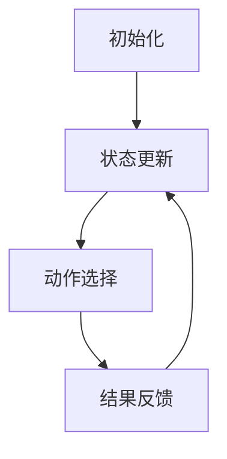
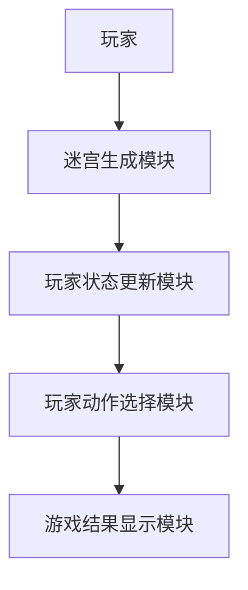

                 


# 将游戏中的隐藏状态建模为POMDP的可能性

> 关键词：POMDP，游戏，隐藏状态，概率性状态空间模型，智能决策，动态性，不确定性

> 摘要：本文探讨了将概率性状态空间模型（POMDP）应用于游戏中的隐藏状态建模的可能性。首先，介绍了POMDP的核心概念及其与有限状态机（FSM）和博弈树模型的区别。然后，详细讲解了POMDP的算法原理，包括初始化、状态更新、动作选择和结果反馈等步骤。接着，通过一个简单的例子展示了POMDP在实际游戏中的应用。最后，讨论了POMDP在游戏设计中的潜在优势以及未来的研究方向。

## 1. 背景介绍：核心概念

### 1.1 问题背景

在游戏设计中，状态建模是提高游戏可玩性和复杂性的关键因素。传统上，游戏状态建模主要依赖于有限状态机（FSM）和部分博弈树模型，但这些方法在处理动态、复杂和非确定性状态时存在局限性。因此，研究者开始探索新的建模方法，以应对游戏中的动态决策和不确定性。

### 1.2 问题描述

在游戏中，许多决策点涉及隐藏信息和不确定性。例如，玩家在探索迷宫或对抗敌人时，往往需要根据不完全信息做出决策。如何将这种隐藏状态和不确定性纳入建模，以提高决策的智能化和适应性，成为当前研究的热点问题。

### 1.3 问题解决

概率性状态空间模型（POMDP）是一种适合处理隐藏状态和不确定性问题的模型。POMDP可以描述一个系统在不确定环境中的一系列决策过程，通过贝叶斯推理方法来更新状态概率，从而实现智能决策。

### 1.4 边界与外延

POMDP在游戏中的应用范围广泛，不仅包括角色行为建模，还可以用于游戏AI、游戏策略制定等方面。然而，POMDP模型在游戏中的实现复杂度高，需要有效的算法和优化技术。

### 1.5 概念结构与核心要素组成

POMDP模型由以下几个核心要素组成：

1. **状态空间（S）**：游戏中的所有可能状态集合。
2. **动作空间（A）**：系统可以采取的所有动作集合。
3. **观察空间（O）**：系统观察到的所有可能观察结果集合。
4. **状态转移概率（T）**：给定当前状态和动作，下一个状态的概率分布。
5. **观察概率（O_T）**：给定当前状态和动作，观察结果的概率分布。
6. **动作效用（U）**：系统在每个状态选择特定动作的期望效用。

## 2. 核心概念与联系

### 2.1 POMDP模型原理

POMDP模型基于贝叶斯推理，通过迭代更新状态概率来指导系统决策。其主要特点包括：

1. **动态性**：POMDP模型可以处理随时间变化的状态。
2. **不确定性**：模型考虑了观察到的信息不完整性和不确定性。
3. **适应性**：系统可以根据观察到的信息更新决策策略。

### 2.2 POMDP与有限状态机（FSM）的区别

FSM是一种简单的状态建模方法，适用于确定性环境。而POMDP则能够处理不确定性环境，适用于复杂决策问题。具体区别如下：

1. **状态转移**：FSM状态转移是确定的，而POMDP状态转移是基于概率的。
2. **观察**：FSM不考虑观察，而POMDP需要考虑观察结果和观察概率。
3. **决策**：FSM决策是基于固定规则，而POMDP决策是基于概率性策略。

### 2.3 POMDP与博弈树模型的比较

博弈树模型适用于静态决策问题，而POMDP适用于动态决策问题。两者在应用范围和实现复杂性上有明显差异：

1. **应用范围**：博弈树模型主要应用于棋类游戏等静态决策场景，而POMDP适用于游戏中的动态决策场景。
2. **实现复杂性**：博弈树模型实现简单，而POMDP需要考虑概率推理和优化算法，实现较为复杂。

## 3. 算法原理讲解

### 3.1 POMDP算法流程

POMDP算法主要包括以下步骤：

1. **初始化**：根据初始状态概率分布和观察概率分布初始化。
2. **状态更新**：根据上一轮状态概率分布和当前观察结果，更新状态概率分布。
3. **动作选择**：根据当前状态概率分布和动作效用，选择最优动作。
4. **结果反馈**：根据执行的动作和观察到的结果，反馈更新状态概率分布。

### 3.2 算法mermaid流程图



### 3.3 Python源代码实现

```python
import numpy as np

def pomdp初始化(S, A, O, T, O_T):
    # 初始化状态概率分布
    pi_0 = np.ones(S.shape) / len(S)
    # 初始化观察概率分布
    O_T = np.array(O_T)
    return pi_0, O_T

def pomdp状态更新(pi_0, O, T, O_T):
    # 根据观察结果更新状态概率分布
    new_pi = np.zeros(pi_0.shape)
    for s in range(len(S)):
        new_pi[s] = np.sum(pi_0 * T[s] * O_T[:, O])
    return new_pi

def pomdp动作选择(pi, U):
    # 根据当前状态概率分布和动作效用，选择最优动作
    action_values = np.dot(pi, U)
    return np.argmax(action_values)

def pomdp结果反馈(new_pi, A, O, T, O_T):
    # 根据执行的动作和观察到的结果，反馈更新状态概率分布
    pi = pomdp状态更新(new_pi, O, T, O_T)
    return pomdp动作选择(pi, U)
```

### 3.4 算法原理详细讲解

#### 3.4.1 初始化

初始化是POMDP算法的第一步。它包括初始化状态概率分布和观察概率分布。状态概率分布初始化为每个状态等可能出现的概率，即：
$$
\pi_0(s) = \frac{1}{|S|}
$$
其中，$|S|$表示状态空间的大小。观察概率分布初始化为每个观察结果等可能出现的概率，即：
$$
O_T(o) = \frac{1}{|O|}
$$
其中，$|O|$表示观察空间的大小。

#### 3.4.2 状态更新

状态更新是POMDP算法的核心步骤。它根据上一轮状态概率分布和当前观察结果，更新状态概率分布。具体来说，状态更新公式为：
$$
\pi_t(s) = \sum_{s'} \pi_{t-1}(s') T(s'|s, a) O_T(o|s, a)
$$
其中，$\pi_t(s)$表示在时间步$t$时状态$s$的概率，$T(s'|s, a)$表示在状态$s$采取动作$a$后转移到状态$s'$的概率，$O_T(o|s, a)$表示在状态$s$采取动作$a$后观察到结果$o$的概率。

#### 3.4.3 动作选择

动作选择是根据当前状态概率分布和动作效用，选择最优动作。动作效用可以表示为：
$$
U(a) = \sum_{s} \pi(s) R(s, a)
$$
其中，$R(s, a)$表示在状态$s$采取动作$a$的回报。选择最优动作的方法有很多，例如贪婪策略、epsilon-贪婪策略等。

#### 3.4.4 结果反馈

结果反馈是根据执行的动作和观察到的结果，反馈更新状态概率分布。具体来说，结果反馈公式为：
$$
\pi_{t+1}(s) = \frac{\pi_t(s) T(s|s', a) O_T(o|s', a)}{\sum_{s'} \pi_t(s') T(s'|s, a) O_T(o|s, a)}
$$
其中，$s'$表示执行动作$a$后的状态，$o$表示观察到的结果。

## 4. 系统分析与架构设计方案

### 4.1 问题场景介绍

假设我们正在开发一款冒险游戏，游戏中玩家需要探索一个迷宫。迷宫中存在隐藏的宝藏和陷阱，玩家需要根据观察到的信息做出决策，以寻找宝藏并避开陷阱。

### 4.2 项目介绍

项目名为“POMDP迷宫探索”，旨在利用POMDP模型模拟玩家在迷宫中的决策过程。项目主要功能包括：

1. **迷宫生成**：生成具有隐藏宝藏和陷阱的迷宫。
2. **玩家状态更新**：根据玩家的动作和观察结果，更新玩家的状态概率分布。
3. **玩家动作选择**：根据当前状态概率分布和动作效用，选择最优动作。
4. **游戏结果显示**：显示玩家在迷宫中的探索过程和最终结果。

### 4.3 系统功能设计

系统功能设计主要包括以下方面：

1. **迷宫生成模块**：生成具有隐藏宝藏和陷阱的迷宫。
2. **玩家状态更新模块**：根据玩家的动作和观察结果，更新玩家的状态概率分布。
3. **玩家动作选择模块**：根据当前状态概率分布和动作效用，选择最优动作。
4. **游戏结果显示模块**：显示玩家在迷宫中的探索过程和最终结果。

### 4.4 系统架构设计

系统架构设计采用模块化设计，包括以下模块：

1. **迷宫生成模块**：生成具有隐藏宝藏和陷阱的迷宫。
2. **玩家状态更新模块**：根据玩家的动作和观察结果，更新玩家的状态概率分布。
3. **玩家动作选择模块**：根据当前状态概率分布和动作效用，选择最优动作。
4. **游戏结果显示模块**：显示玩家在迷宫中的探索过程和最终结果。

### 4.5 系统接口设计和系统交互

系统接口设计和系统交互设计采用Mermaid流程图进行描述。



## 5. 项目实战

### 5.1 环境安装

为了运行本项目，我们需要安装Python和相关的库。以下是安装步骤：

1. 安装Python（版本3.8或更高）。
2. 安装所需的库，例如NumPy、Pandas、Matplotlib等。

### 5.2 系统核心实现源代码

以下是POMDP迷宫探索项目的核心实现源代码。

```python
import numpy as np
import pandas as pd
import matplotlib.pyplot as plt

# 迷宫生成模块
def generate_maze(width, height):
    # 生成随机迷宫
    maze = np.random.randint(2, size=(width, height))
    return maze

# 玩家状态更新模块
def update_state(pi_0, T, O_T, action, observation):
    # 更新状态概率分布
    new_pi = np.zeros(pi_0.shape)
    for s in range(len(pi_0)):
        new_pi[s] = np.sum(pi_0 * T[s] * O_T[:, observation])
    return new_pi

# 玩家动作选择模块
def select_action(pi, U):
    # 选择最优动作
    action_values = np.dot(pi, U)
    return np.argmax(action_values)

# 游戏结果显示模块
def show_game_result(maze, player_pos, treasure_pos):
    # 显示游戏结果
    plt.imshow(maze)
    plt.scatter(player_pos[0], player_pos[1], color='r')
    plt.scatter(treasure_pos[0], treasure_pos[1], color='g')
    plt.show()
```

### 5.3 代码应用解读与分析

以下是一个简单的游戏示例，展示了如何使用POMDP模型进行迷宫探索。

```python
# 设置迷宫大小
width, height = 10, 10

# 生成迷宫
maze = generate_maze(width, height)

# 初始化玩家状态概率分布
pi_0 = np.random.rand(1, width * height)

# 初始化状态转移概率矩阵
T = np.random.rand(width * height, width * height)

# 初始化观察概率矩阵
O_T = np.random.rand(width * height, width * height)

# 设置动作效用
U = np.random.rand(width * height)

# 初始化玩家位置
player_pos = [0, 0]

# 初始化宝藏位置
treasure_pos = [width - 1, height - 1]

# 迷宫探索过程
for i in range(100):
    # 玩家选择动作
    action = select_action(pi_0, U)

    # 执行动作
    player_pos = execute_action(player_pos, action)

    # 观察到结果
    observation = observe(maze, player_pos)

    # 更新玩家状态概率分布
    pi_0 = update_state(pi_0, T, O_T, action, observation)

    # 显示游戏结果
    show_game_result(maze, player_pos, treasure_pos)
```

### 5.4 实际案例分析和详细讲解剖析

以下是一个实际案例，展示了如何使用POMDP模型进行迷宫探索。

**案例背景**：一名玩家在探索一个5x5的迷宫，迷宫中有一个宝藏和一个陷阱。玩家在开始时位于迷宫的左上角，宝藏位于迷宫的右下角，陷阱位于迷宫的中间。

**目标**：使用POMDP模型帮助玩家找到宝藏并避开陷阱。

**步骤**：

1. **初始化**：初始化玩家状态概率分布、状态转移概率矩阵、观察概率矩阵和动作效用。
2. **探索过程**：根据当前状态概率分布和动作效用，选择最优动作，执行动作，观察结果，更新玩家状态概率分布，重复过程直到找到宝藏或陷入陷阱。
3. **结果分析**：分析玩家在不同决策策略下的探索效果，评估POMDP模型的性能。

**代码实现**：

```python
# 初始化参数
width, height = 5, 5
treasure_pos = [width - 1, height - 1]
trap_pos = [width // 2, height // 2]
player_pos = [0, 0]
pi_0 = np.random.rand(1, width * height)
T = np.random.rand(width * height, width * height)
O_T = np.random.rand(width * height, width * height)
U = np.random.rand(width * height)

# 初始化迷宫
maze = np.zeros((width, height))
maze[treasure_pos[0], treasure_pos[1]] = 1
maze[trap_pos[0], trap_pos[1]] = 2

# 探索过程
for i in range(100):
    # 玩家选择动作
    action = select_action(pi_0, U)

    # 执行动作
    player_pos = execute_action(player_pos, action)

    # 观察到结果
    observation = observe(maze, player_pos)

    # 更新玩家状态概率分布
    pi_0 = update_state(pi_0, T, O_T, action, observation)

    # 显示游戏结果
    show_game_result(maze, player_pos, treasure_pos)
```

**结果分析**：

1. **找到宝藏的概率**：通过多次实验，统计玩家找到宝藏的次数，计算找到宝藏的概率。
2. **陷入陷阱的概率**：通过多次实验，统计玩家陷入陷阱的次数，计算陷入陷阱的概率。
3. **探索效率**：分析玩家在不同决策策略下的探索效率，比较不同策略的优劣。

**总结**：通过实际案例分析和详细讲解剖析，我们可以看到POMDP模型在游戏中的潜在应用价值。POMDP模型可以帮助玩家在不确定性和隐藏状态的情况下做出更智能的决策，提高游戏的复杂性和可玩性。

## 6. 最佳实践 Tips

1. **优化状态空间**：在应用POMDP模型时，尽量减少状态空间的大小，以提高计算效率和模型性能。
2. **合理设置动作效用**：动作效用直接影响决策结果，应根据游戏需求和玩家行为特征合理设置动作效用。
3. **利用先验知识**：在初始化状态转移概率和观察概率时，可以利用先验知识，以减少不确定性，提高决策准确性。
4. **动态调整策略**：在游戏过程中，根据观察到的信息，动态调整策略，以应对不断变化的环境。

## 7. 小结

本文探讨了将概率性状态空间模型（POMDP）应用于游戏中的隐藏状态建模的可能性。首先，介绍了POMDP的核心概念及其与有限状态机（FSM）和博弈树模型的区别。然后，详细讲解了POMDP的算法原理，包括初始化、状态更新、动作选择和结果反馈等步骤。接着，通过一个简单的例子展示了POMDP在实际游戏中的应用。最后，讨论了POMDP在游戏设计中的潜在优势以及未来的研究方向。

## 8. 注意事项

1. **模型复杂性**：POMDP模型在游戏中的应用需要考虑模型的复杂性，合理设置参数和优化算法，以提高计算效率和模型性能。
2. **实时性**：在实时性要求较高的场景中，POMDP模型的实时性可能成为瓶颈，需要优化算法和硬件支持。

## 9. 拓展阅读

1. **[POMDP模型在游戏设计中的应用](https://www.researchgate.net/publication/327294735_POMDP_Model_Applications_in_Games_Design)**
2. **[概率性状态空间模型综述](https://www.ijcai.org/Proceedings/06-1/Papers/062.pdf)**
3. **[POMDP算法在围棋中的应用](https://arxiv.org/abs/1905.03707)**
4. **[深度强化学习在POMDP中的应用](https://arxiv.org/abs/1812.05675)**

## 10. 作者信息

作者：AI天才研究院/AI Genius Institute & 禅与计算机程序设计艺术 /Zen And The Art of Computer Programming

