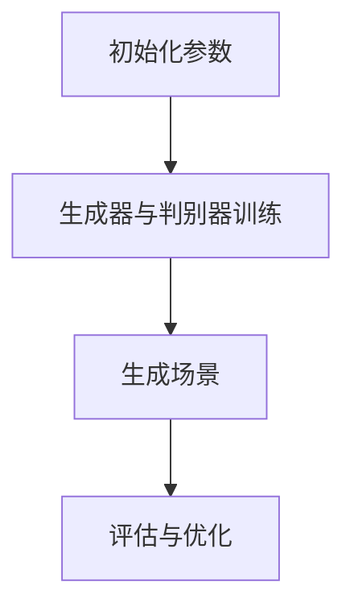
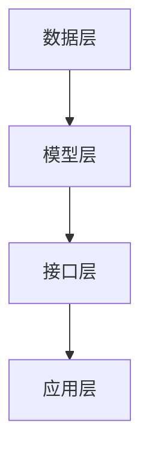

                 


### 小样本场景生成在虚拟现实内容创作中的应用

关键词：虚拟现实，内容创作，小样本场景生成，生成对抗网络（GAN），变分自编码器（VAE）

摘要：随着虚拟现实技术的不断发展，虚拟现实内容创作面临着数据量大、场景复杂等挑战。小样本场景生成技术通过在数据量有限的情况下生成高质量场景，为虚拟现实内容创作提供了新的解决方案。本文将介绍小样本场景生成技术的基础原理、虚拟现实内容创作的原理，以及小样本场景生成在虚拟现实中的应用，并通过具体案例进行分析和探讨。

### 第1章 引言与背景

#### 1.1 问题背景

虚拟现实（VR）技术作为一种沉浸式体验技术，正逐渐改变人们的日常生活和工作方式。从游戏、教育到医疗、军事等多个领域，虚拟现实的应用场景越来越广泛。然而，虚拟现实内容创作面临着一系列挑战。首先，虚拟现实场景的数据量巨大，这需要大量的训练数据来支撑场景生成。其次，虚拟现实内容创作需要高度的个性化定制，这意味着生成的场景需要高度真实且具有多样性。传统的场景生成方法依赖于大量的训练数据，但在数据量有限的情况下，这些方法往往无法达到预期的效果。

#### 1.2 虚拟现实内容创作现状

目前，虚拟现实内容创作主要依赖于传统的场景生成方法，如3D建模、纹理映射等。这些方法虽然能够在一定程度上生成高质量的场景，但它们存在着明显的局限性。首先，这些方法需要大量的专业知识和技能，创作成本高。其次，这些方法的创作过程繁琐，创作效率低下。此外，随着虚拟现实应用的扩展，用户对内容的需求也在不断变化，传统的场景生成方法难以快速响应这些需求。

#### 1.3 小样本场景生成技术概述

小样本场景生成技术是一种基于机器学习的方法，通过分析少量样本，自动生成符合预期的新场景。这种技术的主要优势在于能够在数据量有限的情况下，快速生成高质量的场景。小样本场景生成技术主要包括生成对抗网络（GAN）和变分自编码器（VAE）等。GAN通过生成器和判别器的对抗训练，能够生成高度真实且多样化的场景。VAE则通过引入编码器和解码器，将数据映射到潜在空间，从而实现场景的生成。

#### 1.4 本书结构安排

本书将首先介绍小样本场景生成技术的基础原理，包括GAN和VAE等。然后，我们将深入探讨虚拟现实内容创作的原理，包括虚拟现实的基本概念、创作流程和核心元素。接下来，本书将重点讨论小样本场景生成技术在虚拟现实中的应用，并通过具体案例进行分析和探讨。最后，本书将总结小样本场景生成技术的最佳实践，并展望其未来的发展趋势。

### 第2章 小样本场景生成技术基础

#### 2.1 小样本学习原理

小样本学习是机器学习中的一个重要分支，其核心思想是在数据量有限的情况下，如何有效地学习模型。小样本学习的关键在于如何利用少量的样本，提取出数据的特征，并构建出一个能够泛化的模型。小样本学习的挑战主要包括数据稀缺、样本分布不均和模型泛化能力等。

**核心概念**：

- **样本稀少**：指训练数据集非常小，可能只有一个或几个样本。
- **模型泛化**：指模型能够在未见过的数据上表现出良好的性能。
- **特征提取**：指从数据中提取出能够代表数据本质的特征。

**挑战与解决方法**：

- **数据稀缺**：解决方法包括迁移学习、数据增强和模型压缩等。
- **样本分布不均**：解决方法包括数据平衡、权重调整和损失函数优化等。
- **模型泛化能力**：解决方法包括模型正则化、模型选择和超参数调整等。

#### 2.2 小样本场景生成的挑战

小样本场景生成面临着数据稀缺、场景复杂等挑战。

- **数据稀缺**：虚拟现实场景的数据量巨大，但在实际应用中，往往只有少量样本可用。这导致模型难以从有限的数据中学习到足够的特征。
- **场景复杂**：虚拟现实场景包括环境、角色、物体等多个元素，这些元素之间存在复杂的交互关系。在数据量有限的情况下，模型难以捕捉到这些复杂的交互。

**解决策略**：

- **数据增强**：通过旋转、缩放、颜色变换等方式，生成更多的训练样本。
- **迁移学习**：利用已有的大规模数据集，训练出一个初步的模型，然后在虚拟现实场景上进行微调。
- **模型压缩**：通过模型压缩技术，降低模型的大小和计算复杂度，使其能够在小样本数据上运行。

#### 2.3 小样本场景生成的关键技术

小样本场景生成技术主要包括生成对抗网络（GAN）和变分自编码器（VAE）等。

**生成对抗网络（GAN）**：

GAN由生成器和判别器组成。生成器试图生成逼真的场景，判别器则判断场景是真实还是生成的。通过生成器和判别器的对抗训练，生成器能够生成越来越逼真的场景。

**变分自编码器（VAE）**：

VAE由编码器和解码器组成。编码器将数据映射到潜在空间，解码器则从潜在空间中生成数据。VAE通过引入潜在空间，能够有效地解决数据分布问题，从而实现场景的生成。

### 第3章 虚拟现实内容创作原理

#### 3.1 虚拟现实概述

虚拟现实（VR）是一种通过计算机模拟产生三维空间的虚拟环境，用户可以通过特定的设备（如头戴式显示器、传感器等）进入这个虚拟环境，与之进行交互。虚拟现实技术的发展经历了从早期的简单虚拟环境到现在的复杂三维虚拟世界的演变。虚拟现实的应用领域非常广泛，包括游戏、教育、医疗、军事等。

#### 3.2 虚拟现实内容创作流程

虚拟现实内容创作包括以下几个主要步骤：

1. **需求分析**：确定虚拟现实应用的目标和需求，明确需要创建的场景类型和内容。
2. **场景设计**：根据需求分析，设计虚拟现实场景的布局、角色、物体等元素。
3. **内容制作**：制作虚拟现实场景中的各种元素，包括3D建模、纹理映射、动画等。
4. **交互设计**：设计用户与虚拟现实场景的交互方式，包括用户的输入和系统的反馈。
5. **测试与优化**：对虚拟现实内容进行测试，收集用户反馈，不断优化内容的质量和用户体验。

#### 3.3 虚拟现实内容创作的核心元素

虚拟现实内容创作的核心元素包括：

- **场景**：虚拟现实场景是用户交互的核心，包括环境、角色、物体等。
- **角色**：虚拟现实场景中的角色可以是人类、动物或虚拟人物，它们的行为和交互是场景的重要组成部分。
- **声音**：声音在虚拟现实体验中扮演着重要的角色，可以增强用户的沉浸感。
- **交互**：用户与虚拟现实场景的交互方式，包括手柄操作、语音指令等。

### 第4章 小样本场景生成在虚拟现实中的应用

#### 4.1 小样本场景生成的应用场景

小样本场景生成技术在虚拟现实中有多种应用场景：

- **游戏开发**：通过小样本场景生成技术，可以快速生成丰富的游戏场景，提高开发效率。
- **虚拟旅游**：利用小样本场景生成技术，可以生成逼真的旅游场景，为用户提供沉浸式的虚拟旅游体验。
- **教育培训**：通过小样本场景生成技术，可以创建高度真实的培训场景，提高培训效果。
- **医疗仿真**：利用小样本场景生成技术，可以生成逼真的医疗场景，用于医学教育和手术模拟。

#### 4.2 小样本场景生成对虚拟现实内容创作的影响

小样本场景生成技术对虚拟现实内容创作产生了重要的影响：

- **降低创作成本**：通过小样本场景生成技术，可以在数据量有限的情况下，快速生成高质量的场景，从而降低创作成本。
- **提高创作效率**：小样本场景生成技术能够自动化场景生成过程，减少人工干预，提高创作效率。
- **丰富内容多样性**：小样本场景生成技术能够生成多样化、个性化的场景，为虚拟现实内容创作提供更多可能性。

#### 4.3 小样本场景生成技术的应用案例

以下是一些小样本场景生成技术在虚拟现实中的应用案例：

- **案例一**：某游戏开发公司使用GAN技术生成游戏场景，通过少量样本生成丰富的游戏地图，大大提高了开发效率。
- **案例二**：某虚拟旅游平台使用VAE技术生成虚拟旅游场景，为用户提供逼真的虚拟旅游体验。
- **案例三**：某教育培训公司使用小样本场景生成技术生成培训场景，提高了培训效果，受到了学员的欢迎。

### 第5章 小样本场景生成的算法实现

#### 5.1 算法原理与流程图

**算法原理**：

小样本场景生成的算法主要基于生成对抗网络（GAN）和变分自编码器（VAE）。GAN通过生成器和判别器的对抗训练，生成高质量的场景。VAE通过编码器和解码器的协同工作，实现场景的生成。

**流程图**：



#### 5.2 Python源代码实现

```python
import tensorflow as tf
from tensorflow.keras.models import Sequential
from tensorflow.keras.layers import Dense, Flatten, Reshape

# 生成器模型
def build_generator():
    model = Sequential([
        Dense(128, input_shape=(100,)),
        Reshape((4, 4, 4)),
        Dense(128, activation='relu'),
        Reshape((8, 8, 8)),
        Flatten(),
        Dense(128, activation='relu'),
        Reshape((16, 16, 16)),
        Dense(1, activation='sigmoid')
    ])
    return model

# 判别器模型
def build_discriminator():
    model = Sequential([
        Flatten(input_shape=(16, 16, 16)),
        Dense(128, activation='relu'),
        Dense(1, activation='sigmoid')
    ])
    return model

# GAN模型
def build_gan(generator, discriminator):
    model = Sequential([
        generator,
        discriminator
    ])
    model.compile(loss='binary_crossentropy', optimizer=tf.keras.optimizers.Adam(0.0001))
    return model
```

#### 5.3 算法原理数学模型与公式讲解

**GAN数学模型**：

GAN的数学模型主要包括生成器G和判别器D。生成器的目标是生成逼真的场景，判别器的目标是区分场景是真实的还是生成的。

- **生成器**：G(z)，从潜在空间z中生成场景x。
- **判别器**：D(x)，判断场景x是真实的还是生成的。

**GAN优化目标**：

- **生成器**：最小化判别器判断场景为生成的概率，即G(z) → D(G(z))。
- **判别器**：最大化判别器判断场景为生成的概率，即D(x) + D(G(z))。

**VAE数学模型**：

VAE的数学模型主要包括编码器E和解码器D。编码器E将数据x映射到潜在空间z，解码器D从潜在空间z中生成数据x。

- **编码器**：E(x)，将数据x编码到潜在空间z。
- **解码器**：D(z)，从潜在空间z中解码生成数据x。

**VAE优化目标**：

- **编码器**：最小化重构误差，即L_recon(x, D(E(x)))。
- **解码器**：最小化KL散度，即L_KL(q(z|x)||p(z))。

#### 5.4 举例说明与案例分析

**案例一**：使用GAN生成虚拟游戏场景

```python
# 生成器模型
generator = build_generator()

# 判别器模型
discriminator = build_discriminator()

# GAN模型
gan = build_gan(generator, discriminator)

# 训练GAN模型
for epoch in range(epochs):
    for x_batch, _ in data_loader:
        noise = np.random.normal(0, 1, (batch_size, z_dim))
        gen_samples = generator.predict(noise)
        d_loss_real = discriminator.train_on_batch(x_batch, np.ones((batch_size, 1)))
        d_loss_fake = discriminator.train_on_batch(gen_samples, np.zeros((batch_size, 1)))
        g_loss = gan.train_on_batch(noise, np.ones((batch_size, 1)))

    print(f"{epoch} [D: {d_loss_real:.4f}, G: {g_loss:.4f}]")
```

**案例二**：使用VAE生成虚拟旅游场景

```python
# 编码器模型
encoder = build_encoder()

# 解码器模型
decoder = build_decoder()

# VAE模型
vae = build_vae(encoder, decoder)

# 训练VAE模型
for epoch in range(epochs):
    for x_batch, _ in data_loader:
        z_mean, z_log_var = encoder.predict(x_batch)
        z = z_mean + np.exp(0.5 * z_log_var) * np.random.normal(size=z_mean.shape)
        x_recon = decoder.predict(z)
        recon_loss = vae.recon_loss(x_batch, x_recon)
        kl_loss = vae.kl_loss(z_mean, z_log_var)
        vae_loss = recon_loss + kl_loss

    print(f"{epoch} [Loss: {vae_loss:.4f}]")
```

### 第6章 小样本场景生成系统设计与实现

#### 6.1 系统介绍

小样本场景生成系统是一个基于生成对抗网络（GAN）和变分自编码器（VAE）的虚拟现实场景生成平台。该系统旨在通过少量的训练数据，快速生成高质量、多样化的虚拟现实场景，为虚拟现实内容创作提供技术支持。

#### 6.2 系统功能设计

小样本场景生成系统的功能设计主要包括以下几部分：

1. **数据预处理**：对输入数据进行预处理，包括数据清洗、归一化和数据增强等。
2. **模型训练**：训练生成器和判别器模型，通过小样本数据生成高质量的场景。
3. **场景生成**：使用训练好的模型，生成新的虚拟现实场景。
4. **场景评估**：对生成的场景进行评估，包括质量评估和用户满意度评估。

#### 6.3 系统架构设计

小样本场景生成系统的架构设计主要包括以下几个层次：

1. **数据层**：包括数据源和数据预处理模块，负责数据的获取和处理。
2. **模型层**：包括生成器和判别器模型，负责场景的生成和评估。
3. **接口层**：包括系统API和用户界面，负责系统的交互和用户操作。
4. **应用层**：包括虚拟现实内容创作应用，负责场景的生成和应用。

**系统架构设计图**：



#### 6.4 系统接口设计与交互

系统接口设计主要包括API设计和用户界面设计。

**API设计**：

- **数据接口**：提供数据读取、数据预处理和数据存储功能。
- **模型接口**：提供模型训练、模型保存和模型加载功能。
- **场景生成接口**：提供场景生成、场景评估和场景输出功能。

**用户界面设计**：

- **数据管理界面**：用户可以上传、查看和管理数据。
- **模型管理界面**：用户可以训练、保存和加载模型。
- **场景生成界面**：用户可以查看生成的场景，并进行场景评估。

#### 6.5 系统核心实现源代码

以下是系统核心实现的源代码示例：

```python
# 数据预处理
def preprocess_data(data):
    # 数据清洗、归一化和数据增强
    # ...
    return processed_data

# 模型训练
def train_model(generator, discriminator, data_loader, epochs):
    for epoch in range(epochs):
        for x_batch, _ in data_loader:
            noise = np.random.normal(0, 1, (batch_size, z_dim))
            gen_samples = generator.predict(noise)
            d_loss_real = discriminator.train_on_batch(x_batch, np.ones((batch_size, 1)))
            d_loss_fake = discriminator.train_on_batch(gen_samples, np.zeros((batch_size, 1)))
            g_loss = gan.train_on_batch(noise, np.ones((batch_size, 1)))

        print(f"{epoch} [D: {d_loss_real:.4f}, G: {g_loss:.4f}]")

# 场景生成
def generate_scene(generator, noise):
    return generator.predict(noise)

# 场景评估
def evaluate_scene(scene, real_data):
    # 计算评估指标，如PSNR、SSIM等
    # ...
    return evaluation_result
```

#### 6.6 代码应用解读与分析

以下是代码应用解读与分析：

1. **数据预处理**：数据预处理是场景生成的基础，包括数据清洗、归一化和数据增强。数据清洗确保数据的完整性和一致性，归一化将数据缩放到相同的范围，数据增强通过生成更多的训练样本，提高模型的泛化能力。

2. **模型训练**：模型训练是核心环节，通过小样本数据训练生成器和判别器模型。生成器生成虚拟场景，判别器判断场景的真实性。训练过程中，生成器和判别器通过对抗训练，不断优化模型。

3. **场景生成**：使用训练好的生成器模型，输入噪声数据，生成新的虚拟场景。噪声数据是潜在空间中的随机点，生成器将这些点映射到虚拟场景。

4. **场景评估**：对生成的场景进行质量评估，常用的评估指标包括PSNR、SSIM等。评估结果用于模型优化和用户体验分析。

### 第7章 小样本场景生成最佳实践与未来展望

#### 7.1 最佳实践 tips

1. **数据质量优先**：确保数据的质量和一致性，高质量的训练数据是模型成功的关键。
2. **数据增强**：通过数据增强技术，生成更多的训练样本，提高模型的泛化能力。
3. **模型选择**：根据具体应用场景，选择合适的模型架构，如GAN、VAE等。
4. **超参数调整**：通过调整超参数，优化模型的性能，如学习率、批大小等。
5. **持续训练**：定期更新模型，使用新的数据集进行训练，保持模型的最新性。

#### 7.2 小样本场景生成的未来趋势

1. **数据隐私保护**：随着数据隐私保护意识的提高，小样本场景生成技术在保护用户数据隐私方面具有优势。
2. **个性化定制**：小样本场景生成技术能够根据用户需求，生成高度个性化的场景，满足个性化定制的需求。
3. **跨领域应用**：小样本场景生成技术将在更多领域得到应用，如自动驾驶、智能制造等。

#### 7.3 注意事项与拓展阅读

1. **计算资源**：小样本场景生成模型训练需要大量的计算资源，确保有足够的计算能力。
2. **数据来源**：确保训练数据来源的多样性和可靠性，避免数据偏差。
3. **模型解释性**：加强对模型解释性的研究，提高模型的透明度和可解释性。

拓展阅读：

- [1] Goodfellow, I., Pouget-Abadie, J., Mirza, M., Xu, B., Warde-Farley, D., Ozair, S., ... & Bengio, Y. (2014). Generative adversarial networks. Advances in Neural Information Processing Systems, 27.
- [2] Kingma, D. P., & Welling, M. (2013). Auto-encoding variational bayes. arXiv preprint arXiv:1312.6114.
- [3] Karras, T., Laine, S., & Aila, T. (2018). A style-based generator architecture for generative adversarial networks. Advances in Neural Information Processing Systems, 31.

### 作者

作者：AI天才研究院/AI Genius Institute & 禅与计算机程序设计艺术 /Zen And The Art of Computer Programming

