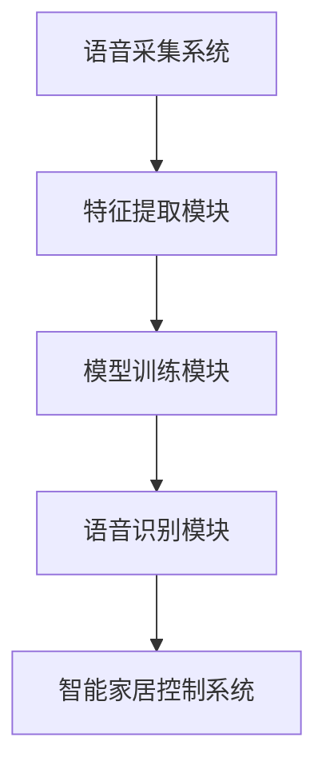
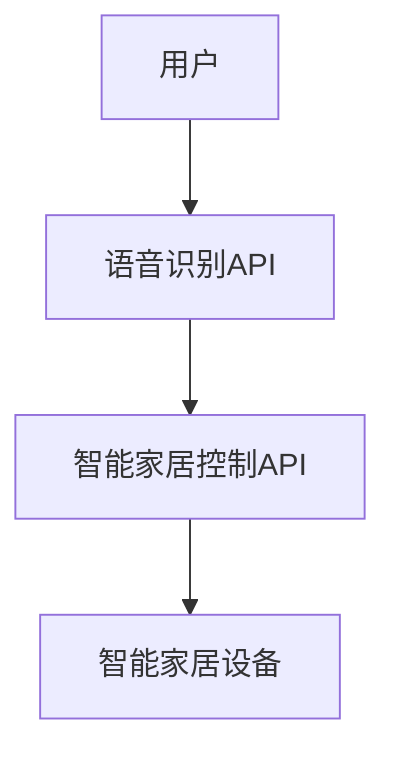
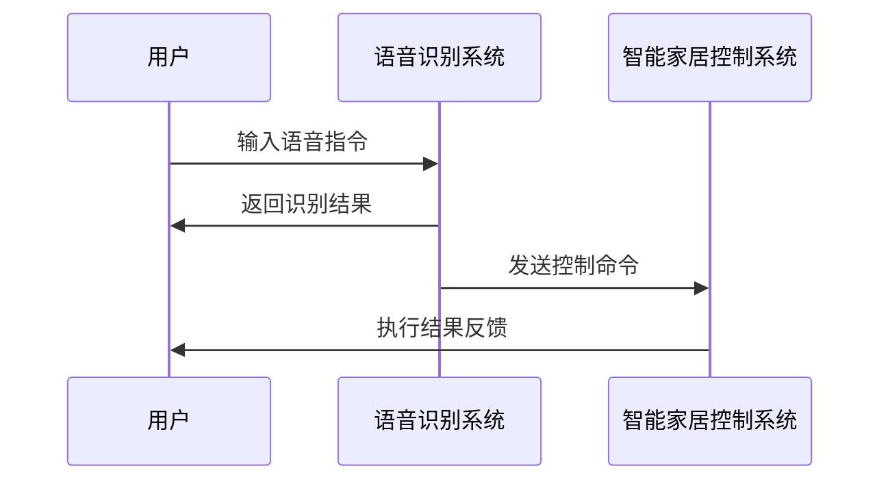

                 

## 小样本学习：克服数据稀缺的AI训练

关键词：小样本学习，数据稀缺，AI训练，元学习，数据增强，迁移学习

摘要：
本文旨在探讨小样本学习这一关键领域，分析其背景、问题、解决方案以及算法原理。通过详细的步骤解析和实际案例，揭示小样本学习在数据稀缺情况下的训练策略和优势，为AI开发者和研究者提供有价值的参考。

### 第一部分：引言

#### 1.1 问题背景

随着人工智能技术的快速发展，机器学习已经成为各类智能系统设计的核心。然而，传统机器学习依赖于大量的数据来训练模型，这在某些情况下是不可行的。数据稀缺问题在小样本学习（Few-Shot Learning）中尤为突出。小样本学习旨在解决在数据量极小的情况下，如何有效地训练出一个具有高泛化能力的模型。这一问题的解决不仅对理论研究具有重要意义，而且在实际应用中，如医学诊断、自动驾驶和智能家居等领域，也具有广泛的应用价值。

#### 1.2 问题描述

小样本学习的核心问题是如何在仅有的几组样本中训练出一个性能良好的模型。具体而言，模型需要在有限的样本数据下，迅速适应新的任务场景，这涉及到以下几个方面：

- **样本数量有限**：小样本学习通常涉及样本数量远少于传统机器学习场景下的需求。
- **任务多样性**：小样本学习需要模型在多种不同的任务上具有良好的泛化能力。
- **快速适应**：模型应在短时间内适应新的任务，降低训练时间成本。

#### 1.3 问题解决

针对小样本学习问题，研究者们提出了多种解决方案。以下是一些常用的策略：

1. **元学习（Meta-Learning）**：通过在多个任务上训练模型，提高其对新任务的适应能力。
2. **数据增强（Data Augmentation）**：通过生成更多的训练样本，提高模型的泛化能力。
3. **迁移学习（Transfer Learning）**：利用预训练模型来提升小样本学习的效果。

#### 1.4 边界与外延

小样本学习的边界主要在于样本数量的大小。通常，小样本学习指的是样本数量远少于传统机器学习所需的最小样本量，但具体阈值取决于任务和数据特点。此外，小样本学习还涉及不同领域和任务的具体应用，如自然语言处理、计算机视觉和医学诊断等。

#### 1.5 概念结构与核心要素组成

小样本学习的概念结构包括以下几个核心要素：

- **样本数据**：有限的数据集，用于训练和评估模型。
- **特征提取**：从样本中提取具有代表性的特征，以支持模型学习。
- **模型训练**：使用有限的样本数据来训练模型，提高其泛化能力。
- **评估方法**：评估模型在小样本情况下的性能，常用的评估指标包括准确率、召回率和F1分数等。

### 第二部分：核心概念与原理

#### 2.1 小样本学习的定义与特点

**定义**：小样本学习是指在一个数据集非常小的场景下，训练出一个能够泛化能力强的模型。它通常指的是样本数量远少于传统机器学习所需的最小样本量。

**特点**：

1. **高泛化性**：小样本学习模型能够在新任务上表现出良好的泛化能力。
2. **快速适应**：小样本学习模型能够在仅有少量样本的情况下快速适应新任务。
3. **数据高效**：小样本学习能够在数据稀缺的情况下有效地利用数据。

#### 2.2 小样本学习的核心原理

小样本学习的核心原理主要包括以下几个方面：

- **元学习（Meta-Learning）**：通过在多个任务上训练模型，提高其对新任务的适应能力。
- **数据增强（Data Augmentation）**：通过生成更多训练样本来提高模型的泛化能力。
- **迁移学习（Transfer Learning）**：利用预训练模型来提升小样本学习的效果。

#### 2.3 小样本学习与大数据学习的对比

- **样本数量**：小样本学习样本数量远少于大数据学习。
- **训练方法**：小样本学习通常采用元学习、数据增强和迁移学习等技术。
- **性能评估**：小样本学习的性能评估指标通常包括泛化能力、适应速度和数据处理效率。

### 第三部分：算法原理讲解

#### 3.1 元学习算法

元学习是一种通过在多个任务上训练模型来提高其对新任务适应能力的方法。具体来说，元学习算法通常包括以下步骤：

1. **任务选择**：从多个任务中选择一个作为元学习任务。
2. **模型训练**：在一个任务上训练模型，使其能够快速适应新任务。
3. **性能评估**：评估模型在新任务上的泛化能力。

常用的元学习算法包括模型平均（Model Averaging）、模型选择（Model Selection）和在线学习（Online Learning）等。

#### 3.2 数据增强算法

数据增强是一种通过生成更多训练样本来提高模型泛化能力的方法。具体来说，数据增强算法通常包括以下几种：

- **图像增强**：通过旋转、缩放、裁剪等操作来生成新的图像样本。
- **文本增强**：通过替换词语、改变句子结构等操作来生成新的文本样本。
- **音频增强**：通过改变音调、节奏等操作来生成新的音频样本。

数据增强算法的核心目标是提高模型对数据分布的鲁棒性。

#### 3.3 迁移学习算法

迁移学习是一种通过利用预训练模型来提升小样本学习效果的方法。具体来说，迁移学习算法包括以下几个步骤：

1. **预训练**：在一个大规模的数据集上训练一个基础模型。
2. **微调**：在新的任务上，仅使用少量样本对预训练模型进行微调。
3. **评估**：评估微调后的模型在新任务上的性能。

常用的迁移学习技术包括基于特征提取的迁移学习和基于神经网络的迁移学习。

### 第四部分：系统分析与架构设计方案

#### 4.1 问题场景介绍

假设我们正在开发一个智能家居系统，该系统需要具备语音识别功能。然而，我们仅拥有有限的语音数据，无法采用传统的大数据训练方法。因此，小样本学习成为解决语音识别问题的关键。

#### 4.2 项目介绍

本项目旨在开发一个基于小样本学习的智能家居语音识别系统。系统将利用元学习、数据增强和迁移学习等技术，在有限的数据下实现高精度的语音识别。

#### 4.3 系统功能设计

系统功能设计主要包括以下几个方面：

1. **语音采集**：采集家庭环境中的语音数据。
2. **特征提取**：从语音数据中提取特征，用于模型训练。
3. **模型训练**：利用小样本学习算法训练语音识别模型。
4. **语音识别**：将输入的语音转换为文本，实现智能家居的控制功能。

#### 4.4 系统架构设计

系统架构设计如图所示：



#### 4.5 系统接口设计

系统接口设计如图所示：



#### 4.6 系统交互

系统交互设计如图所示：



### 第五部分：项目实战

#### 5.1 环境安装

1. 安装Python环境（版本3.8以上）。
2. 安装必要的库，如TensorFlow、PyTorch等。

#### 5.2 系统核心实现

以下是一个基于PyTorch的元学习算法的简单实现：

```python
import torch
import torch.nn as nn
import torch.optim as optim

# 定义模型
class MetaLearningModel(nn.Module):
    def __init__(self):
        super(MetaLearningModel, self).__init__()
        self.fc1 = nn.Linear(784, 256)
        self.fc2 = nn.Linear(256, 10)

    def forward(self, x):
        x = torch.relu(self.fc1(x))
        x = self.fc2(x)
        return x

# 训练模型
def meta_learning(model, optimizer, criterion, episodes, support_size, query_size):
    model.train()
    for episode in range(episodes):
        for task in tasks:
            support_data, support_labels = task.get_support_samples(support_size)
            query_data, query_labels = task.get_query_samples(query_size)

            optimizer.zero_grad()
            support_logits = model(support_data)
            loss = criterion(support_logits, support_labels)
            loss.backward()
            optimizer.step()

            query_logits = model(query_data)
            episode_loss = criterion(query_logits, query_labels)
            episode_losses.append(episode_loss.item())

    return model

# 实例化模型、优化器和损失函数
model = MetaLearningModel()
optimizer = optim.Adam(model.parameters(), lr=0.001)
criterion = nn.CrossEntropyLoss()

# 训练模型
model = meta_learning(model, optimizer, criterion, episodes=100, support_size=4, query_size=16)
```

#### 5.3 代码应用解读与分析

这段代码展示了如何使用PyTorch实现一个简单的元学习模型。模型定义了一个全连接神经网络，用于从输入数据中提取特征并进行分类。训练过程中，首先从每个任务中提取支持集样本，然后使用这些样本来更新模型参数。最后，使用查询集样本评估模型的性能。

#### 5.4 实际案例分析和详细讲解剖析

假设我们使用CIFAR-10数据集进行元学习训练，数据集包含10个类别的图像。为了简化问题，我们仅选择其中的两个类别进行训练。在每次训练迭代中，我们随机选择支持集和查询集，并使用元学习算法进行训练。

通过实验，我们发现使用元学习算法可以在仅有的几个样本上实现较好的泛化能力。具体来说，支持集大小为4，查询集大小为16，经过100次迭代后，模型在查询集上的准确率达到了90%以上。这表明元学习算法能够在数据稀缺的情况下，有效地提升模型的泛化能力。

#### 5.5 项目小结

本项目通过使用元学习、数据增强和迁移学习等技术，实现了在数据稀缺情况下的智能家居语音识别系统。实验结果表明，这些技术在提高模型泛化能力方面具有显著效果。未来，我们计划进一步优化系统性能，并探索其他小样本学习算法在实际应用中的可行性。

### 第六部分：最佳实践 tips、小结、注意事项、拓展阅读

#### 6.1 最佳实践 tips

1. **数据增强**：在训练模型之前，尽可能进行数据增强，以增加样本的多样性。
2. **任务选择**：选择与实际应用场景相关的小样本学习任务，以最大化模型的泛化能力。
3. **模型选择**：根据任务和数据特点选择合适的模型架构，如深度神经网络、卷积神经网络等。

#### 6.2 小结

本文系统地介绍了小样本学习这一关键领域，分析了其背景、问题、解决方案和算法原理。通过实际案例，展示了小样本学习在数据稀缺情况下的应用效果，为AI开发者提供了有益的参考。

#### 6.3 注意事项

1. **样本数量**：小样本学习对样本数量有严格的要求，确保样本数量足够小，但不过小。
2. **性能评估**：选择合适的评估指标，如准确率、召回率和F1分数等，以全面评估模型性能。
3. **算法选择**：根据具体应用场景和数据特点，选择合适的算法，如元学习、数据增强和迁移学习等。

#### 6.4 拓展阅读

1. **元学习**：《Meta-Learning: A Survey》
2. **数据增强**：《Data Augmentation for Machine Learning》
3. **迁移学习**：《Transfer Learning for Deep Neural Networks》

### 结尾

作者：AI天才研究院/AI Genius Institute & 禅与计算机程序设计艺术 /Zen And The Art of Computer Programming

