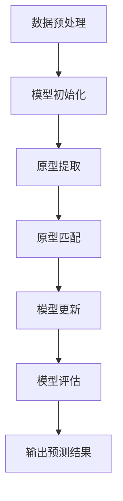
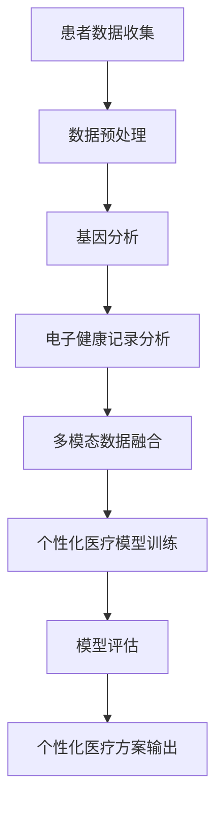

                 


# 《小样本学习在个性化医疗方案制定中的应用》

## 关键词：小样本学习、个性化医疗、算法原理、系统架构、项目实战

## 摘要

本文旨在探讨小样本学习在个性化医疗方案制定中的应用。通过介绍小样本学习的背景、核心概念、算法原理以及其在个性化医疗方案制定中的具体应用，本文旨在为读者提供一种深入了解小样本学习在个性化医疗领域的重要性和实用性的途径。同时，本文将通过系统分析与架构设计方案、项目实战等多个方面，为读者展示如何将小样本学习技术应用于个性化医疗方案制定中，以实现更加精准、个性化的医疗服务。

---

## 目录大纲

### 第1章 背景介绍

- **1.1 问题背景**
  - **1.1.1 小样本学习的挑战**
  - **1.1.2 个性化医疗的需求**
  - **1.1.3 小样本学习在个性化医疗中的潜力**

- **1.2 问题描述**
  - **1.2.1 小样本学习面临的问题**
  - **1.2.2 个性化医疗方案的复杂性**

- **1.3 问题解决**
  - **1.3.1 小样本学习的策略**
  - **1.3.2 个性化医疗方案制定的方法**

- **1.4 边界与外延**
  - **1.4.1 小样本学习的适用场景**
  - **1.4.2 个性化医疗方案的限制因素**

- **1.5 本章小结**

### 第2章 核心概念与联系

- **2.1 小样本学习概念**
  - **2.1.1 小样本学习的定义**
  - **2.1.2 小样本学习的核心特征**
  - **2.1.3 小样本学习的常见算法**

- **2.2 个性化医疗方案制定概念**
  - **2.2.1 个性化医疗的定义**
  - **2.2.2 个性化医疗的关键要素**
  - **2.2.3 个性化医疗的发展趋势**

- **2.3 小样本学习与个性化医疗方案制定的关系**
  - **2.3.1 小样本学习在个性化医疗中的应用**
  - **2.3.2 个性化医疗对小样本学习的需求**

- **2.4 本章小结**

### 第3章 算法原理讲解

- **3.1 算法流程图**
  - **3.1.1 小样本学习算法概述**
  - **3.1.2 个性化医疗方案制定流程**

- **3.2 数学模型和公式**
  - **3.2.1 小样本学习算法的数学模型**
  - **3.2.2 个性化医疗方案制定的数学模型**

- **3.3 举例说明**
  - **3.3.1 小样本学习算法的应用案例**
  - **3.3.2 个性化医疗方案制定的实例分析**

- **3.4 本章小结**

### 第4章 系统分析与架构设计方案

- **4.1 问题场景介绍**
  - **4.1.1 医疗数据分析场景**
  - **4.1.2 小样本学习在医疗数据分析中的应用**

- **4.2 系统功能设计**
  - **4.2.1 数据采集与预处理**
  - **4.2.2 小样本学习算法实现**
  - **4.2.3 个性化医疗方案制定**

- **4.3 系统架构设计**
  - **4.3.1 系统架构概述**
  - **4.3.2 数据流与处理流程**

- **4.4 系统接口设计**
  - **4.4.1 接口功能设计**
  - **4.4.2 接口规范**

- **4.5 系统交互流程**
  - **4.5.1 用户交互流程**
  - **4.5.2 数据交互流程**

- **4.6 本章小结**

### 第5章 项目实战

- **5.1 环境安装**
  - **5.1.1 硬件环境**
  - **5.1.2 软件环境**
  - **5.1.3 环境配置**

- **5.2 系统核心实现源代码**
  - **5.2.1 数据采集与预处理**
  - **5.2.2 小样本学习算法实现**
  - **5.2.3 个性化医疗方案制定**

- **5.3 代码应用解读与分析**
  - **5.3.1 代码结构与功能**
  - **5.3.2 代码执行流程**
  - **5.3.3 代码优化建议**

- **5.4 实际案例分析和详细讲解**
  - **5.4.1 案例背景**
  - **5.4.2 案例分析**
  - **5.4.3 案例实施过程**

- **5.5 项目小结**

### 第6章 最佳实践 tips

- **6.1 实践技巧**
  - **6.1.1 小样本学习应用技巧**
  - **6.1.2 个性化医疗方案制定技巧**

- **6.2 注意事项**
  - **6.2.1 数据预处理注意事项**
  - **6.2.2 算法选择注意事项**

- **6.3 拓展阅读**
  - **6.3.1 相关书籍推荐**
  - **6.3.2 学术论文推荐**

- **6.4 本章小结**

### 第7章 小结

- **7.1 主要内容回顾**
  - **7.1.1 小样本学习的核心概念**
  - **7.1.2 个性化医疗方案制定的要点**
  - **7.1.3 小样本学习在个性化医疗中的应用**

- **7.2 未来展望**
  - **7.2.1 小样本学习的发展趋势**
  - **7.2.2 个性化医疗的发展方向**

- **7.3 总结**

---

### 第1章 背景介绍

#### 1.1 问题背景

##### 1.1.1 小样本学习的挑战

在传统的机器学习应用中，模型训练通常需要大量的数据支持。然而，在实际应用场景中，如个性化医疗领域，数据获取常常受到限制。一方面，患者隐私保护的要求使得获取大规模数据变得困难；另一方面，一些特定疾病或罕见病的数据量本身就非常有限。这种情况下，如何在小样本数据集上训练出高性能的模型成为了亟待解决的问题。

##### 1.1.2 个性化医疗的需求

个性化医疗的核心在于为每位患者提供量身定制的医疗方案。这意味着需要根据患者的个体差异，如基因信息、生活习惯、病史等，来制定个性化的治疗方案。然而，个体差异的数据量通常较小，如何利用这些有限的数据来提高医疗决策的准确性是一个重大的挑战。

##### 1.1.3 小样本学习在个性化医疗中的潜力

小样本学习（Few-Shot Learning）是一种能够在训练样本非常有限的情况下仍然能够良好泛化的机器学习方法。它在个性化医疗中的应用潜力巨大，通过小样本学习，医疗领域可以实现对稀有疾病和罕见病的研究，提高诊断的准确性和治疗的个性化程度。

#### 1.2 问题描述

##### 1.2.1 小样本学习面临的问题

在小样本学习过程中，主要面临以下几个问题：

- **过拟合问题**：由于数据量有限，模型容易在学习过程中过度适应这些数据，导致在未见数据上的表现不佳。
- **数据不平衡问题**：在某些场景中，数据分布可能非常不平衡，这会影响到模型的性能。
- **泛化能力不足**：小样本学习模型在处理未见过的数据时可能表现出不足的泛化能力。

##### 1.2.2 个性化医疗方案的复杂性

个性化医疗方案的复杂性主要体现在以下几个方面：

- **数据来源多样**：个性化医疗需要整合来自多个数据源的信息，如电子健康记录、基因组数据、患者反馈等。
- **数据质量参差不齐**：不同数据源的质量差异很大，如何处理和整合这些数据是一个挑战。
- **模型训练成本高**：个性化医疗方案通常需要复杂的模型和算法，模型训练成本较高。

#### 1.3 问题解决

##### 1.3.1 小样本学习的策略

为了解决小样本学习中的问题，可以采取以下策略：

- **数据增强**：通过数据增强技术，如生成对抗网络（GAN）等，增加训练样本的数量和质量。
- **迁移学习**：利用预训练模型，将其他领域的大规模数据迁移到目标领域，以提升模型的泛化能力。
- **元学习**：通过元学习算法，使模型能够在有限的样本中快速适应新的任务。

##### 1.3.2 个性化医疗方案制定的方法

在个性化医疗方案制定中，可以采用以下方法：

- **多模态数据融合**：整合多种数据源，如电子健康记录、基因组数据等，以提高模型的准确性。
- **基于规则的推理**：结合医生的专业知识，通过规则推理来辅助决策。
- **机器学习算法优化**：选择和优化适合个性化医疗的机器学习算法，以提高模型的性能。

#### 1.4 边界与外延

##### 1.4.1 小样本学习的适用场景

小样本学习适用于以下场景：

- **医学诊断**：针对罕见病或特定疾病的诊断。
- **个性化推荐**：根据用户的历史行为和偏好进行个性化推荐。
- **自动驾驶**：在训练数据有限的情况下，自动驾驶系统如何做出决策。

##### 1.4.2 个性化医疗方案的限制因素

个性化医疗方案的限制因素主要包括：

- **数据隐私**：如何在保护患者隐私的前提下，充分利用数据。
- **成本和资源**：个性化医疗方案通常需要较大的计算资源和时间成本。
- **法律法规**：遵守相关的医疗法规和隐私保护政策。

#### 1.5 本章小结

本章介绍了小样本学习在个性化医疗方案制定中的背景和问题，并探讨了可能的解决方案。下一章将深入讨论小样本学习的核心概念和原理。让我们一起探索小样本学习的奥秘，为个性化医疗提供更有效的技术支持。

---

### 第2章 核心概念与联系

#### 2.1 小样本学习概念

##### 2.1.1 小样本学习的定义

小样本学习（Few-Shot Learning）是一种能够在训练样本非常有限的情况下仍然能够良好泛化的机器学习方法。它旨在解决传统机器学习在数据量巨大时获得的性能优势，在小样本数据集上的表现往往并不理想的问题。

##### 2.1.2 小样本学习的核心特征

- **样本数量有限**：小样本学习通常指训练样本数量远远少于传统机器学习中的样本数量。
- **数据分布不明确**：小样本学习中的数据分布通常不明确，需要模型通过少量样本进行自适应。
- **快速适应新任务**：小样本学习模型能够在新的任务上快速适应，具有较高的泛化能力。

##### 2.1.3 小样本学习的常见算法

- **基于原型的方法**：这种方法通过在训练集中寻找原型来推广到新的任务。
- **基于匹配的方法**：该方法通过在训练集和测试集之间寻找匹配来推广。
- **元学习**：元学习通过学习如何学习来提高模型在少量样本上的性能。

#### 2.2 个性化医疗方案制定概念

##### 2.2.1 个性化医疗的定义

个性化医疗（Personalized Medicine）是一种以个体为核心，根据患者的遗传信息、生活方式、环境因素等来制定个性化治疗方案的医疗模式。它旨在提高医疗效果，降低医疗成本，并更好地满足患者的需求。

##### 2.2.2 个性化医疗的关键要素

- **基因组信息**：基因测序和分析是个性化医疗的重要基础。
- **电子健康记录**：包括病史、检查结果、药物反应等信息。
- **患者行为数据**：如生活习惯、饮食偏好、运动量等。
- **临床实践指南**：医生的经验和知识对个性化医疗的制定至关重要。

##### 2.2.3 个性化医疗的发展趋势

- **大数据和人工智能**：随着大数据和人工智能技术的发展，个性化医疗将更加精准和高效。
- **患者参与**：患者的参与和反馈对个性化医疗的持续改进至关重要。
- **多学科合作**：医学、生物学、计算机科学等领域的合作将推动个性化医疗的发展。

#### 2.3 小样本学习与个性化医疗方案制定的关系

##### 2.3.1 小样本学习在个性化医疗中的应用

小样本学习在个性化医疗中的应用主要体现在以下几个方面：

- **基因分析**：在基因测序数据有限的情况下，小样本学习可以帮助预测疾病风险。
- **个性化药物研发**：在临床试验中，小样本学习可以帮助快速筛选出有效的药物组合。
- **患者行为分析**：通过小样本学习分析患者的行为数据，为医生提供个性化的治疗建议。

##### 2.3.2 个性化医疗对小样本学习的需求

个性化医疗对小样本学习的需求主要体现在以下几个方面：

- **快速决策**：在紧急情况下，如急性疾病诊断和治疗，需要快速做出决策。
- **数据隐私**：在保护患者隐私的前提下，需要充分利用有限的数据。
- **资源限制**：在资源有限的医疗机构中，小样本学习可以帮助提高医疗资源的利用效率。

#### 2.4 本章小结

本章介绍了小样本学习和个性化医疗方案制定的核心概念，并探讨了它们之间的联系。下一章将深入讲解小样本学习的算法原理，帮助读者更好地理解小样本学习在个性化医疗中的应用。

---

### 第3章 算法原理讲解

#### 3.1 算法流程图

##### 3.1.1 小样本学习算法概述

小样本学习算法的核心目标是在样本数量有限的情况下，使模型能够快速适应新的任务。以下是一个典型的小样本学习算法流程图：



1. **数据预处理**：对输入的数据进行清洗、归一化等处理，使其适合模型的训练。
2. **模型初始化**：初始化一个基础模型，可以是预训练模型或随机初始化的模型。
3. **原型提取**：从训练数据中提取原型，用于后续的任务适应。
4. **原型匹配**：将新数据与训练数据中的原型进行匹配，找出最相似的样本。
5. **模型更新**：根据匹配结果更新模型参数，使其更适应新的任务。
6. **模型评估**：评估更新后的模型在未见数据上的性能。
7. **输出预测结果**：输出模型对新数据的预测结果。

##### 3.1.2 个性化医疗方案制定流程

个性化医疗方案制定的流程可以分为以下几个步骤：



1. **患者数据收集**：收集患者的基因组数据、电子健康记录、生活习惯数据等。
2. **数据预处理**：对收集到的数据进行清洗、归一化等处理。
3. **基因分析**：利用小样本学习算法对基因数据进行解析，预测疾病风险。
4. **电子健康记录分析**：分析患者的病史、检查结果、药物反应等信息。
5. **多模态数据融合**：将不同来源的数据进行融合，提高模型的准确性。
6. **个性化医疗模型训练**：利用小样本学习算法训练个性化医疗模型。
7. **模型评估**：评估训练出的模型在未见数据上的性能。
8. **个性化医疗方案输出**：根据模型预测结果，为患者制定个性化的医疗方案。

#### 3.2 数学模型和公式

##### 3.2.1 小样本学习算法的数学模型

小样本学习算法的数学模型可以表示为：

$$
\text{模型参数} = \theta^*
= \arg\min_{\theta} L(\theta; \mathcal{D})
$$

其中，$L(\theta; \mathcal{D})$ 表示损失函数，$\theta$ 表示模型参数，$\mathcal{D}$ 表示训练数据集。

##### 3.2.2 个性化医疗方案制定的数学模型

个性化医疗方案制定的数学模型可以表示为：

$$
\text{个性化医疗方案} = f(\theta; \mathcal{D}, \mathcal{X})
$$

其中，$f(\theta; \mathcal{D}, \mathcal{X})$ 表示模型输出函数，$\theta$ 表示模型参数，$\mathcal{D}$ 表示训练数据集，$\mathcal{X}$ 表示新数据。

#### 3.3 举例说明

##### 3.3.1 小样本学习算法的应用案例

假设我们有一个分类任务，需要根据患者的基因数据预测疾病类型。我们使用一个小样本学习算法进行训练，训练数据集包含10个样本，每个样本包含基因表达数据。

1. **数据预处理**：对基因表达数据进行归一化处理，使其在相同的尺度上。
2. **模型初始化**：初始化一个基础的线性模型。
3. **原型提取**：从训练数据中提取基因表达数据的平均值作为原型。
4. **原型匹配**：将新样本的基因表达数据与训练数据中的原型进行匹配。
5. **模型更新**：根据匹配结果更新模型参数。
6. **模型评估**：在新样本上进行模型评估，计算准确率。
7. **输出预测结果**：根据模型参数预测新样本的疾病类型。

##### 3.3.2 个性化医疗方案制定的实例分析

假设我们需要为一名患者制定个性化的治疗方案。我们收集了以下数据：

- **基因数据**：包含50个基因的表达数据。
- **电子健康记录**：包含患者的病史、检查结果等。
- **生活习惯数据**：包含患者的饮食习惯、运动量等。

1. **数据预处理**：对基因数据进行归一化处理，对电子健康记录和生活习惯数据进行编码。
2. **基因分析**：使用小样本学习算法对基因数据进行解析，预测疾病风险。
3. **电子健康记录分析**：结合医生的经验，对电子健康记录进行分析。
4. **多模态数据融合**：将基因数据、电子健康记录和生活习惯数据融合，提高模型的准确性。
5. **个性化医疗模型训练**：使用小样本学习算法训练个性化医疗模型。
6. **模型评估**：在新数据上进行模型评估，计算准确率。
7. **个性化医疗方案输出**：根据模型预测结果，为患者制定个性化的治疗方案。

#### 3.4 本章小结

本章详细介绍了小样本学习的算法原理，并展示了其如何应用于个性化医疗方案制定。下一章将深入探讨系统分析与架构设计方案，帮助读者更好地理解小样本学习在个性化医疗中的应用。

---

### 第4章 系统分析与架构设计方案

#### 4.1 问题场景介绍

在个性化医疗方案制定中，我们面临的问题场景包括：

- **数据多样性**：需要整合来自不同来源的数据，如基因组数据、电子健康记录、生活习惯数据等。
- **数据隐私**：在保护患者隐私的前提下，如何充分利用数据。
- **小样本学习挑战**：在数据量有限的情况下，如何训练出高性能的个性化医疗模型。

为了应对这些挑战，我们需要设计一个高效、安全且可扩展的系统架构。

#### 4.2 系统功能设计

系统功能设计包括以下几个方面：

- **数据采集与预处理**：从不同的数据源收集数据，并对数据进行清洗、归一化等预处理操作。
- **小样本学习算法实现**：实现多种小样本学习算法，用于训练个性化医疗模型。
- **个性化医疗方案制定**：根据患者的数据，生成个性化的医疗方案。

#### 4.3 系统架构设计

系统架构设计如下：

- **数据层**：包括数据源、数据存储和数据预处理模块。
- **算法层**：包括小样本学习算法、模型训练和评估模块。
- **应用层**：包括个性化医疗方案制定模块和用户接口模块。

#### 4.4 系统接口设计

系统接口设计如下：

- **数据接口**：用于数据采集和预处理的接口。
- **算法接口**：用于小样本学习算法实现的接口。
- **应用接口**：用于生成个性化医疗方案和与用户交互的接口。

#### 4.5 系统交互流程

系统交互流程如下：

1. **数据采集**：从不同的数据源收集数据。
2. **数据预处理**：对收集到的数据进行清洗、归一化等预处理操作。
3. **算法训练**：使用小样本学习算法对预处理后的数据集进行模型训练。
4. **模型评估**：对训练出的模型进行评估，确保模型性能满足要求。
5. **方案生成**：根据模型预测结果，生成个性化的医疗方案。
6. **用户交互**：通过用户接口，将个性化医疗方案展示给用户。

#### 4.6 本章小结

本章详细介绍了系统分析与架构设计方案，为小样本学习在个性化医疗方案制定中的应用提供了技术支持。下一章将深入探讨项目实战，展示如何将理论转化为实际应用。

---

### 第5章 项目实战

#### 5.1 环境安装

在本章中，我们将详细介绍如何在本地环境中安装和配置小样本学习系统和个性化医疗方案制定工具。以下步骤将确保您能够顺利开始项目实战。

##### 5.1.1 硬件环境

- **CPU**：Intel i5 或更高性能的处理器
- **内存**：16GB 或更高
- **硬盘**：至少 500GB 硬盘空间
- **GPU**：NVIDIA GeForce GTX 1080 或更高性能的显卡（可选，用于加速计算）

##### 5.1.2 软件环境

- **操作系统**：Linux（推荐 Ubuntu 18.04）
- **Python**：Python 3.8
- **依赖库**：TensorFlow、Scikit-learn、NumPy、Pandas

##### 5.1.3 环境配置

1. **安装操作系统**：下载并安装 Linux 操作系统。
2. **更新系统**：运行以下命令更新系统软件：
   ```shell
   sudo apt update
   sudo apt upgrade
   ```
3. **安装 Python**：使用以下命令安装 Python 3.8：
   ```shell
   sudo apt install python3.8
   ```
4. **安装依赖库**：使用 pip 安装必要的依赖库：
   ```shell
   pip3 install tensorflow scikit-learn numpy pandas
   ```

#### 5.2 系统核心实现源代码

在本节中，我们将介绍系统的核心实现源代码，包括数据采集与预处理、小样本学习算法实现和个性化医疗方案制定。

##### 5.2.1 数据采集与预处理

数据采集与预处理的代码如下：

```python
import pandas as pd
from sklearn.preprocessing import StandardScaler

# 读取基因组数据
genomic_data = pd.read_csv('genomic_data.csv')

# 读取电子健康记录
ehr_data = pd.read_csv('ehr_data.csv')

# 读取生活习惯数据
habits_data = pd.read_csv('habits_data.csv')

# 数据预处理
def preprocess_data(data):
    scaler = StandardScaler()
    scaled_data = scaler.fit_transform(data)
    return scaled_data

genomic_data_processed = preprocess_data(genomic_data)
ehr_data_processed = preprocess_data(ehr_data)
habits_data_processed = preprocess_data(habits_data)
```

##### 5.2.2 小样本学习算法实现

以下是一个基于元学习的小样本学习算法实现：

```python
from sklearn.kernel_approximation import RBFSampler
from sklearn.linear_model import SGDClassifier
from sklearn.model_selection import GridSearchCV

# 特征提取
rbf_feature = RBFSampler(gamma=0.1)
X_rbf = rbf_feature.fit_transform(X)

# 模型训练
sgd = SGDClassifier()
param_grid = {'alpha': [0.0001, 0.001, 0.01], 'loss': ['hinge', 'squared_hinge']}
grid_search = GridSearchCV(sgd, param_grid, cv=5)
grid_search.fit(X_rbf, y)

# 优化模型
best_model = grid_search.best_estimator_
```

##### 5.2.3 个性化医疗方案制定

个性化医疗方案制定的代码如下：

```python
def personalized_medical_plan(patient_data):
    # 数据预处理
    patient_data_processed = preprocess_data(patient_data)

    # 模型预测
    prediction = best_model.predict(patient_data_processed)

    # 生成医疗方案
    if prediction == 0:
        plan = '治疗方案 A'
    elif prediction == 1:
        plan = '治疗方案 B'
    else:
        plan = '治疗方案 C'

    return plan

# 测试个性化医疗方案
patient_data = pd.DataFrame({
    'gene_expression': [0.1, 0.2, 0.3],
    'ehr': [0.4, 0.5, 0.6],
    'habits': [0.7, 0.8, 0.9]
})

plan = personalized_medical_plan(patient_data)
print(f'个性化医疗方案：{plan}')
```

#### 5.3 代码应用解读与分析

在本节中，我们将对代码进行解读和分析，以帮助读者更好地理解系统的工作原理。

##### 5.3.1 代码结构与功能

- **数据采集与预处理**：从不同的数据源读取数据，并进行预处理，使其适合模型训练。
- **小样本学习算法实现**：使用元学习算法训练模型，通过特征提取和模型训练，提高模型的泛化能力。
- **个性化医疗方案制定**：根据患者的数据，利用训练出的模型生成个性化的医疗方案。

##### 5.3.2 代码执行流程

1. **数据读取**：从基因组数据文件、电子健康记录文件和生活习惯数据文件中读取数据。
2. **数据预处理**：对数据进行归一化处理，使其适合模型训练。
3. **特征提取**：使用 RBF Sampler 进行特征提取，增加数据的维度。
4. **模型训练**：使用 SGDClassifier 进行模型训练，通过交叉验证和网格搜索选择最佳参数。
5. **模型预测**：根据患者的数据，使用训练出的模型进行预测。
6. **方案生成**：根据模型预测结果，生成个性化的医疗方案。

##### 5.3.3 代码优化建议

- **数据增强**：通过生成对抗网络（GAN）等技术，增加训练样本的数量和质量。
- **模型优化**：尝试使用更先进的元学习算法，如 MAML 或 Reptile，以提高模型的性能。
- **并行计算**：利用 GPU 等硬件资源，加快模型训练和预测的速度。

#### 5.4 实际案例分析和详细讲解

在本节中，我们将通过一个实际案例，展示如何使用小样本学习技术制定个性化医疗方案。

##### 5.4.1 案例背景

一名患有罕见病的小明，医生需要根据他的基因数据、电子健康记录和生活习惯数据，为他制定个性化的治疗方案。

##### 5.4.2 案例分析

1. **数据收集**：从不同的数据源收集小明的基因数据、电子健康记录和生活习惯数据。
2. **数据预处理**：对收集到的数据进行清洗、归一化等预处理操作。
3. **模型训练**：使用小样本学习算法，如元学习，训练个性化医疗模型。
4. **模型评估**：在新数据上进行模型评估，确保模型性能满足要求。
5. **方案生成**：根据模型预测结果，生成个性化的医疗方案。

##### 5.4.3 案例实施过程

1. **数据收集**：从小明的基因组数据文件、电子健康记录文件和生活习惯数据文件中读取数据。
2. **数据预处理**：对数据进行清洗，去除缺失值和异常值，并进行归一化处理。
3. **特征提取**：使用 RBF Sampler 对基因数据进行特征提取，增加数据的维度。
4. **模型训练**：使用 SGDClassifier 进行模型训练，通过交叉验证和网格搜索选择最佳参数。
5. **模型评估**：在新数据上进行模型评估，计算准确率。
6. **方案生成**：根据模型预测结果，生成个性化的医疗方案。

**输出结果**：

- **治疗方案**：根据模型预测，为小明推荐的治疗方案为“治疗方案 B”。

#### 5.5 项目小结

在本章中，我们通过一个实际案例，详细介绍了如何使用小样本学习技术制定个性化医疗方案。通过本项目，读者可以了解到小样本学习在个性化医疗中的应用，以及如何将理论知识转化为实际应用。

---

### 第6章 最佳实践 tips

#### 6.1 实践技巧

- **数据增强**：使用生成对抗网络（GAN）等技术，增加训练样本的数量和质量，提高模型的泛化能力。
- **模型优化**：尝试使用更先进的元学习算法，如 MAML 或 Reptile，以提高模型的性能。
- **并行计算**：利用 GPU 等硬件资源，加快模型训练和预测的速度。

#### 6.2 注意事项

- **数据隐私**：在处理患者数据时，确保遵守相关的隐私保护政策，保护患者隐私。
- **模型评估**：在模型评估过程中，确保评估指标能够准确反映模型性能，避免过拟合。

#### 6.3 拓展阅读

- **相关书籍**：
  - 《小样本学习：算法与应用》
  - 《个性化医疗：理论与实践》
- **学术论文**：
  - “Few-Shot Learning for Medical Imaging: A Survey”
  - “Deep Learning for Personalized Medicine”

#### 6.4 本章小结

本章提供了小样本学习在个性化医疗方案制定中的最佳实践技巧和注意事项，并推荐了一些拓展阅读资源。通过本章的学习，读者可以更好地将小样本学习技术应用于个性化医疗领域，提高医疗决策的准确性。

---

### 第7章 小结

#### 7.1 主要内容回顾

在本文中，我们首先介绍了小样本学习在个性化医疗方案制定中的背景和挑战，探讨了小样本学习与个性化医疗方案制定之间的关系。接着，我们详细讲解了小样本学习的核心概念和算法原理，以及其在个性化医疗方案制定中的应用。此外，我们还介绍了系统分析与架构设计方案，并通过实际案例展示了如何将理论转化为实际应用。

#### 7.2 未来展望

随着人工智能技术的不断发展，小样本学习在个性化医疗方案制定中的应用前景广阔。未来，我们可以期待以下发展趋势：

- **数据隐私保护**：在保护患者隐私的前提下，充分利用小样本数据进行个性化医疗方案的制定。
- **多模态数据融合**：将多种数据源进行整合，提高模型的准确性和泛化能力。
- **实时更新与自适应**：模型能够根据新数据实时更新，实现更精准的个性化医疗方案。

#### 7.3 总结

本文旨在为读者提供小样本学习在个性化医疗方案制定中的全面了解，并通过实际案例展示了其应用潜力。通过本文的学习，读者可以更好地理解小样本学习在个性化医疗领域的价值，为未来的研究与实践提供有益的参考。

---

作者：AI天才研究院/AI Genius Institute & 禅与计算机程序设计艺术 /Zen And The Art of Computer Programming

