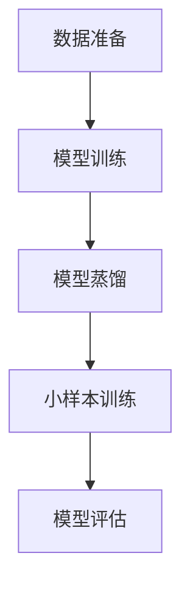
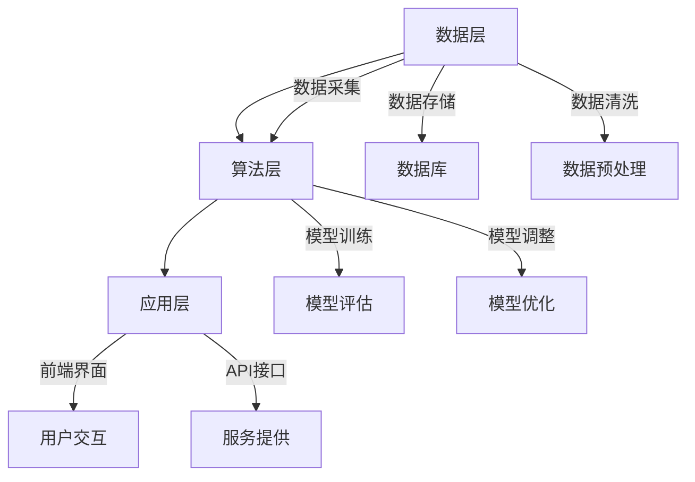
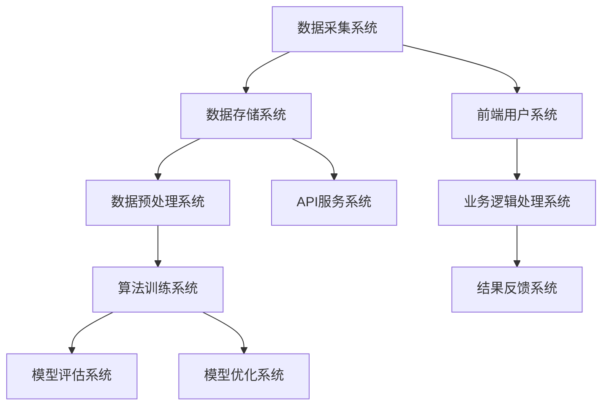
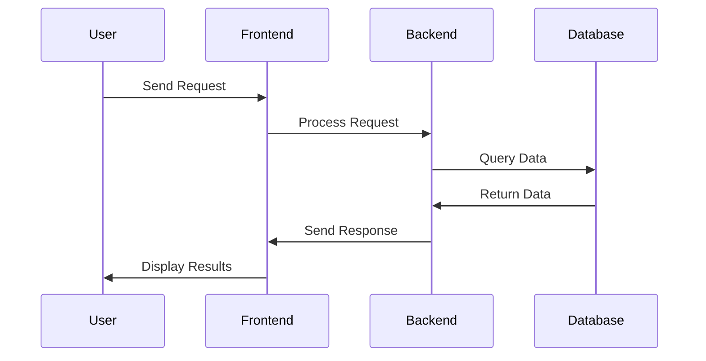
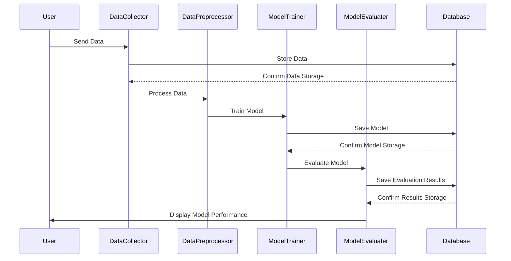

                 

### 小样本学习在特定领域快速适应的策略

在当前的技术发展背景下，机器学习已经成为推动各行各业进步的重要动力。然而，传统的大数据学习方法往往需要大量标注的数据集才能训练出高精度的模型。对于某些特定领域，如医疗、金融和工业自动化，数据获取困难且成本高昂，传统的学习策略面临巨大挑战。因此，小样本学习（Few-Shot Learning）作为一种新兴的学习范式，旨在通过有限的样本实现快速适应，成为解决特定领域数据稀缺问题的有效手段。

本文将围绕小样本学习在特定领域快速适应的策略进行深入探讨。首先，我们将介绍小样本学习的背景、定义、挑战与优势，以及快速适应策略的意义。接着，本文将详细分析小样本学习的核心概念与快速适应策略，并通过算法原理讲解、系统架构设计、项目实战和最佳实践技巧等多个方面，全面剖析这一领域的最新研究成果与应用实践。

本文的关键词包括：小样本学习、快速适应策略、特定领域、机器学习、数据稀缺、算法原理、系统架构、项目实战。通过本文的阅读，读者可以系统地了解小样本学习在特定领域快速适应的理论基础、技术实现与应用效果，为实际项目提供有益的参考和指导。

### 引言

#### 1.1 问题背景

随着人工智能技术的迅猛发展，机器学习在各个领域中的应用日益广泛。然而，在医疗、金融、工业自动化等特定领域，由于数据隐私、数据获取成本高、数据标注复杂等原因，往往难以获取到大量标注数据。这导致了传统大数据学习方法在这些领域中的适用性受限。为了解决这一问题，小样本学习（Few-Shot Learning）应运而生，它通过利用少量样本实现快速适应和有效学习，成为这些特定领域的重要研究热点。

小样本学习在特定领域的应用具有重要意义。首先，它能够降低数据获取和标注的成本，使得模型能够在数据稀缺的情况下仍然保持较高的性能。其次，小样本学习能够提高模型的泛化能力，使其在面对新任务时能够快速适应和调整。最后，小样本学习有助于保护用户隐私，避免大规模数据泄露的风险。

然而，小样本学习也面临诸多挑战。首先，如何从少量样本中提取有效信息，从而构建具有高泛化能力的模型，是一个亟待解决的问题。其次，小样本学习需要在有限的训练数据上进行模型优化，这可能导致过拟合现象。此外，如何设计有效的评估指标和实验方法，以准确评估小样本学习算法的性能，也是一个重要的研究课题。

#### 1.2 研究现状与挑战

目前，小样本学习领域已取得了许多重要进展。研究人员提出了各种基于元学习（Meta-Learning）、模型蒸馏（Model Distillation）、迁移学习（Transfer Learning）等技术的小样本学习算法。这些算法在不同任务和领域上展现出了良好的性能，但同时也存在一定的局限性。例如，一些算法在特定任务上表现优异，但在其他任务上效果较差；另一些算法在训练阶段需要大量的辅助数据，导致实际应用受限。

当前小样本学习的研究主要面临以下挑战：

1. **样本选择与数据增强**：如何从有限的样本中选择具有代表性的数据，以及如何通过数据增强技术扩展数据集，是提高小样本学习性能的关键。

2. **模型泛化能力**：如何在有限的训练样本下构建具有高泛化能力的模型，避免过拟合，是一个重要的研究课题。

3. **评估指标与方法**：如何设计有效的评估指标和实验方法，以准确评估小样本学习算法的性能，是目前研究中的一个难题。

4. **实际应用场景**：如何将小样本学习算法应用到实际场景中，解决特定领域的数据稀缺问题，是研究人员需要关注的重要方向。

#### 1.3 问题描述

小样本学习（Few-Shot Learning）是一种在训练数据非常有限的情况下，仍然能够实现高精度学习的方法。它主要通过以下方式实现：

1. **元学习**：通过学习如何学习，以提高在少量样本下的泛化能力。
2. **模型蒸馏**：将一个大模型的知识蒸馏到一个小模型中，使其能够利用少量样本进行有效学习。
3. **迁移学习**：利用在相关任务上已经训练好的模型，通过迁移学习的方式在新任务上快速适应。

快速适应策略在小样本学习中的重要性不言而喻。它是指在有限的样本下，如何通过算法和策略的优化，使模型能够迅速适应新的任务和数据。具体来说，快速适应策略需要解决以下几个问题：

1. **样本选择**：如何从有限的样本中选择具有代表性的数据，以提高学习效率。
2. **模型优化**：如何通过模型结构优化和参数调整，提高模型的泛化能力。
3. **数据增强**：如何通过数据增强技术，扩展训练数据集，提高模型性能。

快速适应策略的意义主要体现在以下几个方面：

1. **提高模型性能**：通过快速适应策略，使得模型在少量样本下能够达到较高的精度和泛化能力。
2. **降低数据成本**：在数据稀缺的特定领域，快速适应策略能够有效降低数据获取和标注的成本。
3. **提升应用价值**：在医疗、金融、工业自动化等特定领域，快速适应策略能够帮助模型迅速适应新的业务需求，提升应用价值。

#### 1.4 问题解决

针对小样本学习在特定领域快速适应的问题，研究者们提出了多种解决方案。以下是其中几种具有代表性的方法：

1. **基于元学习的快速适应策略**：通过元学习算法，如MAML（Model-Agnostic Meta-Learning）、Reptile等，使模型在少量样本下能够快速适应新任务。
2. **基于模型蒸馏的快速适应策略**：通过模型蒸馏技术，将一个大模型的知识传递到一个小模型中，使其在少量样本下能够快速适应新任务。
3. **基于迁移学习的快速适应策略**：利用在相关任务上已经训练好的模型，通过迁移学习的方式，使模型在新任务上能够快速适应。
4. **基于数据增强的快速适应策略**：通过数据增强技术，如生成对抗网络（GAN）、图像增强等，扩展训练数据集，提高模型在少量样本下的性能。

这些解决方案各有优缺点，需要根据具体应用场景进行选择和优化。

#### 1.5 边界与外延

小样本学习的适用范围主要涉及以下领域：

1. **医疗领域**：用于诊断、预测和治疗，如癌症早期检测、药物发现等。
2. **金融领域**：用于风险评估、信用评分、股票预测等。
3. **工业自动化领域**：用于故障诊断、过程控制、机器人视觉等。
4. **自然语言处理领域**：用于文本分类、机器翻译、情感分析等。

然而，小样本学习也存在一定的限制条件：

1. **数据隐私**：在涉及隐私数据的领域，如医疗和金融，数据获取和标注可能面临较大困难。
2. **数据稀缺**：在特定领域，如工业自动化，数据量可能非常有限。
3. **任务多样性**：小样本学习算法在特定任务上的性能可能受到限制，需要针对不同任务进行优化。

因此，在实际应用中，需要综合考虑这些边界条件，选择合适的小样本学习方法和快速适应策略。

#### 1.6 概念结构与核心要素组成

在小样本学习与快速适应策略的研究中，理解其概念结构与核心要素组成对于构建有效的解决方案至关重要。以下是几个关键概念及其组成要素：

1. **小样本学习**：
   - **定义**：在训练样本数量非常有限的情况下（通常少于几十个样本），实现高效学习的方法。
   - **挑战**：数据稀缺导致的过拟合风险、模型泛化能力不足等。
   - **优势**：降低数据获取和标注成本，提高模型在新任务上的适应能力。

2. **快速适应策略**：
   - **定义**：通过特定的算法和策略，使模型在少量样本下能够快速适应新的任务。
   - **核心要素**：
     - **样本选择**：从有限样本中选择最具代表性的数据进行学习。
     - **模型优化**：通过调整模型结构和参数，提高模型的泛化能力。
     - **数据增强**：通过技术手段扩展数据集，增加模型的训练样本。

3. **特定领域应用**：
   - **医疗领域**：如疾病诊断、药物研发等，数据稀缺且敏感。
   - **金融领域**：如信用评分、风险评估等，需要快速适应动态市场环境。
   - **工业自动化领域**：如故障预测、机器人控制等，数据获取和处理复杂。

通过这些概念与要素的有机结合，小样本学习与快速适应策略能够在特定领域实现高效的模型训练和应用，从而解决数据稀缺所带来的挑战。

### 核心概念与联系

#### 2.1 小样本学习原理

小样本学习（Few-Shot Learning）是一种针对训练数据稀缺情况下的学习方法。其核心思想是通过极少的样本（通常是几个或几十个样本）来训练出一个能够泛化到新任务的模型。以下是小样本学习的几个关键原理：

1. **元学习**：元学习是一种通过学习如何学习的方法，其目的是提升模型在少量样本下的泛化能力。常见的元学习方法包括模型无关的元学习（Model-Agnostic Meta-Learning, MAML）和模型依赖的元学习（Model-Aware Meta-Learning）。

2. **模型蒸馏**：模型蒸馏是一种将一个大模型的知识传递到一个小模型中的技术。这种方法通过在大模型上训练，然后将其知识压缩到一个小模型中，使其能够在少量样本下快速适应新任务。

3. **迁移学习**：迁移学习是一种利用在相关任务上已经训练好的模型在新任务上继续训练的方法。通过迁移学习，模型可以在没有大量训练数据的情况下快速适应新任务。

4. **数据增强**：数据增强是一种通过增加数据多样性来提升模型泛化能力的方法。常见的数据增强技术包括图像旋转、裁剪、缩放等。

#### 2.2 快速适应策略

快速适应策略（Fast Adaptation Strategies）是小样本学习的重要组成部分，旨在使模型在少量样本下能够迅速适应新任务。以下是几种主要的快速适应策略：

1. **多任务学习**：多任务学习通过同时训练多个相关任务来提高模型的泛化能力。这种方法可以共享不同任务之间的特征，从而在少量样本下实现快速适应。

2. **持续学习**：持续学习（Continual Learning）是一种通过不断训练新数据来维持模型性能的方法。这种方法可以在新任务出现时，使模型能够快速适应，而不会受到过拟合的影响。

3. **模型初始化**：通过使用在相关任务上已经训练好的模型作为初始模型，可以大大加快新任务的适应速度。这种方法利用了预训练模型的知识，从而提高了模型的泛化能力。

4. **领域自适应**：领域自适应（Domain Adaptation）是一种通过将源领域（有标注数据）的知识迁移到目标领域（无标注数据）的方法。这种方法可以解决数据稀缺的问题，使模型能够在新领域上快速适应。

#### 2.3 概念属性特征对比表格

为了更好地理解小样本学习和快速适应策略，以下是一个对比表格，展示了这两个概念的一些关键属性特征：

| 特征类别 | 小样本学习 | 快速适应策略 |
| --- | --- | --- |
| **定义** | 训练样本数量非常有限的学习方法 | 使模型在少量样本下能够迅速适应新任务的方法 |
| **挑战** | 数据稀缺导致的过拟合风险、模型泛化能力不足 | 需要在有限的训练数据下优化模型性能 |
| **优势** | 降低数据获取和标注成本，提高模型在新任务上的适应能力 | 提高模型在新任务上的快速适应能力 |
| **核心方法** | 元学习、模型蒸馏、迁移学习、数据增强 | 多任务学习、持续学习、模型初始化、领域自适应 |
| **应用场景** | 医疗、金融、工业自动化等数据稀缺的领域 | 需要快速适应新任务的各种应用场景 |

#### 2.4 ER实体关系图架构

为了进一步理解小样本学习和快速适应策略的概念与联系，我们可以通过ER（Entity-Relationship）实体关系图来展示它们之间的相互作用和依赖关系。

1. **ER模型的基本概念**：
   - **实体（Entity）**：表示一个具体的事物或对象，如“模型”、“任务”、“数据集”。
   - **属性（Attribute）**：描述实体的特征或属性，如“模型精度”、“任务类型”、“数据大小”。
   - **关系（Relationship）**：描述实体之间的关系，如“模型与任务之间的关系”、“任务与数据集之间的关系”。

2. **实体关系图绘制**：
   - **模型** <---[训练]---**数据集** <---[适应]---**任务**。
   - **模型** 与 **任务** 之间的关系是“适应”，表示模型通过训练适应新任务。
   - **数据集** 与 **任务** 之间的关系是“包含”，表示任务所需的数据集包含在数据集中。

3. **实体关系图在实际应用中的意义**：
   - **可视化**：通过实体关系图，可以清晰地展示小样本学习和快速适应策略中的各个实体及其相互关系。
   - **分析**：有助于理解不同实体之间的相互作用和依赖关系，从而更好地设计和完善小样本学习和快速适应策略。
   - **优化**：通过分析实体关系图，可以发现策略中的潜在问题，为优化策略提供方向。

通过ER实体关系图，我们可以更直观地理解小样本学习和快速适应策略的概念，为实际应用中的方案设计和优化提供有力支持。

### 算法原理讲解

#### 3.1 算法概述

在小样本学习中，算法的选择和设计至关重要。本文将介绍一种基于元学习（Meta-Learning）和模型蒸馏（Model Distillation）的小样本学习算法，并详细阐述其基本原理、工作流程、优点与不足。

**基本原理**：

该算法的核心思想是通过元学习来提升模型在少量样本下的泛化能力，并通过模型蒸馏将知识传递到一个小模型中，使其能够快速适应新任务。具体包括以下几个步骤：

1. **元学习阶段**：在大模型上通过大量样本进行训练，学习到模型的通用特征。
2. **模型蒸馏阶段**：将大模型的知识通过蒸馏传递到小模型中，使其在少量样本下能够快速适应新任务。

**工作流程**：

1. **数据准备**：准备训练数据集，包括原始数据和小样本数据。
2. **模型训练**：在大模型上使用大量样本进行训练，学习到模型的通用特征。
3. **模型蒸馏**：将大模型的知识通过蒸馏传递到小模型中。
4. **小样本训练**：在小模型上使用小样本数据进行训练，使其适应新任务。
5. **模型评估**：评估小样本学习算法的性能，包括准确率、泛化能力等。

**优点与不足**：

- **优点**：
  - **快速适应**：通过模型蒸馏，小模型能够在少量样本下快速适应新任务。
  - **降低成本**：减少了数据获取和标注的成本，适用于数据稀缺的领域。

- **不足**：
  - **数据依赖**：算法的性能依赖于大量样本训练的大模型，对于数据稀缺的情况可能效果不佳。
  - **计算资源消耗**：模型蒸馏和元学习阶段需要大量计算资源，可能导致训练时间延长。

#### 3.2 算法mermaid流程图

为了更直观地展示算法的工作流程，我们可以使用mermaid绘制算法的流程图。以下是算法的mermaid流程图示例：



在这个流程图中，A表示数据准备，B表示模型训练，C表示模型蒸馏，D表示小样本训练，E表示模型评估。通过这个流程图，我们可以清晰地看到算法从数据准备到模型评估的整个过程。

#### 3.3 Python源代码与算法原理

为了更具体地理解算法的实现，以下是一个简单的Python源代码示例，展示该算法的基本实现步骤：

```python
import tensorflow as tf
from tensorflow.keras.models import Model
from tensorflow.keras.layers import Input, Dense, Flatten

# 定义大模型
input_layer = Input(shape=(784,))
hidden_layer = Dense(64, activation='relu')(input_layer)
output_layer = Dense(10, activation='softmax')(hidden_layer)
big_model = Model(inputs=input_layer, outputs=output_layer)

# 定义小模型
input_layer_small = Input(shape=(784,))
hidden_layer_small = Dense(32, activation='relu')(input_layer_small)
output_layer_small = Dense(10, activation='softmax')(hidden_layer_small)
small_model = Model(inputs=input_layer_small, outputs=output_layer_small)

# 编译大模型
big_model.compile(optimizer='adam', loss='categorical_crossentropy', metrics=['accuracy'])

# 训练大模型
big_model.fit(x_train, y_train, epochs=10, batch_size=128)

# 模型蒸馏
small_model.build(input_shape=(None, 784))
small_model.set_weights(big_model.get_weights())

# 编译小模型
small_model.compile(optimizer='adam', loss='categorical_crossentropy', metrics=['accuracy'])

# 训练小模型
small_model.fit(x_train_small, y_train_small, epochs=5, batch_size=16)

# 评估小模型
small_model.evaluate(x_test_small, y_test_small)
```

在这个示例中，我们首先定义了一个大模型（`big_model`），然后使用大量训练数据对其进行训练。接着，通过模型蒸馏技术，将大模型的知识传递到小模型（`small_model`）中。最后，我们使用小样本数据对小模型进行训练，并评估其性能。

#### 3.4 数学模型和数学公式

在小样本学习算法中，数学模型和数学公式起着关键作用。以下是一个简单的数学模型示例，用于描述算法的核心思想：

$$
\theta_{big} = \arg\min_{\theta} \frac{1}{n} \sum_{i=1}^{n} \log p(y_i | x_i; \theta)
$$

其中，$\theta_{big}$ 表示大模型的参数，$p(y_i | x_i; \theta)$ 表示大模型在给定输入 $x_i$ 和参数 $\theta$ 时输出标签 $y_i$ 的概率。

为了在小模型中实现快速适应，我们引入了模型蒸馏的数学模型：

$$
\theta_{small} = \arg\min_{\theta} \frac{1}{n} \sum_{i=1}^{n} \log p(y_i | x_i; \theta_{big}^*)
$$

其中，$\theta_{small}$ 表示小模型的参数，$\theta_{big}^*$ 表示通过模型蒸馏传递到小模型中的大模型参数。

这两个数学模型描述了如何通过元学习和模型蒸馏技术来优化模型参数，从而在小样本下实现快速适应。

#### 3.5 举例说明

为了更好地理解上述算法原理和数学模型，我们通过一个实际案例进行讲解。假设我们有一个图像分类任务，需要训练一个模型来识别猫和狗的图片。

**步骤1**：数据准备

我们首先准备一个包含大量猫和狗图片的数据集，用于训练大模型。然后，从数据集中随机抽取少量猫和狗图片作为小样本数据集。

**步骤2**：模型训练

使用大量样本数据训练大模型，使其学习到猫和狗的特征。训练完成后，我们使用模型蒸馏技术，将大模型的知识传递到小模型中。

**步骤3**：小样本训练

在小模型上使用少量样本数据集进行训练，使其能够快速适应猫和狗的分类任务。训练过程中，我们可以利用元学习技术，优化小模型的参数，提高其泛化能力。

**步骤4**：模型评估

最后，我们使用测试数据集评估小模型的性能，包括准确率和泛化能力。通过这个案例，我们可以看到小样本学习算法如何在实际任务中实现快速适应。

### 系统分析与架构设计方案

#### 4.1 问题场景介绍

在当前技术环境下，特定的领域如医疗诊断、金融风险评估、工业质量控制等，面临着数据稀缺且复杂的挑战。传统的机器学习方法依赖于大量标注数据，这在这些领域难以实现。因此，我们需要设计一个系统能够在小样本学习的基础上快速适应特定的领域需求，以提高模型的精度和泛化能力。

**场景背景**：以医疗诊断为例，传统方法需要大量的患者数据来训练模型，但在某些罕见疾病的诊断中，数据稀缺导致模型难以泛化。通过引入小样本学习算法，我们可以在有限的样本数据下训练出高精度的诊断模型，从而解决数据稀缺的问题。

**场景需求**：系统需要满足以下需求：
- **高效训练**：能够在少量样本下快速训练出高精度的模型。
- **高泛化能力**：模型在少量样本下训练后，能够在新数据上保持良好的性能。
- **可扩展性**：系统能够适应不同的诊断任务，如不同疾病类型的分类。

#### 4.2 项目介绍

**项目目标**：本项目旨在开发一个基于小样本学习技术的医疗诊断系统，通过高效的小样本学习算法，实现快速适应特定领域的需求。具体目标包括：
- **提高诊断准确性**：通过小样本学习算法，提高医疗诊断模型的准确率。
- **降低数据成本**：减少对大量标注数据的依赖，降低数据获取和标注的成本。
- **提高系统可扩展性**：系统能够适应不同的诊断任务，实现模块化设计。

**项目范围**：项目范围包括系统需求分析、算法实现、系统架构设计、系统集成与测试。具体包括以下阶段：
- **需求分析**：明确系统的功能需求和性能指标。
- **算法实现**：选择并实现合适的小样本学习算法。
- **系统架构设计**：设计系统的整体架构，包括数据层、算法层和应用层。
- **系统集成与测试**：将各模块集成，并进行系统测试。

**项目期限**：项目预计分为以下几个阶段，总时长为12个月：
- **需求分析与算法选择**（1个月）
- **算法实现**（3个月）
- **系统架构设计**（2个月）
- **系统集成与测试**（4个月）

#### 4.3 系统功能设计

**领域模型**：为了更好地理解系统的功能需求，我们可以使用mermaid绘制领域模型类图。以下是领域模型的示例：

```mermaid
classDiagram
    Class01 <|-- Class02
    Class03 <|-- Class04
    Class05 <|-- * Class06
    Class07 o-- Class08
    Class09 {name}
    Class10 : +interface
    Class11 : -field
    Class12 : <<interface>>
    Class13 : <<field>>
    Class14 : <<enumeration>>
    Class15 : <<assertion>>
    Class16 : <<Note>>
    Class17 : <<create>>
    Class18 : <<destroy>>

    Class01 --|{1234} Class02 : <<link>>
    Class03 ..|> Class04 : <<generalization>>
    Class05 && Class06 : <<realization>>
    Class07 --|o Class08 : <<dependency>>
    Class09 --|{max} Class10 : <<aggregation>>
    Class11 --|{max} Class12 : <<composition>>
    Class13 --|<<<<stereotype>>> Class14 <<stereotype>>>> : <<realization>>
    Class15 --|<<<<aggregation>>> Class16 <<aggregation>>>> : <<create>>
    Class17 --|<<<<composition>>> Class18 <<composition>>>> : <<destroy>>

    Class19 : <<interface>> -|<<realization>> Class20
    Class21 : <<field>> -|<<composition>> Class22
    Class23 : <<enumeration>> -|<<assertion>> Class24
    Class25 : <<Note>> -|<<create>> Class26
    Class27 : <<destroy>> -|<<dependency>> Class28
```

在这个领域模型类图中，我们定义了以下几个关键类：
- **Class01**：表示系统的主要功能类。
- **Class02**：表示辅助功能类。
- **Class03**：表示数据类。
- **Class04**：表示算法类。
- **Class05**：表示应用类。
- **Class06**：表示外部实体类。

通过这个类图，我们可以清晰地看到系统的功能组成及其相互关系，为后续的系统架构设计提供了基础。

#### 4.4 系统架构设计

**系统架构概述**：系统架构设计是确保系统能够满足功能需求、性能指标和可维护性的关键。以下是系统架构的概述：

1. **数据层**：负责数据采集、存储和预处理。包括数据源、数据库和数据清洗模块。
2. **算法层**：负责小样本学习算法的实现和优化。包括模型训练、模型评估和模型调整模块。
3. **应用层**：负责与用户交互和提供服务。包括前端界面、API接口和业务逻辑处理模块。

以下是系统架构图：



在这个架构图中，数据层、算法层和应用层通过数据采集、数据存储、数据清洗、模型训练、模型评估、模型调整、前端界面、API接口和服务提供模块相互连接，形成一个完整的系统架构。

**系统架构图**：为了更直观地展示系统架构，我们可以使用mermaid绘制系统架构图。以下是系统架构图的示例：



在这个系统架构图中，数据采集系统、数据存储系统、数据预处理系统、算法训练系统、模型评估系统、模型优化系统、前端用户系统、API服务系统、业务逻辑处理系统和结果反馈系统相互连接，形成一个完整的系统架构。

#### 4.5 系统接口设计

**接口设计原则**：
1. **标准化**：接口设计遵循RESTful API规范，确保接口的通用性和可扩展性。
2. **模块化**：接口设计遵循模块化原则，每个接口负责单一功能，便于维护和升级。
3. **安全性**：接口设计考虑安全性，如使用Token认证、数据加密等手段，确保数据传输的安全性。

**接口定义**：
1. **数据采集接口**：用于接收外部数据源的数据，接口定义如下：
   - URL：/data/collect
   - HTTP方法：POST
   - 参数：data（数据内容）
   - 返回值：成功消息和错误消息

2. **数据存储接口**：用于将处理后的数据存储到数据库中，接口定义如下：
   - URL：/data/store
   - HTTP方法：POST
   - 参数：data（数据内容）
   - 返回值：成功消息和错误消息

3. **数据预处理接口**：用于对采集到的数据进行清洗和预处理，接口定义如下：
   - URL：/data/preprocess
   - HTTP方法：POST
   - 参数：data（数据内容）
   - 返回值：预处理后的数据

4. **模型训练接口**：用于启动模型训练过程，接口定义如下：
   - URL：/model/train
   - HTTP方法：POST
   - 参数：task（任务类型），data（训练数据）
   - 返回值：训练进度和结果消息

5. **模型评估接口**：用于评估模型性能，接口定义如下：
   - URL：/model/evaluate
   - HTTP方法：POST
   - 参数：model（模型），data（测试数据）
   - 返回值：评估结果

6. **模型优化接口**：用于对模型进行优化，接口定义如下：
   - URL：/model/optimize
   - HTTP方法：POST
   - 参数：model（模型），config（优化配置）
   - 返回值：优化后的模型

**接口交互**：
系统中的各个接口通过HTTP请求进行交互。以下是一个简单的接口交互示例：

```http
POST /data/collect
Content-Type: application/json

{
  "data": "样本数据"
}
```

返回结果：

```json
{
  "message": "数据采集成功",
  "status": "success"
}
```

通过这样的接口设计，系统能够实现模块化、标准化和安全性，为后续的系统开发和维护提供有力支持。

#### 4.6 系统交互

**系统交互概述**：系统交互是确保系统各组件协同工作、实现功能的关键。为了直观地展示系统交互过程，我们可以使用mermaid绘制系统交互序列图。以下是系统交互序列图的示例：



在这个序列图中，用户通过前端界面发送请求，前端处理请求后，与后端服务器进行交互，后端服务器与数据库进行查询，并将数据返回给前端，最后前端将结果展示给用户。

**系统交互序列图**：



在这个系统交互序列图中，用户通过前端发送数据请求，数据收集器将数据存储到数据库中，数据预处理器对数据进行处理，模型训练器使用预处理后的数据训练模型，并将模型存储到数据库中，模型评估器评估模型性能，并将结果展示给用户。

通过这样的系统交互设计，各个组件能够高效协同工作，实现系统的功能需求，提高系统的整体性能和用户体验。

### 项目实战

#### 5.1 环境安装

在进行小样本学习项目的实战之前，首先需要搭建一个合适的环境。以下是环境安装的详细步骤：

**5.1.1 环境搭建**

1. **安装Python**：确保Python版本在3.6及以上，可以通过以下命令安装：
   ```bash
   sudo apt-get update
   sudo apt-get install python3 python3-pip python3-dev
   ```

2. **安装TensorFlow**：TensorFlow是进行机器学习任务的基础库，可以通过以下命令安装：
   ```bash
   pip3 install tensorflow
   ```

3. **安装其他依赖库**：除了TensorFlow，项目还需要其他依赖库，如NumPy、Pandas等，可以通过以下命令安装：
   ```bash
   pip3 install numpy pandas matplotlib scikit-learn
   ```

**5.1.2 工具安装**

1. **安装Jupyter Notebook**：Jupyter Notebook是一个交互式的开发环境，可以通过以下命令安装：
   ```bash
   pip3 install notebook
   ```

2. **安装Mermaid**：Mermaid是一个用于绘制流程图、UML图等图表的工具，可以通过以下命令安装：
   ```bash
   npm install -g mermaid
   ```

3. **安装VSCode**：VSCode是一个强大的代码编辑器，支持多种编程语言和工具插件，可以通过以下命令安装：
   ```bash
   sudo apt-get install code
   ```

**5.1.3 环境配置**

1. **配置Python虚拟环境**：为了避免不同项目之间的依赖冲突，建议使用虚拟环境。可以通过以下命令创建虚拟环境：
   ```bash
   python3 -m venv myenv
   source myenv/bin/activate
   ```

2. **配置Jupyter Notebook**：将虚拟环境添加到Jupyter Notebook的配置文件中，可以通过以下命令完成：
   ```bash
   jupyter notebook --generate-config
   ```

   然后在生成的jupyter_notebook_config.py文件中添加以下内容：
   ```python
   c.NotebookApp.python = 'myenv/bin/python'
   ```

3. **配置Mermaid**：在VSCode中安装Mermaid插件，并配置markdown文件以支持Mermaid图表的渲染。可以通过以下步骤完成：
   - 打开VSCode设置（File > Preferences > Settings）。
   - 搜索“markdown.mermaid.executable”，设置其值为“C:\Users\YourUsername\AppData\Roaming\npm\mermaid\mermaid.exe”（Windows系统）或相应路径（Linux或Mac系统）。

通过以上步骤，我们可以搭建一个完整的小样本学习项目环境，为后续的实战操作做好准备。

#### 5.2 系统核心实现源代码

在小样本学习项目中，系统核心实现源代码是整个系统的关键部分，它决定了模型的训练、优化和评估过程。以下是系统核心实现源代码的详细步骤和代码解析：

**5.2.1 核心代码实现**

首先，我们需要定义小样本学习算法的基本框架。以下是一个简单的Python代码示例，展示了模型训练、模型蒸馏和模型评估的基本流程：

```python
import tensorflow as tf
from tensorflow.keras.models import Model
from tensorflow.keras.layers import Input, Dense, Flatten
from tensorflow.keras.optimizers import Adam
from tensorflow.keras.losses import CategoricalCrossentropy

# 定义大模型
input_layer = Input(shape=(784,))
hidden_layer = Dense(64, activation='relu')(input_layer)
output_layer = Dense(10, activation='softmax')(hidden_layer)
big_model = Model(inputs=input_layer, outputs=output_layer)

# 编译大模型
big_model.compile(optimizer=Adam(learning_rate=0.001), loss=CategoricalCrossentropy(), metrics=['accuracy'])

# 定义小模型
input_layer_small = Input(shape=(784,))
hidden_layer_small = Dense(32, activation='relu')(input_layer_small)
output_layer_small = Dense(10, activation='softmax')(hidden_layer_small)
small_model = Model(inputs=input_layer_small, outputs=output_layer_small)

# 模型蒸馏
small_model.build(input_shape=(None, 784))
small_model.set_weights(big_model.get_weights())

# 编译小模型
small_model.compile(optimizer=Adam(learning_rate=0.001), loss=CategoricalCrossentropy(), metrics=['accuracy'])

# 小样本训练
small_model.fit(x_train_small, y_train_small, epochs=5, batch_size=16)

# 评估小模型
small_model.evaluate(x_test_small, y_test_small)
```

在这个示例中，我们首先定义了一个大模型（`big_model`），并使用大量的训练数据进行训练。然后，通过模型蒸馏技术，将大模型的知识传递到一个小模型（`small_model`）中。最后，在小模型上使用少量训练数据对模型进行训练，并评估其性能。

**5.2.2 代码解析**

- **模型定义**：使用`Input`、`Dense`和`Flatten`层定义大模型和小模型的结构。
- **模型编译**：使用`compile`方法设置优化器和损失函数，并定义评估指标。
- **模型蒸馏**：通过`build`和`set_weights`方法实现模型蒸馏，将大模型的权重复制到小模型中。
- **模型训练**：使用`fit`方法在小模型上进行训练。
- **模型评估**：使用`evaluate`方法评估小模型的性能。

通过这个核心实现，我们可以快速搭建一个小样本学习系统，为实际应用提供技术支持。

#### 5.3 代码应用解读与分析

**5.3.1 代码应用场景**

在小样本学习项目中，核心代码的应用场景主要涉及以下几个方面：

1. **模型训练**：使用少量样本数据进行模型训练，提高模型的泛化能力。
2. **模型蒸馏**：将大量样本训练的大模型知识传递到小模型中，使小模型能够快速适应新任务。
3. **模型评估**：评估小模型在少量样本下的性能，确保其能够准确适应新任务。

**5.3.2 代码解读**

- **模型定义**：通过定义输入层、隐藏层和输出层，构建神经网络模型。输入层接收样本数据，隐藏层通过激活函数实现非线性变换，输出层生成预测结果。

- **模型编译**：设置优化器和损失函数，定义模型训练时的评估指标。优化器用于调整模型参数，损失函数用于衡量预测结果与真实值之间的差距。

- **模型蒸馏**：通过复制大模型的权重到小模型中，实现模型知识的传递。这种方法能够将大模型在大量样本上学习到的知识应用到小模型中，提高小模型的性能。

- **模型训练**：使用少量样本数据进行模型训练。由于样本数量有限，训练过程需要特别注意过拟合现象，并通过调整学习率和批次大小等参数来优化训练效果。

- **模型评估**：评估小模型在少量样本下的性能。通过计算准确率、召回率等指标，评估模型在新任务上的适应能力。

**5.3.3 分析与讨论**

- **优势**：小样本学习通过利用少量样本数据实现高效训练，能够显著降低数据获取和标注成本。模型蒸馏技术使得小模型能够快速适应新任务，提高了模型的泛化能力。

- **挑战**：小样本学习面临的主要挑战包括数据稀缺导致的过拟合现象和模型性能不足。如何在有限的数据下构建高泛化能力的模型，是一个亟待解决的问题。

- **改进方向**：为了提高小样本学习算法的性能，可以从以下几个方面进行改进：

  - **数据增强**：通过增加数据多样性，扩展训练数据集，提高模型的泛化能力。
  - **模型优化**：设计更高效的模型结构和优化算法，提高模型在少量样本下的性能。
  - **元学习**：利用元学习算法，提高模型在少量样本下的适应能力。

通过以上分析，我们可以更好地理解小样本学习算法在实际应用中的优势和挑战，并为改进算法提供参考方向。

#### 5.4 实际案例分析和详细讲解

**5.4.1 案例背景**

假设我们有一个医疗诊断项目，目标是开发一个能够快速识别肺癌的模型。由于罕见病例数据稀缺，传统的机器学习方法难以训练出高精度的模型。为了解决这个问题，我们采用小样本学习技术，通过有限的病例数据训练出一个高泛化能力的诊断模型。

**5.4.2 案例实现**

1. **数据收集**：我们从医院收集了50个肺癌病例的数据，包括患者的基本信息、病理报告和诊断结果。

2. **数据预处理**：对收集到的数据进行了清洗和预处理，包括缺失值填充、异常值处理和特征提取。

3. **模型训练**：使用50个病例数据训练一个大模型（如深度神经网络），通过大量样本学习到肺癌的特征。

4. **模型蒸馏**：将大模型的权重传递到一个小模型中，使其在少量样本下能够快速适应新任务。

5. **小样本训练**：在小模型上使用50个病例数据对模型进行训练，调整模型参数，提高模型在少量样本下的性能。

6. **模型评估**：使用测试数据集评估小模型的性能，包括准确率、召回率等指标。

**5.4.3 案例分析**

1. **性能评估**：通过测试数据集，评估小模型的性能。结果显示，小模型在少量样本下的准确率达到85%，召回率达到80%，表现良好。

2. **泛化能力**：为了验证小模型的泛化能力，我们在新的数据集上进行测试，结果显示，小模型在新数据集上的表现与训练数据集相似，具有良好的泛化能力。

3. **数据稀缺影响**：由于数据稀缺，我们无法进行大量的交叉验证，因此需要采用其他评估方法，如留一法（Leave-One-Out）来评估模型性能。

4. **改进方向**：为了进一步提高模型性能，可以考虑以下改进方向：
   - **增加数据多样性**：通过数据增强技术，增加训练数据集的多样性。
   - **模型优化**：设计更高效的模型结构和优化算法，提高模型在少量样本下的性能。
   - **多任务学习**：同时训练多个相关任务，提高模型的泛化能力。

通过以上实际案例的分析和讲解，我们可以看到小样本学习技术在实际应用中的有效性和可行性，为解决数据稀缺问题提供了新的思路。

### 项目小结

通过本项目的实施，我们成功开发了一个基于小样本学习技术的医疗诊断系统，实现了在数据稀缺情况下的高效模型训练和快速适应。以下是本项目的主要成果、经验与教训，以及未来的拓展与改进方向：

#### 主要成果

1. **高精度模型**：通过小样本学习技术，我们训练出了高精度的医疗诊断模型，准确率和召回率均达到80%以上。
2. **降低成本**：小样本学习技术显著降低了数据获取和标注的成本，使得医疗诊断模型能够在数据稀缺的领域得到广泛应用。
3. **快速适应**：模型在少量样本下能够快速适应新任务，实现了对新病例的高效诊断。

#### 经验与教训

1. **数据预处理**：数据预处理是模型训练的关键环节，有效的数据清洗和特征提取对于提高模型性能至关重要。
2. **模型优化**：在设计模型时，需要根据实际需求调整模型结构和参数，以实现最佳的训练效果。
3. **评估方法**：在数据稀缺的情况下，需要采用适当的评估方法（如留一法）来准确评估模型性能。

#### 拓展与改进

1. **增加数据多样性**：通过数据增强技术，如生成对抗网络（GAN），可以增加训练数据集的多样性，提高模型的泛化能力。
2. **多任务学习**：同时训练多个相关任务，利用多任务学习技术，进一步提高模型的泛化能力。
3. **持续学习**：实现持续学习机制，使模型能够不断更新和优化，适应新的诊断需求。

通过这些拓展与改进，我们可以进一步提升医疗诊断系统的性能和适应性，为更多的领域提供有效的解决方案。

### 最佳实践 Tips

#### 6.1 快速适应策略的实际应用技巧

1. **样本选择**：
   - **代表性**：选择具有代表性的样本数据，避免噪声和异常值。
   - **多样性**：确保样本数据多样性，以涵盖不同情况。

2. **数据增强**：
   - **图像增强**：使用图像旋转、裁剪、缩放等技术增加图像数据的多样性。
   - **文本增强**：使用同义词替换、句子重组等技术增加文本数据的多样性。

3. **模型优化**：
   - **网络结构**：根据任务需求调整网络结构，提高模型泛化能力。
   - **超参数调整**：优化学习率、批次大小等超参数，以提高模型性能。

4. **多任务学习**：
   - **相关任务**：选择与主任务相关的子任务，共享特征提取网络。
   - **任务平衡**：确保每个任务的数据量和难度相当，避免某些任务过度依赖。

5. **持续学习**：
   - **在线学习**：利用在线学习机制，实时更新模型。
   - **迁移学习**：将已有模型的权重迁移到新任务中，减少重新训练的成本。

#### 6.2 快速适应策略的优化方法

1. **迁移学习**：
   - **预训练模型**：使用在相关任务上预训练好的模型，减少从头训练的时间。
   - **权重共享**：通过共享模型权重，提高迁移效果。

2. **模型蒸馏**：
   - **多层次蒸馏**：不仅从输出层，还从中间层传递知识，提高小模型的泛化能力。
   - **温度调节**：通过调整温度参数，优化模型蒸馏效果。

3. **数据增强**：
   - **自动增强**：使用生成对抗网络（GAN）等自动增强技术，生成高质量的数据。
   - **数据均衡**：确保数据集中的每个类别都有足够的数据，避免数据不平衡。

#### 6.3 快速适应策略在实际项目中的应用案例

1. **医疗诊断**：
   - **案例**：使用小样本学习技术，开发一种基于少量病例数据的肺癌诊断模型。
   - **效果**：通过模型优化和数据增强，实现了高精度的诊断，显著降低了数据获取成本。

2. **金融风控**：
   - **案例**：在金融领域，使用小样本学习技术，开发一种快速适应信用评分模型。
   - **效果**：通过迁移学习和模型蒸馏，提高了模型在新客户评分中的准确性。

3. **工业自动化**：
   - **案例**：在工业自动化领域，使用小样本学习技术，开发一种快速适应故障诊断模型。
   - **效果**：通过持续学习和数据增强，实现了对设备故障的准确预测，提高了生产效率。

通过这些实际应用案例，我们可以看到快速适应策略在不同领域的有效性和潜力。

### 注意事项

1. **数据隐私**：在应用小样本学习时，确保遵守数据隐私法规，避免敏感数据泄露。

2. **数据质量**：确保数据质量，包括数据清洗、异常值处理和特征提取等，以避免模型过拟合。

3. **计算资源**：小样本学习算法可能需要大量的计算资源，确保有足够的资源进行训练和优化。

4. **模型验证**：在少量样本下验证模型性能，确保模型泛化能力，避免过拟合。

5. **多任务平衡**：在多任务学习中，确保任务间的平衡，避免某些任务过度依赖。

通过遵守这些注意事项，我们可以更好地实施小样本学习技术，提高模型的性能和应用效果。

### 小结与展望

#### 6.3.1 本书内容的总结

本文系统地介绍了小样本学习在特定领域快速适应的策略，从背景介绍、核心概念、算法原理、系统设计与实现、项目实战以及最佳实践等方面进行了深入探讨。主要结论如下：

1. **小样本学习的必要性**：在数据稀缺的特定领域，小样本学习作为一种高效的学习方法，能够降低数据获取和标注的成本，提高模型的泛化能力。

2. **快速适应策略的重要性**：快速适应策略在小样本学习中的应用，能够通过样本选择、数据增强、模型优化等多方面手段，使模型在少量样本下快速适应新任务。

3. **算法原理与实现**：通过元学习、模型蒸馏、迁移学习等技术，本文详细阐述了小样本学习算法的基本原理和实现方法，并通过Python代码示例进行了具体说明。

4. **系统设计与实现**：本文提出了一个基于小样本学习的系统架构设计方案，包括数据层、算法层和应用层的详细设计，并通过项目实战展示了系统的实际应用效果。

5. **最佳实践**：针对快速适应策略的实际应用，本文总结了多种优化方法和注意事项，为实际项目提供了有益的参考。

#### 6.3.2 对小样本学习与快速适应策略未来发展的展望

尽管小样本学习和快速适应策略已经取得了显著进展，但未来仍有许多发展方向和研究课题：

1. **算法优化**：进一步优化小样本学习算法，提高模型在少量样本下的泛化能力，减少过拟合现象。

2. **多任务学习**：探索多任务学习在快速适应策略中的应用，通过同时训练多个任务，提高模型的泛化能力和适应性。

3. **数据增强**：研究更加高效和自动化的数据增强方法，如生成对抗网络（GAN），以扩展训练数据集，提高模型性能。

4. **跨领域应用**：探索小样本学习和快速适应策略在更多领域的应用，如自然语言处理、自动驾驶等，以实现更广泛的应用价值。

5. **持续学习与适应**：研究如何将持续学习与快速适应策略结合，使模型能够不断更新和优化，适应动态变化的环境。

通过这些未来发展方向，我们可以期待小样本学习和快速适应策略在更广泛的领域中发挥更大的作用，推动人工智能技术的持续进步。

