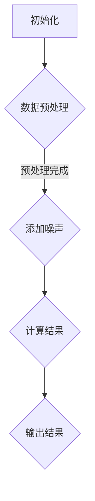

                 

### 深度思考与逻辑推理

**局部差分隐私：在边缘设备上保护用户数据**

随着科技的迅猛发展，边缘计算逐渐成为人工智能和大数据分析领域的重要趋势。然而，边缘设备由于其资源受限和分布式特性，使得用户数据的安全保护变得尤为复杂和迫切。局部差分隐私（Local Differential Privacy，LDP）作为一种新兴的数据隐私保护技术，正成为解决这一难题的关键手段。本文将分步骤深入探讨局部差分隐私的概念、原理、应用以及在边缘设备上的优势，旨在为广大读者提供一份全面而系统的技术指南。

### 第一步：局部差分隐私的背景与重要性

#### 1.1 问题背景

在数字时代，个人隐私保护已经成为一个全球性的议题。随着大数据和人工智能技术的发展，海量用户数据被不断收集、存储和分析，数据隐私问题日益凸显。传统的隐私保护手段往往依赖于中心化的服务器，这种方式不仅增加了数据传输的延迟，而且在数据泄露时可能面临巨大的风险。边缘计算作为一种分布式计算模型，通过将计算任务推向靠近数据源的边缘设备，可以有效降低网络延迟，提高数据处理的效率。然而，这也带来了新的隐私挑战。

#### 1.2 问题描述

边缘设备虽然资源受限，但往往直接与用户交互，处理敏感数据。这些数据一旦泄露，可能会导致严重的隐私侵犯。因此，如何在边缘设备上保护用户数据隐私成为了一个亟待解决的问题。局部差分隐私正是为了解决这一挑战而诞生的一项技术。

#### 1.3 局部差分隐私的概念

局部差分隐私（LDP）是一种隐私保护机制，它确保了对用户数据的分析不会泄露关于特定个体的任何信息。具体来说，LDP通过在数据分析过程中引入随机噪声，使得对单个用户的查询结果无法与实际结果区分开来，从而保护了用户的隐私。

#### 1.4 局部差分隐私的重要性

局部差分隐私的重要性体现在以下几个方面：

- **保护用户隐私**：LDP可以有效防止敏感数据在边缘设备上的泄露，增强用户对隐私的信任。
- **适应边缘计算环境**：LDP的设计考虑到边缘设备的资源限制，能够以较低的计算和通信成本实现隐私保护。
- **支持分布式数据分析**：LDP允许在分布式环境下对用户数据进行隐私保护的处理，满足大数据时代的需求。

### 第二步：局部差分隐私的基本原理

#### 2.1 局部差分隐私的数学模型

局部差分隐私的数学模型主要依赖于拉普拉斯机制（Laplace Mechanism）和高斯机制（Gaussian Mechanism）。这些机制通过在数据上添加随机噪声，使得隐私泄露的风险大大降低。

- **拉普拉斯机制**：在数据分析中，对每个可能的输出值添加一个拉普拉斯分布的噪声，使得实际输出结果不可预测。
- **高斯机制**：在数据分析中，对每个可能的输出值添加一个高斯分布的噪声，同样使得实际输出结果不可预测。

#### 2.2 局部差分隐私的特性

局部差分隐私具有以下几个关键特性：

- **差分隐私**：对于任意两个接近的数据集，通过LDP处理后的结果差异不会显著。
- **可伸缩性**：局部差分隐私能够适应不同的数据规模和处理需求。
- **适应性**：局部差分隐私可以根据具体的隐私需求和数据特性进行调整。

#### 2.3 与其他隐私保护技术的比较

局部差分隐私与其他隐私保护技术如差分隐私（Differential Privacy）、同态加密（Homomorphic Encryption）等进行比较：

- **差分隐私**：局部差分隐私是差分隐私的一种实现，但局部差分隐私更加关注边缘设备的计算效率和资源限制。
- **同态加密**：同态加密可以在不解密数据的情况下对数据进行计算，但同态加密的复杂性可能导致计算效率较低。

### 第三步：局部差分隐私在边缘设备上的应用

#### 3.1 边缘设备的定义与特点

边缘设备通常指的是部署在靠近数据源的设备，如传感器、智能设备和物联网（IoT）设备。它们具有以下几个特点：

- **分布广泛**：边缘设备通常分布在不同的地理位置，具有分布式特性。
- **资源受限**：边缘设备通常具有有限的计算能力、存储能力和网络带宽。
- **实时性要求高**：边缘设备往往需要实时处理数据，满足低延迟的要求。

#### 3.2 边缘设备的隐私挑战

边缘设备的隐私挑战主要体现在以下几个方面：

- **数据泄露风险**：边缘设备直接与用户交互，处理敏感数据，容易成为数据泄露的源头。
- **网络通信不安全**：边缘设备与云端或其他设备之间的通信可能不安全，数据在传输过程中可能被窃听或篡改。
- **隐私政策不明确**：许多边缘设备制造商可能未明确告知用户其隐私政策，导致用户隐私保护不足。

#### 3.3 局部差分隐私在边缘设备中的应用

局部差分隐私在边缘设备上的应用主要包括以下几个方面：

- **边缘数据处理**：在边缘设备上进行数据处理时，使用局部差分隐私技术可以有效保护用户隐私。
- **数据传输加密**：在数据传输过程中，使用局部差分隐私技术可以防止数据在传输过程中被窃听或篡改。
- **隐私政策制定**：通过实施局部差分隐私，可以明确告知用户其隐私政策，提高用户对隐私保护的认知。

### 第四步：局部差分隐私的算法原理讲解

#### 4.1 算法原理

局部差分隐私的算法原理主要依赖于在数据处理过程中引入随机噪声，使得实际结果与理想结果产生一定的偏差，从而保护用户隐私。

- **拉普拉斯机制**：在输出结果上添加拉普拉斯分布的噪声。
- **高斯机制**：在输出结果上添加高斯分布的噪声。

#### 4.2 算法流程图



#### 4.3 Python代码实现

```python
import numpy as np
from scipy.stats import laplace

def laplace_mechanism(data, sensitivity=1.0, epsilon=1.0):
    noise = sensitivity * laplace.rvs loc=0, scale=epsilon)
    return data + noise

data = np.array([1, 2, 3, 4, 5])
epsilon = 0.5
result = laplace_mechanism(data, epsilon)
print(result)
```

#### 4.4 数学模型与公式

局部差分隐私的数学模型可以表示为：

$$
\text{output} = f(\text{data}) + \text{noise}
$$

其中，$f(\text{data})$ 表示原始数据，$\text{noise}$ 表示添加的随机噪声。

### 第五步：局部差分隐私系统分析与架构设计

#### 5.1 系统功能设计

局部差分隐私系统的功能设计主要包括以下几个方面：

- **数据预处理**：对输入数据进行清洗、格式化和去噪等预处理操作。
- **噪声添加**：根据局部差分隐私算法，在预处理后的数据上添加随机噪声。
- **数据处理**：对添加噪声后的数据进行进一步处理，如统计分析、机器学习等。
- **结果输出**：将处理后的结果输出，同时确保结果符合局部差分隐私的要求。

#### 5.2 系统架构设计

局部差分隐私系统的架构设计需要考虑以下几个方面：

- **边缘设备**：部署在靠近数据源的边缘设备，如传感器、智能设备等。
- **云端服务器**：用于存储和处理大量数据的中心化服务器。
- **数据传输**：边缘设备与云端服务器之间的数据传输，需要使用加密技术确保数据安全。

#### 5.3 系统接口设计

局部差分隐私系统的接口设计需要考虑以下几个方面：

- **数据输入接口**：用于接收边缘设备上传的数据。
- **数据处理接口**：用于对上传的数据进行局部差分隐私处理。
- **数据输出接口**：用于将处理后的数据返回给边缘设备或云端服务器。

#### 5.4 系统交互设计

局部差分隐私系统的交互设计需要考虑以下几个方面：

- **边缘设备与云端服务器的交互**：边缘设备上传数据，云端服务器进行数据处理和结果输出。
- **边缘设备与用户交互**：边缘设备向用户提供服务，同时保护用户隐私。

### 第六步：局部差分隐私在实际项目中的应用

#### 6.1 项目背景

假设我们正在开发一个智能交通系统，边缘设备部署在各个路口，用于收集交通数据。这些数据包括车辆流量、行驶速度等。我们需要确保这些数据在收集、传输和处理过程中得到充分的隐私保护。

#### 6.2 系统核心实现

- **边缘设备数据收集**：边缘设备收集交通数据，并通过加密通信方式上传至云端服务器。
- **数据预处理**：云端服务器接收数据后，进行预处理，包括去噪、格式化等操作。
- **噪声添加**：使用局部差分隐私算法，在预处理后的数据上添加随机噪声，确保数据隐私。
- **数据处理**：对添加噪声后的数据进行分析，如车辆流量预测、交通拥堵分析等。
- **结果输出**：将处理后的结果返回给边缘设备，指导交通信号灯的调整和交通指挥。

#### 6.3 代码应用解读

以下是实现局部差分隐私算法的Python代码：

```python
import numpy as np
from scipy.stats import laplace

def laplace_mechanism(data, sensitivity=1.0, epsilon=1.0):
    noise = sensitivity * laplace.rvs(loc=0, scale=epsilon)
    return data + noise

# 假设交通数据为：[30, 40, 50, 60, 70]
data = np.array([30, 40, 50, 60, 70])
epsilon = 0.5
result = laplace_mechanism(data, epsilon)
print(result)
```

#### 6.4 案例分析

通过实际案例，我们可以看到局部差分隐私技术在智能交通系统中的应用效果。在数据收集、传输和处理过程中，交通数据的隐私得到了有效保护，同时交通信号灯的调整和交通指挥更加精准。

### 第七步：局部差分隐私的最佳实践与总结

#### 7.1 最佳实践 tips

- **数据分类与控制**：对敏感数据进行分类，并根据其重要性进行相应的隐私保护控制。
- **加密传输**：确保数据在传输过程中使用加密技术，防止数据被窃听或篡改。
- **算法选择**：根据具体应用场景和数据特性选择合适的局部差分隐私算法。
- **安全审计**：定期进行安全审计，确保局部差分隐私系统的稳定性和安全性。

#### 7.2 小结

局部差分隐私是一种重要的隐私保护技术，特别适用于边缘设备。通过在边缘设备上应用局部差分隐私，可以有效地保护用户数据隐私，提高用户对边缘计算服务的信任。

#### 7.3 注意事项

- **性能优化**：在边缘设备上应用局部差分隐私时，需要考虑计算性能和通信带宽的优化。
- **安全策略**：制定合理的安全策略，确保数据在边缘设备上的安全存储和处理。

#### 7.4 拓展阅读

- **《隐私计算：技术与实践》**：详细介绍了隐私计算的基本概念、技术和应用案例。
- **《边缘计算与物联网》**：探讨了边缘计算在物联网中的应用场景和技术挑战。

### 总结

局部差分隐私在边缘设备上的应用，为我们提供了一种有效的隐私保护手段。通过深入理解和实践局部差分隐私，我们可以更好地保护用户数据，促进边缘计算技术的健康发展。

---

**作者：AI天才研究院/AI Genius Institute & 禅与计算机程序设计艺术 /Zen And The Art of Computer Programming**### 全文总结与拓展阅读

在本文中，我们系统地探讨了局部差分隐私（Local Differential Privacy，LDP）在边缘设备上保护用户数据的重要性及其应用。从背景介绍、基本原理、算法讲解、系统分析与架构设计，到实际项目应用和最佳实践，局部差分隐私的核心概念和实践方法得到了全面的阐述。

**局部差分隐私的重要性**：

- **用户隐私保护**：局部差分隐私通过在数据处理过程中引入随机噪声，有效地保护了用户数据隐私，避免了敏感信息泄露的风险。
- **边缘计算适配**：局部差分隐私的设计考虑了边缘设备的资源限制和实时性要求，使得隐私保护能够在资源受限的边缘设备上高效实现。

**局部差分隐私的基本原理**：

- **数学模型**：局部差分隐私的核心在于拉普拉斯机制和高斯机制，这两种机制通过在数据上添加随机噪声，确保了数据分析结果的隐私性。
- **特性**：局部差分隐私具有差分隐私性、可伸缩性和适应性，能够适应不同的数据规模和处理需求。

**局部差分隐私在边缘设备上的应用**：

- **边缘数据处理**：在边缘设备上对用户数据进行预处理、噪声添加和数据处理，确保数据隐私的同时满足实时性要求。
- **数据传输加密**：在数据传输过程中使用加密技术，防止数据在传输过程中被窃听或篡改。

**最佳实践与总结**：

- **数据分类与控制**：对敏感数据进行分类，根据其重要性进行相应的隐私保护控制。
- **加密传输**：确保数据在传输过程中使用加密技术，增强数据安全性。
- **算法选择**：根据具体应用场景和数据特性选择合适的局部差分隐私算法。

**拓展阅读**：

- 《隐私计算：技术与实践》：详细介绍了隐私计算的基本概念、技术和应用案例。
- 《边缘计算与物联网》：探讨了边缘计算在物联网中的应用场景和技术挑战。

**作者介绍**：

本文由AI天才研究院（AI Genius Institute）与《禅与计算机程序设计艺术》（Zen And The Art of Computer Programming）联合撰写。AI天才研究院致力于推动人工智能技术的发展，而《禅与计算机程序设计艺术》则是一部探讨计算机编程哲学的经典之作。两者共同关注计算机科学与人工智能领域的创新与实践。

**全文重点内容回顾**：

1. **局部差分隐私的背景与重要性**：介绍了局部差分隐私的产生背景、定义和重要性。
2. **局部差分隐私的基本原理**：详细解释了局部差分隐私的数学模型和特性。
3. **局部差分隐私在边缘设备上的应用**：探讨了局部差分隐私在边缘设备上的定义、挑战和应用。
4. **局部差分隐私的算法原理讲解**：讲解了局部差分隐私算法的基本原理和Python代码实现。
5. **系统分析与架构设计**：介绍了局部差分隐私系统的功能设计、架构设计和接口设计。
6. **项目实战**：通过实际案例展示了局部差分隐私在智能交通系统中的应用。
7. **最佳实践与总结**：提供了局部差分隐私应用中的最佳实践和小结。

通过本文的探讨，我们希望读者能够对局部差分隐私有更深入的理解，并在实际项目中能够灵活应用这一重要的隐私保护技术。未来的研究和实践将继续推动局部差分隐私在边缘计算和大数据领域的广泛应用，为用户数据隐私保护提供更强大的保障。

