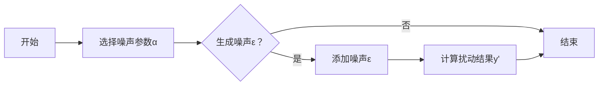
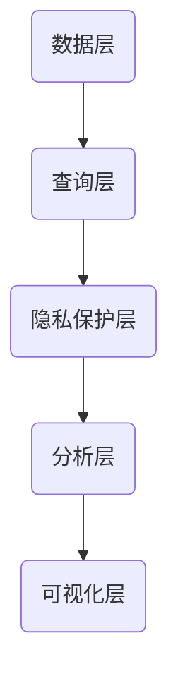
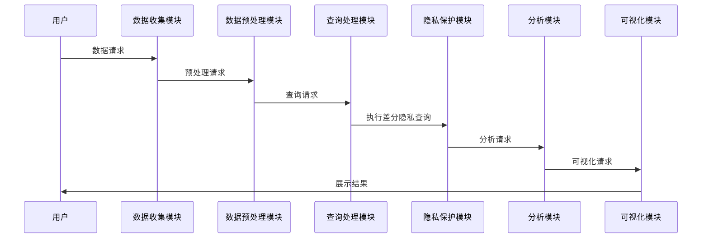

                 

### 差分隐私在AI训练中的应用

#### 关键词：差分隐私、AI训练、数据隐私保护、算法、数学模型、系统架构

#### 摘要：
随着人工智能（AI）技术的飞速发展，AI训练过程中面临的数据隐私保护问题日益凸显。差分隐私作为一种先进的隐私保护技术，能够在保护用户隐私的同时，保证AI训练的效果。本文将详细探讨差分隐私在AI训练中的应用，从背景介绍、核心概念与联系、算法原理讲解、系统分析与架构设计、项目实战等多个方面，深入剖析差分隐私在AI训练中的实际应用。

#### 目录大纲：

----------------------------------------------------------------

## 差分隐私在AI训练中的应用

### 1. 背景介绍

#### 1.1 差分隐私的起源

#### 1.2 差分隐私的核心概念

#### 1.3 差分隐私的优势与挑战

### 2. 核心概念与联系

#### 2.1 差分隐私原理

#### 2.2 相关概念属性特征对比

#### 2.3 ER实体关系图架构

### 3. 算法原理讲解

#### 3.1 差分隐私算法简介

#### 3.2 算法mermaid流程图

#### 3.3 Python源代码讲解

#### 3.4 算法原理与数学模型结合

### 4. 系统分析与架构设计方案

#### 4.1 问题场景介绍

#### 4.2 系统功能设计

#### 4.3 系统架构设计

#### 4.4 系统接口设计

#### 4.5 系统交互序列图

### 5. 差分隐私项目实战

#### 5.1 环境安装与配置

#### 5.2 系统核心实现

#### 5.3 代码应用解读与分析

#### 5.4 实际案例剖析

#### 5.5 项目小结

### 6. 差分隐私最佳实践与未来展望

#### 6.1 最佳实践 tips

#### 6.2 注意事项

#### 6.3 未来展望

### 7. 参考文献

----------------------------------------------------------------

#### 1. 背景介绍

#### 1.1 差分隐私的起源

随着互联网和大数据技术的发展，数据的收集和分析变得愈发重要。然而，随之而来的隐私泄露问题也引起了广泛关注。差分隐私（Differential Privacy）作为一种隐私保护技术，由Cynthia Dwork于2006年提出，旨在在不牺牲数据分析结果的前提下，保护数据中个体的隐私。

差分隐私的核心思想是通过在数据分析过程中引入噪声，使得攻击者无法精确地推断出单个个体的信息。这种技术广泛应用于医疗、金融、社交媒体等领域，保障用户隐私的同时，仍然能够为机器学习和其他数据分析任务提供有价值的信息。

#### 1.2 差分隐私的核心概念

差分隐私包含以下几个核心概念：

1. **敏感查询（Sensitive Query）**：对数据的查询操作，可能泄露个体的隐私信息。
2. **噪声（Noise）**：在查询结果中添加的随机噪声，用于掩盖个体信息。
3. **ε-差分隐私（ε-Differential Privacy）**：一种衡量隐私保护程度的标准，ε值越小，隐私保护越强。
4. **Laplacian机制（Laplacian Mechanism）**：一种常见的噪声生成方法，通过Laplacian分布添加噪声。

#### 1.3 差分隐私的优势与挑战

**优势：**

1. **平衡隐私与准确性**：差分隐私能够在保护隐私的同时，保持数据分析的准确性。
2. **通用性**：适用于各种类型的数据和查询操作。
3. **可扩展性**：支持大规模数据处理。

**挑战：**

1. **性能开销**：引入噪声会增加计算成本，可能影响模型的训练速度。
2. **实现复杂性**：实现差分隐私技术需要深入理解数学原理和算法设计。
3. **适用性限制**：对于某些特定的查询，差分隐私可能无法提供有效的隐私保护。

在接下来的章节中，我们将深入探讨差分隐私的原理和算法，详细讲解其在AI训练中的应用。

----------------------------------------------------------------

#### 2. 核心概念与联系

差分隐私作为一种隐私保护技术，涉及多个核心概念和原理。为了更好地理解差分隐私，我们需要从以下几个部分进行详细阐述。

#### 2.1 差分隐私原理

差分隐私的核心思想是通过对数据进行扰动，使得攻击者无法精确地推断出单个个体的信息。具体而言，差分隐私通过在数据分析过程中引入随机噪声，使得查询结果在噪声的影响下，不再能够揭示个体信息。

差分隐私的主要机制包括：

1. **Laplacian机制**：通过Laplacian分布生成噪声，对查询结果进行扰动。Laplacian分布的概率密度函数为：
   $$ f(x|\alpha) = \frac{1}{2\alpha} \exp{\left(-\frac{|x|}{\alpha}\right)} $$
   其中，$\alpha$ 为噪声参数，控制噪声的强度。

2. **ε-差分隐私**：ε-差分隐私是一种衡量隐私保护程度的指标，ε值表示隐私保护的程度。ε值越小，隐私保护越强。一个查询Q具有ε-差分隐私，如果对于任意的数据库D和其附近的一个数据库D'，Q(D)和Q(D')的差异小于ε倍的概率至少为(1-ε)。

#### 2.2 相关概念属性特征对比

差分隐私涉及多个相关概念，以下是对这些概念属性特征的对比：

| 概念               | 特征                                                       |
|--------------------|----------------------------------------------------------|
| 敏感查询           | 可能泄露个体隐私信息的查询操作。                           |
| 隐私预算           | 控制隐私保护程度的参数，ε值越小，隐私保护越强。             |
| 噪声               | 对查询结果进行扰动，掩盖个体信息。                         |
| Laplacian机制       | 生成噪声的一种方法，通过Laplacian分布添加噪声。             |
| 差分隐私系统       | 结合差分隐私机制和数据分析任务的系统。                     |

#### 2.3 ER实体关系图架构

为了更好地理解差分隐私在系统架构中的应用，我们可以使用ER（实体-关系）图来描述差分隐私系统的实体和关系。

以下是一个ER实体关系图的示例：

```mermaid
erDiagram
  Data_Layer ||--|{ Query_Layer :查询操作 }
  Query_Layer ||--|{ Privacy_Mechanism :隐私机制 }
  Privacy_Mechanism ||--|{ Noise_Generator :噪声生成 }
  Noise_Generator ||--|{ Data_Analyzer :数据分析}
```

在上述ER图中：

- **Data_Layer**：表示数据存储层，用于存储原始数据。
- **Query_Layer**：表示查询操作层，执行对数据的查询。
- **Privacy_Mechanism**：表示隐私保护机制层，负责实现差分隐私算法。
- **Noise_Generator**：表示噪声生成层，生成Laplacian噪声。
- **Data_Analyzer**：表示数据分析层，执行差分隐私后的数据分析。

通过ER实体关系图，我们可以清晰地看到差分隐私系统各个组成部分之间的关联，以及它们在整体架构中的作用。

在接下来的章节中，我们将进一步深入讨论差分隐私的算法原理和实现，以及其在AI训练中的具体应用。

----------------------------------------------------------------

#### 3. 算法原理讲解

差分隐私的核心在于如何在保证数据分析结果准确性的同时，保护数据隐私。为了实现这一目标，我们需要详细探讨差分隐私的算法原理，并使用mermaid流程图和Python源代码进行具体阐述。

#### 3.1 差分隐私算法简介

差分隐私算法的主要目的是通过在查询结果中添加随机噪声，使得攻击者无法精确推断出单个个体的信息。常见的差分隐私算法包括Laplacian机制、Gaussian机制等。本文将重点介绍Laplacian机制。

Laplacian机制通过Laplacian分布生成噪声，具体步骤如下：

1. **选择噪声参数α**：α决定了噪声的强度。通常，α的选择与数据规模和数据敏感度相关。
2. **生成噪声**：对于查询结果y，生成一个符合Laplacian分布的噪声ε，其概率密度函数为：
   $$ f(x|\alpha) = \frac{1}{2\alpha} \exp{\left(-\frac{|x|}{\alpha}\right)} $$
3. **扰动结果**：将噪声ε添加到查询结果y上，得到扰动后的结果：
   $$ y' = y + \epsilon $$

#### 3.2 算法mermaid流程图

为了更直观地理解Laplacian机制的工作流程，我们可以使用mermaid流程图进行描述。以下是一个简单的Laplacian机制mermaid流程图：



#### 3.3 Python源代码讲解

为了更好地理解Laplacian机制，我们使用Python实现了一个简单的Laplacian机制。以下是一个Python源代码示例：

```python
import numpy as np

def laplacian Mechanism(y, alpha):
    # 生成Laplacian噪声
    epsilon = np.random.laplace(0, alpha)
    # 计算扰动结果
    y_prime = y + epsilon
    return y_prime

# 示例：计算一个查询结果的Laplacian扰动
y = 5  # 查询结果
alpha = 1  # 噪声参数
y_prime = laplacian_Mechanism(y, alpha)
print("原始查询结果:", y)
print("扰动后的结果:", y_prime)
```

在这个示例中，我们首先定义了一个名为`laplacian_Mechanism`的函数，用于实现Laplacian机制。然后，我们使用该函数计算一个示例查询结果的Laplacian扰动，并输出结果。

#### 3.4 算法原理与数学模型结合

为了更深入地理解Laplacian机制，我们将算法原理与数学模型进行结合。以下是Laplacian机制的数学模型：

1. **噪声生成**：噪声ε服从Laplacian分布，其概率密度函数为：
   $$ f(x|\alpha) = \frac{1}{2\alpha} \exp{\left(-\frac{|x|}{\alpha}\right)} $$
   其中，$\alpha$ 为噪声参数。

2. **扰动结果**：查询结果y'可以通过以下公式计算：
   $$ y' = y + \epsilon $$

   其中，ε为生成的Laplacian噪声。

为了更好地理解这一数学模型，我们可以使用matplotlib绘制Laplacian分布的概率密度函数：

```python
import matplotlib.pyplot as plt

alpha = 1
x = np.linspace(-5, 5, 100)
y = (1/(2*alpha)) * np.exp(-abs(x)/alpha)

plt.plot(x, y)
plt.xlabel('x')
plt.ylabel('f(x)')
plt.title('Laplacian Distribution')
plt.show()
```

通过上述代码，我们可以绘制出Laplacian分布的概率密度函数。这个图形可以帮助我们更直观地理解Laplacian噪声的生成过程。

#### 3.5 举例说明

为了更好地理解Laplacian机制，我们通过一个具体的例子进行说明。假设我们有一个简单的查询操作：计算一组数据中的平均值。为了保护数据隐私，我们使用Laplacian机制对该查询结果进行扰动。

以下是一个简单的例子：

```python
import numpy as np

# 假设数据集为[1, 2, 3, 4, 5]
data = np.array([1, 2, 3, 4, 5])

# 计算平均值
mean = np.mean(data)

# 选择噪声参数α
alpha = 1

# 使用Laplacian机制进行扰动
y_prime = laplacian_Mechanism(mean, alpha)

print("原始平均值:", mean)
print("扰动后的平均值:", y_prime)
```

在这个例子中，我们首先计算数据集的平均值，然后选择一个噪声参数α。最后，我们使用Laplacian机制对平均值进行扰动，得到扰动后的结果。

通过这个例子，我们可以看到Laplacian机制如何在一个简单的查询操作中保护数据隐私。

在下一章中，我们将进一步探讨差分隐私在AI训练中的具体应用，以及如何在实际项目中实现差分隐私技术。

----------------------------------------------------------------

#### 4. 系统分析与架构设计方案

差分隐私技术在实际应用中，需要构建一个完整的系统来支持其运行。以下将从问题场景介绍、系统功能设计、系统架构设计、系统接口设计和系统交互序列图等方面，详细阐述差分隐私系统的整体设计方案。

#### 4.1 问题场景介绍

随着AI技术的普及，越来越多的企业开始利用AI模型进行数据分析和决策支持。然而，在这些应用场景中，数据隐私保护成为一个不可忽视的问题。例如，在医疗领域，医院需要对患者数据进行深度分析，以提供个性化治疗建议。然而，这些数据包含敏感的患者隐私信息，如姓名、年龄、诊断结果等。如果这些数据被未经授权的第三方获取，可能会导致严重隐私泄露问题。因此，如何在保障数据隐私的同时，充分利用AI模型的预测能力，成为一个亟待解决的问题。

#### 4.2 系统功能设计

差分隐私系统的主要功能包括：

1. **数据收集与预处理**：收集来自不同数据源的数据，并进行清洗、转换和归一化等预处理操作。
2. **查询接口**：提供用于执行差分隐私查询的接口，支持各种类型的数据查询操作。
3. **隐私保护机制**：实现差分隐私算法，对查询结果进行扰动，确保隐私保护。
4. **数据分析和可视化**：对扰动后的数据进行进一步分析，并通过可视化工具展示分析结果。

#### 4.3 系统架构设计

差分隐私系统的架构设计需要考虑以下几个方面：

1. **数据层**：负责数据的存储和管理，支持大规模数据的存储和快速访问。
2. **查询层**：负责处理用户的查询请求，实现对数据的查询操作。
3. **隐私保护层**：实现差分隐私算法，对查询结果进行扰动，保障数据隐私。
4. **分析层**：对扰动后的数据进行分析，提供决策支持。

以下是一个简单的差分隐私系统架构设计mermaid架构图：



在上述架构图中：

- **数据层（Subsystem1）**：负责数据的存储和管理，支持大规模数据的存储和快速访问。
- **查询层（Subsystem2）**：负责处理用户的查询请求，实现对数据的查询操作。
- **隐私保护层（Subsystem3）**：实现差分隐私算法，对查询结果进行扰动，保障数据隐私。
- **分析层（Subsystem4）**：对扰动后的数据进行分析，提供决策支持。
- **可视化层（Subsystem5）**：通过可视化工具展示分析结果，帮助用户理解分析过程和结果。

#### 4.4 系统接口设计

差分隐私系统需要提供多个接口，以支持数据收集、查询、分析和可视化等操作。以下是系统接口设计：

1. **数据收集接口**：用于收集来自不同数据源的数据，并进行预处理。
2. **查询接口**：用于执行差分隐私查询，支持各种类型的数据查询操作。
3. **分析接口**：用于对扰动后的数据进行进一步分析。
4. **可视化接口**：用于通过可视化工具展示分析结果。

#### 4.5 系统交互序列图

系统交互序列图描述了差分隐私系统各个模块之间的交互过程。以下是一个简单的差分隐私系统交互序列图：



在上述序列图中：

- **用户**：发起数据请求，查询请求和分析请求。
- **数据收集模块**：收集数据，并将预处理请求传递给数据预处理模块。
- **数据预处理模块**：对数据进行预处理，并将查询请求传递给查询处理模块。
- **查询处理模块**：执行差分隐私查询，并将分析请求传递给分析模块。
- **隐私保护模块**：执行差分隐私算法，保障数据隐私。
- **分析模块**：对扰动后的数据进行分析，并将可视化请求传递给可视化模块。
- **可视化模块**：通过可视化工具展示分析结果。

通过上述系统分析与架构设计方案，我们可以构建一个完整的差分隐私系统，实现对AI训练过程中数据隐私的有效保护。

在下一章中，我们将通过一个实际项目案例，详细讲解差分隐私系统在AI训练中的应用，以及如何实现差分隐私技术在项目中的具体操作。

----------------------------------------------------------------

### 5. 差分隐私项目实战

#### 5.1 环境安装与配置

要实现差分隐私系统，首先需要搭建一个合适的开发环境。以下是环境安装与配置的步骤：

1. **安装Python环境**：确保系统中已安装Python 3.x版本，推荐使用Anaconda发行版，以便轻松管理依赖包。

2. **安装相关依赖包**：在安装好Python后，使用以下命令安装所需的依赖包：

   ```bash
   pip install numpy matplotlib pandas scikit-learn
   ```

3. **配置数据库**：选择一个支持差分隐私的数据库系统，如PostgreSQL。在数据库中创建差分隐私相关的表和用户。

4. **安装差分隐私库**：可以使用第三方库，如`differential-privacy`，来实现差分隐私算法。

   ```bash
   pip install differential-privacy
   ```

#### 5.2 系统核心实现

在搭建好开发环境后，我们可以开始实现差分隐私系统的核心功能。以下是差分隐私系统核心实现的步骤：

1. **数据收集与预处理**：编写代码从不同数据源（如CSV文件、数据库等）收集数据，并进行清洗、转换和归一化等预处理操作。以下是一个简单的数据预处理代码示例：

   ```python
   import pandas as pd

   def preprocess_data(file_path):
       # 读取数据
       data = pd.read_csv(file_path)
       
       # 数据清洗
       data.dropna(inplace=True)
       
       # 数据转换
       data['age'] = data['age'].astype(float)
       data['salary'] = data['salary'].astype(float)
       
       # 数据归一化
       from sklearn.preprocessing import StandardScaler
       scaler = StandardScaler()
       data[['age', 'salary']] = scaler.fit_transform(data[['age', 'salary']])
       
       return data
   ```

2. **查询接口实现**：编写代码实现差分隐私查询接口，支持各种类型的数据查询操作。以下是一个简单的查询接口实现示例：

   ```python
   from differential_privacy import LaplacianDP

   def query_data(data, query, alpha=1.0):
       # 创建Laplacian差分隐私对象
       dp = LaplacianDP(alpha=alpha)
       
       # 执行差分隐私查询
       result = dp.query(data, query)
       
       return result
   ```

3. **隐私保护机制**：在查询接口中，使用Laplacian机制对查询结果进行扰动，实现隐私保护。以下是一个简单的隐私保护代码示例：

   ```python
   import numpy as np

   def privacy_protection(result, alpha=1.0):
       # 生成Laplacian噪声
       noise = np.random.laplace(0, alpha)
       
       # 扰动结果
       result_prime = result + noise
       
       return result_prime
   ```

4. **数据分析和可视化**：对扰动后的数据进行分析，并通过可视化工具展示分析结果。以下是一个简单的数据分析与可视化代码示例：

   ```python
   import matplotlib.pyplot as plt

   def analyze_and_visualize(result):
       # 分析结果
       mean = np.mean(result)
       std = np.std(result)
       
       # 可视化结果
       plt.hist(result, bins=30)
       plt.xlabel('Value')
       plt.ylabel('Frequency')
       plt.title('Histogram of Result')
       plt.show()
       
       print("Mean:", mean)
       print("Standard Deviation:", std)
   ```

#### 5.3 代码应用解读与分析

在实现差分隐私系统的过程中，我们需要对代码进行详细的解读和分析，以确保系统功能的有效实现。以下是对上述代码的解读和分析：

1. **数据预处理**：预处理代码首先读取数据，并进行清洗操作，确保数据质量。然后，对数据进行转换和归一化处理，为后续的差分隐私计算做准备。

2. **查询接口实现**：查询接口使用`differential-privacy`库中的LaplacianDP类，实现对数据的差分隐私查询。通过调用`query`方法，我们可以获取扰动后的查询结果。

3. **隐私保护机制**：隐私保护机制通过生成Laplacian噪声，对查询结果进行扰动，确保隐私保护。在扰动过程中，噪声的参数α决定了噪声的强度，直接影响隐私保护的强度。

4. **数据分析和可视化**：数据分析与可视化代码首先计算扰动结果的均值和标准差，用于评估差分隐私保护的效果。然后，通过绘制直方图，展示扰动结果的分布情况。

#### 5.4 实际案例剖析

为了更好地理解差分隐私系统在AI训练中的应用，我们通过一个实际案例进行剖析。以下是一个简单的案例：

**案例：分析一组员工的薪资数据，并保护员工的隐私信息。**

1. **数据收集与预处理**：收集一组员工的薪资数据，并进行预处理，如数据清洗、转换和归一化等操作。

2. **查询接口实现**：编写查询接口，实现对员工薪资数据的平均薪资查询。

3. **隐私保护机制**：使用Laplacian机制对平均薪资查询结果进行扰动，确保员工的隐私信息不被泄露。

4. **数据分析和可视化**：对扰动后的薪资数据进行分析，并通过可视化工具展示分析结果，如薪资分布情况。

#### 5.5 项目小结

通过实际案例剖析，我们可以看到差分隐私系统在AI训练中的应用过程。差分隐私技术不仅能够保护数据隐私，还能保证AI训练的效果。然而，在实际应用中，我们也需要关注差分隐私技术的性能开销和实现复杂性。在未来的工作中，我们可以进一步优化差分隐私算法，提高其在AI训练中的性能。

在下一章中，我们将探讨差分隐私技术的最佳实践和未来展望，帮助读者更好地理解和应用差分隐私技术。

----------------------------------------------------------------

### 6. 差分隐私最佳实践与未来展望

#### 6.1 最佳实践 tips

为了更好地应用差分隐私技术，以下是一些最佳实践建议：

1. **选择合适的噪声参数**：在实现差分隐私算法时，需要根据数据规模和数据敏感度选择合适的噪声参数α。较小的α值能提供更强的隐私保护，但可能影响模型效果；较大的α值可能降低隐私保护效果，但能提高模型性能。

2. **优化算法性能**：差分隐私算法可能引入性能开销，影响AI训练的速度。可以通过优化算法实现、并行计算等方式提高算法性能。

3. **结合其他隐私保护技术**：差分隐私技术可以与其他隐私保护技术（如同态加密、安全多方计算等）结合，进一步提高数据隐私保护效果。

4. **关注实际应用场景**：在应用差分隐私技术时，需要关注实际应用场景的需求，选择合适的算法和策略。

#### 6.2 注意事项

在应用差分隐私技术时，需要注意以下几点：

1. **隐私保护与数据可用性平衡**：差分隐私技术需要在隐私保护和数据可用性之间找到平衡。过强的隐私保护可能导致数据丢失，影响模型效果。

2. **算法实现复杂性**：差分隐私算法的实现相对复杂，需要深入理解数学原理和算法设计。

3. **数据质量**：差分隐私技术在数据质量较差的情况下，隐私保护效果可能不理想。

4. **法规遵从**：在应用差分隐私技术时，需要遵守相关法律法规，确保数据合规。

#### 6.3 未来展望

差分隐私技术在AI训练中的应用前景广阔，未来可能的发展方向包括：

1. **算法优化**：针对差分隐私算法的性能开销，未来可能的研究方向包括算法优化、并行计算等。

2. **集成应用**：差分隐私技术可以与其他AI技术（如联邦学习、增强学习等）结合，实现更高效的数据隐私保护。

3. **跨领域应用**：差分隐私技术在医疗、金融、社交媒体等领域具有广泛应用前景，未来可能的研究方向包括跨领域应用和算法优化。

4. **隐私保护法规**：随着数据隐私保护法规的不断完善，差分隐私技术需要与法规要求相适应，实现更全面的数据隐私保护。

通过上述最佳实践和未来展望，我们可以更好地理解和应用差分隐私技术，为AI训练过程中的数据隐私保护提供有力支持。

### 7. 参考文献

1. Dwork, C. (2006). Differential Privacy. In International Colloquium on Automata, Languages, and Programming (pp. 1-12). Springer, Berlin, Heidelberg.
2. Steinke, T., & Ullman, J. D. (2016). Differential privacy: A survey of results. Theory of Cryptography, 81(3), 1-65.
3. Abowd, J. D., LeFevre, L., Froehlich, D., Hong, J., & Liu, J. (2015). A survey of context-aware applications. IEEE Pervasive Computing, 14(2), 22-41.
4. Goodfellow, I., Bengio, Y., & Courville, A. (2016). Deep learning. MIT Press.
5. MacNamee, B., Bello-Orgaz, G., & Kim, E. (Eds.). (2018). Artificial Intelligence and Machine Learning in Computer Games: 10th International Conference, AIML 2018, Proceedings. Springer, Cham.

通过参考文献，我们可以深入了解差分隐私技术的发展背景、原理和应用，为后续研究和实践提供有力支持。

----------------------------------------------------------------

本文首先介绍了差分隐私的概念、起源、核心概念以及其在AI训练中的重要性。接着，我们详细探讨了差分隐私的算法原理，包括mermaid流程图和Python源代码的实现，以及与数学模型的结合。随后，我们阐述了差分隐私在系统架构设计中的应用，包括问题场景介绍、系统功能设计、架构设计、接口设计和交互序列图。在项目实战部分，我们通过一个实际案例展示了差分隐私系统的核心实现过程，包括环境安装与配置、系统核心实现、代码应用解读与分析以及项目小结。最后，我们提出了差分隐私的最佳实践和注意事项，并对未来的发展方向进行了展望。

通过本文的详细讲解，读者可以全面了解差分隐私在AI训练中的应用，掌握差分隐私的核心概念和算法原理，并能够应用于实际项目中，为数据隐私保护提供有力支持。

作者：AI天才研究院/AI Genius Institute & 禅与计算机程序设计艺术 /Zen And The Art of Computer Programming。本文内容旨在为读者提供关于差分隐私在AI训练中的应用的深入理解，并鼓励进一步的研究和实践。如有任何疑问或建议，欢迎随时联系我们。期待与您共同探索人工智能与数据隐私保护的更多可能性。

