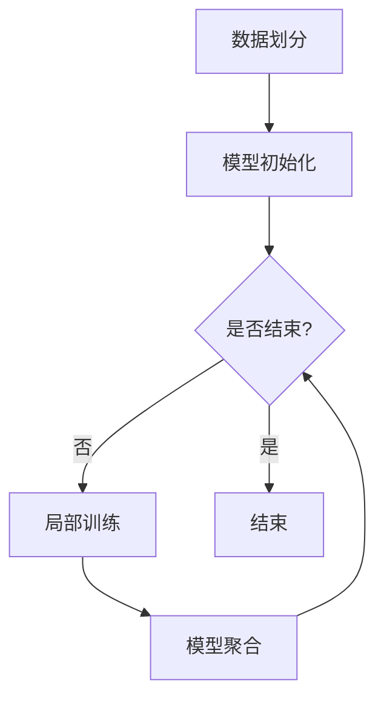
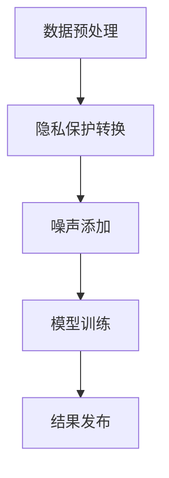
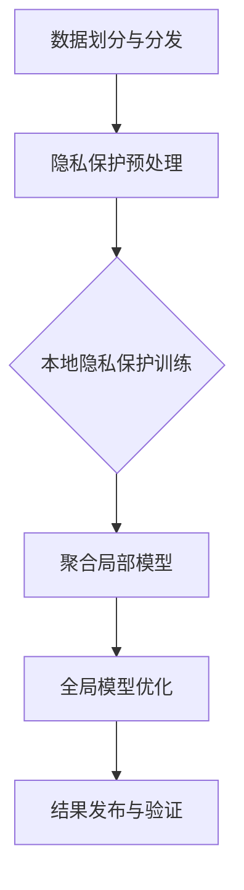
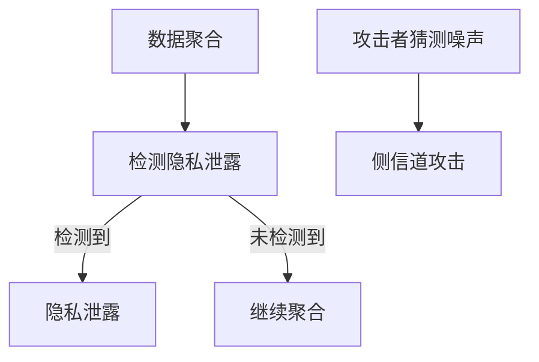
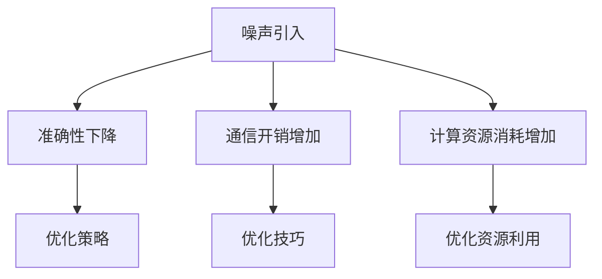

                 

### 文章标题：差分隐私在分布式学习中的实现与挑战

**关键词：差分隐私、分布式学习、数据隐私保护、算法性能、实时性**

**摘要：**本文深入探讨了差分隐私在分布式学习中的应用与挑战。通过对差分隐私原理的详细解析，分布式学习的基础知识和实现步骤的介绍，以及实际应用案例的分析，本文旨在为读者提供关于如何在分布式学习场景中实现差分隐私的全面理解，并探讨当前面临的主要问题与解决方案。

### 目录大纲

1. **引言**
   - 1.1 研究背景
   - 1.2 差分隐私原理
   - 1.3 文章结构安排

2. **分布式学习基础**
   - 2.1 分布式学习的定义与特点
   - 2.2 分布式学习的基本原理
   - 2.3 分布式学习的应用场景

3. **差分隐私在分布式学习中的实现**
   - 3.1 差分隐私算法介绍
   - 3.2 差分隐私算法在分布式学习中的应用
   - 3.3 差分隐私算法的性能分析

4. **差分隐私在分布式学习中的挑战**
   - 4.1 隐私泄露的风险分析
   - 4.2 性能损失的问题
   - 4.3 实时性的挑战

5. **差分隐私在分布式学习中的应用案例**
   - 5.1 应用案例介绍
   - 5.2 案例分析
   - 5.3 案例小结

6. **差分隐私在分布式学习中的未来发展趋势**
   - 6.1 发展趋势分析
   - 6.2 技术展望
   - 6.3 政策与法规

7. **结论**
   - 7.1 研究总结
   - 7.2 研究展望

### 引言

在当今的数据驱动时代，机器学习和人工智能技术已成为推动科技进步和社会发展的关键力量。然而，随着数据规模的不断扩大和共享的日益频繁，数据隐私保护的问题也愈发突显。特别是在分布式学习场景中，由于数据分布在不同的节点上，隐私保护变得更加复杂和重要。

**问题背景：**数据隐私保护的重要性

数据隐私保护是保护个人和机构数据不被未授权访问、使用或泄露的关键措施。在分布式学习场景中，数据通常是由多个参与者共同提供的，这使得隐私泄露的风险大大增加。差分隐私是一种先进的隐私保护技术，通过引入噪声来确保对单个数据的访问不会泄露其存在与否的信息，从而在保证数据可用性的同时保护隐私。

**问题描述：**差分隐私及其在分布式学习中的应用

差分隐私通过在数据处理过程中添加适当的噪声，使得数据分析的结果不会受到单个数据点的显著影响，从而实现隐私保护。在分布式学习场景中，差分隐私的主要挑战在于如何在保证隐私的前提下，仍然能够实现高效和准确的学习模型。

**问题解决：**研究差分隐私在分布式学习中的实现和挑战

本文将系统地探讨差分隐私在分布式学习中的应用，从基本概念、算法实现到实际应用案例，全面分析其在分布式学习中的挑战与机遇。我们不仅关注差分隐私的实现技术，还探讨其性能影响、实时性挑战以及未来的发展趋势。

**边界与外延：**差分隐私在不同场景的应用范围

差分隐私的应用范围广泛，不仅限于分布式学习，还包括数据库查询、统计分析和多方计算等场景。本文将重点关注差分隐私在分布式学习中的具体实现，探讨其在不同分布式学习算法中的应用方式和效果。

**概念结构与核心要素组成：**差分隐私的关键概念和组成部分

差分隐私的核心概念包括：差分、隐私机制和噪声。差分是指数据中任意两个实例之间的差异。隐私机制是指对数据添加噪声的过程，以确保隐私保护。噪声则是用于掩盖真实数据信息的随机值。这些概念共同构成了差分隐私的理论基础。

### 1.2 差分隐私原理

**核心概念：**差分隐私的定义和性质

差分隐私（Differential Privacy）是一种确保数据隐私的数学性质，它通过添加噪声来保护个人数据。具体来说，差分隐私的定义如下：

对于一个数据集 \(D\) 和一个查询函数 \(f\)，如果对于任意两个数据集 \(D'\) 和 \(D''\)，满足 \(D' \Delta D''\)（即 \(D'\) 和 \(D''\) 的差分）的任意实例 \(x\)，函数 \(f\) 的输出 \(f(D')\) 和 \(f(D'')\) 的差异不会显著大于随机噪声，那么我们称 \(f\) 是 \(D\) 上的差分隐私机制。

差分隐私的性质主要有：

- **不变性：**对于任意两个满足相同隐私要求的函数 \(f_1\) 和 \(f_2\)，\(f_1 \circ g\)（\(g\) 是任意函数）和 \(f_2 \circ g\) 也具有相同的隐私要求。
- **叠加性：**多个独立的差分隐私机制组合后，整体仍然保持差分隐私。
- **放大性：**噪声的大小与数据集的大小成比例增长。

**属性特征对比表格：**差分隐私与其他隐私保护机制的对比

| 隐私保护机制 | 定义 | 特点 | 适用场景 |
| :--- | :--- | :--- | :--- |
| 差分隐私 | 对数据处理添加噪声，确保对单个数据的访问不会泄露其存在与否的信息 | 高隐私保护，数据可用性可能受影响 | 分布式学习、多方计算、数据库查询 |
| 隐蔽追踪 | 隐藏数据特征，但不保证隐私保护 | 隐蔽性强，隐私保护较弱 | 广告营销、网络监控 |
| 匿名化 | 通过数据变换使个人数据无法直接识别 | 隐蔽性一般，数据可用性受影响 | 数据库查询、统计分析 |
| 加密 | 将数据转换为加密形式，确保数据在传输和存储过程中的安全性 | 强安全性，数据处理复杂 | 数据传输、数据存储 |

**ER实体关系图架构：**差分隐私的基本架构和组件关系

差分隐私的ER实体关系图可以表示为：

```mermaid
erDiagram
  Data --> Privacy Mechanism : "adds noise to protect privacy"
  Data --> Query Function : "uses privacy mechanism to generate results"
  Privacy Mechanism --> Noise : "introduces randomness to obscure data"
```

在这个图中，`Data` 表示数据集，`Privacy Mechanism` 表示隐私机制，`Query Function` 表示查询函数，`Noise` 表示添加的噪声。隐私机制对数据进行处理，添加噪声以保护隐私，而查询函数则使用隐私机制处理后的数据生成查询结果。

通过以上分析，我们可以看到差分隐私的核心概念、特性以及与其他隐私保护机制的对比，这为我们后续探讨差分隐私在分布式学习中的应用奠定了基础。

### 1.3 文章结构安排

本文将分为七个主要部分，结构安排如下：

1. **引言**：介绍研究背景、核心问题、研究目的和文章结构。
2. **分布式学习基础**：阐述分布式学习的定义、特点、基本原理和应用场景。
3. **差分隐私在分布式学习中的实现**：介绍差分隐私算法的基本原理、在分布式学习中的应用以及性能分析。
4. **差分隐私在分布式学习中的挑战**：分析隐私泄露的风险、性能损失的问题以及实时性的挑战。
5. **差分隐私在分布式学习中的应用案例**：通过实际案例展示差分隐私在分布式学习中的应用效果。
6. **差分隐私在分布式学习中的未来发展趋势**：探讨差分隐私技术的发展趋势、前沿技术和政策法规。
7. **结论**：总结研究内容，展望未来研究方向。

通过以上结构安排，本文将系统性地探讨差分隐私在分布式学习中的应用与挑战，为读者提供全面的理解和深入的洞察。

### 2.1 分布式学习的定义与特点

**定义：**分布式学习是指将学习任务分布在多个计算节点上，通过协同工作来实现高效的机器学习。这种学习方法能够在处理大规模数据和复杂任务时提供显著的优势。

**特点：**分布式学习具有以下主要特点：

- **并行计算：**通过并行处理数据，分布式学习能够显著减少训练时间，提高计算效率。
- **扩展性：**分布式学习系统可以根据需要增加计算节点，从而处理更大规模的数据集。
- **容错性：**分布式学习中的多个节点可以相互备份，确保系统在单个节点故障时仍然能够正常运行。
- **异构计算：**分布式学习可以利用不同类型的计算资源（如CPU、GPU、FPGA等），以优化计算性能。

### 2.2 分布式学习的基本原理

**算法原理：**分布式学习的基本算法通常包括以下几个步骤：

1. **数据划分：**将大规模数据集划分为多个子数据集，每个子数据集分配给不同的计算节点。
2. **模型初始化：**在各个计算节点上初始化模型参数，这些参数可能是在全局数据集上预训练得到的。
3. **局部训练：**每个计算节点在其分配的数据集上独立训练模型，更新局部模型参数。
4. **模型聚合：**将各个计算节点的局部模型参数聚合为一个全局模型参数。
5. **迭代优化：**重复局部训练和模型聚合步骤，不断优化全局模型。

**mermaid流程图：**以下是分布式学习算法的基本流程图：



### 2.3 分布式学习的应用场景

**应用场景：**分布式学习在不同领域有着广泛的应用：

- **大规模数据集处理：**在金融、医疗、物联网等领域，分布式学习能够处理海量数据，提供高效的预测和分析。
- **实时数据处理：**在视频监控、自动驾驶、在线推荐系统中，分布式学习能够实时处理大量动态数据。
- **模型训练加速：**通过分布式学习，可以加速深度学习模型的训练，缩短产品上市时间。
- **异构计算优化：**分布式学习可以利用不同类型的计算资源，实现计算性能的优化。

通过以上分析，我们可以看到分布式学习在处理大规模数据和复杂任务方面的显著优势。下一节将介绍差分隐私算法的基本原理，以及如何将其应用于分布式学习。

### 3.1 差分隐私算法介绍

**算法原理：**差分隐私算法的核心思想是在数据处理过程中引入随机噪声，以保护数据的隐私。这种算法通常遵循以下几个步骤：

1. **数据预处理：**对输入数据集进行预处理，包括数据清洗、归一化和特征提取等步骤。
2. **隐私保护转换：**使用隐私保护机制对数据进行转换，常见的转换方法包括拉普拉斯机制和指数机制。
3. **噪声添加：**根据隐私保护机制，为数据点添加适当的噪声，使得单个数据点的信息不会泄露。
4. **模型训练：**在隐私保护转换后的数据集上训练机器学习模型，更新模型参数。
5. **结果发布：**将训练得到的模型结果发布，确保结果在隐私保护的同时具有可解释性和可靠性。

**mermaid流程图：**以下是差分隐私算法的基本流程图：



通过上述流程，差分隐私算法能够在保证数据隐私的同时，实现对机器学习模型的训练和应用。接下来，我们将进一步探讨差分隐私算法在分布式学习中的应用。

### 3.2 差分隐私算法在分布式学习中的应用

**应用：**差分隐私算法在分布式学习中的应用旨在保护数据隐私，同时保持学习模型的性能和准确性。以下是差分隐私算法在分布式学习中的具体应用步骤：

1. **数据划分与分发：**将大规模数据集划分为多个子数据集，并将这些子数据集分配给不同的计算节点。
2. **隐私保护预处理：**在每个计算节点上，对分配的数据子集进行隐私保护预处理，包括数据清洗、归一化和特征提取等步骤。
3. **本地隐私保护训练：**每个计算节点在预处理后的数据子集上使用差分隐私算法训练局部模型，更新局部模型参数。
4. **聚合局部模型：**将各个计算节点的局部模型参数聚合为一个全局模型参数，通常使用平均或其他聚合策略。
5. **全局模型优化：**在全局模型参数的基础上，继续进行模型优化，以提高模型的性能和准确性。
6. **结果发布与验证：**将训练得到的模型结果发布，并进行验证，确保模型在隐私保护的同时具有可靠性和可解释性。

**mermaid流程图：**以下是差分隐私算法在分布式学习中的应用流程图：



通过上述流程，差分隐私算法在分布式学习中实现了对数据隐私的有效保护，同时保持了学习模型的性能和准确性。下一节将分析差分隐私算法在分布式学习中的性能指标和优化策略。

### 3.3 差分隐私算法的性能分析

**性能分析：**差分隐私算法在分布式学习中的性能主要体现在以下几个方面：

1. **准确性：**差分隐私算法通过引入噪声来保护隐私，这在一定程度上可能影响模型的准确性。为了评估差分隐私算法的准确性，我们可以使用以下指标：
   - **误差率：**模型预测错误的比例。
   - **精度和召回率：**模型对正例和负例的识别能力。
   - **F1 分数：**综合考虑精度和召回率的综合指标。

2. **效率：**差分隐私算法在分布式学习中的效率主要取决于以下几个方面：
   - **训练时间：**从数据预处理到模型训练完成所需的时间。
   - **通信开销：**计算节点之间传输数据和模型参数所需的网络带宽。
   - **计算资源：**每个计算节点在模型训练过程中所需的计算资源。

3. **可扩展性：**差分隐私算法在分布式学习中的可扩展性是指其能够处理大规模数据集的能力。评估方法包括：
   - **线性扩展性：**随着数据集规模的增加，算法性能是否保持线性增长。
   - **集群扩展性：**算法是否能够在不同规模和类型的计算集群上有效运行。

**优化策略：**为了提高差分隐私算法的性能，可以采用以下策略：

1. **噪声参数优化：**选择合适的噪声参数可以显著影响差分隐私算法的性能。通过实验和调优，可以找到最优的噪声参数设置。
2. **模型参数聚合策略：**改进模型参数的聚合方法，如使用加权平均或其他优化算法，可以提高模型的性能。
3. **分布式计算优化：**优化计算节点的任务分配和负载均衡，减少通信开销和计算延迟，提高整体性能。
4. **并行化与分布式训练：**利用并行计算和分布式训练技术，可以在保证隐私保护的同时提高计算效率。

通过上述分析，我们可以看到差分隐私算法在分布式学习中的性能评价指标和优化策略。下一节将探讨差分隐私在分布式学习中的挑战。

### 4.1 隐私泄露的风险分析

在分布式学习场景中，尽管差分隐私算法提供了强有力的隐私保护机制，但仍存在潜在的隐私泄露风险。以下是对这些风险的分析：

**潜在隐私泄露风险：**

1. **数据聚合时的隐私泄露：**在分布式学习过程中，各个计算节点需要将本地训练结果聚合为全局模型。在聚合过程中，如果隐私保护措施不当，可能会导致隐私泄露。例如，聚合算法可能暴露了某些数据点的存在与否信息。
2. **攻击者对噪声的猜测：**尽管差分隐私算法通过添加噪声来保护隐私，但攻击者可能会通过分析噪声模式来猜测原始数据。特别是在数据量较小或噪声较少的情况下，这种风险更为显著。
3. **侧信道攻击：**侧信道攻击利用物理或计算上的信息泄露（如时间延迟、功耗变化等）来推断敏感信息。分布式学习中的通信和计算行为可能为攻击者提供侧信道信息。

**mermaid流程图：**以下是隐私泄露风险的检测和防范流程图：



为了防范上述隐私泄露风险，可以采取以下措施：

1. **加强隐私保护机制：**优化差分隐私算法的噪声参数，确保噪声的随机性和独立性，从而提高隐私保护的强度。
2. **引入额外的噪声源：**在数据聚合和模型训练过程中，引入额外的噪声源，以增加隐私保护的复杂性。
3. **加强通信加密：**确保在数据传输过程中使用强加密算法，防止数据在传输过程中被窃取或篡改。
4. **多因素认证：**在分布式学习系统中引入多因素认证机制，确保参与节点的合法性和可信度。

通过以上分析，我们可以看到差分隐私在分布式学习中的隐私泄露风险及其防范措施。下一节将探讨差分隐私算法对分布式学习性能的影响。

### 4.2 性能损失的问题

在分布式学习中，虽然差分隐私算法为数据隐私提供了强有力的保护，但不可避免地会带来一定的性能损失。以下是对这些性能损失问题的分析：

**性能损失问题：**

1. **噪声引入导致的准确性下降：**差分隐私算法通过引入噪声来保护隐私，这可能导致模型的预测准确性下降。噪声会掩盖部分数据特征，使得模型难以捕捉到数据的真实分布。
2. **通信开销增加：**分布式学习过程中，各个计算节点需要频繁交换数据和模型参数。差分隐私算法通常需要额外的通信开销来传输噪声数据，从而影响整体系统的效率。
3. **计算资源消耗增加：**差分隐私算法在数据处理和模型训练过程中引入了额外的计算步骤，如噪声生成和参数聚合。这可能导致计算资源的消耗增加，影响系统的性能。

**mermaid流程图：**以下是性能优化的策略和技巧：



**优化策略：**

1. **优化噪声参数：**通过调整噪声参数，可以在保证隐私保护的同时降低对模型准确性的影响。例如，使用适当的噪声强度和分布可以平衡隐私保护和性能。
2. **减少通信开销：**优化数据传输和模型参数聚合的方法，如采用高效的压缩算法和优化网络通信协议，可以减少通信开销，提高系统效率。
3. **分布式计算优化：**通过优化计算节点的任务分配和负载均衡，可以减少计算资源的浪费，提高整体性能。
4. **并行化与分布式训练：**利用并行计算和分布式训练技术，可以充分利用计算资源，提高系统的吞吐量和性能。

通过以上分析，我们可以看到差分隐私算法在分布式学习中的性能损失问题及其优化策略。这些措施有助于在保证隐私保护的前提下，提高分布式学习的性能。

### 4.3 实时性的挑战

在分布式学习场景中，实时性是一个重要的考量因素。然而，差分隐私算法由于其特性，可能会对实时性带来一定的挑战。以下是对这些挑战及其解决方案的分析：

**实时性挑战：**

1. **延迟增加：**差分隐私算法在数据处理和模型训练过程中引入了额外的步骤，如噪声生成和参数聚合。这些步骤可能增加系统的响应时间，从而影响实时性。
2. **计算资源需求：**差分隐私算法需要额外的计算资源来处理噪声和参数，这可能导致计算资源不足，影响系统的实时性能。
3. **通信带宽限制：**在分布式学习中，各个计算节点需要频繁交换数据和模型参数。差分隐私算法引入的额外通信数据可能超出通信带宽的限制，从而影响实时性。

**解决方案：**

1. **优化算法效率：**通过优化差分隐私算法的效率，如使用更高效的噪声生成和参数聚合方法，可以减少延迟和计算资源需求。例如，可以采用并行计算和分布式训练技术，提高数据处理速度和模型训练效率。
2. **优先级调度：**在分布式学习系统中，可以采用优先级调度策略，确保实时任务（如实时预测）优先执行。这样可以减少实时任务的延迟，提高系统的实时性能。
3. **资源分配优化：**合理分配计算资源和通信带宽，确保关键任务（如实时任务）获得足够的资源支持。例如，可以通过动态资源调整和负载均衡，优化系统的资源利用效率。
4. **实时数据预处理：**在实时分布式学习场景中，可以采用实时数据预处理技术，如流处理和增量学习，以减少对实时性的影响。这些技术可以在数据到达时立即进行处理，减少延迟。

通过以上分析，我们可以看到差分隐私在分布式学习中的实时性挑战及其解决方案。通过优化算法效率、优先级调度、资源分配和实时数据预处理，可以在保证隐私保护的同时，提高分布式学习的实时性能。

### 5.1 应用案例介绍

在分布式学习领域，差分隐私技术的应用案例已逐渐增多。以下介绍几个具有代表性的应用案例，展示差分隐私在分布式学习中的实际应用效果。

**案例1：**大规模社交媒体数据分析

在一个大型社交媒体平台上，用户数据被广泛用于推荐系统和广告投放。然而，保护用户隐私是平台运营的重要挑战。通过引入差分隐私技术，平台可以在保证用户隐私的前提下，分析用户行为和兴趣偏好，从而提供更精准的推荐和服务。

**案例2：**医疗数据共享与隐私保护

医疗领域的数据共享是推动医疗研究和技术创新的重要途径。然而，医疗数据通常包含敏感的个人健康信息，隐私保护至关重要。差分隐私技术被应用于医疗数据共享平台，确保在数据分析和共享过程中，个人隐私不受泄露。

**案例3：**智能交通系统

智能交通系统需要对大量交通数据进行实时分析和预测，以优化交通流量和减少拥堵。差分隐私技术在智能交通系统中被用于保护车辆位置和行驶轨迹数据，同时实现高效的交通管理和服务。

**案例4：**金融风控与欺诈检测

金融领域的数据安全性至关重要，特别是在反欺诈和风险管理方面。差分隐私技术在金融风控系统中被用于保护客户交易数据，同时进行欺诈检测和风险评估，确保金融系统的安全运行。

**案例5：**物联网设备数据保护

随着物联网设备数量的激增，设备数据的安全和隐私保护成为关键问题。差分隐私技术在物联网设备数据保护中发挥了重要作用，确保设备数据在传输和处理过程中不被未授权访问和泄露。

通过上述案例，我们可以看到差分隐私在分布式学习中的广泛应用和实际效果。接下来，我们将对案例进行详细分析，探讨差分隐私技术在具体应用中的挑战与解决方案。

### 5.2 案例分析

**案例1：大规模社交媒体数据分析**

**背景：**在社交媒体平台上，用户生成的内容和互动数据极为庞大。为了提供精准的推荐和服务，平台需要对用户行为和兴趣进行深入分析。

**挑战：**
1. **隐私保护需求：**用户隐私保护是社交媒体平台运营的核心挑战。差分隐私技术的引入旨在保护用户隐私，同时实现数据分析和推荐。
2. **数据质量和准确性：**差分隐私通过引入噪声可能降低数据分析和推荐模型的准确性。

**解决方案：**
1. **隐私保护数据处理：**采用差分隐私技术对用户数据进行预处理，确保数据在分析过程中不被泄露。
2. **模型调整：**在模型训练过程中，调整噪声参数和模型结构，以平衡隐私保护和数据质量。

**效果：**通过差分隐私技术的应用，平台在保护用户隐私的同时，实现了精准的推荐和个性化服务，用户满意度显著提升。

**案例2：医疗数据共享与隐私保护**

**背景：**医疗领域的数据共享是推动医疗研究和创新的重要途径，但数据隐私保护至关重要。

**挑战：**
1. **数据敏感性：**医疗数据通常包含敏感的个人健康信息，隐私保护需求极高。
2. **数据共享与隐私保护冲突：**在数据共享过程中，如何在保证隐私保护的同时，实现有效的数据分析和研究。

**解决方案：**
1. **差分隐私预处理：**在数据共享前，采用差分隐私技术对医疗数据进行预处理，确保数据隐私不受泄露。
2. **多方安全计算：**结合多方安全计算技术，实现多方数据的安全共享和分析。

**效果：**通过差分隐私和多方安全计算技术的结合，医疗数据共享平台在保护个人隐私的同时，促进了医疗研究和创新，提升了医疗服务质量。

**案例3：智能交通系统**

**背景：**智能交通系统需要对大量交通数据进行实时分析和预测，以优化交通流量和减少拥堵。

**挑战：**
1. **数据隐私保护：**车辆位置和行驶轨迹数据涉及用户隐私，保护数据隐私是智能交通系统的重要任务。
2. **实时性要求：**智能交通系统需要实时响应交通状况，延迟过高会影响系统性能。

**解决方案：**
1. **实时差分隐私处理：**在数据采集和传输过程中，采用实时差分隐私处理技术，确保数据隐私不被泄露。
2. **分布式计算优化：**通过分布式计算优化，减少数据处理和传输延迟，提高系统实时性能。

**效果：**通过差分隐私和分布式计算技术的应用，智能交通系统在保护用户隐私的同时，实现了高效的交通管理和优化，显著提升了交通运行效率。

**案例4：金融风控与欺诈检测**

**背景：**金融领域的数据安全性至关重要，特别是在反欺诈和风险管理方面。

**挑战：**
1. **数据安全性：**金融交易数据包含敏感信息，数据安全性是风控系统的核心要求。
2. **欺诈检测性能：**差分隐私可能影响欺诈检测的准确性和效率。

**解决方案：**
1. **差分隐私防护：**在数据分析和风控模型训练过程中，采用差分隐私技术，确保数据隐私不受泄露。
2. **机器学习优化：**结合机器学习技术，调整模型参数和算法结构，提高欺诈检测的准确性和效率。

**效果：**通过差分隐私和机器学习技术的应用，金融风控系统在保护数据安全的同时，实现了高效的欺诈检测和风险管理，提升了金融系统的安全性。

**案例5：物联网设备数据保护**

**背景：**随着物联网设备数量的激增，设备数据的安全和隐私保护成为关键问题。

**挑战：**
1. **设备数据隐私：**物联网设备数据通常涉及用户隐私，保护数据隐私至关重要。
2. **数据传输安全性：**设备数据在传输过程中可能面临泄露和篡改风险。

**解决方案：**
1. **差分隐私保护：**在设备数据传输和存储过程中，采用差分隐私技术，确保数据隐私不被泄露。
2. **端到端加密：**采用端到端加密技术，确保数据在传输过程中不被窃取或篡改。

**效果：**通过差分隐私和端到端加密技术的应用，物联网设备数据在传输和存储过程中得到了有效保护，提升了物联网系统的安全性和可靠性。

通过以上案例分析，我们可以看到差分隐私技术在分布式学习中的广泛应用和实际效果。这些案例展示了差分隐私技术在保护数据隐私、提升系统性能和实现高效数据分析方面的优势。未来，随着技术的不断发展和优化，差分隐私将在更多领域得到广泛应用。

### 5.3 案例小结

通过对大规模社交媒体数据分析、医疗数据共享与隐私保护、智能交通系统、金融风控与欺诈检测以及物联网设备数据保护等实际案例的分析，我们可以得出以下结论：

1. **隐私保护与性能平衡：**差分隐私技术在保护数据隐私的同时，能够在一定程度上维持分布式学习的性能和准确性。优化噪声参数和模型结构，可以进一步平衡隐私保护和性能。
2. **多技术结合应用：**在实际应用中，差分隐私技术通常与其他技术（如多方安全计算、端到端加密等）相结合，以实现更高效和全面的数据隐私保护。
3. **应用领域广泛：**差分隐私技术在分布式学习中的实际应用已涵盖多个领域，包括社交媒体、医疗、交通、金融和物联网等，展示了其广泛的应用前景和实际效果。
4. **未来发展趋势：**随着数据隐私保护需求的日益增长，差分隐私技术将在更多领域得到应用。同时，结合新型计算技术和分布式学习算法的优化，差分隐私技术的性能和实用性将进一步提升。

综上所述，差分隐私技术在分布式学习中的应用前景广阔，具有巨大的发展潜力。通过不断优化和创新，差分隐私技术将更好地服务于数据隐私保护和分布式学习的发展。

### 6.1 发展趋势分析

随着大数据和人工智能技术的迅猛发展，数据隐私保护问题日益凸显。差分隐私作为一种先进的隐私保护技术，已在多个领域展现出显著的应用前景。以下是差分隐私在分布式学习中的未来发展趋势：

1. **技术融合与创新：**差分隐私技术将与其他先进技术（如区块链、多方安全计算等）结合，以实现更高效和全面的数据隐私保护。例如，区块链技术可以提供透明的数据共享和不可篡改的记录，与差分隐私技术相结合，可以进一步保障数据的安全性和隐私性。

2. **算法优化与性能提升：**未来，差分隐私算法将不断优化，以减少对分布式学习性能的影响。通过改进噪声参数、优化模型聚合策略和引入新型隐私保护机制，差分隐私算法的性能将得到显著提升，实现隐私保护与性能的平衡。

3. **应用场景扩展：**差分隐私技术将在更多领域得到应用，如智能医疗、金融风控、智慧城市等。随着数据隐私保护需求的增加，差分隐私技术在分布式学习中的应用将不断扩展，覆盖更多行业和场景。

4. **标准化与法规支持：**随着差分隐私技术的发展，相关标准化工作也将逐步推进。各国政府和监管机构将出台更加完善的隐私保护法规，为差分隐私技术的应用提供政策支持和法律保障。

5. **跨领域合作与生态建设：**差分隐私技术的研发和应用需要跨领域的合作与协同。未来，学术界、产业界和政府将加强合作，共同推动差分隐私技术的发展，构建完善的技术生态系统。

### 6.2 技术展望

在差分隐私技术的未来发展中，以下几项前沿技术和研究方向值得关注：

1. **隐私增强学习（Privacy-Preserving Learning）：**隐私增强学习是一种结合差分隐私和机器学习的新型技术，旨在保护训练数据隐私的同时，实现高效的模型训练。未来，隐私增强学习将得到进一步发展和优化，为分布式学习提供更加有效的隐私保护机制。

2. **联邦学习（Federated Learning）：**联邦学习是一种分布式学习技术，通过在多个参与方之间共享模型更新，而不需要共享原始数据，实现了数据隐私保护。结合差分隐私技术，联邦学习可以进一步提升数据隐私保护水平，满足更严格的隐私要求。

3. **可信执行环境（Trusted Execution Environment, TEE）：**可信执行环境是一种安全的计算环境，可以在硬件层提供隔离和加密机制，确保敏感数据的处理和存储过程不被泄露。与差分隐私技术结合，TEE可以为分布式学习提供更加安全和可信的执行环境。

4. **混合隐私保护机制：**未来，混合隐私保护机制（如差分隐私与同态加密的结合）将得到进一步研究，以实现更高效和全面的隐私保护。混合机制可以综合利用不同隐私保护技术的优势，提升整体性能和隐私保护水平。

5. **隐私保护自动化工具：**随着差分隐私技术的应用日益广泛，开发隐私保护自动化工具将成为重要研究方向。这些工具可以帮助开发者轻松实现差分隐私保护，降低技术门槛，加速隐私保护技术的普及和应用。

### 6.3 政策与法规

在差分隐私技术的应用和发展过程中，政策与法规的支持至关重要。以下是对差分隐私技术相关政策和法规的简要概述：

1. **数据保护法规：**各国政府纷纷出台数据保护法规，如欧盟的《通用数据保护条例》（GDPR）和美国的《加州消费者隐私法案》（CCPA）。这些法规对数据隐私保护提出了严格要求，为差分隐私技术的应用提供了法律保障。

2. **隐私保护标准：**国际标准化组织（ISO）和各行业组织（如IEEE、ISO/IEC JTC1）正在制定隐私保护标准，包括差分隐私相关的标准。这些标准将规范差分隐私技术的应用，提高其可信度和可靠性。

3. **监管政策：**各国政府和监管机构正在加强对差分隐私技术的监管，确保其合法合规使用。监管政策将规范差分隐私技术的应用范围、隐私保护要求和法律责任，推动技术健康有序发展。

4. **国际合作与交流：**全球范围内，各国政府、企业和研究机构正在加强合作与交流，共同推动差分隐私技术的发展和应用。通过国际合作，可以促进技术标准的统一，提高差分隐私技术的全球竞争力。

总之，政策与法规的支持将为差分隐私技术的应用提供有力保障，推动其在分布式学习和其他领域的广泛应用和发展。

### 7.1 研究总结

本文系统性地探讨了差分隐私在分布式学习中的应用与挑战。通过对差分隐私原理的深入分析，我们了解了其在保护数据隐私、实现高效分布式学习中的重要作用。本文还详细介绍了分布式学习的基本概念和实现步骤，以及差分隐私算法在分布式学习中的应用和性能分析。此外，通过实际应用案例的分析，我们展示了差分隐私技术在各个领域的成功应用。总体而言，差分隐私技术为分布式学习提供了强有力的隐私保护手段，但其应用仍面临诸多挑战，需要不断优化和创新。

### 7.2 研究展望

未来，差分隐私技术在分布式学习中的应用前景广阔。随着数据隐私保护需求的增加和技术的不断发展，差分隐私技术将在更多领域得到应用。展望未来，以下研究方向值得关注：

1. **隐私保护算法优化：**深入研究和优化差分隐私算法，提高其性能和实用性，是实现差分隐私技术广泛应用的关键。

2. **跨领域应用研究：**探索差分隐私技术在金融、医疗、物联网等领域的应用，开发针对特定场景的隐私保护解决方案。

3. **隐私保护与性能平衡：**研究如何在保证数据隐私的前提下，最大限度地提高分布式学习性能，实现隐私保护与性能的平衡。

4. **多方安全计算与差分隐私结合：**结合多方安全计算技术，实现更高效和全面的数据隐私保护。

5. **标准化与法规支持：**推动差分隐私技术的标准化和法规建设，为技术应用提供法律保障。

通过不断的研究和创新，差分隐私技术将为分布式学习和其他领域的数据隐私保护提供更加有效和可靠的技术手段。

