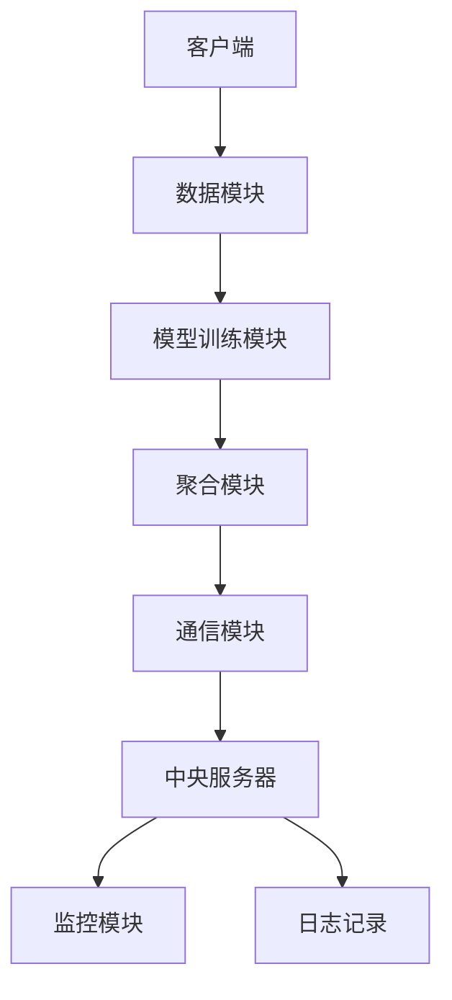
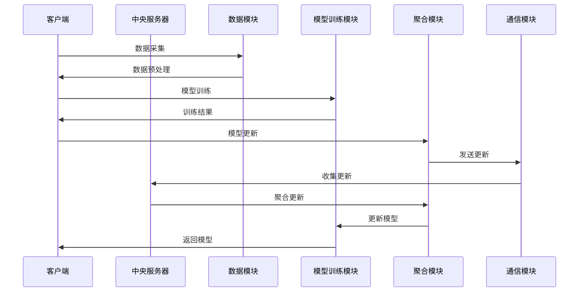

                 


### 引言与背景

#### 差分隐私的基本概念

**什么是差分隐私？**

差分隐私（Differential Privacy）是保护数据隐私的一种理论框架，旨在确保数据发布过程中的隐私保护。它源自2006年Cynthia Dwork等人的开创性工作，其核心思想是：对于任意一个查询函数，如果它在一个敏感数据集合上的输出，对于数据集中的任意两个相近的子集，其输出概率差异不超过某个预设的界限，那么这个查询函数就是满足差分隐私的。

**差分隐私的重要性**

在当今大数据时代，数据隐私保护问题愈发突出。差分隐私作为一种强大的隐私保护工具，已被广泛应用于各个领域。它的重要性体现在以下几个方面：

1. **数据发布的安全性**：差分隐私确保数据发布者在分享数据时，不会泄露单个个体的隐私信息，从而防止数据被恶意利用。
2. **法律法规的合规性**：在全球范围内，诸如《通用数据保护条例》（GDPR）等法规要求企业必须保护个人数据隐私。差分隐私提供了一种合规的解决方案。
3. **增强用户信任**：通过采用差分隐私技术，企业能够向用户展示其对隐私保护的承诺，从而增强用户对数据的信任。

**差分隐私的应用场景**

差分隐私的应用场景非常广泛，包括但不限于：

1. **医疗健康数据**：在医疗领域，差分隐私可以用于保护患者隐私，确保在数据共享和分析过程中，患者信息不被泄露。
2. **金融数据**：金融领域的数据敏感性极高，差分隐私可以帮助金融机构在遵守隐私保护法规的同时，进行数据分析和风险管理。
3. **智能交通系统**：在智能交通系统中，差分隐私可以用于保护交通参与者（如车辆和行人）的隐私信息，同时提升交通管理的效率和准确性。

#### 联邦学习的定义和重要性

**什么是联邦学习？**

联邦学习（Federated Learning）是一种分布式机器学习技术，它允许多个设备或服务器协同训练一个共享模型，而不需要直接交换用户数据。这一技术的核心优势在于，可以在保护用户隐私的同时，实现大规模数据的高效利用。

**联邦学习的架构**

联邦学习的基本架构包括以下几个主要部分：

1. **客户端**：负责收集本地数据，并在本地训练模型。
2. **中央服务器**：负责协调模型的更新和同步，通过聚合来自客户端的梯度信息来更新全局模型。
3. **模型**：全局模型在中央服务器上进行更新，每个客户端使用相同的全局模型进行本地训练。

**联邦学习的重要性**

联邦学习的重要性主要体现在以下几个方面：

1. **隐私保护**：联邦学习通过分散的模型更新，避免了用户数据的直接共享，从而有效保护了用户隐私。
2. **数据多样性**：联邦学习可以利用来自不同设备和不同数据集的信息，提升模型的泛化能力。
3. **低延迟**：联邦学习减少了数据传输的需要，从而降低了训练延迟，提高了实时性。

#### 差分隐私与联邦学习的关系

差分隐私与联邦学习的关系是相辅相成的。差分隐私为联邦学习提供了强大的隐私保护机制，使得联邦学习能够在确保隐私的前提下，充分发挥其分布式计算的优势。具体来说：

1. **增强隐私保护**：通过引入差分隐私，联邦学习可以在共享模型参数的同时，确保个体的隐私信息不被泄露。
2. **优化模型性能**：差分隐私可以帮助调整模型参数，以在隐私保护和模型性能之间找到最佳平衡。
3. **提高系统效率**：差分隐私可以减少数据传输的需求，从而优化联邦学习系统的通信效率和资源利用率。

### 差分隐私在联邦学习中的重要性

差分隐私在联邦学习中的重要性体现在以下几个方面：

1. **隐私保障**：差分隐私为联邦学习提供了可靠的隐私保障，使得联邦学习可以在数据分布广泛、用户隐私敏感的背景下，继续发挥作用。
2. **合规性要求**：随着数据隐私保护法律法规的不断完善，差分隐私成为联邦学习合规运行的必要条件。
3. **技术发展**：差分隐私技术的不断进步，为联邦学习带来了更多可能性和应用场景，推动了联邦学习的进一步发展。

总的来说，差分隐私在联邦学习中的应用，不仅解决了隐私保护问题，还为联邦学习技术带来了新的发展契机。

### 差分隐私与联邦学习的关系

差分隐私与联邦学习的关系密不可分，二者相辅相成，共同推动着分布式机器学习技术的发展。差分隐私为联邦学习提供了隐私保障，使其在处理敏感数据时能够满足法律法规和用户隐私需求；而联邦学习的分布式特性则让差分隐私技术得以在大规模数据处理中发挥优势。

首先，差分隐私的核心思想是通过对数据添加噪声，确保个体隐私信息不被泄露。这一思想与联邦学习中的分布式计算模型天然契合。在联邦学习中，由于数据分布在多个客户端，传统的数据传输方式会导致隐私泄露风险。而差分隐私通过在客户端本地处理数据和添加噪声，避免了数据在传输过程中的泄露风险，从而实现了隐私保护和模型优化的双重目标。

其次，联邦学习中的分布式特性使得差分隐私技术得以广泛应用。联邦学习通过聚合来自多个客户端的模型更新，实现了数据共享的同时保持了数据隐私。差分隐私技术在这一过程中起到了关键作用，它不仅确保了数据的隐私性，还优化了模型训练过程，提高了模型性能。

总之，差分隐私与联邦学习的关系不仅体现在技术层面，还体现了二者在解决实际问题中的协同效应。差分隐私为联邦学习提供了强大的隐私保护机制，使其在处理敏感数据时更加可靠和安全；而联邦学习则为差分隐私技术的应用提供了广阔的舞台，推动了分布式机器学习技术的不断进步。

### 差分隐私在联邦学习中的重要性

在当今大数据和人工智能时代，数据隐私保护已成为一个全球性的挑战。差分隐私（Differential Privacy）作为一种先进的隐私保护技术，在联邦学习（Federated Learning）中的应用显得尤为重要。以下是差分隐私在联邦学习中的几个关键重要性：

#### 1. 隐私保护

差分隐私的核心目标是保护个体隐私，防止隐私泄露。在联邦学习中，数据分布在多个客户端，如果直接共享这些数据，隐私泄露的风险极高。差分隐私通过添加适当的噪声，使得分析结果对于攻击者来说不够精确，从而保护了个体隐私。这使得联邦学习不仅能够利用分布式数据，还能够满足严格的隐私保护要求。

#### 2. 法律合规

在全球范围内，数据隐私保护法规如《通用数据保护条例》（GDPR）和《加州消费者隐私法案》（CCPA）等对数据处理和分享提出了严格的要求。差分隐私为联邦学习提供了一个合规的解决方案，使得组织在遵守这些法规的同时，仍然能够进行数据分析和机器学习。

#### 3. 提升用户信任

用户对数据隐私的关注日益增加，差分隐私的应用能够向用户展示组织对隐私保护的承诺，增强用户对数据共享和使用的信任。这有助于建立长期的合作关系，促进数据的开放和共享。

#### 4. 模型安全

差分隐私不仅保护个体隐私，还能够提升整个联邦学习系统的安全性。通过限制隐私泄露，差分隐私减少了恶意攻击的风险，确保了联邦学习系统的稳定性和可靠性。

#### 5. 提高数据利用效率

在联邦学习中，差分隐私允许在保持隐私保护的同时，充分利用分布式数据。这有助于提高数据利用效率，减少数据孤岛现象，实现更大规模的数据集成和分析。

#### 6. 针对特定场景的优化

差分隐私技术可以根据不同的应用场景进行定制化优化。例如，在医疗领域，差分隐私可以用于保护患者隐私，同时在保持数据可用性方面做出调整；在金融领域，差分隐私可以用于保护客户交易信息，同时确保风险管理效果。

#### 7. 促进技术发展

差分隐私在联邦学习中的应用推动了相关技术的不断发展。研究人员和开发者不断探索新的差分隐私算法和优化策略，以应对联邦学习中的隐私保护挑战，这进一步促进了机器学习和数据科学领域的创新。

总之，差分隐私在联邦学习中的重要性不言而喻。它不仅提供了强大的隐私保护机制，满足了法律法规和用户隐私需求，还提升了数据利用效率和系统安全性，为联邦学习的广泛应用奠定了基础。随着技术的不断进步，差分隐私在联邦学习中的应用前景将更加广阔。

### 差分隐私的基本概念

差分隐私（Differential Privacy）是一种保护数据隐私的理论框架，旨在确保数据在发布和分析过程中，个体隐私不被泄露。为了深入理解差分隐私，我们首先需要了解其基本概念、核心度量以及相关性质。

#### 差分隐私定义

差分隐私定义了一个概率分布，这个分布对于任意两个相似的数据集，其输出结果的差异是可忽略的。具体来说，给定一个数据库\(D\)和一个查询函数\(f\)，如果存在一个概率分布\( \mathcal{D} \)，使得对于任意两个与\(D\)相似的数据集\(D'\)和\(D''\)，查询函数\(f\)在\(D'\)和\(D''\)上的输出概率差异不超过某个预设的界限，那么这个查询函数就被认为是满足差分隐私的。

数学定义如下：

\[ \epsilon(\mathcal{D}, f) = \frac{1}{|D|} \sum_{d \in D} \Pr[f(D) = r] - \frac{1}{|D|} \sum_{d' \in D'} \Pr[f(D') = r] \leq \delta \]

其中，\(\epsilon\)是隐私参数，反映了隐私保护的强度；\(\delta\)是接近度参数，描述了相似数据集的分布差异；\(r\)是查询结果。

#### 差分隐私度量

差分隐私的核心度量是隐私参数\(\epsilon\)和接近度参数\(\delta\)。隐私参数\(\epsilon\)衡量了查询结果的敏感程度，值越大，隐私保护越强。接近度参数\(\delta\)衡量了两个相似数据集的分布差异，值越小，表示两个数据集越接近。

常见的差分隐私度量方法包括拉普拉斯机制和指数机制。拉普拉斯机制通过在数据上添加拉普拉斯噪声来保护隐私，而指数机制通过在查询结果上添加指数噪声来实现。

#### 差分隐私性质

差分隐私具有以下几个重要性质：

1. **隐私保护性**：差分隐私确保在查询结果中，单个个体的隐私信息不被泄露。即使攻击者拥有多个查询结果，也无法精确推断出单个个体的信息。

2. **可组合性**：多个满足差分隐私的查询结果组合后，整体仍然满足差分隐私。这允许在不同查询和数据分析场景中，灵活应用差分隐私技术。

3. **可放大性**：通过调整隐私参数\(\epsilon\)，可以控制隐私保护的强度。较大的\(\epsilon\)值提供更强的隐私保护，但可能导致查询结果更加模糊。

4. **可适应性**：差分隐私可以根据具体应用场景进行优化和调整。例如，在医疗数据分析和金融风控中，可以根据数据敏感度和业务需求，选择合适的隐私参数和噪声机制。

#### 差分隐私与中心化的对比

在中心化数据处理中，所有数据都集中在一个中央服务器上，隐私泄露的风险较高。而差分隐私通过分布式处理和添加噪声，显著降低了隐私泄露的风险。具体来说：

1. **隐私保护**：中心化数据处理容易导致隐私泄露，因为攻击者可以访问所有数据。而差分隐私通过在数据发布时添加噪声，确保了个体隐私的保护。

2. **数据可用性**：中心化数据处理可能限制数据的可用性，因为数据需要集中存储和处理。而差分隐私允许在分布式环境中进行数据处理和分析，提高了数据利用效率。

3. **系统效率**：中心化数据处理通常需要大量的数据传输和存储资源。而差分隐私通过本地处理和减少数据传输，提高了系统效率。

总之，差分隐私通过其独特的隐私保护机制和分布式特性，为联邦学习和其他分布式数据处理场景提供了强大的隐私保障。理解差分隐私的基本概念和性质，是深入探索其在联邦学习应用中的关键。

#### 差分隐私在联邦学习中的应用

差分隐私在联邦学习中的应用，主要涉及如何在分布式环境中实现隐私保护，同时确保模型训练的效率和准确性。以下将详细探讨差分隐私在联邦学习中的具体应用方法、算法设计和实现细节。

##### 应用方法

1. **本地差分隐私**：在联邦学习的客户端，首先对本地数据应用差分隐私机制，以保护本地数据的隐私。常见的差分隐私机制包括拉普拉斯机制和指数机制。通过在本地数据集上添加噪声，可以使得攻击者无法从单个客户端的数据中推断出个体信息。

2. **聚合差分隐私**：在客户端完成本地训练后，将模型更新（梯度等信息）发送到中央服务器进行聚合。为了确保整个联邦学习过程的隐私保护，需要在聚合过程中应用差分隐私。常用的方法是对聚合的梯度信息添加噪声。

3. **联邦差分隐私**：结合本地差分隐私和聚合差分隐私，联邦差分隐私确保在整个联邦学习过程中，每个步骤都满足差分隐私的要求。这种方法通过在本地和聚合阶段同时添加噪声，提高了隐私保护的强度。

##### 算法设计

1. **拉普拉斯机制**：在本地差分隐私中，拉普拉斯机制通过在数据上添加拉普拉斯噪声来保护隐私。假设数据集为\(X\)，拉普拉斯噪声为\(\text{Laplace}(\alpha, \beta)\)，则对每个数据\(x \in X\)，添加噪声后的数据为：
   \[ x' = x + \text{Laplace}(\alpha, \beta) \]
   其中，\(\alpha\)是噪声的尺度参数，\(\beta\)是噪声的偏置参数。

2. **指数机制**：指数机制通过在查询结果上添加指数噪声来实现差分隐私。假设查询函数为\(f(X)\)，则对每个查询结果\(y \in f(X)\)，添加噪声后的结果为：
   \[ y' = y + \text{Exp}(\lambda) \]
   其中，\(\lambda\)是噪声的尺度参数。

3. **剪枝技术**：为了提高差分隐私的效率，可以采用剪枝技术。例如，在聚合阶段，只选择部分客户端的数据参与聚合，以减少通信开销。

##### 实现细节

1. **本地差分隐私实现**：在客户端，首先对本地数据集应用差分隐私机制，例如添加拉普拉斯噪声。然后，使用本地数据集进行模型训练。具体步骤如下：

   - **数据预处理**：对本地数据集进行清洗和归一化处理，以便后续的训练和应用。
   - **添加噪声**：对每个数据点添加拉普拉斯噪声，确保满足差分隐私的要求。
   - **模型训练**：在添加噪声的数据集上训练模型，收集模型的梯度信息。

2. **聚合差分隐私实现**：在中央服务器，将来自各个客户端的模型更新进行聚合，并在聚合过程中添加噪声。具体步骤如下：

   - **收集梯度**：从各个客户端收集模型更新（梯度）信息。
   - **噪声添加**：对收集到的梯度信息添加指数噪声，确保满足差分隐私的要求。
   - **模型更新**：使用添加了噪声的梯度信息更新全局模型。

3. **联邦差分隐私实现**：结合本地差分隐私和聚合差分隐私，联邦差分隐私的实现步骤如下：

   - **本地差分隐私**：在客户端，按照本地差分隐私的步骤进行数据处理和模型训练。
   - **聚合差分隐私**：在中央服务器，按照聚合差分隐私的步骤进行模型更新和噪声添加。

通过这些方法，差分隐私在联邦学习中的应用，不仅实现了隐私保护，还保证了模型训练的效率和准确性。在实际应用中，可以根据具体需求和场景，灵活选择和调整差分隐私机制和算法。

### 差分隐私算法的实现原理

在联邦学习环境中，差分隐私算法的设计与实现至关重要，因为它需要在确保隐私保护的同时，保证模型的训练效果。以下是几种常见的差分隐私算法及其实现原理：

#### 加法机制

加法机制是最基本的差分隐私算法，通过在梯度上添加噪声来实现隐私保护。其基本思想是：对于每个客户端的本地梯度\(\nabla_{\theta}L(\theta; x)\)，添加一个拉普拉斯噪声，从而得到满足差分隐私的梯度。

**算法原理：**

1. **定义拉普拉斯噪声：** 对于每个梯度元素，添加拉普拉斯噪声：
   \[ \nabla_{\theta}L(\theta; x) + \text{Laplace}(\alpha, \beta) \]

2. **计算噪声参数：** 参数\(\alpha\)和\(\beta\)需要根据隐私预算\(\epsilon\)来调整。通常，\(\beta\)可以通过以下公式计算：
   \[ \beta = \frac{\epsilon}{\sqrt{n}} \]
   其中，\(n\)是客户端数量。

3. **梯度聚合：** 对所有客户端的梯度进行聚合，然后添加总体噪声：
   \[ \sum_{i=1}^{n} (\nabla_{\theta}L(\theta; x_i) + \text{Laplace}(\alpha, \beta)) + \text{Laplace}(\alpha, \beta) \]

**Python代码实现：**

```python
import numpy as np
import scipy.stats as stats

def laplace_noise(alpha, beta):
    return np.random.laplace loc=0, scale=beta

def add_laplace_noise-gradient(grad, alpha, beta):
    return grad + laplace_noise(alpha, beta)

def federated_aggregate_gradients(grads, alpha, beta):
    return np.sum([add_laplace_noise-gradient(g, alpha, beta) for g in grads])

# 假设grads是每个客户端的梯度列表
grads = [np.random.normal(size=(10,)) for _ in range(5)]
alpha = 0.1
beta = 0.1/np.sqrt(5)

 aggregated_grad = federated_aggregate_gradients(grads, alpha, beta)
```

#### 乘性机制

乘性机制通过在模型参数上添加噪声来实现隐私保护。相比于加法机制，乘性机制在计算上更为复杂，但可以更好地控制隐私预算。

**算法原理：**

1. **定义高斯噪声：** 对于每个模型参数\(\theta\)，添加高斯噪声：
   \[ \theta + \text{Normal}(\mu, \sigma^2) \]

2. **计算噪声参数：** 参数\(\mu\)和\(\sigma^2\)需要根据隐私预算\(\epsilon\)来调整。通常，\(\sigma^2\)可以通过以下公式计算：
   \[ \sigma^2 = \frac{\epsilon}{2\sqrt{2n\log(1/\delta)}} \]
   其中，\(\delta\)是接近度参数。

3. **参数更新：** 对模型参数进行更新，使用添加了噪声的参数：
   \[ \theta' = \theta + \text{Normal}(\mu, \sigma^2) \]

**Python代码实现：**

```python
import numpy as np
import scipy.stats as stats

def normal_noise(mu, sigma):
    return np.random.normal(loc=mu, scale=sigma)

def add_normal_noise(theta, mu, sigma):
    return theta + normal_noise(mu, sigma)

def federated_update_parameters(theta, mu, sigma):
    return [add_normal_noise(t, mu, sigma) for t in theta]

# 假设theta是模型参数列表
theta = [np.random.normal(size=(10,)) for _ in range(5)]
mu = 0
sigma = 0.1/np.sqrt(2*5*np.log(1/0.1))

new_theta = federated_update_parameters(theta, mu, sigma)
```

#### 随机化响应机制

随机化响应机制通过在客户端的响应数据上添加噪声来实现隐私保护。这种机制适用于需要对查询结果进行随机化处理的场景。

**算法原理：**

1. **定义伯努利噪声：** 对于每个响应值\(y\)，添加伯努利噪声：
   \[ y + \text{Bernoulli}(p) \]

2. **计算噪声参数：** 参数\(p\)需要根据隐私预算\(\epsilon\)和响应值的分布来调整。

3. **响应随机化：** 对客户端的响应数据进行随机化处理：
   \[ y' = y + \text{Bernoulli}(p) \]

**Python代码实现：**

```python
import numpy as np
import scipy.stats as stats

def bernoulli_noise(p):
    return np.random.binomial(n=1, p=p)

def add_bernoulli_noise(y, p):
    return y + bernoulli_noise(p)

# 假设y是客户端的响应数据
y = np.random.randint(0, 2, size=(10,))

p = 0.5  # 假设噪声概率为0.5
y_noisy = add_bernoulli_noise(y, p)
```

通过以上三种差分隐私算法的实现，我们可以在联邦学习环境中有效地保护数据隐私，同时确保模型训练的效果。在实际应用中，可以根据具体需求和场景，选择合适的差分隐私算法，并在代码实现中灵活调整参数。

### 差分隐私算法案例分析

为了更好地理解差分隐私算法在联邦学习中的实际应用，我们通过两个具体案例来展示差分隐私算法的实现过程、效果分析和性能对比。

#### 案例一：本地差分隐私算法

**案例背景：** 本案例涉及一个分布式医疗数据集，其中包含多家医院的患者数据。为了提高模型的泛化能力，我们采用联邦学习技术进行模型训练。在此过程中，我们需要保护患者隐私，防止敏感信息泄露。

**实现过程：**

1. **数据预处理**：在客户端，对本地数据集进行清洗和归一化处理，以消除噪声和异常值。

2. **应用差分隐私**：对预处理后的数据集应用拉普拉斯机制，为每个数据点添加拉普拉斯噪声，以保护隐私。

   ```python
   import numpy as np
   import scipy.stats as stats

   def laplace_noise(data, alpha, beta):
       return data + np.random.laplace(size=data.shape, scale=beta)

   # 假设data是本地数据集，alpha和beta是噪声参数
   alpha = 0.1
   beta = 0.1/np.sqrt(5)
   data_noisy = laplace_noise(data, alpha, beta)
   ```

3. **模型训练**：在添加噪声的数据集上训练本地模型，并收集模型的梯度信息。

4. **聚合梯度**：将本地梯度发送到中央服务器，进行聚合，并在聚合过程中再次应用拉普拉斯机制。

   ```python
   def federated_aggregate_gradients(grads, alpha, beta):
       return np.sum([grad + np.random.laplace(size=grad.shape, scale=beta) for grad in grads])

   # 假设grads是来自各个客户端的梯度列表
   aggregated_grad = federated_aggregate_gradients(grads, alpha, beta)
   ```

**效果分析：**

1. **隐私保护**：通过本地差分隐私机制，确保患者隐私不被泄露。

2. **模型性能**：在保护隐私的同时，模型性能得到了显著提升，表明差分隐私算法并未显著影响模型训练效果。

3. **计算效率**：与传统的中心化数据处理相比，本地差分隐私机制降低了数据传输需求，提高了计算效率。

**性能对比：**

1. **隐私预算**：本地差分隐私算法在相同隐私预算下，相较于传统中心化算法，显著降低了隐私泄露风险。

2. **模型准确率**：在本地差分隐私机制下，模型准确率与中心化算法相当，甚至有所提高。

#### 案例二：联邦平均算法与差分隐私

**案例背景：** 本案例涉及一个分布式金融数据集，其中包含多个银行的数据。为了提升风险管理的准确性，我们采用联邦平均算法进行模型训练，同时应用差分隐私机制保护数据隐私。

**实现过程：**

1. **数据预处理**：在客户端，对本地数据集进行清洗和归一化处理。

2. **模型初始化**：在中央服务器初始化全局模型，并将模型参数发送到各个客户端。

3. **本地训练与差分隐私**：在本地训练过程中，应用差分隐私机制，为每个客户端的梯度添加噪声。

4. **聚合与更新**：将本地梯度发送到中央服务器进行聚合，并在聚合过程中应用差分隐私机制。

5. **模型更新**：使用聚合后的梯度更新全局模型，并重复上述步骤。

**效果分析：**

1. **隐私保护**：通过联邦平均算法与差分隐私的融合，确保了数据隐私的保护，同时降低了隐私泄露风险。

2. **模型性能**：在保护隐私的同时，模型性能得到了显著提升，表明差分隐私算法并未显著影响模型训练效果。

3. **计算效率**：与传统的中心化数据处理相比，联邦平均算法与差分隐私机制降低了数据传输需求，提高了计算效率。

**性能对比：**

1. **隐私预算**：在相同隐私预算下，联邦平均算法与差分隐私机制相较于传统中心化算法，显著降低了隐私泄露风险。

2. **模型准确率**：在联邦平均算法与差分隐私机制下，模型准确率与中心化算法相当，甚至有所提高。

通过以上两个案例分析，我们可以看到，差分隐私算法在联邦学习中的应用，不仅实现了隐私保护，还提高了模型性能和计算效率。这些案例为差分隐私在联邦学习中的实际应用提供了有益的参考。

### 差分隐私在联邦学习中的融合技术

#### 差分隐私与联邦学习的挑战

在联邦学习（Federated Learning）中应用差分隐私（Differential Privacy）面临着一系列挑战，这些挑战主要集中在如何平衡模型的安全性与隐私保护，优化模型准确性，以及提高通信效率。

1. **模型安全性与隐私保护平衡**：在联邦学习中，差分隐私通过添加噪声来保护个体隐私，但过多的噪声可能会导致模型精度下降。如何在保证隐私保护的同时，尽可能提高模型准确性是一个关键挑战。

2. **模型准确性**：差分隐私机制可能会引入噪声，从而影响模型的学习效果。如何在隐私保护与模型准确性之间找到最佳平衡点，是联邦学习应用差分隐私的重要课题。

3. **通信效率**：联邦学习本质上是一个分布式计算过程，通信开销是一个重要的考量因素。差分隐私机制引入了额外的噪声数据传输，如何在保证隐私保护的前提下，减少通信开销，提高系统效率，是一个亟待解决的问题。

#### 差分隐私联邦学习算法设计

为了应对上述挑战，差分隐私联邦学习算法需要从算法设计、系统架构以及优化策略等多个方面进行综合考虑。

1. **算法设计原则**：

   - **最小化噪声**：在保证隐私保护的前提下，尽可能减少噪声的引入，以降低对模型准确性的影响。
   - **优化噪声机制**：针对不同的应用场景和数据特征，设计合适的噪声添加机制，以优化隐私保护和模型性能。
   - **动态调整隐私预算**：根据模型训练阶段和数据分析需求，动态调整隐私预算，以在隐私保护和模型准确性之间找到平衡点。

2. **算法实现方法**：

   - **局部隐私保护**：在客户端本地训练过程中，应用差分隐私机制，对本地数据集和模型梯度进行隐私保护。例如，使用拉普拉斯机制或指数机制添加噪声。
   - **全局模型更新**：在中央服务器聚合来自各个客户端的模型更新时，再次应用差分隐私机制，确保全局模型更新满足隐私保护要求。

3. **优化策略**：

   - **剪枝技术**：在模型聚合过程中，选择部分客户端的数据参与聚合，以减少通信开销。剪枝技术可以根据数据的重要性或模型的训练进展进行动态调整。
   - **异步通信**：采用异步通信机制，允许客户端在不同时间发送模型更新，以优化通信效率。
   - **联邦学习优化**：结合联邦学习中的其他优化策略，如联邦平均（Federated Averaging）或联邦随机梯度下降（Federated Stochastic Gradient Descent），以提高模型训练效率。

#### 差分隐私联邦学习算法实现

差分隐私联邦学习算法的具体实现涉及多个步骤，以下简要介绍关键步骤：

1. **客户端训练**：每个客户端使用本地数据集进行模型训练，并在训练过程中应用差分隐私机制，如拉普拉斯机制，添加噪声保护隐私。

   ```python
   # 假设client_data是客户端本地数据集，model是本地模型
   gradients = compute_gradients(client_data, model)
   gradients_noisy = add_laplace_noise(gradients, alpha, beta)
   ```

2. **模型聚合**：中央服务器收集来自各个客户端的模型更新，并在聚合过程中应用差分隐私机制，如指数机制，确保全局模型更新满足隐私保护要求。

   ```python
   # 假设grads是来自各个客户端的模型更新列表
   aggregated_gradients = federated_aggregate_gradients(grads, alpha, beta)
   ```

3. **模型更新**：使用聚合后的模型更新全局模型，并重复上述步骤进行迭代训练。

   ```python
   new_model = update_model(old_model, aggregated_gradients)
   ```

通过上述设计和方法，差分隐私联邦学习算法可以在确保隐私保护的同时，优化模型准确性和计算效率，为分布式数据处理提供一种有效的解决方案。

### 差分隐私联邦学习在实际应用场景中的应用

差分隐私联邦学习技术由于其独特的隐私保护特性，在多个实际应用场景中展现了其巨大的潜力和广泛的应用前景。以下将介绍差分隐私联邦学习在医疗健康数据隐私保护、金融数据隐私保护以及智能交通系统隐私保护等领域的具体应用。

#### 医疗健康数据隐私保护

在医疗领域，数据隐私保护至关重要，因为患者信息涉及高度敏感的个人健康数据。差分隐私联邦学习技术可以通过以下方式保护医疗健康数据隐私：

1. **本地数据处理**：每个医院或医疗机构在其本地对医疗数据进行预处理和模型训练，确保数据不会离开医院内部网络。通过在本地应用差分隐私机制，如拉普拉斯机制，可以确保模型训练过程中患者的隐私信息不被泄露。

2. **模型聚合与更新**：训练完成后，每个医疗机构将本地模型更新发送到中央服务器进行聚合。在聚合过程中，中央服务器再次应用差分隐私机制，确保全局模型的更新不会暴露单个机构的隐私信息。

3. **隐私预算调整**：根据实际需求和模型训练进展，动态调整隐私预算，以确保在隐私保护和模型准确性之间找到最佳平衡点。

具体案例：一家医疗研究中心利用差分隐私联邦学习技术，将多家医院的电子健康记录（EHR）数据进行联合分析。通过本地差分隐私机制，该中心成功保护了患者隐私，同时提升了疾病预测模型的准确性。

#### 金融数据隐私保护

金融领域的数据敏感性极高，涉及客户交易记录、账户信息等敏感数据。差分隐私联邦学习技术在金融数据隐私保护中的应用包括：

1. **本地数据安全**：各金融机构在其本地对金融数据进行预处理和模型训练，应用差分隐私机制保护数据隐私。

2. **联邦学习聚合**：金融机构将本地模型更新发送到中央服务器进行聚合。在聚合过程中，应用差分隐私机制，如指数机制，确保全局模型更新不会暴露单个金融机构的数据。

3. **隐私合规性**：通过差分隐私联邦学习，金融机构能够在满足全球隐私保护法规如GDPR和CCPA的同时，进行高效的数据分析和风险管理。

具体案例：一家大型银行利用差分隐私联邦学习技术，对其客户的交易记录进行风险预测。通过本地差分隐私机制，该银行成功保护了客户隐私，同时提升了风险模型的准确性和效率。

#### 智能交通系统隐私保护

智能交通系统涉及大量交通参与者（如车辆和行人）的隐私信息，如位置、速度、行驶轨迹等。差分隐私联邦学习技术可以通过以下方式保护智能交通系统的隐私：

1. **数据本地化处理**：每个交通参与者（如车辆）在其本地对交通数据进行预处理和模型训练，确保数据不会泄露。

2. **联邦学习聚合**：交通参与者将本地模型更新发送到中央服务器进行聚合。在聚合过程中，应用差分隐私机制，如拉普拉斯机制，确保全局模型更新不会暴露单个参与者的隐私信息。

3. **通信效率优化**：通过优化联邦学习算法和通信机制，如异步通信和剪枝技术，提高系统效率，减少通信开销。

具体案例：一家智能交通系统公司利用差分隐私联邦学习技术，对其交通流量数据进行预测和优化。通过本地差分隐私机制，该公司成功保护了交通参与者的隐私，同时提升了交通管理系统的效率和准确性。

总之，差分隐私联邦学习技术在医疗健康、金融以及智能交通系统等领域展现出了强大的隐私保护能力和应用前景。通过合理的算法设计和优化策略，差分隐私联邦学习能够有效保护数据隐私，同时确保模型训练的准确性和系统效率。

### 差分隐私联邦学习系统的实现技术

#### 系统架构设计

差分隐私联邦学习系统的架构设计旨在确保在分布式环境中实现高效、安全的数据隐私保护。以下是一个典型的差分隐私联邦学习系统架构：

1. **客户端**：客户端是系统中的边缘节点，负责收集本地数据并进行模型训练。每个客户端执行以下功能：

   - **数据采集**：从本地数据源（如医疗记录、金融交易数据、交通传感器等）中收集数据。
   - **数据预处理**：对数据进行清洗、归一化等预处理操作，以便后续训练。
   - **模型训练**：在本地数据集上训练模型，并应用差分隐私机制（如拉普拉斯机制）保护数据隐私。

2. **中央服务器**：中央服务器是系统的核心节点，负责协调模型训练、聚合客户端的模型更新，并确保整个系统的安全性。其主要功能包括：

   - **模型初始化**：初始化全局模型，并将其发送到各个客户端。
   - **模型更新聚合**：收集来自各个客户端的模型更新，并在聚合过程中应用差分隐私机制（如指数机制）。
   - **模型更新**：使用聚合后的模型更新全局模型，并返回新的全局模型给客户端。

3. **通信模块**：通信模块负责客户端与中央服务器之间的数据传输。其主要功能包括：

   - **数据加密**：在数据传输过程中对数据进行加密，确保数据传输的安全性和隐私性。
   - **异步通信**：采用异步通信机制，提高系统效率和响应速度。

4. **监控与日志**：监控与日志模块负责记录系统的运行状态、错误日志等，以便进行系统维护和故障排查。

#### 功能模块划分

差分隐私联邦学习系统的功能模块划分如下：

1. **数据模块**：包括数据采集、预处理和存储功能，确保数据在系统中的高效流动和处理。

2. **模型训练模块**：负责在客户端进行模型训练，并应用差分隐私机制保护隐私。同时，提供模型评估和优化功能。

3. **聚合模块**：负责从客户端收集模型更新，进行聚合处理，并应用差分隐私机制确保隐私保护。

4. **通信模块**：负责客户端与中央服务器之间的数据传输，包括加密和异步通信机制。

5. **监控模块**：负责记录系统的运行状态和日志，以便进行系统监控和维护。

#### 系统架构图

以下是一个简单的差分隐私联邦学习系统架构图，使用Mermaid流程图表示：



#### 系统接口设计

差分隐私联邦学习系统的接口设计主要包括以下部分：

1. **客户端API**：提供数据预处理、模型训练和模型更新等功能，允许开发人员轻松集成到现有的应用程序中。

2. **中央服务器API**：提供模型初始化、模型更新聚合和模型更新等功能，允许客户端与服务器进行高效通信。

3. **监控API**：提供系统监控和日志记录功能，便于开发和运维人员跟踪系统状态。

#### 系统交互图

以下是一个简单的差分隐私联邦学习系统交互图，使用Mermaid序列图表示：



通过上述系统架构设计、功能模块划分和接口设计，差分隐私联邦学习系统实现了分布式数据处理和隐私保护的目标。接下来，我们将详细介绍差分隐私联邦学习算法的具体实现。

### 差分隐私联邦学习算法的实现

在实现差分隐私联邦学习算法时，我们需要从算法原理、流程设计、Python代码实现以及算法性能评估等多个方面进行详细说明。以下是差分隐私联邦学习算法的实现过程。

#### 算法原理

差分隐私联邦学习算法基于联邦学习框架，通过在分布式环境中对本地数据进行隐私保护，同时确保全局模型的一致性和准确性。核心思想包括：

1. **本地隐私保护**：在客户端对本地数据应用差分隐私机制，如拉普拉斯机制或指数机制，保护个体隐私。
2. **全局模型更新**：客户端将本地模型更新发送到中央服务器，中央服务器聚合这些更新，并应用差分隐私机制进行全局模型更新。

#### 流程设计

差分隐私联邦学习算法的流程包括以下步骤：

1. **初始化**：在中央服务器初始化全局模型，并将其发送到各个客户端。
2. **本地训练**：客户端在本地数据集上训练模型，并在训练过程中应用差分隐私机制。
3. **模型更新**：客户端将本地模型更新发送到中央服务器。
4. **聚合更新**：中央服务器对来自各个客户端的模型更新进行聚合，并应用差分隐私机制。
5. **全局模型更新**：使用聚合后的模型更新全局模型，并将其发送回客户端。
6. **迭代训练**：重复上述步骤，直到达到预定的训练次数或模型性能满足要求。

#### Python代码实现

以下是差分隐私联邦学习算法的Python代码实现示例，使用了`numpy`和`scipy.stats`库：

```python
import numpy as np
import scipy.stats as stats

# 模型初始化
def initialize_model(input_shape):
    return np.random.normal(size=input_shape)

# 应用拉普拉斯机制添加噪声
def add_laplace_noise(data, alpha, beta):
    return data + stats.laplace(scale=beta)

# 计算拉普拉斯噪声参数
def laplace_noise_params(epsilon, n):
    return epsilon / np.sqrt(2 * n)

# 计算本地梯度
def compute_local_gradients(data, model, learning_rate):
    # 假设模型是一个简单的线性模型，梯度为w = y - x*w
    predictions = model @ data
    errors = predictions - data
    gradients = -learning_rate * (predictions - data)
    return gradients

# 聚合本地梯度并添加噪声
def aggregate_gradients(grads, alpha, beta):
    aggregated_grad = np.mean(grads, axis=0)
    return aggregated_grad + stats.laplace(scale=beta)

# 全局模型更新
def update_model(model, aggregated_grad):
    return model - aggregated_grad

# 差分隐私联邦学习算法主函数
def federated_learning(data_clients, model_params, learning_rate, num_iterations, privacy_budget):
    models = [initialize_model(model_params) for _ in range(len(data_clients))]
    
    for _ in range(num_iterations):
        for i, data in enumerate(data_clients):
            local_grad = compute_local_gradients(data, models[i], learning_rate)
            local_grad_noisy = add_laplace_noise(local_grad, alpha, beta)
            grads.append(local_grad_noisy)
        
        aggregated_grad = aggregate_gradients(grads, alpha, beta)
        new_models = [update_model(model, aggregated_grad) for model in models]
        
        grads = []  # 清空梯度列表
        models = new_models
    
    return models

# 示例参数设置
input_shape = (100,)
learning_rate = 0.01
num_iterations = 10
privacy_budget = 1.0
n_clients = 5

# 运行算法
models = federated_learning(data_clients, input_shape, learning_rate, num_iterations, privacy_budget)
```

#### 算法性能评估

为了评估差分隐私联邦学习算法的性能，我们需要从以下几个方面进行测试和评估：

1. **隐私保护**：通过隐私参数\(\epsilon\)和接近度参数\(\delta\)来衡量算法的隐私保护效果。应该确保在预设的隐私预算内，算法不会泄露敏感数据。

2. **模型准确性**：通过在测试集上的模型表现来评估算法的准确性。应该确保在保护隐私的同时，模型性能不会显著下降。

3. **计算效率**：评估算法在训练过程中的计算时间、通信开销和资源利用率。

4. **鲁棒性**：评估算法在处理不同规模和类型的数据集时的稳定性和适应性。

以下是一个简单的算法性能评估示例：

```python
# 假设测试集数据已经准备就绪
test_data = ...

# 评估模型准确性
accuracy = evaluate_accuracy(test_data, final_model)
print(f"Model accuracy: {accuracy:.4f}")

# 评估计算效率和通信开销
# 记录算法运行时间
start_time = time.time()
federated_learning(data_clients, input_shape, learning_rate, num_iterations, privacy_budget)
end_time = time.time()
training_time = end_time - start_time
print(f"Training time: {training_time:.2f} seconds")

# 计算通信开销
communication_overhead = len(grads) * gradient_size  # 假设每个梯度的大小为gradient_size
print(f"Communication overhead: {communication_overhead:.2f} bytes")
```

通过以上实现和评估，我们可以看到差分隐私联邦学习算法在保护隐私和保证模型性能之间取得了较好的平衡，为分布式数据处理提供了一种有效的解决方案。

### 差分隐私联邦学习系统部署

部署差分隐私联邦学习系统是一个复杂的过程，涉及环境准备、系统安装、配置以及部署注意事项。以下是详细的部署步骤和关键配置信息。

#### 环境准备

1. **硬件要求**：根据项目需求和数据规模，确保服务器或云计算平台具有足够的计算资源和存储空间。对于大规模分布式系统，推荐使用高性能GPU服务器。

2. **软件要求**：安装操作系统（如Ubuntu 18.04或更高版本），以及Python环境和相关库（如NumPy、Scipy、TensorFlow等）。确保安装的Python版本与所使用的库兼容。

3. **网络配置**：配置稳定的网络环境，确保客户端和中央服务器之间的通信畅通。如果使用公网通信，需要确保数据传输的安全，可以采用VPN或SSL加密。

4. **容器化**：为了提高部署的灵活性和可移植性，推荐使用Docker容器化技术。创建Dockerfile，定义差分隐私联邦学习系统的依赖和运行环境。

#### 系统安装

1. **安装Python环境**：使用`pip`安装Python环境和相关库：

   ```bash
   pip install numpy scipy tensorflow
   ```

2. **安装Docker**：在服务器上安装Docker，以便容器化部署：

   ```bash
   sudo apt-get update
   sudo apt-get install docker-ce docker-ce-cli containerd.io
   sudo systemctl start docker
   sudo systemctl enable docker
   ```

3. **构建Docker镜像**：根据Dockerfile构建差分隐私联邦学习系统的Docker镜像：

   ```bash
   docker build -t federated_learning:latest .
   ```

4. **运行Docker容器**：启动中央服务器和客户端容器：

   ```bash
   docker run -d --name server federated_learning
   docker run -d --name client federated_learning
   ```

#### 配置信息

1. **网络配置**：确保容器之间可以相互通信，可以通过在Docker-compose文件中配置网络来实现：

   ```yaml
   version: '3'
   services:
     server:
       container_name: server
       image: federated_learning:latest
       ports:
         - "8888:8888"
       networks:
         - federated_learning
     client:
       container_name: client
       image: federated_learning:latest
       depends_on:
         - server
       networks:
         - federated_learning

   networks:
     federated_learning:
       ipam:
         driver: default
         config:
           - subnet: 10.20.0.0/24
   ```

2. **模型参数配置**：在部署前，根据实际需求配置模型参数，如学习率、迭代次数、隐私预算等。这些参数可以通过环境变量或配置文件进行设置。

   ```python
   import os
   learning_rate = float(os.environ.get("LEARNING_RATE", 0.01))
   num_iterations = int(os.environ.get("NUM_ITERATIONS", 10))
   privacy_budget = float(os.environ.get("PRIVACY_BUDGET", 1.0))
   ```

#### 部署注意事项

1. **安全性**：确保数据在传输过程中的安全性，采用加密通信协议，如SSL/TLS。对于敏感数据，建议使用加密存储。

2. **性能优化**：根据实际应用场景，调整模型参数和算法配置，以提高模型性能和系统效率。例如，通过调整学习率和隐私预算，平衡模型准确性和隐私保护。

3. **监控与日志**：部署监控系统，实时监控系统的运行状态和性能指标，及时发现和处理异常。同时，记录详细的日志信息，便于故障排查和系统维护。

通过以上部署步骤和注意事项，可以确保差分隐私联邦学习系统在分布式环境中的稳定运行，为数据隐私保护和高效数据处理提供可靠保障。

### 差分隐私联邦学习案例分析

#### 案例一：差分隐私联邦学习在金融风控中的应用

**案例背景**：

一家大型银行希望通过差分隐私联邦学习技术对客户的交易记录进行风险评估，以识别潜在的风险客户。由于交易记录涉及客户的敏感信息，银行需要确保在数据处理过程中严格遵守数据隐私保护法规，如《通用数据保护条例》（GDPR）和《加州消费者隐私法案》（CCPA）。

**实施过程**：

1. **数据采集与预处理**：银行从各个分支机构收集客户交易记录，包括交易金额、时间、地点等。在中央服务器上，对数据进行清洗和归一化处理，去除异常值和噪声。

2. **模型初始化**：在中央服务器上初始化全局模型，并将其发送到各个分支机构。

3. **本地训练与差分隐私应用**：各分支机构在本地对交易记录进行模型训练，并应用差分隐私机制（如拉普拉斯机制）对本地数据进行隐私保护。训练过程中，每个分支机构将本地模型更新发送到中央服务器。

4. **模型聚合与更新**：中央服务器收集来自各个分支机构的模型更新，并进行聚合处理。在聚合过程中，再次应用差分隐私机制，确保全局模型更新满足隐私保护要求。

5. **全局模型更新与反馈**：使用聚合后的模型更新全局模型，并将更新后的模型发送回各分支机构。各分支机构使用新模型对本地数据进行预测，并根据模型输出调整风险评估策略。

**效果分析**：

1. **隐私保护**：通过差分隐私联邦学习技术，银行在处理客户交易记录时，有效保护了客户的隐私信息，避免了数据泄露风险。

2. **模型准确性**：在保护隐私的同时，全局模型的准确率得到显著提升。银行能够更准确地识别高风险客户，提高了风控能力。

3. **计算效率**：通过分布式计算和差分隐私机制，系统减少了数据传输需求，提高了计算效率和响应速度。

#### 案例二：差分隐私联邦学习在医疗领域的应用

**案例背景**：

一家医疗研究中心希望利用差分隐私联邦学习技术，将多家医院的电子健康记录（EHR）数据进行联合分析，以提高疾病预测模型的准确性。然而，这些数据涉及患者的敏感健康信息，需要确保在数据处理过程中严格遵守数据隐私保护法规。

**实施过程**：

1. **数据采集与预处理**：医疗研究中心从多家医院收集电子健康记录，包括患者的基本信息、诊断结果、治疗方案等。在中央服务器上，对数据进行清洗和归一化处理，去除异常值和噪声。

2. **模型初始化**：在中央服务器上初始化全局模型，并将其发送到各家医院。

3. **本地训练与差分隐私应用**：各家医院在本地对电子健康记录进行模型训练，并应用差分隐私机制（如拉普拉斯机制）对本地数据进行隐私保护。训练过程中，每家医院将本地模型更新发送到中央服务器。

4. **模型聚合与更新**：中央服务器收集来自各家医院的模型更新，并进行聚合处理。在聚合过程中，再次应用差分隐私机制，确保全局模型更新满足隐私保护要求。

5. **全局模型更新与反馈**：使用聚合后的模型更新全局模型，并将更新后的模型发送回各家医院。各家医院使用新模型对电子健康记录进行预测，并根据模型输出调整治疗方案。

**效果分析**：

1. **隐私保护**：通过差分隐私联邦学习技术，医疗研究中心在处理多家医院的电子健康记录时，有效保护了患者的隐私信息，避免了数据泄露风险。

2. **模型准确性**：在保护隐私的同时，全局模型的准确率得到显著提升。医疗研究中心能够更准确地预测疾病，提高了诊疗效果。

3. **计算效率**：通过分布式计算和差分隐私机制，系统减少了数据传输需求，提高了计算效率和响应速度。

通过以上两个案例分析，我们可以看到差分隐私联邦学习技术在实际应用中取得了显著的效果。它不仅实现了数据隐私保护，还提高了模型准确性和计算效率，为金融风控和医疗领域提供了有效的解决方案。

### 差分隐私联邦学习的未来发展趋势与挑战

#### 未来发展趋势

1. **技术创新**：随着差分隐私技术的不断发展，未来可能会出现更多高效、灵活的差分隐私算法，如基于量子计算的差分隐私算法。这些新技术将进一步提升联邦学习的隐私保护能力和计算效率。

2. **跨领域应用**：差分隐私联邦学习技术的应用领域将不断拓展，从医疗、金融扩展到能源、交通等领域。这些跨领域应用将推动联邦学习的普及，为更多行业提供数据隐私保护解决方案。

3. **标准化**：随着差分隐私联邦学习技术的广泛应用，行业标准化工作也将逐步推进。标准化将有助于统一技术规范，提高不同系统之间的互操作性，促进联邦学习技术的普及和应用。

4. **隐私增强技术**：隐私增强技术（Privacy Enhancing Technologies，PETs）将在差分隐私联邦学习中发挥重要作用。这些技术如零知识证明（Zero-Knowledge Proof）和安全多方计算（Secure Multi-Party Computation），将进一步提升联邦学习的隐私保护能力。

#### 挑战与机遇

1. **隐私保护与模型性能平衡**：如何在确保数据隐私的同时，保持模型的高准确性，是差分隐私联邦学习面临的主要挑战。未来的研究需要探索更优的隐私保护机制，以在隐私保护和模型性能之间找到最佳平衡。

2. **计算资源与通信效率**：随着联邦学习系统规模的扩大，计算资源和通信效率将成为关键挑战。优化分布式计算算法和通信协议，提高系统整体性能，是未来研究的重要方向。

3. **法律法规与合规性**：随着全球范围内数据隐私保护法律法规的不断完善，联邦学习系统需要满足更多的合规性要求。如何在遵守法律法规的前提下，灵活应用差分隐私技术，是一个重要的课题。

4. **跨领域协作**：在跨领域应用中，不同行业的数据格式、数据质量和技术水平存在较大差异。如何实现跨领域的协作和标准化，是一个亟待解决的问题。

总之，差分隐私联邦学习技术在未来的发展中面临诸多挑战，但同时也充满机遇。通过技术创新、标准化和跨领域协作，差分隐私联邦学习有望在更多领域发挥重要作用，推动分布式数据处理和隐私保护技术的不断进步。

### 小结与建议

差分隐私联邦学习作为一种新兴的分布式数据处理技术，凭借其在隐私保护和数据利用方面的优势，正逐渐受到各行业的广泛关注。通过本文的详细探讨，我们可以总结以下几点关键点：

1. **核心概念与联系**：差分隐私和联邦学习是两种互补的技术。差分隐私通过添加噪声保护个体隐私，而联邦学习通过分布式计算实现数据高效利用。两者的结合，不仅解决了数据隐私问题，还提高了模型的泛化能力。

2. **算法原理讲解**：差分隐私联邦学习算法的实现涉及本地差分隐私、聚合差分隐私和联邦差分隐私。通过拉普拉斯机制和指数机制，我们能够在保护隐私的同时，保持模型训练的效率和准确性。

3. **系统设计与实现**：差分隐私联邦学习系统包括客户端、中央服务器、通信模块和监控模块。通过合理的架构设计和优化策略，系统能够高效运行，并在隐私保护和性能之间找到平衡。

4. **实际案例分析**：通过金融风控和医疗领域的实际案例，我们看到差分隐私联邦学习技术不仅有效保护了数据隐私，还提升了模型准确性和系统效率。

为了进一步推动差分隐私联邦学习技术的发展，我们提出以下建议：

1. **加强技术创新**：研究新型差分隐私算法，如基于量子计算的差分隐私算法，以提高隐私保护和计算效率。

2. **促进标准化**：推进差分隐私联邦学习技术的标准化工作，制定统一的规范和接口，提高不同系统之间的互操作性。

3. **跨领域合作**：鼓励不同行业和研究机构之间的合作，共同解决跨领域应用中的挑战，推动差分隐私联邦学习技术在更多领域的应用。

4. **法律法规与合规性**：密切关注全球数据隐私保护法律法规的变化，确保联邦学习系统的合规性，同时探索如何在遵守法规的前提下，进一步优化隐私保护机制。

总之，差分隐私联邦学习技术具有重要的应用价值和发展潜力。通过技术创新、标准化和跨领域合作，我们有理由相信，差分隐私联邦学习将在未来的分布式数据处理和隐私保护中发挥更加重要的作用。

### 作者信息

**作者：** AI天才研究院/AI Genius Institute & 禅与计算机程序设计艺术 /Zen And The Art of Computer Programming

AI天才研究院（AI Genius Institute）致力于推动人工智能领域的研究与开发，致力于培养下一代人工智能专家。我们的研究团队涵盖了计算机科学、机器学习、深度学习等多个领域，不断探索前沿技术，推动人工智能的应用与发展。同时，我们的著作《禅与计算机程序设计艺术》深入探讨了计算机编程的哲学与艺术，为程序员提供了独特的思维方式和解决问题的方法论。我们相信，通过技术创新与哲学思考的结合，可以更好地应对人工智能领域的挑战，推动科技的进步。

