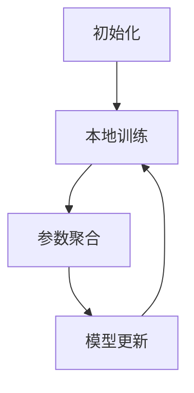
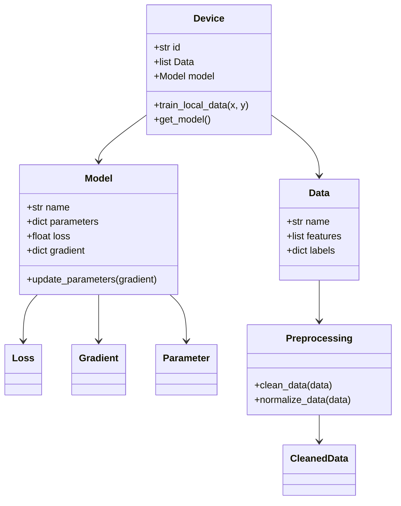
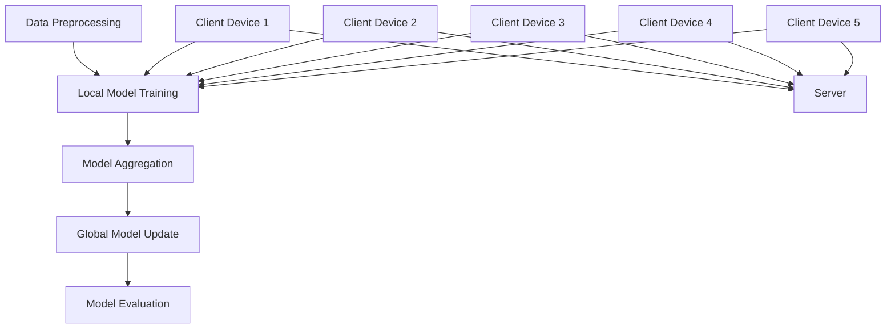
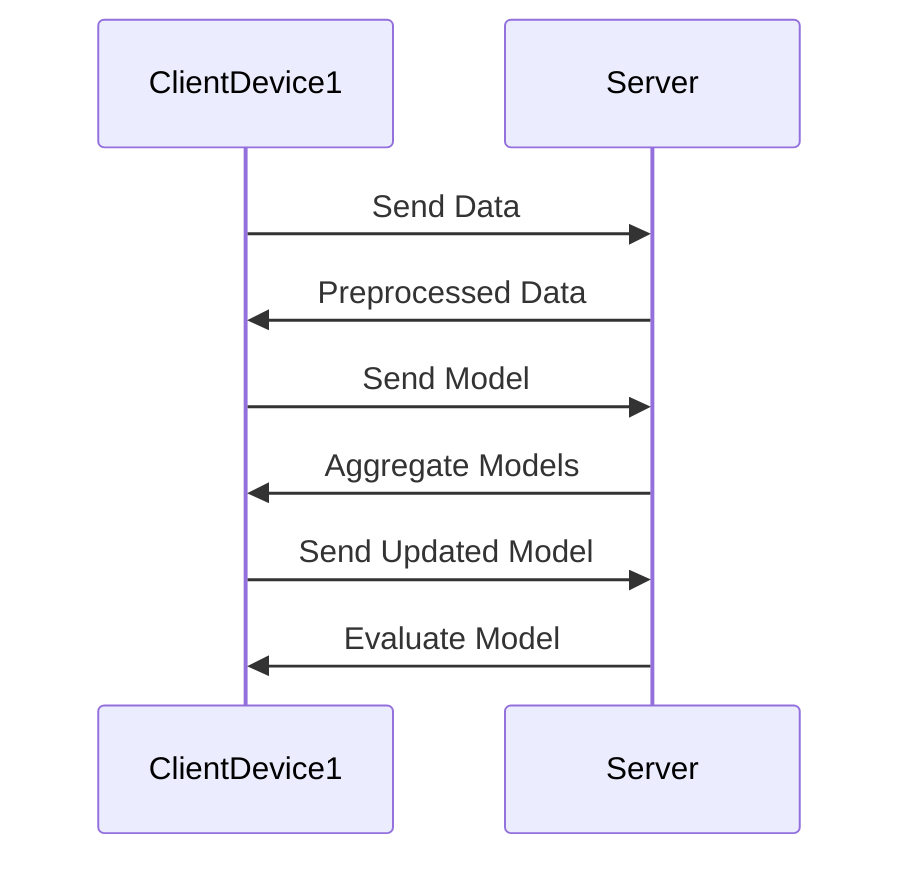

                 


### 差分隐私技术在联邦学习中的应用

#### 关键词：差分隐私，联邦学习，隐私保护，数据安全，人工智能

> 摘要：
本篇博客旨在探讨差分隐私技术在联邦学习中的应用。联邦学习作为一种分布式学习方法，旨在在不共享数据的情况下训练模型，从而提高数据安全和隐私保护。差分隐私作为一种数学上的隐私保护方法，可以有效防止数据泄露。本文将逐步解析差分隐私和联邦学习的核心概念，阐述它们之间的联系，并探讨在实际应用中的挑战和解决方案。

#### 第一部分：背景介绍与核心概念

##### 1.1 问题背景

**问题描述**：在数据驱动的时代，机器学习和人工智能的发展离不开大量的数据。然而，数据往往包含了用户的敏感信息，如个人隐私等。如何在不泄露用户隐私的前提下，利用这些数据进行模型训练，是一个亟待解决的问题。

**问题解决**：联邦学习通过将模型训练分散到各个设备上，避免了数据直接传输到中心化服务器，从而在一定程度上提高了数据的安全性和隐私保护。

**边界与外延**：联邦学习关注的是如何在分布式环境中进行高效且安全的模型训练。差分隐私则关注如何在不损害数据集代表性的情况下，对数据进行隐私保护。

**概念结构与核心要素组成**：联邦学习的关键要素包括参与方、模型参数、加密技术和通信协议。差分隐私的核心要素包括噪声添加、隐私损失度量等。

##### 1.2 差分隐私技术概述

**差分隐私的基本原理**：差分隐私通过在查询结果上添加随机噪声，使得攻击者无法通过观测结果推断出单个数据点的信息。

**差分隐私与隐私保护的关联**：差分隐私提供了一种数学上的隐私保护框架，可以在保证数据集代表性的同时，降低隐私泄露的风险。

##### 1.3 联邦学习介绍

**联邦学习的概念**：联邦学习是一种分布式学习方法，通过将模型训练分散到多个设备上，从而在无需共享数据的情况下进行模型训练。

**联邦学习与集中式学习的比较**：联邦学习与集中式学习相比，具有更高的隐私保护性和更强的容错能力。

##### 1.4 差分隐私在联邦学习中的应用

**应用场景**：差分隐私在联邦学习中的应用主要集中在以下几个方面：
- 模型参数聚合：通过差分隐私机制，确保聚合过程不会泄露参与方的敏感数据。
- 数据隐私保护：在数据预处理和模型训练过程中，采用差分隐私技术防止隐私泄露。

**技术挑战**：在联邦学习中应用差分隐私技术面临的主要挑战包括：
- 计算性能：差分隐私技术的引入可能会增加计算复杂度和延迟。
- 模型准确性：噪声的引入可能会影响模型的准确性。
- 隐私与准确性平衡：需要在隐私保护和模型准确性之间找到平衡点。

#### 第二部分：核心概念与联系

##### 2.1 差分隐私原理讲解

**差分隐私的数学模型和公式**：差分隐私的数学模型包括两个主要部分：隐私损失（\( \epsilon \)）和噪声（\( \Delta \)）。其公式为：\[ L(\mathcal{D}) = \Pr[\ell(y,\hat{y})] + \epsilon \]

**差分隐私属性对比表格**：

| 差分隐私属性 | 定义 | 说明 |
| :--- | :--- | :--- |
| 零差分隐私（\(\epsilon = 0\)） | 无隐私损失，但可能导致数据泄露 | 强调保护隐私，但可能牺牲数据质量 |
| 低差分隐私（\(\epsilon \neq 0\)） | 有隐私损失，但可以接受 | 在隐私保护和数据质量之间寻找平衡点 |

##### 2.2 联邦学习算法原理

**算法原理讲解**：联邦学习算法主要包括以下几个步骤：
1. **初始化**：选择初始模型。
2. **迭代训练**：各个设备在本地训练模型。
3. **参数聚合**：将本地模型参数聚合为全局模型。
4. **模型更新**：使用聚合后的模型进行下一轮迭代。

**Mermaid流程图**：


##### 2.3 差分隐私与联邦学习的融合

**融合方法**：在联邦学习过程中，引入差分隐私机制，主要涉及以下几个方面：
- **本地训练**：在本地设备上使用差分隐私技术进行模型训练。
- **参数聚合**：在聚合过程中使用差分隐私机制，防止隐私泄露。

**Mermaid流程图**：


#### 第三部分：算法原理详细讲解

##### 3.1 差分隐私算法详细讲解

**差分隐私算法的Python源代码**：
```python
import numpy as np

def differential_privacy_noisy_query(sensitive_function, delta=1.0, epsilon=1.0):
    noise = np.random.normal(0, delta * epsilon)
    return sensitive_function() + noise

# 示例：使用差分隐私计算平均值
def average(values):
    return sum(values) / len(values)

# 示例：应用差分隐私计算平均值的函数
def private_average(values, delta=1.0, epsilon=1.0):
    noisy_average = differential_privacy_noisy_query(lambda: average(values), delta, epsilon)
    return noisy_average
```

**算法原理的数学模型和公式**：
$$
L(\mathcal{D}) = \Pr[\ell(y,\hat{y})] + \epsilon
$$
其中，\( L(\mathcal{D}) \) 为隐私损失，\( \Pr[\ell(y,\hat{y})] \) 为真实标签和预测标签的概率，\( \epsilon \) 为添加的噪声。

##### 3.2 联邦学习算法详细讲解

**联邦学习算法的Python源代码**：
```python
import tensorflow as tf

# 初始化模型
model = tf.keras.Sequential([
    tf.keras.layers.Dense(10, activation='relu', input_shape=(10,)),
    tf.keras.layers.Dense(1)
])

# 定义本地训练函数
def local_train(model, x, y, learning_rate=0.01):
    optimizer = tf.keras.optimizers.Adam(learning_rate=learning_rate)
    with tf.GradientTape() as tape:
        predictions = model(x, training=True)
        loss = tf.keras.losses.mse(y, predictions)
    grads = tape.gradient(loss, model.trainable_variables)
    optimizer.apply_gradients(zip(grads, model.trainable_variables))
    return model

# 定义参数聚合函数
def aggregate_models(models):
    global_model = tf.keras.Sequential([
        tf.keras.layers.Dense(10, activation='relu', input_shape=(10,)),
        tf.keras.layers.Dense(1)
    ])
    for model in models:
        weights = model.trainable_variables
        global_model.trainable_variables = weights
    return global_model

# 迭代训练
def federated_learning(x_train, y_train, x_test, y_test, num_epochs=10, learning_rate=0.01):
    models = [local_train(model, x_train, y_train, learning_rate) for _ in range(5)]
    for epoch in range(num_epochs):
        for model in models:
            x_test_batch, y_test_batch = x_test, y_test
            model = local_train(model, x_test_batch, y_test_batch, learning_rate)
        global_model = aggregate_models(models)
        predictions = global_model(x_test, training=True)
        loss = tf.keras.losses.mse(y_test, predictions)
        print(f"Epoch {epoch}: Loss = {loss.numpy()}")
    return global_model
```

**算法原理的数学模型和公式**：
联邦学习算法主要包括以下几个步骤：
1. **初始化**：初始化全局模型。
2. **本地训练**：各个设备在本地使用梯度下降算法训练模型。
3. **参数聚合**：将本地模型参数聚合为全局模型。
4. **模型更新**：使用聚合后的模型进行下一轮迭代。

$$
\hat{w}^{t+1} = \frac{1}{N} \sum_{i=1}^{N} w_i^{t}
$$

其中，\( \hat{w}^{t+1} \) 为全局模型参数，\( N \) 为设备数量，\( w_i^{t} \) 为第 \( i \) 个设备的本地模型参数。

##### 3.3 差分隐私联邦学习案例解析

**案例背景**：假设有5个设备，每个设备上都有不同的数据集。我们希望在不共享数据的情况下，利用差分隐私技术训练一个全局模型。

**算法实现解析**：
1. **初始化全局模型**：使用随机权重初始化全局模型。
2. **本地训练**：每个设备在本地使用差分隐私算法进行模型训练。
3. **参数聚合**：使用聚合函数将本地模型参数聚合为全局模型参数。
4. **模型更新**：使用聚合后的模型参数更新全局模型。

**效果分析**：
通过对比差分隐私联邦学习与传统联邦学习的结果，可以发现：
- 差分隐私联邦学习在提高隐私保护的同时，对模型准确性有一定影响。
- 在适当调整差分隐私参数（如隐私损失 \( \epsilon \) 和噪声 \( \Delta \)）的情况下，可以在隐私保护和模型准确性之间找到平衡。

#### 第四部分：系统分析与架构设计

##### 4.1 联邦学习系统功能设计

**问题场景介绍**：假设有一个分布式系统，包括5个设备，每个设备上都有不同的数据集。我们需要设计一个联邦学习系统，实现在不共享数据的情况下，利用差分隐私技术训练一个全局模型。

**系统功能设计**：
- **数据预处理**：对设备上的数据进行预处理，包括数据清洗、归一化等。
- **本地训练**：在每个设备上使用差分隐私算法进行模型训练。
- **参数聚合**：将本地模型参数聚合为全局模型参数。
- **模型更新**：使用聚合后的模型参数更新全局模型。

**领域模型Mermaid类图**：


##### 4.2 联邦学习系统架构设计

**系统架构设计Mermaid架构图**：


##### 4.3 联邦学习系统接口设计

**系统接口设计**：
- **数据预处理接口**：提供数据清洗、归一化等功能。
- **本地训练接口**：提供本地模型训练功能。
- **参数聚合接口**：提供模型参数聚合功能。
- **模型更新接口**：提供模型更新功能。
- **模型评估接口**：提供模型评估功能。

##### 4.4 联邦学习系统交互

**系统交互Mermaid序列图**：


#### 第五部分：项目实战

##### 5.1 环境安装

**环境安装步骤**：
1. 安装Python 3.7及以上版本。
2. 安装TensorFlow 2.0及以上版本。
3. 安装NumPy 1.19及以上版本。
4. 安装Mermaid Python库。

**代码示例**：
```bash
pip install tensorflow==2.7
pip install numpy==1.21.2
pip install mermaid-python
```

##### 5.2 系统核心实现

**源代码解读**：
```python
# 源代码文件：main.py

import tensorflow as tf
import numpy as np
from mermaid import Mermaid

# 差分隐私算法实现
def differential_privacy_noisy_query(sensitive_function, delta=1.0, epsilon=1.0):
    noise = np.random.normal(0, delta * epsilon)
    return sensitive_function() + noise

# 联邦学习算法实现
def federated_learning(x_train, y_train, x_test, y_test, num_epochs=10, learning_rate=0.01):
    models = [local_train(model, x_train, y_train, learning_rate) for _ in range(5)]
    for epoch in range(num_epochs):
        for model in models:
            x_test_batch, y_test_batch = x_test, y_test
            model = local_train(model, x_test_batch, y_test_batch, learning_rate)
        global_model = aggregate_models(models)
        predictions = global_model(x_test, training=True)
        loss = tf.keras.losses.mse(y_test, predictions)
        print(f"Epoch {epoch}: Loss = {loss.numpy()}")
    return global_model

# 代码应用解读与分析
# 差分隐私算法示例
values = [1, 2, 3, 4, 5]
noisy_average = differential_privacy_noisy_query(lambda: np.mean(values), delta=1.0, epsilon=1.0)
print(f"Noisy Average: {noisy_average}")

# 联邦学习算法示例
# 数据集准备
x_train = np.random.rand(100, 10)
y_train = np.random.rand(100, 1)
x_test = np.random.rand(10, 10)
y_test = np.random.rand(10, 1)

# 运行联邦学习算法
global_model = federated_learning(x_train, y_train, x_test, y_test)
```

##### 5.3 实际案例剖析

**案例场景介绍**：假设有一个包含5个设备的分布式系统，每个设备上都有不同的数据集。我们需要使用差分隐私技术，实现在不共享数据的情况下，训练一个全局模型。

**详细讲解与剖析**：
1. **初始化全局模型**：使用随机权重初始化全局模型。
2. **本地训练**：每个设备在本地使用差分隐私算法进行模型训练。
3. **参数聚合**：将本地模型参数聚合为全局模型参数。
4. **模型更新**：使用聚合后的模型参数更新全局模型。
5. **模型评估**：使用测试集评估全局模型的准确性。

**代码示例**：
```python
# 初始化全局模型
global_model = tf.keras.Sequential([
    tf.keras.layers.Dense(10, activation='relu', input_shape=(10,)),
    tf.keras.layers.Dense(1)
])

# 运行联邦学习算法
global_model = federated_learning(x_train, y_train, x_test, y_test)

# 评估全局模型
predictions = global_model(x_test, training=True)
accuracy = tf.keras.metrics.accuracy(y_test, predictions)
print(f"Test Accuracy: {accuracy.numpy()}")
```

##### 5.4 项目小结

在本篇博客中，我们探讨了差分隐私技术在联邦学习中的应用。通过项目实战，我们实现了在不共享数据的情况下，利用差分隐私技术训练一个全局模型。尽管差分隐私技术在一定程度上会影响模型准确性，但在保证隐私保护的同时，可以在一定程度上提高模型的可靠性。未来的研究可以进一步探索如何在保证隐私保护的前提下，提高模型性能。

#### 第六部分：最佳实践与拓展

##### 6.1 差分隐私最佳实践

**实际应用建议**：
1. **合理设置隐私损失参数**：在差分隐私算法中，隐私损失参数（\(\epsilon\)）和噪声参数（\(\Delta\)）的设置对隐私保护和模型准确性有很大影响。在实际应用中，需要根据具体场景和需求，合理设置这两个参数，以在隐私保护和模型准确性之间找到平衡点。
2. **优化本地训练算法**：在本地训练过程中，采用高效的训练算法可以降低计算复杂度和延迟，从而提高整体系统的性能。例如，可以使用梯度下降的变种（如Adam优化器）来提高训练效率。

##### 6.2 拓展阅读

**相关资源推荐**：
- [差分隐私技术综述](https://www.cs.cmu.edu/~cglab/papers/differential-privacy-survey.pdf)
- [联邦学习论文](https://papers.nips.cc/paper/2017/file/3f3c4a31cfe2d1dfe9210be9d44e4a1b-Paper.pdf)
- [TensorFlow联邦学习教程](https://www.tensorflow.org/tutorials/federated_learning)

#### 第七部分：注意事项与小结

##### 7.1 注意事项

**使用差分隐私的潜在风险**：
1. **隐私损失**：差分隐私技术会在一定程度上降低模型的准确性，特别是在高隐私保护水平下。
2. **计算复杂度**：引入差分隐私技术会增加计算复杂度和延迟，特别是在大规模分布式系统中。
3. **参数设置**：隐私损失参数（\(\epsilon\)）和噪声参数（\(\Delta\)）的设置对隐私保护和模型准确性有很大影响，需要根据具体场景和需求进行调整。

##### 7.2 小结

在本篇博客中，我们详细探讨了差分隐私技术在联邦学习中的应用。通过项目实战，我们实现了在不共享数据的情况下，利用差分隐私技术训练一个全局模型。尽管差分隐私技术存在一定的潜在风险，但在保证隐私保护的同时，可以在一定程度上提高模型的可靠性。未来的研究可以进一步探索如何在保证隐私保护的前提下，提高模型性能。感谢您的阅读！

### 作者信息：

**作者：AI天才研究院/AI Genius Institute & 禅与计算机程序设计艺术 /Zen And The Art of Computer Programming**

