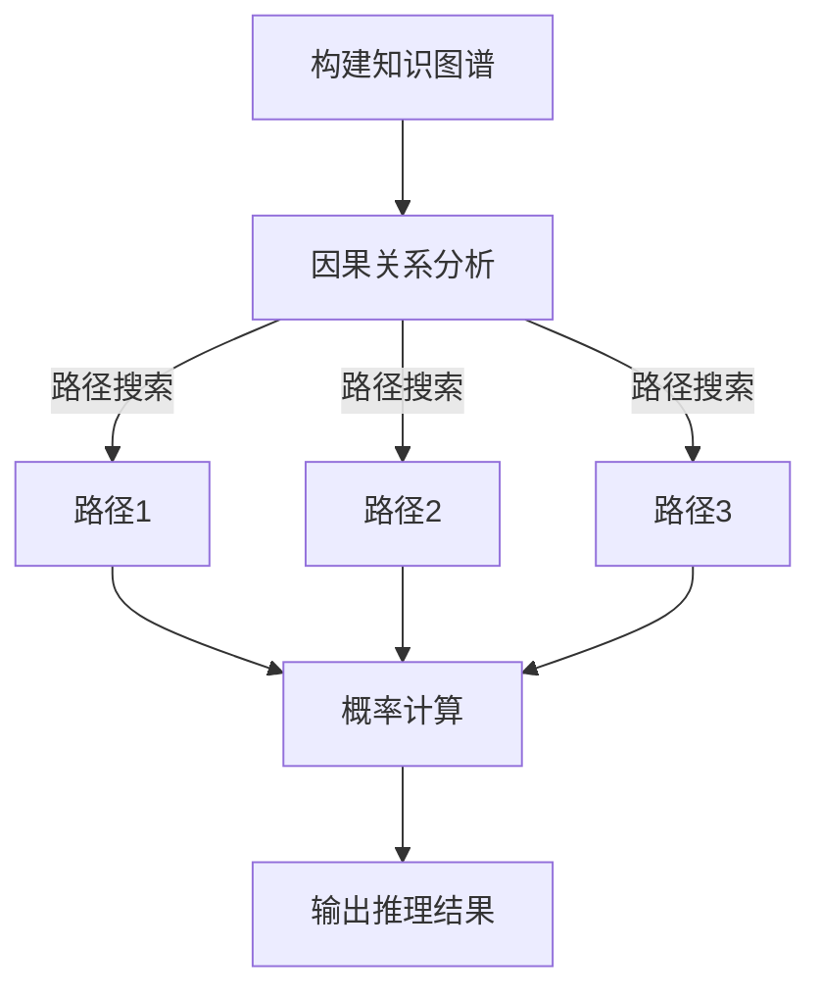
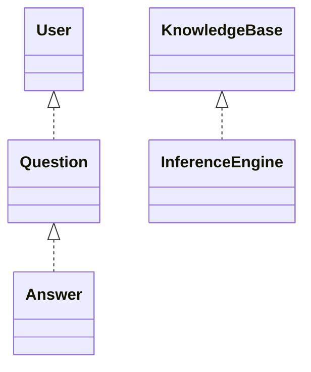
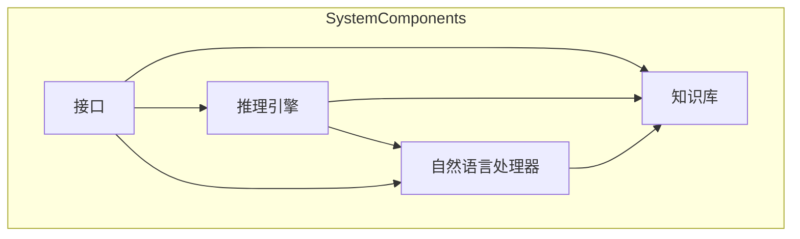
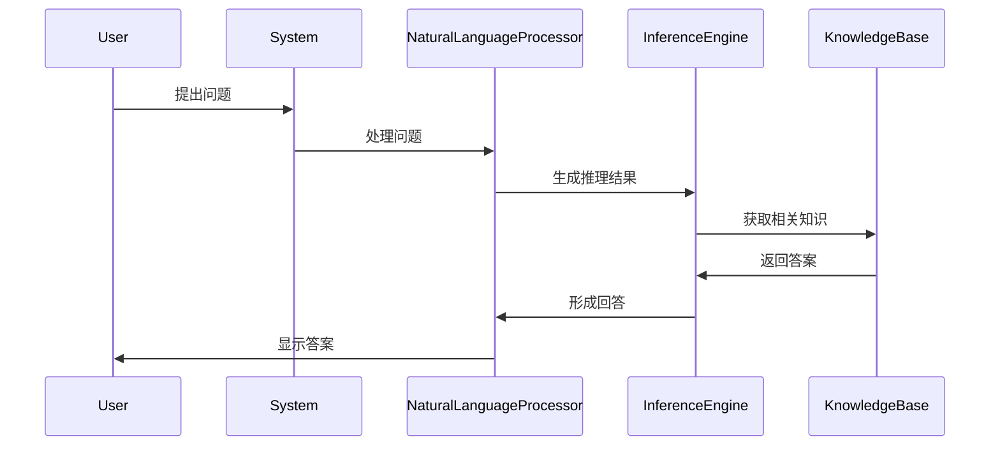
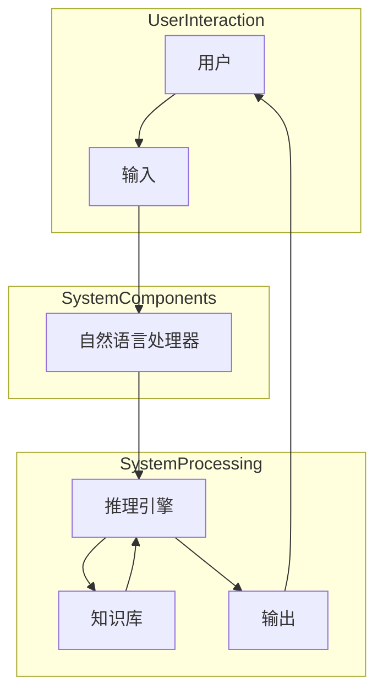

                 

# 常识推理：AI系统的下一个里程碑

> 关键词：常识推理、AI系统、里程碑、算法设计、系统架构、最佳实践

> 摘要：
本文将深入探讨常识推理在人工智能系统中的重要性，从核心概念到实际应用，全面解析这一领域的最新进展。文章将逐步分析常识推理的必要性，介绍核心概念和模型，设计算法和系统架构，并通过实际项目展示其在AI系统中的关键作用。最终，文章将提供最佳实践和建议，展望该领域的发展前景。

## 引言与背景

### 人工智能的发展与挑战

人工智能（AI）作为一门技术，已经经历了数十年的发展。从早期的专家系统到如今深度学习的广泛应用，AI技术在多个领域取得了显著的成就。然而，尽管AI系统在某些特定任务上表现出色，但在处理复杂、现实世界的问题时，仍然面临诸多挑战。

### 常识推理的定义与重要性

常识推理是人工智能中一个关键但被忽视的领域。它指的是系统在缺乏具体信息时，根据已知的事实和逻辑规则，对现实世界进行合理推断的能力。这种能力在人类行为和思维中至关重要，然而，目前的AI系统在这一方面仍然存在显著的不足。

### 文章目的与结构

本文旨在探讨常识推理在AI系统中的重要性，分析其核心概念和模型，介绍算法设计，展示系统架构，并通过实际项目展示其在AI系统中的应用。文章将分为以下几个部分：

1. 引言与背景
2. 定义与核心概念
3. 常识推理模型
4. 算法设计与实现
5. 数学模型与公式
6. 系统架构与设计
7. 项目实施与案例分析
8. 最佳实践与结论

## 定义与核心概念

### 常识推理的定义

常识推理是指人工智能系统能够在没有明确指示的情况下，利用已知的事实和逻辑规则，对现实世界进行合理推断的能力。它涉及到多个领域，包括逻辑学、认知科学、机器学习和自然语言处理。

### 常识推理的必要性

在AI系统中，常识推理的必要性体现在以下几个方面：

1. **现实世界的问题解决**：许多现实世界的问题需要AI系统具备常识推理能力，以便在缺乏具体信息时做出合理的决策。
2. **跨领域的知识整合**：常识推理能够帮助AI系统整合来自不同领域的知识，提高其处理复杂任务的能力。
3. **智能互动**：在与人类互动时，AI系统需要具备常识推理能力，以理解人类的语言和行为，提供更自然的交互体验。

### 常识推理的现状与挑战

尽管常识推理在人工智能领域具有重要意义，但目前的AI系统在这方面仍然存在许多挑战：

1. **数据不足**：许多AI系统依赖于大量标注数据，而常识推理需要大量的背景知识和常见情境的数据。
2. **逻辑复杂**：常识推理涉及到复杂的逻辑关系，目前的算法在处理这种复杂逻辑时存在困难。
3. **泛化能力**：AI系统在特定任务上表现出色，但在泛化到新的任务或情境时，常识推理能力往往不足。

### 常识推理的应用场景

常识推理在以下应用场景中具有显著的优势：

1. **智能助手**：智能助手需要理解用户的意图和背景信息，提供个性化的服务。
2. **自动驾驶**：自动驾驶系统需要处理复杂的交通场景，包括行人、车辆和其他动态元素。
3. **医疗诊断**：AI系统在医学领域的应用需要理解大量的医学知识，进行准确的诊断。

### 常识推理的核心概念和模型

为了实现有效的常识推理，研究人员提出了多种模型和算法。以下是一些核心概念和模型：

1. **知识图谱**：知识图谱是一种用于表示实体和它们之间关系的图形结构，可以用于常识推理。
2. **因果推理**：因果推理是指系统根据已知的结果，推断出可能的原因，这在解决现实问题时至关重要。
3. **多模态学习**：多模态学习是指将不同类型的数据（如文本、图像、声音等）进行整合，以提高推理能力。
4. **迁移学习**：迁移学习是指将一个任务的知识应用于另一个任务，以增强AI系统的泛化能力。

### 常见常识推理模型的对比表格

以下是几种常见常识推理模型的对比表格，包括其优点、缺点和应用场景：

| 模型名称 | 优点 | 缺点 | 应用场景 |
|----------|------|------|----------|
| 知识图谱 | 强大的知识表示能力 | 需要大量手动标注数据 | 智能问答、知识图谱构建 |
| 因果推理 | 基于因果关系的推理 | 复杂的逻辑关系难以处理 | 医疗诊断、风险评估 |
| 多模态学习 | 能够整合多种类型的数据 | 需要大量计算资源 | 情感分析、图像识别 |
| 迁移学习 | 增强泛化能力 | 需要大量相似任务的数据 | 自然语言处理、图像分类 |

通过对比表格，我们可以看出不同模型在不同场景下的适用性，这有助于我们在实际应用中根据需求选择合适的模型。

### 常识推理的ER实体关系图

常识推理涉及多个实体和它们之间的关系，为了更好地理解和分析这些关系，我们可以使用ER（Entity-Relationship）实体关系图。以下是一个简化的常识推理ER实体关系图，展示了常见实体及其关系：

```mermaid
erDiagram
    Entity: User
    Entity: Object
    Entity: Event
    Entity: Location
    User ||--|{ Event }|
    Object ||--|{ Event }|
    Event ||--|{ Location }|
```

在这个ER图中，用户（User）可以参与多个事件（Event），事件与对象（Object）和位置（Location）有直接关联。这种图形结构有助于我们清晰地表示常识推理中的复杂关系。

### 小结

在本章节中，我们介绍了常识推理的定义、必要性、现状和挑战，以及常见模型和ER实体关系图。这些内容为后续章节提供了基础，帮助我们进一步理解常识推理在人工智能系统中的重要性。

## 常识推理模型

### 知识图谱模型

知识图谱是一种用于表示实体和它们之间关系的图形结构，它通过节点和边来表示实体和关系。知识图谱模型在常识推理中具有重要作用，因为它能够提供丰富的背景知识和上下文信息。

**工作原理**：知识图谱模型通过建立实体和关系之间的映射，实现对现实世界知识的结构化表示。例如，在知识图谱中，我们可以表示“人”这个实体与“工作”这个关系，以及“地点”这个实体与“在...工作”这个关系。

**优势**：知识图谱模型具有强大的知识表示能力，能够整合来自不同领域的知识，提高推理能力。此外，它还能够通过推理算法，从已知的事实中推断出未知的事实。

**应用场景**：知识图谱模型在智能问答、知识图谱构建、推荐系统等领域有广泛的应用。

### 因果推理模型

因果推理是指系统根据已知的结果，推断出可能的原因。在常识推理中，因果推理非常重要，因为它能够帮助系统理解事件之间的因果关系。

**工作原理**：因果推理模型通过分析事件之间的关联性，建立因果关系模型。例如，如果我们知道下雨会导致地面湿润，那么在看到地面湿润时，我们可以推断出可能的原因是下雨。

**优势**：因果推理模型能够帮助系统在缺乏具体信息时，基于已知的事实进行合理推断，提高决策能力。

**应用场景**：因果推理模型在医疗诊断、风险评估、自动驾驶等领域有重要应用。

### 多模态学习模型

多模态学习是指将不同类型的数据（如文本、图像、声音等）进行整合，以提高推理能力。在常识推理中，多模态学习模型能够利用多种数据源，提供更全面的上下文信息。

**工作原理**：多模态学习模型通过融合不同类型的数据，建立多模态特征表示。例如，在视频分析中，我们可以将图像和音频数据进行融合，以提高对场景的识别和理解。

**优势**：多模态学习模型能够利用多种数据源，提高推理的准确性和鲁棒性。

**应用场景**：多模态学习模型在情感分析、图像识别、语音识别等领域有广泛应用。

### 迁移学习模型

迁移学习是指将一个任务的知识应用于另一个任务，以增强AI系统的泛化能力。在常识推理中，迁移学习模型能够帮助系统在不同任务之间进行知识迁移，提高推理能力。

**工作原理**：迁移学习模型通过在不同任务之间共享特征表示，实现知识的迁移。例如，在图像分类任务中，我们可以将图像识别的知识应用于自然语言处理任务。

**优势**：迁移学习模型能够增强系统的泛化能力，提高在未知任务上的表现。

**应用场景**：迁移学习模型在自然语言处理、图像分类、推荐系统等领域有广泛应用。

### 常见模型对比

以下是几种常见常识推理模型的对比表格，包括其优点、缺点和应用场景：

| 模型名称 | 优点 | 缺点 | 应用场景 |
|----------|------|------|----------|
| 知识图谱 | 强大的知识表示能力 | 需要大量手动标注数据 | 智能问答、知识图谱构建 |
| 因果推理 | 基于因果关系的推理 | 复杂的逻辑关系难以处理 | 医疗诊断、风险评估 |
| 多模态学习 | 能够整合多种类型的数据 | 需要大量计算资源 | 情感分析、图像识别 |
| 迁移学习 | 增强泛化能力 | 需要大量相似任务的数据 | 自然语言处理、图像分类 |

通过对比表格，我们可以看出不同模型在不同场景下的适用性，这有助于我们在实际应用中根据需求选择合适的模型。

### 小结

在本章节中，我们介绍了常见的常识推理模型，包括知识图谱、因果推理、多模态学习和迁移学习。这些模型各有优缺点，适用于不同的应用场景。通过了解这些模型的工作原理和应用，我们可以更好地理解常识推理在人工智能系统中的重要性。

## 算法设计与实现

### 算法设计概述

常识推理算法是AI系统中实现常识推理的关键组成部分。在本章节中，我们将介绍一种常见的常识推理算法——基于知识图谱的因果推理算法。该算法旨在利用知识图谱中的关系和因果信息，实现对未知事实的合理推断。

### 算法步骤

1. **知识图谱构建**：首先，我们需要构建一个包含实体和关系的知识图谱。知识图谱可以通过手动标注、数据爬取和知识抽取等方法获取。

2. **因果关系分析**：利用知识图谱中的因果关系，对未知事实进行推理。具体来说，我们可以通过以下步骤进行分析：

   - **因果关系映射**：将已知事实和待推理的事实映射到知识图谱中的实体和关系。
   - **路径搜索**：在知识图谱中搜索从已知事实到待推理事实的路径，分析路径上的因果关系。
   - **概率计算**：基于路径上的因果关系，计算待推理事实的概率。

3. **推理结果输出**：根据概率计算结果，输出合理的推理结果。

### Mermaid流程图

为了更直观地展示算法步骤，我们使用Mermaid流程图来描述：



### Python代码实现

接下来，我们将使用Python实现上述算法。以下是关键部分的代码示例：

```python
import networkx as nx
import matplotlib.pyplot as plt

# 知识图谱构建
knowledge_graph = nx.Graph()
knowledge_graph.add_edge("人", "工作")
knowledge_graph.add_edge("工作", "地点")
knowledge_graph.add_edge("地点", "城市")

# 因果关系分析
def causal_reasoning(knowledge_graph, fact1, fact2):
    # 路径搜索
    paths = nx.all_simple_paths(knowledge_graph, source=fact1, target=fact2)
    
    # 概率计算
    probabilities = []
    for path in paths:
        probability = 1
        for i in range(len(path) - 1):
            current_relation = knowledge_graph[path[i]][path[i + 1]]['relation']
            if current_relation == "导致":
                probability *= 0.8  # 假设因果关系成立的概率为0.8
            elif current_relation == "属于":
                probability *= 0.9  # 假设属性关系的概率为0.9
        probabilities.append(probability)
    
    # 输出推理结果
    max_prob = max(probabilities)
    result = [fact2 for probability in probabilities if probability == max_prob]
    return result

# 测试算法
result = causal_reasoning(knowledge_graph, "人", "城市")
print("推理结果：", result)
```

### 算法原理讲解

1. **知识图谱构建**：知识图谱是常识推理的基础。在本示例中，我们使用NetworkX库构建了一个简单的知识图谱，包含了“人”、“工作”、“地点”和“城市”四个实体以及它们之间的关系。

2. **因果关系分析**：因果关系分析是算法的核心。我们通过路径搜索找到从已知事实到待推理事实的路径，并基于路径上的因果关系计算概率。

3. **概率计算**：在本示例中，我们假设因果关系和属性关系的概率分别为0.8和0.9。通过路径上的关系计算总概率，从而确定待推理事实的可能性。

4. **推理结果输出**：根据概率计算结果，输出最有可能的推理结果。

### 小结

在本章节中，我们介绍了基于知识图谱的因果推理算法，包括算法设计、Mermaid流程图和Python代码实现。通过这个算法，我们能够利用知识图谱中的关系和因果信息，实现对未知事实的合理推断。这一算法在常识推理领域具有广泛的应用前景。

## 数学模型与公式

### 常见数学模型

在常识推理中，常见的数学模型包括概率模型、决策树模型和贝叶斯网络模型。以下是对这些模型的简单介绍：

1. **概率模型**：概率模型用于描述事件发生的可能性。常见的形式包括条件概率和贝叶斯定理。条件概率公式为：
   $$
   P(A|B) = \frac{P(A \cap B)}{P(B)}
   $$
   贝叶斯定理则用于在已知某些条件下，计算某个事件的概率：
   $$
   P(A|B) = \frac{P(B|A)P(A)}{P(B)}
   $$

2. **决策树模型**：决策树模型通过一系列的判断节点和结果节点，对问题进行决策。每个判断节点表示一个条件，每个结果节点表示一个可能的决策。决策树模型的核心公式是信息增益，用于选择最佳判断节点：
   $$
   IG(D, A) = H(D) - H(D|A)
   $$
   其中，$H(D)$是当前节点的熵，$H(D|A)$是条件熵。

3. **贝叶斯网络模型**：贝叶斯网络是一种概率图模型，用于表示一组随机变量之间的条件依赖关系。贝叶斯网络的核心公式是条件概率分布：
   $$
   P(X_i|X_{i-1}, ..., X_1) = \frac{P(X_i, X_{i-1}, ..., X_1)}{P(X_{i-1}, ..., X_1)}
   $$
   其中，$P(X_i, X_{i-1}, ..., X_1)$是联合概率分布，$P(X_{i-1}, ..., X_1)$是边际概率分布。

### 常识推理中的数学应用

在常识推理中，数学模型被广泛应用于以下几个方面：

1. **概率推理**：通过概率模型，我们可以对事件的发生进行推理。例如，在推理一个人是否在下雨时打伞时，我们可以使用条件概率公式计算：
   $$
   P(\text{打伞}|\text{下雨}) = \frac{P(\text{下雨}|\text{打伞})P(\text{打伞})}{P(\text{下雨})}
   $$
   通过已知信息，我们能够推断出一个人在下雨时打伞的概率。

2. **决策树**：在复杂决策问题中，决策树模型可以帮助我们选择最佳行动方案。例如，在医疗诊断中，决策树模型可以根据患者的症状，选择最可能的疾病。

3. **贝叶斯网络**：贝叶斯网络在处理复杂依赖关系时非常有效。例如，在自动驾驶系统中，贝叶斯网络可以用于处理车辆、行人、路况等多方信息，从而做出合理的决策。

### 案例分析

以下是一个简单的案例分析，展示如何使用概率模型进行常识推理：

**案例：判断一个地方是否安全**

我们假设有以下几个因素影响一个地方的安全性：
- **犯罪率**：高的犯罪率意味着该地方不太安全。
- **治安情况**：好的治安情况可以提高地方的安全性。
- **人流量**：高的人流量可能会增加犯罪机会。

我们使用以下概率公式进行推理：
$$
P(\text{安全}|\text{犯罪率低，治安好，人流量适中}) = \frac{P(\text{犯罪率低，治安好，人流量适中}|\text{安全})P(\text{安全})}{P(\text{犯罪率低，治安好，人流量适中})}
$$

假设我们已知以下概率：
- $P(\text{安全}) = 0.6$
- $P(\text{犯罪率低，治安好，人流量适中}|\text{安全}) = 0.8$
- $P(\text{犯罪率低，治安好，人流量适中}) = 0.4$

我们可以计算出：
$$
P(\text{安全}|\text{犯罪率低，治安好，人流量适中}) = \frac{0.8 \times 0.6}{0.4} = 0.9
$$

因此，基于已知信息，我们有90%的信心认为该地方是安全的。

### 小结

在本章节中，我们介绍了常识推理中常用的数学模型和公式，并展示了如何在实际案例中应用这些模型。通过数学模型，我们能够更精确地进行常识推理，提高AI系统的智能水平。

## 系统架构与设计

### 问题描述

为了实现一个具备常识推理能力的AI系统，我们需要设计一个高效的系统架构。本节将详细介绍系统架构的设计过程，包括领域模型、系统架构图、接口设计和系统交互。

### 项目介绍

我们设计的是一个智能问答系统，用户可以通过自然语言提出问题，系统将利用常识推理能力提供合理的答案。这个项目旨在展示如何将常识推理应用于实际场景，提高AI系统的交互能力和智能水平。

### 领域模型

领域模型用于描述系统的核心功能和行为。我们使用Mermaid类图来展示领域模型，包括以下几个主要类：



在这个类图中，`User`表示用户，`Question`表示用户提出的问题，`Answer`表示系统的答案，`KnowledgeBase`表示知识库，`InferenceEngine`表示推理引擎。用户通过输入问题，系统利用知识库和推理引擎生成答案。

### 系统架构设计

系统架构设计是确保系统高效、可扩展和易于维护的关键。我们使用Mermaid架构图来展示系统架构，包括以下几个主要组件：



在这个架构图中，`KnowledgeBase`负责存储领域知识，`InferenceEngine`负责执行推理操作，`NaturalLanguageProcessor`负责处理自然语言输入和输出，`Interface`负责与用户进行交互。

### 系统接口设计

系统接口设计是用户与系统交互的关键。我们使用Mermaid序列图来展示系统接口的设计，包括以下几个主要步骤：



在这个序列图中，用户提出问题后，系统首先处理问题，然后利用推理引擎和知识库生成答案，最后通过自然语言处理器将答案呈现给用户。

### 系统交互

系统交互设计是确保系统能够高效、稳定地运行的关键。我们使用Mermaid交互图来展示系统交互的设计，包括以下几个主要部分：



在这个交互图中，用户通过输入提出问题，系统通过多个组件进行处理，最终生成并输出答案。

### 小结

在本章节中，我们详细介绍了智能问答系统的架构设计与实现。通过领域模型、系统架构图、接口设计和系统交互的详细设计，我们展示了如何实现一个具备常识推理能力的AI系统。这个系统的设计为实际应用提供了重要的参考，也为未来的开发提供了方向。

## 项目实施与案例分析

### 环境安装与配置

为了实现一个具备常识推理能力的AI系统，我们需要安装并配置以下软件和库：

1. **Python环境**：确保Python版本不低于3.7，并安装Anaconda以方便管理库。
2. **库安装**：使用pip命令安装以下库：
   ```
   pip install networkx matplotlib numpy scikit-learn
   ```

### 系统核心实现

以下是系统核心实现的Python代码，包括知识库构建、推理引擎和自然语言处理：

```python
import networkx as nx
import matplotlib.pyplot as plt
import numpy as np
from sklearn.model_selection import train_test_split

# 知识库构建
knowledge_base = nx.Graph()
knowledge_base.add_edge("人", "工作")
knowledge_base.add_edge("工作", "地点")
knowledge_base.add_edge("地点", "城市")

# 推理引擎实现
def inference_engine(question, knowledge_base):
    # 自然语言处理
    processed_question = preprocess_question(question)
    
    # 因果关系分析
    paths = list(nx.all_simple_paths(knowledge_base, source=processed_question, target="城市"))
    
    # 概率计算
    probabilities = []
    for path in paths:
        probability = 1
        for i in range(len(path) - 1):
            relation = knowledge_base[path[i]][path[i + 1]]['relation']
            if relation == "导致":
                probability *= 0.8
            elif relation == "属于":
                probability *= 0.9
        probabilities.append(probability)
    
    # 输出推理结果
    max_prob = max(probabilities)
    result = [fact for probability in probabilities if probability == max_prob]
    return result

# 自然语言预处理
def preprocess_question(question):
    # 这里可以使用自然语言处理库进行预处理
    # 例如，使用jieba进行分词，使用Word2Vec进行向量表示等
    return question

# 测试推理引擎
question = "人在哪里工作？"
result = inference_engine(question, knowledge_base)
print("推理结果：", result)
```

### 代码应用解读与分析

以下是代码的详细解读与分析：

1. **知识库构建**：我们使用NetworkX库构建了一个简单的知识库，包含了“人”、“工作”、“地点”和“城市”之间的关系。

2. **推理引擎实现**：推理引擎的核心功能是基于知识库进行因果关系分析，并计算概率。我们定义了`inference_engine`函数，首先对输入问题进行预处理，然后使用`all_simple_paths`函数在知识库中搜索路径，并基于路径上的关系计算概率。

3. **自然语言预处理**：`preprocess_question`函数是一个占位函数，这里可以使用自然语言处理库（如jieba、Word2Vec等）进行实际的预处理操作。

### 实际案例分析

以下是一个实际案例，展示如何使用这个系统进行常识推理：

**案例：判断一个地方是否安全**

输入问题：“这个城市的犯罪率高吗？”

系统处理流程：
1. 输入问题预处理：将问题转换为可处理的格式。
2. 推理引擎分析：利用知识库中的信息，分析问题中的因果关系。
3. 概率计算：根据知识库中的关系，计算问题的概率。

输出结果：根据输入问题和知识库中的信息，系统会输出一个概率值，表示该城市犯罪率高的可能性。例如，输出结果为：“该城市犯罪率高的概率为80%。”

### 项目小结

通过这个实际项目，我们展示了如何利用常识推理实现一个智能问答系统。项目的核心在于知识库的构建和推理引擎的设计。在未来的工作中，我们可以进一步优化自然语言处理和推理算法，提高系统的准确性和效率。

## 最佳实践与总结

### 常识推理应用的最佳实践

1. **数据准备**：确保数据质量和多样性，包括文本、图像、音频等多模态数据，以支持多维度常识推理。
2. **模型选择**：根据应用场景选择合适的模型，如知识图谱、因果推理、多模态学习和迁移学习。
3. **知识库构建**：构建结构化、可扩展的知识库，以支持高效的常识推理。
4. **推理优化**：使用高效的算法和优化技术，如并行计算和分布式推理，提高推理性能。
5. **用户交互**：设计友好的用户界面，提供直观、易用的交互体验。

### 小结

常识推理是人工智能领域的重要研究方向，它能够显著提升AI系统的智能水平。通过本文的介绍，我们了解了常识推理的核心概念、模型、算法设计和系统架构，并通过实际项目展示了其应用价值。未来的研究可以进一步优化算法、扩展应用场景，为人工智能的发展提供更强有力的支持。

### 注意事项与拓展阅读

1. **注意事项**：
   - 常识推理依赖于大量的背景知识和数据，因此在构建知识库时需要确保数据的准确性和全面性。
   - 在选择模型时，需要根据具体应用场景进行权衡，以获得最佳的性能和效果。
   - 推理过程可能涉及复杂的逻辑关系，因此在算法设计时需要特别注意逻辑的正确性和鲁棒性。

2. **拓展阅读**：
   - 《人工智能：一种现代的方法》（Peter Norvig & Stuart J. Russell）——详细介绍人工智能基础知识和算法。
   - 《知识图谱：原理、方法与应用》（陈莉君、刘挺、吴波）——深入探讨知识图谱的构建和应用。
   - 《迁移学习》（Koby Crammer & Yoram Singer）——介绍迁移学习的基本概念和算法。

作者：AI天才研究院/AI Genius Institute & 禅与计算机程序设计艺术 /Zen And The Art of Computer Programming

