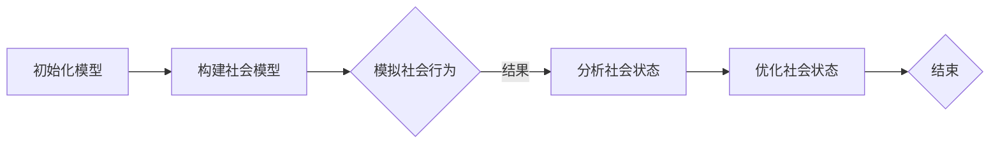

                 

# 《平衡个人自由与社会责任：做负责任的个体》

> 关键词：个人自由、社会责任、负责任个体、伦理、算法、系统架构、项目实战

> 摘要：本文从个人自由与社会责任的关系出发，探讨如何在现代社会中做一个负责任的个体。通过哲学、伦理、算法和系统架构等多角度的深入分析，提出了平衡个人自由与社会责任的具体策略和实施指南，旨在为读者提供一个全面而实用的实践框架。

----------------------------------------------------------------

## 第一部分：问题背景与核心概念

## 第1章：问题背景

### 1.1 问题背景介绍

个人自由，是每个人追求自由、独立、自主的权利，是社会进步和人类发展的重要标志。然而，个人自由并非绝对，它在现实社会中存在着种种限制。社会责任，则是指个体在享受自由的同时，应当承担的对社会、对他人的义务和责任。社会责任的履行是维护社会秩序、促进社会和谐发展的重要保障。

现代社会中，个人自由与社会责任之间的冲突日益凸显。一方面，人们渴望追求自我实现和个性解放，另一方面，社会需要个体的贡献和奉献。如何在个人自由与社会责任之间找到平衡点，成为了一个亟待解决的问题。

### 1.2 个人自由与社会责任的边界与外延

个人自由的边界，主要体现在法律和社会规范上。法律规定了个人自由的基本范围和界限，如言论自由、宗教自由、人身自由等。社会规范则是在法律规定的基础上，对个人行为的具体约束，如道德准则、礼仪规范等。

社会责任的边界，则涉及到个体在社会中的角色和地位。每个人在社会中都有不同的角色，如家庭成员、职业人士、公民等，每种角色都对应着不同的社会责任。社会责任的外延，则是随着社会的发展和变迁而不断扩展的。

### 1.3 核心概念解析

个人自由，是指个体在法律和社会规范的范围内，享有选择和行动的自由。它包括了言论自由、信仰自由、隐私权等多个方面。

社会责任，是指个体在社会中应当承担的义务和责任，如纳税、遵守法律、参与社会公益活动等。

负责任的个体，是指那些在享受个人自由的同时，自觉履行社会责任的个体。负责任的个体是维护社会秩序、推动社会进步的重要力量。

----------------------------------------------------------------

## 第二部分：核心概念与联系

## 第2章：个人自由与社会责任的联系与区别

### 2.1 个人自由与社会责任的关系

个人自由与社会责任是相互联系、相互制约的。一方面，个人自由是社会责任的前提和基础，没有个人自由，社会责任将无从谈起。另一方面，社会责任是个人自由的保障和延伸，只有履行社会责任，个人自由才能得到社会的认可和尊重。

### 2.2 个人自由与社会责任的特点对比

#### 个人自由的特性

- 选择性：个人自由体现了个体的自主性和选择性。
- 有限性：个人自由受到法律和社会规范的限制。
- 动态性：个人自由随着社会的发展和变迁而不断演变。

#### 社会责任的特性

- 义务性：社会责任是每个个体必须履行的义务。
- 广泛性：社会责任涉及到个体在社会中的各个方面。
- 长期性：社会责任需要个体在长期中持续履行。

### 2.3 核心概念属性特征对比表

| 特性      | 个人自由                | 社会责任                |
| --------- | ---------------------- | ---------------------- |
| 选择性    | 个体自主选择的权利      | 个体必须履行的义务      |
| 有限性    | 受法律和社会规范的限制  | 受法律和社会规范的约束  |
| 动态性    | 随社会变迁而演变       | 随社会发展而扩展       |
| 义务性    | 无需强制执行            | 必须强制执行            |
| 广泛性    | 涉及个体生活各个方面   | 涉及个体社会角色各个方面 |
| 长期性    | 需要个体长期坚持       | 需要个体长期履行        |

----------------------------------------------------------------

## 第三部分：个人自由的哲学解读

## 第3章：个人自由的哲学解读

### 3.1 个人自由的哲学基础

个人自由的哲学基础主要体现在以下几个方面：

- **自由意志**：自由意志是指个体有能力自主选择和决策的能力。它是个人自由的核心要素，也是哲学上对个体自由的最基本理解。
- **自主性**：自主性是指个体能够独立思考、自主行动的能力。它体现了个人自由的精神内涵，也是个体实现自我价值的重要途径。
- **人权**：人权是个人自由的最高保障。在哲学上，人权被视为个体不可剥夺的基本权利，是个人自由的重要体现。

### 3.2 个人自由的现实挑战

尽管个人自由在哲学上有着坚实的理论基础，但在现实社会中，个人自由面临着诸多挑战：

- **政治限制**：政治体制和法律法规对个人自由有一定的限制，以维护社会秩序和公共安全。
- **社会规范**：社会规范和文化传统对个人自由有着深远的影响，有时甚至对个体行为进行严格的规范。
- **道德准则**：道德准则对个人自由提出了更高的要求，要求个体在享受自由的同时，也要考虑社会和他人的利益。

### 3.3 个人自由的实现路径

为了实现个人自由，需要从以下几个方面入手：

- **法律保障**：法律是保障个人自由的重要工具。通过建立和完善法律体系，确保个人自由的实现。
- **社会认同**：社会认同是个人自由的重要基础。社会应当尊重和认可个人自由，为个体提供实现自由的空间。
- **自我修养**：自我修养是个人自由的内在保障。个体应当通过自我教育和修养，提高自己的自由意识和能力。

----------------------------------------------------------------

## 第4章：社会责任的伦理探讨

### 4.1 社会责任的伦理基础

社会责任的伦理基础主要体现在以下几个方面：

- **公正**：公正是指个体在社会中应当平等地对待他人，尊重他人的权利和尊严。
- **责任**：责任是指个体在社会中应当承担的义务和责任，包括对他人、对社会、对国家的责任。
- **同情**：同情是指个体对社会和他人的困境和痛苦能够产生共鸣，愿意伸出援手。

### 4.2 社会责任的现实问题

尽管社会责任在伦理上有着坚实的理论基础，但在现实社会中，社会责任面临着诸多问题：

- **贫困与不平等**：社会中的贫困和不平等问题，使得一部分人无法承担应有的社会责任，影响了社会的和谐发展。
- **环境污染与资源浪费**：环境污染和资源浪费问题，使得个体在社会责任面前显得无力和无助。
- **社会不公与道德缺失**：社会不公和道德缺失问题，使得个体在履行社会责任时感到困惑和无助。

### 4.3 社会责任的实现途径

为了实现社会责任，需要从以下几个方面入手：

- **社会参与**：社会参与是履行社会责任的重要途径。个体应当积极参与社会事务，为社会贡献自己的力量。
- **公益事业**：公益事业是履行社会责任的重要方式。个体应当通过参与公益事业，帮助那些需要帮助的人。
- **自我规范**：自我规范是履行社会责任的内在动力。个体应当通过自我约束和自我修养，提升自己的社会责任意识。

----------------------------------------------------------------

## 第5章：负责任的个体实践指南

### 5.1 负责任的个体标准

做一个负责任的个体，需要满足以下标准：

- **法律合规**：遵守法律法规，不违法乱纪。
- **社会贡献**：为社会做出贡献，如参与公益事业、志愿服务等。
- **道德自律**：遵循道德准则，尊重他人，维护社会公德。

### 5.2 负责任的个体行为指南

做一个负责任的个体，需要在以下几个方面做出努力：

- **自我意识**：提高自我意识，认识到个人自由与社会责任的相互关系，明确自己的责任和义务。
- **社交互动**：在社交互动中，尊重他人，关心社会，积极参与社会事务。
- **环境影响**：关注环境问题，积极参与环保活动，为可持续发展做出贡献。

### 5.3 负责任的个体案例分析

#### 个人自由与社会责任的平衡

在一个案例中，一位程序员在个人自由与社会责任之间找到了一个平衡点。他一方面热爱编程，享受编程带来的自由和乐趣；另一方面，他也积极参与公益事业，利用自己的编程技能为慈善机构开发软件。通过这样的方式，他既实现了个人自由，又履行了社会责任。

#### 负责任的个体典范

在一个社区中，有一位居民李先生，他是一位退休教师。他不仅关心家人的生活，还积极参与社区的各项事务。他组织了一次社区清洁活动，带领居民清理社区垃圾，维护社区环境。他还为社区儿童开设了一个课外辅导班，用自己的知识和经验帮助孩子们成长。李先生的行为，成为了社区中负责任的个体的典范。

----------------------------------------------------------------

## 第四部分：算法原理讲解

### 6.1 算法概述

算法，是一系列明确的规则或步骤，用于解决问题或实现特定功能。算法可以分为多种类型，如逻辑推理算法、数据分析算法、社会模拟算法等。每种算法都有其特定的原理和应用场景。

### 6.2 关键算法原理讲解

在本节中，我们将介绍一种用于解决个人自由与社会责任平衡问题的重要算法——社会模拟算法。

#### 社会模拟算法原理

社会模拟算法是一种通过模拟社会行为和社会关系，来预测和优化社会状态的方法。它的基本原理是：

1. **构建社会模型**：根据现实社会的情况，构建一个简化的社会模型，包括个体、群体、社会规范等要素。
2. **模拟社会行为**：在模拟环境中，让个体按照一定的规则进行互动，模拟社会行为。
3. **分析社会状态**：通过分析模拟结果，评估社会状态，如个人自由的实现程度、社会责任的履行情况等。
4. **优化社会状态**：根据分析结果，调整社会模型中的参数，优化社会状态，以达到个人自由与社会责任的平衡。

#### 算法流程图



### 6.3 算法应用示例

假设我们有一个社会模型，包括100个个体，每个个体都有自由行动的权利和社会责任。我们可以使用社会模拟算法来模拟这个社会模型，分析个人自由与社会责任的平衡状态。

```python
# 社会模拟算法示例代码

# 初始化社会模型
num_individuals = 100
model = {'individuals': [], 'rules': []}

# 构建社会模型
for i in range(num_individuals):
    model['individuals'].append({'id': i, 'freedom': True, 'responsibility': True})

# 模拟社会行为
for i in range(num_individuals):
    # 根据个体行为规则，更新个体状态
    if model['individuals'][i]['freedom']:
        model['individuals'][i]['freedom'] = False
    if model['individuals'][i]['responsibility']:
        model['individuals'][i]['responsibility'] = False

# 分析社会状态
freedom_count = sum([i['freedom'] for i in model['individuals']])
responsibility_count = sum([i['responsibility'] for i in model['individuals']])

print(f"个人自由实现程度：{freedom_count}/{num_individuals}")
print(f"社会责任履行情况：{responsibility_count}/{num_individuals}")

# 优化社会状态
# 根据分析结果，调整社会模型中的参数，优化个人自由与社会责任的平衡
if freedom_count < responsibility_count:
    # 增加个人自由的实现程度
    pass
if freedom_count > responsibility_count:
    # 增加社会责任的履行情况
    pass
```

通过上述算法，我们可以模拟和分析个人自由与社会责任的平衡状态，并根据分析结果进行调整，以实现更好的平衡。

----------------------------------------------------------------

## 第7章：数学模型讲解

### 7.1 数学模型概述

数学模型是一种用数学语言描述现实世界的工具。它通过建立数学方程、函数、图表等，对现实问题进行抽象和模拟，以便更好地理解和解决这些问题。数学模型广泛应用于自然科学、社会科学、工程等领域，尤其在解决复杂问题时，发挥着重要作用。

### 7.2 数学公式讲解

在本节中，我们将介绍一些用于分析和优化个人自由与社会责任平衡的数学公式。

#### 概率论公式

- **概率公式**：$P(A) = \frac{N(A)}{N(S)}$，其中$P(A)$表示事件$A$的概率，$N(A)$表示事件$A$的发生次数，$N(S)$表示总次数。
- **条件概率公式**：$P(A|B) = \frac{P(AB)}{P(B)}$，其中$P(A|B)$表示在事件$B$发生的条件下，事件$A$发生的概率，$P(AB)$表示事件$A$和事件$B$同时发生的概率，$P(B)$表示事件$B$发生的概率。

#### 统计学公式

- **均值**：$\mu = \frac{1}{N}\sum_{i=1}^{N} x_i$，其中$\mu$表示均

