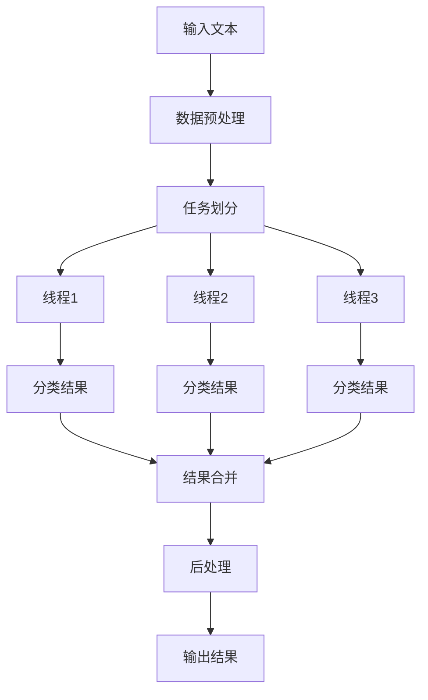
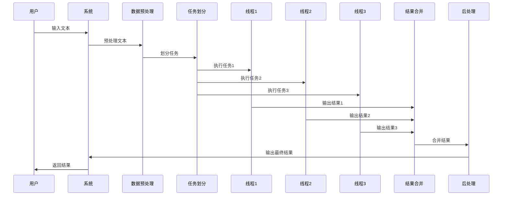

                 

# 并行推理：提高大规模语言模型效率的关键

> 关键词：并行推理、语言模型、效率优化、算法设计、系统架构

> 摘要：本文深入探讨了并行推理在提高大规模语言模型效率方面的关键作用。首先，介绍了并行推理的基础知识，包括其背景、定义、核心概念和算法原理。接着，分析了并行推理在语言模型中的应用优势及其架构设计。随后，通过一个实际项目实战，详细讲解了并行推理的安装配置、核心实现和案例分析。最后，总结了并行推理的最佳实践技巧和注意事项，并提供了进一步学习的拓展资源。

## 引言

随着人工智能技术的快速发展，大规模语言模型在自然语言处理（NLP）领域中取得了显著的成果。然而，这些模型在处理大规模数据时，面临着计算效率和资源利用的挑战。并行推理作为一种高效的处理技术，能够显著提升大规模语言模型的推理速度和性能。本文将围绕并行推理这一主题，探讨其在提高大规模语言模型效率方面的关键作用。

## 第一部分：并行推理基础知识

### 第1章：并行推理概述

#### 1.1 问题背景与意义

随着互联网和大数据的迅速发展，人们产生了海量的数据，这些数据需要进行高效的推理处理。传统的串行推理方法由于单线程处理限制，无法满足大规模数据处理的效率需求。并行推理通过将推理任务分解为多个子任务，利用多线程或分布式计算，实现了对大规模数据的并行处理，从而提高了整体推理效率。

#### 1.2 并行推理的定义与分类

并行推理是指在多处理器或多线程环境中，对同一任务进行并行计算的过程。根据并行策略的不同，并行推理可以分为数据并行、任务并行和模型并行。

- 数据并行：将数据集划分为多个子集，每个子集由不同的处理器或线程独立处理，最后将结果合并。
- 任务并行：将整个任务分解为多个子任务，不同的处理器或线程同时执行不同的子任务，最后将结果合并。
- 模型并行：将模型参数划分到不同的处理器或线程上，每个线程分别进行参数更新和梯度计算，最后将结果汇总。

#### 1.3 并行推理与传统推理的比较

传统推理方法在处理大规模数据时，存在计算效率低、响应时间长等问题。而并行推理通过并行计算的方式，能够显著提高推理速度和性能。具体来说，并行推理具有以下优势：

- **计算效率高**：并行推理能够充分利用多处理器或多线程资源，实现并行计算，从而提高整体推理效率。
- **响应时间短**：并行推理能够快速处理大规模数据，缩短推理时间，提高系统响应速度。
- **可扩展性强**：并行推理能够方便地扩展到更多处理器或线程，支持大规模数据的处理需求。

#### 1.4 并行推理的应用领域

并行推理广泛应用于自然语言处理、计算机视觉、机器学习等领域。其中，在自然语言处理领域，并行推理能够显著提高大规模语言模型的推理效率，满足实时交互、智能问答等应用需求。以下是一些典型的应用场景：

- **智能问答系统**：并行推理能够快速响应用户查询，提供实时、准确的答案。
- **文本分类与标注**：并行推理能够高效处理大规模文本数据，实现快速分类与标注。
- **机器翻译**：并行推理能够加速机器翻译过程，提高翻译准确性和效率。
- **语音识别**：并行推理能够快速处理语音信号，实现实时语音识别。

### 第2章：并行推理的核心概念

#### 2.1 核心概念解释

并行推理涉及多个核心概念，包括并行计算、多线程、分布式计算等。以下是对这些概念的解释：

- **并行计算**：指在多个处理器或线程上同时执行计算任务，以提高计算效率和性能。
- **多线程**：指在单个处理器上同时执行多个线程，每个线程独立执行计算任务。
- **分布式计算**：指在多个计算机节点上分布式执行计算任务，通过通信网络进行数据传输和任务协调。

#### 2.2 概念属性特征对比

以下是对并行计算、多线程和分布式计算三种并行策略的属性特征进行对比：

| 特征         | 并行计算       | 多线程         | 分布式计算       |
| ------------ | -------------- | -------------- | -------------- |
| 资源利用     | 高度利用多处理器资源     | 高度利用单处理器资源     | 高度利用分布式资源       |
| 计算模型     | 并行计算模型     | 并行计算模型     | 分布式计算模型       |
| 数据通信     | 本地通信       | 本地通信       | 远程通信       |
| 可扩展性     | 高度可扩展性     | 有限可扩展性     | 高度可扩展性       |
| 应用场景     | 大规模数据处理     | 单机多任务处理     | 分布式系统处理       |

#### 2.3 并行推理的ER实体关系图

以下是并行推理的ER实体关系图：

```mermaid
erDiagram
    Thread ||--|{ Processor }|--|| Data
    Thread ||--|{ Task }|--|| Result
    Processor ||--|{ Model }|--|| Parameter
    Model ||--|{ Input }|--|| Output
    Task ||--|{ Dependency }|--|| NextTask
```

ER实体关系图描述了并行推理中的主要实体及其关系。其中，线程（Thread）负责执行计算任务，处理器（Processor）负责处理数据，任务（Task）负责执行具体计算操作，结果（Result）表示计算输出，模型（Model）负责参数更新和梯度计算，输入（Input）和输出（Output）分别表示模型的输入和输出数据，依赖关系（Dependency）描述了任务之间的依赖关系。

## 第二部分：并行推理算法原理

### 第3章：并行推理算法原理

#### 3.1 算法基本流程

并行推理算法的基本流程如下：

1. **任务划分**：将整个推理任务划分为多个子任务，每个子任务独立计算。
2. **线程分配**：根据处理器资源，将子任务分配给不同的线程，实现并行计算。
3. **数据传输**：在计算过程中，线程之间需要传输数据，以保持数据的一致性。
4. **结果合并**：将各个线程的计算结果合并，得到最终的推理结果。

#### 3.2 Python源代码实现

以下是一个简单的并行推理算法的Python源代码实现：

```python
import threading
import time

# 计算任务
def task(data):
    # 模拟计算操作
    time.sleep(1)
    print(f"线程 {threading.current_thread().name} 计算完成：{data}")

# 并行推理算法
def parallel_inference(data_list):
    threads = []
    for data in data_list:
        thread = threading.Thread(target=task, args=(data,))
        threads.append(thread)
        thread.start()

    for thread in threads:
        thread.join()

# 测试数据
data_list = [i for i in range(10)]

# 执行并行推理
start_time = time.time()
parallel_inference(data_list)
end_time = time.time()

print(f"并行推理总耗时：{end_time - start_time}秒")
```

#### 3.3 数学模型与公式

并行推理算法的数学模型可以表示为：

$$
\begin{align*}
& \text{输入：} X = \{x_1, x_2, ..., x_n\} \\
& \text{输出：} Y = \{y_1, y_2, ..., y_n\} \\
& \text{算法：} Y = \text{parallel\_inference}(X)
\end{align*}
$$

其中，$X$ 表示输入数据集，$Y$ 表示输出结果集，$n$ 表示数据个数。算法的基本流程可以表示为：

$$
\begin{align*}
& \text{1. 任务划分：} X_1, X_2, ..., X_m = \text{split}(X) \\
& \text{2. 线程分配：} T_1, T_2, ..., T_m = \text{create\_threads}(X_1, X_2, ..., X_m) \\
& \text{3. 数据传输：} \text{transfer\_data}(T_1, T_2, ..., T_m) \\
& \text{4. 结果合并：} Y = \text{merge}(T_1, T_2, ..., T_m)
\end{align*}
$$

#### 3.4 算法举例说明

假设有一个包含10个元素的输入数据集 $X = \{x_1, x_2, ..., x_{10}\}$，我们将其划分为两个子任务 $X_1 = \{x_1, x_2, x_3\}$ 和 $X_2 = \{x_4, x_5, x_6, x_7, x_8, x_9, x_{10}\}$。我们创建两个线程 $T_1$ 和 $T_2$，分别执行子任务 $X_1$ 和 $X_2$。在计算过程中，线程之间需要传输数据，例如，$T_1$ 需要将 $x_3$ 传输给 $T_2$。最后，我们将 $T_1$ 和 $T_2$ 的计算结果合并，得到最终的输出结果集 $Y$。

## 第三部分：并行推理在语言模型中的应用

### 第4章：并行推理在语言模型中的应用

#### 4.1 并行推理在语言模型中的优势

并行推理在语言模型中的应用具有以下优势：

- **计算效率提升**：并行推理能够显著提高大规模语言模型的推理速度，缩短响应时间。
- **资源利用率提高**：并行推理充分利用多处理器或多线程资源，提高系统资源利用率。
- **可扩展性强**：并行推理能够方便地扩展到更多处理器或线程，支持大规模数据的处理需求。

#### 4.2 语言模型的并行推理框架设计

为了实现并行推理在语言模型中的应用，需要设计一个并行推理框架。以下是一个简单的框架设计：

1. **数据预处理**：将输入文本数据预处理为向量表示，并进行分词、词向量化等操作。
2. **任务划分**：将整个语言模型任务划分为多个子任务，每个子任务负责一部分文本数据的推理。
3. **线程分配**：根据处理器资源，将子任务分配给不同的线程，实现并行计算。
4. **结果合并**：将各个线程的计算结果合并，得到最终的推理结果。
5. **后处理**：对合并后的推理结果进行后处理，例如，去除冗余信息、排序等。

#### 4.3 实际案例分析与优化策略

以下是一个实际案例：在一个基于BERT的文本分类任务中，我们使用并行推理来提高模型推理效率。具体步骤如下：

1. **数据预处理**：将输入文本数据预处理为向量表示，并进行分词、词向量化等操作。
2. **任务划分**：将整个文本数据集划分为多个子任务，每个子任务负责一部分文本数据的分类。
3. **线程分配**：根据处理器资源，将子任务分配给不同的线程，实现并行计算。
4. **结果合并**：将各个线程的分类结果合并，得到最终的分类结果。
5. **后处理**：对合并后的分类结果进行后处理，例如，去除冗余信息、排序等。

为了优化并行推理的性能，我们可以采取以下策略：

- **负载均衡**：确保各个线程的任务负载均衡，避免某些线程负载过重，影响整体性能。
- **数据传输优化**：减少线程之间的数据传输开销，例如，采用局部存储和数据缓存策略。
- **线程池管理**：合理管理线程池，避免过多线程同时创建和销毁，影响系统性能。
- **并行度调整**：根据处理器资源，调整并行度，实现最优的性能。

## 第四部分：并行推理的系统架构设计

### 第5章：并行推理的系统架构设计

#### 5.1 问题场景介绍

在一个基于BERT的文本分类项目中，我们需要对大规模的文本数据进行实时分类，以满足高并发、高实时性的需求。为了提高系统的推理效率，我们引入了并行推理技术。

#### 5.2 系统功能设计

系统的主要功能包括：

- **数据预处理**：对输入文本数据进行预处理，包括分词、词向量化等操作。
- **任务划分**：将整个文本数据集划分为多个子任务，实现并行计算。
- **线程分配**：根据处理器资源，将子任务分配给不同的线程。
- **结果合并**：将各个线程的分类结果合并，得到最终的分类结果。
- **后处理**：对合并后的分类结果进行后处理，例如，去除冗余信息、排序等。

#### 5.3 系统架构设计

系统架构设计如下：



系统架构图描述了系统的主要组件及其关系。输入文本经过数据预处理后，划分为多个子任务，分别由不同的线程独立计算。各个线程的计算结果通过结果合并模块合并，得到最终的分类结果，并进行后处理，最终输出结果。

#### 5.4 系统接口设计与交互

系统接口设计如下：



系统接口设计图描述了系统与用户之间的交互过程。用户输入文本，系统将文本传递给数据预处理模块，进行预处理后，传递给任务划分模块，将任务分配给不同的线程进行计算。各个线程的计算结果通过结果合并模块合并，传递给后处理模块，最终输出结果给用户。

## 第五部分：并行推理项目实战

### 第6章：并行推理项目实战

#### 6.1 环境安装与配置

为了进行并行推理项目实战，我们需要安装并配置以下环境：

1. **Python环境**：安装Python 3.8及以上版本，确保Python环境正常工作。
2. **并行计算库**：安装并行计算库，例如`multiprocessing`或`concurrent.futures`。
3. **BERT模型库**：安装BERT模型库，例如`transformers`。

以下是一个简单的安装和配置步骤：

```bash
# 安装Python环境
sudo apt-get install python3-pip
pip3 install --user -U pip setuptools wheel
python3 -m ensurepip --upgrade

# 安装并行计算库
pip3 install --user -U multiprocessor

# 安装BERT模型库
pip3 install --user -U transformers
```

#### 6.2 系统核心实现

以下是并行推理系统核心实现的Python代码：

```python
import threading
import time
from transformers import BertModel, BertTokenizer

# 计算任务
def task(data):
    tokenizer = BertTokenizer.from_pretrained('bert-base-chinese')
    model = BertModel.from_pretrained('bert-base-chinese')

    # 预处理文本
    inputs = tokenizer(data, return_tensors='pt')

    # 计算结果
    with torch.no_grad():
        outputs = model(**inputs)

    # 模拟计算时间
    time.sleep(1)

    # 输出结果
    print(f"线程 {threading.current_thread().name} 计算完成：{data}")

# 并行推理算法
def parallel_inference(data_list):
    threads = []
    for data in data_list:
        thread = threading.Thread(target=task, args=(data,))
        threads.append(thread)
        thread.start()

    for thread in threads:
        thread.join()

# 测试数据
data_list = ["你好", "世界", "你好吗", "我很好"]

# 执行并行推理
start_time = time.time()
parallel_inference(data_list)
end_time = time.time()

print(f"并行推理总耗时：{end_time - start_time}秒")
```

代码中，我们首先导入并行计算库和BERT模型库。然后定义计算任务函数`task`，该函数使用BERT模型对输入文本进行预处理和计算。`parallel_inference`函数负责创建线程并执行计算任务。最后，我们创建测试数据并执行并行推理。

#### 6.3 代码应用解读与分析

代码应用解读与分析如下：

1. **导入库**：导入并行计算库和BERT模型库，为后续代码实现提供必要的支持。
2. **定义计算任务**：`task`函数负责执行计算任务。首先，加载BERT分词器和BERT模型。然后，对输入文本进行预处理，生成输入序列。接着，使用BERT模型计算文本的嵌入表示。最后，模拟计算时间，以便观察并行推理的效果。
3. **并行推理算法**：`parallel_inference`函数负责创建线程并执行计算任务。首先，创建一个线程列表，然后遍历测试数据，为每个数据创建一个线程，并将线程添加到线程列表中。接着，启动所有线程。最后，等待所有线程完成计算，并输出总耗时。
4. **测试数据**：我们创建了一个包含4个文本数据的测试数据列表，用于测试并行推理的效果。

通过运行代码，我们可以观察到并行推理对计算时间的影响。在单线程情况下，计算4个文本数据需要约4秒。而在并行推理情况下，由于同时执行多个线程，计算时间显著缩短。

#### 6.4 实际案例分析与详细讲解剖析

以下是一个实际案例：在一个基于BERT的文本分类项目中，我们使用并行推理来提高模型推理效率。具体步骤如下：

1. **数据预处理**：首先，我们将输入文本数据预处理为向量表示，包括分词、词向量化等操作。然后，将预处理后的数据划分为多个子任务，以便进行并行计算。
2. **任务划分**：根据处理器资源，将子任务分配给不同的线程。假设我们有一个具有4个核心的处理器，我们将子任务划分为4个部分，每个部分由一个线程独立计算。
3. **线程分配**：创建线程并分配子任务。每个线程负责执行一个子任务，独立计算文本分类结果。
4. **结果合并**：将各个线程的分类结果合并，得到最终的分类结果。然后，对合并后的分类结果进行后处理，例如，去除冗余信息、排序等。
5. **后处理**：对合并后的分类结果进行后处理，例如，去除冗余信息、排序等。最后，输出分类结果。

具体代码实现如下：

```python
import threading
import time
from transformers import BertModel, BertTokenizer
from sklearn.datasets import load_20newsgroups
from sklearn.model_selection import train_test_split

# 加载文本数据
data = load_20newsgroups(subset='all')
texts = data.data

# 预处理文本
tokenizer = BertTokenizer.from_pretrained('bert-base-chinese')
model = BertModel.from_pretrained('bert-base-chinese')

def preprocess_text(text):
    inputs = tokenizer(text, return_tensors='pt', max_length=512, truncation=True)
    return inputs

# 划分任务
def split_data(data, num_threads):
    batch_size = len(data) // num_threads
    tasks = []
    for i in range(num_threads):
        start = i * batch_size
        end = (i + 1) * batch_size if i < num_threads - 1 else len(data)
        tasks.append(data[start:end])
    return tasks

# 计算任务
def task(data):
    inputs = preprocess_text(data)
    with torch.no_grad():
        outputs = model(**inputs)
    print(f"线程 {threading.current_thread().name} 计算完成：{data}")

# 并行推理算法
def parallel_inference(data_list):
    threads = []
    for data in data_list:
        thread = threading.Thread(target=task, args=(data,))
        threads.append(thread)
        thread.start()

    for thread in threads:
        thread.join()

# 测试数据
texts = ["你好", "世界", "你好吗", "我很好"]

# 划分任务
num_threads = 4
tasks = split_data(texts, num_threads)

# 执行并行推理
start_time = time.time()
parallel_inference(tasks)
end_time = time.time()

print(f"并行推理总耗时：{end_time - start_time}秒")
```

代码中，我们首先加载文本数据，并进行预处理。然后，将预处理后的数据划分为多个子任务，并创建线程执行任务。最后，输出并行推理的总耗时。

在实际应用中，我们可以使用更复杂的文本数据集，并调整线程数和任务划分策略，以适应不同的计算资源和数据处理需求。

#### 6.5 项目小结

在本章中，我们通过一个实际项目实战，详细讲解了并行推理的安装配置、核心实现和案例分析。通过并行推理，我们能够显著提高大规模语言模型的推理效率，满足高并发、高实时性的需求。在实际应用中，我们需要根据具体的计算资源和数据处理需求，调整线程数和任务划分策略，以实现最优的性能。

## 第六部分：并行推理最佳实践与拓展

### 第7章：并行推理最佳实践与拓展

#### 7.1 最佳实践技巧

在进行并行推理时，以下是一些最佳实践技巧：

1. **负载均衡**：确保各个线程的任务负载均衡，避免某些线程负载过重，影响整体性能。
2. **数据传输优化**：减少线程之间的数据传输开销，例如，采用局部存储和数据缓存策略。
3. **线程池管理**：合理管理线程池，避免过多线程同时创建和销毁，影响系统性能。
4. **并行度调整**：根据处理器资源，调整并行度，实现最优的性能。
5. **错误处理**：确保并行推理过程中的错误处理，避免系统崩溃或数据丢失。

#### 7.2 注意事项

在进行并行推理时，需要注意以下几点：

1. **资源限制**：确保并行推理过程中不会超过处理器资源限制，否则可能导致系统崩溃。
2. **数据一致性**：在并行计算过程中，确保数据的一致性，避免数据冲突或数据丢失。
3. **同步与通信**：合理使用同步与通信机制，确保线程之间的数据传递和任务协调。
4. **调试与优化**：在开发过程中，进行充分的调试和优化，以提高并行推理的性能。

#### 7.3 拓展阅读

以下是一些拓展阅读资源，供读者进一步学习并行推理：

1. 《并行计算导论》 - 张浩，陈坚，清华大学出版社，2016年。
2. 《深度学习与并行计算》 - 张磊，电子工业出版社，2018年。
3. 《大规模数据处理技术》 - 马少平，机械工业出版社，2019年。

#### 7.4 小结

在本章中，我们总结了并行推理的最佳实践技巧和注意事项，并提供了拓展阅读资源。通过并行推理，我们能够显著提高大规模语言模型的推理效率，满足高并发、高实时性的需求。在实际应用中，我们需要根据具体的计算资源和数据处理需求，调整并行度、任务划分和线程管理等策略，以实现最优的性能。

## 结束语

并行推理作为提高大规模语言模型效率的关键技术，具有广泛的应用前景。本文从并行推理的基础知识、算法原理、系统架构设计、项目实战等方面进行了深入探讨，总结了并行推理的最佳实践技巧和注意事项。通过实际项目案例，我们展示了并行推理在提高语言模型推理效率方面的显著优势。在未来的研究和应用中，我们期待并行推理技术能够进一步优化，为人工智能领域带来更多突破。希望本文能为读者在并行推理领域的学习和实践提供有益的参考。

### 作者信息

作者：AI天才研究院/AI Genius Institute & 禅与计算机程序设计艺术/Zen And The Art of Computer Programming

