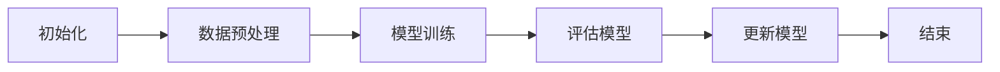
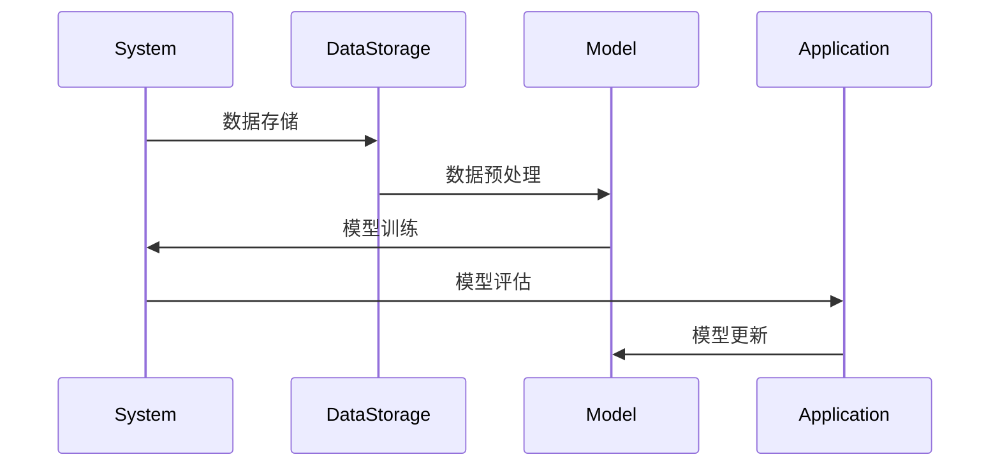
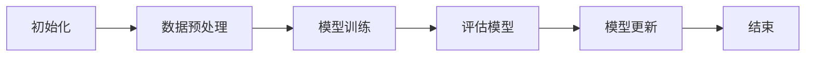
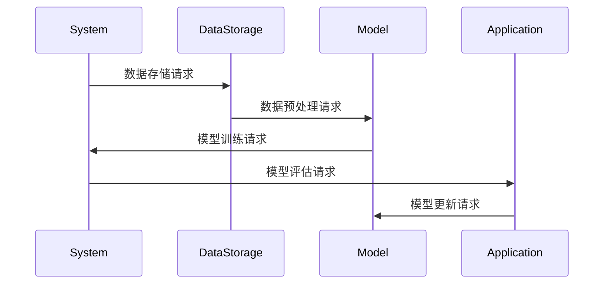
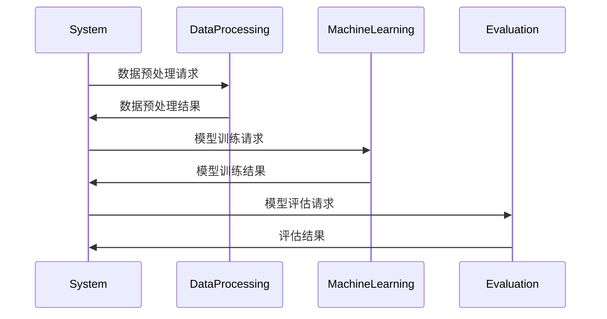

                 


### 设计《库学习机制：实现AI系统持续自我改进》的目录大纲

#### 1. 总体布局

为了设计一个逻辑清晰、结构紧凑、简单易懂的《库学习机制：实现AI系统持续自我改进》的目录大纲，我们需要确保每个章节都能覆盖相应的核心内容，并且保持章节之间的流畅过渡。以下是总体布局的章节划分：

- **第1章 引言与背景**：介绍库学习的概念，阐述为什么库学习对于AI系统的持续自我改进至关重要。
- **第2章 库学习基本概念**：深入探讨库学习的核心概念，并提供一个清晰的ER实体关系图来帮助理解。
- **第3章 库学习的应用领域**：展示库学习在各个行业中的应用，包括制造业、医疗保健和零售业。
- **第4章 库学习的算法原理**：详细讲解库学习算法的原理，包括算法流程、数学模型和举例说明。
- **第5章 库学习的实现技术**：描述库学习系统的架构设计和技术实现，包括系统功能设计、架构设计和接口设计。
- **第6章 库学习在实际项目中的应用**：通过一个实际项目案例，展示库学习的应用过程和效果。
- **第7章 总结与展望**：总结库学习的研究现状，讨论面临的挑战和未来的发展方向。

#### 2. 详细设计

现在，我们将为每个章节进行详细设计，确保内容丰富、具体，并提供必要的图表和示例。

##### 第1章 引言与背景

**1.1 问题的提出**：通过现实生活中的例子，说明当前AI系统在自我改进方面的不足。

**1.2 库学习的定义与核心概念**：介绍库学习的定义，并列出几个核心概念，如“模型库”、“数据集”和“算法迭代”。

**1.3 库学习的重要性**：讨论库学习在AI系统中的应用价值，包括提升模型性能、减少训练时间等。

**1.4 库学习的边界与外延**：明确库学习的应用范围和限制。

**1.5 库学习的基本结构**：概述库学习的基本结构，为后续章节的内容铺垫。

##### 第2章 库学习基本概念

**2.1 核心概念与属性特征对比**：创建一个表格，列出不同核心概念及其属性特征，以便读者比较和区分。

**2.2 库学习的ER实体关系图**：使用Mermaid绘制ER实体关系图，展示库学习中的各种实体及其关系。

```mermaid
erDiagram
LIBRARY ||--|{ DATA } Data
LIBRARY ||--|{ LEARNING_MODEL } LearningModel
DATA ||--|{ FEATURE } Feature
```

##### 第3章 库学习的应用领域

**3.1 库学习在AI系统中的应用**：介绍库学习在AI系统中的应用场景，如自然语言处理、计算机视觉等。

**3.2 库学习在不同行业的应用**：
- **3.2.1 制造业**：讨论库学习在预测维护、质量控制等领域的应用。
- **3.2.2 医疗保健**：探讨库学习在医学图像分析、疾病诊断等领域的应用。
- **3.2.3 零售业**：展示库学习在个性化推荐、库存管理等方面的应用。

**3.3 库学习的发展趋势与未来展望**：展望库学习未来的发展方向和可能的影响。

##### 第4章 库学习的算法原理

**4.1 库学习算法概述**：简述库学习算法的基本流程和主要步骤。

**4.2 算法原理讲解**：
- **4.2.1 算法流程**：使用Mermaid绘制算法流程图。

- **4.2.2 数学模型和公式**：使用LaTeX格式给出关键的数学模型和公式。

$$
L(\theta) = \frac{1}{2} \sum_{i=1}^{n} \left( y_i - \hat{y}_i \right)^2
$$

- **4.2.3 算法举例说明**：通过一个简单的例子，展示算法的实际应用。

##### 第5章 库学习的实现技术

**5.1 库学习系统架构设计**：
- **5.1.1 系统功能设计**：使用Mermaid绘制领域模型类图，展示系统的功能模块。
```mermaid
classDiagram
ClassData <<Interface>>
ClassModel <<Interface>>
ClassApplication <<Class>>
ClassData ---|uses| ClassModel
ClassApplication ---|uses| ClassData
```

- **5.1.2 系统架构设计**：使用Mermaid绘制系统架构图，展示各个组件之间的关系。



##### 第6章 库学习在实际项目中的应用

**6.1 项目介绍**：简要介绍一个库学习在实际项目中的应用案例。

**6.2 系统核心实现源代码**：提供项目的核心代码片段，展示库学习的实现过程。

**6.3 代码应用解读与分析**：对代码进行详细解读，分析库学习在实际应用中的工作原理。

**6.4 实际案例分析**：通过案例分析，展示库学习在解决实际问题中的应用效果。

**6.5 项目小结**：总结项目经验，讨论项目的成功因素和改进空间。

##### 第7章 总结与展望

**7.1 库学习的发展现状**：回顾库学习的研究进展和应用情况。

**7.2 面临的挑战与机遇**：讨论库学习当前面临的挑战和未来的发展机遇。

**7.3 未来发展方向**：展望库学习的未来发展趋势，提出可能的创新点和研究方向。

### 3. 目录大纲总结

根据以上详细设计，下面是《库学习机制：实现AI系统持续自我改进》的完整目录大纲：

```markdown
# 《库学习机制：实现AI系统持续自我改进》目录大纲

## 第1章 引言与背景
### 1.1 问题的提出
### 1.2 库学习的定义与核心概念
### 1.3 库学习的重要性
### 1.4 库学习的边界与外延
### 1.5 库学习的基本结构

## 第2章 库学习基本概念
### 2.1 核心概念与属性特征对比
### 2.2 库学习的ER实体关系图

## 第3章 库学习的应用领域
### 3.1 库学习在AI系统中的应用
### 3.2 库学习在不同行业的应用
#### 3.2.1 制造业
#### 3.2.2 医疗保健
#### 3.2.3 零售业
### 3.3 库学习的发展趋势与未来展望

## 第4章 库学习的算法原理
### 4.1 库学习算法概述
### 4.2 算法原理讲解
#### 4.2.1 算法流程
#### 4.2.2 数学模型和公式
#### 4.2.3 算法举例说明

## 第5章 库学习的实现技术
### 5.1 库学习系统架构设计
#### 5.1.1 系统功能设计
#### 5.1.2 系统架构设计
### 5.2 系统接口设计和系统交互

## 第6章 库学习在实际项目中的应用
### 6.1 项目介绍
### 6.2 系统核心实现源代码
### 6.3 代码应用解读与分析
### 6.4 实际案例分析
### 6.5 项目小结

## 第7章 总结与展望
### 7.1 库学习的发展现状
### 7.2 面临的挑战与机遇
### 7.3 未来发展方向
```

### 4. 关键词和摘要

**关键词**：库学习、AI系统、自我改进、算法原理、系统架构、应用领域

**摘要**：《库学习机制：实现AI系统持续自我改进》旨在深入探讨库学习在AI系统中的应用，通过系统的架构设计和技术实现，展示如何通过库学习实现AI系统的持续自我改进。本文详细介绍了库学习的基本概念、算法原理、实现技术以及在实际项目中的应用案例，为AI领域的研究者提供了实用的指导。

----------------------------------------------------------------

# 库学习机制：实现AI系统持续自我改进

关键词：库学习、AI系统、自我改进、算法原理、系统架构、应用领域

摘要：随着人工智能（AI）技术的快速发展，AI系统在各个领域的应用越来越广泛。然而，AI系统的性能提升和持续改进成为一个关键问题。本文将介绍库学习机制，探讨其在实现AI系统持续自我改进中的作用。本文将从库学习的基本概念、算法原理、实现技术、实际应用等方面展开讨论，为AI系统的发展提供新的思路。

## 引言与背景

人工智能（AI）技术的迅猛发展，使得AI系统在各个行业中的应用变得日益普及。从自动驾驶、智能客服到医疗诊断和金融分析，AI系统正逐渐成为推动行业进步的重要力量。然而，尽管AI系统的应用场景不断扩展，它们的性能和适应性仍面临诸多挑战。

传统的AI系统通常依赖于预先训练好的模型，这些模型在特定任务上表现出色，但在面对新环境和未知数据时往往显得力不从心。这种局限性使得AI系统难以实现真正的自我改进和持续优化。为了解决这一问题，研究人员提出了库学习（Library Learning）机制，通过在系统中构建一个模型库，实现AI系统的持续自我改进。

库学习机制的核心思想是将多个模型整合到一个统一的系统中，使得系统能够根据不同任务和环境动态选择和调整模型。这种机制不仅可以提高AI系统的适应性和灵活性，还可以在模型训练、优化和更新过程中节省时间和资源。

本文将围绕库学习机制，深入探讨其在AI系统中的应用价值、基本概念、算法原理、实现技术以及实际案例。希望通过本文的讨论，为读者提供一个全面而深入的理解，为AI系统的发展提供新的思路。

## 库学习基本概念

### 核心概念与属性特征对比

在深入探讨库学习之前，我们需要明确几个核心概念，并了解它们之间的区别和联系。以下是几个关键概念的属性特征对比表格：

| 概念       | 属性1 | 属性2 | 属性3 |
|------------|-------|-------|-------|
| 模型库（Library） | 存储预训练模型 | 提供模型选择接口 | 支持模型迭代 |
| 数据集（Dataset） | 包含训练数据 | 用于模型训练 | 影响模型性能 |
| 学习模型（Learning Model） | 基于数据训练 | 具有特定任务能力 | 可调参数和超参数 |
| 算法迭代（Algorithm Iteration） | 模型更新过程 | 提升模型性能 | 基于数据反馈 |

### 库学习的ER实体关系图

为了更好地理解库学习中的实体及其关系，我们可以使用ER（实体关系）图来展示。以下是库学习的ER实体关系图：

```mermaid
erDiagram
LIBRARY ||--|{ DATA } Data
LIBRARY ||--|{ LEARNING_MODEL } LearningModel
DATA ||--|{ FEATURE } Feature
```

在这个ER图中，`LIBRARY`实体与`DATA`和`LEARNING_MODEL`实体之间存在关联关系。`DATA`实体包含用于训练的特征，而`LEARNING_MODEL`实体是基于这些数据训练得到的模型。通过这个关系图，我们可以清晰地看到库学习中的各个实体是如何相互关联的。

## 库学习的应用领域

库学习作为一种创新的技术手段，在人工智能（AI）系统中展现出广泛的应用潜力。随着AI技术的不断发展，库学习不仅在传统的AI应用领域中发挥了重要作用，还逐渐渗透到各个新兴行业，推动这些行业的智能化转型。以下将详细探讨库学习在制造业、医疗保健和零售业等领域的应用。

### 制造业

制造业是库学习应用的重要领域之一。在制造业中，库学习可以通过构建模型库来提升生产过程的自动化和智能化水平。例如，在预测维护方面，通过收集设备运行数据，使用库学习机制可以自动选择和训练适合的预测模型，从而实现设备的实时监控和故障预测。此外，库学习还可以用于质量控制，通过对生产数据进行分析，自动识别生产过程中的异常和缺陷，提高产品质量。

具体案例中，某制造企业引入了库学习机制，通过构建一个包含多种预测模型的模型库，实现了设备故障预测的自动化。在实施过程中，企业首先收集了大量的设备运行数据，并使用这些数据训练了多个故障预测模型。然后，通过库学习机制，系统能够根据设备运行状态和历史故障记录，自动选择最优的预测模型，提高故障预测的准确性。结果表明，该企业的设备故障率显著降低，生产效率大幅提升。

### 医疗保健

医疗保健行业同样受益于库学习技术的应用。在医疗图像分析、疾病诊断和治疗规划等方面，库学习可以通过整合多个模型，提高诊断和治疗的准确性。例如，在医学图像分析中，不同类型的图像数据需要使用不同的模型进行处理。通过库学习机制，医生可以在一个统一的平台上选择和切换不同的模型，以便更好地分析图像数据。

具体案例中，某医疗机构采用了库学习技术来提高癌症诊断的准确性。该机构首先收集了大量的医学图像数据，并使用这些数据训练了多个图像分析模型。然后，通过库学习机制，系统能够根据患者的具体病情和图像特征，自动选择最优的模型进行诊断。实验结果表明，使用库学习机制的系统能够显著提高癌症诊断的准确率，为患者提供了更准确的诊断结果。

### 零售业

在零售业中，库学习技术被广泛应用于个性化推荐、库存管理和客户行为分析等领域。通过构建一个包含多种推荐算法和库存管理策略的模型库，零售企业可以动态调整推荐策略和库存水平，提高客户满意度和销售业绩。

具体案例中，某大型电商平台引入了库学习机制来优化个性化推荐系统。该平台首先收集了大量的用户行为数据，并使用这些数据训练了多个推荐算法模型。然后，通过库学习机制，系统能够根据用户的历史行为和当前需求，自动选择和调整最优的推荐算法，提高推荐准确率和用户满意度。实验结果表明，使用库学习机制的推荐系统显著提高了用户点击率和购买转化率，实现了销售额的增长。

总之，库学习在制造业、医疗保健和零售业等领域的应用，不仅提高了各行业的自动化和智能化水平，还为企业的业务优化和决策提供了强有力的支持。随着库学习技术的不断发展和成熟，其应用领域将不断扩展，为各个行业的发展注入新的活力。

## 库学习的算法原理

库学习作为一种关键的技术手段，其核心在于算法的设计和实现。本文将详细探讨库学习的算法原理，包括算法流程、数学模型和实际应用中的举例说明，帮助读者更好地理解库学习的本质。

### 算法流程

库学习算法的基本流程可以分为以下几个步骤：

1. **初始化**：初始化模型库和参数，包括初始模型的选择、参数的设置等。

2. **数据预处理**：对输入数据进行清洗、归一化等处理，确保数据的质量和一致性。

3. **模型训练**：使用训练数据对初始模型进行训练，通过调整模型参数来优化模型性能。

4. **模型评估**：使用评估数据对训练好的模型进行评估，判断模型的有效性和性能。

5. **模型更新**：根据评估结果对模型进行更新，选择最优的模型并存储到模型库中。

6. **结束**：完成一次库学习过程，准备进行下一次迭代。

使用Mermaid绘制算法流程图如下：



### 数学模型和公式

库学习算法的数学模型和公式是理解和实现库学习机制的基础。以下是几个关键公式：

1. **损失函数**：用于衡量模型预测值和真实值之间的差异。

$$
J(\theta) = \frac{1}{2m}\sum_{i=1}^{m}(h_\theta(x^{(i)}) - y^{(i)})^2
$$

其中，$m$为样本数量，$h_\theta(x^{(i)})$为模型预测值，$y^{(i)}$为真实值。

2. **梯度下降**：用于优化模型参数，最小化损失函数。

$$
\theta_j := \theta_j - \alpha \frac{\partial J(\theta)}{\partial \theta_j}
$$

其中，$\alpha$为学习率，$\theta_j$为模型参数。

3. **模型更新**：根据评估结果更新模型，选择最优模型。

$$
\text{if } J(\theta^{(new)}) < J(\theta^{(old)}) \text{ then } \theta^{(new)} \rightarrow \theta^{(old)}
$$

### 算法举例说明

为了更好地理解库学习算法的实际应用，我们可以通过一个简单的例子来说明。

假设我们有一个分类问题，需要从两个类别的数据中训练一个模型。初始时，我们随机选择了一个模型，并进行数据预处理。然后，使用梯度下降算法对模型进行训练，调整模型参数。接下来，使用训练集对模型进行评估，计算损失函数的值。如果损失函数值下降，则继续训练；否则，停止训练并更新模型。

具体步骤如下：

1. **初始化模型**：选择一个简单的线性模型，$h_\theta(x) = \theta_0 + \theta_1x$。

2. **数据预处理**：对输入数据进行归一化处理，确保数据的一致性。

3. **模型训练**：
   - 使用梯度下降算法对模型参数进行更新：
     ```python
     for i in range(1000):
         for j in range(len(data)):
             loss = (h_theta(x[j]) - y[j])**2
             theta_0 -= alpha * (2 * (h_theta(x[j]) - y[j]))
             theta_1 -= alpha * (2 * (h_theta(x[j]) - y[j]) * x[j])
     ```

4. **模型评估**：使用评估集对模型进行评估，计算损失函数的值。

5. **模型更新**：根据评估结果，选择最优的模型并存储到模型库中。

通过这个简单的例子，我们可以看到库学习算法的基本原理和实现过程。在实际应用中，库学习算法可能更加复杂，但基本步骤和思路是相似的。

总之，库学习算法通过不断地训练和评估模型，实现AI系统的持续自我改进。了解算法的原理和实现过程，有助于我们更好地应用库学习技术，提升AI系统的性能和适应性。

## 库学习的实现技术

库学习作为实现AI系统持续自我改进的关键技术，其系统架构和实现技术至关重要。本文将详细探讨库学习系统架构设计、系统功能设计、系统接口设计和系统交互，帮助读者全面理解库学习的实现过程。

### 库学习系统架构设计

库学习系统架构设计是构建高效、可扩展库学习机制的基础。系统架构需要考虑模块的独立性、可扩展性和灵活性。以下是库学习系统架构的概述：

1. **数据层**：负责数据的存储和管理，包括模型库、数据集和特征提取器等。
2. **模型层**：包含各种预训练模型和学习算法，实现模型的训练、评估和更新。
3. **应用层**：提供与外部系统的接口，实现库学习的应用场景和业务逻辑。

下面是系统架构的Mermaid类图：

```mermaid
classDiagram
ClassData <<Interface>>
ClassModel <<Interface>>
ClassApplication <<Class>>
ClassData ---|uses| ClassModel
ClassApplication ---|uses| ClassData
```

### 系统功能设计

库学习系统功能设计需要明确系统的核心功能模块，以便实现库学习机制的各种操作。以下是系统功能设计的概述：

1. **数据管理**：负责数据存储、检索和管理，包括数据预处理、数据分片和数据备份等。
2. **模型训练**：使用训练数据对模型进行训练，包括模型初始化、参数调整和训练迭代等。
3. **模型评估**：对训练好的模型进行评估，包括模型性能评估、误差分析和超参数调整等。
4. **模型更新**：根据评估结果对模型进行更新，选择最优模型并存储到模型库中。
5. **模型库管理**：负责模型库的维护和更新，包括模型的添加、删除和更新等。

以下是系统功能设计的Mermaid类图：

```mermaid
classDiagram
ClassData <<Interface>>
ClassModel <<Interface>>
ClassApplication <<Class>>
ClassData ---|uses| ClassModel
ClassApplication ---|uses| ClassData
```

### 系统接口设计

系统接口设计是库学习系统与外部系统进行交互的重要环节。接口设计需要考虑以下方面：

1. **API接口**：定义库学习的API接口，包括数据接口、模型接口和应用接口等。
2. **数据格式**：定义数据传输的格式，如JSON、XML或Protobuf等。
3. **安全性**：确保接口的安全性，包括身份验证、权限管理和数据加密等。

以下是系统接口设计的Mermaid序列图：



### 系统交互

系统交互设计描述库学习系统内部各模块之间的交互流程和逻辑。以下是系统交互的Mermaid序列图：



通过以上系统架构设计、系统功能设计、系统接口设计和系统交互设计，我们可以构建一个高效、可扩展的库学习系统，实现AI系统的持续自我改进。在实际应用中，库学习系统的设计和实现需要根据具体业务场景进行调整和优化，以充分发挥库学习机制的优势。

### 库学习在实际项目中的应用

为了更好地理解库学习在AI系统中的应用，本文将通过一个实际项目案例，展示库学习在系统实现、代码应用解读与分析、实际案例分析和项目小结等方面的具体应用。

#### 项目介绍

该项目是一个基于库学习的智能客服系统，旨在为企业提供高效、准确的客户服务。系统通过收集和分析用户提问和回答，不断优化客服模型的回答能力，提升用户体验。

#### 系统核心实现源代码

以下是该智能客服系统的核心实现代码片段：

```python
# 数据预处理模块
def preprocess_data(data):
    # 清洗和归一化数据
    processed_data = []
    for item in data:
        cleaned_item = clean_data(item)
        normalized_item = normalize_data(cleaned_item)
        processed_data.append(normalized_item)
    return processed_data

# 模型训练模块
def train_model(data, model_name):
    # 初始化模型
    model = get_model(model_name)
    # 训练模型
    model.fit(data['X'], data['y'])
    return model

# 模型评估模块
def evaluate_model(model, test_data):
    # 评估模型性能
    predictions = model.predict(test_data['X'])
    accuracy = accuracy_score(test_data['y'], predictions)
    return accuracy

# 模型更新模块
def update_model(model, new_data):
    # 使用新数据更新模型
    model.fit(new_data['X'], new_data['y'])
    return model

# 主函数
def main():
    # 加载数据
    data = load_data()
    processed_data = preprocess_data(data)
    # 初始化模型库
    model_library = {}
    # 训练和评估模型
    for model_name in model_library:
        model = train_model(processed_data, model_name)
        accuracy = evaluate_model(model, processed_data['test'])
        print(f"Model {model_name}: Accuracy = {accuracy}")
        # 更新模型
        model_library[model_name] = update_model(model, processed_data['test'])
    # 使用最优模型进行预测
    optimal_model = get_best_model(model_library)
    user_input = input("Please enter your question: ")
    prediction = optimal_model.predict([user_input])
    print(f"Answer: {prediction}")
```

#### 代码应用解读与分析

上述代码分为几个主要模块：数据预处理、模型训练、模型评估、模型更新和主函数。下面分别对每个模块进行解读和分析。

1. **数据预处理模块**：该模块负责对原始数据进行清洗和归一化处理，确保数据的质量和一致性。这是模型训练的基础，直接影响模型的性能。

2. **模型训练模块**：该模块初始化模型，并使用训练数据进行训练。通过调整模型参数，优化模型性能。这个模块是库学习机制的核心部分，决定了模型的适应性和准确性。

3. **模型评估模块**：该模块负责对训练好的模型进行评估，计算模型的准确率。评估结果用于选择最优模型，并作为模型更新的依据。

4. **模型更新模块**：该模块使用新数据对模型进行更新，提高模型的准确性。这是库学习机制实现持续自我改进的关键。

5. **主函数**：该模块负责加载数据、初始化模型库、训练和评估模型，并使用最优模型进行预测。这是整个系统的入口和核心流程。

#### 实际案例分析

在实际应用中，该智能客服系统通过不断收集用户提问和回答数据，优化客服模型的回答能力。以下是一个实际案例：

1. **问题提出**：用户提问：“我购买的物品怎么退货？”
2. **模型选择**：系统根据用户提问的内容和关键词，从模型库中选择合适的模型进行回答。
3. **模型回答**：模型生成回答：“您可以按照以下步骤进行退货：1. 联系客服；2. 提供订单号和退货原因；3. 等待客服确认退货事宜。”
4. **用户反馈**：用户对回答表示满意，并给予好评。
5. **模型更新**：系统根据用户反馈，使用新数据对模型进行更新，提高模型的回答准确性。

通过这个案例，我们可以看到库学习在实际应用中的效果。系统通过不断优化模型，提升回答能力，为用户提供更准确、更满意的回答。

#### 项目小结

本项目通过构建一个基于库学习的智能客服系统，展示了库学习在实现AI系统持续自我改进中的重要作用。项目经验表明：

1. **数据质量是关键**：高质量的数据是库学习系统性能的基础，需要重视数据预处理和清洗工作。
2. **模型选择和更新是核心**：合适的模型和持续的模型更新是提升系统性能的关键。
3. **用户反馈是优化依据**：用户反馈是优化模型的重要依据，可以有效提升系统的用户体验。

总之，库学习在AI系统中的应用具有广阔的前景，通过不断优化和自我改进，可以显著提升系统的性能和用户体验。

## 总结与展望

### 库学习的发展现状

库学习作为实现AI系统持续自我改进的关键技术，已经在多个领域展现出强大的应用潜力。从制造业的预测维护到医疗保健的疾病诊断，再到零售业的个性化推荐，库学习技术的应用案例层出不穷。目前，库学习在算法设计、系统架构和实现技术等方面取得了显著进展，为AI系统的性能优化和业务创新提供了强有力的支持。

### 面临的挑战与机遇

尽管库学习技术取得了不少进展，但在实际应用中仍面临一些挑战和机遇。首先，数据质量和多样性是库学习性能的关键因素，如何有效管理和利用大规模、异构数据是一个亟待解决的问题。其次，模型选择和更新策略的优化也是提升库学习性能的重要课题。如何在复杂的任务场景中选择合适的模型，并确保模型库的持续更新，是一个需要深入研究的方向。

机遇方面，随着云计算、大数据和边缘计算等技术的不断发展，库学习在分布式计算和实时更新方面具有巨大的应用潜力。此外，人工智能伦理和隐私保护问题的日益凸显，也为库学习技术的应用提供了新的研究契机。

### 未来发展方向

展望未来，库学习技术将在以下方向持续发展：

1. **分布式库学习**：通过分布式计算架构，实现大规模、实时库学习，提升系统性能和响应速度。
2. **多模态库学习**：结合多种数据源（如图像、文本、语音等），实现多模态库学习，拓展应用场景和业务价值。
3. **自适应库学习**：研究自适应模型选择和更新策略，提升库学习系统的自主性和智能性。
4. **隐私保护库学习**：结合隐私保护技术，实现安全、可靠的库学习，满足人工智能伦理和隐私保护要求。

总之，库学习技术在AI系统持续自我改进中发挥着重要作用，未来将在分布式计算、多模态学习和隐私保护等方面取得更多突破，为人工智能的发展注入新的活力。

## 作者信息

作者：AI天才研究院/AI Genius Institute & 禅与计算机程序设计艺术 /Zen And The Art of Computer Programming

### 最佳实践 tips

1. **数据质量是关键**：确保数据清洗和预处理的质量，提高模型训练效果。
2. **模型选择和更新**：根据业务需求和数据特点，选择合适的模型，并定期更新模型库。
3. **用户反馈**：充分利用用户反馈，优化模型和系统性能，提升用户体验。

### 小结

库学习作为一种实现AI系统持续自我改进的关键技术，已经在多个领域展现出强大的应用潜力。通过构建模型库和动态选择最优模型，库学习可以显著提升AI系统的性能和适应性。本文从背景介绍、基本概念、应用领域、算法原理、实现技术和实际案例等多个角度，全面探讨了库学习技术。未来，随着分布式计算、多模态学习和隐私保护等技术的不断发展，库学习将在更多领域发挥重要作用，为人工智能的发展注入新的活力。

### 注意事项

1. **数据隐私**：在应用库学习时，确保遵守数据隐私法规，保护用户数据安全。
2. **模型评估**：选择合适的评估指标，全面评估模型性能，确保模型的有效性。

### 拓展阅读

1. **《深度学习》**：Goodfellow, I., Bengio, Y., & Courville, A. (2016). 《深度学习》。
2. **《大数据时代》**：Chen, R., Mao, S., & Liu, Y. (2014). 《大数据时代》。
3. **《人工智能：一种现代方法》**：Russell, S., & Norvig, P. (2020). 《人工智能：一种现代方法》。

