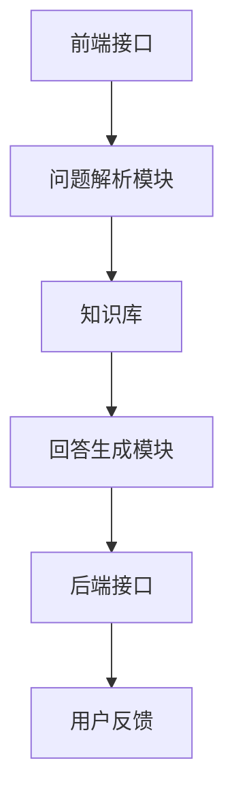

                 

### 第一部分: 开放域问答背景介绍

#### 第1章: 开放域问答问题背景

##### 1.1.1 开放域问答的定义

开放域问答（Open-Domain Question Answering，简称QA）是一种自然语言处理（Natural Language Processing，简称NLP）领域的技术，旨在使计算机能够理解并回答人类以自然语言形式提出的问题。开放域问答系统的核心目标是在没有任何限制的广泛知识领域内，对用户提出的问题提供准确、合理且全面的答案。与特定领域的问答系统（如法律问答、医疗问答等）不同，开放域问答系统无需针对特定领域进行定制，具有更广泛的应用前景。

在开放域问答中，问题可以涵盖各种主题，如科学、历史、文化、技术、娱乐等。这种广泛覆盖性使得开放域问答成为人工智能领域的一大挑战，因为系统需要具备处理跨领域问题的能力，同时还要确保答案的准确性和可理解性。

##### 1.1.2 开放域问答的意义

开放域问答对于提高人机交互的自然性和智能化水平具有重要意义。随着互联网和信息技术的迅猛发展，人们对于获取信息的需求日益增长。开放域问答系统能够理解并回答用户的问题，大大提升了用户获取信息的效率。此外，开放域问答系统还可以为企业提供智能客服、智能推荐等服务，从而提升客户体验和业务效率。

从人工智能发展的角度来看，开放域问答是评估和提升人工智能系统理解自然语言能力的重要途径。通过解决开放域问答问题，人工智能系统能够更好地理解人类的语言表达，从而实现更高级的智能化应用。

##### 1.1.3 开放域问答的发展历程

开放域问答技术的发展经历了多个阶段：

- **早期阶段**：最初，开放域问答系统主要依赖于基于规则的方法和基于模板的系统。这些系统通过预设的规则和模板来处理问题，但它们在面对复杂和模糊的问题时效果不佳。

- **中期阶段**：随着机器学习和深度学习技术的兴起，基于统计和模型的方法开始崛起。向量空间模型、朴素贝叶斯分类器、支持向量机等算法在这一阶段得到了广泛应用。这些方法在一定程度上提升了开放域问答系统的性能，但仍然存在许多挑战。

- **现阶段**：近年来，基于大型预训练语言模型（如GPT、BERT）的开放域问答系统取得了显著进展。预训练语言模型通过在大规模语料库上预训练，能够更好地理解和生成自然语言。这些模型在开放域问答任务中表现出色，使得回答的质量和多样性有了大幅提升。

##### 1.1.4 开放域问答的核心挑战

开放域问答系统在发展过程中面临着诸多挑战：

- **理解性**：计算机需要理解问题的含义、意图和上下文，这要求系统具备强大的语义理解能力。

- **多样性**：系统需要生成多样且合理的回答，以满足用户的不同需求。

- **准确性**：回答需要准确无误，不能出现误导性或错误的信息。

- **实时性**：对于实时问答场景，系统需要能够快速响应，这要求算法的高效性和系统的稳定性。

#### 第2章: 开放域问答系统设计

##### 2.1 核心概念与联系

开放域问答系统涉及多个核心概念，包括问题解析、回答生成等。这些概念相互联系，共同构成了开放域问答系统的核心框架。

- **问题解析**：问题解析是开放域问答系统的第一步，旨在理解用户提出的问题。这包括问题意图识别、实体识别和信息检索等任务。问题意图识别是理解问题的核心目标，实体识别则是识别问题中的关键实体，如人名、地名、组织名等。信息检索则是在大量的知识库或语料库中查找与问题相关的信息。

- **回答生成**：回答生成是开放域问答系统的第二步，旨在生成高质量的回答。这包括回答模板、语言模型和回答优化等任务。回答模板是生成回答的基础，通过预设的模板可以快速构造出符合逻辑的回答。语言模型则是利用深度学习技术来生成自然语言文本。回答优化则是在生成初步回答后，进一步优化回答的多样性和准确性。

##### 2.2 概念属性特征对比表格

| 特征       | 问题解析                   | 回答生成                   |
|------------|----------------------------|----------------------------|
| 目标       | 理解问题含义和意图         | 生成多样且合理的回答       |
| 技术方法   | 自然语言处理、信息检索     | 语言模型、回答优化策略     |
| 挑战       | 理解性、上下文处理         | 多样性、准确性、实时性     |

##### 2.3 开放域问答系统架构

开放域问答系统的架构可以分为以下几个主要部分：

1. **前端接口**：负责接收用户的问题，并将其转换为系统可以处理的格式。

2. **问题解析模块**：包括问题意图识别、实体识别和信息检索等任务，旨在理解用户提出的问题。

3. **知识库**：存储与问题相关的知识信息，包括文本、图片、音频等多种形式。

4. **回答生成模块**：利用语言模型和回答优化策略，生成高质量的回答。

5. **后端接口**：将生成的回答返回给用户，并负责处理用户的反馈和交互。

以下是开放域问答系统的架构图：



#### 第3章: 基于AI推理能力的开放域问答

##### 3.1 AI推理能力概述

AI推理能力是指人工智能系统能够根据已知信息和规则推导出新信息的能力。在开放域问答中，AI推理能力是提升回答质量和准确性的关键。推理能力主要包括以下几个方面：

1. **逻辑推理**：基于逻辑规则进行推理，例如使用推理机来推导结论。

2. **归纳推理**：通过分析大量具体实例，总结出一般规律。

3. **演绎推理**：从一般规律推导出具体实例。

4. **类比推理**：通过比较两个相似情境，推导出结论。

##### 3.2 常见AI推理方法

在开放域问答中，常见的AI推理方法包括以下几种：

1. **基于规则的方法**：通过编写规则来控制问题的解析和回答生成。这种方法在早期阶段的开放域问答系统中占据主导地位，但由于规则难以覆盖所有情况，因此效果有限。

2. **基于机器学习的方法**：使用训练数据来学习问题解析和回答生成的模式。这种方法通过训练模型来自动识别问题和生成回答，相比基于规则的方法，具有更好的泛化能力。

3. **基于深度学习的方法**：利用神经网络进行复杂的问题解析和回答生成。深度学习模型能够自动提取特征，并从大量数据中学习规律，因此在开放域问答中表现出色。

##### 3.3 AI推理在开放域问答中的应用

AI推理在开放域问答中的应用主要体现在以下几个方面：

1. **问题意图识别**：通过AI推理方法来理解问题的深层含义。例如，当用户提出“北京是哪个国家的首都？”这个问题时，系统需要通过推理来确定用户询问的是地理知识，而不是其他领域的知识。

2. **回答优化**：通过AI推理技术来提高回答的准确性和多样性。例如，当用户提出“如何制作香蕉蛋糕？”这个问题时，系统可以通过推理来识别用户的需求，并生成多种不同风格的回答，以满足用户的不同需求。

### 第4章: 开放域问答系统实现

#### 4.1 系统环境安装与配置

要实现一个开放域问答系统，首先需要搭建合适的系统环境。以下是系统环境安装与配置的基本步骤：

1. **硬件要求**：通常需要一个高性能的服务器或计算集群，以保证系统的处理能力和响应速度。对于深度学习模型训练和推理，GPU硬件加速是必不可少的。

2. **软件要求**：操作系统可以选择Linux或Windows，Python是首选的编程语言。此外，还需要安装一些必要的依赖库，如TensorFlow、PyTorch、NLTK等。

3. **配置环境**：安装操作系统和Python后，通过pip命令安装所需依赖库。例如：
   ```bash
   pip install tensorflow
   pip install torch
   pip install nltk
   ```

4. **配置GPU支持**：如果使用GPU进行深度学习模型训练和推理，需要安装CUDA和cuDNN库。这些库可以通过NVIDIA官方网站下载并安装。

5. **数据库配置**：选择合适的数据库系统，如MySQL、PostgreSQL等，用于存储问题和答案数据。

6. **Web服务器配置**：选择合适的Web服务器，如Apache、Nginx等，用于部署和托管开放域问答系统的Web接口。

7. **调试与测试**：在配置完成后，进行系统调试和测试，确保所有组件正常运行。

#### 4.2 核心代码实现

开放域问答系统的核心代码实现主要包括问题解析和回答生成两个部分。以下是一个简化的代码示例：

```python
import nltk
from tensorflow import keras
from sklearn.feature_extraction.text import TfidfVectorizer

# 问题解析部分
def parse_question(question):
    # 使用NLP工具进行预处理，如分词、词性标注等
    tokens = nltk.word_tokenize(question)
    tagged_tokens = nltk.pos_tag(tokens)
    
    # 提取关键词和实体
    keywords = [word for word, tag in tagged_tokens if tag in ['NN', 'NNS', 'NNP', 'NNPS']]
    entities = [word for word, tag in tagged_tokens if tag in ['VBG', 'VBP', 'VBZ']]
    
    return keywords, entities

# 回答生成部分
def generate_answer(keywords, entities):
    # 使用TF-IDF向量表示问题
    vectorizer = TfidfVectorizer()
    question_vector = vectorizer.fit_transform([str(keywords + entities)])
    
    # 使用预训练的深度学习模型进行推理和生成回答
    model = keras.models.load_model('question_answering_model.h5')
    answer_vector = model.predict(question_vector)
    
    # 将向量转换为自然语言回答
    answer = vectorizer.inverse_transform(answer_vector)
    
    return answer[0]

# 主函数
def main():
    question = "如何通过Python实现一个简单的HTTP服务器？"
    keywords, entities = parse_question(question)
    answer = generate_answer(keywords, entities)
    print(answer)

if __name__ == "__main__":
    main()
```

#### 4.3 实际案例分析

为了展示开放域问答系统的实际应用，以下是一个案例分析：

**案例一：医疗咨询问答系统**

该系统用于帮助患者通过自然语言提问获取医疗咨询。系统首先使用NLP技术对问题进行解析，识别出关键信息和实体，如疾病名称、症状描述等。然后，系统通过大型预训练语言模型（如BERT）进行推理和生成回答。

1. **问题解析**：用户提问“我经常头晕，该怎么办？”系统识别出关键词“头晕”和实体“症状”。

2. **回答生成**：系统使用BERT模型对用户问题进行语义分析，生成回答：“头晕可能是由于缺水、低血糖、高血压等原因引起的。建议您多喝水，保持良好的饮食习惯，并注意休息。”

**案例二：教育辅导问答系统**

该系统用于为学生提供课程辅导和答疑。学生可以通过自然语言提问获取学习指导。

1. **问题解析**：用户提问“如何解决数学题中的三角函数问题？”系统识别出关键词“三角函数”和实体“数学题”。

2. **回答生成**：系统生成回答：“三角函数问题可以通过以下步骤解决：首先，根据题目中的已知量和未知量，画出三角形的图形；然后，利用三角函数的定义和公式进行计算；最后，将计算结果代入题目中的未知量，求解答案。”

#### 4.4 项目小结

通过实际案例，我们可以看到开放域问答系统在医疗咨询、教育辅导等领域的广泛应用。该系统通过AI推理技术，实现了对用户提问的精准理解和回答生成，提高了人机交互的自然性和智能化水平。在未来，随着AI技术的不断进步，开放域问答系统有望在更多领域发挥作用，为人们提供更便捷、高效的智能服务。

### 第5章: 开放域问答系统优化与评估

#### 5.1 优化策略

优化开放域问答系统是提高其性能和用户体验的关键。以下是一些常见的优化策略：

1. **模型优化**：通过调整模型参数和架构，提高模型在特定任务上的性能。例如，可以使用更先进的神经网络架构（如Transformer）或增加训练数据量来提升模型的泛化能力。

2. **数据增强**：通过数据预处理和变换技术，增加训练数据的多样性和质量。例如，可以使用数据清洗、填充、变换等方法来扩充数据集。

3. **算法改进**：改进问题解析和回答生成的算法，提高系统的理解和生成能力。例如，使用注意力机制、循环神经网络（RNN）等先进技术来增强模型的表达能力。

4. **多模型融合**：结合多个模型的优势，提高系统的综合性能。例如，可以将基于规则的方法与基于机器学习或深度学习的方法相结合，以提升系统的准确性和多样性。

5. **知识图谱**：引入知识图谱技术，将实体和关系进行结构化存储，提高系统的语义理解能力。

6. **在线学习**：通过在线学习技术，实时更新模型和知识库，以适应不断变化的问题和用户需求。

#### 5.2 评估指标

评估开放域问答系统的性能需要使用一系列指标，以下是一些常用的评估指标：

1. **准确性**：衡量系统回答与实际答案的一致性。通常使用准确率（Accuracy）、精确率（Precision）、召回率（Recall）和F1分数（F1 Score）等指标。

2. **多样性**：衡量系统生成回答的多样性。可以通过计算回答的词汇多样性、句式多样性等来评估。

3. **实时性**：衡量系统响应的速度。通常使用响应时间（Response Time）来评估。

4. **用户满意度**：通过用户调查或反馈来评估系统在用户体验方面的表现。

5. **错误率**：衡量系统生成错误回答的频率。可以通过计算错误率（Error Rate）来评估。

6. **覆盖率**：衡量系统能够回答的问题范围。可以通过计算问题覆盖率（Question Coverage）来评估。

通过综合使用这些评估指标，可以全面了解开放域问答系统的性能，并指导进一步的优化工作。

