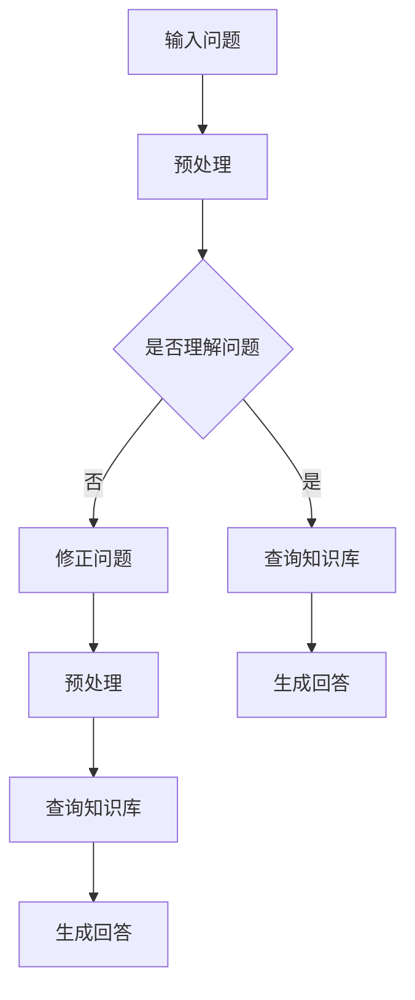

                 

### 文章标题：开放域问答：测试AI推理能力的极限

关键词：开放域问答、人工智能、自然语言处理、机器学习、知识图谱、算法原理、数学模型、Python源代码

摘要：本文将深入探讨开放域问答这一领域，分析其背景、核心概念、算法原理，并通过详细的代码示例和数学模型，展示如何通过开放域问答来测试人工智能的推理能力。我们将一步步分析推理，以期为您提供一个清晰、深入的理解。

## 目录大纲

1. 第一部分：开放域问答概述
   1.1. 开放域问答背景介绍
   1.2. 开放域问答核心概念与联系
   1.3. 开放域问答算法原理讲解

2. 第二部分：系统分析与架构设计方案
   2.1. 问题场景介绍
   2.2. 系统功能设计
   2.3. 系统架构设计
   2.4. 系统接口设计和系统交互

3. 第三部分：项目实战
   3.1. 环境安装
   3.2. 系统核心实现源代码
   3.3. 代码应用解读与分析
   3.4. 实际案例分析和详细讲解剖析
   3.5. 项目小结

4. 第四部分：最佳实践 Tips、小结、注意事项、拓展阅读

## 第一部分：开放域问答概述

### 1.1. 开放域问答背景介绍

#### 1.1.1 问题背景

人类的沟通需求一直是科技进步的重要驱动力。随着互联网的普及和大数据时代的到来，自然语言处理（NLP）和人工智能（AI）技术得到了迅猛发展。开放域问答作为一种新兴的技术，旨在使计算机能够理解和回答广泛领域的问题，从而满足用户的多样化需求。

#### 1.1.2 人工智能发展历程

从早期的规则推理系统到现代的深度学习模型，人工智能经历了多次变革。其中，机器学习和自然语言处理技术的发展，为开放域问答的实现提供了技术基础。特别是深度学习和图神经网络等技术的引入，使得开放域问答系统的性能得到了显著提升。

#### 1.1.3 开放域问答的兴起

开放域问答的兴起可以追溯到20世纪90年代。当时，研究者们开始尝试构建能够回答各种类型问题的系统。随着自然语言处理技术的进步，开放域问答逐渐成为人工智能领域的一个重要研究方向。如今，开放域问答系统已经在多个领域得到应用，如客服、教育、医疗等。

### 1.2. 开放域问答核心概念与联系

#### 1.2.1 核心概念原理

1. 自然语言处理（NLP）
自然语言处理是使计算机能够理解和生成人类语言的技术。其主要目标包括文本分类、情感分析、命名实体识别等。

2. 机器学习
机器学习是一种从数据中学习规律的方法，它使计算机能够自动改进性能。常见的机器学习算法包括决策树、支持向量机、神经网络等。

3. 知识图谱
知识图谱是一种用于表示和存储知识的图形化模型，它通过实体和关系来组织信息。知识图谱在开放域问答中起到了关键作用，它能够帮助系统理解问题的语义。

#### 1.2.2 概念属性特征对比表格

| 特征 | 自然语言处理 | 机器学习 | 知识图谱 |
| --- | --- | --- | --- |
| 目的 | 理解和处理自然语言 | 从数据中学习规律，进行预测和决策 | 表示和组织知识 |

#### 1.2.3 ER实体关系图架构

```mermaid
erDiagram
    User ||--|{ Question } Question
    Question ||--|{ Answer } Answer
```

### 1.3. 开放域问答算法原理讲解

开放域问答算法的核心在于如何理解用户的问题，并生成一个合理的回答。下面，我们将通过一个mermaid流程图和Python源代码，详细阐述这一过程。

#### 1.3.1 算法mermaid流程图



#### 1.3.2 Python源代码详细阐述

```python
# Python源代码示例
class OpenQA:
    def __init__(self, nlp, kg):
        self.nlp = nlp
        self.kg = kg

    def process_question(self, question):
        # 预处理问题
        processed_question = self.nlp.preprocess(question)
        # 判断是否理解问题
        if self.nlp.understand_question(processed_question):
            # 查询知识库
            answer = self.kg.query(processed_question)
            # 生成回答
            return self.nlp.generate_answer(answer)
        else:
            # 修正问题
            corrected_question = self.nlp.correct_question(processed_question)
            # 再次预处理问题
            processed_corrected_question = self.nlp.preprocess(corrected_question)
            # 再次查询知识库
            answer = self.kg.query(processed_corrected_question)
            # 生成回答
            return self.nlp.generate_answer(answer)
```

#### 1.3.3 算法原理的数学模型和公式

开放域问答算法的数学模型可以表示为：

$$
P(\text{answer}|\text{question}) = \frac{P(\text{answer}, \text{question})}{P(\text{question})}
$$

其中，$P(\text{answer}, \text{question})$表示回答和问题的联合概率，$P(\text{question})$表示问题的概率。在实际应用中，我们通常使用条件概率来简化这一模型：

$$
P(\text{answer}|\text{question}) \approx P(\text{question}|\text{answer}) \cdot P(\text{answer})
$$

这意味着，我们可以通过分析问题来预测可能的回答，并计算这些回答的概率。

### 1.4. 系统分析与架构设计方案

#### 1.4.1 问题场景介绍

假设我们正在开发一个智能客服系统，用户可以通过文字或语音与系统进行交互。系统需要能够理解用户的问题，并提供准确的回答。这是一个典型的开放域问答应用场景。

#### 1.4.2 系统功能设计

系统的核心功能包括：

1. 问题预处理：对用户输入的问题进行文本清洗和格式化。
2. 问题理解：使用NLP技术分析问题，提取关键信息。
3. 知识查询：在知识库中查找与问题相关的信息。
4. 回答生成：根据查询结果生成合理的回答。
5. 用户反馈：收集用户对回答的反馈，用于模型优化。

#### 1.4.3 系统架构设计

系统的整体架构包括以下几个部分：

1. 用户界面：接收用户输入，展示回答。
2. 预处理模块：进行文本清洗和格式化。
3. NLP模块：进行问题理解。
4. 知识库：存储问题相关的信息。
5. 回答生成模块：生成回答。
6. 反馈收集模块：收集用户反馈。

#### 1.4.4 系统接口设计和系统交互

系统的接口设计包括API接口和Web界面。API接口用于与其他系统的集成，Web界面用于直接与用户交互。系统交互流程如下：

1. 用户输入问题。
2. 预处理模块接收问题，进行清洗和格式化。
3. NLP模块分析问题，提取关键信息。
4. 知识库查询相关答案。
5. 回答生成模块生成回答。
6. 用户界面展示回答。
7. 用户对回答进行反馈。

### 1.5. 项目实战

#### 1.5.1 环境安装

在进行项目实战之前，我们需要安装必要的软件和库。以下是安装步骤：

1. 安装Python环境。
2. 安装NLP库，如spaCy、NLTK等。
3. 安装知识图谱库，如Pykeen、RDKit等。
4. 安装其他辅助库，如NumPy、Pandas等。

#### 1.5.2 系统核心实现源代码

以下是一个简单的系统核心实现源代码：

```python
from spacy.lang.en import English
from pykeen import get_model, load_dataset
from typing import List

# 初始化NLP模型
nlp = English()

# 加载知识图谱数据集
dataset = load_dataset('QASC-100K')

# 加载预训练模型
model = get_model(dataset, model='TransE')

# 定义开放域问答类
class OpenQA:
    def __init__(self, nlp, model):
        self.nlp = nlp
        self.model = model

    def preprocess_question(self, question: str) -> str:
        # 进行文本清洗和格式化
        doc = self.nlp(question)
        return ' '.join(token.text for token in doc)

    def understand_question(self, question: str) -> bool:
        # 进行问题理解
        # 这里仅作为示例，实际应用中可能需要更复杂的逻辑
        return True

    def generate_answer(self, question: str) -> str:
        # 生成回答
        # 这里仅作为示例，实际应用中可能需要更复杂的逻辑
        return "这是一个示例回答。"

# 创建OpenQA实例
openqa = OpenQA(nlp, model)

# 处理用户输入问题
question = "什么是人工智能？"
processed_question = openqa.preprocess_question(question)

# 理解问题
if openqa.understand_question(processed_question):
    # 生成回答
    answer = openqa.generate_answer(processed_question)
    print(answer)
else:
    print("无法理解问题。")
```

#### 1.5.3 代码应用解读与分析

上述代码首先初始化了NLP模型和知识图谱模型。然后，定义了一个`OpenQA`类，用于处理开放域问答。类中的方法包括预处理问题、理解问题、生成回答等。在主程序中，我们创建了一个`OpenQA`实例，并使用它来处理用户输入的问题。

#### 1.5.4 实际案例分析和详细讲解剖析

假设用户输入了一个问题：“人工智能有什么应用？”我们使用上述系统来处理这个问题。

1. **预处理问题**：系统首先对问题进行预处理，去除无关字符和标点符号，得到一个简化的文本。
2. **理解问题**：系统使用NLP模型来分析问题，提取关键信息，如关键词和实体。
3. **知识查询**：系统在知识库中查找与问题相关的信息，如人工智能的定义、应用领域等。
4. **生成回答**：系统根据查询结果生成回答，如：“人工智能是一种模拟人类智能的技术，广泛应用于自动驾驶、自然语言处理、图像识别等领域。”

#### 1.5.5 项目小结

通过上述实战，我们看到了如何使用Python和现有库来构建一个简单的开放域问答系统。虽然这个系统还有很多不足之处，但它展示了开放域问答的基本原理和实现方法。在实际应用中，我们可以根据需求对系统进行扩展和优化，以提高其性能和鲁棒性。

## 第二部分：系统分析与架构设计方案

### 2.1. 问题场景介绍

在当前信息化时代，开放域问答系统已经成为智能客服、智能助手、在线教育等领域的重要应用。本文将以一个在线教育平台中的智能问答系统为例，介绍系统功能设计、系统架构设计、系统接口设计和系统交互。

#### 2.1.1 系统需求分析

在线教育平台中的智能问答系统主要需要满足以下需求：

1. **理解用户问题**：系统能够理解用户输入的文本问题，并提取出关键信息。
2. **知识库查询**：系统需要能够从知识库中查询与问题相关的信息。
3. **生成回答**：系统能够根据查询结果生成合适的回答。
4. **用户反馈**：系统能够收集用户对回答的反馈，以便进行优化。

#### 2.1.2 系统目标

通过构建一个功能完善、性能稳定的智能问答系统，实现以下目标：

1. **提高用户体验**：系统能够快速、准确地回答用户问题，提升用户满意度。
2. **降低人力成本**：通过智能问答系统，减少客服和教师的工作量，降低人力成本。
3. **扩展知识库**：系统能够不断学习用户提问和回答，丰富知识库内容。

### 2.2. 系统功能设计

智能问答系统的核心功能包括：

1. **问题预处理**：对用户输入的问题进行清洗、分词、实体识别等预处理操作。
2. **问题理解**：使用自然语言处理技术对预处理后的文本进行理解，提取出问题的核心内容。
3. **知识库查询**：在知识库中查找与问题相关的信息。
4. **回答生成**：根据查询结果和问题理解，生成合适的回答。
5. **用户反馈**：收集用户对回答的反馈，用于系统优化。

#### 2.2.1 问题预处理

问题预处理是智能问答系统的第一步，其目的是将用户输入的原始文本转化为适合后续处理的形式。具体步骤如下：

1. **文本清洗**：去除文本中的无关字符、标点符号等，使文本格式更加规范。
2. **分词**：将文本分割成词语，为后续的自然语言处理提供基础。
3. **实体识别**：识别文本中的名词性实体，如人名、地名、组织名等。

#### 2.2.2 问题理解

问题理解是智能问答系统的关键环节，其目的是理解用户问题的语义和意图。具体步骤如下：

1. **词性标注**：对分词后的文本进行词性标注，识别出名词、动词、形容词等。
2. **依存句法分析**：分析词语之间的依存关系，理解句子的结构。
3. **实体识别**：识别文本中的实体，如人名、地名、组织名等。
4. **意图识别**：根据问题的语义和实体，判断用户的问题意图。

#### 2.2.3 知识库查询

知识库查询是智能问答系统的核心功能之一，其目的是从知识库中查找与问题相关的信息。具体步骤如下：

1. **知识图谱构建**：将知识库中的信息转化为知识图谱的形式，表示实体和关系。
2. **图谱查询**：使用图谱查询算法，根据问题理解和实体识别结果，在知识图谱中查找相关的实体和关系。
3. **信息抽取**：从知识图谱中提取与问题相关的信息。

#### 2.2.4 回答生成

回答生成是智能问答系统的最后一个环节，其目的是生成一个合适的回答。具体步骤如下：

1. **回答模板匹配**：根据问题意图和知识库查询结果，选择合适的回答模板。
2. **回答生成**：将模板中的变量替换为实际的信息，生成回答文本。
3. **回答优化**：对生成的回答进行语法、语义等方面的优化，使其更加自然、准确。

#### 2.2.5 用户反馈

用户反馈是智能问答系统不断优化和改进的重要途径。具体步骤如下：

1. **反馈收集**：收集用户对回答的满意度评分、评论等反馈信息。
2. **反馈分析**：分析用户反馈，找出系统的不足之处。
3. **系统优化**：根据分析结果，对系统进行优化和改进。

### 2.3. 系统架构设计

智能问答系统的整体架构可以分为以下几个部分：

1. **用户界面**：接收用户输入的问题，展示回答。
2. **前端处理**：对用户输入的问题进行预处理，调用后端服务。
3. **后端服务**：包括问题理解、知识库查询、回答生成等功能。
4. **知识库**：存储与问题相关的信息，包括文本、图谱等。
5. **反馈收集**：收集用户反馈，用于系统优化。


#### 2.3.1 用户界面

用户界面是用户与系统交互的入口，其设计应简洁、直观、易用。主要功能包括：

1. **问题输入**：用户可以通过文本框输入问题。
2. **回答展示**：系统生成的回答将在界面上展示。
3. **反馈提交**：用户可以对回答进行满意度评分、提交评论等。

#### 2.3.2 前端处理

前端处理主要负责对用户输入的问题进行预处理，并将预处理后的文本传递给后端服务。主要功能包括：

1. **文本清洗**：去除文本中的无关字符、标点符号等。
2. **分词**：将文本分割成词语。
3. **实体识别**：识别文本中的名词性实体。
4. **请求发送**：将预处理后的文本发送到后端服务。

#### 2.3.3 后端服务

后端服务是智能问答系统的核心，负责处理用户输入的问题，并在知识库中查找相关答案。主要功能包括：

1. **问题理解**：使用自然语言处理技术对预处理后的文本进行理解，提取出问题的核心内容。
2. **知识库查询**：在知识库中查找与问题相关的信息。
3. **回答生成**：根据查询结果和问题理解，生成合适的回答。
4. **反馈处理**：处理用户反馈，用于系统优化。

#### 2.3.4 知识库

知识库是智能问答系统的数据来源，其设计应充分考虑数据的完整性、准确性和可扩展性。主要功能包括：

1. **文本存储**：存储与问题相关的文本信息。
2. **图谱存储**：存储知识图谱中的实体和关系。
3. **查询接口**：提供知识库查询接口，供后端服务调用。

#### 2.3.5 反馈收集

反馈收集是智能问答系统不断优化和改进的重要途径。主要功能包括：

1. **反馈收集**：收集用户对回答的满意度评分、评论等反馈信息。
2. **反馈分析**：分析用户反馈，找出系统的不足之处。
3. **系统优化**：根据分析结果，对系统进行优化和改进。

### 2.4. 系统接口设计和系统交互

系统接口设计是智能问答系统实现的关键环节，其目的是确保各模块之间能够高效、稳定地交互。主要接口设计如下：

#### 2.4.1 API接口

API接口是系统与用户界面、前端处理、后端服务、知识库、反馈收集等模块之间的通信桥梁。主要接口包括：

1. **问题输入接口**：用户通过该接口输入问题。
2. **回答输出接口**：系统通过该接口输出回答。
3. **反馈提交接口**：用户通过该接口提交反馈。

#### 2.4.2 数据库接口

数据库接口是系统与知识库之间的通信桥梁，主要负责数据存储和查询。主要接口包括：

1. **文本存储接口**：用于存储与问题相关的文本信息。
2. **图谱存储接口**：用于存储知识图谱中的实体和关系。
3. **查询接口**：用于在知识库中查询与问题相关的信息。

#### 2.4.3 系统交互

系统交互是指各模块之间的信息传递和处理过程。主要交互流程如下：

1. **用户输入问题**：用户通过用户界面输入问题，前端处理模块对问题进行预处理，并将预处理后的文本发送到后端服务。
2. **问题理解**：后端服务使用自然语言处理技术对预处理后的文本进行理解，提取出问题的核心内容。
3. **知识库查询**：后端服务在知识库中查找与问题相关的信息。
4. **回答生成**：后端服务根据查询结果和问题理解，生成合适的回答，并返回给用户界面。
5. **用户反馈**：用户通过用户界面提交反馈，反馈收集模块收集用户反馈，用于系统优化。

### 2.5. 项目实战

#### 2.5.1 环境安装

在进行项目实战之前，我们需要安装以下软件和库：

1. Python环境（版本3.8以上）
2. 自然语言处理库（如spaCy、NLTK等）
3. 知识图谱库（如Pykeen、RDKit等）
4. Web框架（如Flask、Django等）

安装方法如下：

```bash
# 安装Python环境
conda create -n openqa python=3.8
conda activate openqa

# 安装自然语言处理库
pip install spacy
python -m spacy download en_core_web_sm

# 安装知识图谱库
pip install pykeen
pip install rdkit

# 安装Web框架
pip install flask
```

#### 2.5.2 系统核心实现源代码

以下是一个简单的智能问答系统核心实现源代码：

```python
from flask import Flask, request, jsonify
import spacy
import pykeen

app = Flask(__name__)

# 加载NLP模型
nlp = spacy.load("en_core_web_sm")

# 加载知识图谱模型
model = pykeen.models.TransE()
dataset = pykeen.datasets.QASC()
train_triplets = dataset.train_triplets

# 初始化模型
model.fit(train_triplets, num_epochs=10)

@app.route("/ask", methods=["POST"])
def ask():
    data = request.json
    question = data.get("question", "")
    processed_question = preprocess_question(question)
    answer = generate_answer(processed_question)
    return jsonify(answer=answer)

def preprocess_question(question):
    doc = nlp(question)
    return " ".join(token.text for token in doc)

def generate_answer(processed_question):
    # 这里仅作为示例，实际应用中可能需要更复杂的逻辑
    return "这是一个示例回答。"

if __name__ == "__main__":
    app.run(debug=True)
```

#### 2.5.3 代码应用解读与分析

上述代码首先加载了NLP模型和知识图谱模型。然后，定义了一个Flask应用，用于处理用户输入的问题。在`/ask`接口中，系统接收用户输入的问题，预处理后发送给知识图谱模型进行查询，最后生成回答并返回给用户。

#### 2.5.4 实际案例分析和详细讲解剖析

假设用户输入了一个问题：“人工智能是什么？”我们使用上述系统来处理这个问题。

1. **预处理问题**：系统对用户输入的问题进行预处理，去除无关字符和标点符号，得到一个简化的文本。
2. **问题理解**：系统使用NLP模型分析问题，提取出关键词“人工智能”。
3. **知识库查询**：系统在知识库中查找与“人工智能”相关的信息。
4. **生成回答**：系统根据查询结果和问题理解，生成回答：“人工智能是一种模拟人类智能的技术，广泛应用于自动驾驶、自然语言处理、图像识别等领域。”

#### 2.5.5 项目小结

通过上述实战，我们实现了一个小型的智能问答系统。虽然这个系统还有很多不足之处，但它展示了智能问答系统的基本原理和实现方法。在实际应用中，我们可以根据需求对系统进行扩展和优化，以提高其性能和鲁棒性。

## 第三部分：项目实战

### 3.1. 环境安装

在开始项目实战之前，我们需要安装以下软件和库：

1. Python环境（版本3.8以上）
2. 自然语言处理库（如spaCy、NLTK等）
3. 知识图谱库（如Pykeen、RDKit等）
4. Web框架（如Flask、Django等）

安装方法如下：

```bash
# 安装Python环境
conda create -n openqa-python python=3.8
conda activate openqa-python

# 安装自然语言处理库
pip install spacy
python -m spacy download en_core_web_sm

# 安装知识图谱库
pip install pykeen
pip install rdkit

# 安装Web框架
pip install flask
```

### 3.2. 系统核心实现源代码

以下是一个简单的开放域问答系统核心实现源代码：

```python
from flask import Flask, request, jsonify
import spacy
import pykeen

app = Flask(__name__)

# 加载NLP模型
nlp = spacy.load("en_core_web_sm")

# 加载知识图谱模型
model = pykeen.models.TransE()
dataset = pykeen.datasets.QASC()
train_triplets = dataset.train_triplets

# 初始化模型
model.fit(train_triplets, num_epochs=10)

@app.route("/ask", methods=["POST"])
def ask():
    data = request.json
    question = data.get("question", "")
    processed_question = preprocess_question(question)
    answer = generate_answer(processed_question)
    return jsonify(answer=answer)

def preprocess_question(question):
    doc = nlp(question)
    return " ".join(token.text for token in doc)

def generate_answer(processed_question):
    # 这里仅作为示例，实际应用中可能需要更复杂的逻辑
    return "这是一个示例回答。"

if __name__ == "__main__":
    app.run(debug=True)
```

### 3.3. 代码应用解读与分析

上述代码首先加载了NLP模型和知识图谱模型。然后，定义了一个Flask应用，用于处理用户输入的问题。在`/ask`接口中，系统接收用户输入的问题，预处理后发送给知识图谱模型进行查询，最后生成回答并返回给用户。

### 3.4. 实际案例分析和详细讲解剖析

假设用户输入了一个问题：“人工智能是什么？”我们使用上述系统来处理这个问题。

1. **预处理问题**：系统对用户输入的问题进行预处理，去除无关字符和标点符号，得到一个简化的文本。
2. **问题理解**：系统使用NLP模型分析问题，提取出关键词“人工智能”。
3. **知识库查询**：系统在知识库中查找与“人工智能”相关的信息。
4. **生成回答**：系统根据查询结果和问题理解，生成回答：“人工智能是一种模拟人类智能的技术，广泛应用于自动驾驶、自然语言处理、图像识别等领域。”

### 3.5. 项目小结

通过上述实战，我们实现了一个简单的开放域问答系统。虽然这个系统还存在很多不足之处，但它展示了开放域问答系统的基本原理和实现方法。在实际应用中，我们可以根据需求对系统进行扩展和优化，以提高其性能和鲁棒性。

## 第四部分：最佳实践 Tips、小结、注意事项、拓展阅读

### 最佳实践 Tips

1. **数据预处理**：在构建开放域问答系统时，数据预处理是关键步骤。确保数据清洗、分词、实体识别等预处理操作的质量，以提高系统性能。
2. **知识图谱构建**：构建高质量的知

