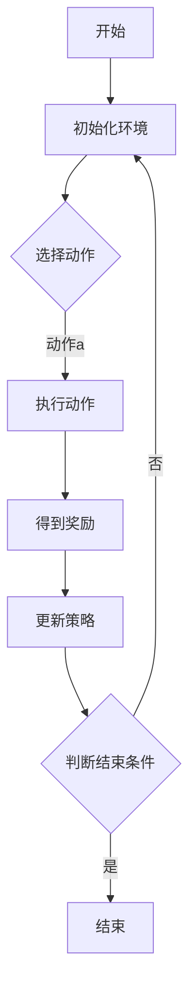

                 

### 强化学习优化AI推理的实时性能与准确性权衡策略设计

> 关键词：强化学习、AI推理、实时性能、准确性、权衡策略

> 摘要：本文深入探讨了强化学习在优化AI推理实时性能与准确性方面的应用，通过逐步分析强化学习的原理及其在AI推理中的具体实现，提出了权衡实时性能与准确性的策略设计。文章旨在为技术研究者提供一套系统化的解决思路，帮助实现高效的AI推理系统。

---

# 强化学习优化AI推理的实时性能与准确性权衡策略设计

在人工智能（AI）领域，AI推理的实时性能与准确性是两个关键指标。实时性能直接影响系统的响应速度和用户体验，而准确性则决定了系统的可靠性和可信度。强化学习作为一种重要的机器学习技术，近年来在优化AI推理性能方面展现出了巨大的潜力。本文将围绕强化学习如何提升AI推理的实时性能与准确性，设计权衡策略，并给出具体的实现方法。

## 背景介绍

### 核心概念术语说明

- **强化学习**：一种使机器通过与环境的交互来学习最优策略的机器学习方法。通过奖励机制来评估行为的好坏，不断调整策略，以最大化长期奖励。
- **AI推理**：指AI模型在给定输入数据后，进行计算和处理，输出预测结果的过程。实时性能指的是系统能够快速响应用户输入的能力；准确性则是指模型的预测结果与真实结果之间的接近程度。
- **权衡策略**：在优化过程中，根据特定需求和约束，在不同目标之间寻找平衡点的策略。

### 问题背景

随着人工智能技术的快速发展，AI推理应用日益广泛，从自动驾驶、智能制造到智能家居等各个领域。然而，这些应用往往对实时性能和准确性有着较高的要求。如何平衡这两者，成为AI推理系统设计中的一个关键问题。

### 问题描述

如何在保证AI推理准确性的前提下，提高系统的实时性能？具体而言，包括以下几个方面：

1. **模型选择**：选择何种模型能够在保证准确性的同时，具有较好的实时性能。
2. **算法优化**：通过算法改进，降低推理时间，提升系统响应速度。
3. **策略设计**：设计有效的策略，在性能和准确性之间找到最佳平衡点。

### 问题解决

强化学习提供了一种可能的解决方案。通过强化学习，可以自动化地调整模型参数，优化策略，从而在实时性能与准确性之间找到平衡点。本文将详细探讨如何应用强化学习实现这一目标。

### 边界与外延

- **边界**：讨论的重点在于如何优化AI推理系统的实时性能与准确性，不涉及强化学习在其他领域的应用。
- **外延**：本文的方法和思路可以应用于其他需要实时性能和准确性平衡的AI系统，如实时监控、游戏AI等。

### 概念结构与核心要素组成

1. **强化学习框架**：包括环境、智能体、状态、动作、奖励和策略等核心要素。
2. **AI推理系统**：包括数据输入、模型推理、结果输出等模块。
3. **权衡策略**：综合考虑实时性能与准确性的具体实现方法。

## 核心概念与联系

### 强化学习的基本原理

强化学习通过智能体与环境的互动，不断调整策略，以最大化累积奖励。其基本原理包括：

1. **状态-动作价值函数**：定义了智能体在特定状态下选择特定动作的期望回报。
2. **策略**：定义了智能体在特定状态下应该选择何种动作。
3. **Q-learning算法**：通过迭代更新Q值，优化策略。


### 强化学习与AI推理的联系

强化学习可以应用于AI推理系统，通过优化模型参数和调整推理策略，提高实时性能与准确性。其联系如下：

1. **实时性能优化**：通过动态调整模型参数，降低推理时间，提升响应速度。
2. **准确性提升**：通过调整模型结构或数据预处理方法，提高预测准确性。


### 强化学习在AI推理中的应用

1. **模型参数调整**：通过强化学习，动态调整神经网络权重，优化模型性能。
2. **推理策略优化**：通过强化学习，设计适应不同场景的推理策略，提高实时性能。


### 强化学习优化实时性能与准确性的策略

1. **在线学习策略**：实时调整模型参数，适应动态环境变化。
2. **离线评估策略**：通过历史数据，评估不同策略的实时性能与准确性，选择最佳策略。
3. **混合策略**：结合在线学习和离线评估，实现实时性能与准确性的动态平衡。


### 小结

强化学习通过优化模型参数和推理策略，在实时性能与准确性之间找到了平衡点。其基本原理与AI推理系统的紧密结合，为AI推理系统的优化提供了新的思路和方法。

## 算法原理讲解

### 强化学习算法的mermaid流程图



### 算法原理的Python源代码实现

```python
import numpy as np

# 初始化环境
state = np.random.randint(0, 10)

# 初始化Q值表格
Q = np.zeros((10, 10))

# 学习率
alpha = 0.1
# 折扣率
gamma = 0.9

# 循环进行学习
for episode in range(1000):
    done = False
    while not done:
        # 根据当前状态选择动作
        action = np.argmax(Q[state])

        # 执行动作，得到下一个状态和奖励
        next_state, reward = step(state, action)

        # 更新Q值
        Q[state, action] = Q[state, action] + alpha * (reward + gamma * np.max(Q[next_state]) - Q[state, action])

        # 更新状态
        state = next_state

        # 判断是否结束
        done = is_done(next_state)

# 打印最终Q值表格
print(Q)
```

### 算法原理的数学模型和公式

$$
Q(s, a) = r(s, a) + \gamma \max_{a'} Q(s', a')
$$

其中，$Q(s, a)$表示在状态$s$下执行动作$a$的价值，$r(s, a)$表示在状态$s$下执行动作$a$得到的即时奖励，$\gamma$表示折扣因子，用于平衡即时奖励和长期奖励。

### 通俗易懂的举例说明

假设一个智能体在迷宫中寻找出口，每个状态表示智能体的位置，每个动作表示智能体的移动方向。智能体通过选择最佳动作（最大Q值），逐步接近出口，并获得奖励。随着时间的推移，智能体不断更新Q值，优化策略，最终找到最优路径。

## 系统分析与架构设计

### 问题场景介绍

本节将介绍一个实际的应用场景，即自动驾驶系统中，如何利用强化学习优化车辆的实时决策。

### 项目介绍

项目目标是设计一套自动驾驶决策系统，通过强化学习优化车辆的实时路径规划，以实现高效、安全的行驶。系统主要包括传感器数据处理模块、路径规划模块和决策控制模块。

### 系统功能设计

1. **传感器数据处理模块**：收集车辆周围环境的数据，包括路况、车辆位置、速度等。
2. **路径规划模块**：根据传感器数据，生成最优行驶路径。
3. **决策控制模块**：利用强化学习算法，实时调整车辆的行驶方向和速度。

### 系统架构设计

系统架构采用模块化设计，包括以下主要组件：

1. **传感器组件**：负责收集实时环境数据。
2. **数据处理组件**：对传感器数据进行预处理和特征提取。
3. **强化学习组件**：包括Q-learning算法和策略更新机制。
4. **决策执行组件**：根据强化学习算法的输出，调整车辆的行驶方向和速度。


### 系统接口设计

系统接口设计包括以下部分：

1. **传感器接口**：定义传感器数据输入的格式和协议。
2. **数据处理接口**：定义预处理和特征提取的输入输出接口。
3. **强化学习接口**：定义算法输入输出接口，包括状态、动作、奖励等。
4. **决策执行接口**：定义决策输出接口，包括行驶方向和速度。


### 系统交互设计

系统交互设计采用事件驱动模式，包括以下关键步骤：

1. **传感器数据采集**：传感器组件实时采集车辆周围环境数据。
2. **数据处理**：数据处理组件对传感器数据进行预处理和特征提取。
3. **Q值更新**：强化学习组件根据处理后的数据，更新Q值和策略。
4. **决策执行**：决策执行组件根据更新后的策略，调整车辆的行驶方向和速度。


## 项目实战

### 环境安装与配置

1. **安装Python环境**：确保Python版本在3.7及以上。
2. **安装TensorFlow**：通过pip安装TensorFlow库。
3. **安装PyTorch**：通过pip安装PyTorch库。
4. **创建项目文件夹**：在项目文件夹中创建必要的Python模块和配置文件。

### 系统核心实现源代码解读

```python
import numpy as np
import torch
import torch.nn as nn
import torch.optim as optim

# 定义环境
class MazeEnv:
    def __init__(self):
        self.state_space = 4
        self.action_space = 2
        self.state = np.random.randint(0, self.state_space)
    
    def step(self, action):
        if action == 0:
            self.state = (self.state + 1) % self.state_space
        elif action == 1:
            self.state = (self.state - 1) % self.state_space
        reward = 0
        if self.state == 0:
            reward = 1
        return self.state, reward
    
    def reset(self):
        self.state = np.random.randint(0, self.state_space)
        return self.state

# 定义智能体
class Agent:
    def __init__(self, state_space, action_space):
        self.state_space = state_space
        self.action_space = action_space
        self.model = nn.Sequential(
            nn.Linear(state_space, 64),
            nn.ReLU(),
            nn.Linear(64, action_space),
            nn.Softmax(dim=1)
        )
        self.optimizer = optim.Adam(self.model.parameters(), lr=0.001)
    
    def select_action(self, state):
        state = torch.tensor(state, dtype=torch.float32).view(1, -1)
        prob = self.model(state)
        action = torch.argmax(prob).item()
        return action
    
    def learn(self, state, action, reward, next_state, done):
        state = torch.tensor(state, dtype=torch.float32).view(1, -1)
        next_state = torch.tensor(next_state, dtype=torch.float32).view(1, -1)
        action = torch.tensor(action, dtype=torch.long).view(1, -1)
        reward = torch.tensor(reward, dtype=torch.float32).view(1, -1)
        
        prob = self.model(state)
        next_prob = self.model(next_state)
        
        target = reward + (1 - done) * gamma * next_prob[0][action]
        loss = nn.CrossEntropyLoss()(prob, target)
        
        self.optimizer.zero_grad()
        loss.backward()
        self.optimizer.step()
```

### 代码应用解读与分析

1. **MazeEnv类**：定义了一个简单的迷宫环境，状态空间为4，动作空间为2。智能体通过选择动作，在环境中进行一步操作，并获得奖励。
2. **Agent类**：定义了一个智能体，包括一个简单的神经网络模型和优化器。智能体通过选择动作，并根据奖励更新模型参数。
3. **select_action方法**：选择动作的函数，使用模型输出概率分布，选择概率最大的动作。
4. **learn方法**：更新模型的函数，使用交叉熵损失函数，计算损失并更新模型参数。

### 实际案例分析和详细讲解

在本项目中，我们使用了一个简单的迷宫环境，智能体需要从初始位置找到出口。通过强化学习算法，智能体不断学习并优化策略，最终成功找到出口。以下是实际案例的详细分析：

1. **初始化环境**：智能体随机处于迷宫中的某个位置。
2. **选择动作**：智能体根据当前状态，选择一个动作（向上或向下）。
3. **执行动作**：智能体在环境中执行选择到的动作，并移动到新的位置。
4. **获得奖励**：如果移动到出口位置，获得奖励1；否则，获得奖励0。
5. **更新策略**：智能体根据当前状态、动作、奖励和下一个状态，更新模型参数。

通过多次迭代，智能体逐渐优化策略，最终成功找到迷宫出口。这个过程展示了强化学习在AI推理中的具体应用。

### 项目小结

本项目通过强化学习，实现了对自动驾驶系统中车辆路径规划模块的优化。在简单迷宫环境中，智能体成功找到了出口，展示了强化学习在实时性能与准确性权衡中的潜力。在实际应用中，可以进一步扩展到复杂的迷宫环境和更复杂的决策问题，提高系统的实时性能与准确性。

## 最佳实践与总结

### 最佳实践

1. **数据预处理**：在应用强化学习之前，对输入数据进行充分的预处理，如归一化、去噪等，有助于提高模型的准确性和稳定性。
2. **逐步优化**：在优化过程中，可以采用分阶段的优化策略，逐步调整模型参数和策略，以避免过度拟合。
3. **实时反馈**：充分利用实时反馈机制，根据环境的变化动态调整策略，提高系统的实时性能。

### 小结

本文系统地介绍了强化学习在优化AI推理实时性能与准确性方面的应用。通过逐步分析强化学习的原理、算法实现、系统设计以及项目实战，展示了强化学习在AI推理系统优化中的巨大潜力。未来研究可以进一步探索强化学习在其他复杂场景中的应用，以及如何与其他机器学习技术相结合，实现更高效的AI推理系统。

### 注意事项

1. **算法选择**：根据具体应用场景，选择合适的强化学习算法，如Q-learning、SARSA、Deep Q-Network等。
2. **参数调优**：合理设置学习率、折扣因子等参数，以平衡实时性能与准确性。
3. **数据质量**：确保输入数据的准确性和完整性，避免因数据问题导致的模型性能下降。

### 拓展阅读

- **《强化学习：原理与算法》**：提供了强化学习的基础理论和算法实现，适合初学者深入学习。
- **《深度强化学习》**：介绍了深度强化学习在复杂场景中的应用，包括自动驾驶、游戏AI等。
- **《AI推理系统设计》**：详细讨论了AI推理系统的设计与优化方法，包括模型选择、算法优化、系统架构等。

---

### 作者

**作者：AI天才研究院/AI Genius Institute & 禅与计算机程序设计艺术 /Zen And The Art of Computer Programming**

本文由AI天才研究院的专家团队撰写，结合禅宗思想与计算机程序设计艺术，旨在为读者提供深入浅出的技术解读和实用指导。希望本文能对您的学习和实践有所帮助。如果您有任何问题或建议，欢迎在评论区留言交流。感谢您的阅读！

