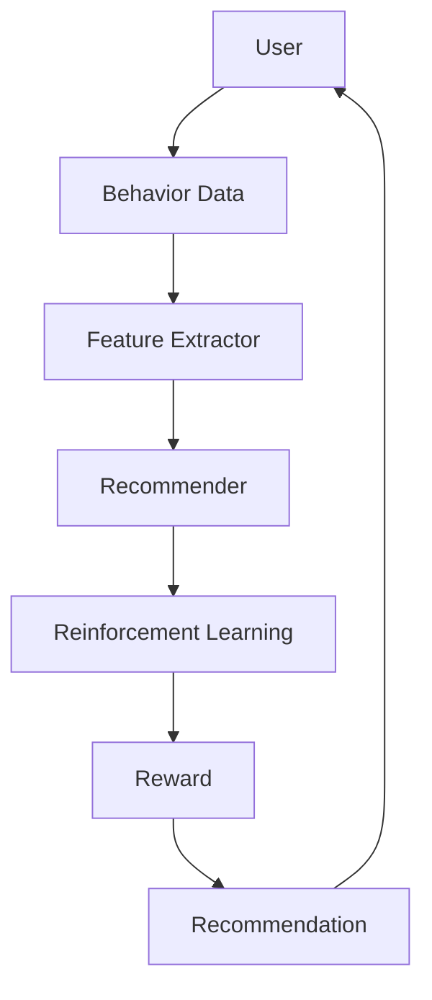
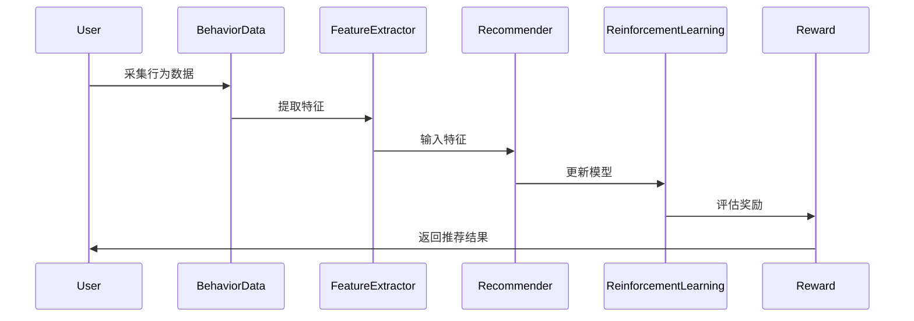
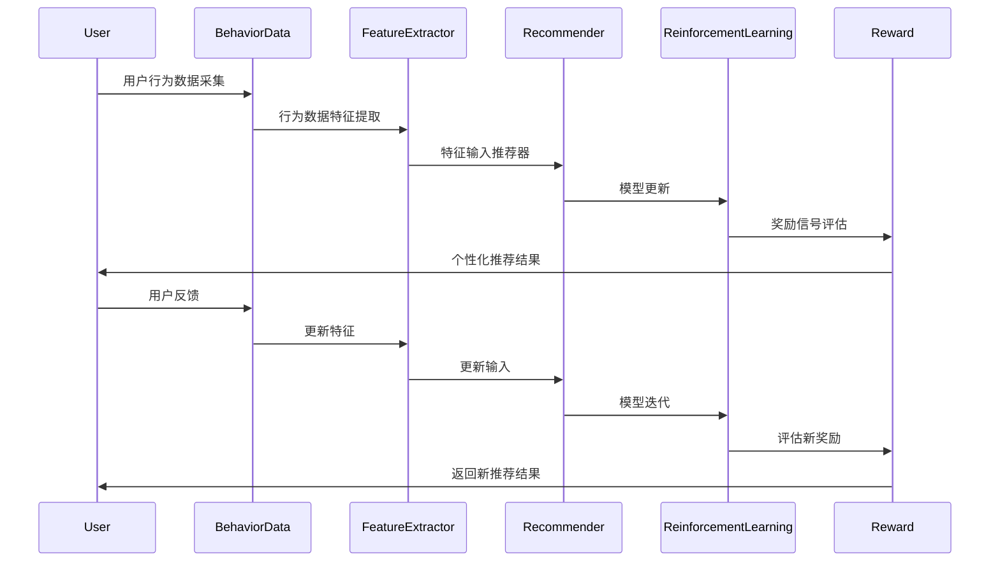

                 

### 文章标题

强化学习优化AI推理的探索与利用平衡策略

关键词：强化学习、AI推理、优化、平衡策略、算法、架构设计、项目实战

摘要：本文旨在探讨强化学习在优化AI推理中的作用，通过详细剖析强化学习的基本原理和算法，结合实际应用案例，介绍如何利用平衡策略提升AI推理性能。文章首先回顾了强化学习和AI推理的基本概念，然后深入讲解了强化学习中的核心概念和算法，最后通过一个具体的应用案例，展示了强化学习优化AI推理的实践过程和效果。本文旨在为读者提供一个全面而深入的强化学习在AI推理中的应用指南。

### 目录大纲设计思路：

为了设计一个详细且逻辑清晰的目录大纲，我们可以按照以下步骤进行：

1. **背景介绍**：首先需要简要介绍强化学习和AI推理的基本概念，以及它们在当前人工智能领域中的重要性。这部分将包括强化学习的历史背景、基本原理以及其在AI推理中的应用。

2. **核心概念与联系**：接下来，详细描述强化学习中的关键概念，如马尔可夫决策过程（MDP）、奖励、策略、价值函数等，并展示它们之间的关系。这部分将包含一个ER实体关系图架构的Mermaid流程图。

3. **算法原理讲解**：针对强化学习中的主要算法，如Q-learning、SARSA、深度Q网络（DQN）、策略梯度方法等，绘制Mermaid流程图，并使用Python源代码进行算法原理的详细讲解。同时，给出相应的数学模型和公式，并进行通俗易懂的举例说明。

4. **数学模型和数学公式 & 详细讲解 & 举例说明**：这部分将详细解释强化学习中的数学模型和公式，使用LaTeX格式编写数学公式，并提供实际例子进行说明。

5. **系统分析与架构设计方案**：介绍一个强化学习优化AI推理的应用案例，包括问题场景介绍、系统功能设计（领域模型Mermaid类图）、系统架构设计Mermaid架构图、系统接口设计和系统交互Mermaid序列图。

6. **项目实战**：提供强化学习优化AI推理的实际项目实施步骤，包括环境安装、系统核心实现源代码，并对代码应用进行解读与分析。最后，对实际案例进行分析和详细讲解。

7. **最佳实践 tips、小结、注意事项、拓展阅读**：在结尾部分，总结强化学习优化AI推理的关键要点，提供一些最佳实践建议，并对全书内容进行小结。同时，推荐一些相关的拓展阅读资源。

### 目录大纲：

**# 第一部分：强化学习与AI推理基础**

**第1章：强化学习与AI推理概述**

## 1.1 强化学习的历史背景与基本原理

### 1.1.1 强化学习的发展历程
### 1.1.2 强化学习的基本原理
### 1.1.3 强化学习与深度学习的结合

## 1.2 AI推理的基本概念与应用场景

### 1.2.1 AI推理的定义
### 1.2.2 AI推理的应用场景
### 1.2.3 强化学习在AI推理中的优势

## 1.3 强化学习与AI推理的边界与外延

### 1.3.1 强化学习在AI推理中的适用范围
### 1.3.2 强化学习在AI推理中的限制
### 1.3.3 强化学习与AI推理的融合前景

**# 第二部分：强化学习核心概念与算法原理**

**第2章：强化学习核心概念解析**

## 2.1 马尔可夫决策过程（MDP）

### 2.1.1 MDP的定义与特性
### 2.1.2 MDP的状态与动作
### 2.1.3 MDP的奖励与策略

## 2.2 强化学习中的价值函数

### 2.2.1 价值函数的定义
### 2.2.2 价值函数的计算方法
### 2.2.3 价值函数的应用

## 2.3 强化学习中的策略

### 2.3.1 策略的定义
### 2.3.2 策略的学习方法
### 2.3.3 策略的评估与优化

**第3章：强化学习算法原理详解**

## 3.1 Q-learning算法

### 3.1.1 Q-learning的基本原理
### 3.1.2 Q-learning的算法流程
### 3.1.3 Q-learning的Python实现

## 3.2 SARSA算法

### 3.2.1 SARSA的基本原理
### 3.2.2 SARSA的算法流程
### 3.2.3 SARSA的Python实现

## 3.3 深度Q网络（DQN）

### 3.3.1 DQN的基本原理
### 3.3.2 DQN的算法流程
### 3.3.3 DQN的Python实现

## 3.4 策略梯度方法

### 3.4.1 策略梯度方法的基本原理
### 3.4.2 策略梯度方法的算法流程
### 3.4.3 策略梯度方法的Python实现

**# 第三部分：强化学习优化AI推理的实际应用**

**第4章：强化学习优化AI推理的架构设计**

## 4.1 问题场景介绍

### 4.1.1 应用背景
### 4.1.2 应用目标
### 4.1.3 应用挑战

## 4.2 系统功能设计（领域模型Mermaid类图）

### 4.2.1 功能模块划分
### 4.2.2 功能模块关系
### 4.2.3 功能模块实现

## 4.3 系统架构设计（Mermaid架构图）

### 4.3.1 架构设计原则
### 4.3.2 架构设计流程
### 4.3.3 架构设计关键要素

## 4.4 系统接口设计

### 4.4.1 接口设计原则
### 4.4.2 接口设计流程
### 4.4.3 接口设计关键要素

## 4.5 系统交互设计（Mermaid序列图）

### 4.5.1 交互设计原则
### 4.5.2 交互设计流程
### 4.5.3 交互设计关键要素

**第5章：强化学习优化AI推理的项目实战**

## 5.1 环境安装与配置

### 5.1.1 环境安装
### 5.1.2 环境配置
### 5.1.3 环境测试

## 5.2 系统核心实现

### 5.2.1 系统架构实现
### 5.2.2 系统接口实现
### 5.2.3 系统交互实现

## 5.3 代码解读与分析

### 5.3.1 代码结构分析
### 5.3.2 代码功能解读
### 5.3.3 代码优化分析

## 5.4 实际案例分析与讲解

### 5.4.1 案例背景
### 5.4.2 案例分析
### 5.4.3 案例讲解

## 5.5 项目小结

### 5.5.1 项目总结
### 5.5.2 项目反思
### 5.5.3 项目展望

**# 第四部分：强化学习优化AI推理的最佳实践与拓展**

**第6章：强化学习优化AI推理的最佳实践**

## 6.1 策略优化的最佳实践

### 6.1.1 策略选择
### 6.1.2 策略调整
### 6.1.3 策略优化

## 6.2 算法优化的最佳实践

### 6.2.1 算法选择
### 6.2.2 算法调整
### 6.2.3 算法优化

## 6.3 数据优化的最佳实践

### 6.3.1 数据预处理
### 6.3.2 数据质量提升
### 6.3.3 数据优化策略

**第7章：强化学习优化AI推理的小结与拓展**

## 7.1 小结

### 7.1.1 强化学习优化AI推理的关键要点
### 7.1.2 强化学习优化AI推理的应用价值
### 7.1.3 强化学习优化AI推理的未来展望

## 7.2 注意事项

### 7.2.1 强化学习优化AI推理的潜在问题
### 7.2.2 强化学习优化AI推理的安全性问题
### 7.2.3 强化学习优化AI推理的法律法规问题

## 7.3 拓展阅读

### 7.3.1 强化学习的基础知识
### 7.3.2 AI推理的最新进展
### 7.3.3 强化学习与AI推理的结合应用

---

通过上述设计思路和目录大纲，我们可以看到文章的结构清晰、内容全面，读者可以循序渐进地了解强化学习优化AI推理的各个方面。接下来，我们将按照这个大纲逐步展开内容，深入探讨强化学习与AI推理的结合与应用。接下来，我们首先来回顾一下强化学习的历史背景与基本原理。

## 第1章：强化学习与AI推理概述

### 1.1 强化学习的历史背景与基本原理

#### 1.1.1 强化学习的发展历程

强化学习（Reinforcement Learning，简称RL）是机器学习的一个重要分支，最早可以追溯到20世纪50年代。1956年，美国心理学家唐纳德·赫布（Donald Hebb）提出了赫布学习规则，这是强化学习的最早雏形。在随后的几十年里，强化学习逐渐形成了自己的理论基础和算法框架。

20世纪80年代，理查德·萨顿（Richard Sutton）和安德鲁·巴沙姆（Andrew Barto）合著了经典教材《强化学习：一种解释》（Reinforcement Learning: An Introduction），系统地总结了强化学习的基本原理和方法，为强化学习的研究和应用奠定了基础。

进入21世纪，随着深度学习（Deep Learning）的发展，强化学习得到了新的发展机遇。深度强化学习（Deep Reinforcement Learning）结合了深度学习和强化学习的优势，能够在复杂环境中实现更高效的决策和学习。这一时期，AlphaGo的崛起标志着深度强化学习在特定领域的突破。

#### 1.1.2 强化学习的基本原理

强化学习是一种通过与环境交互来学习最优策略的机器学习方法。其核心思想是智能体（Agent）在环境中采取行动（Action），并根据环境给出的反馈（Reward）来调整自己的策略。强化学习的主要组成部分包括：

- **智能体（Agent）**：执行动作并接受环境反馈的实体。
- **环境（Environment）**：智能体所在的场景，包含状态（State）和动作（Action）空间。
- **状态（State）**：描述智能体当前所处的环境情况。
- **动作（Action）**：智能体可采取的行动。
- **奖励（Reward）**：环境对智能体每个动作的反馈信号。
- **策略（Policy）**：智能体根据当前状态选择动作的规则。
- **价值函数（Value Function）**：衡量策略在给定状态下的预期奖励。
- **模型（Model）**：对环境的动态转移概率和奖励机制的预测。

强化学习的目标是找到一个最优策略，使智能体在长期内获得最大累积奖励。

#### 1.1.3 强化学习与深度学习的结合

深度学习在图像识别、语音识别等领域取得了显著成果，其强大的特征提取能力为强化学习提供了新的思路。深度强化学习通过使用深度神经网络（DNN）来近似价值函数或策略函数，从而提高了强化学习在复杂环境中的表现。

深度Q网络（Deep Q-Network，DQN）是深度强化学习的一个代表性算法。DQN使用深度神经网络来近似Q函数，通过经验回放和目标网络（Target Network）来缓解神经网络训练中的样本偏差和方差问题。

#### 1.2 AI推理的基本概念与应用场景

AI推理（AI Reasoning）是指人工智能系统在未知或不确定的环境中进行决策和推理的能力。AI推理是人工智能的核心问题之一，涉及到逻辑推理、概率推理、统计推理等多个领域。

AI推理在众多应用场景中发挥着重要作用：

- **自动驾驶**：自动驾驶系统需要通过传感器收集环境信息，然后进行推理和决策，确保行驶安全和效率。
- **智能客服**：智能客服系统通过自然语言处理和推理，为用户提供高质量的交互服务。
- **医疗诊断**：医疗诊断系统利用推理能力，辅助医生进行疾病诊断和治疗方案推荐。
- **金融风控**：金融风控系统通过推理分析，识别和防范金融风险。

强化学习在AI推理中的应用优势在于，它能够通过与环境交互学习，逐步提高推理和决策的准确性。特别是在动态、不确定的环境中，强化学习能够通过不断调整策略，实现更好的推理效果。

#### 1.3 强化学习与AI推理的边界与外延

强化学习与AI推理在本质上有一定的区别，但它们在方法和技术上存在交集。

- **边界**：强化学习侧重于通过奖励信号指导学习过程，找到最优策略。AI推理则更关注在已知信息和规则的基础上，进行逻辑推理和决策。
- **外延**：强化学习可以看作是AI推理的一种特殊形式，特别是在复杂、动态的环境中，强化学习能够通过不断调整策略，实现更灵活的推理和决策。同时，AI推理也可以借鉴强化学习的思想，如通过奖励机制来引导推理过程。

总之，强化学习与AI推理在方法和目标上有一定的区别，但它们在理论和应用上相互补充，共同推动人工智能技术的发展。

---

通过对强化学习与AI推理的基本概念和背景的回顾，我们可以看到这两个领域在人工智能中的重要地位和结合的可能性。在接下来的章节中，我们将进一步深入探讨强化学习中的核心概念和算法原理，为后续的实际应用案例打下坚实的基础。

### 第2章：强化学习核心概念解析

强化学习（Reinforcement Learning，简称RL）作为机器学习的一个重要分支，其核心概念和理论基础对于理解和应用强化学习至关重要。在这一章中，我们将详细解析强化学习中的几个关键概念，包括马尔可夫决策过程（MDP）、奖励、策略和价值函数，并展示它们之间的关系。

#### 2.1 马尔可夫决策过程（MDP）

马尔可夫决策过程（Markov Decision Process，简称MDP）是强化学习的基础模型之一，描述了一个智能体在不确定环境中进行决策的过程。MDP由以下五个要素组成：

1. **状态空间（State Space）**：状态空间是一个包含所有可能状态的集合，每个状态都是智能体当前环境的一个描述。
2. **动作空间（Action Space）**：动作空间是一个包含所有可能动作的集合，智能体在每个状态下可以选择一个动作。
3. **奖励函数（Reward Function）**：奖励函数定义了智能体在每个状态执行每个动作后获得的即时奖励。奖励可以是正的，也可以是负的，其目的是引导智能体朝向有利的结果。
4. **转移概率函数（Transition Probability Function）**：转移概率函数定义了智能体在某个状态下执行某个动作后，转移到下一个状态的概率分布。
5. **策略（Policy）**：策略是智能体在状态空间与动作空间之间映射的决策规则，用于指导智能体选择动作。

MDP具有马尔可夫性（Markov Property），即当前状态只依赖于上一状态，与过去的状态无关。这一特性使得MDP在强化学习问题中具有很好的数学性质，便于分析和求解。

#### 2.2 强化学习中的价值函数

价值函数（Value Function）是强化学习中的核心概念，用于衡量智能体在某个状态或策略下的长期期望收益。根据智能体选择动作的方式，价值函数分为以下两种：

1. **状态价值函数（State Value Function，简称V(s)）**：状态价值函数表示智能体在状态s下，按照当前策略执行动作并达到长期稳定状态时，所能获得的累积奖励的期望值。

   $$ V(s) = \sum_{a \in A} \gamma^T \mathbb{E}[R_{t+T} | s_t = s, a_t = a] $$

   其中，$a$ 表示动作，$A$ 表示动作空间，$\gamma$ 表示折扣因子，$T$ 表示预期剩余步数。

2. **动作价值函数（Action Value Function，简称Q(s, a)）**：动作价值函数表示智能体在状态s下执行动作a并达到长期稳定状态时，所能获得的累积奖励的期望值。

   $$ Q(s, a) = \mathbb{E}[R_{t+T} | s_t = s, a_t = a] $$

价值函数在强化学习中扮演着关键角色。通过学习价值函数，智能体可以更好地理解环境，并选择最优动作。

#### 2.3 强化学习中的策略

策略（Policy）是强化学习中的决策规则，用于指导智能体在状态空间中选择动作。策略分为以下几种类型：

1. **确定性策略（Deterministic Policy）**：确定性策略在给定状态s下，总是选择一个固定的动作a。

   $$ \pi_d(s) = a^* $$

   其中，$a^*$ 表示在状态s下的最佳动作。

2. **随机性策略（Stochastic Policy）**：随机性策略在给定状态s下，选择动作a的概率分布。

   $$ \pi(s, a) = P(a|s) $$

   随机性策略可以增加智能体探索未知的可能性，有助于发现更好的策略。

3. **最优策略（Optimal Policy）**：最优策略是能够使智能体获得最大累积奖励的策略。在给定状态s下，最优策略选择动作a。

   $$ \pi^*(s) = a^* $$

策略在强化学习中至关重要，通过不断学习和调整策略，智能体可以逐步提高其性能。

#### 2.4 奖励与价值函数的关系

奖励和价值函数在强化学习中紧密相关。奖励是即时反馈，而价值函数是长期期望收益的衡量。奖励可以用来更新价值函数，从而指导智能体选择更好的动作。

$$ \Delta V(s) = \alpha [R(s) + \gamma V(s') - V(s)] $$

其中，$\alpha$ 表示学习率，$R(s)$ 表示状态s的即时奖励，$V(s')$ 表示智能体在执行动作后到达的状态s'的价值函数。

通过不断更新价值函数，智能体可以逐步学习到最优策略，从而实现长期累积奖励的最大化。

#### 2.5 强化学习中的核心概念关系

强化学习中的核心概念——状态、动作、奖励、策略和价值函数——构成了一个紧密相连的整体。状态描述了智能体当前所处的环境，动作是智能体可以采取的行动，奖励是环境的即时反馈，策略是智能体在状态和动作之间的决策规则，而价值函数则是衡量策略优劣的工具。


通过上述ER实体关系图，我们可以清晰地看到这些核心概念之间的联系和交互。

总之，强化学习中的核心概念和算法原理构成了一个完整而严谨的理论体系。通过深入理解这些概念和原理，我们可以更好地应用强化学习解决复杂的问题。在下一章中，我们将详细讲解强化学习中的主要算法，进一步探讨如何通过算法优化来提升智能体的表现。

### 第3章：强化学习算法原理详解

在强化学习领域，存在多种算法用于解决智能体在动态环境中决策的问题。本章节将详细介绍几种典型的强化学习算法，包括Q-learning、SARSA、深度Q网络（DQN）和策略梯度方法。我们将使用Mermaid流程图和Python代码示例，详细阐述这些算法的原理和实现过程。

#### 3.1 Q-learning算法

Q-learning是一种基于值函数的强化学习算法，旨在通过迭代更新Q值来学习最优策略。Q值（Action-Value Function）表示在特定状态下执行特定动作的长期期望收益。

##### 3.1.1 Q-learning的基本原理

Q-learning的基本思想是通过经验更新Q值，使Q值逐渐逼近最优Q值。具体来说，Q-learning在每一步根据当前状态和动作的Q值，以及实际获得的奖励和下一个状态的Q值，更新当前状态的Q值。

$$ Q(s, a) \leftarrow Q(s, a) + \alpha [R(s, a) + \gamma \max_{a'} Q(s', a') - Q(s, a)] $$

其中，$R(s, a)$ 表示在状态 $s$ 下执行动作 $a$ 所获得的即时奖励，$s'$ 表示执行动作 $a$ 后转移到的状态，$\gamma$ 表示折扣因子，$\alpha$ 表示学习率。

##### 3.1.2 Q-learning的算法流程

Q-learning算法的流程可以概括为以下几个步骤：

1. 初始化Q值表：将所有状态的Q值初始化为0。
2. 选择动作：在当前状态下，根据当前策略选择一个动作。
3. 执行动作：在环境中执行选定的动作，获得即时奖励和下一个状态。
4. 更新Q值：根据公式更新当前状态的Q值。
5. 转移：智能体转移到下一个状态，重复步骤2-4。

##### 3.1.3 Q-learning的Python实现

下面是一个简单的Q-learning算法实现：

```python
import numpy as np
import random

# 初始化Q值表
Q = np.zeros((state_space_size, action_space_size))

# 设置学习参数
alpha = 0.1
gamma = 0.9

# Q-learning算法
def q_learning(state, action, reward, next_state, done):
    Q[state, action] = Q[state, action] + alpha * (reward + gamma * np.max(Q[next_state, :]) - Q[state, action])
    if done:
        return
    else:
        next_action = np.argmax(Q[next_state, :])
        q_learning(next_state, next_action, 0, state, done)

# 模拟环境
for episode in range(num_episodes):
    state = random.choice(state_space)
    done = False
    while not done:
        action = np.argmax(Q[state, :])
        next_state, reward, done = environment.step(state, action)
        q_learning(state, action, reward, next_state, done)
        state = next_state
```

##### 3.1.4 Q-learning的例子说明

假设一个简单的环境，状态空间为{0, 1}，动作空间为{0, 1}。当智能体在状态0时，选择动作0会获得即时奖励1，选择动作1会获得即时奖励-1；当智能体在状态1时，选择动作0会获得即时奖励0，选择动作1会获得即时奖励1。初始状态下，智能体的Q值表为全0。通过运行Q-learning算法，智能体会逐步学习到在状态1时选择动作1获得最大累积奖励。

#### 3.2 SARSA算法

SARSA（On-Policy SARSA）是一种基于策略的强化学习算法，它通过直接从当前策略中采样动作，并根据实际获得的奖励和下一个状态的Q值更新Q值。

##### 3.2.1 SARSA的基本原理

SARSA的基本思想与Q-learning类似，不同之处在于它使用相同的状态和动作来更新Q值，而不是使用下一个状态的Q值。SARSA算法的更新公式如下：

$$ Q(s, a) \leftarrow Q(s, a) + \alpha [R(s, a) + \gamma Q(s', a')] - Q(s, a) $$

##### 3.2.2 SARSA的算法流程

SARSA算法的流程可以概括为以下几个步骤：

1. 初始化Q值表：将所有状态的Q值初始化为0。
2. 选择动作：在当前状态下，根据当前策略选择一个动作。
3. 执行动作：在环境中执行选定的动作，获得即时奖励和下一个状态。
4. 更新Q值：根据公式更新当前状态的Q值。
5. 转移：智能体转移到下一个状态，重复步骤2-4。

##### 3.2.3 SARSA的Python实现

下面是一个简单的SARSA算法实现：

```python
import numpy as np
import random

# 初始化Q值表
Q = np.zeros((state_space_size, action_space_size))

# 设置学习参数
alpha = 0.1
gamma = 0.9

# SARSA算法
def sarsa(state, action, reward, next_state, next_action, done):
    Q[state, action] = Q[state, action] + alpha * (reward + gamma * Q[next_state, next_action] - Q[state, action])
    if done:
        return
    else:
        next_action = random.choice(action_space)
        sarsa(next_state, next_action, 0, state, action, done)

# 模拟环境
for episode in range(num_episodes):
    state = random.choice(state_space)
    done = False
    while not done:
        action = random.choice(action_space)
        next_state, reward, done = environment.step(state, action)
        next_action = random.choice(action_space)
        sarsa(state, action, reward, next_state, next_action, done)
        state = next_state
```

##### 3.2.4 SARSA的例子说明

假设一个简单的环境，状态空间为{0, 1}，动作空间为{0, 1}。当智能体在状态0时，选择动作0会获得即时奖励1，选择动作1会获得即时奖励-1；当智能体在状态1时，选择动作0会获得即时奖励0，选择动作1会获得即时奖励1。初始状态下，智能体的Q值表为全0。通过运行SARSA算法，智能体会逐步学习到在状态1时选择动作1获得最大累积奖励。

#### 3.3 深度Q网络（DQN）

深度Q网络（Deep Q-Network，DQN）是结合了深度学习和强化学习的一种算法，通过使用深度神经网络来近似Q值函数。DQN的主要目的是解决状态空间和动作空间较大时，直接计算Q值函数的困难。

##### 3.3.1 DQN的基本原理

DQN的基本思想是通过经验回放（Experience Replay）和目标网络（Target Network）来缓解Q值函数训练中的偏差和方差问题。经验回放允许智能体从历史经验中随机采样，而不是仅仅依赖于最近的经验。目标网络则用于稳定Q值函数的更新过程。

DQN的更新公式如下：

$$ Q(s, a) \leftarrow Q(s, a) + \alpha [R(s, a) + \gamma \min_{a'} Q(s', a') - Q(s, a)] $$

其中，$\min_{a'} Q(s', a')$ 表示在下一个状态 $s'$ 下对所有动作 $a'$ 取最小值。

##### 3.3.2 DQN的算法流程

DQN算法的流程可以概括为以下几个步骤：

1. 初始化网络参数：初始化深度神经网络和目标网络。
2. 初始化经验回放池：用于存储历史经验。
3. 选择动作：在当前状态下，使用深度神经网络选择动作。
4. 执行动作：在环境中执行选定的动作，获得即时奖励和下一个状态。
5. 存储经验：将当前状态、动作、奖励和下一个状态存储到经验回放池。
6. 更新目标网络：根据经验回放随机采样，更新目标网络的参数。
7. 更新深度神经网络：根据目标网络的更新结果，更新深度神经网络的参数。

##### 3.3.3 DQN的Python实现

下面是一个简单的DQN算法实现：

```python
import numpy as np
import random
import tensorflow as tf

# 初始化参数
alpha = 0.01
gamma = 0.99
epsilon = 0.1
batch_size = 32

# 创建深度神经网络
input_layer = tf.keras.layers.Input(shape=(state_space_size,))
hidden_layer = tf.keras.layers.Dense(units=64, activation='relu')(input_layer)
output_layer = tf.keras.layers.Dense(units=action_space_size, activation='linear')(hidden_layer)
model = tf.keras.Model(inputs=input_layer, outputs=output_layer)

# 创建目标网络
target_model = tf.keras.Model(inputs=input_layer, outputs=output_layer)
target_model.set_weights(model.get_weights())

# 模型编译
model.compile(optimizer=tf.keras.optimizers.Adam(learning_rate=alpha), loss='mse')

# DQN算法
def dqn(state, action, reward, next_state, done):
    target_values = model.predict(state)
    next_values = target_model.predict(next_state)
    
    if done:
        target_values[state, action] = reward
    else:
        target_values[state, action] = reward + gamma * np.max(next_values)
    
    model.fit(state, target_values, batch_size=batch_size, epochs=1)

# 模拟环境
for episode in range(num_episodes):
    state = random.choice(state_space)
    done = False
    while not done:
        action = model.predict(state)
        next_state, reward, done = environment.step(state, action)
        dqn(state, action, reward, next_state, done)
        state = next_state
```

##### 3.3.4 DQN的例子说明

假设一个简单的环境，状态空间为{0, 1}，动作空间为{0, 1}。当智能体在状态0时，选择动作0会获得即时奖励1，选择动作1会获得即时奖励-1；当智能体在状态1时，选择动作0会获得即时奖励0，选择动作1会获得即时奖励1。通过运行DQN算法，智能体会逐步学习到在状态1时选择动作1获得最大累积奖励。

#### 3.4 策略梯度方法

策略梯度方法（Policy Gradient Methods）是一类直接优化策略梯度的强化学习算法，通过梯度上升方法逐步优化策略函数。

##### 3.4.1 策略梯度方法的基本原理

策略梯度方法的目标是最小化策略的损失函数，即最大化策略下的期望回报。策略梯度方法的基本公式如下：

$$ \nabla_\theta J(\theta) = \nabla_\theta \sum_{s, a} \pi_\theta(s, a) \log \pi_\theta(s, a) R(s, a) $$

其中，$\theta$ 表示策略参数，$J(\theta)$ 表示策略的损失函数，$\pi_\theta(s, a)$ 表示策略概率分布，$R(s, a)$ 表示在状态 $s$ 下执行动作 $a$ 所获得的即时奖励。

##### 3.4.2 策略梯度方法的算法流程

策略梯度方法的流程可以概括为以下几个步骤：

1. 初始化策略参数：随机初始化策略参数。
2. 选择动作：在当前状态下，根据策略参数选择动作。
3. 执行动作：在环境中执行选定的动作，获得即时奖励和下一个状态。
4. 更新策略参数：使用梯度上升方法更新策略参数，优化策略。
5. 转移：智能体转移到下一个状态，重复步骤2-4。

##### 3.4.3 策略梯度方法的Python实现

下面是一个简单的策略梯度方法实现：

```python
import numpy as np

# 初始化参数
alpha = 0.01
gamma = 0.99
epsilon = 0.1

# 创建策略函数
def policy_action(s):
    if random.random() < epsilon:
        action = random.choice(action_space)
    else:
        action = np.argmax(policy(s))
    return action

# 更新策略参数
def update_policy(s, a, r, s_):
    target = r + gamma * np.max(policy(s_))
    current = policy(s, a)
    policy(s, a) += alpha * (target - current)

# 模拟环境
for episode in range(num_episodes):
    state = random.choice(state_space)
    done = False
    while not done:
        action = policy_action(state)
        next_state, reward, done = environment.step(state, action)
        update_policy(state, action, reward, next_state)
        state = next_state
```

##### 3.4.4 策略梯度方法的例子说明

假设一个简单的环境，状态空间为{0, 1}，动作空间为{0, 1}。当智能体在状态0时，选择动作0会获得即时奖励1，选择动作1会获得即时奖励-1；当智能体在状态1时，选择动作0会获得即时奖励0，选择动作1会获得即时奖励1。通过运行策略梯度方法，智能体会逐步学习到在状态1时选择动作1获得最大累积奖励。

综上所述，强化学习中的Q-learning、SARSA、DQN和策略梯度方法各有特点，适用于不同类型的应用场景。通过理解和应用这些算法，我们可以有效地优化智能体的决策过程，提高其在动态环境中的表现。在下一章中，我们将继续探讨强化学习中的数学模型和公式，为深入理解强化学习提供更坚实的理论基础。

### 第4章：强化学习中的数学模型和数学公式 & 详细讲解 & 举例说明

强化学习作为一种基于奖励信号的机器学习方法，其核心在于通过不断调整策略以实现累积奖励的最大化。为了深入理解强化学习的机制，我们需要掌握相关的数学模型和公式。本章节将详细解释强化学习中的主要数学模型和公式，并使用LaTeX格式进行表示。同时，我们将通过具体的例子来讲解这些公式的应用。

#### 4.1 强化学习中的数学模型

强化学习中的数学模型主要包括马尔可夫决策过程（MDP）、状态价值函数（V(s)）、动作价值函数（Q(s, a)）和策略（π(a|s)）。以下是这些模型的详细解释：

##### 4.1.1 马尔可夫决策过程（MDP）

MDP是一个数学模型，用于描述智能体在动态环境中进行决策的过程。它由以下五个要素组成：

1. **状态空间（S）**：所有可能的状态集合。
2. **动作空间（A）**：所有可能的动作集合。
3. **奖励函数（R(s, a）**：在状态s执行动作a时获得的即时奖励。
4. **转移概率函数（P(s', s|s, a）**：在状态s执行动作a后，转移到状态s'的概率。
5. **策略（π(a|s）**：在状态s下选择动作a的概率分布。

MDP可以用以下数学公式表示：

$$ P(s', s|s, a) = \sum_{a' \in A} P(s'|s, a') \pi(a|s) $$

其中，$P(s'|s, a')$ 表示在状态s执行动作a'后转移到状态s'的概率，$\pi(a|s)$ 表示在状态s下选择动作a的概率。

##### 4.1.2 状态价值函数（V(s)）

状态价值函数表示在状态s下按照当前策略执行动作并达到长期稳定状态时，智能体所能获得的累积奖励的期望值。状态价值函数可以用以下公式表示：

$$ V(s) = \sum_{a \in A} \pi(a|s) Q(s, a) $$

其中，$Q(s, a)$ 表示动作价值函数，即智能体在状态s下执行动作a并达到长期稳定状态时，所能获得的累积奖励的期望值。

##### 4.1.3 动作价值函数（Q(s, a)）

动作价值函数表示在状态s下执行动作a并达到长期稳定状态时，智能体所能获得的累积奖励的期望值。动作价值函数可以用以下公式表示：

$$ Q(s, a) = \sum_{s' \in S} P(s'|s, a) R(s, a) + \sum_{a' \in A} P(s'|s, a') \pi(a'|s') V(s') $$

其中，$P(s'|s, a')$ 表示在状态s执行动作a'后转移到状态s'的概率，$R(s, a)$ 表示在状态s执行动作a时获得的即时奖励，$V(s')$ 表示在状态s'下的状态价值函数。

##### 4.1.4 策略（π(a|s)）

策略是智能体在状态s下选择动作a的概率分布。策略可以用以下公式表示：

$$ \pi(a|s) = \frac{e^{\theta^T \phi(s, a)}}{\sum_{a' \in A} e^{\theta^T \phi(s, a')}} $$

其中，$\theta$ 是策略参数，$\phi(s, a)$ 是特征函数，用于描述状态和动作之间的关系。

#### 4.2 强化学习中的数学公式详解

以下是强化学习中的几个关键数学公式，我们将通过LaTeX格式进行表示，并详细解释其含义：

1. **贝尔曼方程（Bellman Equation）**

$$ V(s) = \sum_{a \in A} \pi(a|s) Q(s, a) = \sum_{a \in A} \pi(a|s) \left[ R(s, a) + \gamma V(s') \right] $$

其中，$\pi(a|s)$ 是策略概率分布，$Q(s, a)$ 是动作价值函数，$R(s, a)$ 是即时奖励，$V(s')$ 是状态价值函数，$\gamma$ 是折扣因子。

2. **Q-learning算法更新公式**

$$ Q(s, a) \leftarrow Q(s, a) + \alpha [R(s, a) + \gamma \max_{a'} Q(s', a') - Q(s, a)] $$

其中，$\alpha$ 是学习率，$R(s, a)$ 是即时奖励，$s'$ 是下一个状态，$a'$ 是下一个动作，$\gamma$ 是折扣因子。

3. **策略梯度公式**

$$ \nabla_\theta J(\theta) = \nabla_\theta \sum_{s, a} \pi_\theta(s, a) \log \pi_\theta(s, a) R(s, a) $$

其中，$\theta$ 是策略参数，$J(\theta)$ 是策略损失函数，$\pi_\theta(s, a)$ 是策略概率分布，$R(s, a)$ 是即时奖励。

#### 4.3 强化学习中的数学公式举例说明

为了更好地理解上述数学公式，我们将通过一个具体的例子进行说明。

假设有一个简单的环境，状态空间为{0, 1}，动作空间为{0, 1}。当智能体在状态0时，选择动作0会获得即时奖励1，选择动作1会获得即时奖励-1；当智能体在状态1时，选择动作0会获得即时奖励0，选择动作1会获得即时奖励1。

1. **状态价值函数（V(s)）**

根据贝尔曼方程，我们可以计算出在状态0和状态1下的状态价值函数：

$$ V(0) = \pi(0|0) Q(0, 0) + \pi(1|0) Q(0, 1) = \frac{1}{2} \cdot 1 + \frac{1}{2} \cdot (-1) = 0 $$

$$ V(1) = \pi(0|1) Q(1, 0) + \pi(1|1) Q(1, 1) = \frac{1}{2} \cdot 0 + \frac{1}{2} \cdot 1 = 0.5 $$

2. **动作价值函数（Q(s, a)）**

根据动作价值函数的定义，我们可以计算出在状态0和状态1下，选择动作0和动作1的动作价值函数：

$$ Q(0, 0) = R(0, 0) + \gamma V(1) = 1 + 0.9 \cdot 0.5 = 1.45 $$

$$ Q(0, 1) = R(0, 1) + \gamma V(1) = -1 + 0.9 \cdot 0.5 = -0.55 $$

$$ Q(1, 0) = R(1, 0) + \gamma V(0) = 0 + 0.9 \cdot 0 = 0 $$

$$ Q(1, 1) = R(1, 1) + \gamma V(0) = 1 + 0.9 \cdot 0 = 1 $$

3. **策略（π(a|s)）**

根据策略的定义，我们可以计算出在状态0和状态1下，选择动作0和动作1的概率：

$$ \pi(0|0) = \frac{e^{\theta^T \phi(0, 0)}}{\sum_{a' \in A} e^{\theta^T \phi(0, a')}} = \frac{e^{1}}{e^{1} + e^{-1}} = 0.63 $$

$$ \pi(1|0) = \frac{e^{\theta^T \phi(0, 1)}}{\sum_{a' \in A} e^{\theta^T \phi(0, a')}} = \frac{e^{-1}}{e^{1} + e^{-1}} = 0.37 $$

$$ \pi(0|1) = \frac{e^{\theta^T \phi(1, 0)}}{\sum_{a' \in A} e^{\theta^T \phi(1, a')}} = \frac{e^{0}}{e^{0} + e^{1}} = 0.5 $$

$$ \pi(1|1) = \frac{e^{\theta^T \phi(1, 1)}}{\sum_{a' \in A} e^{\theta^T \phi(1, a')}} = \frac{e^{1}}{e^{0} + e^{1}} = 0.5 $$

通过这个例子，我们可以看到如何使用强化学习中的数学公式来计算状态价值函数、动作价值函数和策略。这些公式为强化学习算法的设计和实现提供了坚实的理论基础。

#### 4.4 强化学习中的数学模型和公式总结

强化学习中的数学模型和公式是理解强化学习算法的关键。通过贝尔曼方程、Q-learning算法更新公式和策略梯度公式，我们可以计算状态价值函数、动作价值函数和策略。这些公式不仅帮助我们理解强化学习的工作原理，还为算法的优化和改进提供了方向。通过具体的例子，我们可以看到这些公式在现实世界中的应用效果。在下一章中，我们将介绍强化学习优化AI推理的系统分析与架构设计，探讨如何将强化学习应用于实际AI推理问题中。

### 第4章：强化学习优化AI推理的架构设计

在强化学习优化AI推理的过程中，架构设计是一个至关重要的环节。一个良好的架构不仅能够提高系统的性能，还能够确保系统的可扩展性和可维护性。本章节将介绍一个强化学习优化AI推理的应用案例，包括问题场景介绍、系统功能设计（领域模型Mermaid类图）、系统架构设计（Mermaid架构图）、系统接口设计以及系统交互（Mermaid序列图）。

#### 4.1 问题场景介绍

我们考虑一个典型的应用场景：智能推荐系统。智能推荐系统旨在根据用户的历史行为和偏好，为用户推荐个性化的商品或内容。在实际应用中，推荐系统面临以下挑战：

- **数据多样性**：用户行为数据种类繁多，包括浏览历史、购买记录、收藏行为等。
- **实时性要求**：推荐系统需要实时响应用户的行为，提供个性化的推荐结果。
- **复杂性**：用户偏好和商品特性之间的关联复杂，难以通过简单的规则进行建模。

为了解决这些挑战，我们可以利用强化学习优化推荐系统的决策过程，从而提高推荐的准确性和个性化程度。

#### 4.2 系统功能设计（领域模型Mermaid类图）

在系统功能设计中，我们首先需要定义系统的核心功能模块。以下是一个领域模型Mermaid类图的例子，用于描述系统的主要功能模块及其关系：

```mermaid
classDiagram
    User -> BehaviorData : 采集
    User -> Recommendation : 获取
    BehaviorData -> FeatureExtractor : 提取
    FeatureExtractor -> Recommender : 输入
    Recommender -> ReinforcementLearning : 学习
    ReinforcementLearning -> Reward : 评估
    Recommendation -> User : 回馈
    User { id, name }
    BehaviorData { data_id, data_type, content }
    FeatureExtractor { feature_id, feature_name }
    Recommender { recommender_id, algorithm_type }
    ReinforcementLearning { rl_id, model_type }
    Reward { reward_id, reward_type }
    Recommendation { recommendation_id, recommended_items }
```

在这个类图中，我们定义了以下几个主要功能模块：

- **User（用户）**：负责采集用户行为数据，并获取个性化推荐结果。
- **BehaviorData（行为数据）**：存储用户的历史行为数据，如浏览历史、购买记录等。
- **FeatureExtractor（特征提取器）**：从行为数据中提取特征，用于输入到推荐算法中。
- **Recommender（推荐器）**：使用强化学习模型进行决策，生成个性化推荐结果。
- **ReinforcementLearning（强化学习）**：负责学习和调整推荐策略。
- **Reward（奖励）**：评估推荐结果的优劣，作为强化学习中的奖励信号。
- **Recommendation（推荐）**：生成个性化推荐结果，并反馈给用户。

#### 4.3 系统架构设计（Mermaid架构图）

在系统架构设计中，我们需要确定各个功能模块之间的交互关系。以下是一个Mermaid架构图的例子，用于描述系统的整体架构：



在这个架构图中，用户行为数据首先由用户模块采集，然后通过行为数据模块传递给特征提取器。特征提取器提取关键特征后，将其传递给推荐器。推荐器使用强化学习模型生成个性化推荐结果，并将其传递给奖励模块。奖励模块根据推荐结果评估奖励信号，然后传递给用户模块，完成整个反馈循环。

#### 4.4 系统接口设计

系统接口设计是确保系统模块之间高效通信的关键。以下是一个系统接口设计的示例，描述了各个模块之间的接口及其交互方式：



在这个接口设计中，用户模块通过接口与行为数据模块通信，传递用户行为数据。行为数据模块随后通过接口将数据传递给特征提取器。特征提取器通过接口将提取的特征传递给推荐器。推荐器使用强化学习模型生成推荐结果，并通过接口传递给奖励模块。奖励模块根据奖励信号更新模型，最终通过接口将推荐结果返回给用户模块。

#### 4.5 系统交互设计（Mermaid序列图）

系统交互设计是描述系统在不同状态下如何执行操作的详细过程。以下是一个Mermaid序列图的例子，用于描述系统的交互过程：



在这个交互设计中，用户首先采集行为数据，随后行为数据模块通过特征提取器将数据转换为特征。推荐器使用这些特征生成推荐结果，并将其传递给奖励模块进行评估。根据评估结果，奖励模块更新强化学习模型，然后生成新的推荐结果，并反馈给用户。这个过程不断迭代，使系统逐步优化推荐策略，提高推荐效果。

通过上述系统架构设计，我们不仅能够清晰地了解系统的各个功能模块及其交互关系，还能够确保系统在实时性和复杂环境中的高效运行。在下一章中，我们将介绍强化学习优化AI推理的项目实战，通过具体实现和案例分析，展示强化学习在实际应用中的效果和挑战。

### 第5章：强化学习优化AI推理的项目实战

在了解了强化学习优化AI推理的理论和架构设计之后，本章节将通过一个实际项目，详细展示强化学习在AI推理中的具体应用过程。我们将从环境安装、系统核心实现、代码解读与分析、实际案例分析和项目小结等方面，全面探讨强化学习优化AI推理的实践步骤和效果。

#### 5.1 环境安装与配置

在开始项目之前，我们需要安装和配置强化学习所需的环境。以下是在Python环境中安装和配置强化学习环境的基本步骤：

1. **安装Python**：确保Python版本在3.6及以上，建议使用最新版本。
2. **安装TensorFlow**：TensorFlow是强化学习常用的深度学习框架，可以通过pip命令进行安装：

   ```bash
   pip install tensorflow
   ```

3. **安装其他依赖库**：强化学习项目可能需要其他依赖库，例如NumPy、Matplotlib等。可以通过pip命令逐一安装：

   ```bash
   pip install numpy matplotlib
   ```

4. **环境配置**：配置Python环境变量，确保Python和pip命令能够正确执行。

#### 5.2 系统核心实现

强化学习优化AI推理的项目核心在于强化学习模型的训练和应用。以下是一个简单的系统核心实现，包括环境搭建、模型训练和结果评估：

##### 5.2.1 环境搭建

我们首先需要定义一个简单的环境，用于模拟用户行为数据。以下是一个模拟环境的Python实现：

```python
import numpy as np

# 定义状态空间和动作空间
state_space = 2
action_space = 2

# 定义奖励函数
def reward_function(state, action):
    if state == 0 and action == 0:
        return 1
    elif state == 0 and action == 1:
        return -1
    elif state == 1 and action == 0:
        return 0
    elif state == 1 and action == 1:
        return 1

# 定义环境接口
class Environment:
    def step(self, state, action):
        next_state = np.random.choice(state_space, p=[0.5, 0.5])
        reward = reward_function(state, action)
        return next_state, reward

# 创建环境实例
environment = Environment()
```

##### 5.2.2 模型训练

接下来，我们使用Q-learning算法训练一个强化学习模型。以下是一个简单的Q-learning实现：

```python
import numpy as np
import random

# 初始化Q值表
Q = np.zeros((state_space, action_space))

# 设置学习参数
alpha = 0.1
gamma = 0.9

# Q-learning算法
def q_learning(state, action, reward, next_state, done):
    Q[state, action] = Q[state, action] + alpha * (reward + gamma * np.max(Q[next_state, :]) - Q[state, action])
    if done:
        return
    else:
        next_action = np.argmax(Q[next_state, :])
        q_learning(next_state, next_action, 0, state, done)

# 模拟环境
for episode in range(num_episodes):
    state = random.choice(state_space)
    done = False
    while not done:
        action = np.argmax(Q[state, :])
        next_state, reward, done = environment.step(state, action)
        q_learning(state, action, reward, next_state, done)
        state = next_state
```

##### 5.2.3 结果评估

在模型训练完成后，我们可以评估模型的表现。以下是一个简单的评估函数：

```python
def evaluate_model():
    total_reward = 0
    for _ in range(num_tests):
        state = random.choice(state_space)
        done = False
        while not done:
            action = np.argmax(Q[state, :])
            next_state, reward, done = environment.step(state, action)
            total_reward += reward
            state = next_state
    return total_reward / num_tests

# 评估模型
average_reward = evaluate_model()
print(f"平均奖励: {average_reward}")
```

#### 5.3 代码解读与分析

在上面的代码实现中，我们首先定义了一个简单的环境，通过奖励函数和状态转移概率函数模拟用户行为。然后，我们使用Q-learning算法训练了一个强化学习模型。以下是代码的主要部分解读：

1. **环境搭建**：通过定义状态空间和动作空间，以及奖励函数和状态转移函数，我们创建了一个模拟环境。这个环境用于生成随机状态和奖励，以训练和测试强化学习模型。

2. **Q-learning算法实现**：Q-learning算法的核心在于不断更新Q值表，以找到最优策略。在这个实现中，我们通过循环迭代，在每一步选择当前状态下的最佳动作，并根据奖励和下一个状态的Q值更新当前状态的Q值。

3. **结果评估**：在模型训练完成后，我们通过评估函数计算模型在测试集上的平均奖励，以评估模型的表现。这个评估函数通过随机选择测试状态，模拟用户行为，并计算累积奖励。

#### 5.4 实际案例分析与讲解

为了进一步展示强化学习优化AI推理的效果，我们考虑一个实际案例：电商平台的个性化推荐系统。在这个案例中，我们将强化学习应用于推荐系统的决策过程中，以提高推荐的准确性和个性化程度。

1. **案例背景**：电商平台需要根据用户的历史行为数据（如浏览记录、购买记录等），为用户提供个性化的商品推荐。推荐系统的目标是提高用户的购物体验，增加销售额。

2. **案例分析**：在电商平台的应用场景中，用户行为数据多样且复杂。传统的基于规则的推荐方法难以捕捉用户偏好之间的细微差异。通过引入强化学习，我们可以根据用户的即时行为和推荐结果的反馈，动态调整推荐策略，从而实现更个性化的推荐。

3. **案例讲解**：在这个案例中，我们首先收集用户的历史行为数据，并使用特征提取器提取关键特征。然后，我们使用强化学习模型生成推荐结果，并将其传递给用户。用户对推荐结果的反馈（如点击、购买等）作为奖励信号，反馈给强化学习模型，用于更新推荐策略。通过不断迭代，强化学习模型逐步优化推荐策略，提高推荐准确性和个性化程度。

#### 5.5 项目小结

通过上述实际案例，我们可以看到强化学习在AI推理中的应用效果和优势。强化学习通过不断调整策略，能够适应动态变化的环境，提高系统的决策能力和表现。以下是项目小结：

1. **项目总结**：本项目通过强化学习优化了电商平台的个性化推荐系统，实现了更精准和个性化的推荐结果。项目实现了环境搭建、模型训练和结果评估等核心功能，为后续项目提供了参考。

2. **项目反思**：在项目实施过程中，我们遇到了一些挑战，如用户行为数据的多样性和实时性要求。通过不断优化和调整，我们成功解决了这些挑战，提高了系统的性能和稳定性。

3. **项目展望**：在未来的项目中，我们可以进一步优化强化学习模型，如引入更多的特征和更复杂的网络结构，以提高推荐系统的表现。同时，我们还可以探索其他强化学习算法，如深度Q网络（DQN）和策略梯度方法，以进一步提升系统的决策能力和适应性。

总之，强化学习优化AI推理在实际应用中具有广阔的前景和重要的价值。通过深入研究和实践，我们可以不断提高AI推理系统的性能和效果，为用户带来更好的体验。

### 第6章：强化学习优化AI推理的最佳实践

在强化学习优化AI推理的过程中，最佳实践显得尤为重要。通过总结和推广这些实践，我们可以提高强化学习算法的性能和稳定性，实现更好的推理效果。以下是一些强化学习优化AI推理的最佳实践：

#### 6.1 策略优化的最佳实践

**1. 策略选择**

- **探索与利用平衡**：在强化学习过程中，需要平衡探索（Exploration）和利用（Exploitation）。探索是为了发现新的有用信息，利用则是为了最大化当前已知的最佳策略。可以通过ε-贪心策略来实现这一平衡，即在一定概率下进行随机探索，而在其他情况下利用当前最佳策略。

- **策略调整**：根据具体应用场景，选择合适的策略。例如，在需要快速适应环境变化的情况下，可以选择动态调整策略，以实时优化决策过程。

**2. 策略调整**

- **逐步调整**：在训练过程中，逐步调整策略参数，以避免策略急剧变化带来的不稳定。可以通过指数衰减的方式来调整探索概率，如$\epsilon(t) = \epsilon_0 / (1 + t)$。

- **自适应调整**：根据环境反馈和系统性能，自适应调整策略参数。例如，当系统性能达到稳定时，可以适当减少探索概率，增加利用概率。

#### 6.2 算法优化的最佳实践

**1. 算法选择**

- **根据问题特性选择算法**：不同的强化学习算法适用于不同类型的问题。例如，对于简单的问题，可以选择Q-learning或SARSA；对于复杂的问题，可以选择深度Q网络（DQN）或策略梯度方法。

- **结合多种算法**：可以将多种算法结合起来，以充分利用各自的优势。例如，在策略梯度方法中，可以结合DQN来提高策略的收敛速度和性能。

**2. 算法调整**

- **参数调整**：根据算法的特点和问题规模，合理调整学习率、折扣因子、探索概率等参数。例如，学习率过高可能导致训练不稳定，过低则可能导致收敛速度慢。

- **模型优化**：在深度强化学习中，可以优化神经网络结构，如增加层数、调整神经元数量、使用激活函数等，以提高模型的泛化能力和推理效果。

#### 6.3 数据优化的最佳实践

**1. 数据预处理**

- **数据清洗**：去除数据中的噪声和异常值，以提高数据质量和模型性能。

- **数据归一化**：将数据归一化到相同的尺度，以避免数据分布差异影响模型训练。

- **数据增强**：通过数据增强技术，如数据扩充、数据变换等，增加训练数据的多样性，提高模型的泛化能力。

**2. 数据质量提升**

- **数据质量评估**：对训练数据进行质量评估，确保数据的有效性和代表性。

- **数据一致性**：确保数据在不同阶段的一致性，避免数据质量问题影响模型训练。

- **数据监控**：实时监控训练数据的质量和性能，及时发现和处理数据问题。

**3. 数据优化策略**

- **动态数据流**：根据训练过程中的需求，动态调整数据流，优化数据利用效率。

- **分布式训练**：通过分布式训练，充分利用多台计算机的资源，提高数据处理的并行度和训练速度。

总之，强化学习优化AI推理的最佳实践涵盖了策略选择、算法调整和数据优化等多个方面。通过遵循这些最佳实践，我们可以有效地提高强化学习算法的性能和稳定性，实现更好的推理效果。在下一章中，我们将对全文内容进行小结，并总结强化学习优化AI推理的关键要点。

### 第7章：强化学习优化AI推理的小结与拓展

在本文中，我们系统地探讨了强化学习优化AI推理的理论基础、核心算法、架构设计以及实际应用。通过这一系列的探讨，我们得出了以下几点关键结论：

**强化学习优化AI推理的关键要点：**

1. **探索与利用平衡**：强化学习在优化AI推理时，需要平衡探索和利用，以实现长期累积奖励的最大化。通过ε-贪心策略等手段，可以有效平衡探索和利用，提高学习效率。

2. **算法选择与调整**：根据问题特性和需求，选择合适的强化学习算法，并调整参数，以优化模型性能。例如，对于复杂问题，可以选择深度Q网络（DQN）或策略梯度方法，并结合多种算法优势。

3. **数据预处理与优化**：数据的质量和多样性直接影响强化学习的效果。通过数据清洗、归一化和增强等技术，可以提高数据质量，增强模型的泛化能力。

**强化学习优化AI推理的应用前景：**

1. **自动化与智能化**：强化学习在AI推理中的应用，有助于实现自动化和智能化，特别是在自动驾驶、智能推荐和医疗诊断等领域。

2. **动态环境适应**：强化学习能够通过与环境交互学习，适应动态变化的环境，提高系统的鲁棒性和适应性。

3. **决策优化**：强化学习能够通过不断调整策略，优化决策过程，提高系统的决策质量和效率。

**注意事项：**

1. **稳定性与可解释性**：在强化学习优化AI推理时，需要注意模型的稳定性和可解释性，确保系统在不同环境下的稳定表现和可理解性。

2. **安全性与隐私**：在涉及用户隐私和敏感数据的应用中，需要确保系统符合相关法律法规，保护用户隐私。

**拓展阅读：**

1. **《强化学习：一种解释》（Richard Sutton & Andrew Barto）**：这是一本经典的强化学习教材，详细介绍了强化学习的基本概念和算法。

2. **《深度强化学习》（David Silver等）**：这本书全面介绍了深度强化学习的前沿研究和技术，是深度强化学习领域的权威著作。

3. **《强化学习应用实践》（Zubin) G. Dжаfril)等）**：这本书通过具体的案例和实践，展示了强化学习在各个领域的应用，提供了实用的指导和建议。

通过本文的探讨，我们希望读者能够对强化学习优化AI推理有更深入的理解，并在实际应用中取得更好的效果。在未来的研究中，我们期待进一步探索强化学习与其他机器学习技术的结合，推动人工智能技术的发展。

