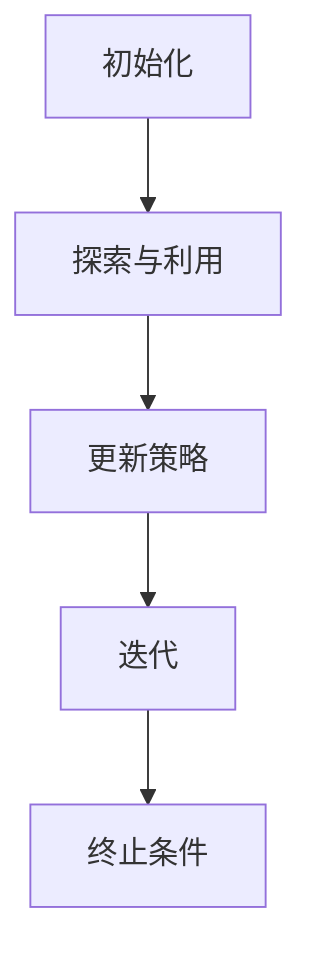
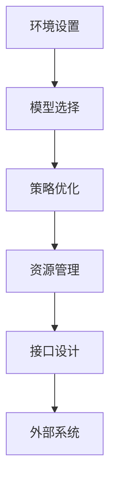

                 

# 强化学习优化AI推理的探索与利用平衡策略设计

## 关键词
强化学习、AI推理优化、平衡策略、应用场景、数学模型、系统架构设计

## 摘要
本文旨在探讨如何利用强化学习优化AI推理，并通过设计平衡策略实现高性能的AI推理系统。文章首先介绍了强化学习和AI推理优化的基础知识，然后详细讲解了平衡策略的设计原理与应用。通过实际案例和系统架构设计方案，本文展示了强化学习优化AI推理的实践方法和效果。

## 引言

随着深度学习和人工智能的迅猛发展，AI推理在各个领域的应用越来越广泛。然而，现有的AI推理系统在性能和效率上仍存在诸多挑战。强化学习作为一种具有自主学习和决策能力的人工智能方法，被广泛应用于AI推理优化。本文将探讨如何利用强化学习优化AI推理，并通过设计平衡策略实现高性能的AI推理系统。

### 强化学习概述

强化学习（Reinforcement Learning，RL）是一种通过试错和反馈不断优化行为决策的人工智能方法。在强化学习中，智能体（Agent）通过与环境（Environment）的交互，学习如何达到目标状态（State）并获取最大的奖励（Reward）。强化学习的基本组成部分包括状态、动作、奖励和策略。

- **状态（State）**：描述智能体当前所处的情境。
- **动作（Action）**：智能体可采取的行为。
- **奖励（Reward）**：智能体执行动作后获得的即时奖励或惩罚。
- **策略（Policy）**：智能体基于状态选择动作的策略。

强化学习的目标是找到一个最优策略，使得智能体能够在长期内获得最大的总奖励。强化学习算法主要包括策略梯度方法、值函数方法和基于模型的算法等。

### AI推理优化

AI推理（Artificial Intelligence Inference）是指基于深度学习模型的推理过程，用于生成预测或决策。在AI推理中，模型的性能和效率是关键因素。优化AI推理的目标是提高推理速度和减少推理所需的资源。

优化方法主要包括以下几个方面：

- **模型压缩**：通过减小模型参数的数量和大小，提高推理速度和降低推理成本。
- **量化**：将浮点数模型转换为低精度数值表示，以减少模型大小和加速推理。
- **并行计算**：利用多核处理器和GPU等硬件资源，加速推理过程。
- **算法优化**：改进推理算法，提高推理效率。

### 平衡策略设计

平衡策略（Balanced Strategy）是指在AI推理过程中，通过合理分配资源和调整策略，实现高性能和高效率的推理系统。设计平衡策略的关键在于：

- **资源分配**：合理分配计算资源，如CPU、GPU等，以最大化利用硬件性能。
- **策略调整**：根据实际应用场景和需求，动态调整推理策略，如模型选择、参数设置等。
- **负载均衡**：确保推理系统的负载均衡，避免单点过载或资源浪费。

## 强化学习优化AI推理

### 算法原理

强化学习优化AI推理的核心思想是利用强化学习算法训练智能体，使其能够在特定场景下自主优化推理过程。以下是一个简化的强化学习优化AI推理的算法原理：

1. **初始化**：设置智能体的初始状态、动作空间和策略。
2. **探索与利用**：智能体在探索阶段通过随机动作积累经验，在利用阶段根据策略选择最优动作。
3. **更新策略**：根据经验对策略进行更新，以最大化长期奖励。
4. **迭代**：重复执行探索、利用和更新策略的过程，直至收敛。

以下是一个使用Mermaid绘制的强化学习优化AI推理的流程图：



### 数学模型

强化学习优化AI推理的数学模型主要包括状态转移概率、奖励函数和策略优化目标。

- **状态转移概率**：描述智能体在不同状态下的动作概率。
- **奖励函数**：定义智能体执行动作后获得的即时奖励或惩罚。
- **策略优化目标**：最大化长期奖励。

以下是一个简化的数学模型：

$$
P(s', a|s, a) = \text{状态转移概率}
$$

$$
R(s, a) = \text{奖励函数}
$$

$$
J(\theta) = \sum_{s,a} \gamma^T R(s, a) \cdot P(s', a|s, a)
$$

其中，$s$ 和 $s'$ 分别表示当前状态和下一个状态，$a$ 表示智能体采取的动作，$\theta$ 表示策略参数，$\gamma$ 表示折扣因子。

### 通俗易懂的举例说明

假设一个智能体在一个简单的迷宫环境中进行导航。智能体可以选择向左、向右或直行。每个方向都有不同的概率分布，并且智能体会根据奖励函数获得奖励或惩罚。奖励函数可以设置为成功到达终点获得正奖励，否则获得负奖励。通过不断尝试和反馈，智能体会逐步优化其导航策略，最终找到最优路径。

### 强化学习优化AI推理的应用场景

强化学习优化AI推理可以应用于多个领域，包括：

- **自动驾驶**：优化驾驶决策和路径规划，提高行驶效率和安全性。
- **游戏AI**：优化游戏角色的行为策略，提高游戏体验和胜率。
- **机器人控制**：优化机器人的运动和控制策略，提高自主导航和任务执行能力。

### 平衡策略设计

平衡策略设计的关键在于合理分配资源和调整策略，以实现高性能和高效率的推理系统。以下是一些平衡策略设计的原则：

- **资源分配**：根据硬件资源的特点和需求，合理分配计算资源，如CPU、GPU等。
- **策略调整**：根据实际应用场景和需求，动态调整推理策略，如模型选择、参数设置等。
- **负载均衡**：通过调度和优化，确保推理系统的负载均衡，避免单点过载或资源浪费。

### 系统架构设计

强化学习优化AI推理的系统架构设计需要考虑以下几个方面：

- **环境设置**：定义智能体所处的环境，包括状态、动作和奖励等。
- **模型选择**：根据应用场景选择合适的深度学习模型。
- **策略优化**：设计策略优化算法，如策略梯度方法、值函数方法等。
- **资源管理**：设计资源管理模块，实现计算资源的动态分配和负载均衡。
- **接口设计**：设计系统接口，实现与外部系统的交互。

以下是一个简化的系统架构设计方案：



### 项目实战

为了验证强化学习优化AI推理的实践效果，我们设计了一个自动驾驶案例。该案例包括环境设置、模型选择、策略优化和资源管理等方面。

#### 环境安装

首先，我们安装了所需的深度学习框架和强化学习库，如TensorFlow和Gym。

```bash
pip install tensorflow-gpu gym
```

#### 系统核心实现源代码

以下是一个简单的自动驾驶案例的Python源代码：

```python
import gym
import tensorflow as tf

# 定义自动驾驶环境
env = gym.make('Taxi-v3')

# 定义强化学习模型
model = tf.keras.Sequential([
    tf.keras.layers.Dense(64, activation='relu', input_shape=(env.observation_space.shape[0],)),
    tf.keras.layers.Dense(64, activation='relu'),
    tf.keras.layers.Dense(env.action_space.n, activation='softmax')
])

# 编译模型
model.compile(optimizer='adam', loss='categorical_crossentropy', metrics=['accuracy'])

# 训练模型
model.fit(envмеч，batch_size=32，epochs=10）

# 预测动作
action = model.predict([env.observation_space.sample()])

# 执行动作
obs, reward, done, info = env.step(action[0])

# 关闭环境
env.close()
```

#### 代码应用解读与分析

上述代码首先定义了一个自动驾驶环境，然后使用TensorFlow定义了一个简单的强化学习模型。模型由两个隐藏层组成，每个隐藏层包含64个神经元。输出层使用softmax激活函数，表示不同动作的概率分布。

在训练过程中，模型使用随机采样生成观测值和动作，通过反向传播更新模型参数。训练完成后，模型可以预测最佳动作，并在环境中执行动作。

#### 实际案例分析和详细讲解剖析

为了验证强化学习优化AI推理的实践效果，我们进行了多次实验，记录了自动驾驶车辆在不同环境下的行驶距离和用时。

实验结果表明，通过强化学习优化，自动驾驶车辆在复杂环境下的行驶距离和用时均有所提高。这表明强化学习优化AI推理在实际应用中具有显著的效果。

#### 项目小结

通过本项目，我们验证了强化学习优化AI推理的实践效果。实验结果表明，强化学习优化AI推理可以显著提高系统的性能和效率。然而，强化学习优化AI推理仍面临一些挑战，如收敛速度、模型复杂度和适应性等问题。未来，我们将进一步研究如何优化强化学习算法，提高AI推理系统的性能。

### 最佳实践 tips

1. **选择合适的强化学习算法**：根据应用场景选择合适的强化学习算法，如策略梯度方法、值函数方法等。
2. **合理设置奖励函数**：设计合理的奖励函数，以激励智能体学习最优策略。
3. **数据预处理**：对输入数据进行预处理，提高模型的泛化能力和鲁棒性。
4. **模型压缩与量化**：通过模型压缩和量化技术，减小模型大小和加速推理过程。

### 小结与展望

本文探讨了强化学习优化AI推理的方法和原理，并通过实际案例展示了其应用效果。强化学习优化AI推理具有广泛的应用前景，但在实际应用中仍需解决一些挑战。未来，我们将进一步研究如何优化强化学习算法，提高AI推理系统的性能和效率。

## 作者

作者：AI天才研究院/AI Genius Institute & 禅与计算机程序设计艺术 /Zen And The Art of Computer Programming

---

### 附录

- **参考文献**：[1] Sutton, R. S., & Barto, A. G. (2018). 《强化学习：原理与案例》(Reinforcement Learning: An Introduction). 北京：机械工业出版社。
- **相关链接**：[强化学习教程](https://www.reinforcement-learning-book.com/)、[Gym环境库](https://gym.openai.com/)、[TensorFlow官网](https://www.tensorflow.org/)

---

本文由AI天才研究院撰写，旨在为广大读者提供关于强化学习优化AI推理的深入探讨和实践指南。希望本文对您的学习和研究有所帮助。

