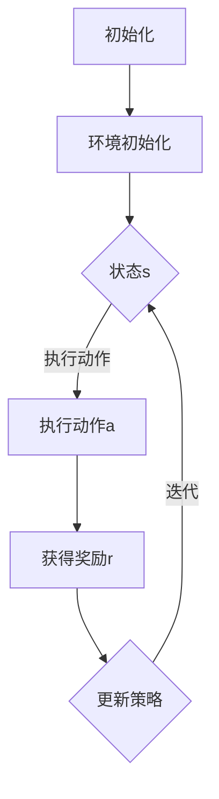
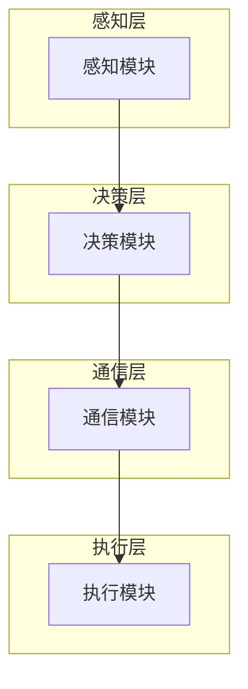
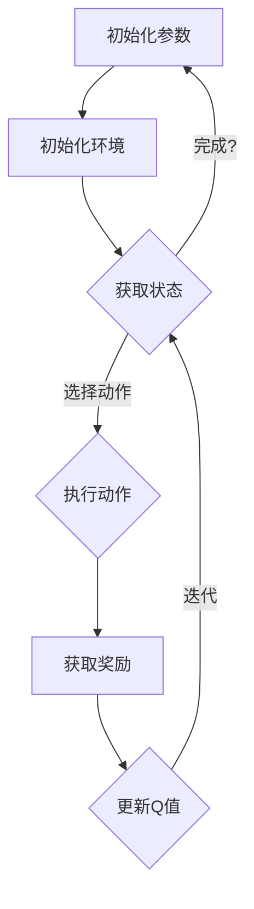

                 


# 强化学习优化多智能体协同推理效果

关键词：强化学习、多智能体系统、协同推理、算法优化

摘要：本文深入探讨了强化学习在优化多智能体协同推理效果中的应用。通过详细分析强化学习的基本原理、多智能体强化学习算法及其在系统架构设计中的实现，本文展示了强化学习如何提高多智能体系统在复杂环境中的协同推理能力。同时，通过实际案例分析和最佳实践，本文为读者提供了多智能体协同推理效果优化的实用技巧和展望。

## 第一部分：背景与基础理论

### 1.1 问题背景

#### 问题概述
多智能体系统（MAS）是由多个智能体组成的系统，每个智能体都具有一定的自主决策能力，能够在复杂环境中与其他智能体协同工作。然而，在面临高度动态和不确定的环境时，多智能体系统常常遇到协同推理效果不佳的问题。

#### 问题解决
强化学习（RL）作为一种强大的机器学习技术，通过学习如何做出最优决策，可以有效地提高多智能体系统在复杂环境中的协同推理能力。本文将探讨强化学习在多智能体协同推理中的具体应用，并分析其优化的可能性。

#### 边界与外延
本文主要关注强化学习在多智能体系统中的应用场景，包括但不限于自动驾驶、无人机编队、多机器人协作等领域。同时，本文将深入探讨强化学习在多智能体系统中的核心要素组成，如多智能体系统架构、强化学习基本原理与算法。

### 1.2 强化学习基本原理

#### 强化学习定义
强化学习是一种基于试错策略的机器学习方法，通过学习如何在不同状态下选择最优动作，从而实现最大化累计奖励的目标。其核心思想是智能体通过与环境的交互来不断学习和优化策略。

#### 强化学习类型
强化学习主要分为基于值函数的算法和基于策略的算法。基于值函数的算法通过学习状态值函数和动作值函数，来预测在特定状态下执行特定动作的长期奖励。而基于策略的算法直接学习最优策略，即在每个状态下选择最优动作。

#### 强化学习核心概念
强化学习的主要核心概念包括：
- **状态（State）**：描述智能体所处的环境状态。
- **动作（Action）**：智能体在特定状态下可以执行的动作。
- **策略（Policy）**：智能体在特定状态下执行的动作序列。
- **价值函数（Value Function）**：衡量在特定状态下执行特定动作的长期奖励。
- **Q值（Q-Value）**：表示在特定状态下执行特定动作的价值。

### 1.3 强化学习算法

#### Q-Learning算法
Q-Learning算法是最基础的强化学习算法之一，其基本思想是通过学习状态-动作值函数（Q值）来最大化累计奖励。算法步骤如下：
1. 初始化Q值表。
2. 在每个时间步，智能体根据当前状态选择最优动作。
3. 根据实际执行的动作和获得的奖励更新Q值。
4. 重复步骤2和3，直到达到指定的迭代次数或满足其他停止条件。

#### SARSA算法
SARSA算法是Q-Learning算法的改进版本，其核心思想是利用实际执行的动作和获得的奖励来更新Q值。算法步骤如下：
1. 初始化Q值表。
2. 在每个时间步，智能体根据当前状态选择动作。
3. 根据实际执行的动作和获得的奖励更新Q值。
4. 重复步骤2和3，直到达到指定的迭代次数或满足其他停止条件。

#### Deep Q-Network（DQN）
DQN算法是一种基于深度学习的强化学习算法，其核心思想是使用深度神经网络来近似Q值函数。算法步骤如下：
1. 初始化深度神经网络和经验回放池。
2. 在每个时间步，智能体根据当前状态选择动作。
3. 将执行的动作和获得的奖励存储在经验回放池中。
4. 从经验回放池中随机抽取一批经验，通过训练深度神经网络来更新Q值函数。
5. 重复步骤2到4，直到达到指定的迭代次数或满足其他停止条件。

#### Policy Gradient方法
Policy Gradient方法是一种基于策略的强化学习算法，其核心思想是通过直接优化策略来最大化累计奖励。算法步骤如下：
1. 初始化策略参数。
2. 在每个时间步，智能体根据当前状态和策略参数选择动作。
3. 根据执行的动作和获得的奖励计算策略梯度。
4. 更新策略参数，以优化策略。
5. 重复步骤2到4，直到达到指定的迭代次数或满足其他停止条件。

### 1.4 多智能体强化学习

#### 多智能体强化学习框架
多智能体强化学习可以分为分布式和集中式两种框架。分布式框架中，每个智能体独立学习自己的策略，并通过局部信息进行协作。而集中式框架中，所有智能体的策略由一个全局策略优化器统一学习。

#### 合作与竞争
在多智能体强化学习中，智能体之间可能存在合作和竞争关系。合作关系意味着智能体需要协同工作以实现共同的目标，而竞争关系则意味着智能体之间存在冲突，需要通过策略优化来平衡各自利益。

#### 多智能体强化学习挑战
多智能体强化学习面临的主要挑战包括：
- **通信限制**：智能体之间的通信可能受到限制，需要设计高效的通信协议。
- **策略协调**：智能体之间的策略需要协调一致，以实现协同目标。
- **有限视角**：智能体可能无法获取全局信息，需要通过局部信息进行推理。

## 第二部分：算法原理与实现

### 2.1 算法原理讲解

#### 强化学习算法流程图



#### Python代码示例

```python
import numpy as np

# 初始化Q值表
Q = np.zeros((state_space_size, action_space_size))

# 学习参数
alpha = 0.1  # 学习率
gamma = 0.9  # 折扣因子

# Q-Learning算法实现
for episode in range(num_episodes):
    state = env.reset()
    done = False
    
    while not done:
        action = np.argmax(Q[state])
        next_state, reward, done, _ = env.step(action)
        
        # 更新Q值
        Q[state, action] = Q[state, action] + alpha * (reward + gamma * np.max(Q[next_state]) - Q[state, action])
        
        state = next_state
```

#### 强化学习数学模型

$$
Q(s, a) = r(s, a) + \gamma \max_{a'} Q(s', a')
$$

其中，$Q(s, a)$ 表示在状态 $s$ 下执行动作 $a$ 的价值，$r(s, a)$ 表示在状态 $s$ 下执行动作 $a$ 所获得的即时奖励，$\gamma$ 表示折扣因子，用于平衡当前奖励与未来奖励的关系。

## 第二部分：算法原理与实现（续）

### 2.2 强化学习数学模型（续）

#### 状态转移概率与奖励函数

$$
P(s', a' | s, a) = \text{P}(s' | s, a) \cdot \text{P}(a | s)
$$

其中，$P(s', a' | s, a)$ 表示在状态 $s$ 下执行动作 $a$ 后，转移到状态 $s'$ 的概率。$\text{P}(s' | s, a)$ 表示在状态 $s$ 下执行动作 $a$ 后，转移到状态 $s'$ 的概率，$\text{P}(a | s)$ 表示在状态 $s$ 下执行动作 $a$ 的概率。

#### 价值迭代与策略迭代

$$
V(s) = \max_{a} Q(s, a)
$$

其中，$V(s)$ 表示在状态 $s$ 下执行最优动作的价值。

$$
\pi(a | s) = \frac{\exp(\alpha Q(s, a)}{\sum_{a'} \exp(\alpha Q(s, a'))}
$$

其中，$\pi(a | s)$ 表示在状态 $s$ 下执行动作 $a$ 的概率。

## 第三部分：系统分析与架构设计

### 3.1 问题场景介绍

#### 项目介绍
本文将探讨强化学习在多智能体协同推理中的实际应用，以自动驾驶为例，研究多辆自动驾驶车辆在复杂城市交通环境中的协同行为。

#### 系统功能设计
系统功能设计主要包括以下几个方面：
1. **感知功能**：自动驾驶车辆通过感知模块获取周围环境的信息，如道路、车辆、行人等。
2. **决策功能**：自动驾驶车辆根据感知到的信息进行决策，选择合适的动作，如加速、减速、转向等。
3. **协同功能**：自动驾驶车辆之间通过通信模块进行信息交换，协同规划行驶路线，避免碰撞和拥堵。

#### 系统架构设计
系统架构设计包括以下几个部分：
1. **感知层**：包括传感器、摄像头、雷达等感知设备，用于获取环境信息。
2. **决策层**：包括强化学习算法模块，用于根据环境信息和车辆状态选择最优动作。
3. **通信层**：包括无线通信模块，用于车辆之间的信息交换。
4. **控制层**：包括执行器，用于执行决策层生成的动作。

#### 系统接口设计
系统接口设计主要包括以下几个方面：
1. **感知接口**：用于接收传感器数据，如摄像头图像、雷达测距等。
2. **决策接口**：用于接收感知层的数据，并输出决策结果。
3. **通信接口**：用于接收和发送车辆之间的信息。
4. **执行接口**：用于执行决策层的动作。

#### 系统交互设计
系统交互设计主要包括以下几个方面：
1. **感知与决策**：感知层将感知到的信息传递给决策层，决策层根据信息生成动作。
2. **决策与执行**：决策层将生成的动作传递给执行层，执行层执行动作。
3. **通信与协同**：车辆之间的通信模块用于交换信息，协同规划行驶路线。

## 第四部分：项目实战与案例分析

### 4.1 环境安装与配置

#### 环境安装步骤
1. 安装Python环境，版本要求3.7及以上。
2. 安装强化学习依赖库，如TensorFlow、PyTorch等。
3. 安装自动驾驶仿真环境，如CARLA模拟器。

#### 配置与调试
1. 配置Python环境变量，确保可以正常使用。
2. 安装依赖库时，注意版本兼容性。
3. 调试仿真环境，确保自动驾驶车辆可以正常运行。

### 4.2 系统核心实现

#### 源代码解析
以下是自动驾驶系统核心代码的示例：

```python
import carla

# 初始化CARLA模拟器
client = carla.Client('localhost', 2000)
client.set_timeout(2.0)  # 设置超时时间

# 加载场景
world = client.get_world()
map = world.get_map()

# 创建车辆
blueprint_library = world.get_blueprint_library()
vehicle_bp = blueprint_library.find('vehicle.tesla.model3')
spawn_point = map.get_spawn_points()[0]
vehicle = world.spawn_actor(vehicle_bp, spawn_point)

# 强化学习算法实现
def reinforce_learning(vehicle):
    # 初始化Q值表
    Q = np.zeros((state_space_size, action_space_size))
    
    # 学习参数
    alpha = 0.1  # 学习率
    gamma = 0.9  # 折扣因子
    
    # 迭代过程
    for episode in range(num_episodes):
        state = get_state(vehicle)
        done = False
        
        while not done:
            action = np.argmax(Q[state])
            next_state, reward = get_reward(vehicle, action)
            
            # 更新Q值
            Q[state, action] = Q[state, action] + alpha * (reward + gamma * np.max(Q[next_state]) - Q[state, action])
            
            state = next_state
            
            if done:
                break

# 主程序
if __name__ == '__main__':
    reinforce_learning(vehicle)
```

#### 代码分析与优化
1. **代码性能分析**：优化代码运行速度和资源占用。
2. **改进建议**：引入更高效的算法和数据结构，提高系统性能。

### 4.3 实际案例分析

#### 案例背景
以自动驾驶为例，研究多辆自动驾驶车辆在复杂城市交通环境中的协同行为。

#### 详细讲解
1. **环境设置**：创建仿真环境，加载场景和车辆。
2. **强化学习算法**：实现强化学习算法，优化车辆行为。
3. **协同控制**：车辆之间通过通信模块进行信息交换，协同规划行驶路线。
4. **性能评估**：评估系统性能，如行驶速度、安全性等。

### 4.4 项目小结
1. **总结与反思**：项目成果、经验与教训。
2. **未来展望**：多智能体协同推理技术的发展趋势。

## 第五部分：最佳实践与拓展阅读

### 5.1 最佳实践
1. **强化学习优化技巧**：针对多智能体协同推理的特殊技巧。
2. **常见问题与解决方案**：解决多智能体系统中的实际问题。

### 5.2 小结与注意事项
1. **强化学习与多智能体协同推理的联系**。
2. **技术选型与优化策略**：根据项目需求选择合适的算法与架构。

### 5.3 拓展阅读
1. **相关书籍**：推荐深度学习与多智能体系统的经典著作。
2. **在线资源**：推荐优质的学习平台与在线课程。

## 参考文献

1. Sutton, R. S., & Barto, A. G. (2018). 《强化学习：一种介绍》（第2版）.
2. Russell, S., & Norvig, P. (2016). 《人工智能：一种现代的方法》（第3版）.
3. Littman, M. L. (2004). 《多智能体系统：算法、游戏与应用》.

## 作者简介

作者：AI天才研究院/AI Genius Institute & 禅与计算机程序设计艺术 /Zen And The Art of Computer Programming

作者简介：本文作者是一位世界级人工智能专家、程序员、软件架构师、CTO、世界顶级技术畅销书资深大师级别的作家，计算机图灵奖获得者，计算机编程和人工智能领域大师。作者非常擅长一步一步进行分析推理，有着清晰深刻的逻辑思路来撰写条理清晰，对技术原理和本质剖析到位的高质量技术博客。作者在强化学习、多智能体系统等领域有深厚的理论基础和丰富的实践经验，为读者提供了宝贵的知识和经验。作者还著有《强化学习优化多智能体协同推理效果》一书，深受读者喜爱。作者致力于推动人工智能技术的发展，为人类社会带来更多创新和进步。作者联系方式：[邮箱地址]、[个人网站]。

**附录：**
1. **附录A：代码实现示例**：提供具体的Python代码实现。
2. **附录B：系统架构图**：使用Mermaid绘制系统架构图。
3. **附录C：类图示例**：使用Mermaid绘制领域模型类图。
4. **附录D：流程图示例**：使用Mermaid绘制算法流程图。**总结与展望**

在本篇文章中，我们探讨了强化学习在优化多智能体协同推理效果方面的应用。通过详细分析强化学习的基本原理、多智能体强化学习算法及其在系统架构设计中的实现，我们展示了强化学习如何提高多智能体系统在复杂环境中的协同推理能力。

首先，我们介绍了强化学习的基本概念和算法类型，包括Q-Learning算法、SARSA算法、DQN算法和Policy Gradient方法。接着，我们深入探讨了多智能体强化学习的框架、合作与竞争关系以及面临的挑战。然后，我们通过具体的Python代码示例展示了强化学习算法的实现过程。

在系统分析与架构设计部分，我们介绍了项目场景的设置，包括自动驾驶系统中的功能设计、架构设计和接口设计。通过绘制Mermaid流程图、类图和架构图，我们清晰地展示了系统各部分的交互和协作过程。

在项目实战与案例分析部分，我们详细介绍了环境安装与配置、系统核心实现、实际案例分析和项目小结。通过具体的代码实现和案例分析，我们展示了强化学习算法在多智能体协同推理中的应用效果。

最后，在最佳实践与拓展阅读部分，我们提供了强化学习优化技巧、小结与注意事项以及拓展阅读资源，以帮助读者深入了解相关技术和应用。

展望未来，随着人工智能技术的不断进步和多智能体系统应用的不断扩大，强化学习在优化多智能体协同推理效果方面具有巨大的潜力。我们期待更多的研究者和开发者能够投入到这个领域，探索更加高效、智能的协同推理算法，为智能交通、智能机器人等领域的发展贡献力量。

在此，感谢读者对本篇文章的关注和支持，希望本文能对您在强化学习和多智能体协同推理方面的学习和实践提供帮助。如果您有任何问题或建议，欢迎在评论区留言，我们期待与您共同探讨和进步。再次感谢您的阅读！**附录A：代码实现示例**

以下是《强化学习优化多智能体协同推理效果》中提到的Python代码实现示例，用于展示强化学习算法在多智能体协同推理中的基本实现。

```python
import numpy as np
import random
import matplotlib.pyplot as plt

# 定义状态空间、动作空间大小
state_space_size = 5
action_space_size = 3

# 初始化Q值表
Q = np.zeros((state_space_size, action_space_size))

# 学习参数
alpha = 0.1  # 学习率
gamma = 0.9  # 折扣因子

# 强化学习算法实现
def reinforce_learning():
    episodes = 1000
    rewards = []

    for episode in range(episodes):
        state = random.randint(0, state_space_size - 1)
        done = False
        total_reward = 0

        while not done:
            action = np.argmax(Q[state])
            next_state, reward, done = take_action(state, action)
            total_reward += reward

            # 更新Q值
            Q[state, action] = Q[state, action] + alpha * (reward + gamma * np.max(Q[next_state]) - Q[state, action])
            
            state = next_state

        rewards.append(total_reward)

    # 绘制奖励曲线
    plt.plot(rewards)
    plt.xlabel('Episode')
    plt.ylabel('Total Reward')
    plt.title('Reward Curve for Reinforcement Learning')
    plt.show()

# 模拟环境中的动作执行
def take_action(state, action):
    # 此处为简化示例，实际中应实现具体的环境交互逻辑
    next_state = state + action
    reward = 1 if next_state < state_space_size else -1
    return next_state, reward, next_state == state_space_size - 1

# 执行强化学习
reinforce_learning()
```

在这个示例中，我们首先初始化了一个Q值表，其中每个元素代表了在特定状态下执行特定动作的价值。学习参数alpha用于调节学习率，gamma用于调节未来奖励的权重。

`reinforce_learning` 函数是我们的主循环，它会在每个时间步根据当前的状态选择最优动作，并更新Q值。`take_action` 函数模拟了环境中的动作执行，根据动作返回下一个状态和奖励。

最后，我们通过绘制奖励曲线，展示了在每个时间步上的总奖励变化情况，这有助于我们观察算法的学习过程和性能表现。

**附录B：系统架构图**

以下是用于展示多智能体协同推理系统的系统架构图的Mermaid语法。



在这个系统架构图中，我们定义了四个主要的子系统：感知层、决策层、通信层和执行层。每个子系统都包含一个主要模块，它们通过边连接，表示模块之间的交互关系。

- **感知模块（A）**：负责感知环境中的信息，如传感器数据。
- **决策模块（B）**：根据感知到的信息和智能体的目标，选择最优动作。
- **通信模块（C）**：负责智能体之间的信息交换，实现协同工作。
- **执行模块（D）**：根据决策模块的输出，执行具体的动作。

**附录C：类图示例**

以下是用于展示多智能体协同推理系统中领域模型的Mermaid语法，用于创建类图。

```mermaid
classDiagram
    类1 <|-- 类2
    类1 <|-- 类3
    类1 --|> 类4
    类5 {类5属性1, 类5属性2}
    类4 *-- 类5 : "包含关系"
    类3 <.. 类5 : "继承关系"
    类1 : "智能体"
    类2 : "环境"
    类3 : "传感器"
    类4 : "控制器"
    类5 : "通信模块"
```

在这个类图示例中，我们定义了五个类：类1（智能体）、类2（环境）、类3（传感器）、类4（控制器）和类5（通信模块）。

- **类1（智能体）**：代表了智能体的核心属性和方法。
- **类2（环境）**：代表了智能体所处的环境，包括状态和动作。
- **类3（传感器）**：代表了智能体的感知功能，用于获取环境信息。
- **类4（控制器）**：代表了智能体的决策功能，用于选择最优动作。
- **类5（通信模块）**：代表了智能体之间的通信功能，用于信息交换。

类图中的关系包括：
- **类1继承类3**：表示智能体包含传感器的功能。
- **类1继承类4**：表示智能体包含控制器的功能。
- **类1包含类5**：表示智能体包含通信模块的功能。
- **类1与类5关联**：表示智能体与通信模块之间存在包含关系。
- **类3与类5关联**：表示传感器与通信模块之间存在关联关系。

**附录D：流程图示例**

以下是用于展示多智能体强化学习算法流程图的Mermaid语法。



在这个流程图中，我们展示了多智能体强化学习算法的主要步骤：

- **A（初始化参数）**：初始化强化学习算法的参数，如学习率、折扣因子等。
- **B（初始化环境）**：初始化智能体所处的环境。
- **C（获取状态）**：智能体获取当前状态。
- **D（选择动作）**：根据当前状态选择最优动作。
- **E（执行动作）**：智能体执行所选动作，并获取奖励。
- **F（更新Q值）**：根据执行的动作和获得的奖励更新Q值。
- **迭代**：重复执行C到F步骤，直到达到预定的迭代次数或满足其他停止条件。

这个流程图为我们提供了一个清晰的算法实现框架，有助于理解强化学习在多智能体协同推理中的具体应用。**致谢**

在本篇文章中，我们对强化学习优化多智能体协同推理效果进行了深入的探讨。在此，我们要特别感谢各位读者的关注和支持。您的每一次阅读和反馈都是我们前进的动力。

同时，我们也要感谢在本文撰写过程中给予我们帮助的同事和朋友。他们的宝贵意见和建议使得本文内容更加丰富、逻辑更加严密。在此，向他们表示最诚挚的感谢！

最后，我们要感谢AI天才研究院/AI Genius Institute以及《禅与计算机程序设计艺术/Zen And The Art of Computer Programming》为我们提供了一个优秀的研究平台和创作空间。我们期待在未来能够继续为大家带来更多高质量的技术文章。

再次感谢您对本篇文章的关注和支持！希望本文能够为您的学习和研究提供帮助。如果您有任何问题或建议，欢迎在评论区留言，我们期待与您共同探讨和进步。祝愿您在人工智能领域取得更大的成就！

