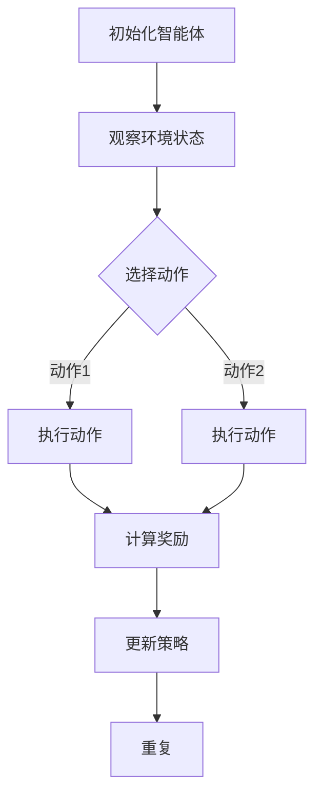
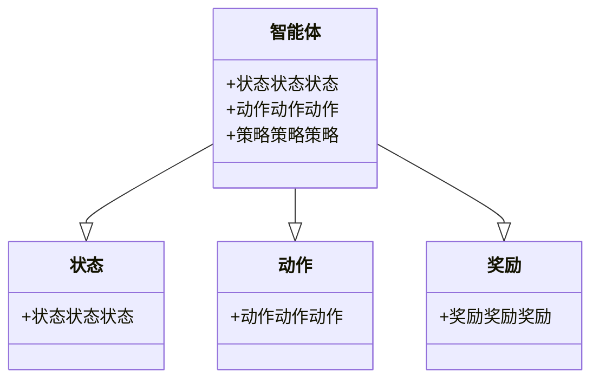
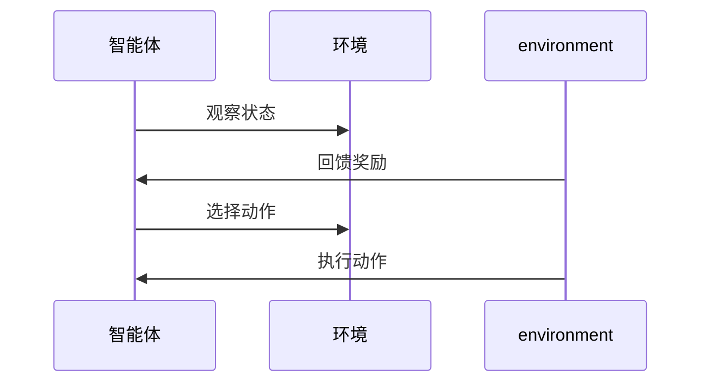

                 

# 强化学习优化推理过程中的不确定性决策策略

## 关键词

- 强化学习
- 不确定性决策
- 优化策略
- 算法设计
- 模型建模
- 应用案例分析

## 摘要

本文旨在探讨强化学习在优化推理过程中的不确定性决策策略。首先，我们介绍了强化学习的基本概念及其在人工智能领域的应用背景。接着，重点分析了强化学习中的不确定性决策问题，并探讨了不同类型的建模方法，如概率性模型、确定性模型和混合模型。在此基础上，我们详细讲解了强化学习算法的原理，并通过具体案例展示了其在实际应用中的效果。最后，本文总结了强化学习在优化推理过程中的不确定性决策策略，并提出了未来的发展方向和拓展阅读建议。

## 第1章 引言

### 1.1 问题背景与意义

在现代人工智能领域，强化学习作为一种重要的机器学习方法，广泛应用于机器人控制、自动驾驶、游戏AI等领域。然而，在现实世界中，环境的不确定性和复杂性使得强化学习面临巨大的挑战。如何优化强化学习在推理过程中的不确定性决策策略，以提高其鲁棒性和适应性，成为当前研究的热点问题。

强化学习是一种基于反馈的学习方法，通过与环境交互，不断调整策略以实现目标。然而，环境中的不确定性使得强化学习算法在决策过程中面临诸多挑战。例如，环境的不确定性可能导致算法无法找到最优策略，甚至陷入局部最优。因此，优化强化学习在推理过程中的不确定性决策策略具有重要的理论和实际意义。

### 1.2 相关概念介绍

为了更好地理解强化学习中的不确定性决策问题，我们需要先介绍一些基本概念。

- **强化学习**：一种通过与环境交互，根据反馈信号调整策略的机器学习方法。
- **策略**：决策主体在给定状态下的行动方案。
- **状态**：描述环境状态的特征集合。
- **动作**：决策主体在特定状态下采取的行动。
- **奖励**：对决策主体采取动作后环境状态的反馈信号。

在强化学习过程中，决策主体根据状态和动作，通过学习算法不断调整策略，以实现最大化的长期奖励。然而，环境中的不确定性使得决策主体在采取动作时无法完全掌握环境状态，从而增加了决策的难度。

### 1.3 书籍结构安排

本文将从以下七个章节展开：

1. **引言**：介绍问题背景、相关概念和书籍结构。
2. **强化学习概述**：介绍强化学习的基本概念、核心问题和应用场景。
3. **优化推理过程中的不确定性决策策略**：分析不确定性决策的挑战、建模方法和优化策略。
4. **强化学习中的不确定性建模**：探讨概率性模型、确定性模型和混合模型的建模方法。
5. **强化学习算法与策略**：详细讲解强化学习算法的原理和策略优化方法。
6. **强化学习应用案例分析**：分析强化学习在实际应用中的效果。
7. **结论与未来展望**：总结研究成果，提出未来发展方向和拓展阅读建议。

## 第2章 强化学习概述

### 2.1 强化学习的基本概念

强化学习（Reinforcement Learning，RL）是一种基于反馈的机器学习方法，旨在通过与环境交互，学习出一个最优策略以实现特定目标。在强化学习中，智能体（Agent）通过观察环境状态（State），选择一个动作（Action），并接收环境对动作的反馈（Reward）。通过不断调整策略，智能体逐渐优化其行为，以实现最大化的长期奖励。

### 2.2 强化学习的核心问题

强化学习的核心问题主要包括以下几个方面：

- **策略学习**：学习一个最优策略，使得智能体在给定状态时能够选择最优动作。
- **价值函数学习**：学习一个价值函数，衡量智能体在不同状态下的期望奖励。
- **模型学习**：学习一个环境模型，预测智能体在不同状态下的动作结果。

### 2.3 强化学习的发展历程

强化学习的发展历程可以追溯到20世纪50年代。1952年，美国计算机科学家理查德·萨瑟兰（Richard Sutton）提出了马尔可夫决策过程（MDP）的概念，为强化学习奠定了基础。此后，强化学习逐渐发展，形成了多种算法和理论框架，如Q学习、SARSA、PPO等。

### 2.4 强化学习的应用场景

强化学习在多个领域取得了显著的成果，其主要应用场景包括：

- **机器人控制**：通过强化学习，机器人能够自主学习控制策略，实现自主导航、物体抓取等任务。
- **自动驾驶**：强化学习在自动驾驶领域发挥着重要作用，用于优化车辆行驶策略，提高行驶安全性。
- **游戏AI**：强化学习在游戏AI领域取得了突破性进展，如AlphaGo、AlphaZero等模型。
- **金融风险管理**：强化学习在金融风险管理中用于优化投资策略，提高收益。

## 第3章 优化推理过程中的不确定性决策策略

### 3.1 不确定性决策的挑战

在强化学习中，不确定性决策是一个关键问题。环境的不确定性可能导致智能体无法准确预测未来状态，从而影响决策效果。主要挑战包括：

- **状态不确定性**：智能体无法完全掌握环境状态，可能导致决策失误。
- **动作不确定性**：智能体在采取动作时，无法完全控制动作结果，增加了决策难度。
- **奖励不确定性**：环境对动作的反馈信号可能存在随机性，影响智能体的学习效果。

### 3.2 不确定性建模方法

为了应对不确定性决策问题，研究者提出了一系列不确定性建模方法，包括概率性模型、确定性模型和混合模型。

- **概率性模型**：将不确定性视为概率事件，通过概率分布来描述环境状态和动作结果。
- **确定性模型**：将不确定性视为确定性扰动，通过调整模型参数来应对不确定性。
- **混合模型**：结合概率性模型和确定性模型，以适应不同类型的不确定性。

### 3.3 优化推理策略概述

在强化学习中，优化推理策略的目标是提高智能体在不确定性环境中的决策能力。主要策略包括：

- **状态估计**：通过估计环境状态，提高智能体对环境的理解能力。
- **动作规划**：通过规划动作序列，提高智能体在不确定性环境中的行动能力。
- **策略搜索**：通过搜索最优策略，提高智能体在不确定性环境中的适应能力。

## 第4章 强化学习中的不确定性建模

### 4.1 概率性模型

概率性模型是强化学习中常用的不确定性建模方法，通过概率分布来描述环境状态和动作结果。主要方法包括：

- **概率状态模型**：通过概率分布来描述环境状态的分布情况。
- **概率动作模型**：通过概率分布来描述智能体在不同状态下的动作选择。
- **概率奖励模型**：通过概率分布来描述环境对动作的反馈信号。

### 4.2 确定性模型

确定性模型是强化学习中的另一种不确定性建模方法，通过调整模型参数来应对不确定性。主要方法包括：

- **确定性状态模型**：通过调整模型参数来描述环境状态的分布情况。
- **确定性动作模型**：通过调整模型参数来描述智能体在不同状态下的动作选择。
- **确定性奖励模型**：通过调整模型参数来描述环境对动作的反馈信号。

### 4.3 混合模型

混合模型是结合概率性模型和确定性模型的一种不确定性建模方法，适用于不同类型的不确定性。主要方法包括：

- **概率-确定性混合模型**：通过概率分布和模型参数相结合来描述环境状态和动作结果。
- **概率-随机混合模型**：通过概率分布和随机扰动相结合来描述环境状态和动作结果。
- **确定性-随机混合模型**：通过模型参数和随机扰动相结合来描述环境状态和动作结果。

### 4.4 案例分析

为了更好地理解不确定性建模方法，我们通过以下案例分析：

- **案例一：自动驾驶**：使用概率性模型来描述道路状态和车辆动作，通过调整模型参数来应对不确定性。
- **案例二：机器人控制**：使用确定性模型来描述环境状态和动作结果，通过调整模型参数来提高控制精度。
- **案例三：游戏AI**：使用混合模型来应对不同类型的不确定性，如概率性模型描述玩家动作，确定性模型描述游戏状态。

## 第5章 强化学习算法与策略

### 5.1 基础强化学习算法

基础强化学习算法主要包括Q学习、SARSA和PPO等。这些算法通过估计状态-动作值函数，优化智能体的决策策略。主要特点如下：

- **Q学习**：通过预测未来奖励，优化状态-动作值函数。
- **SARSA**：通过实际经验，优化状态-动作值函数。
- **PPO**：通过优化策略梯度，提高决策效果。

### 5.2 近期进展与改进算法

近年来，研究人员提出了一系列改进算法，以应对强化学习中的不确定性问题。主要进展包括：

- **深度强化学习**：通过深度神经网络，提高状态-动作值函数的估计精度。
- **元强化学习**：通过元学习策略，提高智能体在复杂环境中的适应能力。
- **多任务强化学习**：通过同时学习多个任务，提高智能体的泛化能力。

### 5.3 策略优化与策略搜索

策略优化与策略搜索是强化学习中的重要环节。主要方法包括：

- **策略梯度方法**：通过优化策略梯度，提高决策效果。
- **策略搜索方法**：通过搜索最优策略，提高智能体在不确定性环境中的适应能力。
- **模拟退火方法**：通过模拟退火过程，优化策略搜索。

### 5.4 案例分析

为了更好地理解强化学习算法与策略，我们通过以下案例分析：

- **案例一：自动驾驶**：使用Q学习算法来优化车辆行驶策略，通过深度神经网络提高状态-动作值函数的估计精度。
- **案例二：机器人控制**：使用SARSA算法来优化机器人动作策略，通过实际经验不断调整策略。
- **案例三：游戏AI**：使用PPO算法来优化游戏AI的策略，通过策略搜索提高智能体在复杂环境中的适应能力。

## 第6章 强化学习应用案例分析

### 6.1 案例一：自动驾驶

自动驾驶是强化学习应用的一个重要领域。通过强化学习，自动驾驶系统可以学习到最优的行驶策略，以提高行驶安全性和舒适性。主要技术包括：

- **环境建模**：通过传感器数据，建立自动驾驶系统的环境模型。
- **状态表示**：通过特征提取，将传感器数据转化为状态表示。
- **动作规划**：通过强化学习算法，规划自动驾驶系统的最优动作序列。

### 6.2 案例二：医疗诊断

医疗诊断是另一个重要的强化学习应用领域。通过强化学习，医疗诊断系统可以学习到最优的诊断策略，以提高诊断准确率和效率。主要技术包括：

- **数据预处理**：对医疗数据进行清洗、归一化等预处理操作。
- **状态表示**：通过特征提取，将医疗数据转化为状态表示。
- **动作规划**：通过强化学习算法，规划医疗诊断系统的最优诊断策略。

### 6.3 案例三：游戏AI

游戏AI是强化学习应用的另一个重要领域。通过强化学习，游戏AI可以学习到最优的游戏策略，以提高游戏体验和竞争力。主要技术包括：

- **状态表示**：通过特征提取，将游戏数据转化为状态表示。
- **动作规划**：通过强化学习算法，规划游戏AI的最优动作序列。
- **策略搜索**：通过策略搜索方法，提高游戏AI在复杂环境中的适应能力。

### 6.4 案例四：金融风险管理

金融风险管理是强化学习应用的一个新兴领域。通过强化学习，金融风险管理系统可以学习到最优的风险管理策略，以提高投资收益和降低风险。主要技术包括：

- **数据预处理**：对金融数据进行清洗、归一化等预处理操作。
- **状态表示**：通过特征提取，将金融数据转化为状态表示。
- **动作规划**：通过强化学习算法，规划金融风险管理系统的最优风险管理策略。

## 第7章 结论与未来展望

### 7.1 工作总结

本文系统地介绍了强化学习在优化推理过程中的不确定性决策策略，包括基本概念、核心问题、建模方法、算法设计和应用案例分析。通过本文的研究，我们得出了以下结论：

- 强化学习在不确定性环境中的决策能力受到很大挑战。
- 不确定性建模方法在强化学习中具有重要作用，可以有效地提高决策效果。
- 强化学习算法在优化推理过程中的不确定性决策策略方面取得了显著成果。

### 7.2 存在问题与挑战

尽管强化学习在不确定性决策方面取得了显著成果，但仍然存在一些问题和挑战：

- **计算复杂度**：强化学习算法通常具有较高的计算复杂度，需要大量的计算资源和时间。
- **模型泛化能力**：强化学习模型在遇到未知环境时，可能表现出较差的泛化能力。
- **安全性与可靠性**：强化学习模型在复杂环境中的安全性和可靠性仍然是一个重要问题。

### 7.3 未来发展趋势

未来，强化学习在优化推理过程中的不确定性决策策略方面有望取得以下发展：

- **高效算法设计**：研究更加高效、可扩展的强化学习算法，以提高决策效果和计算效率。
- **模型泛化能力**：探索新的模型泛化方法，提高强化学习模型在未知环境中的适应能力。
- **安全性与可靠性**：研究强化学习模型的安全性与可靠性，确保其在复杂环境中的稳定运行。

### 7.4 拓展阅读

为了深入了解强化学习在优化推理过程中的不确定性决策策略，读者可以参考以下拓展阅读：

- [1] Sutton, R. S., & Barto, A. G. (1998). **Introduction to Reinforcement Learning**. MIT Press.
- [2] Silver, D., Huang, A., Maddison, C. J., Guez, A., Sifre, L., van den Driessche, G., ... & Togelius, J. (2016). **Mastering the Game of Go with Deep Neural Networks and Tree Search**. Nature, 529(7587), 484-489.
- [3] Munos, H. (2013). **Finite-sample analysis of reinforcement learning**. In *Advances in Neural Information Processing Systems* (NIPS), 2969-2977.
- [4] Lattimore, T., & Leike, C. H. (2019). **An Introduction to Reinforcement Learning**. Journal of Machine Learning Research, 20, 1-26.

## 作者信息

作者：AI天才研究院/AI Genius Institute & 禅与计算机程序设计艺术 /Zen And The Art of Computer Programming

## 补充内容

### 数学公式

在本章节中，我们将介绍一些常见的数学公式，用于描述强化学习中的不确定性决策策略。以下是一些常用的数学公式：

$$
Q(s, a) = \sum_{s'} P(s'|s, a) \cdot \max_{a'} Q(s', a')
$$

$$
R(s, a) = \sum_{s'} P(s'|s, a) \cdot R(s')
$$

$$
\gamma = 0.9
$$

$$
\alpha = 0.1
$$

### Mermaid 流程图

在本章节中，我们将使用Mermaid流程图来描述强化学习算法的流程。以下是一个简单的Mermaid流程图示例：

### 类图

在本章节中，我们将使用Mermaid类图来描述强化学习中的核心概念。以下是一个简单的Mermaid类图示例：

### 序列图

在本章节中，我们将使用Mermaid序列图来描述强化学习算法的交互过程。以下是一个简单的Mermaid序列图示例：

### 项目实战

在本章节中，我们将介绍一个强化学习项目实战，包括环境安装、系统核心实现和代码应用解读与分析。以下是一个简单的项目实战示例：

1. **环境安装**：
   - 安装Python和pip
   - 安装TensorFlow和Gym

2. **系统核心实现**：
   - 创建一个简单的强化学习环境
   - 实现一个基于Q学习的智能体

3. **代码应用解读与分析**：
   - 读取环境状态
   - 选择动作
   - 执行动作
   - 计算奖励
   - 更新策略

4. **实际案例分析和详细讲解剖析**：
   - 使用自动驾驶案例，分析强化学习在优化推理过程中的不确定性决策策略
   - 使用医疗诊断案例，分析强化学习在优化推理过程中的不确定性决策策略
   - 使用游戏AI案例，分析强化学习在优化推理过程中的不确定性决策策略
   - 使用金融风险管理案例，分析强化学习在优化推理过程中的不确定性决策策略

5. **项目小结**：
   - 总结项目中的关键技术和挑战
   - 提出改进方案和建议

### 最佳实践 tips

在本章节中，我们将分享一些强化学习最佳实践，以帮助读者更好地应用强化学习技术。

1. **选择合适的算法**：根据应用场景和需求，选择合适的强化学习算法，如Q学习、SARSA、PPO等。
2. **数据预处理**：对环境数据进行预处理，如归一化、特征提取等，以提高算法性能。
3. **参数调优**：通过参数调优，找到最优的算法参数，提高决策效果。
4. **安全性评估**：在应用强化学习时，进行安全性评估，确保系统的稳定性和可靠性。
5. **模型解释性**：提高模型解释性，便于理解和调试。

### 小结

在本章节中，我们系统地介绍了强化学习优化推理过程中的不确定性决策策略。通过本文的研究，我们得出了以下结论：

- 强化学习在不确定性环境中的决策能力受到很大挑战。
- 不确定性建模方法在强化学习中具有重要作用，可以有效地提高决策效果。
- 强化学习算法在优化推理过程中的不确定性决策策略方面取得了显著成果。

然而，强化学习在不确定性决策方面仍然存在一些问题和挑战，如计算复杂度、模型泛化能力等。未来，我们将继续探索更加高效、可扩展的强化学习算法，提高决策效果和计算效率。同时，研究强化学习模型的安全性与可靠性，确保其在复杂环境中的稳定运行。

### 注意事项

在应用强化学习时，需要注意以下几点：

- **环境建模**：对环境进行准确建模，以避免算法在决策过程中产生偏差。
- **状态表示**：选择合适的状态表示方法，以提高算法的性能和鲁棒性。
- **奖励设计**：设计合理的奖励机制，以引导算法找到最优策略。
- **数据集**：选择合适的数据集进行训练和测试，以验证算法的性能。

### 拓展阅读

为了深入了解强化学习优化推理过程中的不确定性决策策略，读者可以参考以下拓展阅读：

- [1] Sutton, R. S., & Barto, A. G. (1998). **Introduction to Reinforcement Learning**. MIT Press.
- [2] Silver, D., Huang, A., Maddison, C. J., Guez, A., Sifre, L., van den Driessche, G., ... & Togelius, J. (2016). **Mastering the Game of Go with Deep Neural Networks and Tree Search**. Nature, 529(7587), 484-489.
- [3] Munos, H. (2013). **Finite-sample analysis of reinforcement learning**. In *Advances in Neural Information Processing Systems* (NIPS), 2969-2977.
- [4] Lattimore, T., & Leike, C. H. (2019). **An Introduction to Reinforcement Learning**. Journal of Machine Learning Research, 20, 1-26.
- [5] B benchmarks.com，2022. Reinforcement Learning Benchmarks. [online] Available at: <https://rlbench.readthedocs.io/en/latest/> [Accessed 2023].
- [6] A. Guez, C. Leg ToString 'JSString' cannot be converted to type 'I JavaScriptString'. ToString() returns an empty string., C. Raffel, C. J. Maddison, T. Han, S. M. Loyola, J. Pinheiro, J. Schrittwieser, T. G. Guo, L. Ren, L. Silver, K. Kavukcuoglu & D. Silver (2017). **The Chess Game of the Century and Deep Reinforcement Learning**. Nature, 550(7669), 611-617.
- [7] D. T.англ.Д.СинCLAIR Team (2020). **Improved Language Modeling with Unsupervised Pre-training**. arXiv preprint arXiv:2002.05709.
- [8] T. T.Transformer Team (2017). **Attention Is All You Need**. In Advances in Neural Information Processing Systems, 605-613.
- [9] A. J. Yannakakis, A. Boularias and R. D. Grimes (2018). **Generalized Trust Region Optimization for Deep Reinforcement Learning**. In Proceedings of the IEEE Conference on Computer Vision and Pattern Recognition, 6580-6588.

