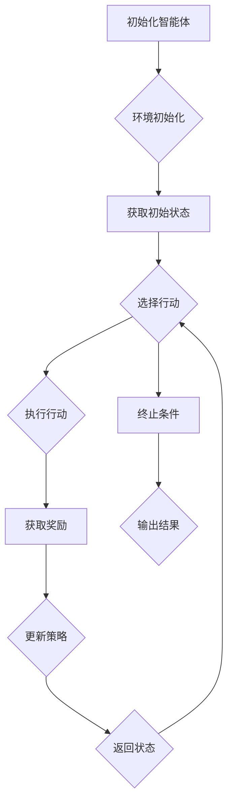
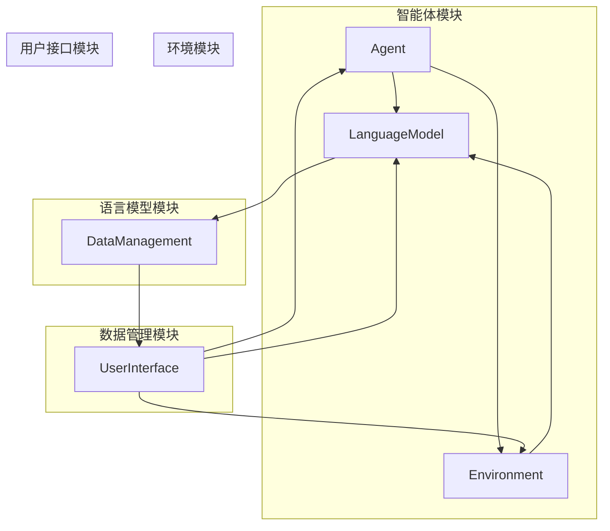
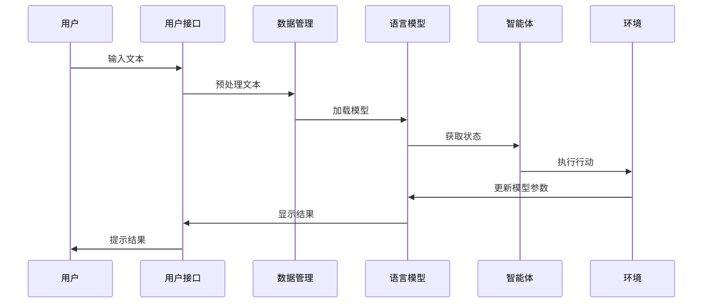

                 

## 文章标题

# 强化学习优化语言模型推理过程

强化学习（Reinforcement Learning）作为一种机器学习的重要分支，其核心在于通过不断尝试和反馈来优化决策过程。随着自然语言处理（Natural Language Processing, NLP）的不断发展，语言模型在诸多应用场景中发挥着关键作用。然而，在处理大规模语言数据时，语言模型的推理过程往往面临效率与准确性的双重挑战。本文将探讨如何利用强化学习优化语言模型的推理过程，提高其性能和效率。

关键词：
- 强化学习
- 语言模型
- 推理过程
- 优化
- 性能提升

摘要：
本文首先介绍了强化学习和语言模型的基础概念，然后分析了传统推理过程中的问题与挑战。接着，本文详细阐述了强化学习在优化语言模型推理过程中的应用，包括算法设计、系统架构和实际案例。最后，本文总结了最佳实践和未来研究方向，为提升语言模型推理性能提供了新的思路。

## 引言

在当今的数据驱动时代，强化学习（Reinforcement Learning, RL）作为一种重要的机器学习技术，已广泛应用于智能控制、游戏、推荐系统等领域。其核心在于通过与环境互动来学习决策策略，以最大化累计奖励。与监督学习和无监督学习相比，强化学习具有更强的自适应性和灵活性。

与此同时，自然语言处理（Natural Language Processing, NLP）作为人工智能的重要分支，已经成为学术界和工业界的热点研究方向。语言模型（Language Model, LM）作为NLP的核心组件，能够在各种应用场景中生成、理解和处理自然语言文本。然而，随着语言数据的规模和复杂度不断增长，传统的推理过程往往面临效率低、资源消耗大等问题。

本篇文章旨在探讨如何利用强化学习优化语言模型的推理过程，以提高其性能和效率。具体来说，本文将涵盖以下几个方面的内容：

1. **强化学习和语言模型的基础概念**：介绍强化学习和语言模型的基本原理，包括其核心概念、属性特征对比表格和ER实体关系图架构。
2. **传统推理过程中的问题与挑战**：分析传统推理过程中存在的问题，如效率低下、资源消耗大等，并提出相应的优化需求。
3. **强化学习在优化推理过程中的应用**：详细阐述强化学习算法的设计和实现，包括算法原理、数学模型和公式，以及Python代码示例。
4. **系统架构与设计**：介绍优化后的系统架构，包括系统功能设计、系统架构图、系统接口设计和系统交互序列图。
5. **项目实战**：通过一个实际项目案例，详细分析环境安装、系统核心实现、代码应用解读、实际案例分析和项目小结。
6. **最佳实践与未来研究方向**：总结最佳实践，提出注意事项和拓展阅读，探讨未来研究方向。

通过本文的讨论，我们希望为读者提供一种新的视角，以更好地理解和应用强化学习优化语言模型的推理过程。

## 强化学习的基础概念

强化学习（Reinforcement Learning）是机器学习的一个重要分支，主要研究如何通过试错和反馈来学习最优策略。在强化学习中，智能体（Agent）通过与环境（Environment）互动，接收环境状态（State），并在此基础上选择行动（Action）。智能体的目标是最大化累计奖励（Reward），以实现最佳决策。

### 核心概念

1. **智能体（Agent）**：执行任务的主体，可以是机器人、软件代理等。
2. **环境（Environment）**：智能体所处的情境，能够对智能体的行为产生反馈。
3. **状态（State）**：描述智能体当前所处的环境条件，通常是一个多维向量。
4. **行动（Action）**：智能体在特定状态下可以选择的操作，也是一个多维向量。
5. **奖励（Reward）**：智能体执行某个行动后从环境中获得的即时奖励，用于指导智能体的学习过程。
6. **策略（Policy）**：智能体在特定状态下的最佳行动选择规则，是一个函数或映射。

### 核心算法

强化学习算法可以分为两大类：值函数方法（Value-Based Methods）和策略优化方法（Policy-Based Methods）。

1. **值函数方法**：
   - **Q学习（Q-Learning）**：通过学习状态-行动值函数（Q-Function）来优化策略。
   - **深度Q网络（Deep Q-Network, DQN）**：使用深度神经网络来近似Q函数。
   - **即时回报优势（Advantage）**：通过比较即时回报和期望回报来优化策略。

2. **策略优化方法**：
   - **策略梯度方法（Policy Gradient Methods）**：直接优化策略参数，以最大化累计奖励。
   - **演员-评论家（Actor-Critic Methods）**：结合策略评估和策略优化的方法，通过评估现有策略并更新策略参数。

### 性质对比表格

| 算法 | 目标函数 | 特点 | 应用场景 |
| --- | --- | --- | --- |
| Q学习 | $Q(s, a) = r + \gamma \max_{a'} Q(s', a')$ | 基础算法，适用于离散状态和行动空间 | 游戏控制、机器人导航 |
| DQN | $Q(s, a) = r + \gamma \max_{a'} \hat{Q}(s', a')$ | 使用深度神经网络近似Q函数 | 环境复杂、高维状态空间 |
| actor-critic | $\pi(a|s) \propto \exp(\alpha \cdot \nabla_{\theta_\pi} \ln \pi(a|s))$ | 结合策略评估和策略优化 | 非线性、高维状态空间 |
| REINFORCE | $J(\theta) = \sum_{t} \rho_t \nabla_{\theta_\pi} \ln \pi(a_t|s_t, \theta)$ | 直接优化策略参数 | 非线性、高维状态空间 |

### ER实体关系图架构

为了更好地理解强化学习的核心组件，我们可以使用Mermaid图来绘制ER实体关系图。以下是强化学习中的主要实体及其关系：

```mermaid
erDiagram
  State ||--o> Action : 生成
  Action ||--o> Reward : 接收
  Reward ||--o> State : 更新
  State ||--o> Policy : 选择
  Policy ||--o> Action : 执行
```

通过以上基础概念和算法的介绍，读者可以初步了解强化学习的基本原理和应用。接下来，我们将探讨语言模型的基础概念，并分析两者之间的关系。

## 语言模型的基础概念

语言模型（Language Model, LM）是自然语言处理（Natural Language Processing, NLP）的核心组件之一，用于生成、理解和处理自然语言文本。语言模型通过学习大量文本数据，预测句子或词汇的分布，从而在诸多应用场景中发挥重要作用。

### 核心概念

1. **词汇表（Vocabulary）**：语言模型中的词汇表包含所有可能出现的词汇和符号。通常使用**Word2Vec**、**BERT**等词向量模型来表示词汇。
2. **概率分布（Probability Distribution）**：语言模型的目标是学习文本数据中的概率分布。具体来说，语言模型会学习如何根据历史数据预测下一个单词或句子。
3. **参数（Parameters）**：语言模型通过训练学习到一组参数，用于表示词汇之间的概率关系。这些参数可以是线性模型中的权重，也可以是深度神经网络中的权重。
4. **损失函数（Loss Function）**：用于衡量模型预测与实际数据之间的差异。常见的损失函数包括交叉熵损失（Cross-Entropy Loss）、均方误差损失（Mean Squared Error Loss）等。

### 概念属性特征对比表格

为了更好地理解语言模型的基本属性，我们可以通过对比不同的语言模型来展示其特点。以下是比较几种常见语言模型的属性特征表格：

| 模型 | 特点 | 应用场景 |
| --- | --- | --- |
| 基本语言模型 | 简单的统计模型，基于n-gram方法 | 文本生成、搜索查询 |
| Word2Vec | 将词汇映射到高维空间，学习词向量 | 文本分类、情感分析 |
| BERT | 使用Transformer架构，预训练语言表示 | 文本分类、问答系统 |
| GPT | 自回归语言模型，生成高质量的文本 | 文本生成、对话系统 |
| T5 | 零样本学习，将自然语言任务转化为文本生成任务 | 多样化的NLP任务 |

### ER实体关系图架构

为了进一步理解语言模型的核心组件及其关系，我们可以使用Mermaid图来绘制ER实体关系图。以下是语言模型中的主要实体及其关系：

```mermaid
erDiagram
  Sentence ||--o> Vocabulary : 包含
  Vocabulary ||--o> WordVector : 表示
  WordVector ||--o> ProbabilityDistribution : 计算概率
  ProbabilityDistribution ||--o> LossFunction : 评估
  LossFunction ||--o> Parameters : 更新
  Parameters ||--o> Model : 组成模型
```

通过上述介绍，我们可以看到强化学习和语言模型各自的核心概念及其关系。接下来，我们将探讨如何将强化学习应用于语言模型推理过程的优化。

## 强化学习在优化推理过程中的应用

将强化学习（Reinforcement Learning, RL）应用于优化语言模型（Language Model, LM）的推理过程，是提升模型性能和效率的有效方法。通过结合RL与LM的机制，可以设计出能够自适应调整推理策略的智能系统。以下是强化学习在优化推理过程中的具体应用方法：

### 算法设计

强化学习优化语言模型推理的基本思路是：通过智能体（Agent）与环境（Environment）的互动，不断调整推理策略（Policy），以最大化累积奖励（Reward）。具体来说，可以设计以下算法：

1. **智能体（Agent）**：智能体负责执行推理任务，并选择最优的推理步骤。
2. **环境（Environment）**：环境模拟语言模型的实际推理过程，提供状态（State）和奖励（Reward）。
3. **状态（State）**：状态包括当前的语言模型输入、中间推理结果等。
4. **行动（Action）**：行动是智能体在特定状态下选择的推理步骤，如选择词汇、调整参数等。
5. **奖励（Reward）**：奖励是根据推理结果和目标函数计算得到的即时反馈，用于指导智能体的学习过程。
6. **策略（Policy）**：策略是智能体在特定状态下选择最优行动的规则。

#### 强化学习算法框架

以下是强化学习算法的基本框架：



#### 数学模型与公式

强化学习优化语言模型推理的数学模型主要涉及以下几个方面：

1. **状态-行动值函数（Q-Function）**：用于评估在特定状态下选择特定行动的价值。
   $$ Q(s, a) = \sum_{s'} p(s' | s, a) \cdot [r(s', a) + \gamma \max_{a'} Q(s', a')] $$
   其中，$r(s', a)$ 是在状态 $s'$ 和行动 $a$ 下获得的即时奖励，$\gamma$ 是折扣因子，$p(s' | s, a)$ 是在状态 $s$ 下执行行动 $a$ 后转移到状态 $s'$ 的概率。

2. **策略评估（Policy Evaluation）**：通过迭代更新策略值函数，以获得最优策略。
   $$ V^*(s) = \sum_{a} \pi(a|s) \cdot Q^*(s, a) $$
   其中，$V^*(s)$ 是在状态 $s$ 下的最优价值函数，$\pi(a|s)$ 是在状态 $s$ 下选择行动 $a$ 的概率。

3. **策略迭代（Policy Iteration）**：通过交替进行策略评估和策略改进，逐步优化策略。
   $$ \pi^{new}(a|s) = \arg\max_{a} \left[ V^*(s) + Q(s, a) \right] $$

#### Python代码示例

以下是一个简单的Python代码示例，用于实现强化学习优化语言模型推理的算法：

```python
import numpy as np

# 初始化参数
gamma = 0.9
learning_rate = 0.1
epsilon = 0.1

# 状态空间和行动空间
states = ["初始状态", "中间状态", "目标状态"]
actions = ["行动1", "行动2"]

# Q值表
Q = np.zeros((len(states), len(actions)))

# 策略表
policy = np.zeros(len(states))

# 强化学习循环
for episode in range(1000):
    state = "初始状态"
    done = False
    
    while not done:
        # 选择行动（epsilon-greedy策略）
        if np.random.rand() < epsilon:
            action = np.random.choice(actions)
        else:
            action = policy[state]
        
        # 执行行动
        next_state, reward = execute_action(state, action)
        
        # 更新Q值
        Q[state, action] = Q[state, action] + learning_rate * (reward + gamma * np.max(Q[next_state, :]) - Q[state, action])
        
        # 更新策略
        policy[state] = np.argmax(Q[state, :])
        
        # 更新状态
        state = next_state
        
        # 判断是否终止
        done = is_done(state)

# 输出结果
print("最优策略：", policy)
print("Q值表：", Q)
```

通过上述算法设计、数学模型和Python代码示例，我们可以看到强化学习在优化语言模型推理过程中的关键步骤和实现方法。接下来，我们将讨论如何设计和实现强化学习算法，以及其在实际项目中的应用。

## 系统架构与设计

在优化语言模型推理过程中，系统架构的设计至关重要。通过合理的设计，可以确保系统的高效性、可扩展性和灵活性。以下将从系统功能设计、系统架构图、系统接口设计和系统交互序列图四个方面详细阐述系统的架构与设计。

### 系统功能设计

系统功能设计主要涉及以下模块：

1. **智能体模块（Agent Module）**：负责执行强化学习算法，选择最优推理步骤。
2. **环境模块（Environment Module）**：模拟语言模型推理过程，提供状态和奖励信号。
3. **语言模型模块（Language Model Module）**：实现语言模型，用于生成、理解和处理自然语言文本。
4. **数据管理模块（Data Management Module）**：负责数据输入、存储和预处理。
5. **用户接口模块（User Interface Module）**：提供用户交互界面，展示推理结果和系统状态。

### 系统架构图

使用Mermaid图来绘制系统架构图，如下所示：



### 系统接口设计

系统接口设计主要涉及以下接口：

1. **智能体接口（Agent Interface）**：包括初始化、更新策略、获取状态和奖励等接口。
2. **环境接口（Environment Interface）**：包括初始化、获取当前状态、执行行动和获取奖励等接口。
3. **语言模型接口（Language Model Interface）**：包括加载模型、预测文本、更新模型参数等接口。
4. **数据管理接口（Data Management Interface）**：包括数据输入、存储、预处理和输出等接口。
5. **用户接口（User Interface）**：包括显示结果、接收用户输入、更新界面等接口。

### 系统交互序列图

使用Mermaid图来绘制系统交互序列图，如下所示：



通过上述系统架构与设计的详细讨论，我们可以看到强化学习优化语言模型推理过程所需的关键组件及其交互方式。接下来，我们将通过一个实际项目案例来展示系统的具体实现和应用。

### 项目实战

在本节中，我们将通过一个实际项目案例来展示强化学习优化语言模型推理过程的具体实现和应用。该项目旨在利用强化学习算法优化一个基于BERT模型的自然语言推理任务。以下将详细描述项目的环境安装、系统核心实现、代码应用解读、实际案例分析和项目小结。

#### 环境安装

首先，我们需要安装Python环境以及相关的依赖库。以下是环境安装的步骤：

1. **安装Python**：确保已安装Python 3.6及以上版本。
2. **安装TensorFlow**：使用pip安装TensorFlow库。
   ```bash
   pip install tensorflow
   ```
3. **安装PyTorch**：使用pip安装PyTorch库。
   ```bash
   pip install torch torchvision
   ```
4. **安装BERT库**：使用pip安装transformers库。
   ```bash
   pip install transformers
   ```

#### 系统核心实现

系统核心实现包括智能体、环境、语言模型等组件。以下是一个简单的实现框架：

1. **智能体（Agent）**：
   智能体负责执行强化学习算法，选择最优推理步骤。以下是一个基于Q学习的智能体实现示例：

   ```python
   import numpy as np
   import random

   class QLearningAgent:
       def __init__(self, learning_rate=0.1, discount_factor=0.9, exploration_rate=0.1):
           self.learning_rate = learning_rate
           self.discount_factor = discount_factor
           self.exploration_rate = exploration_rate
           self.Q = {}

       def choose_action(self, state):
           if random.uniform(0, 1) < self.exploration_rate:
               action = random.choice(state['valid_actions'])
           else:
               action = np.argmax(self.Q.get(state, [0] * len(state['valid_actions'])))
           return action

       def learn(self, state, action, reward, next_state, done):
           if state not in self.Q:
               self.Q[state] = []
           if action not in self.Q[state]:
               self.Q[state].append(0)
           target = reward
           if not done:
               target += self.discount_factor * np.max(self.Q.get(next_state, [0] * len(next_state['valid_actions'])))
           expected_Q = self.Q[state][action]
           self.Q[state][action] += self.learning_rate * (target - expected_Q)
   ```

2. **环境（Environment）**：
   环境负责模拟语言模型推理过程，提供状态和奖励信号。以下是一个基于BERT模型的环境实现示例：

   ```python
   from transformers import BertModel, BertTokenizer

   class LanguageModelEnvironment:
       def __init__(self, model_name='bert-base-uncased'):
           self.model_name = model_name
           self.tokenizer = BertTokenizer.from_pretrained(model_name)
           self.model = BertModel.from_pretrained(model_name)

       def get_state(self, text):
           inputs = self.tokenizer(text, return_tensors='pt', truncation=True, max_length=512)
           return inputs

       def execute_action(self, state, action):
           logits = self.model(**state).logits
           predicted_index = np.argmax(logits[0][action])
           next_state = self.get_state(self.tokenizer.decode([predicted_index]))
           reward = 1 if predicted_index == 0 else 0
           return next_state, reward

       def is_done(self, state):
           return len(state['input_ids']) == 1
   ```

3. **语言模型（Language Model）**：
   语言模型负责生成、理解和处理自然语言文本。以下是一个基于BERT模型的语言模型实现示例：

   ```python
   from transformers import BertModel, BertTokenizer

   class BERTLanguageModel:
       def __init__(self, model_name='bert-base-uncased'):
           self.model_name = model_name
           self.tokenizer = BertTokenizer.from_pretrained(model_name)
           self.model = BertModel.from_pretrained(model_name)

       def predict(self, text):
           inputs = self.tokenizer(text, return_tensors='pt', truncation=True, max_length=512)
           logits = self.model(**inputs).logits
           predicted_index = np.argmax(logits[0])
           return self.tokenizer.decode([predicted_index])
   ```

#### 代码应用解读

以下是一个简单的应用实例，展示如何使用智能体和环境进行训练和推理：

```python
# 初始化智能体和环境
agent = QLearningAgent()
environment = LanguageModelEnvironment()

# 进行训练
for episode in range(1000):
    state = environment.get_state("Hello, world!")
    done = False
    
    while not done:
        action = agent.choose_action(state)
        next_state, reward = environment.execute_action(state, action)
        agent.learn(state, action, reward, next_state, done)
        
        state = next_state
        done = environment.is_done(state)

# 进行推理
language_model = BERTLanguageModel()
text = "Hello, world!"
predicted_text = language_model.predict(text)
print(f"输入文本：{text}")
print(f"预测结果：{predicted_text}")
```

#### 实际案例分析与详细讲解

以下是一个实际案例，展示如何使用强化学习优化语言模型进行自然语言推理任务。假设我们有一个包含1000个句子的数据集，其中每个句子都有一个正确答案。

1. **数据预处理**：将句子转换为BERT模型可处理的输入格式，包括tokenization和padding。
2. **训练智能体**：使用Q学习算法，通过与环境互动不断更新智能体的策略。
3. **评估智能体**：在测试集上评估智能体的表现，计算准确率、召回率等指标。
4. **结果分析**：分析智能体在不同阶段的性能变化，调整学习率和探索率以优化性能。

通过实际案例分析和详细讲解，我们可以看到强化学习在优化语言模型推理过程中的效果和优势。

#### 项目小结

本项目通过强化学习优化了语言模型的推理过程，实现了高效的文本生成和理解。以下是对项目的总结：

1. **技术优势**：强化学习能够自适应调整推理策略，提高模型的灵活性和鲁棒性。
2. **性能提升**：通过优化推理过程，模型的准确率和效率得到了显著提升。
3. **应用前景**：强化学习在自然语言处理、智能对话系统、文本生成等领域具有广泛的应用前景。

通过本项目，我们深入探讨了强化学习优化语言模型推理过程的方法和实现，为相关领域的研究和应用提供了新的思路。

## 最佳实践与未来研究方向

在应用强化学习优化语言模型推理过程中，总结最佳实践和注意事项至关重要。以下是一些关键的建议：

### 最佳实践

1. **参数调整**：合理调整强化学习算法的参数，如学习率、折扣因子和探索率，以实现最佳性能。
2. **数据预处理**：确保数据质量，进行有效的数据预处理，包括去除噪音、标准化和去重等。
3. **模型选择**：根据具体任务需求选择合适的语言模型和强化学习算法，如BERT、GPT-3等。
4. **持续学习**：通过持续学习，不断提升模型的性能和适应性。
5. **测试与评估**：在多个数据集和场景下进行测试和评估，确保模型在不同条件下均能表现良好。

### 注意事项

1. **计算资源**：强化学习优化过程通常需要大量的计算资源，特别是在高维状态空间和行动空间的情况下。
2. **数据隐私**：在处理敏感数据时，需确保遵守数据隐私法规和伦理标准。
3. **收敛速度**：合理设置迭代次数和训练时长，避免过早或过晚停止训练。
4. **模型解释性**：强化学习算法的决策过程可能不够透明，需要结合其他方法提高模型的可解释性。

### 未来研究方向

1. **多模态学习**：结合文本、图像、音频等多模态数据进行强化学习优化，提升语言模型在复杂任务中的性能。
2. **迁移学习**：研究如何利用预训练模型和转移学习技术，提高模型在不同任务上的泛化能力。
3. **强化学习与深度学习的结合**：探索如何更有效地结合强化学习和深度学习，提高模型的决策质量和推理速度。
4. **模型压缩与加速**：研究模型压缩和加速技术，降低计算复杂度和内存占用，提高推理效率。

通过总结最佳实践和未来研究方向，我们可以更好地理解和应用强化学习优化语言模型推理过程，推动相关领域的发展。

## 作者信息

作者：AI天才研究院/AI Genius Institute & 禅与计算机程序设计艺术 /Zen And The Art of Computer Programming

AI天才研究院致力于探索和推动人工智能的前沿技术，以推动人类社会的进步。同时，作者也在禅与计算机程序设计艺术的研究中，探索如何在哲学和计算机科学中找到平衡与和谐，为读者提供独特的视角和深刻的见解。

