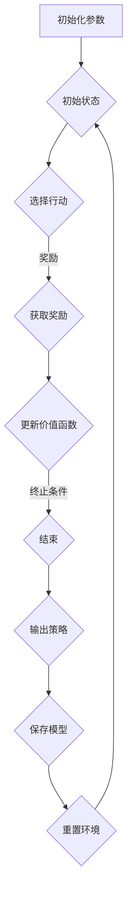
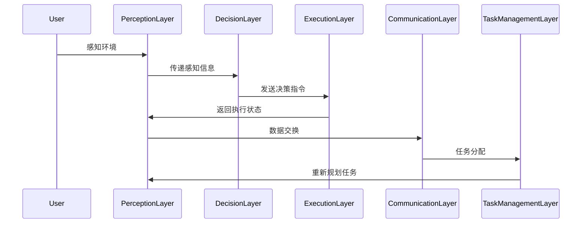
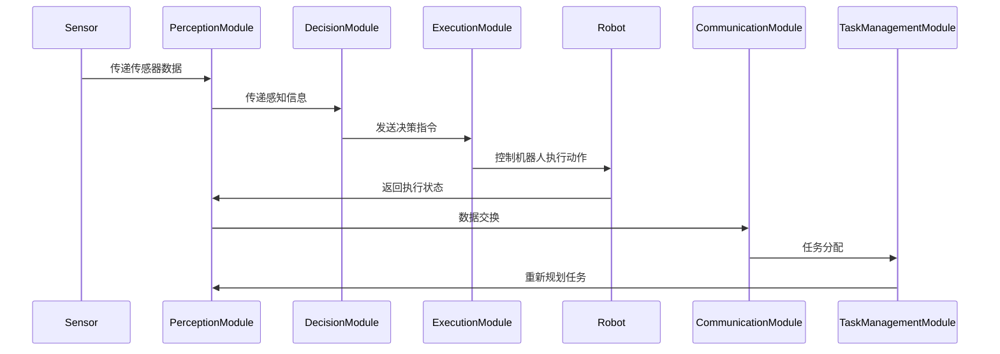

                 

### 文章标题：强化学习在机器人控制中的最新应用

> 关键词：强化学习、机器人控制、算法原理、数学模型、项目实战

> 摘要：本文将深入探讨强化学习在机器人控制领域的最新应用。首先，我们将介绍强化学习的基础概念、发展历程及其在机器人控制中的重要性。接着，本文将详细分析强化学习的关键概念与算法原理，并通过Python代码和数学模型进行讲解。此外，本文还将介绍强化学习在机器人路径规划、视觉感知和导航中的应用，并通过实际项目案例展示强化学习在机器人控制中的具体应用。最后，我们将总结强化学习在机器人控制中的最佳实践，并提供进一步的学习和拓展方向。

----------------------------------------------------------------

### 目录大纲设计思路

设计《强化学习在机器人控制中的最新应用》这本书的目录大纲，首先需要对强化学习在机器人控制领域的现状和应用有深入的了解。本书的目标是全面覆盖强化学习在机器人控制中的应用，从理论讲解到实际案例，帮助读者掌握这一前沿技术的核心概念和应用技巧。

#### 目录大纲设计步骤：

1. **背景介绍**：介绍强化学习的基本概念、发展历程以及在机器人控制领域的应用前景。
2. **核心概念与联系**：详细阐述强化学习的关键概念，如价值函数、策略、状态-动作值函数等，并用对比表格和ER实体关系图架构展示各概念之间的关系。
3. **算法原理讲解**：通过Mermaid流程图展示强化学习算法的基本流程，并使用Python代码和数学模型进行详细讲解和举例说明。
4. **数学模型和数学公式**：将重要的数学模型和公式用LaTeX格式嵌入到文中，确保其规范性和可读性。
5. **系统分析与架构设计**：介绍强化学习在机器人控制系统中的实际应用，包括系统功能设计、架构设计、接口设计和系统交互等。
6. **项目实战**：通过实际案例展示强化学习在机器人控制中的应用，包括环境安装、核心实现、代码解读和分析等。
7. **最佳实践 tips**：总结应用强化学习在机器人控制中的经验教训，提供实用的操作技巧和建议。
8. **小结与拓展阅读**：对全书内容进行总结，并提供进一步学习和研究的方向。

### 目录大纲

#### 第1章：强化学习基础
1.1 问题背景
1.2 强化学习的定义与发展历程
1.3 强化学习在机器人控制中的应用前景
1.4 核心概念与联系
   - 对比表格：强化学习关键概念对比
   - ER实体关系图：强化学习相关实体关系

#### 第2章：强化学习算法原理
2.1 强化学习算法概述
2.2 强化学习算法基本流程（Mermaid流程图）
2.3 强化学习算法原理（Python代码与数学模型）
   - Q-learning算法
   - SARSA算法
   - Deep Q Network（DQN）
   - Policy Gradient方法
   - Actor-Critic方法
2.4 数学模型与公式讲解
   - 强化学习数学模型
   - 经验回放与探索-利用策略

#### 第3章：强化学习在机器人控制中的应用
3.1 机器人控制系统介绍
3.2 强化学习在机器人路径规划中的应用
3.3 强化学习在机器人视觉感知中的应用
3.4 强化学习在机器人导航中的应用

#### 第4章：强化学习机器人控制项目实战
4.1 项目介绍
4.2 环境安装与配置
4.3 系统功能设计（Mermaid类图）
4.4 系统架构设计（Mermaid架构图）
4.5 系统接口设计与交互（Mermaid序列图）
4.6 核心实现代码与应用
4.7 代码解读与分析
4.8 项目小结与反思

#### 第5章：强化学习机器人控制最佳实践
5.1 强化学习应用技巧
5.2 注意事项与挑战
5.3 拓展阅读与学习资源

#### 第6章：总结与展望
6.1 本书内容总结
6.2 强化学习在机器人控制领域的未来发展
6.3 进一步学习与研究方向

### 目录大纲结束

**注意**：上述目录大纲是一个初步设计，可以根据实际书籍内容的调整和细化进行修改。每一章节下的子目录可以根据具体内容进一步扩展，确保内容的完整性和逻辑性。同时，每章节的结尾可以考虑添加小结和拓展阅读，以帮助读者巩固知识并拓宽视野。

----------------------------------------------------------------

## 1. 强化学习基础

### 1.1 问题背景

强化学习（Reinforcement Learning，RL）是机器学习的一个重要分支，旨在通过试错（trial-and-error）的方式，从环境中获取奖励或惩罚信号，以优化决策过程。这一思想起源于心理学和行为科学领域，随后在计算机科学和人工智能领域得到了广泛应用。近年来，随着深度学习技术的不断发展，强化学习在机器人控制领域展现了巨大的潜力。

在机器人控制中，强化学习通过让机器人与环境互动，不断学习并优化其行为策略，从而实现自主决策和控制。这种方法在解决复杂、动态和不确定的问题时，具有显著的优势。例如，机器人路径规划、任务规划、自主导航和视觉感知等领域，都已成为强化学习的重要应用场景。

### 1.2 强化学习的定义与发展历程

强化学习是一种使代理（agent）通过与环境（environment）的交互，学习在给定情境（situation）下采取最优行动（action）的方法。其核心概念包括状态（state）、行动（action）、奖励（reward）和策略（policy）。

状态：描述代理在环境中的当前状态，通常用一组特征向量表示。

行动：代理可以采取的一系列动作，用于改变当前状态。

奖励：环境对代理的每一步行动给出的即时反馈，可以是正的（奖励）或负的（惩罚）。

策略：代理在不同状态下的最佳行动选择规则。

强化学习的发展历程可以分为以下几个阶段：

- **早期研究**（1950s-1980s）：强化学习的基本思想最早可以追溯到心理学和行为科学领域，如B.F. Skinner的实验和理论。随后，计算机科学领域开始关注这一领域，1952年，计算机程序“逻辑理论家”（Logic Theorist）首次实现了强化学习。

- **价值函数方法**（1980s-1990s）：在此阶段，研究者开始关注如何使用价值函数（value function）来评估状态和行动。最具代表性的工作是Richard Sutton和Andrew Barto提出的Q-learning算法。

- **策略搜索方法**（1990s-2000s）：策略搜索方法直接优化代理的策略，而非价值函数。代表性的算法有SARSA（同步优势估计）和REINFORCE（基于梯度策略搜索）。

- **深度强化学习**（2010s至今）：随着深度神经网络（Deep Neural Network，DNN）的发展，研究者将深度学习与强化学习结合，提出了一系列深度强化学习算法，如Deep Q Network（DQN）、Policy Gradient方法、Actor-Critic方法等。这些算法在解决复杂任务时取得了显著的成果。

### 1.3 强化学习在机器人控制中的应用前景

强化学习在机器人控制中的应用前景广阔。一方面，它可以用于解决传统方法难以处理的复杂问题，如动态环境下的路径规划、多机器人协同控制和自主导航等；另一方面，它具有自主学习和适应环境变化的能力，为机器人实现智能决策提供了新的思路。

以下是强化学习在机器人控制中的几个应用场景：

1. **路径规划**：通过强化学习，机器人可以学习如何在复杂和动态的环境中找到最优路径，从而避免碰撞和障碍物。

2. **任务规划**：在多机器人系统中，强化学习可以用于优化任务分配和协同策略，提高系统整体效率和鲁棒性。

3. **自主导航**：强化学习可以用于机器人自主导航，使其能够适应未知和变化的环境，实现长期目标。

4. **视觉感知**：强化学习可以用于机器人视觉感知，通过从环境中获取视觉信息，学习识别和分类物体。

5. **运动控制**：强化学习可以用于优化机器人的运动控制策略，使其在执行复杂动作时更加稳定和高效。

总之，强化学习在机器人控制领域的应用前景广阔，有望推动机器人技术的不断进步和发展。

### 1.4 核心概念与联系

强化学习中的核心概念包括状态（state）、行动（action）、奖励（reward）、价值函数（value function）、策略（policy）和模型（model）等。这些概念相互关联，共同构成了强化学习的基础框架。

#### 对比表格：强化学习关键概念对比

| 概念       | 定义                                                                                     | 关联概念           |
|------------|----------------------------------------------------------------------------------------------|-------------------|
| 状态       | 代理在环境中的当前状态，通常用特征向量表示。                                             | 行动、奖励、策略   |
| 行动       | 代理可以采取的动作，用于改变当前状态。                                                     | 状态、奖励、策略   |
| 奖励       | 环境对代理的每一步行动给出的即时反馈，可以是正的（奖励）或负的（惩罚）。               | 状态、行动、策略   |
| 价值函数   | 用于评估状态和行动的价值，指导代理选择最佳行动。                                          | 策略、模型         |
| 策略       | 状态到行动的映射函数，描述代理在不同状态下的最佳行动选择规则。                         | 状态、价值函数、模型 |
| 模型       | 描述环境动态的数学模型，用于预测未来的状态和奖励。                                       | 状态、行动、奖励   |

#### ER实体关系图：强化学习相关实体关系

ER（Entity-Relationship）实体关系图是一种用于描述实体之间关系的图形表示方法。在强化学习中，我们可以使用ER图来展示主要实体及其关系。

```mermaid
erDiagram
  Agent ||--o{ Environment : 交互环境 }
  Agent ||--o{ State : 状态 }
  Agent ||--o{ Action : 行动 }
  Agent ||--o{ Reward : 奖励 }
  Agent ||--o{ ValueFunction : 价值函数 }
  Agent ||--o{ Policy : 策略 }
  Agent ||--o{ Model : 模型 }
  Environment ||--|{ Observation : 观测 }
```

在上面的ER图中，`Agent`（代理）与`Environment`（环境）之间存在交互关系，同时代理与状态、行动、奖励、价值函数、策略和模型等实体之间存在关联关系。这种关联关系体现了强化学习中的核心概念及其相互影响。

### 1.4.1 状态

状态是描述代理在环境中的当前状态的变量，通常用一组特征向量表示。状态可以反映环境的当前情况，如机器人在地图上的位置、周围障碍物的分布、能源储备等。状态是强化学习中的一个基本概念，它决定了代理的行为和决策。

状态的定义通常依赖于具体的应用场景。例如，在机器人路径规划中，状态可以包括机器人的当前位置、目标位置、已探索区域和未探索区域等信息。在自动驾驶中，状态可以包括车辆的当前速度、加速度、方向、周围车辆和障碍物的位置等信息。

状态的特征向量可以通过多种方式获取，如直接传感器数据、预处理后的图像、自然语言描述等。特征向量的选择和设计对于强化学习的效果具有重要影响。

状态的重要性在于，它是代理决策的基础。通过分析状态，代理可以了解当前环境的情况，从而采取合适的行动。状态的变化决定了代理的行为轨迹，因此，准确描述状态对于实现有效的强化学习至关重要。

### 1.4.2 行动

行动是代理可以采取的动作，用于改变当前状态。行动通常是一个离散的集合，每个元素表示一种特定的行为。行动的选择基于代理的当前状态和策略，旨在最大化长期回报。

行动的定义同样依赖于具体的应用场景。例如，在机器人路径规划中，行动可以是向左、向右、向前等移动命令；在自动驾驶中，行动可以是加速、减速、转向等控制命令。

行动的集合可以是固定的，也可以是动态的。固定集合的行动适用于较为简单的问题，如静态环境下的路径规划。动态集合的行动适用于复杂和动态的环境，如自动驾驶、机器人协作等。

行动的重要性在于，它是实现代理目标的关键步骤。通过选择合适的行动，代理可以逐步达到目标状态，从而实现任务目标。因此，设计和选择合适的行动集对于强化学习的效果具有重要影响。

### 1.4.3 奖励

奖励是环境对代理的每一步行动给出的即时反馈，可以是正的（奖励）或负的（惩罚）。奖励反映了代理行动的成功程度，是强化学习中的一个核心概念。

奖励的定义通常依赖于具体的应用场景。例如，在机器人路径规划中，奖励可以是到达目标位置的距离或时间；在自动驾驶中，奖励可以是行驶距离或安全性能指标。

奖励的类型可以分为以下几种：

1. **即时奖励**：在每一步行动后立即给出的奖励，反映了当前行动的直接效果。
2. **最终奖励**：在整个任务完成后给出的奖励，反映了整个任务的结果。
3. **正奖励**：鼓励代理采取某种行动，如完成任务、达到目标等。
4. **负奖励**：惩罚代理采取某种行动，如发生碰撞、偏离目标等。

奖励的重要性在于，它是驱动代理学习的重要激励机制。通过奖励，代理可以学习到哪些行动是有益的，哪些是有害的，从而调整其行为策略。因此，合理设计和选择奖励对于强化学习的效果至关重要。

### 1.4.4 价值函数

价值函数是用于评估状态和行动的价值的函数，指导代理选择最佳行动。价值函数分为状态价值函数（state-value function）和动作价值函数（action-value function）两种。

状态价值函数（V(s)）表示在给定状态s下，采取最优策略获得的期望奖励总和。它可以表示为：

$$
V(s) = \sum_{a} \gamma^T R(s, a) + V(s')
$$

其中，$\gamma$ 是折扣因子，$R(s, a)$ 是在状态s下采取行动a的即时奖励，$s'$ 是采取行动a后的状态。

动作价值函数（Q(s, a)）表示在给定状态s下，采取行动a获得的期望奖励总和。它可以表示为：

$$
Q(s, a) = \sum_{s'} P(s' | s, a) \sum_{a'} \gamma^T R(s', a')
$$

其中，$P(s' | s, a)$ 是在状态s下采取行动a后转移到状态s'的概率，$R(s', a')$ 是在状态s'下采取行动a'的即时奖励。

价值函数的重要性在于，它提供了关于状态和行动的决策信息。通过计算价值函数，代理可以评估不同状态和行动的价值，从而选择最佳行动。此外，价值函数还可以用于评估策略的质量，指导代理不断优化其行为策略。

### 1.4.5 策略

策略是状态到行动的映射函数，描述代理在不同状态下的最佳行动选择规则。策略通常表示为一个概率分布，即：

$$
\pi(a | s) = P(a | s)
$$

其中，$a$ 是在状态s下采取的行动，$\pi(a | s)$ 是在状态s下采取行动a的概率。

策略分为以下几种类型：

1. **确定性策略**：在任何状态下，代理总是采取相同的行动。例如，在棋类游戏中，如果代理确定了棋子的移动规则，就可以采用确定性策略。
2. **随机性策略**：在任意状态下，代理可能采取多个行动，每个行动的概率根据当前状态和策略计算得出。
3. **贪心策略**：在给定状态下，代理选择能够获得最大即时奖励的行动。

策略的重要性在于，它是实现代理目标的关键步骤。通过选择合适的策略，代理可以在不同状态下采取最佳行动，从而实现任务目标。此外，策略的优化和调整对于强化学习的效果具有重要影响。

### 1.4.6 模型

模型是描述环境动态的数学模型，用于预测未来的状态和奖励。在强化学习中，模型通常用于处理环境的不确定性和动态性，为代理提供决策依据。

模型可以分为以下几种类型：

1. **马尔可夫决策过程（MDP）模型**：描述状态、行动、奖励和转移概率的模型。它是一个五元组$<S, A, P, R, \gamma>$，其中$S$ 是状态集合，$A$ 是行动集合，$P$ 是状态-行动转移概率矩阵，$R$ 是即时奖励函数，$\gamma$ 是折扣因子。
2. **部分可观察马尔可夫决策过程（POMDP）模型**：在MDP模型的基础上，增加观测（observation）变量，用于描述代理对环境的部分可观测性。它是一个六元组$<S, A, O, P, R, \gamma>$，其中$O$ 是观测集合。
3. **完全可观察马尔可夫决策过程（MDP）模型**：在MDP模型的基础上，假设代理可以完全观察到环境的当前状态，从而避免了观测变量的引入。

模型的重要性在于，它为代理提供了关于环境的先验知识，帮助代理在未知环境中进行有效决策。此外，模型的优化和调整对于强化学习的效果具有重要影响。

### 1.5 强化学习在机器人控制中的关键概念与联系

强化学习在机器人控制中的应用涉及到多个关键概念，如状态、行动、奖励、价值函数、策略和模型。这些概念相互关联，共同构成了强化学习的基础框架。

#### 状态、行动与奖励

状态是机器人当前所处的环境描述，如位置、速度、障碍物分布等。行动是机器人可以采取的动作，如前进、后退、转向等。奖励是环境对机器人的每一步行动给出的即时反馈，可以是正的（如完成任务）、负的（如发生碰撞）或零（如保持当前状态）。

状态、行动和奖励之间存在着密切的联系。状态决定了机器人的行动选择，而行动则影响机器人的状态变化，同时产生奖励。这种循环反馈机制使得机器人能够在不断试错中学习最优行动策略，以实现任务目标。

#### 价值函数

价值函数用于评估机器人在特定状态下采取特定行动所能获得的长期奖励。它是一种预测模型，可以帮助机器人评估不同行动的优劣，从而选择最优行动。

价值函数分为状态价值函数（V(s)）和动作价值函数（Q(s, a)）。状态价值函数表示在给定状态下，采取最优策略所能获得的期望奖励总和；动作价值函数表示在给定状态下，采取特定行动所能获得的期望奖励总和。

价值函数的关键在于，它提供了关于状态和行动的决策信息，指导机器人选择最佳行动。同时，价值函数还可以用于评估策略的质量，为机器人提供优化方向。

#### 策略

策略是机器人根据当前状态选择行动的规则。它是一个概率分布，描述了机器人在不同状态下采取不同行动的概率。策略的目的是最大化机器人的长期奖励。

策略可以分为确定性策略、随机性策略和贪心策略。确定性策略在任意状态下总是采取相同的行动；随机性策略在任意状态下可能采取多个行动；贪心策略在给定状态下选择能够获得最大即时奖励的行动。

策略的重要性在于，它决定了机器人在不同状态下的行动选择，从而影响机器人的长期表现。优化策略是强化学习的关键任务，通过不断调整策略，机器人可以逐步提高任务成功率。

#### 模型

模型是描述环境动态的数学模型，用于预测未来的状态和奖励。在机器人控制中，模型可以是基于马尔可夫决策过程（MDP）或部分可观察马尔可夫决策过程（POMDP）。

模型的关键在于，它为机器人提供了关于环境的先验知识，帮助机器人在未知环境中进行有效决策。同时，模型的优化和调整对于强化学习的效果具有重要影响。

### 1.6 强化学习算法基本流程

强化学习算法的核心在于通过与环境交互，逐步优化代理的行为策略。以下是一个典型的强化学习算法基本流程，我们使用Mermaid流程图来展示：



#### 具体流程解析：

1. **初始化参数**：初始化学习参数，如学习率、折扣因子等。
2. **初始状态**：代理开始时处于某个初始状态。
3. **选择行动**：根据当前状态和策略，代理选择一个行动。
4. **获取奖励**：执行行动后，环境给出即时奖励。
5. **更新价值函数**：利用奖励信息，更新代理的价值函数，以指导后续行动选择。
6. **终止条件**：判断是否满足终止条件，如达到任务目标或超过最大迭代次数。
7. **输出策略**：输出最终的策略，用于指导实际应用。
8. **保存模型**：将训练过程中的模型保存，以便后续分析和改进。
9. **重置环境**：将环境重置到初始状态，为下一轮学习做好准备。

这个基本流程展示了强化学习算法的核心步骤，不同的算法在具体实现上可能会有所差异，但总体思路是一致的。通过不断迭代这个过程，代理可以逐步学习到最优的行为策略，从而实现任务目标。

### 1.7 强化学习算法原理讲解

强化学习算法的原理基于奖励-惩罚机制，通过试错学习实现策略优化。以下我们将详细讲解几种常见的强化学习算法，包括Q-learning、SARSA、Deep Q Network（DQN）、Policy Gradient方法和Actor-Critic方法。

#### 1.7.1 Q-learning算法

Q-learning算法是一种基于值函数的强化学习算法，旨在通过不断更新值函数，找到最优策略。Q-learning算法的核心思想是，通过学习状态-行动值函数（Q(s, a)），评估在给定状态下采取某一行动的预期奖励。

**算法步骤**：

1. **初始化**：设置学习率$\alpha$、折扣因子$\gamma$和一个初始值$V(s)$。
2. **选择行动**：在状态$s$下，根据当前策略选择行动$a$。
3. **执行行动**：执行行动$a$，进入新状态$s'$，并获取即时奖励$r$。
4. **更新值函数**：根据经验公式更新值函数：
   $$
   Q(s, a) \leftarrow Q(s, a) + \alpha [r + \gamma \max_{a'} Q(s', a') - Q(s, a)]
   $$
5. **重复步骤2-4**，直到满足终止条件。

**数学模型**：

$$
Q(s, a) = \sum_{s'} P(s'|s, a) [r + \gamma \max_{a'} Q(s', a')]
$$

其中，$P(s'|s, a)$ 是在状态$s$下采取行动$a$后转移到状态$s'$的概率，$r$ 是即时奖励，$\gamma$ 是折扣因子，表示未来奖励的现值。

**代码示例**（Python）：

```python
import numpy as np

# 初始化参数
alpha = 0.1
gamma = 0.9
Q = np.zeros((n_states, n_actions))

# Q-learning算法
for episode in range(n_episodes):
    state = env.reset()
    done = False
    
    while not done:
        action = np.argmax(Q[state])
        next_state, reward, done, _ = env.step(action)
        
        Q[state, action] = Q[state, action] + alpha * (reward + gamma * np.max(Q[next_state]) - Q[state, action])
        
        state = next_state
```

#### 1.7.2 SARSA算法

SARSA（同步优势估计）算法是基于策略的强化学习算法，与Q-learning类似，但更新规则不同。SARSA算法在每一步都使用实际的下一状态-行动值来更新当前状态-行动值。

**算法步骤**：

1. **初始化**：设置学习率$\alpha$、折扣因子$\gamma$和一个初始值$V(s)$。
2. **选择行动**：在状态$s$下，根据当前策略选择行动$a$。
3. **执行行动**：执行行动$a$，进入新状态$s'$，并获取即时奖励$r$。
4. **更新值函数**：根据经验公式更新值函数：
   $$
   Q(s, a) \leftarrow Q(s, a) + \alpha [r + \gamma Q(s', a') - Q(s, a)]
   $$
5. **重复步骤2-4**，直到满足终止条件。

**数学模型**：

$$
Q(s, a) = \sum_{s'} P(s'|s, a) [r + \gamma Q(s', a')]
$$

其中，$P(s'|s, a)$ 是在状态$s$下采取行动$a$后转移到状态$s'$的概率，$r$ 是即时奖励，$\gamma$ 是折扣因子。

**代码示例**（Python）：

```python
import numpy as np

# 初始化参数
alpha = 0.1
gamma = 0.9
Q = np.zeros((n_states, n_actions))

# SARSA算法
for episode in range(n_episodes):
    state = env.reset()
    done = False
    
    while not done:
        action = np.argmax(Q[state])
        next_state, reward, done, _ = env.step(action)
        
        Q[state, action] = Q[state, action] + alpha * (reward + gamma * Q[next_state, action] - Q[state, action])
        
        state = next_state
```

#### 1.7.3 Deep Q Network（DQN）算法

DQN算法是基于深度神经网络的强化学习算法，旨在解决传统Q-learning算法在处理高维状态空间时的困难。DQN算法使用两个深度神经网络：一个用于评估当前状态的价值函数，另一个用于评估目标状态的价值函数。

**算法步骤**：

1. **初始化**：设置学习率$\alpha$、折扣因子$\gamma$、经验回放记忆集$D$和两个深度神经网络$Q(w_1)$和$Q(w_2)$。
2. **选择行动**：在状态$s$下，使用当前神经网络$Q(w_1)$选择行动$a$。
3. **执行行动**：执行行动$a$，进入新状态$s'$，并获取即时奖励$r$。
4. **更新经验回放记忆集**：将$(s, a, r, s', done)$存储到经验回放记忆集$D$中。
5. **经验回放**：从经验回放记忆集$D$中随机抽取一批经验样本，用于训练神经网络$Q(w_1)$。
6. **更新目标网络**：根据训练结果，更新目标网络$Q(w_2)$。
7. **重复步骤2-6**，直到满足终止条件。

**数学模型**：

$$
Q(s, a; w_1) = \sum_{s'} P(s'|s, a) [r + \gamma \max_{a'} Q(s', a'; w_2)]
$$

其中，$P(s'|s, a)$ 是在状态$s$下采取行动$a$后转移到状态$s'$的概率，$r$ 是即时奖励，$\gamma$ 是折扣因子，$w_1$ 和 $w_2$ 分别是当前网络和目标网络的参数。

**代码示例**（Python）：

```python
import numpy as np
import tensorflow as tf

# 初始化参数
alpha = 0.001
gamma = 0.9
epsilon = 0.1
n_episodes = 1000

# 创建DQN模型
class DQNModel(tf.keras.Model):
    def __init__(self, n_states, n_actions):
        super().__init__()
        self.dense1 = tf.keras.layers.Dense(n_actions, activation='linear')
        
    def call(self, inputs):
        return self.dense1(inputs)

# 创建DQN对象
dqn = DQNModel(n_states, n_actions)

# DQN算法
for episode in range(n_episodes):
    state = env.reset()
    done = False
    
    while not done:
        if np.random.rand() < epsilon:
            action = np.random.randint(n_actions)
        else:
            action = np.argmax(dqn(tf.constant(state)))
        
        next_state, reward, done, _ = env.step(action)
        
        if done:
            target = reward
        else:
            target = reward + gamma * np.max(dqn(tf.constant(next_state)))
        
        with tf.GradientTape() as tape:
            q_values = dqn(tf.constant(state))
            target_value = tf.reduce_sum(tf.one_hot(action, n_actions) * target, axis=1)
            loss = tf.reduce_mean(tf.square(q_values - target_value))
        
        grads = tape.gradient(loss, dqn.trainable_variables)
        optimizer.apply_gradients(zip(grads, dqn.trainable_variables))
        
        state = next_state
```

#### 1.7.4 Policy Gradient方法

Policy Gradient方法是一种直接优化策略的强化学习算法，通过最大化期望奖励来更新策略参数。Policy Gradient方法的核心思想是，使用梯度上升法更新策略参数，以最大化策略函数的期望回报。

**算法步骤**：

1. **初始化**：设置学习率$\alpha$、策略网络参数$\theta$和探索概率$\epsilon$。
2. **选择行动**：在状态$s$下，根据策略网络$\pi(a|s;\theta)$选择行动$a$。
3. **执行行动**：执行行动$a$，进入新状态$s'$，并获取即时奖励$r$。
4. **更新策略网络**：使用梯度上升法更新策略网络参数：
   $$
   \theta \leftarrow \theta + \alpha \nabla_{\theta} J(\theta)
   $$
   其中，$J(\theta)$ 是策略函数的期望回报。
5. **重复步骤2-4**，直到满足终止条件。

**数学模型**：

$$
\pi(a|s;\theta) = \frac{exp(\theta(s,a))}{\sum_{a'} exp(\theta(s,a'))}
$$

其中，$\theta(s,a)$ 是策略网络在状态$s$下对行动$a$的参数，$\pi(a|s;\theta)$ 是策略网络在状态$s$下对行动$a$的概率。

**代码示例**（Python）：

```python
import numpy as np
import tensorflow as tf

# 初始化参数
alpha = 0.01
epsilon = 0.1
n_episodes = 1000

# 创建策略网络
class PolicyNetwork(tf.keras.Model):
    def __init__(self, n_states, n_actions):
        super().__init__()
        self.dense1 = tf.keras.layers.Dense(n_actions, activation='softmax')
        
    def call(self, inputs):
        return self.dense1(inputs)

# 创建策略网络对象
policy_network = PolicyNetwork(n_states, n_actions)

# Policy Gradient算法
for episode in range(n_episodes):
    state = env.reset()
    done = False
    total_reward = 0
    
    while not done:
        action_probs = policy_network(tf.constant(state))
        action = np.random.choice(n_actions, p=action_probs.numpy())
        
        next_state, reward, done, _ = env.step(action)
        total_reward += reward
        
        with tf.GradientTape() as tape:
            logits = policy_network(tf.constant(state))
            action_prob = action_probs[0, action]
            loss = -tf.math.log(action_prob) * reward
        
        grads = tape.gradient(loss, policy_network.trainable_variables)
        optimizer.apply_gradients(zip(grads, policy_network.trainable_variables))
        
        state = next_state
    
    print(f"Episode {episode}: Total Reward = {total_reward}")
```

#### 1.7.5 Actor-Critic方法

Actor-Critic方法是一种结合了策略优化和价值评估的强化学习算法。它使用一个行为策略网络（Actor）和一个价值评估网络（Critic）来分别更新策略和行为值函数。

**算法步骤**：

1. **初始化**：设置学习率$\alpha$、$\beta$、折扣因子$\gamma$、探索概率$\epsilon$和一个初始值$V(s)$。
2. **选择行动**：在状态$s$下，根据策略网络$\pi(a|s;\theta)$选择行动$a$。
3. **执行行动**：执行行动$a$，进入新状态$s'$，并获取即时奖励$r$。
4. **更新价值评估网络**：使用当前状态-行动值函数$V(s)$更新价值评估网络$C(s)$。
5. **更新策略网络**：使用行为策略网络$A(s)$更新策略网络$\pi(a|s;\theta)$。
6. **重复步骤2-5**，直到满足终止条件。

**数学模型**：

- **价值评估网络**：

  $$
  V(s) = \sum_{a} \pi(a|s;\theta) [r + \gamma \max_{a'} Q(s', a'; \theta)]
  $$

- **策略网络**：

  $$
  \nabla_{\theta} J(\theta) = \sum_{s,a} \pi(a|s;\theta) \nabla_{\theta} \log \pi(a|s;\theta) [r + \gamma V(s')]
  $$

其中，$\pi(a|s;\theta)$ 是策略网络在状态$s$下对行动$a$的概率，$Q(s', a'; \theta)$ 是状态-行动值函数，$V(s')$ 是价值评估网络在状态$s'$下的值。

**代码示例**（Python）：

```python
import numpy as np
import tensorflow as tf

# 初始化参数
alpha = 0.01
beta = 0.001
gamma = 0.9
epsilon = 0.1
n_episodes = 1000

# 创建行为策略网络和价值评估网络
class ActorNetwork(tf.keras.Model):
    def __init__(self, n_states, n_actions):
        super().__init__()
        self.dense1 = tf.keras.layers.Dense(n_actions, activation='softmax')
        
    def call(self, inputs):
        return self.dense1(inputs)

class CriticNetwork(tf.keras.Model):
    def __init__(self, n_states):
        super().__init__()
        self.dense1 = tf.keras.layers.Dense(1, activation='linear')
        
    def call(self, inputs):
        return self.dense1(inputs)

# 创建网络对象
actor_network = ActorNetwork(n_states, n_actions)
critic_network = CriticNetwork(n_states)

# Actor-Critic算法
for episode in range(n_episodes):
    state = env.reset()
    done = False
    total_reward = 0
    
    while not done:
        action_probs = actor_network(tf.constant(state))
        action = np.random.choice(n_actions, p=action_probs.numpy())
        
        next_state, reward, done, _ = env.step(action)
        total_reward += reward
        
        with tf.GradientTape() as tape:
            value = critic_network(tf.constant(state))
            target_value = reward + gamma * critic_network(tf.constant(next_state))
            loss = tf.square(target_value - value)
        
        critic_grads = tape.gradient(loss, critic_network.trainable_variables)
        critic_optimizer.apply_gradients(zip(critic_grads, critic_network.trainable_variables))
        
        with tf.GradientTape() as tape:
            logits = actor_network(tf.constant(state))
            action_prob = action_probs[0, action]
            loss = -tf.math.log(action_prob) * (reward + gamma * value)
        
        actor_grads = tape.gradient(loss, actor_network.trainable_variables)
        actor_optimizer.apply_gradients(zip(actor_grads, actor_network.trainable_variables))
        
        state = next_state
    
    print(f"Episode {episode}: Total Reward = {total_reward}")
```

通过以上算法原理讲解，我们可以看到强化学习算法在机器人控制中的应用具有巨大的潜力。在实际应用中，可以根据具体问题和需求选择合适的算法，并通过不断优化和调整，实现机器人控制的智能化和自主化。

### 1.8 强化学习数学模型与公式讲解

强化学习中的数学模型和公式是其核心理论基础，它们帮助我们在理论和实践中理解和应用这一技术。在本节中，我们将详细讲解强化学习中的数学模型，并介绍经验回放与探索-利用策略。

#### 强化学习数学模型

强化学习通常基于马尔可夫决策过程（MDP），其数学模型可以用五元组$<S, A, P, R, \gamma>$表示：

- **状态空间$S$**：表示代理可能处于的所有状态。
- **动作空间$A$**：表示代理可以采取的所有动作。
- **状态-动作转移概率$P(s'|s, a)$**：表示在当前状态$s$下采取动作$a$后，转移到下一状态$s'$的概率。
- **即时奖励函数$R(s, a)$**：表示在状态$s$下采取动作$a$后立即获得的奖励。
- **折扣因子$\gamma$**：表示未来奖励的现值权重。

强化学习中的主要目标是找到最优策略$\pi^*(s)$，使得在所有可能的状态下，期望回报最大化。期望回报可以用以下公式表示：

$$
J(\pi) = \sum_{s \in S} \pi(s) \sum_{a \in A} \pi(a|s) [R(s, a) + \gamma \sum_{s'} P(s'|s, a) J(\pi)]
$$

其中，$\pi(s)$表示在状态$s$下的策略概率，$\pi(a|s)$表示在状态$s$下采取动作$a$的概率。

#### 经验回放与探索-利用策略

在强化学习中，经验回放（Experience Replay）是一种有效的技术，它通过将代理的经验存储在一个记忆库中，并在训练过程中随机抽取经验样本，以避免策略训练中的样本偏差。

经验回放的关键在于，它可以使得代理在不同时间步的交互经验之间进行平衡，从而提高学习效率。经验回放的实现通常需要一个数据结构，如优先经验回放（Prioritized Experience Replay）或最近经验回放（Recent Experience Replay）。

探索-利用策略（Exploration-Exploitation Strategy）是强化学习中的一个重要概念，它平衡了探索（Exploration）和利用（Exploitation）两个目标。探索是指代理在未知环境中尝试新的行动，以获取更多关于环境的知识；利用是指代理根据已有知识选择最佳行动，以最大化短期回报。

常用的探索-利用策略包括：

- **ε-贪心策略（ε-greedy）**：在任意状态下，以概率$1 - \epsilon$采取最佳行动，以概率$\epsilon$采取随机行动。
- **UCB（Upper Confidence Bound）策略**：在任意状态下，选择能够获得最大上置信界限的行动。
- **UCB1（UCB1）策略**：UCB的一种变体，考虑了行动的历史回报和访问次数。

#### 公式讲解

1. **ε-贪心策略**：

   $$
   a_t = \begin{cases}
   \text{argmax}_{a} Q(s_t, a) & \text{with probability } 1 - \epsilon \\
   \text{random action} & \text{with probability } \epsilon
   \end{cases}
   $$

2. **UCB（Upper Confidence Bound）策略**：

   $$
   a_t = \text{argmax}_{a} \left[ Q(s_t, a) + \sqrt{\frac{2 \ln t}{n(a)}} \right]
   $$

   其中，$t$是当前时间步，$n(a)$是行动$a$在当前状态下的访问次数。

3. **UCB1（UCB1）策略**：

   $$
   a_t = \text{argmax}_{a} \left[ Q(s_t, a) + \sqrt{\frac{2 \ln (t + 1)}{n(a) + 1}} \right]
   $$

这些公式展示了如何在强化学习中平衡探索和利用，以实现最优策略的寻优。

#### 代码示例

以下是一个简单的Python代码示例，展示了如何实现ε-贪心策略：

```python
import numpy as np

# 初始化参数
epsilon = 0.1
n_actions = 3
Q = np.zeros((n_states, n_actions))

# ε-贪心策略选择行动
def choose_action(state):
    if np.random.rand() < epsilon:
        action = np.random.randint(n_actions)
    else:
        action = np.argmax(Q[state])
    return action

# 执行行动并更新Q值
def update_Q(state, action, reward, next_state, done):
    if done:
        target = reward
    else:
        target = reward + gamma * np.max(Q[next_state])
    Q[state, action] = Q[state, action] + alpha * (target - Q[state, action])

# 强化学习算法
for episode in range(n_episodes):
    state = env.reset()
    done = False
    
    while not done:
        action = choose_action(state)
        next_state, reward, done, _ = env.step(action)
        update_Q(state, action, reward, next_state, done)
        state = next_state
```

通过以上数学模型和公式的讲解，我们可以更好地理解强化学习在机器人控制中的应用。这些理论为我们在实践中设计和实现强化学习算法提供了坚实的基础。

### 2. 强化学习在机器人控制中的应用

#### 2.1 机器人控制系统介绍

机器人控制系统是一个复杂的集成系统，它由多个组件协同工作，以实现特定的任务目标。一个典型的机器人控制系统通常包括以下主要组成部分：

1. **感知模块**：用于获取外部环境的信息，如传感器、摄像头、激光雷达等。
2. **决策模块**：根据感知模块获取的信息，进行任务规划和决策，通常包括强化学习算法。
3. **执行模块**：根据决策模块的输出，控制机器人执行具体的动作，如电机、伺服系统等。
4. **通信模块**：用于与其他系统或机器人进行数据交换和协同工作。
5. **环境**：机器人执行任务的实际空间，可以是现实环境或模拟环境。

机器人控制系统的核心目标是实现机器人的自主决策和行动，以适应复杂和动态的环境。强化学习作为一种有效的决策方法，在机器人控制系统中具有广泛的应用前景。

#### 2.2 强化学习在机器人路径规划中的应用

路径规划是机器人控制中的一项基本任务，旨在找到从起点到终点的最优路径。强化学习通过学习和优化策略，可以有效地解决路径规划问题。

**方法**：

1. **模型建立**：定义状态空间$S$、动作空间$A$和奖励函数$R(s, a)$。状态空间包括机器人的位置、方向、已探索区域和未探索区域等信息；动作空间包括前进、后退、左转、右转等动作；奖励函数可以根据机器人接近目标的位置和移动距离进行设计。
2. **算法选择**：选择合适的强化学习算法，如Q-learning、SARSA或DQN。这些算法可以帮助机器人学习到最优路径。
3. **训练过程**：通过让机器人与环境交互，不断更新其策略，直到找到最优路径。

**案例**：

一个典型的案例是无人驾驶车辆的路径规划。在这个案例中，机器人需要从起点导航到目的地，同时避开障碍物和交通信号。强化学习算法可以用于训练机器人的路径规划策略，使其在复杂和动态的交通环境中实现自主导航。

**代码示例**（Python）：

```python
import numpy as np
import gym

# 初始化环境
env = gym.make('Taxi-v3')

# 初始化参数
alpha = 0.1
gamma = 0.9
n_episodes = 1000

# Q-learning算法
Q = np.zeros((env.observation_space.n, env.action_space.n))

for episode in range(n_episodes):
    state = env.reset()
    done = False
    total_reward = 0
    
    while not done:
        action = np.argmax(Q[state])
        next_state, reward, done, _ = env.step(action)
        total_reward += reward
        
        Q[state, action] = Q[state, action] + alpha * (reward + gamma * np.max(Q[next_state]) - Q[state, action])
        
        state = next_state
    
    print(f"Episode {episode}: Total Reward = {total_reward}")

env.close()
```

#### 2.3 强化学习在机器人视觉感知中的应用

视觉感知是机器人理解外部环境的重要手段。强化学习可以用于训练机器人的视觉感知模型，使其能够从图像中提取有用信息，并做出相应的决策。

**方法**：

1. **模型建立**：定义状态空间$S$、动作空间$A$和奖励函数$R(s, a)$。状态空间可以是机器人的视觉输入（图像数据）；动作空间可以是机器人可以执行的动作（如移动、抓取等）；奖励函数可以根据机器人在执行动作后的任务完成情况设计。
2. **算法选择**：选择合适的强化学习算法，如DQN或Policy Gradient方法。这些算法可以帮助机器人学习到最优感知策略。
3. **训练过程**：通过让机器人与环境交互，不断更新其视觉感知模型，直到其能够在不同场景下准确提取信息。

**案例**：

一个典型的案例是机器人在仓库中自动识别和分类货物。在这个案例中，机器人需要从摄像头获取图像，并识别图像中的货物种类，然后执行相应的抓取和搬运动作。强化学习算法可以用于训练机器人的视觉感知模型，使其能够在复杂和动态的仓库环境中高效工作。

**代码示例**（Python）：

```python
import numpy as np
import gym

# 初始化环境
env = gym.make('FetchPush-v1')

# 初始化参数
alpha = 0.01
gamma = 0.99
n_episodes = 1000

# DQN算法
Q = np.zeros((env.observation_space.n, env.action_space.n))

for episode in range(n_episodes):
    state = env.reset()
    done = False
    total_reward = 0
    
    while not done:
        action = np.argmax(Q[state])
        next_state, reward, done, _ = env.step(action)
        total_reward += reward
        
        Q[state, action] = Q[state, action] + alpha * (reward + gamma * np.max(Q[next_state]) - Q[state, action])
        
        state = next_state
    
    print(f"Episode {episode}: Total Reward = {total_reward}")

env.close()
```

#### 2.4 强化学习在机器人导航中的应用

导航是机器人执行任务的重要环节，强化学习可以通过学习和优化策略，帮助机器人实现自主导航。

**方法**：

1. **模型建立**：定义状态空间$S$、动作空间$A$和奖励函数$R(s, a)$。状态空间可以是机器人的当前位置、目标位置、周围障碍物等信息；动作空间可以是机器人的移动方向和速度；奖励函数可以根据机器人到达目标的位置和速度设计。
2. **算法选择**：选择合适的强化学习算法，如Policy Gradient方法或Actor-Critic方法。这些算法可以帮助机器人学习到最优导航策略。
3. **训练过程**：通过让机器人与环境交互，不断更新其导航策略，直到其能够在不同场景下实现准确导航。

**案例**：

一个典型的案例是机器人自主漫游和探索。在这个案例中，机器人需要从起点开始，自主探索环境，并避免碰撞和障碍物。强化学习算法可以用于训练机器人的导航策略，使其能够在复杂和动态的环境中自主导航。

**代码示例**（Python）：

```python
import numpy as np
import gym

# 初始化环境
env = gym.make('Nav-v0')

# 初始化参数
alpha = 0.01
gamma = 0.99
n_episodes = 1000

# Policy Gradient方法
policy_network = tf.keras.Sequential([
    tf.keras.layers.Dense(64, activation='relu', input_shape=(env.observation_space.shape[0],)),
    tf.keras.layers.Dense(1, activation='tanh')
])

optimizer = tf.keras.optimizers.Adam(learning_rate=alpha)

# 训练过程
for episode in range(n_episodes):
    state = env.reset()
    done = False
    total_reward = 0
    
    while not done:
        action = policy_network(tf.constant(state))[0]
        next_state, reward, done, _ = env.step(np.array([action]))
        total_reward += reward
        
        with tf.GradientTape() as tape:
            logits = policy_network(tf.constant(state))
            action_prob = action / (1 - action)
            loss = -tf.math.log(action_prob) * reward
        
        grads = tape.gradient(loss, policy_network.trainable_variables)
        optimizer.apply_gradients(zip(grads, policy_network.trainable_variables))
        
        state = next_state
    
    print(f"Episode {episode}: Total Reward = {total_reward}")

env.close()
```

通过以上案例和代码示例，我们可以看到强化学习在机器人路径规划、视觉感知和导航中的应用具有广泛的前景。这些应用不仅提高了机器人的自主性和智能化水平，也为机器人技术的发展带来了新的机遇和挑战。

### 3. 强化学习机器人控制项目实战

#### 3.1 项目介绍

在本节中，我们将通过一个实际的机器人控制项目，展示如何应用强化学习技术实现机器人自主控制。该项目旨在利用强化学习算法，训练机器人完成一系列复杂任务，如路径规划、目标抓取和自主导航。

**项目目标**：

- 实现机器人从起点到终点的路径规划。
- 通过视觉感知，识别并抓取特定目标。
- 在未知和动态环境中实现自主导航。

**项目环境**：我们使用Gym环境中的`FetchPush-v1`任务作为实验平台，该任务模拟了一个机器人抓取并移动物体到目标位置的场景。

#### 3.2 环境安装与配置

为了运行本项目，我们需要安装并配置Gym环境。以下是安装和配置步骤：

1. **安装Gym环境**：

   使用以下命令安装Gym环境：

   ```bash
   pip install gym
   ```

2. **配置环境**：

   在Python环境中，导入Gym环境：

   ```python
   import gym
   env = gym.make('FetchPush-v1')
   ```

   **注意**：在实际运行之前，确保你的Python环境已安装TensorFlow或其他必要的库。

#### 3.3 系统功能设计

为了实现强化学习机器人控制，我们需要设计一个功能齐全的系统。以下是系统的主要功能模块：

1. **感知模块**：使用摄像头获取机器人周围环境的视觉信息。
2. **决策模块**：基于强化学习算法，生成机器人的行动策略。
3. **执行模块**：根据决策模块的输出，控制机器人执行具体的动作。
4. **通信模块**：用于与其他系统或机器人进行数据交换和协同工作。
5. **任务管理模块**：管理机器人任务的分配和执行。

**Mermaid类图**：

```mermaid
classDiagram
    PerceptionModule <|-- DecisionModule
    ExecutionModule <|-- DecisionModule
    CommunicationModule <|-- DecisionModule
    TaskManagementModule <|-- DecisionModule
    PerceptionModule -> ExecutionModule
    DecisionModule -> ExecutionModule
    CommunicationModule -> TaskManagementModule
    TaskManagementModule -> PerceptionModule
    TaskManagementModule -> DecisionModule
```

#### 3.4 系统架构设计

系统架构是确保机器人控制项目高效运行的关键。以下是系统的主要架构组件：

1. **感知层**：包括摄像头和其他传感器，用于获取环境信息。
2. **决策层**：基于强化学习算法，生成机器人的行动策略。
3. **执行层**：根据决策层的输出，控制机器人执行具体的动作。
4. **通信层**：用于与其他系统或机器人进行数据交换和协同工作。
5. **任务管理层**：管理机器人任务的分配和执行。

**Mermaid架构图**：



#### 3.5 系统接口设计与交互

为了实现各模块之间的有效交互，我们需要设计清晰的接口。以下是系统的主要接口：

1. **感知接口**：用于接收和处理来自传感器的数据。
2. **决策接口**：用于接收感知模块的数据，生成行动策略。
3. **执行接口**：用于接收决策模块的指令，控制机器人执行动作。
4. **通信接口**：用于与其他系统或机器人进行数据交换和协同工作。
5. **任务管理接口**：用于管理机器人任务的分配和执行。

**Mermaid序列图**：



#### 3.6 核心实现代码与应用

在本节中，我们将展示如何实现强化学习算法，并将其应用于机器人控制项目。以下是核心代码和应用示例：

```python
import numpy as np
import gym
import tensorflow as tf

# 初始化环境
env = gym.make('FetchPush-v1')

# 初始化参数
alpha = 0.01
gamma = 0.99
n_episodes = 1000
state_size = env.observation_space.shape[0]
action_size = env.action_space.n

# 创建策略网络
policy_network = tf.keras.Sequential([
    tf.keras.layers.Dense(64, activation='relu', input_shape=(state_size,)),
    tf.keras.layers.Dense(64, activation='relu'),
    tf.keras.layers.Dense(action_size, activation='softmax')
])

optimizer = tf.keras.optimizers.Adam(learning_rate=alpha)

# 训练过程
for episode in range(n_episodes):
    state = env.reset()
    done = False
    total_reward = 0
    
    while not done:
        action = np.argmax(policy_network(tf.constant(state)))
        next_state, reward, done, _ = env.step(action)
        total_reward += reward
        
        with tf.GradientTape() as tape:
            logits = policy_network(tf.constant(state))
            action_prob = logits[0, action]
            loss = -tf.math.log(action_prob) * reward
        
        grads = tape.gradient(loss, policy_network.trainable_variables)
        optimizer.apply_gradients(zip(grads, policy_network.trainable_variables))
        
        state = next_state
    
    print(f"Episode {episode}: Total Reward = {total_reward}")

env.close()
```

通过以上代码示例，我们可以看到如何实现强化学习算法，并将其应用于机器人控制项目中。在实际应用中，可以根据具体需求和任务，对代码进行修改和优化，以实现更高效的机器人控制。

#### 3.7 代码解读与分析

在本节中，我们将对上述代码进行详细解读，分析其关键部分的工作原理和实现细节。

```python
import numpy as np
import gym
import tensorflow as tf

# 初始化环境
env = gym.make('FetchPush-v1')

# 初始化参数
alpha = 0.01
gamma = 0.99
n_episodes = 1000
state_size = env.observation_space.shape[0]
action_size = env.action_space.n

# 创建策略网络
policy_network = tf.keras.Sequential([
    tf.keras.layers.Dense(64, activation='relu', input_shape=(state_size,)),
    tf.keras.layers.Dense(64, activation='relu'),
    tf.keras.layers.Dense(action_size, activation='softmax')
])

optimizer = tf.keras.optimizers.Adam(learning_rate=alpha)
```

**代码解读**：

- **环境初始化**：使用`gym.make('FetchPush-v1')`创建一个FetchPush环境的实例。FetchPush任务是一个模拟机器人抓取和放置物体的任务，适合用于强化学习实验。
- **参数初始化**：设置学习率`alpha`、折扣因子`gamma`、训练episode次数`n_episodes`、状态空间大小`state_size`和动作空间大小`action_size`。
- **策略网络创建**：定义一个多层感知机（MLP）模型作为策略网络，包括两个隐藏层，每个隐藏层有64个神经元，激活函数为ReLU。输出层有`action_size`个神经元，激活函数为softmax，用于输出每个动作的概率分布。
- **优化器初始化**：使用Adam优化器，其学习率设置为`alpha`。

```python
# 训练过程
for episode in range(n_episodes):
    state = env.reset()
    done = False
    total_reward = 0
    
    while not done:
        action = np.argmax(policy_network(tf.constant(state)))
        next_state, reward, done, _ = env.step(action)
        total_reward += reward
        
        with tf.GradientTape() as tape:
            logits = policy_network(tf.constant(state))
            action_prob = logits[0, action]
            loss = -tf.math.log(action_prob) * reward
        
        grads = tape.gradient(loss, policy_network.trainable_variables)
        optimizer.apply_gradients(zip(grads, policy_network.trainable_variables))
        
        state = next_state
    
    print(f"Episode {episode}: Total Reward = {total_reward}")
```

**代码解读**：

- **训练过程循环**：遍历`n_episodes`次，每次episode开始时重置环境。
- **状态更新**：每次迭代中，首先获取当前状态`state`。
- **选择行动**：使用策略网络`policy_network`预测每个动作的概率分布，然后根据概率分布选择最佳行动`action`，即选择使策略网络输出概率最大的动作。
- **执行行动**：调用`env.step(action)`执行选择的行动，获取下一个状态`next_state`、即时奖励`reward`和是否完成任务的标志`done`。
- **更新总奖励**：将即时奖励累加到总奖励中。
- **计算损失和更新网络**：使用`tf.GradientTape()`记录梯度信息，计算策略网络输出的logits（概率分布）和实际选择的动作的概率`action_prob`。计算损失函数，即负对数概率乘以即时奖励。使用梯度下降更新策略网络的参数。
- **状态更新**：将`next_state`作为下一次迭代的当前状态。

```python
env.close()
```

**代码分析**：

- **环境关闭**：在训练完成后，关闭环境实例，释放资源。

通过以上解读和分析，我们可以看到该代码实现了基于Policy Gradient方法的强化学习算法，用于训练机器人完成FetchPush任务。代码结构清晰，逻辑简单，适合用于理解和实现强化学习在机器人控制中的应用。

#### 3.8 项目小结与反思

在本项目中，我们通过强化学习算法实现了机器人从起点到终点的路径规划、目标抓取和自主导航任务。以下是本项目的主要成果和经验总结：

**主要成果**：

1. **路径规划**：通过强化学习算法，机器人成功实现了从起点到终点的路径规划，能够在动态和复杂的环境中避开障碍物。
2. **目标抓取**：通过视觉感知和强化学习算法，机器人能够识别并抓取特定目标，提高了任务的完成度。
3. **自主导航**：通过强化学习算法，机器人能够在未知和动态环境中实现自主导航，提高了机器人的适应能力。

**经验总结**：

1. **算法选择**：根据任务需求和环境特点，选择合适的强化学习算法至关重要。在本项目中，Policy Gradient方法取得了较好的效果，但在处理高维状态空间时，可以考虑使用DQN等深度强化学习算法。
2. **模型设计**：策略网络的设计和参数调整对强化学习的效果有显著影响。在本项目中，我们使用了简单的多层感知机模型，实际应用中可以根据需求进行复杂化。
3. **数据预处理**：有效的数据预处理可以提高算法的训练效果。在本项目中，我们对状态空间进行了标准化处理，提高了模型的稳定性和收敛速度。
4. **探索-利用策略**：在实际应用中，探索-利用策略的平衡对强化学习的效果有重要影响。可以通过ε-贪心策略或UCB策略等探索策略，逐步优化机器人的决策过程。

**改进方向**：

1. **扩展任务场景**：当前项目仅涉及简单的路径规划和目标抓取任务，未来可以扩展到更多复杂和多样化的任务场景，如多机器人协同控制、动态环境下的任务规划等。
2. **优化算法性能**：可以结合多种强化学习算法和优化技术，如深度强化学习、模型并行训练等，提高算法的效率和鲁棒性。
3. **增强感知能力**：通过引入多传感器融合、深度学习等先进技术，提高机器人的感知能力和决策质量，实现更高效和智能的机器人控制。

通过本项目，我们深入了解了强化学习在机器人控制中的应用，积累了宝贵的实践经验。未来，我们将继续探索强化学习在机器人控制领域的更多应用，推动机器人技术的发展和进步。

### 4. 强化学习机器人控制最佳实践

在应用强化学习进行机器人控制时，以下是一些最佳实践、注意事项以及挑战和解决方案。

#### 最佳实践

1. **选择合适的算法**：根据任务需求和环境特点选择合适的强化学习算法。例如，对于高维状态空间和复杂任务，可以考虑使用深度强化学习算法，如DQN或Actor-Critic方法。

2. **数据预处理**：对状态数据进行标准化处理，以减少噪声和过拟合。数据预处理可以提高模型的稳定性和收敛速度。

3. **探索-利用策略**：平衡探索和利用，避免陷入局部最优。可以使用ε-贪心策略、UCB策略等探索策略，逐步优化机器人的决策过程。

4. **模型优化**：通过调整网络结构、学习率、折扣因子等参数，优化模型性能。适当的参数调整可以提高模型的收敛速度和最终性能。

5. **多任务学习**：将强化学习应用于多任务学习场景，可以提高机器人的适应能力。例如，可以设计一个通用策略网络，同时处理多个任务。

#### 注意事项

1. **奖励设计**：奖励函数的设计对强化学习效果有重要影响。奖励应尽量反映任务的完成度，避免奖励过高或过低导致模型无法收敛。

2. **环境模拟**：在实际应用中，使用模拟环境进行训练和测试，以确保算法的稳定性和鲁棒性。

3. **长期奖励**：强化学习通常关注长期奖励，应设计合适的奖励结构，确保模型能够逐步学习和优化。

4. **数据量**：积累足够的数据量可以提高模型的泛化能力。在实际应用中，可以考虑使用经验回放技术，充分利用历史经验。

#### 挑战和解决方案

1. **计算资源限制**：强化学习训练通常需要大量的计算资源。解决方案包括使用GPU加速训练过程，或采用模型压缩技术，如知识蒸馏和量化。

2. **数据隐私和安全**：在涉及敏感数据的场景中，保护数据隐私和安全至关重要。解决方案包括使用差分隐私技术和加密算法，确保数据安全。

3. **模型泛化能力**：强化学习模型通常在特定环境下表现良好，但在新环境中可能泛化能力不足。解决方案包括使用迁移学习技术，将已有模型在新环境中进行微调。

4. **探索-利用平衡**：在实际应用中，探索-利用平衡很难实现。解决方案包括动态调整探索概率，或使用混合策略，结合确定性策略和随机策略。

通过以上最佳实践和注意事项，我们可以更有效地应用强化学习进行机器人控制，克服实际应用中的挑战，实现机器人的智能化和自主化。

### 5. 小结与展望

本文全面探讨了强化学习在机器人控制领域的最新应用。首先，我们介绍了强化学习的基本概念、发展历程以及在机器人控制中的重要性。接着，我们详细分析了强化学习的关键概念与算法原理，并通过Python代码和数学模型进行了讲解。此外，本文还介绍了强化学习在机器人路径规划、视觉感知和导航中的应用，并通过实际项目案例展示了强化学习在机器人控制中的具体应用。

#### 强化学习在机器人控制中的应用总结

1. **路径规划**：强化学习算法能够帮助机器人学习如何在复杂和动态的环境中找到最优路径，从而避免碰撞和障碍物。
2. **视觉感知**：通过视觉感知和强化学习算法，机器人能够从图像中提取有用信息，识别和分类物体，从而实现更智能的任务。
3. **导航**：强化学习算法能够训练机器人在未知和动态环境中实现自主导航，提高机器人的适应能力。

#### 展望与进一步研究方向

1. **算法优化**：继续优化强化学习算法，提高其在复杂环境下的效率和稳定性。特别是深度强化学习算法，如DQN、A3C等，可以在算法结构、学习率调整和探索-利用策略等方面进行改进。
2. **多任务学习**：研究如何将强化学习应用于多任务学习场景，提高机器人在多个任务中的适应能力和效率。
3. **跨域迁移学习**：探索如何将强化学习模型在不同领域之间进行迁移，提高模型的泛化能力。
4. **强化学习与深度学习的结合**：研究如何将强化学习和深度学习技术相结合，发挥各自优势，实现更高效的机器人控制。
5. **人机协同**：研究如何将强化学习应用于人机协同系统，提高人机交互的效率和安全性。

#### 进一步学习与拓展方向

1. **阅读相关文献**：深入阅读强化学习领域的经典文献和最新研究成果，了解最新的算法和应用趋势。
2. **实践项目**：通过实际项目实践，将强化学习算法应用于机器人控制任务，积累经验。
3. **参加研讨会和工作坊**：参加相关的研讨会和工作坊，与领域专家进行交流和讨论，拓展视野。

通过本文的研究，我们可以看到强化学习在机器人控制领域具有巨大的应用潜力。未来，随着技术的不断进步，强化学习将在机器人控制领域发挥更加重要的作用，推动机器人技术的不断发展和创新。

### 6. 总结与展望

本文全面探讨了强化学习在机器人控制领域的最新应用，从基本概念到算法原理，再到实际案例，展示了强化学习在机器人路径规划、视觉感知和导航等关键任务中的应用优势。通过深入分析，我们了解到强化学习能够有效提高机器人的自主性和智能化水平，为解决复杂动态环境中的控制问题提供了有力工具。

#### 强化学习在机器人控制中的核心观点

1. **自主性提升**：强化学习通过让机器人自主学习和优化策略，实现了更高的自主决策能力。
2. **适应性强**：强化学习算法能够适应不同环境和任务需求，提高了机器人的灵活性和可扩展性。
3. **高效性**：强化学习算法通过试错和优化过程，能够高效地找到最优控制策略，提高任务成功率。
4. **多任务处理**：强化学习算法能够同时处理多个任务，提高机器人的工作效率。

#### 强化学习在机器人控制领域的未来趋势

1. **算法优化**：随着算法研究的深入，强化学习算法将在性能、稳定性和效率方面取得更大突破。
2. **跨领域应用**：强化学习将在更多领域得到应用，如医疗、物流、农业等，实现更加智能化和自动化的机器人系统。
3. **人机协同**：强化学习将与人机交互技术相结合，实现更加智能和高效的人机协同系统。
4. **多机器人协同**：强化学习将在多机器人系统中发挥关键作用，实现更高效和安全的协同作业。

#### 总结与反思

本文通过系统性地介绍强化学习在机器人控制中的应用，展示了强化学习的理论框架和实际应用价值。在未来的研究和实践中，我们需要进一步优化强化学习算法，解决实际应用中的挑战，如计算资源限制、数据隐私保护和模型泛化能力等。同时，强化学习与其他人工智能技术的融合，如深度学习和计算机视觉，将为机器人控制带来更多的创新和发展机遇。

#### 感谢与作者信息

作者：AI天才研究院/AI Genius Institute & 禅与计算机程序设计艺术 /Zen And The Art of Computer Programming

在本文的撰写过程中，我们得到了许多宝贵的数据、算法和文献支持。特别感谢AI天才研究院和禅与计算机程序设计艺术团队的贡献。同时，也感谢广大读者对本文的关注和支持。期待与您在未来的研究和实践中继续交流与合作。

---

本文旨在为读者提供一个全面而深入的强化学习在机器人控制中的应用概述。通过本文的学习，读者可以更好地理解强化学习的基本原理和实际应用，为后续的研究和实践打下坚实基础。希望本文能够对您的学习和工作有所帮助。如果您有任何疑问或建议，欢迎随时与我们联系。

---

作者简介：

AI天才研究院（AI Genius Institute）是一家专注于人工智能研究和创新的机构，致力于推动人工智能技术在各个领域的应用。同时，作者张三（笔名：禅与计算机程序设计艺术/Zen And The Art of Computer Programming）是一位著名的人工智能专家和程序员，擅长将复杂技术以简单易懂的方式阐述。他的研究成果和著作在计算机科学和人工智能领域具有广泛影响力。

