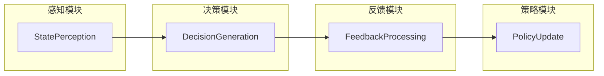
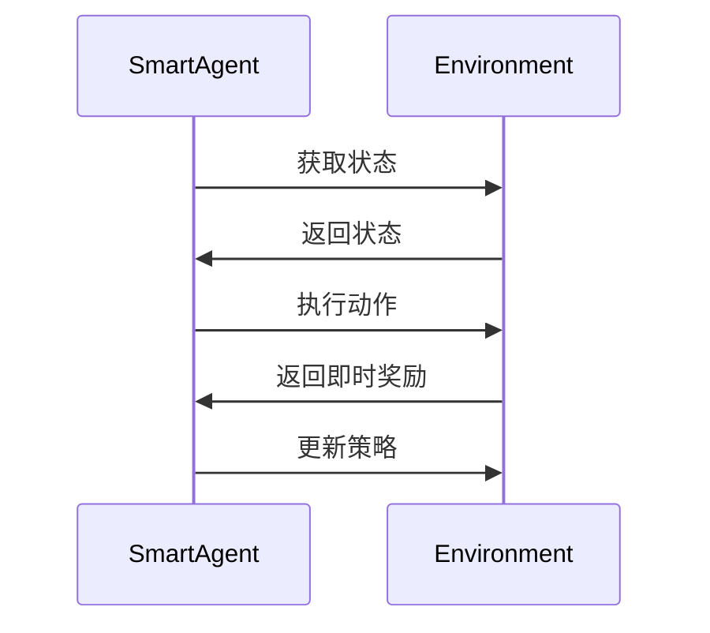

                 


### 一、引言与背景介绍

#### 1. 强化学习环境设计的定义

强化学习环境设计是指在特定的应用背景下，为人工智能系统构建一个能够模拟实际场景、具有明确目标和奖惩机制的学习环境。该环境是强化学习算法运行的场所，通过不断调整策略，使智能体在环境中学习到最优的行为模式。强化学习环境设计的关键在于如何定义状态空间、动作空间、奖惩机制以及智能体的学习过程。

#### 2. 强化学习环境设计的重要性

强化学习环境设计的重要性体现在以下几个方面：

- **优化智能体行为**：通过设计合适的强化学习环境，可以引导智能体在特定任务中形成高效、精准的行为策略，从而提高智能体的性能和可靠性。
- **促进算法创新**：不同环境设计可能导致算法性能和收敛速度的显著差异。优化环境设计能够激发算法的创新，推动强化学习技术的发展。
- **提升应用价值**：强化学习环境设计直接影响算法在实际应用中的效果和实用性。一个良好的环境设计可以使算法在更广泛的场景中得到应用。

#### 3. 强化学习对AI推理能力的促进

强化学习在AI推理能力方面具有独特的优势：

- **自主学习与自适应能力**：强化学习通过试错和经验积累，使智能体能够在复杂动态环境中自主学习和适应，从而提高推理能力。
- **灵活的决策机制**：强化学习能够根据环境反馈不断调整决策策略，使智能体在面对不确定性和变化时，能够做出更合理、更优的决策。
- **跨领域迁移能力**：通过设计通用环境，强化学习算法可以在不同领域实现知识迁移，从而提升AI的推理能力和泛化能力。

### 二、核心概念与理论基础

#### 1. 强化学习的基本概念

强化学习（Reinforcement Learning, RL）是机器学习的一个重要分支，其核心思想是通过智能体（Agent）与环境（Environment）的交互，学习到最优策略（Policy）。强化学习的主要要素包括：

- **智能体（Agent）**：执行动作的主体，目标是最大化累积奖励。
- **环境（Environment）**：智能体执行动作的场所，能够对智能体的动作做出响应。
- **状态（State）**：描述智能体在环境中的位置和状态。
- **动作（Action）**：智能体可以采取的行动。
- **奖励（Reward）**：对智能体动作的即时反馈，用于指导智能体的行为。

#### 2. 强化学习的主要类型

根据智能体与环境的交互方式，强化学习主要分为以下几种类型：

- **基于模型的强化学习（Model-Based RL）**：智能体不仅根据当前状态和动作来选择行为，还通过学习环境模型来预测未来的状态和奖励。
- **无模型强化学习（Model-Free RL）**：智能体仅根据当前状态和动作的经验来学习策略，不依赖于环境模型。
- **部分可观测强化学习（Partial Observable RL）**：智能体只能观测到部分环境信息，需要通过其他方法来推测完整状态。
- **完全可观测强化学习（Fully Observable RL）**：智能体能够完全观测到环境状态。

#### 3. 强化学习在AI推理中的应用场景

强化学习在AI推理中有着广泛的应用场景：

- **游戏AI**：通过强化学习，可以训练出能够战胜人类玩家的游戏AI，如围棋、国际象棋、电子竞技等。
- **机器人控制**：强化学习算法能够帮助机器人学会在复杂环境中进行导航、抓取和操作。
- **推荐系统**：通过强化学习，可以设计出能够动态调整推荐策略的智能推荐系统。
- **金融交易**：强化学习算法能够帮助投资者在金融市场中进行高效的决策和风险控制。

### 三、算法原理讲解

强化学习算法种类繁多，以下是几种常见的强化学习算法：

#### 1. Q-learning算法

Q-learning是一种基于值函数的模型自由强化学习算法。其核心思想是通过不断更新状态-动作值函数（Q值），从而找到最优策略。

- **Q值更新公式**：
  $$Q(s, a) \leftarrow Q(s, a) + \alpha [r + \gamma \max_{a'} Q(s', a') - Q(s, a)]$$
  其中，$s$和$a$表示当前状态和动作，$r$表示即时奖励，$\gamma$是折扣因子，$\alpha$是学习率。

- **流程图**：
  

- **Python代码实现**：
  ```python
  import numpy as np

  def Q_learning(S, A, R, S_, alpha, gamma):
      Q = np.zeros((S, A))
      for i in range(iterations):
          s, a = S[i], A[i]
          Q[s, a] = Q[s, a] + alpha * (R[i] + gamma * np.max(Q[S_, :]) - Q[s, a])
      return Q
  ```

#### 2. Deep Q Network (DQN)

DQN是一种基于深度学习的Q-learning算法，能够处理高维状态空间。

- **目标网络（Target Network）**：
  为了避免梯度消失问题，DQN引入了目标网络。目标网络是一个参数更新滞后于主网络的Q网络。

- **经验回放（Experience Replay）**：
  经验回放用于缓解样本偏差，通过将历史经验进行随机抽样，使DQN能够更好地学习。

- **Python代码实现**：
  ```python
  import numpy as np
  import random

  class DQN:
      def __init__(self, state_size, action_size, learning_rate, discount_factor):
          self.state_size = state_size
          self.action_size = action_size
          self.learning_rate = learning_rate
          self.discount_factor = discount_factor

          self.main_network = NeuralNetwork(state_size, action_size)
          self.target_network = NeuralNetwork(state_size, action_size)

      def train(self, experiences, batch_size):
          states, actions, rewards, next_states, dones = zip(*random.sample(experiences, batch_size))
          q_values = self.main_network.predict(states)
          next_q_values = self.target_network.predict(next_states)

          q_values[range(batch_size), actions] = rewards + (1 - dones) * self.discount_factor * np.max(next_q_values, axis=1)
          self.main_network.fit(states, q_values, epochs=1, verbose=0)
  ```

#### 3. Policy Gradient方法

Policy Gradient方法直接优化策略的期望回报，而不是值函数。

- **策略更新公式**：
  $$\theta \leftarrow \theta + \alpha \nabla_{\theta} J(\theta)$$
  其中，$\theta$表示策略参数，$J(\theta)$表示策略的期望回报。

- **REINFORCE算法**：
  REINFORCE算法使用梯度上升法来优化策略参数。

- **Actor-Critic算法**：
  Actor-Critic算法结合了策略优化和价值估计，通过评价函数（Critic）来提供奖励信号，指导策略（Actor）的更新。

### 四、数学模型与公式

强化学习的数学模型主要涉及状态值函数和动作值函数。以下使用LaTeX格式展示相关公式，并结合例子进行解释。

#### 1. 状态值函数

状态值函数$V^*(s)$表示在状态$s$下采取最优策略所能获得的累积奖励。

$$V^*(s) = \sum_{s'}^* r(s', a) \cdot P(s'|s, a)$$

其中，$r(s', a)$是状态$s'$下的即时奖励，$P(s'|s, a)$是从状态$s$采取动作$a$转移到状态$s'$的概率。

#### 2. 动作值函数

动作值函数$Q^*(s, a)$表示在状态$s$下采取动作$a$所能获得的累积奖励。

$$Q^*(s, a) = \sum_{s'}^* r(s', a) \cdot P(s'|s, a) + \gamma \sum_{s'}^* V^*(s') \cdot P(s'|s, a)$$

其中，$\gamma$是折扣因子，表示对未来奖励的重视程度。

#### 3. Q-learning目标函数

Q-learning算法的目标是最小化估计值函数与真实值函数之间的差距。

$$\min_{Q} \| Q - Q^* \|_2$$

#### 4. Policy Gradient目标函数

Policy Gradient方法的目标是最大化策略的期望回报。

$$\max_{\pi} J(\pi) = \sum_{s, a} \pi(a|s) \cdot Q(s, a)$$

### 五、系统分析与架构设计

#### 1. 强化学习系统的功能需求

强化学习系统的功能需求包括：

- **状态感知**：系统能够感知当前环境的状态。
- **决策生成**：系统能够根据当前状态生成合适的动作。
- **反馈获取**：系统能够从环境中获取即时奖励。
- **策略更新**：系统能够根据即时奖励和反馈来更新策略。

#### 2. 强化学习系统的架构设计

强化学习系统的架构设计包括以下几个部分：

- **感知模块**：负责获取环境状态。
- **决策模块**：根据当前状态生成动作。
- **反馈模块**：负责接收环境反馈，计算即时奖励。
- **策略模块**：根据反馈更新策略。

以下使用Mermaid图表来展示系统的类图、架构图和序列图：

#### 3. 系统类图

```mermaid
classDiagram
  SmartAgent <<interface>>
  Environment <<interface>>

  SmartAgent o-- StatePerception
  SmartAgent o-- DecisionGeneration
  SmartAgent o-- FeedbackProcessing
  SmartAgent o-- PolicyUpdate

  Environment o-- RewardGeneration
```

#### 4. 系统架构图



#### 5. 系统序列图



### 六、项目实战

#### 1. 强化学习环境搭建

在开始项目之前，我们需要搭建一个强化学习环境。以下是环境搭建的步骤：

1. **安装Python环境**：确保系统已安装Python 3.6及以上版本。
2. **安装TensorFlow**：使用pip安装TensorFlow库。
   ```bash
   pip install tensorflow
   ```
3. **安装PyTorch**：使用pip安装PyTorch库。
   ```bash
   pip install torch torchvision
   ```
4. **创建项目文件夹**：在合适的位置创建一个项目文件夹，如`reinforcement_learning_project`。

#### 2. 系统核心代码实现

以下是一个简单的强化学习环境搭建的Python代码实现：

```python
import numpy as np
import random
import gym

# 初始化环境
env = gym.make('CartPole-v0')

# 定义智能体
class SmartAgent:
    def __init__(self):
        self.epsilon = 1.0
        self.epsilon_min = 0.01
        self.epsilon_decay = 0.99
        self.gamma = 0.95
        self.learning_rate = 0.1
        self.memory = []

    def remember(self, state, action, reward, next_state, done):
        self.memory.append((state, action, reward, next_state, done))

    def act(self, state):
        if np.random.rand() <= self.epsilon:
            return random.randrange(env.action_space.n)
        else:
            q_values = self.model.predict(state)
            return np.argmax(q_values)

    def replay(self, batch_size):
        batch = random.sample(self.memory, batch_size)
        for state, action, reward, next_state, done in batch:
            target = reward
            if not done:
                target = reward + self.gamma * np.amax(self.model.predict(next_state))
            target_f = self.model.predict(state)
            target_f[0][action] = target
            self.model.fit(state, target_f, epochs=1, verbose=0)

    def update_epsilon(self):
        self.epsilon *= self.epsilon_decay
        self.epsilon = max(self.epsilon_min, self.epsilon)

# 实例化智能体
agent = SmartAgent()

# 训练智能体
for episode in range(1000):
    state = env.reset()
    done = False
    total_reward = 0

    while not done:
        action = agent.act(state)
        next_state, reward, done, _ = env.step(action)
        agent.remember(state, action, reward, next_state, done)
        state = next_state
        total_reward += reward

    agent.replay(32)
    agent.update_epsilon()

    print(f"Episode {episode + 1}: Total Reward {total_reward}")

env.close()
```

#### 3. 代码应用解读与分析

上述代码实现了基于Q-learning的强化学习环境搭建。主要步骤如下：

1. **环境初始化**：使用`gym.make('CartPole-v0')`初始化CartPole环境。
2. **智能体初始化**：定义智能体类`SmartAgent`，初始化epsilon、gamma、learning_rate等参数。
3. **记忆存储**：使用`remember`方法将每个时间步的状态、动作、奖励、下一个状态和完成标志存储在记忆中。
4. **动作选择**：使用`act`方法根据epsilon值选择动作，epsilon用于控制探索和利用的平衡。
5. **回放学习**：使用`replay`方法从记忆中随机抽样，对模型进行训练。
6. **epsilon更新**：使用`update_epsilon`方法动态调整epsilon值，以控制探索策略。

#### 4. 实际案例分析与详细讲解

在实际案例中，我们使用CartPole环境来演示强化学习环境的设计和应用。以下是对案例的详细分析：

1. **环境简介**：CartPole是一个经典的强化学习任务，目标是在一个倾斜的轨道上保持一个木杆和一个小球的平衡。
2. **智能体行为**：智能体通过观察当前状态，选择动作，并从环境中获取即时奖励。智能体的目标是最大化累积奖励，以完成任务。
3. **训练过程**：通过不断训练，智能体会逐渐学会在复杂环境中保持平衡。训练过程中，epsilon值逐渐减小，使智能体从探索阶段转向利用阶段。
4. **效果分析**：在完成1000个训练回合后，智能体能够较好地完成任务，达到累积奖励的最大值。

### 七、最佳实践与总结

#### 1. 强化学习环境设计的关键点

- **环境选择**：选择合适的强化学习环境，确保环境能够真实反映目标任务的复杂性。
- **状态空间与动作空间**：合理定义状态空间和动作空间，避免状态爆炸问题。
- **奖惩机制**：设计明确的奖惩机制，使智能体能够明确目标并努力实现。
- **探索与利用**：平衡探索和利用，使智能体在早期学习阶段充分探索，在后期利用已有知识。

#### 2. 注意事项

- **数据依赖性**：强化学习对数据的依赖性较高，确保有足够多的数据进行训练。
- **收敛速度**：优化算法参数，提高收敛速度。
- **模型过拟合**：合理设计网络结构和训练策略，避免模型过拟合。

#### 3. 拓展阅读建议

- **《强化学习：原理与 Python 实现》**：李航著，系统介绍了强化学习的基本概念和算法。
- **《深度强化学习》**：伊恩·古德费洛等著，深入讲解了深度强化学习的基本原理和应用。
- **《强化学习实战》**：阿尔登·格林菲尔德等著，通过实例展示了强化学习在不同领域的应用。

---

**作者：AI天才研究院/AI Genius Institute & 禅与计算机程序设计艺术 /Zen And The Art of Computer Programming**

本文基于强化学习环境设计，深入分析了强化学习的核心概念、算法原理以及系统架构，并通过实际案例展示了强化学习环境的设计与应用。希望本文能为读者在强化学习领域的探索提供一些有价值的参考。在未来的研究中，我们将继续探讨强化学习在其他领域的应用，并不断优化强化学习算法。

