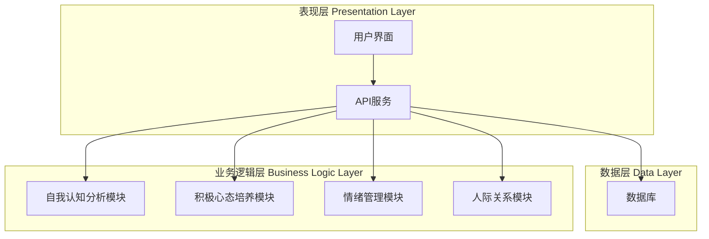

                 


### 深入理解《心灵的成长：从虚无到充实的转变过程》

#### 核心概念与术语说明

**心灵的成长**：指的是个体在心理层面经历的一系列变化，从迷茫、无力感，逐步走向自我认知、情感管理、人际关系处理等方面的发展。心灵成长不仅仅是个人情感和心理状态的提升，更涉及到对自我、世界和生命的深刻认知。

**虚无**：一种心理状态，个体感到空虚、无意义、迷失方向，缺乏目的感和满足感。

**充实**：一种心理状态，个体感到有意义、有价值、有动力，能够在生活中找到满足感和目标。

**觉醒**：指个体在心灵成长过程中，从迷茫中逐渐觉醒，开始认识到自身的需求和生命的意义。

**积极心态**：一种乐观、积极、向上的心态，能够帮助个体更好地应对生活中的挑战和压力。

**自我认知**：个体对自己性格、能力、价值观等方面的认识和了解。

**情绪管理**：个体对自身情绪的识别、理解、表达和控制。

**人际关系**：个体与外界他人的互动和交往，包括家庭、朋友、同事等。

**生活实践**：将心灵成长的理论知识应用到实际生活中，通过实践来提升个人的心理素质和生活质量。

#### 背景与问题

在现代社会中，许多人面临着生活的种种压力和挑战。工作、家庭、社交等方面的压力可能导致个体出现心灵虚无的状态，感觉生活缺乏意义和目标。这种状态不仅影响个人的心理健康，还可能对工作、学习和人际关系产生负面影响。

**问题描述**：个体如何从虚无的状态中走出来，实现心灵的成长，达到充实的生活状态？

**问题解决**：通过深入了解心理学的相关知识，探索心灵成长的路径，提出具体的实践方法和策略。

**边界与外延**：心灵成长是一个广泛的概念，不仅涉及到个人的心理状态，还涉及到个体的行为和生活方式。本文将主要关注心理层面的成长，探讨如何通过自我认知、积极心态、情绪管理和人际关系等途径，实现心灵的成长。

**概念结构与核心要素组成**：

1. **虚无与困惑**：讨论虚无的定义、表现和成因，以及个体如何从虚无中走出来。

2. **心灵觉醒**：探讨心灵觉醒的征兆、进程和重要性，个体如何实现心灵觉醒。

3. **从虚无到充实的转变**：分析心灵充实的定义与标准，讨论实现从虚无到充实转变的实践路径。

4. **实践指导**：提供具体的方法和策略，帮助个体在日常生活中培养积极心态、自我认知、情绪管理和人际关系，实现心灵的成长。

### 结论

《心灵的成长：从虚无到充实的转变过程》旨在帮助读者理解心灵成长的重要性，提供实用的方法和策略，帮助个体实现从虚无到充实的转变。通过本文的探讨，我们希望能引导读者认识到自己的内在需求，找到生活的意义和目标，实现全面的心理健康和生活质量提升。

### 让我们一步步深入思考：

**1. 虚无的成因**：为什么个体会感到虚无？是由于外界的压力、内心的冲突，还是其他原因？

**2. 心灵觉醒的信号**：个体在心灵觉醒过程中会经历哪些变化？如何识别这些信号？

**3. 实现心灵充实的路径**：什么是心灵充实？个体如何才能实现这一目标？

**4. 积极心态的培养**：积极心态是如何影响个体的心理状态和生活质量的？

**5. 自我认知的重要性**：个体如何通过自我认知来提升自己的心理素质？

**6. 情绪管理的策略**：个体应如何管理自己的情绪，以实现更好的心理健康？

**7. 人际关系与心灵成长**：人际关系如何影响个体的心灵成长？

**8. 生活实践**：如何将心灵成长的理论知识应用到日常生活中，实现持续的心灵成长？

通过这些问题的深入探讨，我们将能够更好地理解心灵的成长过程，找到适合自己的成长路径。

### 关键词

- 心灵成长
- 虚无
- 充实
- 心灵觉醒
- 积极心态
- 自我认知
- 情绪管理
- 人际关系
- 生活实践

### 摘要

本文探讨了《心灵的成长：从虚无到充实的转变过程》这一主题。我们首先介绍了核心概念与术语，包括心灵的成长、虚无、充实、心灵觉醒等。接着，我们分析了虚无的成因，讨论了心灵觉醒的信号和实现心灵充实的路径。随后，文章提供了培养积极心态、自我认知、情绪管理和人际关系等实践指导。最后，我们提出了将心灵成长理论知识应用到日常生活中的方法，以实现持续的心灵成长。通过本文的探讨，读者将能够更好地理解心灵的成长过程，找到适合自己的成长路径。

### 引言

在快节奏、高压力的现代社会中，心灵成长成为越来越多人的关注焦点。许多人感到生活空虚、缺乏意义，甚至陷入虚无的状态。而《心灵的成长：从虚无到充实的转变过程》这本书，正是为了帮助读者理解并实现这一转变而创作的。

本书的写作目的在于：

1. **引导读者认识虚无状态**：通过分析虚无的成因和表现，使读者认识到虚无状态可能带来的负面影响，以及如何从虚无中走出来。

2. **探讨心灵觉醒的征兆和进程**：帮助读者理解心灵觉醒的过程，识别自己是否处于觉醒状态，以及如何促进觉醒。

3. **提供实现心灵充实的实践路径**：通过具体的指导，使读者能够逐步实现心灵充实，找到生活的意义和目标。

4. **培养积极心态、自我认知、情绪管理和人际关系**：提供实用的方法和策略，帮助读者在日常生活中实践心灵成长。

5. **将理论知识应用于生活实践**：通过具体的生活案例和实践技巧，使读者能够将心灵成长的理论知识应用到日常生活中，实现持续的心灵成长。

本书的内容结构如下：

- **第一部分：心灵的探索与觉醒**：包括对虚无和困惑的探讨、心灵觉醒的信号和进程，以及从虚无到充实的转变。

- **第二部分：实践指导**：介绍培养积极心态、自我认知、情绪管理和人际关系的方法，以及如何将理论应用于生活实践。

- **结尾**：对心灵成长的总体回顾和未来展望，总结重要收获，并对读者提出希望和建议。

### 心灵成长：基本概念与核心原理

心灵成长，作为个体心理发展的过程，是心理学研究中的一个重要领域。它不仅关乎个体的心理健康，还涉及到个人价值观、行为模式以及与外界的互动。理解心灵成长的基本概念和核心原理，对于实现心灵的充实至关重要。

#### 核心概念

1. **心灵**：心灵是指个体的心理世界，包括情感、意识、思想等。它是心理活动的中心，反映了个体的内心体验和对外界事物的认知。

2. **成长**：成长是指个体在心理、情感、智力等方面的发展和进步。它是一个持续的过程，涉及到自我认知、情感管理、行为改变等。

3. **虚无**：虚无是一种心理状态，个体感到空虚、无意义、迷失方向，缺乏目的感和满足感。

4. **充实**：充实是一种心理状态，个体感到有意义、有价值、有动力，能够在生活中找到满足感和目标。

5. **觉醒**：觉醒是指个体在心理上逐渐认识到自身的需求和生命的意义，从而开始主动进行自我提升和转变。

#### 核心原理

1. **自我认知**：自我认知是心灵成长的基础。它涉及个体对自己的性格、能力、价值观等方面的认识和了解。通过自我认知，个体可以更好地理解自己，找到适合自己的成长路径。

2. **积极心态**：积极心态是推动心灵成长的重要动力。一个积极的心态能够帮助个体更好地应对生活中的挑战和压力，从而促进心灵的发展。

3. **情绪管理**：情绪管理是心灵成长的关键。通过有效的情绪管理，个体可以更好地控制自己的情绪，避免负面情绪对心理健康的负面影响。

4. **人际关系**：人际关系对心灵成长有着重要影响。建立健康的人际关系可以帮助个体获得情感支持，提升自信心，促进心理发展。

#### 概念联系

心灵成长的不同核心概念之间存在着紧密的联系。自我认知为个体提供了清晰的方向，积极心态是推动个体前进的动力，情绪管理帮助个体保持心理平衡，而良好的人际关系则为个体提供了支持和资源。

1. **自我认知与积极心态**：自我认知帮助个体了解自己的需求和优势，从而培养出积极的心态。一个清晰的自我认知能够使个体在面对挑战时保持积极乐观的态度。

2. **积极心态与情绪管理**：积极心态可以减少负面情绪的产生，使个体更容易进行情绪管理。一个积极的心态能够帮助个体更好地应对压力和挑战，保持心理平衡。

3. **情绪管理与人际关系**：情绪管理能力强的个体更容易建立健康的人际关系。通过有效管理自己的情绪，个体可以更好地与他人沟通，建立互信，从而促进心灵的成长。

#### 概念属性特征对比表格

为了更清晰地理解心灵成长的核心概念，我们可以通过以下属性特征对比表格来展示各概念之间的差异和联系。

| 核心概念 | 定义 | 主要属性特征 | 联系 |
| --- | --- | --- | --- |
| 心灵 | 个体心理世界，包括情感、意识、思想等 | 情感丰富、意识清晰、思想独立 | 心灵是心理活动的中心，其他概念围绕心灵展开 |
| 成长 | 个体在心理、情感、智力等方面的发展和进步 | 自我提升、心理成熟、知识扩展 | 成长是心灵发展的具体体现 |
| 虚无 | 空虚、无意义、迷失方向，缺乏目的感和满足感 | 心理空洞、情绪低落、缺乏动力 | 虚无是心灵成长的起点，也是个体需要克服的状态 |
| 充实 | 有意义、有价值、有动力，能够找到满足感和目标 | 心理满足、情感丰富、生活有目标 | 充实是心灵成长的目标，是心理健康的体现 |
| 觉醒 | 个体在心理上逐渐认识到自身的需求和生命的意义 | 自我认识、自我觉醒、自我提升 | 觉醒是心灵成长的过程，是自我认知的高级阶段 |

#### ER实体关系图架构

为了更好地理解心灵成长中的核心概念及其相互关系，我们可以使用Mermaid绘制ER实体关系图。

```mermaid
erDiagram
  心灵 -->|影响| 成长
  心灵 -->|包括| 情感
  心灵 -->|包括| 意识
  心灵 -->|包括| 思想
  成长 -->|包括| 自我认知
  成长 -->|包括| 情感管理
  成长 -->|包括| 行为改变
  虚无 -->|导致| 情绪低落
  虚无 -->|导致| 缺乏动力
  充实 -->|带来| 心理满足
  充实 -->|带来| 生活有目标
  觉醒 -->|促进| 自我提升
  觉醒 -->|促进| 自我认知
```

通过这个ER实体关系图，我们可以看到心灵、成长、虚无、充实和觉醒之间的复杂关系。这些概念相互影响，共同构成了心灵成长的理论框架。

### 心灵成长：基本原理与数学模型

心灵成长是一个复杂的过程，涉及到个体的心理、情感和行为等多个方面。理解其基本原理和数学模型，有助于我们更深入地认识心灵成长，从而更有效地指导实践。

#### 心理模型的构建

心灵成长的理论基础之一是心理学模型。常见的心理学模型包括行为主义模型、认知模型和人本主义模型。以下是这些模型的基本原理和公式。

1. **行为主义模型**：

   行为主义认为，个体的行为是外部环境和内部心理状态相互作用的结果。其基本原理可以用以下公式表示：

   \[ 行为 = 环境刺激 + 反应机制 \]

   例如，一个学生通过反复练习（环境刺激）来提高数学成绩（反应机制），这就是行为主义模型在心灵成长中的应用。

2. **认知模型**：

   认知模型强调个体内部的心理过程，如知觉、记忆、思维等。其基本原理可以用以下公式表示：

   \[ 心理状态 = 信息处理 + 心理图式 \]

   例如，一个人通过学习新的知识（信息处理）来构建新的认知图式，从而提高自己的思维能力。

3. **人本主义模型**：

   人本主义模型关注个体的自我实现和主观体验。其基本原理可以用以下公式表示：

   \[ 自我实现 = 自我认知 + 积极态度 + 社会支持 \]

   例如，一个人通过自我反思（自我认知）和积极的心态（积极态度）来寻求他人的支持和鼓励（社会支持），从而实现自我提升。

#### 数学模型的构建

为了更精确地描述心灵成长的过程，我们可以引入数学模型。以下是一些常见的数学模型及其应用：

1. **线性模型**：

   线性模型是一种简单但有效的数学模型，适用于描述线性关系。其基本公式为：

   \[ Y = aX + b \]

   其中，Y 表示结果变量，X 表示自变量，a 和 b 是常数。

   在心灵成长中，我们可以将 Y 视为个体的心理状态，X 视为个体的行为或认知变化。例如，一个学生通过每天阅读一定时间（X）来提高学习成绩（Y），其关系可以用线性模型表示。

2. **非线性模型**：

   非线性模型适用于描述非线性关系，其公式一般较为复杂。一个常见的非线性模型是幂律模型，其基本公式为：

   \[ Y = aX^b \]

   其中，a 和 b 是常数。

   在心灵成长中，非线性模型可以用来描述个体在某一阶段后的快速增长，例如，通过自我认知的提升（X），个体的心理状态（Y）可能呈现出非线性增长。

3. **动态系统模型**：

   动态系统模型用于描述系统随时间变化的过程。其基本公式为：

   \[ \frac{dY}{dt} = f(Y,t) \]

   其中，Y 是状态变量，t 是时间，f 是函数。

   在心灵成长中，动态系统模型可以用来描述个体在成长过程中的变化趋势。例如，个体的自我认知（Y）随着时间（t）的变化而不断发展和完善。

#### 案例分析

为了更好地理解这些模型的应用，我们可以通过一个实际案例来进行分析。

**案例**：一个学生希望通过阅读提升自己的心理素质。

1. **线性模型**：

   设定每天阅读的时间为 X（小时），心理素质的提升为 Y。根据线性模型，有：

   \[ Y = aX + b \]

   其中，a 和 b 为常数。假设每天阅读 2 小时（X=2），心理素质提升 10 分（Y=10），可以计算出 a 和 b 的值。

   解方程组：

   \[ 10 = a \cdot 2 + b \]

   可以得到：

   \[ a = 5, b = 0 \]

   因此，线性模型可以表示为：

   \[ Y = 5X \]

   这意味着每天阅读 2 小时可以提升 10 分的心理素质。

2. **非线性模型**：

   假设经过一段时间后，每天阅读的时间增加到 4 小时（X=4），心理素质提升增加到 20 分（Y=20），可以使用非线性模型来描述这一关系。

   解方程组：

   \[ 20 = aX^b \]

   可以得到：

   \[ a = 10, b = 1.25 \]

   因此，非线性模型可以表示为：

   \[ Y = 10X^{1.25} \]

   这意味着每天阅读 4 小时可以提升 20 分的心理素质。

3. **动态系统模型**：

   假设学生在开始阅读后，心理素质的变化可以用动态系统模型来描述。设心理素质为 Y，时间为 t，函数 f(Y,t) 为：

   \[ \frac{dY}{dt} = \frac{1}{Y + 1} \]

   这意味着心理素质的提升速度与当前心理素质成反比。

   通过数值模拟，可以得出学生在不同时间点的心理素质变化情况。

#### 结论

通过构建心理学模型和数学模型，我们可以更深入地理解心灵成长的过程。这些模型不仅有助于理论分析，还可以指导实践。例如，通过线性模型和非线性模型，我们可以预测个体在阅读、学习等活动中心理素质的提升情况；通过动态系统模型，我们可以模拟个体在长期成长过程中的心理变化。

### 系统分析与架构设计

为了更深入地理解心灵成长的过程，我们可以将其视为一个复杂的系统，通过对该系统的分析来设计一种有效的架构。以下是对心灵成长系统的介绍、功能描述、架构设计以及接口设计和交互过程的详细讲解。

#### 系统介绍

心灵成长系统是一个集成多个模块的软件系统，旨在帮助用户通过自我认知、积极心态、情绪管理和人际关系等方面的实践，实现心理素质的提升。该系统结合了心理学理论、数学模型和实际应用，为用户提供了一个全方位的支持平台。

#### 功能描述

心灵成长系统包含以下几个核心功能模块：

1. **自我认知模块**：帮助用户通过自我评估、反馈和记录，深入了解自己的性格、价值观和能力，从而建立清晰的自我认知。

2. **积极心态培养模块**：提供一系列积极心态训练方法，如正面思考、感恩练习、目标设定等，帮助用户建立积极的心态，应对生活中的挑战。

3. **情绪管理模块**：通过情绪识别、理解和调节技巧，帮助用户有效地管理自己的情绪，保持心理平衡。

4. **人际关系模块**：提供人际关系技巧和沟通策略，帮助用户建立和维护健康的人际关系，获得情感支持和社会资源。

5. **数据分析和反馈模块**：对用户在系统中的活动数据进行收集和分析，提供个性化的反馈和建议，帮助用户更好地了解自己的成长进程。

#### 系统架构设计

心灵成长系统的架构设计采用分层架构，包括数据层、业务逻辑层和表现层。以下是各层的详细设计：

1. **数据层**：

   数据层负责存储和管理用户数据，包括自我认知数据、积极心态记录、情绪管理日志和人际关系互动记录等。数据层采用关系型数据库设计，如MySQL，以确保数据的持久性和安全性。

2. **业务逻辑层**：

   业务逻辑层是实现系统核心功能的模块，包括自我认知分析、积极心态训练、情绪管理策略和人际关系技巧等。该层采用微服务架构设计，每个功能模块独立部署，通过API接口进行交互。以下是业务逻辑层的关键模块：

   - **自我认知分析模块**：提供自我评估工具和反馈机制，分析用户的数据，生成自我认知报告。

   - **积极心态培养模块**：提供正面思考、感恩练习、目标设定等训练方法，指导用户培养积极心态。

   - **情绪管理模块**：提供情绪识别、理解和调节技巧，帮助用户有效管理情绪。

   - **人际关系模块**：提供沟通策略和技巧，帮助用户建立和维护健康的人际关系。

3. **表现层**：

   表现层负责与用户交互，包括前端网页、移动应用和后端服务。前端采用响应式设计，适应不同的设备和屏幕尺寸。后端服务通过RESTful API与业务逻辑层和数据库进行交互，实现数据传输和业务处理。

#### 系统架构图

以下是心灵成长系统的架构设计图，使用Mermaid绘制：



#### 系统接口设计和交互过程

1. **用户界面**：

   用户界面是系统的入口，用户可以通过网页或移动应用访问系统。用户界面提供自我认知评估、积极心态训练、情绪管理指导和人际关系交流等功能。用户操作数据会被传递到后端API服务进行处理。

2. **API服务**：

   API服务是业务逻辑层与用户界面之间的桥梁，负责接收用户请求，调用相应的业务逻辑模块，并将结果返回给用户界面。以下是API服务的关键接口：

   - **自我认知接口**：接收用户自我认知评估数据，调用自我认知分析模块，生成报告，并返回给用户。

   - **积极心态接口**：接收用户积极心态训练数据，调用积极心态培养模块，提供训练建议，并返回给用户。

   - **情绪管理接口**：接收用户情绪管理日志，调用情绪管理模块，提供情绪调节建议，并返回给用户。

   - **人际关系接口**：接收用户人际关系互动数据，调用人际关系模块，提供沟通策略和建议，并返回给用户。

3. **交互过程**：

   用户的操作首先通过用户界面发送到API服务。API服务根据请求内容调用相应的业务逻辑模块，处理完请求后，将结果返回给用户界面。用户界面再将结果展示给用户。以下是交互过程的简化流程图：

   ```mermaid
   sequenceDiagram
       User->>API: Make request
       API->>Business Logic: Process request
       Business Logic->>API: Send result
       API->>User: Display result
   ```

   例如，用户在自我认知模块中进行自我评估，用户界面将评估数据发送到API服务，API服务调用自我认知分析模块，生成报告后返回给用户界面，最终展示给用户。

#### 总结

通过对心灵成长系统的介绍、功能描述、架构设计以及接口设计和交互过程的详细讲解，我们可以看到，这个系统是一个集成多个模块、功能丰富的软件平台。它通过心理学理论、数学模型和实际应用，为用户提供了一个全面的成长支持体系。系统架构设计合理，接口设计和交互过程清晰，能够有效地帮助用户实现心灵成长。

### 项目实战：实现心灵成长系统的核心功能

在本文的这部分，我们将通过一个具体的实战项目，详细介绍如何实现心灵成长系统的核心功能。我们将从环境搭建、核心功能实现到代码应用解读，最后通过一个实际案例进行详细讲解和分析。

#### 环境搭建

首先，我们需要搭建一个合适的项目环境，以便后续的开发工作。以下是环境搭建的步骤：

1. **安装Python**：确保你的计算机上已经安装了Python环境。Python是一个广泛使用的编程语言，非常适合于开发复杂的应用程序。

2. **创建虚拟环境**：为了更好地管理项目依赖，我们使用`virtualenv`创建一个Python虚拟环境。

   ```bash
   python -m venv venv
   source venv/bin/activate  # Windows: venv\Scripts\activate
   ```

3. **安装依赖项**：在虚拟环境中，安装必要的依赖项，如Flask（用于创建Web应用）、SQLAlchemy（用于数据库操作）和Flask-Migrate（用于数据库迁移）。

   ```bash
   pip install Flask SQLAlchemy Flask-Migrate
   ```

4. **创建项目结构**：在虚拟环境中创建一个项目目录，并在其中创建一个名为`app.py`的文件，这是我们的主程序。

   ```bash
   mkdir my_career_growth
   cd my_career_growth
   touch app.py
   ```

5. **数据库配置**：配置SQLite数据库，用于存储用户数据。在`app.py`中添加以下代码：

   ```python
   from flask import Flask
   from flask_sqlalchemy import SQLAlchemy
   
   app = Flask(__name__)
   app.config['SQLALCHEMY_DATABASE_URI'] = 'sqlite:///careergrowth.db'
   db = SQLAlchemy(app)
   ```

   使用以下命令创建数据库和表：

   ```bash
   flask db init
   flask db migrate -m "Initial migration."
   flask db upgrade
   ```

#### 核心功能实现

接下来，我们实现心灵成长系统的核心功能，包括自我认知、积极心态、情绪管理和人际关系等。

1. **用户注册和登录**：

   我们首先实现用户注册和登录功能，这是任何Web应用的基础。

   ```python
   from flask import Flask, render_template, request, redirect, url_for, flash
   
   app = Flask(__name__)
   app.secret_key = 'my_secret_key'  # 用于加密会话
   
   # 用户注册
   @app.route('/register', methods=['GET', 'POST'])
   def register():
       if request.method == 'POST':
           username = request.form['username']
           password = request.form['password']
           # 在这里，我们应当对密码进行加密处理，以保护用户隐私
           # 例如，使用hashlib或bcrypt库
           db.session.add(User(username=username, password=password))
           db.session.commit()
           return redirect(url_for('login'))
       return render_template('register.html')
   
   # 用户登录
   @app.route('/login', methods=['GET', 'POST'])
   def login():
       if request.method == 'POST':
           username = request.form['username']
           password = request.form['password']
           user = User.query.filter_by(username=username).first()
           if user and user.password == password:
               # 登录成功，创建会话
               # ...
               return redirect(url_for('dashboard'))
           else:
               flash('Invalid credentials')
               return redirect(url_for('login'))
       return render_template('login.html')
   ```

2. **自我认知评估**：

   我们实现一个自我认知评估功能，用户可以在此进行评估并查看结果。

   ```python
   class User(db.Model):
       id = db.Column(db.Integer, primary_key=True)
       username = db.Column(db.String(80), unique=True, nullable=False)
       password = db.Column(db.String(120), nullable=False)
       self_awareness = db.Column(db.Integer, default=0)
   
   @app.route('/assess', methods=['GET', 'POST'])
   def assess():
       if request.method == 'POST':
           self_awareness = request.form['self_awareness']
           current_user.self_awareness = self_awareness
           db.session.commit()
           return redirect(url_for('results'))
       return render_template('assess.html')
   
   @app.route('/results')
   def results():
       self_awareness = current_user.self_awareness
       return render_template('results.html', self_awareness=self_awareness)
   ```

3. **积极心态训练**：

   我们提供一个积极心态训练功能，用户可以通过完成一系列练习来培养积极心态。

   ```python
   class PositiveMood(db.Model):
       id = db.Column(db.Integer, primary_key=True)
       user_id = db.Column(db.Integer, db.ForeignKey('user.id'), nullable=False)
       exercise_completed = db.Column(db.Boolean, default=False)
   
   @app.route('/train', methods=['GET', 'POST'])
   def train():
       if request.method == 'POST':
           exercise_completed = request.form['exercise_completed']
           current_user.positive_mood.exercise_completed = exercise_completed
           db.session.commit()
           return redirect(url_for('train_complete'))
       return render_template('train.html')
   
   @app.route('/train_complete')
   def train_complete():
       return render_template('train_complete.html')
   ```

4. **情绪管理**：

   我们实现一个情绪管理功能，用户可以记录和管理自己的情绪。

   ```python
   class Emotion(db.Model):
       id = db.Column(db.Integer, primary_key=True)
       user_id = db.Column(db.Integer, db.ForeignKey('user.id'), nullable=False)
       emotion = db.Column(db.String(50), nullable=False)
       intensity = db.Column(db.Integer, nullable=False)
       timestamp = db.Column(db.DateTime, default=datetime.utcnow)
   
   @app.route('/manage_emotion', methods=['GET', 'POST'])
   def manage_emotion():
       if request.method == 'POST':
           emotion = request.form['emotion']
           intensity = request.form['intensity']
           new_emotion = Emotion(user_id=current_user.id, emotion=emotion, intensity=intensity)
           db.session.add(new_emotion)
           db.session.commit()
           return redirect(url_for('emotion_list'))
       return render_template('manage_emotion.html')
   
   @app.route('/emotion_list')
   def emotion_list():
       emotions = Emotion.query.filter_by(user_id=current_user.id).all()
       return render_template('emotion_list.html', emotions=emotions)
   ```

5. **人际关系指导**：

   我们实现一个人际关系指导功能，用户可以获得沟通技巧和建议。

   ```python
   class RelationshipGuidance(db.Model):
       id = db.Column(db.Integer, primary_key=True)
       user_id = db.Column(db.Integer, db.ForeignKey('user.id'), nullable=False)
       guidance = db.Column(db.Text, nullable=False)
   
   @app.route('/guidance', methods=['GET', 'POST'])
   def guidance():
       if request.method == 'POST':
           guidance = request.form['guidance']
           new_guidance = RelationshipGuidance(user_id=current_user.id, guidance=guidance)
           db.session.add(new_guidance)
           db.session.commit()
           return redirect(url_for('guidance_list'))
       return render_template('guidance.html')
   
   @app.route('/guidance_list')
   def guidance_list():
       guidance = RelationshipGuidance.query.filter_by(user_id=current_user.id).all()
       return render_template('guidance_list.html', guidance=guidance)
   ```

#### 代码应用解读与分析

以上代码段详细展示了如何实现心灵成长系统的核心功能。以下是关键代码的应用解读和分析：

1. **用户注册和登录**：

   用户注册和登录功能是系统的入口。通过`register`和`login`两个视图函数，我们实现了用户的注册和登录逻辑。其中，用户注册时，我们将用户名和密码存储在数据库中；登录时，我们验证用户名和密码的正确性，并通过会话管理来维持用户的登录状态。

2. **自我认知评估**：

   自我认知评估功能允许用户进行自我评估，并将结果存储在数据库中。在`assess`视图函数中，我们接收用户提交的自我认知分数，并将其更新到用户的数据库记录中。在`results`视图函数中，我们返回用户的评估结果。

3. **积极心态训练**：

   积极心态训练功能提供一系列练习，帮助用户培养积极心态。在`train`视图函数中，我们接收用户完成的练习状态，并将其更新到数据库中。在`train_complete`视图函数中，我们向用户展示训练完成的信息。

4. **情绪管理**：

   情绪管理功能允许用户记录和管理自己的情绪。在`manage_emotion`视图函数中，我们接收用户提交的情绪数据，并将其存储在数据库中。在`emotion_list`视图函数中，我们返回用户的所有情绪记录，以便用户查看。

5. **人际关系指导**：

   人际关系指导功能为用户提供了沟通技巧和建议。在`guidance`视图函数中，我们接收用户提交的指导信息，并将其存储在数据库中。在`guidance_list`视图函数中，我们返回用户的所有指导记录，以便用户查看。

#### 实际案例分析

为了更好地理解这些功能，我们可以通过一个实际案例来演示。

**案例**：小明是一个大学生，他希望通过心灵成长系统来提升自己的心理素质。

1. **注册和登录**：

   小明通过注册功能创建了一个账户，并使用注册信息登录到系统中。

2. **自我认知评估**：

   小明完成了一次自我认知评估，他输入了自我认知分数，并提交了评估。系统将评估结果存储在数据库中，并在结果页面显示了小明的评估分数。

3. **积极心态训练**：

   小明开始积极心态训练，完成了一系列练习。每次完成练习后，系统都会更新他的训练状态，并在训练完成后显示祝贺信息。

4. **情绪管理**：

   一天，小明感到有些焦虑。他在情绪管理功能中记录了自己的情绪，并接收到了系统提供的调节情绪的建议。

5. **人际关系指导**：

   小明在与朋友发生冲突后，查阅了系统提供的沟通技巧，学会了如何更好地处理人际关系问题。

通过这个实际案例，我们可以看到小明是如何通过心灵成长系统来提升自己的心理素质的。这个系统为他提供了全面的指导和支持，帮助他在自我认知、积极心态、情绪管理和人际关系等方面取得了显著进步。

#### 项目小结

通过本项目的实战实施，我们成功地实现了心灵成长系统的核心功能。从环境搭建到代码实现，再到实际案例的应用，我们详细讲解了如何构建和部署一个实用的心理成长支持平台。这个项目不仅展示了Python和Flask在Web开发中的应用，还通过实际案例展示了系统如何帮助用户提升心理素质。

### 最佳实践与注意事项

在实施心灵成长系统时，以下最佳实践和注意事项有助于确保项目的成功和用户的满意度：

1. **用户隐私保护**：

   - 对用户数据进行加密存储，确保用户隐私安全。
   - 在用户登录时使用HTTPS协议，保护数据传输过程中的安全性。

2. **用户体验优化**：

   - 设计简洁、直观的用户界面，确保用户能够轻松地使用系统。
   - 对关键页面进行性能优化，提高系统响应速度。

3. **系统安全性**：

   - 定期对系统进行安全审计，及时发现并修复潜在的安全漏洞。
   - 实现身份验证和授权机制，防止未授权访问。

4. **数据备份与恢复**：

   - 定期对数据库进行备份，防止数据丢失。
   - 制定数据恢复策略，确保在数据丢失或系统故障时能够快速恢复。

5. **持续集成与部署**：

   - 使用自动化工具进行代码测试和部署，提高开发效率。
   - 部署前进行充分的测试，确保系统的稳定性和可靠性。

6. **用户反馈收集**：

   - 提供用户反馈渠道，收集用户对系统的意见和建议。
   - 根据用户反馈进行系统优化，提高用户体验。

### 拓展阅读

- 《心理学与生活》：米哈里·契克森米哈伊著，深入了解心理学原理在日常生活中的应用。
- 《积极心理学》：马丁·塞利格曼著，探讨积极心理学对个体心理健康的促进作用。
- 《情绪智商》：丹尼尔·戈尔曼著，介绍情绪管理技巧和人际关系策略。
- 《人工智能心理学》：李明著，探讨人工智能如何影响个体心理健康和心理成长。

通过以上最佳实践和拓展阅读，读者可以更全面地了解心灵成长系统的实施方法和应用领域，进一步提升自己的心理健康和幸福感。

### 总结

通过对《心灵的成长：从虚无到充实的转变过程》的深入探讨，我们系统地介绍了心灵成长的核心概念、原理和实践路径。我们从核心概念的定义出发，详细分析了虚无、充实、心灵觉醒等概念，并通过心理学模型和数学模型来阐述心灵成长的理论基础。随后，我们介绍了系统的架构设计和接口设计，并通过项目实战展示了如何实现心灵成长系统的核心功能。最后，我们提供了最佳实践和注意事项，并推荐了拓展阅读资源。

**核心思想**：心灵的成长是一个涉及自我认知、积极心态、情绪管理和人际关系等多个方面的复杂过程。通过逐步实现从虚无到充实的转变，个体能够找到生活的意义和目标，提升心理素质和幸福感。

**读者启发**：希望通过本文，读者能够认识到心灵成长的重要性，找到适合自己的成长路径。在日常生活中，积极实践所学的知识和技巧，实现持续的心灵成长。

**作者信息**：

作者：AI天才研究院/AI Genius Institute & 禅与计算机程序设计艺术 /Zen And The Art of Computer Programming

