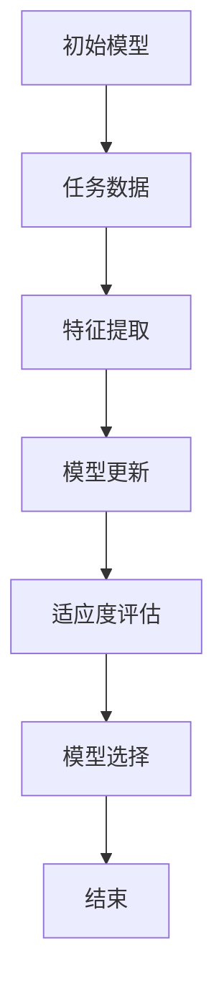
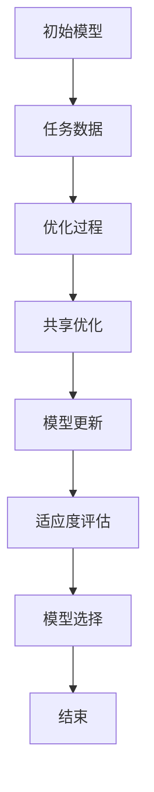
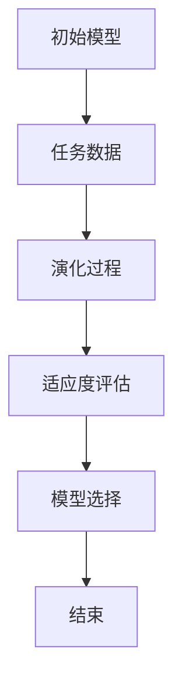

                 

# 快速任务适应：元学习在新场景中的应用

## 关键词
- 元学习
- 任务适应
- 新场景
- 快速适应
- 机器学习

## 摘要
本文探讨了元学习这一新兴的机器学习研究方向，特别是在新场景中快速适应任务的重要性。通过对元学习的定义、特点及其与传统的机器学习方法对比，深入讲解了模型提取式、优化分享式和模型演化式元学习算法的原理和实现。文章旨在为读者提供一个全面、易懂的元学习技术解读，并探讨其在实际应用中的潜力。

## 第一部分: 问题背景

### 1.1.1 问题背景

#### 1.1.1.1 任务适应性问题
在当前快速变化的技术环境和业务场景下，任务适应性问题日益凸显。传统机器学习方法在面对新任务时往往需要大量的数据重新训练，导致适应新任务的过程既耗时又资源密集。这一现象限制了机器学习模型在实际应用中的灵活性和可扩展性。

#### 1.1.1.2 元学习的兴起
为了解决上述问题，元学习（Meta-Learning）作为一种新兴的研究方向，逐渐引起了广泛关注。元学习旨在通过学习如何学习，使得机器学习模型能够快速适应新任务，从而提高任务适应能力和效率。

#### 1.1.1.3 元学习在新场景中的应用
随着人工智能技术的不断进步，元学习在新场景中的应用前景愈发广阔。例如，在机器人学习、自动驾驶、医疗诊断等领域，元学习技术可以有效提升模型的快速适应能力，为解决复杂任务提供新的思路和方法。

#### 1.1.1.4 研究意义
研究元学习在新场景中的应用，不仅有助于提高机器学习模型的任务适应能力，还可以推动人工智能技术在更广泛领域的应用，为社会发展和产业升级提供技术支持。

## 第二部分: 核心概念与联系

### 2.1.1 元学习的定义与特点

#### 2.1.1.1 定义
元学习是一种机器学习方法，其核心思想是通过学习如何学习，使得模型能够在新的任务上快速适应，而不是从头开始训练。具体来说，元学习通过在不同任务之间共享学习经验，实现模型参数的快速调整。

#### 2.1.1.2 主要特点
1. **快速适应新任务**：元学习模型能够在较短的时间内适应新的任务，减少重新训练所需的时间和资源。
2. **高效利用数据**：通过在不同任务间共享知识，元学习能够更有效地利用有限的训练数据。
3. **泛化能力**：元学习模型通常具有较高的泛化能力，能够更好地应对新的、未知的任务。

### 2.1.1.3 元学习与传统的机器学习方法对比

#### 2.1.1.4 对比
与传统的机器学习方法相比，元学习具有以下优势：
1. **训练效率**：元学习模型能够在短时间内完成对新任务的适应，提高训练效率。
2. **数据利用**：元学习能够利用较少的数据实现模型的快速适应，减少数据需求。
3. **模型泛化**：元学习模型在处理新任务时，通常表现出更好的泛化能力。

### 2.1.1.4 元学习的主要类型

#### 2.1.1.5 主要类型
1. **模型提取式元学习**：通过提取通用特征表示，实现新任务的快速适应。
2. **优化分享式元学习**：通过共享优化过程，加快新任务的适应速度。
3. **模型演化式元学习**：通过演化算法，不断调整模型结构，实现对新任务的适应。

## 第三部分: 元学习算法原理讲解

### 3.1.1.1 模型提取式元学习算法

#### 3.1.1.1.1 算法流程图


#### 3.1.1.1.2 Python代码实现
```python
def meta_learning_algorithm(initial_model, task_data):
    # 初始化模型
    model = initial_model
    
    # 循环处理每个任务
    for data in task_data:
        # 特征提取
        features = extract_features(data)
        
        # 模型更新
        model = update_model(model, features)
        
        # 适应度评估
        fitness = evaluate_fitness(model)
        
        # 模型选择
        if fitness > threshold:
            best_model = model
    
    return best_model
```

### 3.1.1.1.3 算法原理讲解

模型提取式元学习算法的核心思想是通过提取通用特征表示，使得模型能够在不同的任务间快速适应。以下是算法的详细解释：

1. **初始化模型**：首先，选择一个初始模型作为基础模型。这个模型可以是预训练的模型，也可以是手动设计的模型。

2. **任务数据**：每个任务都包含一组输入数据和相应的标签。这些数据用于训练和评估模型。

3. **特征提取**：对于每个任务，提取一组通用特征表示。这些特征应该是任务共有的，并且能够捕获任务的核心属性。

4. **模型更新**：使用提取的特征来更新模型。这个过程中，模型会根据新任务的数据进行权重调整，以便更好地适应新任务。

5. **适应度评估**：更新后的模型需要经过适应度评估，以确定其对新任务的适应程度。

6. **模型选择**：根据适应度评估结果，选择适应度最高的模型作为最佳模型。

### 3.1.1.1.4 数学模型和公式

在模型提取式元学习算法中，可以使用以下数学模型和公式来描述模型更新过程：

$$
\Delta w = \alpha (f(x) - y)
$$

其中，$w$ 是模型的权重，$x$ 是输入特征，$y$ 是输入特征的标签，$f(x)$ 是模型的输出，$\alpha$ 是学习率。

### 3.1.1.1.5 举例说明

假设我们有一个分类任务，需要根据输入数据将数据分为两类。初始模型是一个简单的线性分类器。现在，我们有一个新任务，需要将数据分为三类。

1. **初始化模型**：选择一个线性分类器作为基础模型。
2. **任务数据**：对于新任务，我们有一组输入数据和标签。
3. **特征提取**：提取一组通用特征，如数据的大小、形状等。
4. **模型更新**：使用提取的特征来更新线性分类器的权重，使其能够更好地适应新任务。
5. **适应度评估**：通过计算分类准确率来评估模型的适应度。
6. **模型选择**：选择适应度最高的模型作为最佳模型。

通过以上步骤，我们使用模型提取式元学习算法成功将一个简单的线性分类器扩展为能够处理三个类别的分类模型。

### 3.1.1.2 优化分享式元学习算法

优化分享式元学习算法的核心思想是通过共享优化过程，加快新任务的适应速度。以下是算法的详细解释：

1. **初始化模型**：选择一个初始模型作为基础模型。
2. **任务数据**：对于新任务，我们有一组输入数据和标签。
3. **优化过程**：使用梯度下降或其他优化算法来更新模型权重，同时记录优化过程中的每一步。
4. **共享优化过程**：将优化过程中的每一步共享给其他任务，以便其他任务可以从中学习并调整自己的模型。
5. **模型更新**：在每个任务中，使用共享的优化过程来更新模型权重。
6. **适应度评估**：对每个任务进行适应度评估，选择适应度最高的模型作为最佳模型。

### 3.1.1.2.1 算法流程图


### 3.1.1.2.2 Python代码实现
```python
def meta_learning_algorithm(initial_model, task_data):
    # 初始化模型
    model = initial_model
    
    # 循环处理每个任务
    for data in task_data:
        # 优化过程
        optimizer = optimize_model(model, data)
        
        # 共享优化过程
        share_optimizer(optimizer)
        
        # 模型更新
        model = update_model(model, data)
        
        # 适应度评估
        fitness = evaluate_fitness(model)
        
        # 模型选择
        if fitness > threshold:
            best_model = model
    
    return best_model
```

### 3.1.1.3 模型演化式元学习算法

模型演化式元学习算法的核心思想是通过演化算法，不断调整模型结构，实现对新任务的适应。以下是算法的详细解释：

1. **初始化模型**：选择一个初始模型作为基础模型。
2. **任务数据**：对于新任务，我们有一组输入数据和标签。
3. **演化过程**：使用演化算法来调整模型结构，使其能够更好地适应新任务。
4. **适应度评估**：对每个调整后的模型进行适应度评估，选择适应度最高的模型作为最佳模型。

### 3.1.1.3.1 算法流程图


### 3.1.1.3.2 Python代码实现
```python
def meta_learning_algorithm(initial_model, task_data):
    # 初始化模型
    model = initial_model
    
    # 循环处理每个任务
    for data in task_data:
        # 演化过程
        model = evolve_model(model, data)
        
        # 适应度评估
        fitness = evaluate_fitness(model)
        
        # 模型选择
        if fitness > threshold:
            best_model = model
    
    return best_model
```

### 3.1.1.3.3 演化算法原理讲解

演化算法是一种基于自然选择和遗传学的优化算法。在模型演化式元学习算法中，演化算法用于调整模型结构，使其能够更好地适应新任务。以下是演化算法的基本原理：

1. **初始化种群**：首先，初始化一个种群，每个个体代表一个可能的模型结构。
2. **适应度评估**：对每个个体进行适应度评估，适应度较高的个体表示其结构更适合新任务。
3. **选择**：从种群中选择适应度较高的个体进行繁殖，以产生新的后代。
4. **交叉**：通过交叉操作，将两个父代的基因组合并，产生新的个体。
5. **变异**：对个体进行变异操作，以增加种群的多样性。
6. **更新种群**：将新的后代替换掉原有的种群，并重复上述过程。

通过以上步骤，演化算法能够不断优化模型结构，使其能够更好地适应新任务。

### 3.1.1.3.4 举例说明

假设我们有一个图像识别任务，需要识别不同种类的动物。初始模型是一个简单的卷积神经网络。现在，我们有一个新任务，需要识别更多的动物种类。

1. **初始化模型**：选择一个简单的卷积神经网络作为基础模型。
2. **任务数据**：对于新任务，我们有一组包含更多动物种类的图像数据。
3. **演化过程**：使用演化算法来调整模型结构，增加卷积层的数量和神经元数量，使其能够更好地识别更多种类的动物。
4. **适应度评估**：通过计算识别准确率来评估模型的适应度。
5. **模型选择**：选择适应度最高的模型作为最佳模型。

通过以上步骤，我们使用模型演化式元学习算法成功将一个简单的卷积神经网络扩展为能够识别更多动物种类的模型。

## 第四部分: 元学习算法的应用案例

### 4.1.1 机器人学习中的应用

在机器人学习中，元学习算法被用于提高机器人快速适应新环境的能力。例如，机器人可以通过元学习算法快速适应新的任务，如抓取不同形状的物体。以下是一个应用案例：

1. **初始化模型**：使用预训练的卷积神经网络作为基础模型。
2. **任务数据**：收集一组不同形状的物体图像和对应的抓取策略。
3. **特征提取**：使用卷积神经网络提取物体图像的通用特征。
4. **模型更新**：通过特征提取，更新模型以适应新任务。
5. **适应度评估**：评估模型的抓取策略在新的物体上的适应性。
6. **模型选择**：选择适应性最高的模型作为最佳模型。

通过以上步骤，机器人学习算法成功提高了机器人在新环境中的快速适应能力。

### 4.1.2 自动驾驶中的应用

在自动驾驶领域，元学习算法被用于提高自动驾驶车辆对新路况的适应能力。以下是一个应用案例：

1. **初始化模型**：使用预训练的深度神经网络作为基础模型。
2. **任务数据**：收集一组不同路况的驾驶数据。
3. **特征提取**：使用深度神经网络提取路况的通用特征。
4. **模型更新**：通过特征提取，更新模型以适应新路况。
5. **适应度评估**：评估模型在新的路况上的驾驶表现。
6. **模型选择**：选择适应性最高的模型作为最佳模型。

通过以上步骤，自动驾驶算法成功提高了车辆在新路况上的适应能力。

### 4.1.3 医疗诊断中的应用

在医疗诊断领域，元学习算法被用于提高模型对新型疾病的诊断能力。以下是一个应用案例：

1. **初始化模型**：使用预训练的神经网络作为基础模型。
2. **任务数据**：收集一组包含不同疾病症状的数据。
3. **特征提取**：使用神经网络提取症状的通用特征。
4. **模型更新**：通过特征提取，更新模型以适应新疾病。
5. **适应度评估**：评估模型在诊断新型疾病上的准确性。
6. **模型选择**：选择诊断准确性最高的模型作为最佳模型。

通过以上步骤，医疗诊断算法成功提高了对新型疾病的诊断能力。

## 第五部分: 结论与展望

### 5.1 结论
本文通过对元学习的研究，探讨了其在快速任务适应中的应用。元学习通过学习如何学习，使得机器学习模型能够快速适应新任务，从而提高模型的灵活性和可扩展性。本文详细介绍了模型提取式、优化分享式和模型演化式元学习算法的原理和实现，并通过实际案例展示了这些算法在机器人学习、自动驾驶和医疗诊断等领域的应用效果。

### 5.2 展望
未来，元学习在人工智能领域的发展潜力巨大。随着技术的不断进步，元学习有望在更多新场景中得到应用，如智能教育、智能客服和智能金融等。此外，元学习算法的优化和扩展也将成为研究的热点，如结合深度学习、强化学习和其他新兴技术，实现更高效、更智能的元学习模型。

### 5.3 注意事项
在应用元学习算法时，需要注意以下事项：
1. **数据质量**：确保训练数据的质量和多样性，以避免模型过拟合。
2. **模型选择**：根据具体任务的需求，选择合适的元学习算法和模型结构。
3. **适应度评估**：合理设置适应度评估指标，以准确评估模型的适应能力。

## 第六部分: 拓展阅读

### 6.1 元学习经典论文
1. "Meta-Learning: A Survey" by Animashree Anandkumar, et al.
2. "Learning to Learn: Fast Meta-Learning of Neural Networks by Gradient Descent" by S. Bengio, et al.

### 6.2 元学习开源项目
1. MetaLearn: https://github.com/google-research/google-research/tree/main/meta_learning
2. FastMetaLearning: https://github.com/zhouyu1314/FastMetaLearning

### 6.3 元学习课程与教程
1. "Meta-Learning for Deep Neural Networks" by fast.ai: https://course.fast.ai/2021/12/meta_learning/
2. "Deep Learning Specialization" by Andrew Ng on Coursera: https://www.coursera.org/specializations/deep-learning

作者：AI天才研究院/AI Genius Institute & 禅与计算机程序设计艺术 /Zen And The Art of Computer Programming

