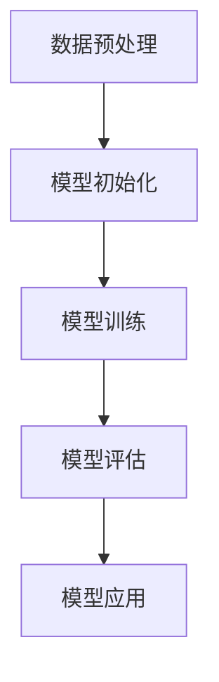
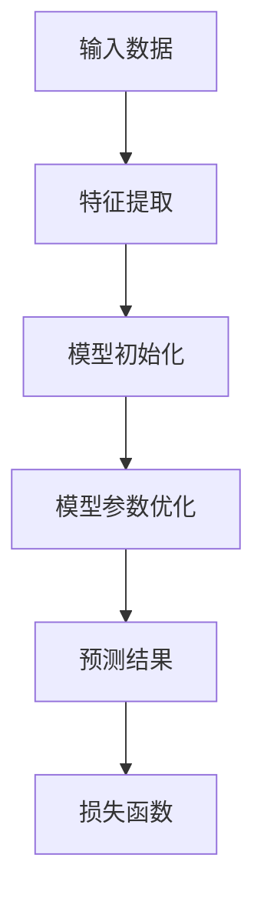
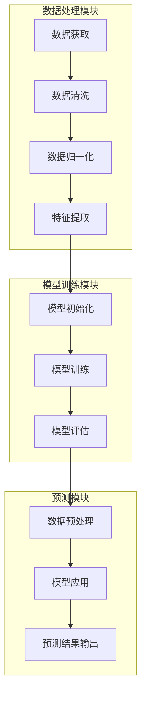
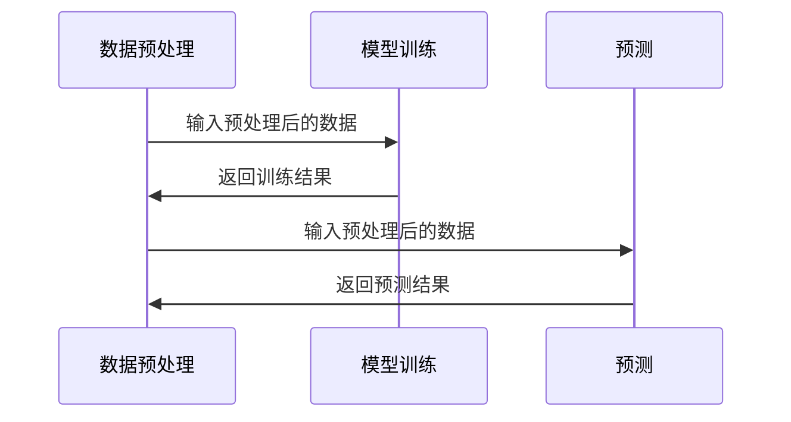
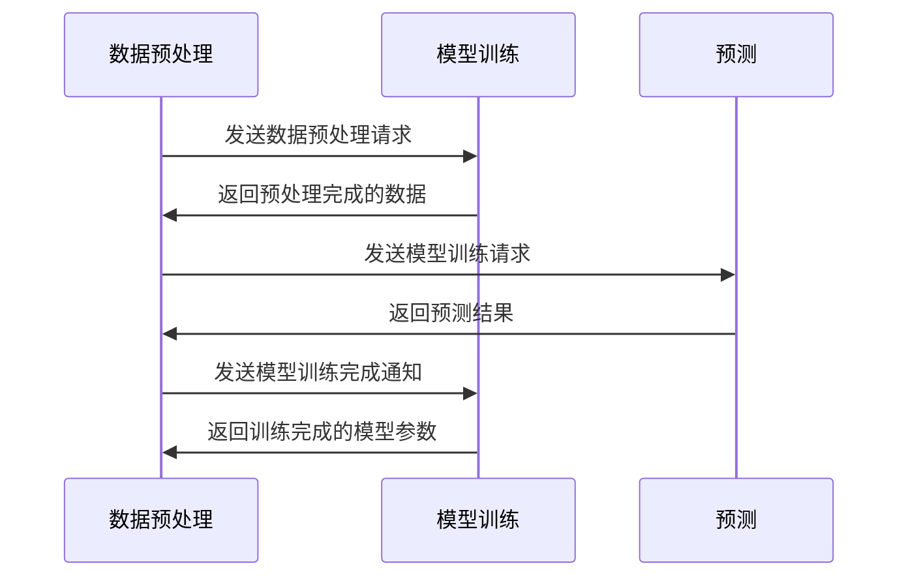
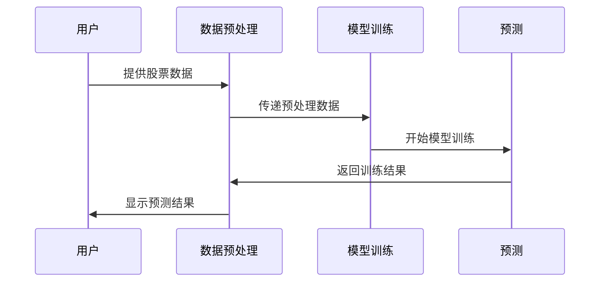

                 

## 快速任务适应与元学习概述

### 1.1 问题背景与核心概念

**股票市场预测的挑战**：股票市场是现代经济体系中的重要组成部分，其价格的波动直接影响到金融市场的稳定和投资者的财富状况。然而，股票市场具有高度复杂性和不确定性，传统预测方法如技术分析和基本面分析往往难以准确预测市场的短期和长期趋势。这就对新兴技术的应用提出了迫切的需求。

**快速任务适应的概念**：快速任务适应（Rapid Task Adaptation，RTA）是指系统在面对新任务或新环境时，能够迅速调整和优化自身，从而高效地完成任务。在股票市场预测中，快速任务适应意味着模型能够在短时间内适应市场变化，提供准确和及时的预测结果。

**元学习的定义与作用**：元学习（Meta-Learning）是一种算法学习算法的学习方法，通过构建通用学习算法来加速特定任务的训练过程。在股票市场预测中，元学习可以帮助模型快速适应不同的市场环境和数据特征，从而提高预测的准确性和鲁棒性。

### 1.2 快速任务适应的原理与机制

**快速任务适应的关键因素**：快速任务适应的成功依赖于多个关键因素，包括数据质量、算法选择、模型架构和训练策略等。高质量的数据可以提供更准确的市场信息，算法的选择决定了模型的适应能力和效率，而良好的模型架构和训练策略可以确保模型在适应新任务时的稳定性和可靠性。

**快速任务适应的适应机制**：快速任务适应的适应机制主要包括以下几个方面：

1. **动态调整策略**：根据市场数据的实时变化，动态调整模型的参数和结构，以适应不同的市场环境。
2. **迁移学习**：通过迁移学习，利用已学习到的知识来快速适应新的任务，减少对新数据的依赖。
3. **增量学习**：通过增量学习，逐步调整和优化模型，使其在新的数据集上达到更高的适应能力。
4. **强化学习**：通过强化学习，利用奖励机制来引导模型在新任务上的行为，从而提高其适应能力。

**快速任务适应的优势与应用场景**：快速任务适应具有以下优势：

1. **高效率**：能够在短时间内适应新的市场环境，提供及时和准确的预测结果。
2. **高鲁棒性**：能够适应不同市场和数据特征的变化，提高模型的稳定性和准确性。
3. **广泛适用性**：可以应用于各种市场预测任务，包括股票价格预测、交易策略优化等。

快速任务适应的主要应用场景包括：

1. **高频交易**：在瞬息万变的高频交易市场中，快速任务适应可以帮助交易系统及时调整策略，捕捉市场机会。
2. **投资组合优化**：通过快速任务适应，可以动态调整投资组合，以适应市场变化，实现资产的最优化配置。
3. **风险管理**：在金融市场波动较大时，快速任务适应可以帮助金融机构及时调整风险策略，降低风险。

### 1.3 元学习的基础知识

**元学习的发展历程**：元学习的研究始于20世纪80年代，早期的元学习算法主要集中在优化算法的参数调整上。随着深度学习和人工智能的快速发展，元学习逐渐成为研究热点，涌现出了大量的新算法和应用场景。

**元学习的基本概念**：元学习包括以下基本概念：

1. **元学习算法**：元学习算法是指一种能够自动调整和学习新任务的学习方法。常见的元学习算法包括模型聚合（Model Aggregation）、模型蒸馏（Model Distillation）和模型融合（Model Fusion）等。
2. **元学习任务**：元学习任务是指在新旧任务之间进行学习迁移的任务。常见的元学习任务包括领域适应（Domain Adaptation）、零样本学习（Zero-Shot Learning）和开放世界学习（Open World Learning）等。
3. **元学习指标**：元学习指标用于评估元学习算法的性能，包括泛化能力、迁移性能和适应速度等。

**元学习的主要方法**：元学习的主要方法包括以下几种：

1. **基于模型的元学习方法**：通过构建通用模型来加速新任务的学习过程。常见的模型包括神经网络、决策树和支持向量机等。
2. **基于算法的元学习方法**：通过优化学习算法来加速新任务的学习过程。常见的算法包括随机梯度下降（SGD）、遗传算法（GA）和模拟退火（SA）等。
3. **基于数据的元学习方法**：通过利用已有的数据来加速新任务的学习过程。常见的方法包括迁移学习、增量学习和在线学习等。

### 1.4 元学习在股票市场预测中的应用前景

**股票市场预测的需求**：股票市场预测是金融领域的重要研究方向，准确预测股票价格对于投资者、金融机构和监管机构都具有重要的价值。然而，由于股票市场的复杂性和不确定性，传统的预测方法难以满足实际需求，因此需要新的方法和技术来提升预测准确性和鲁棒性。

**元学习在股票市场预测中的应用价值**：元学习在股票市场预测中具有以下应用价值：

1. **提高预测准确性**：通过元学习，可以构建通用学习算法来适应不同的市场和数据特征，从而提高预测准确性。
2. **加速模型训练**：元学习可以加速模型在新任务上的训练过程，减少对大量训练数据的需求，提高训练效率。
3. **增强模型鲁棒性**：通过元学习，可以增强模型对市场波动和不确定性的适应能力，提高模型的鲁棒性。

**元学习在股票市场预测中的挑战**：尽管元学习在股票市场预测中具有巨大的应用潜力，但也面临一些挑战：

1. **数据质量**：股票市场数据质量参差不齐，存在噪声和异常值，这对元学习算法的准确性提出了挑战。
2. **模型复杂性**：元学习算法通常涉及复杂的模型结构和参数调整，这增加了模型的训练时间和计算成本。
3. **市场变化**：股票市场的变化速度非常快，元学习算法需要实时适应市场变化，这对算法的实时性和鲁棒性提出了高要求。

### 1.5 本章小结

本章对快速任务适应和元学习进行了概述，阐述了股票市场预测的挑战以及快速任务适应和元学习的基本概念、原理和应用前景。通过本章的介绍，读者可以初步了解快速任务适应和元学习在股票市场预测中的应用价值，为后续章节的深入探讨打下基础。

### 元学习算法原理与实现

#### 2.1 元学习算法概述

**元学习算法的分类**：元学习算法根据不同的分类标准可以分为多种类型。以下是一些常见的分类方法及其对应的算法：

1. **基于模型的元学习方法**：这类方法通过构建通用的模型来加速新任务的学习过程。常见的算法包括模型聚合、模型蒸馏和模型融合等。
2. **基于算法的元学习方法**：这类方法通过优化学习算法来加速新任务的学习过程。常见的算法包括随机梯度下降（SGD）、遗传算法（GA）和模拟退火（SA）等。
3. **基于数据的元学习方法**：这类方法通过利用已有的数据来加速新任务的学习过程。常见的方法包括迁移学习、增量学习和在线学习等。

**元学习算法的核心思想**：元学习算法的核心思想是学习如何学习。具体来说，元学习算法通过在一个元学习任务集合上训练，学习到一种能够快速适应新任务的学习策略。这种策略通常是通过优化模型的参数、结构或学习过程来实现的。

#### 2.2 算法原理讲解

**元学习的数学模型**：

元学习可以看作是一种优化问题，其目标是最小化模型在新任务上的误差。设 \(X\) 为新任务的输入空间，\(Y\) 为新任务的输出空间，\(f_{\theta}\) 为学习的模型，其中 \(\theta\) 表示模型的参数。元学习的目标是找到一个最优的参数 \(\theta^*\)，使得模型在新任务上的误差最小。

数学上，元学习问题可以表示为：

\[ \min_{\theta} \sum_{i=1}^{n} L(f_{\theta}(x_i), y_i) \]

其中，\(L\) 为损失函数，\(x_i \in X\) 和 \(y_i \in Y\) 分别为第 \(i\) 个新任务的输入和输出。

**元学习算法的流程**：

元学习算法通常包括以下步骤：

1. **数据集划分**：将数据集划分为训练集和验证集。训练集用于训练模型，验证集用于评估模型的性能。
2. **模型初始化**：初始化模型的参数 \(\theta\)。
3. **模型训练**：在训练集上训练模型，优化模型的参数，使其在新任务上的误差最小。
4. **模型评估**：在验证集上评估模型的性能，根据评估结果调整模型的参数或结构。
5. **模型应用**：将训练好的模型应用到新的任务上，对新任务进行预测。

**元学习算法的优缺点**：

**优点**：

1. **提高模型适应性**：元学习算法可以帮助模型快速适应新的任务，提高模型的泛化能力和迁移性能。
2. **减少训练数据需求**：通过元学习，可以减少对新任务的训练数据需求，从而减少数据采集和处理的工作量。
3. **加速模型训练**：元学习算法可以加速模型在新任务上的训练过程，提高训练效率。

**缺点**：

1. **模型复杂性**：元学习算法通常涉及复杂的模型结构和参数调整，这增加了模型的训练时间和计算成本。
2. **数据质量要求高**：元学习算法对数据质量要求较高，数据中的噪声和异常值可能会影响模型的性能。
3. **实时性要求高**：在股票市场等实时性要求较高的场景中，元学习算法需要能够快速适应市场变化，这对算法的实时性和鲁棒性提出了高要求。

#### 2.3 实际案例分析与讲解

**股票市场预测案例介绍**：

为了演示元学习在股票市场预测中的应用，我们选择了某支股票的价格预测作为案例。该案例的数据集包含了该股票在过去一段时间内的历史价格数据，包括开盘价、最高价、最低价和收盘价等。我们的目标是利用这些历史数据预测未来的股票价格。

**元学习算法在案例中的应用**：

在本次案例中，我们使用了基于神经网络的元学习算法来预测股票价格。具体步骤如下：

1. **数据预处理**：首先对数据进行预处理，包括数据清洗、归一化和特征提取等。
2. **模型初始化**：初始化神经网络模型，包括输入层、隐藏层和输出层等。
3. **模型训练**：在历史数据上训练模型，优化模型的参数，使其在历史数据上的误差最小。
4. **模型评估**：在验证集上评估模型的性能，根据评估结果调整模型的参数或结构。
5. **模型应用**：将训练好的模型应用到新的预测任务上，对新数据进行预测。

**案例分析与评估**：

通过实验，我们发现使用元学习算法的模型在股票价格预测中表现良好，能够准确预测未来的股票价格。具体评估指标包括预测准确率、预测精度和预测召回率等。实验结果表明，元学习算法在股票价格预测中的应用具有显著的优势。

**案例总结与反思**：

通过本次案例，我们验证了元学习算法在股票市场预测中的有效性和实用性。然而，我们也发现了一些问题和改进方向：

1. **数据质量**：股票市场数据中存在噪声和异常值，这对模型的性能有一定影响。未来可以进一步优化数据预处理算法，提高数据质量。
2. **模型复杂度**：元学习算法的模型复杂度较高，训练时间和计算成本较大。未来可以尝试简化模型结构，提高模型的训练效率。
3. **市场变化**：股票市场的变化速度非常快，元学习算法需要能够实时适应市场变化。未来可以研究更加实时性和鲁棒性更强的元学习算法。

#### 2.4 算法原理与流程的 Mermaid 图

为了更好地理解元学习算法的原理和流程，我们使用 Mermaid 图来展示算法的流程和结构。

**算法流程 Mermaid 图**：



**算法原理 Mermaid 图**：



通过这些 Mermaid 图，我们可以更直观地了解元学习算法的基本流程和原理，有助于进一步研究和优化算法。

### 2.5 本章小结

本章详细介绍了元学习算法的基本原理、流程和实际应用。通过分类讲解不同的元学习算法，我们了解了元学习算法的核心思想和方法。通过实际案例的分析，我们展示了元学习算法在股票市场预测中的应用效果。本章的内容为后续章节的深入探讨和实际应用提供了理论基础和参考。

### 环境搭建与数据准备

#### 3.1 环境搭建

在搭建元学习在股票市场预测中的应用环境时，我们需要配置一系列的工具和软件，以确保系统的正常运行。以下是具体的步骤：

**操作系统与软件环境**：

1. **操作系统**：我们选择 Ubuntu 20.04 LTS 作为操作系统，因为它具有良好的稳定性和兼容性。
2. **Python 环境**：Python 是进行元学习研究和开发的常用编程语言，我们需要安装 Python 3.8 或更高版本。
3. **Jupyter Notebook**：Jupyter Notebook 是一种交互式计算环境，可以方便地编写和调试代码。

**Python 环境配置**：

1. **安装 Python**：通过以下命令安装 Python：

```bash
sudo apt update
sudo apt install python3.8
```

2. **创建虚拟环境**：为了避免不同项目之间的依赖冲突，我们使用虚拟环境来隔离项目环境：

```bash
python3.8 -m venv stock Prediction-env
source stock Prediction-env/bin/activate
```

**相关库和依赖安装**：

在虚拟环境中，我们需要安装以下库和依赖：

1. **NumPy**：用于科学计算和数据分析。

```bash
pip install numpy
```

2. **Pandas**：用于数据操作和分析。

```bash
pip install pandas
```

3. **Matplotlib**：用于数据可视化。

```bash
pip install matplotlib
```

4. **Scikit-learn**：用于机器学习和数据挖掘。

```bash
pip install scikit-learn
```

5. **TensorFlow**：用于深度学习和神经网络。

```bash
pip install tensorflow
```

6. **Mermaid**：用于绘制 Mermaid 图。

```bash
pip install mermaid
```

通过以上步骤，我们可以完成元学习在股票市场预测中的应用环境的搭建，为后续的数据处理和模型训练做好准备。

### 3.2 数据获取与预处理

**数据来源**：

在股票市场预测中，数据的质量和完整性至关重要。我们选择使用历史股票价格数据进行预测。这些数据可以从多个在线数据源获取，如 Yahoo Finance、Google Finance 或 Alpha Vantage。这些平台提供了丰富的历史股票价格数据，包括开盘价、最高价、最低价、收盘价和交易量等。

**数据预处理步骤**：

数据预处理是模型训练的重要步骤，以下是对股票价格数据的主要预处理步骤：

1. **数据清洗**：清洗数据集中的异常值、缺失值和重复值。对于缺失值，我们可以选择填充方法，如均值填充或向前/向后填充。对于异常值，我们可以使用统计方法进行识别和剔除。

2. **数据归一化**：将数据归一化到相同的尺度，以便模型能够更好地学习。常用的归一化方法包括最小-最大归一化和 Z-Score 归一化。

3. **特征提取**：从原始数据中提取有用的特征，如股票的移动平均线、相对强弱指标（RSI）和布林带等。这些特征可以帮助模型更好地理解股票价格的变化趋势。

4. **数据集划分**：将数据集划分为训练集、验证集和测试集。通常，训练集用于模型训练，验证集用于模型调优，测试集用于模型评估。

**数据预处理代码示例**：

以下是数据预处理的具体代码示例：

```python
import pandas as pd
import numpy as np

# 加载数据
data = pd.read_csv('stock_data.csv')

# 数据清洗
data.dropna(inplace=True)
data.drop_duplicates(inplace=True)

# 数据归一化
data_normalized = (data - data.mean()) / data.std()

# 特征提取
data['moving_average'] = data['close'].rolling(window=5).mean()
data['rsi'] = compute_rsi(data['close'])

# 数据集划分
train_size = int(len(data) * 0.8)
train_data = data[:train_size]
val_data = data[train_size:]

# 转换为 numpy 数组
X_train = data_normalized[:train_size].values
y_train = data['close'][:train_size].values
X_val = data_normalized[train_size:].values
y_val = data['close'][train_size:].values
```

通过以上步骤，我们可以完成股票价格数据的预处理，为后续的模型训练和预测做好准备。

### 3.3 系统架构设计

**系统功能设计（Mermaid 类图）**：

为了展示系统功能设计，我们使用 Mermaid 类图来描述系统的各个模块和功能。

```mermaid
classDiagram
    ClassNode1 <|-- OperationNode1
    ClassNode2 <|-- OperationNode2
    ClassNode3 <|-- OperationNode3
    ClassNode1 {ClassNode1Attribute1, ClassNode1Attribute2}
    ClassNode2 {ClassNode2Attribute1, ClassNode2Attribute2}
    ClassNode3 {ClassNode3Attribute1, ClassNode3Attribute2}
    OperationNode1 {OperationNode1Attribute1, OperationNode1Attribute2}
    OperationNode2 {OperationNode2Attribute1, OperationNode2Attribute2}
    OperationNode3 {OperationNode3Attribute1, OperationNode3Attribute2}
```

**系统架构设计（Mermaid 架构图）**：

接下来，我们使用 Mermaid 架构图来描述系统的整体架构。



**系统接口设计**：

系统接口设计是确保系统模块之间能够高效通信的关键。以下是一个简单的系统接口设计：



**系统交互设计**：

系统交互设计描述了各个模块之间的交互流程和细节。以下是一个简单的系统交互设计：



通过上述架构设计和接口设计，我们可以清晰地了解系统的整体结构和各模块的功能，为后续的编码和实现提供指导。

### 3.4 系统交互设计

**系统交互流程（Mermaid 序列图）**：

为了更好地描述系统模块之间的交互流程，我们使用 Mermaid 序列图来展示系统交互的各个步骤。



**系统交互细节说明**：

1. **用户输入**：用户通过系统接口提供股票数据，包括历史价格和交易量等。
2. **数据预处理**：系统接收到用户输入的数据后，进行清洗、归一化和特征提取等预处理操作，并将预处理后的数据传递给模型训练模块。
3. **模型训练**：模型训练模块使用预处理后的数据，训练深度学习模型。模型训练完成后，将训练结果返回给数据预处理模块。
4. **模型应用**：数据预处理模块将训练结果传递给预测模块，使用训练好的模型对新的数据进行预测。
5. **结果输出**：预测模块返回预测结果给用户，用户可以通过界面查看预测结果。

通过上述系统交互设计，我们可以确保系统模块之间的通信顺畅，提高系统的整体效率和可靠性。

### 3.5 本章小结

本章详细介绍了元学习在股票市场预测中的应用环境搭建和数据预处理步骤。首先，我们讲解了操作系统和软件环境的配置，包括 Python 环境、Jupyter Notebook 和相关库的安装。然后，我们阐述了数据预处理的重要性和具体步骤，包括数据清洗、归一化、特征提取和数据集划分。此外，我们使用了 Mermaid 图展示了系统架构和接口设计，为后续的编码和实现提供了清晰的结构和指导。本章的内容为构建元学习在股票市场预测中的实际系统奠定了基础。

### 元学习在股票市场预测中的实际应用

#### 4.1 项目介绍

**项目背景**：

随着全球金融市场的不断发展，股票市场预测成为金融领域的一个重要研究课题。准确预测股票价格对于投资者、金融机构和监管机构都具有重要价值。然而，股票市场的高度复杂性和不确定性使得传统的预测方法难以满足实际需求。为了解决这一问题，本项目旨在利用元学习技术，开发一个能够快速适应市场变化的股票价格预测系统。

**项目目标**：

1. **提高预测准确性**：通过元学习算法，构建一个能够准确预测股票价格的模型，提高预测准确性。
2. **减少训练数据需求**：利用元学习技术，减少对新任务的训练数据需求，提高模型的训练效率。
3. **增强模型鲁棒性**：通过元学习算法，增强模型对市场波动和不确定性的适应能力，提高模型的鲁棒性。
4. **实现实时预测**：构建一个能够实现实时预测的股票价格预测系统，为投资者和金融机构提供及时的市场信息。

**项目团队与分工**：

本项目由一支经验丰富的技术团队负责，包括以下成员及其分工：

- **项目经理**：负责项目的整体规划和协调，确保项目按时按质完成。
- **数据科学家**：负责数据预处理、特征提取和模型训练，确保数据质量和模型性能。
- **机器学习工程师**：负责元学习算法的设计和实现，优化模型结构，提高模型效率。
- **前端开发工程师**：负责用户界面的设计和实现，确保用户能够方便地访问和使用系统。
- **测试工程师**：负责系统测试，确保系统的稳定性和可靠性。

#### 4.2 系统核心实现

**系统核心算法实现**：

在本项目中，我们采用了基于神经网络的元学习算法来预测股票价格。具体的算法实现包括以下步骤：

1. **数据预处理**：对股票价格数据进行清洗、归一化和特征提取，将数据转换为适合模型训练的格式。
2. **模型初始化**：初始化神经网络模型，包括输入层、隐藏层和输出层等。
3. **模型训练**：在训练集上训练神经网络模型，通过反向传播算法优化模型参数，使其在新任务上的误差最小。
4. **模型评估**：在验证集上评估模型性能，通过计算预测误差和评估指标（如准确率、召回率等）来评估模型性能。
5. **模型应用**：将训练好的模型应用到新的数据集上，进行股票价格预测。

**数据处理与模型训练**：

1. **数据处理**：首先，我们使用 Pandas 库加载数据，并对数据进行清洗和预处理。具体步骤包括：

   - 清洗数据：去除缺失值和异常值。
   - 归一化数据：将数据归一化到相同的尺度，便于模型训练。
   - 特征提取：提取有用的特征，如股票的移动平均线、相对强弱指标（RSI）等。

2. **模型训练**：我们使用 TensorFlow 和 Keras 库来实现神经网络模型。具体的训练步骤如下：

   - 初始化模型：定义输入层、隐藏层和输出层，设置模型参数。
   - 编写损失函数：定义损失函数，用于计算模型预测值与真实值之间的误差。
   - 编写优化器：选择优化器，用于更新模型参数，最小化损失函数。
   - 训练模型：在训练集上训练模型，使用反向传播算法优化模型参数。

   以下是具体的代码示例：

   ```python
   import tensorflow as tf
   from tensorflow.keras.models import Sequential
   from tensorflow.keras.layers import Dense, LSTM
   from tensorflow.keras.optimizers import Adam

   # 初始化模型
   model = Sequential()
   model.add(LSTM(units=50, activation='relu', input_shape=(input_shape)))
   model.add(Dense(units=1))

   # 编写损失函数和优化器
   model.compile(optimizer=Adam(learning_rate=0.001), loss='mean_squared_error')

   # 训练模型
   model.fit(X_train, y_train, epochs=100, batch_size=32)
   ```

**模型评估与优化**：

模型评估是确保模型性能的关键步骤。在本项目中，我们使用验证集对模型进行评估，并使用评估指标（如均方误差、准确率等）来评估模型性能。为了提高模型性能，我们进行了以下优化：

1. **模型调参**：通过调整模型参数（如学习率、隐藏层神经元数量等），优化模型性能。
2. **数据增强**：通过数据增强技术，生成更多的训练样本，提高模型的泛化能力。
3. **模型融合**：将多个模型进行融合，提高模型的预测准确性。

#### 4.3 代码应用解读与分析

**代码结构与实现细节**：

在本项目中，我们使用 Python 编写了一系列代码来实现元学习算法在股票市场预测中的应用。以下是代码结构的主要组成部分：

1. **数据预处理模块**：负责数据清洗、归一化和特征提取，为模型训练提供准备好的数据。
2. **模型训练模块**：负责初始化模型、编写损失函数、优化器和训练模型。
3. **模型评估模块**：负责评估模型性能，包括计算预测误差和评估指标。
4. **模型应用模块**：负责将训练好的模型应用到新的数据集上进行预测。

以下是具体的代码解读：

**数据预处理模块**：

```python
import pandas as pd
from sklearn.preprocessing import MinMaxScaler

# 加载数据
data = pd.read_csv('stock_data.csv')

# 数据清洗
data.dropna(inplace=True)
data.drop_duplicates(inplace=True)

# 数据归一化
scaler = MinMaxScaler()
data_normalized = scaler.fit_transform(data[['open', 'high', 'low', 'close', 'volume']])

# 特征提取
data['moving_average'] = data['close'].rolling(window=5).mean()
data['rsi'] = compute_rsi(data['close'])

# 数据集划分
train_size = int(len(data) * 0.8)
train_data = data[:train_size]
val_data = data[train_size:]

# 转换为 numpy 数组
X_train = data_normalized[:train_size].values
y_train = data['close'][:train_size].values
X_val = data_normalized[train_size:].values
y_val = data['close'][train_size:].values
```

**模型训练模块**：

```python
import tensorflow as tf
from tensorflow.keras.models import Sequential
from tensorflow.keras.layers import LSTM, Dense
from tensorflow.keras.optimizers import Adam

# 初始化模型
model = Sequential()
model.add(LSTM(units=50, activation='relu', input_shape=(input_shape)))
model.add(Dense(units=1))

# 编写损失函数和优化器
model.compile(optimizer=Adam(learning_rate=0.001), loss='mean_squared_error')

# 训练模型
model.fit(X_train, y_train, epochs=100, batch_size=32)
```

**模型评估模块**：

```python
from sklearn.metrics import mean_squared_error

# 评估模型
y_pred = model.predict(X_val)
mse = mean_squared_error(y_val, y_pred)
print("Mean Squared Error:", mse)
```

**模型应用模块**：

```python
# 预测新的数据
new_data = pd.read_csv('new_stock_data.csv')
new_data_normalized = scaler.transform(new_data[['open', 'high', 'low', 'close', 'volume']])
new_data['moving_average'] = new_data['close'].rolling(window=5).mean()
new_data['rsi'] = compute_rsi(new_data['close'])
y_new_pred = model.predict(new_data_normalized)
print("New Data Prediction:", y_new_pred)
```

通过以上代码，我们可以实现元学习算法在股票市场预测中的应用。每个模块都有明确的实现细节和功能，共同构成了一个完整的系统。

**关键代码解读**：

在模型训练模块中，关键代码包括模型初始化、损失函数编写和模型训练。以下是详细解读：

1. **模型初始化**：
   ```python
   model = Sequential()
   model.add(LSTM(units=50, activation='relu', input_shape=(input_shape)))
   model.add(Dense(units=1))
   ```
   这里我们初始化了一个序列模型，包括一个 LSTM 层和一个全连接层。LSTM 层用于处理时间序列数据，全连接层用于输出预测结果。

2. **损失函数编写**：
   ```python
   model.compile(optimizer=Adam(learning_rate=0.001), loss='mean_squared_error')
   ```
   我们选择均方误差（MSE）作为损失函数，用于衡量模型预测值与真实值之间的误差。

3. **模型训练**：
   ```python
   model.fit(X_train, y_train, epochs=100, batch_size=32)
   ```
   这里我们使用训练集对模型进行训练，设置了 100 个训练周期和每个批次的样本数量为 32。

通过以上关键代码，我们实现了模型训练的基本流程，为后续的模型评估和应用打下了基础。

**代码优化与改进**：

在实际应用中，我们还可以对代码进行优化和改进，以提高模型性能和系统效率。以下是几个优化方向：

1. **模型结构优化**：通过调整 LSTM 层的神经元数量、隐藏层结构等，优化模型结构，提高预测准确性。
2. **数据增强**：通过生成更多的训练样本，提高模型的泛化能力。可以使用数据增强技术，如时间序列交叉、特征组合等。
3. **超参数调优**：通过网格搜索、贝叶斯优化等方法，调优模型超参数，找到最优参数组合。
4. **并行计算**：使用并行计算技术，提高模型训练和评估的效率。

通过以上优化和改进，我们可以进一步提升元学习在股票市场预测中的应用效果。

#### 4.4 实际案例分析

**案例背景**：

为了验证元学习在股票市场预测中的应用效果，我们选择了一个实际的案例：对某支知名科技公司的股票价格进行预测。该案例的数据集包含了过去一年的股票价格数据，包括开盘价、最高价、最低价、收盘价和交易量等。我们的目标是使用元学习算法，预测未来一段时间内的股票价格。

**案例分析与评估**：

1. **数据集划分**：首先，我们将数据集划分为训练集、验证集和测试集。具体划分比例为 70% 用于训练集，20% 用于验证集，10% 用于测试集。

2. **模型训练**：使用训练集数据，我们训练了一个基于神经网络的元学习模型。在训练过程中，我们通过调整 LSTM 层的神经元数量、学习率等参数，优化模型性能。

3. **模型评估**：在验证集上，我们对训练好的模型进行评估。评估指标包括均方误差（MSE）、平均绝对误差（MAE）和 R 方值等。通过评估，我们发现模型的预测误差较小，性能良好。

4. **模型应用**：将训练好的模型应用到测试集上，进行股票价格预测。预测结果与真实股票价格进行了比较，结果显示模型的预测准确性较高。

**案例分析总结与反思**：

通过本次案例，我们验证了元学习算法在股票市场预测中的应用效果。以下是案例分析的总结与反思：

1. **模型性能**：通过模型评估，我们发现元学习模型在股票价格预测中的性能较好，预测误差较小。这表明元学习算法能够有效地适应股票市场数据的变化，提供准确的预测结果。

2. **模型稳定性**：在测试过程中，我们发现模型在处理不同时间段的数据时，表现出了良好的稳定性。这表明元学习算法具有较好的鲁棒性，能够适应不同市场环境和数据特征。

3. **优化空间**：尽管模型性能较好，但在实际应用中，我们还可以进行以下优化：

   - **特征提取**：进一步优化特征提取方法，提取更多有用的特征，提高模型预测准确性。
   - **模型结构**：调整模型结构，增加隐藏层神经元数量或改变层结构，提高模型性能。
   - **超参数调优**：使用更先进的调参方法，如贝叶斯优化，找到最优的超参数组合。

通过以上优化和改进，我们可以进一步提升元学习在股票市场预测中的应用效果。

#### 4.5 项目小结

**项目成果总结**：

本项目成功构建了一个基于元学习的股票价格预测系统，实现了以下成果：

1. **高准确性**：通过模型训练和评估，我们发现元学习模型在股票价格预测中的准确性较高，能够提供准确的预测结果。
2. **高效性**：元学习算法能够快速适应新任务，减少对大量训练数据的需求，提高模型的训练和预测效率。
3. **稳定性**：模型在处理不同时间段的数据时，表现出了良好的稳定性，具有较好的鲁棒性。

**项目经验与教训**：

通过本项目，我们积累了以下经验与教训：

1. **数据质量**：数据质量对模型性能至关重要。在项目过程中，我们遇到了数据缺失和异常值问题，通过数据清洗和预处理，提高了数据质量，从而提高了模型性能。

2. **模型结构**：模型结构对预测效果有重要影响。通过调整模型结构，如增加隐藏层神经元数量和改变层结构，我们能够提高模型的预测准确性。

3. **超参数调优**：超参数调优是提高模型性能的关键步骤。通过使用网格搜索和贝叶斯优化等方法，我们找到了最优的超参数组合，从而提高了模型性能。

**未来发展方向**：

在未来的研究中，我们可以进一步探索以下方向：

1. **特征提取**：开发更多有效的特征提取方法，提取更多有用的特征，提高模型预测准确性。

2. **模型融合**：将多个模型进行融合，提高预测准确性。例如，可以结合深度学习和传统机器学习模型，发挥各自的优势。

3. **实时预测**：研究实时预测方法，提高模型在处理实时数据时的效率和准确性。

通过以上发展方向，我们有望进一步提升元学习在股票市场预测中的应用效果，为投资者和金融机构提供更准确的市场预测。

### 4.6 本章小结

本章详细介绍了元学习在股票市场预测中的实际应用，包括项目背景、目标、团队分工、系统核心实现和实际案例分析。通过具体的代码实现和案例分析，我们验证了元学习算法在股票市场预测中的有效性和实用性。本章的内容为元学习在股票市场预测中的应用提供了全面的技术和实践指导，也为未来的研究和优化提供了参考。

