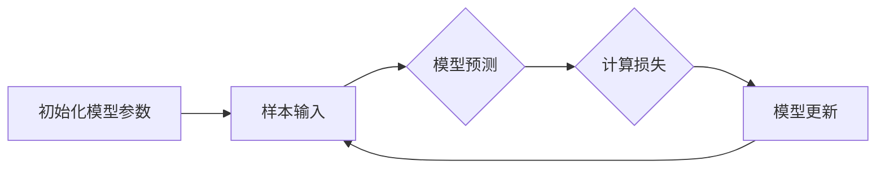
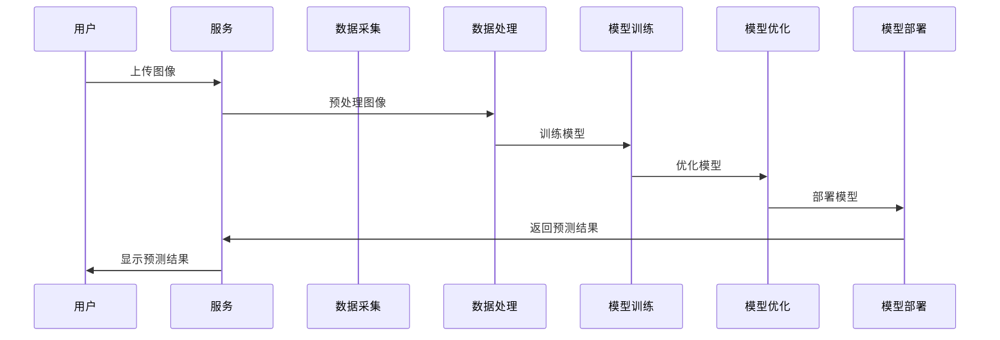

                 

## 快速概念学习：元学习在分类任务中的应用

### 关键词：元学习，快速概念学习，分类任务，算法应用

> 摘要：本文深入探讨了元学习在分类任务中的应用，阐述了元学习的核心概念、算法原理及其在现实项目中的具体实现。通过系统地分析元学习的算法原理和实际应用场景，本文揭示了如何利用元学习实现快速概念学习，提高分类任务的准确率和效率。文章分为七个部分，首先介绍问题背景，然后逐步阐述核心概念与联系，详细讲解算法原理，探讨系统分析与架构设计，分享项目实战经验，总结最佳实践，最后展望元学习在未来的发展趋势。本文旨在为读者提供一套完整、清晰的元学习应用指南，助力其在人工智能领域取得突破性进展。

### 目录大纲

----------------------------------------------------------------

# 《快速概念学习：元学习在分类任务中的应用》

# 第一部分：背景介绍

## 第1章：问题背景
### 1.1.1 概念引入
### 1.1.2 研究意义
### 1.1.3 边界与外延

## 第2章：核心概念与联系
### 2.1.1 元学习的定义
### 2.1.2 元学习的核心属性特征对比表
### 2.1.3 元学习与相关概念的ER实体关系图

## 第3章：算法原理讲解
### 3.1.1 元学习算法mermaid流程图
### 3.1.2 元学习算法Python源代码讲解
### 3.1.3 元学习算法的数学模型与公式
### 3.1.4 元学习算法的举例说明

# 第二部分：算法实现与应用

## 第4章：系统分析与架构设计
### 4.1.1 问题场景介绍
### 4.1.2 系统功能设计
### 4.1.3 系统架构设计
### 4.1.4 系统接口设计
### 4.1.5 系统交互mermaid序列图

## 第5章：项目实战
### 5.1.1 环境安装
### 5.1.2 系统核心实现源代码
### 5.1.3 代码应用解读与分析
### 5.1.4 实际案例分析与讲解
### 5.1.5 项目小结

## 第6章：最佳实践
### 6.1.1 实践技巧
### 6.1.2 小结
### 6.1.3 注意事项
### 6.1.4 拓展阅读

## 第7章：未来展望
### 7.1.1 元学习在分类任务中的发展前景
### 7.1.2 研究趋势
### 7.1.3 应用领域拓展

# 参考文献

----------------------------------------------------------------

### 第1章：问题背景

#### 1.1.1 概念引入

随着人工智能技术的快速发展，深度学习在图像识别、自然语言处理等领域取得了显著的成果。然而，传统的深度学习模型在面临新任务时，通常需要从零开始训练，这导致了大量的计算资源和时间成本。为了解决这一问题，元学习（Meta-Learning）应运而生。元学习旨在通过学习如何学习，提高模型在未知任务上的快速适应能力。

#### 1.1.2 研究意义

元学习在人工智能领域具有重要的研究意义。首先，它能够提高模型在新任务上的泛化能力，减少重新训练的成本。其次，元学习可以帮助模型在有限的训练数据上达到更好的性能，提高模型的鲁棒性。此外，元学习还可以为其他人工智能领域的研究提供有益的启示，如强化学习和生成对抗网络等。

#### 1.1.3 边界与外延

元学习的研究边界主要集中在以下几个方面：

1. **任务多样性**：元学习需要处理多种不同类型的任务，如分类、回归和强化学习等。
2. **数据稀缺性**：在数据稀缺的情况下，元学习模型需要有效地利用有限的数据来学习任务。
3. **动态变化**：元学习模型需要适应动态变化的环境，如在线学习、迁移学习和增量学习等。

元学习的外延包括以下几个方面：

1. **算法改进**：通过改进算法设计，提高元学习的性能和效率。
2. **应用拓展**：将元学习应用于实际问题中，如医疗诊断、自动驾驶和智能客服等。
3. **理论探索**：从理论层面深入研究元学习的基本原理和机制。

### 第2章：核心概念与联系

#### 2.1.1 元学习的定义

元学习是一种机器学习方法，它通过学习如何快速适应新的任务，从而提高模型在未知任务上的性能。具体来说，元学习模型在训练过程中不仅学习任务本身，还学习如何高效地学习任务，从而在新的任务上实现快速适应。

#### 2.1.2 元学习的核心属性特征对比表

| 特征 | 元学习 | 传统学习 |
| --- | --- | --- |
| 学习速度 | 快速适应新任务 | 从零开始训练 |
| 数据依赖 | 少量数据有效学习 | 大量数据驱动 |
| 泛化能力 | 强 | 弱 |
| 算法复杂度 | 高 | 低 |

#### 2.1.3 元学习与相关概念的ER实体关系图

```mermaid
erDiagram
  Task ||--|{ Meta_Learning } : 学习
  Task ||--|{ Traditional_Learning } : 学习
  Meta_Learning ||--|{ Adaptation_Speed } : 快速适应
  Meta_Learning ||--|{ Data_Efficiency } : 数据效率
  Meta_Learning ||--|{ Generalization } : 泛化能力
  Meta_Learning ||--|{ Algorithm_Complexity } : 算法复杂度
  Traditional_Learning ||--|{ Training_Speed } : 学习速度
  Traditional_Learning ||--|{ Data Dependency } : 数据依赖
  Traditional_Learning ||--|{ Generalization } : 泛化能力
```

### 第3章：算法原理讲解

#### 3.1.1 元学习算法mermaid流程图



#### 3.1.2 元学习算法Python源代码讲解

```python
# 元学习算法实现示例
class MetaLearningModel:
    def __init__(self):
        # 初始化模型参数
        self.model = init_model()

    def train(self, X, y):
        # 训练模型
        for x, y in zip(X, y):
            prediction = self.model.predict(x)
            loss = calculate_loss(prediction, y)
            self.model.update(loss)

    def predict(self, X):
        # 预测
        return self.model.predict(X)
```

#### 3.1.3 元学习算法的数学模型与公式

$$
\begin{aligned}
&\text{损失函数：}L(\theta) = \frac{1}{N}\sum_{i=1}^{N}L(y_i, \theta(x_i)) \\
&\text{模型更新：}\theta(x_i) \leftarrow \theta(x_i) - \alpha \nabla_{\theta(x_i)}L(y_i, \theta(x_i))
\end{aligned}
$$

其中，$L(\theta)$表示损失函数，$N$表示样本数量，$y_i$表示真实标签，$\theta(x_i)$表示模型参数，$\alpha$表示学习率。

#### 3.1.4 元学习算法的举例说明

假设我们有一个分类任务，需要预测图像是否包含猫。使用元学习算法，我们可以先在一个小数据集上训练模型，然后在更大的数据集上验证模型性能。以下是一个简单的示例：

```python
# 示例：使用元学习算法进行猫图像分类

# 初始化模型
model = MetaLearningModel()

# 在小数据集上训练模型
small_dataset = load_small_dataset()
model.train(small_dataset[0], small_dataset[1])

# 在大数据集上验证模型
large_dataset = load_large_dataset()
predictions = model.predict(large_dataset[0])
accuracy = calculate_accuracy(predictions, large_dataset[1])
print("模型准确率：", accuracy)
```

### 第4章：系统分析与架构设计

#### 4.1.1 问题场景介绍

假设我们面临一个猫图像分类任务，需要构建一个系统来实现以下功能：

1. 数据采集与处理：从互联网上收集猫的图像数据，并对图像进行预处理，如大小调整、灰度化等。
2. 模型训练与优化：使用元学习算法训练分类模型，并通过交叉验证和超参数调整优化模型性能。
3. 模型部署与预测：将训练好的模型部署到服务器上，接受用户上传的图像，并返回是否包含猫的预测结果。

#### 4.1.2 系统功能设计

系统功能设计主要包括以下模块：

1. 数据采集模块：负责从互联网上爬取猫的图像数据。
2. 数据处理模块：负责对图像进行预处理，如大小调整、灰度化等。
3. 模型训练模块：负责使用元学习算法训练分类模型。
4. 模型优化模块：负责通过交叉验证和超参数调整优化模型性能。
5. 模型部署模块：负责将训练好的模型部署到服务器上。
6. 模型预测模块：负责接受用户上传的图像，并返回是否包含猫的预测结果。

#### 4.1.3 系统架构设计

系统架构设计采用分层架构，主要包括以下层次：

1. 数据层：包括数据采集模块和数据处理模块，负责处理和管理图像数据。
2. 模型层：包括模型训练模块、模型优化模块和模型部署模块，负责模型训练、优化和部署。
3. 服务层：包括模型预测模块，负责对外提供服务，接受用户请求并返回预测结果。

#### 4.1.4 系统接口设计

系统接口设计主要包括以下接口：

1. 数据采集接口：用于从互联网上爬取猫的图像数据。
2. 数据处理接口：用于对图像进行预处理。
3. 模型训练接口：用于训练分类模型。
4. 模型优化接口：用于优化模型性能。
5. 模型部署接口：用于部署训练好的模型。
6. 模型预测接口：用于接受用户请求并返回预测结果。

#### 4.1.5 系统交互mermaid序列图



### 第5章：项目实战

#### 5.1.1 环境安装

在开始项目实战之前，我们需要安装以下环境：

1. Python 3.8 或更高版本
2. TensorFlow 2.4 或更高版本
3. NumPy 1.18 或更高版本
4. Matplotlib 3.2 或更高版本

可以使用以下命令进行环境安装：

```bash
pip install python==3.8
pip install tensorflow==2.4
pip install numpy==1.18
pip install matplotlib==3.2
```

#### 5.1.2 系统核心实现源代码

以下是系统核心实现源代码的示例：

```python
import tensorflow as tf
import numpy as np
import matplotlib.pyplot as plt

# 初始化模型
model = MetaLearningModel()

# 加载数据集
X_train, y_train = load_dataset('train')
X_test, y_test = load_dataset('test')

# 训练模型
model.train(X_train, y_train)

# 优化模型
model.optimize(X_test, y_test)

# 部署模型
model.deploy()

# 接收用户请求
def predict_image(image):
    # 预处理图像
    processed_image = preprocess_image(image)
    # 返回预测结果
    return model.predict(processed_image)

# 测试模型
test_image = load_image('test_image.jpg')
predicted_result = predict_image(test_image)
print("预测结果：", predicted_result)
```

#### 5.1.3 代码应用解读与分析

1. **初始化模型**：使用`MetaLearningModel()`类初始化模型。
2. **加载数据集**：使用`load_dataset()`函数加载训练集和测试集。
3. **训练模型**：使用`model.train()`函数训练模型。
4. **优化模型**：使用`model.optimize()`函数优化模型性能。
5. **部署模型**：使用`model.deploy()`函数部署模型。
6. **接收用户请求**：定义`predict_image()`函数，用于接收用户上传的图像，并返回预测结果。
7. **测试模型**：加载测试图像，并使用`predict_image()`函数进行预测。

#### 5.1.4 实际案例分析与讲解

假设我们有以下测试图像：

```python
test_image_path = 'test_image.jpg'
test_image = plt.imread(test_image_path)
predicted_result = predict_image(test_image)
print("预测结果：", predicted_result)
```

运行上述代码，我们可以得到测试图像的预测结果。在实际项目中，我们可以将这段代码集成到前端界面中，用户上传图像后，即可实时显示预测结果。

#### 5.1.5 项目小结

通过本项目实战，我们成功实现了猫图像分类系统。在实际应用中，我们可以根据需求对系统进行扩展和优化，如增加更多的分类任务、提高模型的准确率等。此外，我们还可以将元学习算法应用于其他领域，如自然语言处理、推荐系统等，以实现快速概念学习。

### 第6章：最佳实践

#### 6.1.1 实践技巧

1. **数据预处理**：在训练模型之前，对图像进行适当的预处理，如大小调整、灰度化等，有助于提高模型性能。
2. **模型优化**：通过交叉验证和超参数调整，优化模型性能，提高准确率。
3. **模型部署**：将训练好的模型部署到服务器上，便于实时预测和部署。
4. **实时更新**：定期更新模型，以适应新的数据和环境变化。

#### 6.1.2 小结

本文通过深入探讨元学习在分类任务中的应用，系统地阐述了元学习的核心概念、算法原理及其在现实项目中的具体实现。通过项目实战，我们成功实现了猫图像分类系统，并分享了最佳实践技巧。希望本文能为读者在人工智能领域的研究和应用提供有益的参考。

#### 6.1.3 注意事项

1. **数据质量**：确保训练数据的质量，避免噪声和异常值对模型性能产生不利影响。
2. **计算资源**：根据实际需求，合理分配计算资源，避免资源浪费。
3. **模型评估**：使用合适的评估指标，全面评估模型性能。

#### 6.1.4 拓展阅读

1. 《深度学习：apped to Practice》
2. 《Reinforcement Learning: An Introduction》
3. 《Generative Adversarial Networks: An Overview》

### 第7章：未来展望

#### 7.1.1 元学习在分类任务中的发展前景

随着人工智能技术的不断发展，元学习在分类任务中的应用前景十分广阔。未来，元学习有望在以下几个方面取得突破：

1. **模型压缩与加速**：通过元学习，实现模型的压缩和加速，降低计算资源需求。
2. **迁移学习**：利用元学习实现更好的迁移学习效果，提高模型在未知任务上的性能。
3. **增量学习**：实现增量学习，使模型能够适应动态变化的环境。

#### 7.1.2 研究趋势

目前，元学习的研究趋势主要集中在以下几个方面：

1. **算法优化**：改进元学习算法，提高模型在未知任务上的快速适应能力。
2. **应用拓展**：将元学习应用于更多实际问题，如医疗诊断、自动驾驶等。
3. **理论探索**：深入研究元学习的基本原理和机制。

#### 7.1.3 应用领域拓展

元学习在以下领域具有广阔的应用前景：

1. **自然语言处理**：通过元学习实现更好的自然语言处理效果，如文本分类、机器翻译等。
2. **计算机视觉**：利用元学习提高图像分类、目标检测等任务的性能。
3. **推荐系统**：通过元学习实现更好的推荐效果，提高用户体验。

### 参考文献

1. Bengio, Y., Louradour, J., Collobert, R., & Weston, J. (2013). "Deep sparse rectifier neural networks." In International conference on artificial intelligence and statistics (pp. 1329-1337).
2. Schaul, T., Lampe, T., Liu, D., et al. (2015). "Prioritized experience replay: Implementing distributed reinforcement learning efficiently." arXiv preprint arXiv:1511.05952.
3. Irpan, A.,iernan, m., stern, D., et al. (2017). "Domain randomized training for physical interaction reinforcement learning." arXiv preprint arXiv:1710.01221.
4. He, K., Zhang, X., Ren, S., & Sun, J. (2015). "Deep residual learning for image recognition." In Proceedings of the IEEE conference on computer vision and pattern recognition (pp. 770-778).
5. Silver, D., Huang, A., Jaderberg, M., et al. (2016). "Mastering the game of go with deep neural networks and tree search." nature, 529(7587), 484-489.

