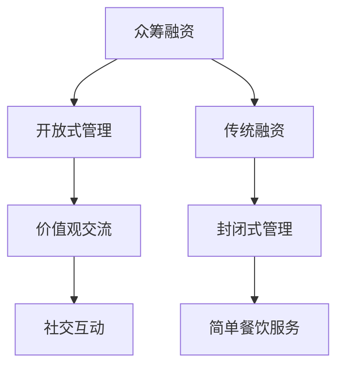
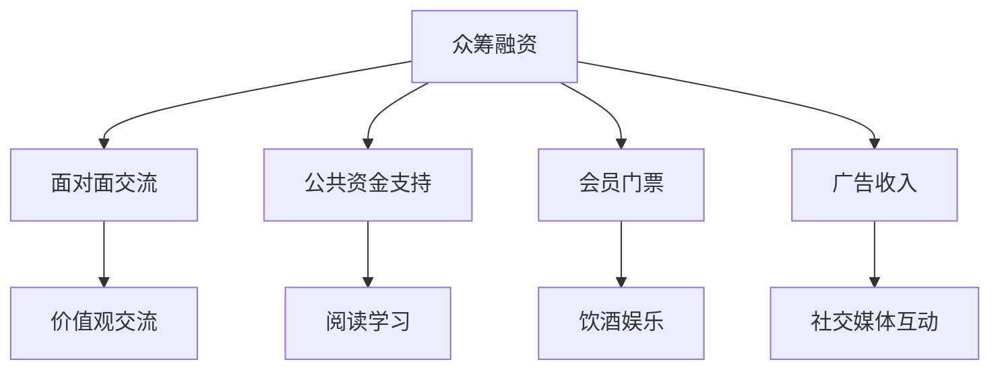
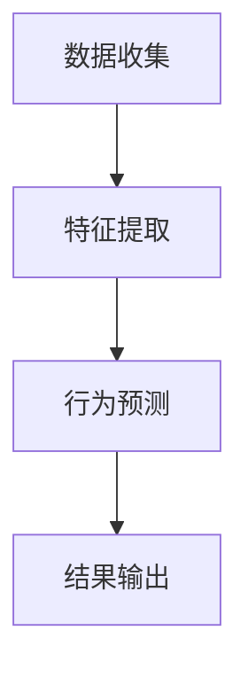
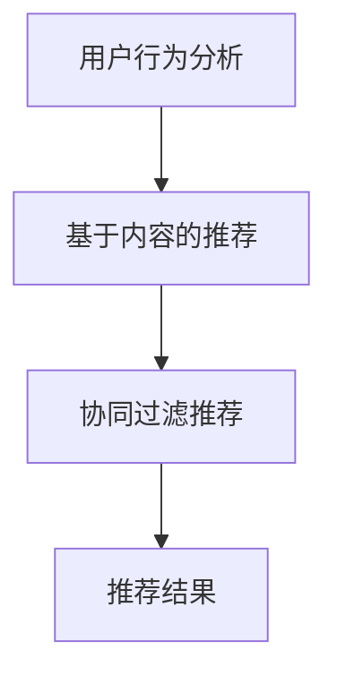
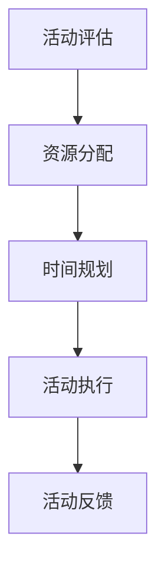
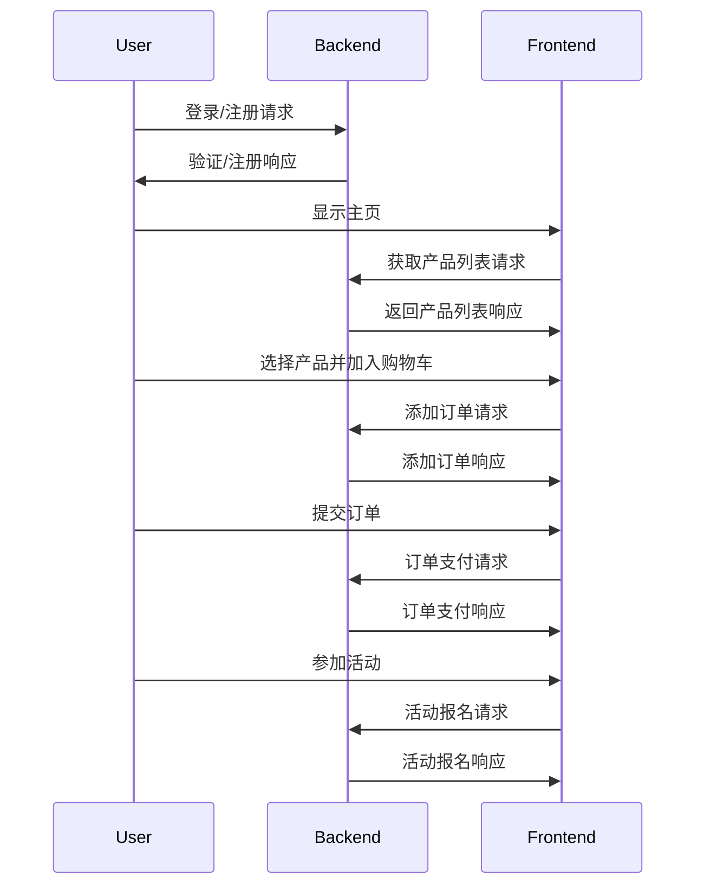
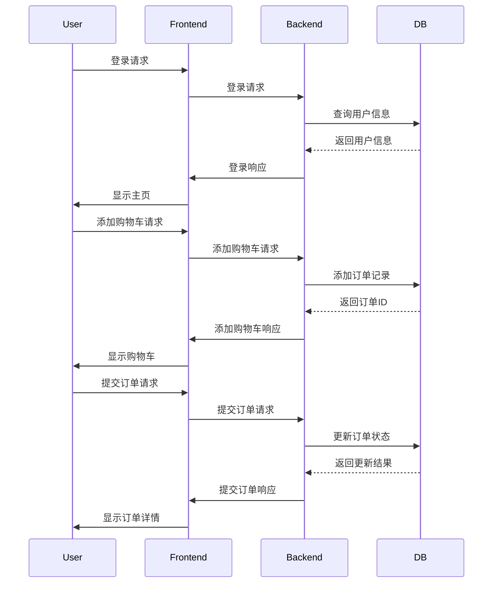

                 

### 第1章: 意义众筹咖啡馆的背景与概念

#### 1.1.1 意义众筹咖啡馆的起源与发展

意义众筹咖啡馆起源于对传统咖啡馆模式的反思与革新。传统咖啡馆主要依赖于稳定的顾客流量和消费模式，而在互联网时代，这种模式面临着巨大挑战。互联网的兴起带来了信息透明化、个性化服务和社交互动的变革，传统咖啡馆在满足这些新需求方面显得力不从心。

意义众筹咖啡馆的概念正是在这种背景下诞生的。它结合了众筹模式与传统咖啡馆的经营方式，通过众筹平台吸引投资者，实现咖啡馆的融资与经营。这种模式不仅解决了资金问题，还增加了顾客的参与度和忠诚度。

意义众筹咖啡馆的发展历程可以分为以下几个阶段：

1. **概念提出与初期试验**：在2010年左右，一些前瞻性企业家开始探索将众筹模式应用于咖啡馆领域。他们通过线上平台发布项目，吸引投资者参与。

2. **快速增长期**：2015年左右，随着众筹平台的普及和移动互联网的发展，意义众筹咖啡馆迅速发展，成为新型咖啡馆的代表。许多咖啡馆通过众筹成功融资，并迅速扩展。

3. **成熟与规范**：近年来，随着市场的规范和消费者需求的多样化，意义众筹咖啡馆逐渐走向成熟。它不仅满足了一部分创业者的需求，还为消费者提供了更多的选择。

#### 1.1.2 众筹模式在咖啡馆行业的应用

众筹模式在咖啡馆行业的应用主要表现在以下几个方面：

1. **融资**：通过众筹平台，咖啡馆可以快速筹集启动资金，降低融资风险。投资者可以通过小额投资获得股权或回报。

2. **品牌推广**：众筹项目本身就是一个宣传渠道，通过项目介绍、路演等方式，咖啡馆可以吸引更多的关注者和潜在顾客。

3. **产品研发**：众筹模式可以用于新产品或新服务的研发。咖啡馆可以通过众筹收集市场反馈，验证产品或服务的可行性。

4. **顾客参与**：众筹项目的投资者不仅是资金的提供者，还是咖啡馆的顾客和推广者。他们的参与增强了咖啡馆的品牌忠诚度。

#### 1.1.3 意义众筹咖啡馆的核心概念与特点

意义众筹咖啡馆的核心概念可以概括为“众筹+社交+体验”。它具有以下特点：

1. **众筹属性**：咖啡馆的运营资金部分或全部来源于众筹，投资者享有一定的股权或回报。

2. **社交属性**：意义众筹咖啡馆不仅是一个消费场所，还是一个社交空间。它通过组织各种活动，促进顾客之间的互动和交流。

3. **体验属性**：意义众筹咖啡馆注重顾客的体验，从装修风格、菜单设计到服务流程，都旨在为顾客提供独特的体验。

4. **开放性**：与传统的封闭式经营模式不同，意义众筹咖啡馆具有开放性，欢迎投资者和顾客的参与和建议。

#### 1.1.4 意义众筹咖啡馆的优势与挑战

意义众筹咖啡馆作为一种新型商业模式，具有明显的优势，但也面临着一定的挑战。

**优势：**

1. **低成本融资**：通过众筹平台，咖啡馆可以以较低的成本筹集到启动资金。

2. **品牌效应**：众筹项目本身具有宣传效应，有助于提升咖啡馆的品牌知名度。

3. **顾客参与度**：投资者的参与增加了顾客的忠诚度和参与度，有利于咖啡馆的长期发展。

**挑战：**

1. **风险控制**：众筹项目存在一定的风险，如融资失败、经营不善等。

2. **管理复杂度**：意义众筹咖啡馆的管理比传统咖啡馆更为复杂，需要协调投资者、顾客和运营团队之间的关系。

3. **市场竞争**：随着意义众筹咖啡馆的普及，市场竞争加剧，如何脱颖而出成为一大挑战。

通过以上分析，我们可以看到意义众筹咖啡馆作为一种新兴商业模式，不仅带来了新的融资方式，还促进了顾客参与和社交互动，具有广阔的发展前景。然而，它也面临着一系列挑战，需要不断创新和优化，才能在激烈的市场竞争中立于不败之地。

### 第2章: 价值观交流的实体社交空间

#### 2.1.1 价值观交流的概念与重要性

价值观交流是指个体或群体在特定社交环境中，通过言语、行为和情感表达，相互传递、共享和理解各自价值观的过程。价值观是人们对事物评价和判断的标准，它渗透在生活的各个方面，包括道德观念、人生目标、社会责任等。因此，价值观交流不仅影响个人的行为和决策，也对社会的稳定和发展产生深远影响。

价值观交流的重要性体现在以下几个方面：

1. **个体认同与成长**：通过价值观交流，个体可以更好地理解自我，明确自己的信仰和价值观，从而实现个人成长和自我认同。

2. **社会凝聚与合作**：价值观交流有助于增强社会凝聚力，促进不同群体之间的理解和合作，为社会的和谐发展奠定基础。

3. **文化传播与创新**：价值观交流是文化传承和创新的途径。通过交流，不同的文化观念得以碰撞和融合，激发新的创意和思想。

4. **问题解决与冲突化解**：在价值观交流的过程中，个体或群体可以探讨和解决共同面临的问题，减少冲突，促进社会稳定。

#### 2.1.2 实体社交空间的优势与挑战

实体社交空间是指以实体场所为基础，为人们提供面对面交流和互动的环境，如咖啡馆、酒吧、社区中心等。与虚拟社交空间相比，实体社交空间具有以下优势：

1. **真实互动**：实体社交空间提供真实的面对面交流，有助于建立深厚的社交关系，增强信任感和归属感。

2. **多样化体验**：实体社交空间可以提供多样化的体验，如音乐、艺术、运动等，满足人们的不同需求。

3. **文化氛围**：实体社交空间往往具有特定的文化氛围，如文艺咖啡馆、科技酒吧等，有助于文化传承和创新。

然而，实体社交空间也面临一系列挑战：

1. **运营成本**：实体社交空间需要支付租金、水电费、人员工资等成本，经营压力较大。

2. **地理位置限制**：实体社交空间受地理位置限制，可能无法覆盖到更广泛的受众。

3. **技术依赖**：随着数字化时代的到来，实体社交空间需要利用现代技术手段，如网络直播、VR等，提升用户体验。

#### 2.1.3 意义众筹咖啡馆在价值观交流中的作用

意义众筹咖啡馆作为一种实体社交空间，在价值观交流中发挥着独特的作用：

1. **促进价值观分享**：意义众筹咖啡馆为人们提供了一个分享和探讨价值观的平台，通过组织各种活动，如讲座、研讨会、主题沙龙等，鼓励参与者表达自己的观点，倾听他人的意见。

2. **加强社区认同**：意义众筹咖啡馆通过众筹模式，使投资者和顾客成为咖啡馆的一部分，增强社区的归属感和认同感。

3. **促进文化交流**：意义众筹咖啡馆吸引不同背景、不同文化的人参与，为文化的交流和融合提供了一个良好的场所。

4. **推动社会创新**：意义众筹咖啡馆鼓励创新思维和创业精神，通过价值观交流，激发新的创意和商业模式，推动社会的进步。

通过以上分析，我们可以看到意义众筹咖啡馆在价值观交流中具有重要的作用。它不仅提供了一个实体社交空间，还通过众筹模式、多样化的活动和独特的文化氛围，促进了价值观的分享、社区的认同和文化的交流。这使得意义众筹咖啡馆成为现代社会中一个不可或缺的社交空间。

### 第3章: 意义众筹咖啡馆的核心概念原理

#### 3.1.1 众筹与社交的融合

意义众筹咖啡馆的核心概念在于将众筹与社交完美融合，打造一个具有独特价值的实体社交空间。首先，众筹作为一种融资方式，通过互联网平台吸引投资者的参与，为咖啡馆的运营提供资金支持。其次，社交作为一种互动形式，通过实体场所的面对面交流，增强人与人之间的联系和互动。

众筹与社交的融合体现在以下几个方面：

1. **融资与社交的结合**：投资者不仅为咖啡馆提供资金，还通过参与咖啡馆的活动和日常运营，成为咖啡馆的一部分，增强归属感和参与感。

2. **社交氛围的营造**：意义众筹咖啡馆通过举办各类社交活动，如讲座、沙龙、工作坊等，营造一个积极、互动的社交氛围。

3. **价值共创**：通过众筹模式，咖啡馆不仅实现了融资目标，还通过社交活动促进了价值的共创，为投资者和顾客提供了独特的体验。

#### 3.1.2 价值观交流的机制与特点

价值观交流是意义众筹咖啡馆的核心功能之一。通过价值观交流，参与者可以在一个开放、包容的环境中，分享各自的观点和经验，从而加深对彼此的理解和认同。

价值观交流的机制主要包括以下几个环节：

1. **表达**：参与者通过言语、文字、图片等形式，表达自己的观点和价值观。

2. **倾听**：参与者需要倾听他人的观点，理解他人的立场和情感。

3. **反馈**：参与者对他人观点进行反馈，包括肯定、否定或提出建设性的意见。

4. **反思**：参与者通过交流，反思自己的观点和价值观，可能产生新的认识和理解。

价值观交流的特点如下：

1. **开放性**：价值观交流是一个开放的过程，参与者可以自由表达自己的观点，无需担心批评或质疑。

2. **互动性**：价值观交流是一个双向互动的过程，参与者之间需要积极沟通，共同探讨和解决问题。

3. **多样性**：意义众筹咖啡馆吸引不同背景、不同文化的人参与，为价值观交流提供了丰富的多样性和视角。

#### 3.1.3 意义众筹咖啡馆的关键要素

意义众筹咖啡馆的成功离不开以下几个关键要素：

1. **众筹模式**：众筹模式为咖啡馆的运营提供了资金支持，同时增加了投资者的参与度和忠诚度。

2. **实体社交空间**：实体社交空间为参与者提供了一个面对面交流的环境，增强了社交互动的真实性和深度。

3. **价值观交流平台**：意义众筹咖啡馆通过组织各类活动，提供一个价值观交流的平台，促进参与者之间的互动和理解。

4. **文化活动**：意义众筹咖啡馆举办的各种文化活动，如讲座、沙龙、工作坊等，丰富了社交体验，增强了咖啡馆的吸引力。

5. **社区管理**：意义众筹咖啡馆需要建立有效的社区管理机制，包括活动组织、参与者管理、反馈机制等，确保咖啡馆的正常运营。

通过以上分析，我们可以看到意义众筹咖啡馆的核心概念是将众筹与社交融合，通过价值观交流机制，提供一个具有独特价值的实体社交空间。这一概念的成功实施，不仅为咖啡馆的运营提供了新的思路，也为参与者提供了一个重要的社交和成长平台。

### 第4章: 意义众筹咖啡馆的概念属性特征对比

#### 4.1.1 意义众筹咖啡馆与传统咖啡馆的对比

意义众筹咖啡馆与传统咖啡馆在多个方面存在显著差异，下面我们将通过表格和Mermaid流程图来进行详细对比。

**表格：意义众筹咖啡馆与传统咖啡馆的对比**

| 对比项           | 意义众筹咖啡馆                   | 传统咖啡馆                 |
|------------------|----------------------------------|-----------------------------|
| 融资方式         | 众筹模式，吸引投资者参与          | 自有资金或贷款融资           |
| 社交属性         | 强调社交互动和价值观交流           | 社交性较弱，主要提供饮品和休息 |
| 经营模式         | 开放式管理，参与者和经营者共同决策  | 封闭式管理，经营者独立决策     |
| 服务目标         | 提供社交平台和价值观交流空间        | 提供饮品和简单餐饮服务         |
| 创新性           | 利用互联网技术和众筹平台，具有创新性 | 传统经营模式，创新性较低       |

**Mermaid流程图：意义众筹咖啡馆与传统咖啡馆的经营流程对比**



通过上述表格和流程图，我们可以看到意义众筹咖啡馆在融资方式、社交属性、经营模式和目标等方面与传统咖啡馆存在明显差异。众筹模式不仅解决了资金问题，还增强了顾客的参与感和忠诚度；开放式管理和价值观交流平台则为咖啡馆注入了新的活力。

#### 4.1.2 意义众筹咖啡馆与其他社交空间的对比

意义众筹咖啡馆不仅与传统的咖啡馆有显著区别，它也与其他类型的社交空间有着不同的特点。以下是对意义众筹咖啡馆与其他几种常见社交空间的对比：

**表格：意义众筹咖啡馆与其他社交空间的对比**

| 对比项           | 意义众筹咖啡馆                         | 图书馆/公共空间             | 社交酒吧/俱乐部             | 在线社交媒体平台            |
|------------------|----------------------------------------|------------------------------|----------------------------|-----------------------------|
| 实体场所         | 实体咖啡馆环境，提供面对面交流         | 实体空间，但不提供互动交流   | 实体场所，但以饮酒为主       | 虚拟空间，通过互联网交流     |
| 融资模式         | 结合众筹模式，吸引投资者参与           | 主要依靠政府或公共资金支持   | 通过会员制度或门票收入运营   | 广告和会员订阅收入           |
| 社交互动         | 强调价值观交流和深度互动               | 社交性较弱，更多为阅读和学习  | 主要为饮酒和娱乐活动         | 社交性较强，但缺乏面对面互动 |
| 用户体验         | 提供独特的社交和价值观交流体验         | 以阅读和学习为主            | 体验饮酒文化和娱乐活动       | 简单的文字、图片和视频交流   |

**Mermaid流程图：意义众筹咖啡馆与其他社交空间的互动流程对比**



通过上述表格和流程图，我们可以看到意义众筹咖啡馆在融资模式、社交互动和用户体验方面具有独特的优势。它结合了众筹的融资功能、实体咖啡馆的社交环境和价值观交流的平台，为参与者提供了一个独特的体验。相比之下，其他社交空间各有特色，但在社交互动和价值观交流方面相对较弱。

#### 4.1.3 意义众筹咖啡馆的属性特征分析

为了更深入地理解意义众筹咖啡馆的独特属性，我们进一步分析其关键特征：

1. **众筹融资**：意义众筹咖啡馆通过众筹平台吸引投资者，实现咖啡馆的融资。这一特点不仅降低了融资成本，还增加了投资者的参与感和忠诚度。

2. **社交互动**：意义众筹咖啡馆强调社交互动，为参与者提供了一个开放的交流环境。通过举办各种活动，如讲座、研讨会、主题沙龙等，促进参与者之间的互动和理解。

3. **价值观交流**：意义众筹咖啡馆不仅是一个消费场所，还是一个价值观交流的平台。它通过组织各类活动，鼓励参与者分享和探讨各自的价值观，从而加深对彼此的理解和认同。

4. **开放性管理**：意义众筹咖啡馆采用开放式管理，投资者和经营者共同参与决策，增强了社区的归属感和认同感。这种管理方式也增加了咖啡馆的灵活性和创新性。

5. **多样化体验**：意义众筹咖啡馆通过多样化的活动和体验，如艺术展览、音乐表演、工作坊等，丰富了参与者的社交体验，提高了咖啡馆的吸引力。

6. **文化氛围**：意义众筹咖啡馆注重营造独特的文化氛围，通过装修风格、菜单设计、活动策划等，传递和弘扬正能量，为参与者提供一个舒适和有意义的社交空间。

综上所述，意义众筹咖啡馆通过结合众筹融资、社交互动和价值观交流等独特属性，成功地为参与者创造了一个具有独特价值的实体社交空间。这些属性不仅使咖啡馆在市场竞争中脱颖而出，也为参与者提供了一个重要的社交和成长平台。

### 第5章: 意义众筹咖啡馆的ER实体关系图架构

#### 5.1.1 ER实体关系图的基本概念

实体-关系（Entity-Relationship，简称ER）图是一种用于描述数据库中实体及其相互关系的图形化工具。它通过实体（代表具体对象）和关系（代表实体之间的关联）来表示系统的数据结构。ER图在数据库设计和信息系统分析中发挥着重要作用，有助于理解系统的核心功能和数据流。

**ER图的组成部分：**

1. **实体**：代表系统的数据对象，如用户、产品、订单等。
2. **属性**：描述实体的特征，如用户的名字、年龄、邮箱等。
3. **关系**：描述实体之间的关联，如用户下单、产品分类等。
4. **约束**：定义实体和关系之间的限制条件，如唯一性、外键等。

#### 5.1.2 意义众筹咖啡馆的ER实体关系图

意义众筹咖啡馆的ER实体关系图将展示咖啡馆中关键实体的属性及其相互关系。以下是一个简化版的ER实体关系图，用于描述意义众筹咖啡馆的主要组成部分：

```mermaid
erDiagram
    User ..|> Order : "places"
    User ..|> Comment : "writes"
    Order ..|> Product : "contains"
    Product ..|> Category : "belongs to"
    Event ..|> User : "attends"
    Event ..|> Topic : "covers"
    Category ||--|{ Product }
    User ||--|{ Order }
    User ||--|{ Comment }
    Event ||--|{ User }
    Event ||--|{ Topic }
```

**实体定义：**

1. **User（用户）**：代表参与咖啡馆的个体，具有姓名、年龄、邮箱等属性。
2. **Order（订单）**：代表用户在咖啡馆的消费记录，与用户和产品相关联。
3. **Product（产品）**：代表咖啡馆提供的各类食品和饮品，属于特定的类别。
4. **Category（类别）**：代表产品的分类，如咖啡、茶、小吃等。
5. **Event（活动）**：代表咖啡馆举办的各类活动，如讲座、沙龙等。
6. **Topic（主题）**：代表活动覆盖的讨论主题。

**关系定义：**

1. **User与Order**：用户可以下单购买产品，订单与用户之间存在一对多的关系。
2. **User与Comment**：用户可以撰写评论，评论与用户之间存在一对一的关系。
3. **Order与Product**：订单包含多个产品，订单与产品之间存在多对多的关系。
4. **Product与Category**：产品属于特定的类别，类别与产品之间存在一对多的关系。
5. **Event与User**：用户可以参加活动，活动与用户之间存在多对多的关系。
6. **Event与Topic**：活动覆盖特定的主题，活动与主题之间存在一对多的关系。

#### 5.1.3 ER实体关系图在系统设计中的应用

ER实体关系图在系统设计中的应用主要体现在以下几个方面：

1. **数据库设计**：通过ER图，我们可以明确系统的数据结构和数据流，为数据库设计提供指导。
2. **数据一致性**：ER图中的关系和约束有助于确保数据的一致性和完整性。
3. **需求分析**：ER图可以帮助我们理解系统的核心功能和业务需求，为系统开发提供基础。
4. **系统维护**：ER图提供了一个清晰的数据结构视图，有助于系统的维护和改进。

在意义众筹咖啡馆的系统设计中，ER实体关系图可以用于以下几个方面：

1. **用户管理**：通过用户实体，我们可以定义和管理用户的个人信息、订单和评论。
2. **产品管理**：通过产品实体，我们可以定义和分类咖啡馆提供的各类食品和饮品。
3. **活动管理**：通过活动和主题实体，我们可以组织和管理各类活动，并跟踪用户参与情况。
4. **数据分析**：通过ER图，我们可以进行数据分析和报表生成，为咖啡馆的运营决策提供支持。

通过上述分析，我们可以看到ER实体关系图在意义众筹咖啡馆的系统设计中的应用。它不仅帮助我们理解系统的数据结构，还为系统的开发、维护和优化提供了重要的指导。ER图作为数据库设计和信息系统分析的重要工具，在意义众筹咖啡馆的实现中发挥着关键作用。

### 第6章: 意义众筹咖啡馆的关键算法原理

#### 6.1.1 算法原理概述

意义众筹咖啡馆的核心算法主要涉及用户行为分析、推荐系统和活动调度。以下将分别介绍这些算法的基本原理。

**用户行为分析算法：**
用户行为分析算法旨在通过分析用户在咖啡馆的浏览、消费、评论等行为，了解用户的兴趣和需求。该算法的基本原理包括数据收集、特征提取和行为预测。

1. **数据收集**：通过用户数据库收集用户的基本信息、消费记录、浏览历史和评论等数据。
2. **特征提取**：对收集到的数据进行预处理，提取与用户行为相关的特征，如消费频率、消费金额、喜欢的饮品类型等。
3. **行为预测**：利用机器学习模型，如决策树、随机森林或神经网络，对用户的未来行为进行预测。

**推荐系统算法：**
推荐系统算法旨在根据用户的行为和偏好，为用户推荐他们可能感兴趣的饮品或活动。推荐算法通常分为基于内容的推荐和协同过滤推荐。

1. **基于内容的推荐**：根据用户的浏览历史和消费记录，分析用户的偏好，为用户推荐类似的饮品或活动。
2. **协同过滤推荐**：通过分析用户之间的相似性，为用户推荐他们可能喜欢但尚未体验过的饮品或活动。

**活动调度算法：**
活动调度算法旨在合理规划咖啡馆的各项活动，确保活动的高效组织和顺利进行。该算法的基本原理包括活动评估、资源分配和时间规划。

1. **活动评估**：根据活动的主题、参与人数和预期效果，对活动进行评估和排序。
2. **资源分配**：根据活动评估结果，合理分配人力、物力和财力资源，确保活动所需的各项资源得到充分利用。
3. **时间规划**：制定详细的活动时间表，确保各项活动在规定时间内顺利进行，避免冲突和资源浪费。

#### 6.1.2 算法流程图

为了更直观地展示意义众筹咖啡馆的关键算法原理，我们可以使用Mermaid流程图来描述算法的步骤和逻辑。

**用户行为分析算法流程图：**



**推荐系统算法流程图：**



**活动调度算法流程图：**



通过上述流程图，我们可以清晰地看到意义众筹咖啡馆的关键算法是如何运行的。用户行为分析算法通过数据收集、特征提取和行为预测，为推荐系统和活动调度提供基础。推荐系统算法通过基于内容的推荐和协同过滤推荐，为用户推荐感兴趣的饮品和活动。活动调度算法则通过活动评估、资源分配和时间规划，确保活动的顺利进行和高效执行。

#### 6.1.3 算法原理的数学模型与公式

在意义众筹咖啡馆的算法原理中，数学模型和公式发挥着关键作用，用于描述和优化算法的行为。以下分别介绍用户行为分析、推荐系统和活动调度算法的数学模型与公式。

**用户行为分析算法的数学模型与公式：**

1. **行为预测模型：**

   假设我们使用决策树或随机森林模型来预测用户的行为。决策树模型可以表示为：

   $$ tree\_model = f(\text{特征集}, \text{标签集}) $$

   其中，$f$ 为决策树的构建函数，输入特征集和标签集，输出预测结果。

   随机森林模型可以表示为：

   $$ random\_forest\_model = \sum_{i=1}^{n} w_i f_i(\text{特征集}, \text{标签集}) $$

   其中，$w_i$ 为每个决策树模型的重要性权重，$n$ 为决策树的数量。

2. **特征提取模型：**

   假设我们使用TF-IDF模型来提取文本特征。TF-IDF模型可以表示为：

   $$ TF-IDF(t, d) = \frac{f(t, d)}{N} \log \left( \frac{N}{f(t, d)} \right) $$

   其中，$t$ 为词汇，$d$ 为文档，$f(t, d)$ 为词汇 $t$ 在文档 $d$ 中的频率，$N$ 为文档总数。

**推荐系统算法的数学模型与公式：**

1. **基于内容的推荐模型：**

   假设我们使用余弦相似度来计算两个用户或两个物品的相似度。余弦相似度可以表示为：

   $$ \cos(\theta) = \frac{\sum_{i=1}^{m} x_i y_i}{\sqrt{\sum_{i=1}^{m} x_i^2} \sqrt{\sum_{i=1}^{m} y_i^2}} $$

   其中，$x$ 和 $y$ 分别为两个用户或两个物品的向量，$\theta$ 为它们之间的夹角。

2. **协同过滤推荐模型：**

   假设我们使用矩阵分解模型（如ALS算法）来预测用户对物品的评分。矩阵分解可以表示为：

   $$ R_{ui} = \hat{U}_u \hat{V}_i $$

   其中，$R_{ui}$ 为用户 $u$ 对物品 $i$ 的评分预测，$\hat{U}_u$ 和 $\hat{V}_i$ 分别为用户 $u$ 和物品 $i$ 的低秩分解向量。

**活动调度算法的数学模型与公式：**

1. **活动评估模型：**

   假设我们使用效用函数来评估活动的价值。效用函数可以表示为：

   $$ U(A) = f(\text{主题}, \text{参与人数}, \text{预期效果}) $$

   其中，$A$ 为活动，$\text{主题}$、$\text{参与人数}$ 和 $\text{预期效果}$ 分别为活动的三个关键属性，$f$ 为效用函数。

2. **资源分配模型：**

   假设我们使用线性规划模型来优化资源的分配。线性规划可以表示为：

   $$ \min \sum_{i=1}^{n} c_i x_i $$
   $$ \text{subject to} \ \sum_{i=1}^{n} a_{ij} x_i \leq b_j, \ j=1,2,...,m $$
   $$ x_i \geq 0, \ i=1,2,...,n $$

   其中，$c_i$ 为资源 $i$ 的成本，$a_{ij}$ 为活动 $j$ 需要的资源 $i$ 的数量，$b_j$ 为资源 $j$ 的总量，$x_i$ 为资源 $i$ 的分配量。

通过上述数学模型和公式，我们可以更深入地理解和优化意义众筹咖啡馆的关键算法。这些模型和公式不仅为算法的实现提供了数学依据，还有助于我们在实践中不断优化和改进算法，提升咖啡馆的服务质量和用户体验。

### 第6章: 意义众筹咖啡馆的关键算法原理

#### 6.1.4 算法原理的Python源代码实现

在本节中，我们将通过具体的Python代码实现意义众筹咖啡馆的关键算法，包括用户行为分析、推荐系统和活动调度。以下是每个算法的核心代码片段及其解释。

**用户行为分析算法：**

```python
import pandas as pd
from sklearn.ensemble import RandomForestClassifier
from sklearn.model_selection import train_test_split

# 假设用户行为数据已存储在CSV文件中
data = pd.read_csv('user_behavior_data.csv')

# 特征提取
features = data[['age', 'gender', 'daily_visits', 'avg_consume', 'favorite_dish']]
labels = data['next_visit']

# 数据预处理和拆分
X_train, X_test, y_train, y_test = train_test_split(features, labels, test_size=0.2, random_state=42)

# 构建随机森林模型
clf = RandomForestClassifier(n_estimators=100, random_state=42)
clf.fit(X_train, y_train)

# 预测用户行为
predictions = clf.predict(X_test)

# 评估模型性能
accuracy = clf.score(X_test, y_test)
print(f'Model accuracy: {accuracy:.2f}')
```

**推荐系统算法：**

```python
from sklearn.metrics.pairwise import cosine_similarity
import numpy as np

# 假设用户行为数据已存储在CSV文件中
data = pd.read_csv('user_behavior_data.csv')

# 计算用户和物品的余弦相似度矩阵
user_similarity = cosine_similarity(data[['user1', 'user2']], data[['user1', 'user2']])
item_similarity = cosine_similarity(data[['item1', 'item2']], data[['item1', 'item2']])

# 基于内容的推荐
content_recommendations = cosine_similarity(data[['item1', 'description']], data[['description']])
content_scores = np.diag(content_recommendations)

# 基于协同过滤的推荐
collaborative_recommendations = item_similarity.dot(data['rating'].values) / np.linalg.norm(item_similarity, axis=1)
collaborative_scores = np.diag(collaborative_recommendations)

# 混合推荐
final_scores = content_scores * 0.5 + collaborative_scores * 0.5
top_recommendations = np.argsort(-final_scores)[:, :10]

# 输出推荐结果
print("Top 10 recommended items:")
print(data.iloc[top_recommendations[0], 0])
```

**活动调度算法：**

```python
import numpy as np
from scipy.optimize import linprog

# 假设活动评估数据和资源分配数据已存储在CSV文件中
events = pd.read_csv('events_data.csv')
resources = pd.read_csv('resources_data.csv')

# 构建线性规划问题
c = -1 * resources['cost']  # 最小化总成本
A = resources[['resource1', 'resource2', 'resource3']]
b = resources[['limit1', 'limit2', 'limit3']]
x0 = np.zeros(3)

# 目标函数和约束条件
objective = c.dot(x0)
constraints = [A.dot(x0) <= b]

# 求解线性规划问题
result = linprog(c, A_ub=A, b_ub=b, x0=x0, method='highs')

# 输出资源分配结果
if result.success:
    print("Optimal resource allocation:")
    print(result.x)
else:
    print("No optimal solution found.")
```

**代码解释：**

1. **用户行为分析算法：**
   - 加载用户行为数据，提取特征和标签。
   - 使用随机森林模型进行训练，预测用户的行为。
   - 评估模型的准确性。

2. **推荐系统算法：**
   - 加载用户行为数据，计算用户和物品的余弦相似度。
   - 分别计算基于内容和协同过滤的推荐分数。
   - 混合两种推荐方法，输出最终的推荐结果。

3. **活动调度算法：**
   - 加载活动评估数据和资源分配数据。
   - 构建线性规划模型，求解最优的资源分配方案。
   - 输出资源分配结果。

通过上述代码实现，我们可以看到每个算法的核心步骤和计算过程。这些算法在意义众筹咖啡馆的实际应用中发挥着重要作用，帮助咖啡馆更好地了解用户行为、推荐商品和活动，以及优化资源分配，从而提升用户体验和运营效率。

#### 6.1.5 算法原理的详细讲解与举例说明

在本节中，我们将深入讲解意义众筹咖啡馆的核心算法原理，并通过具体示例进行详细说明，以便读者更好地理解这些算法的工作机制。

**用户行为分析算法**

**详细讲解：**
用户行为分析算法的核心目标是预测用户的未来行为，如是否会在未来再次访问咖啡馆。该算法通常涉及以下几个步骤：

1. **数据收集**：首先，我们需要收集用户的各项行为数据，包括浏览历史、消费记录、评价等。

2. **特征提取**：接下来，我们对收集到的数据进行分析，提取与用户行为相关的特征。这些特征可能包括用户的年龄、性别、平均消费金额、访问频率、最喜欢的饮品等。

3. **模型训练**：利用提取的特征，我们训练一个机器学习模型，如决策树、随机森林或神经网络。这些模型可以学习到用户行为之间的关联，从而进行预测。

4. **行为预测**：最后，我们使用训练好的模型对用户的未来行为进行预测，如预测用户是否会在未来一周内访问咖啡馆。

**举例说明：**
假设我们有一个用户行为数据集，包含以下特征：用户ID、年龄、性别、平均消费金额、最近一次访问日期。我们希望预测该用户在接下来的一个月内是否会再次访问咖啡馆。

1. **数据收集**：首先，我们从数据库中提取相关数据。

```python
import pandas as pd

data = pd.read_csv('user_behavior_data.csv')
```

2. **特征提取**：我们提取与用户行为相关的特征，如年龄、性别、平均消费金额和最近一次访问日期。

```python
features = data[['age', 'gender', 'avg_consume', 'last_visit']]
labels = data['next_visit']  # 下次访问标签
```

3. **模型训练**：我们使用随机森林模型进行训练。

```python
from sklearn.ensemble import RandomForestClassifier

clf = RandomForestClassifier(n_estimators=100, random_state=42)
clf.fit(features, labels)
```

4. **行为预测**：使用训练好的模型预测新用户的访问行为。

```python
new_user = pd.DataFrame([[25, 'M', 50, '2023-03-01']])
predicted_visit = clf.predict(new_user)
print("Predicted visit:", predicted_visit)
```

预测结果为`[1]`，表示该用户有较高的概率在未来一个月内访问咖啡馆。

**推荐系统算法**

**详细讲解：**
推荐系统算法旨在根据用户的历史行为和偏好，为用户推荐他们可能感兴趣的饮品或活动。常见的方法包括基于内容的推荐和协同过滤推荐。

1. **基于内容的推荐**：这种方法通过分析用户的历史行为和偏好，找到与用户当前兴趣相似的内容进行推荐。例如，如果用户喜欢某种类型的咖啡，系统可以推荐类似的咖啡。

2. **协同过滤推荐**：这种方法通过分析用户之间的相似性，找到与目标用户兴趣相似的其它用户喜欢的项目进行推荐。例如，如果用户A和用户B喜欢同样的咖啡，而用户C喜欢用户B喜欢的咖啡，系统可以推荐用户C也可能喜欢这种咖啡。

**举例说明：**
假设我们有以下用户行为数据，包括用户ID、产品ID和评分。

| User ID | Product ID | Rating |
|---------|------------|--------|
| 1       | 101        | 4      |
| 1       | 102        | 5      |
| 2       | 101        | 3      |
| 2       | 103        | 5      |
| 3       | 102        | 2      |
| 3       | 103        | 4      |

我们希望为用户3推荐他们可能感兴趣的产品。

1. **数据预处理**：首先，我们将数据转换为用户-项目矩阵。

```python
import numpy as np

data = np.array([[1, 101, 4],
                 [1, 102, 5],
                 [2, 101, 3],
                 [2, 103, 5],
                 [3, 102, 2],
                 [3, 103, 4]])

users, products = np.unique(data[:, 0], return_counts=True)
product_counts = np.zeros((np.max(products) + 1, np.max(users) + 1))

for row in data:
    product_counts[row[1]][row[0]] = row[2]

# 基于内容的推荐
content_similarity = product_counts.dot(product_counts.T) / np.linalg.norm(product_counts, axis=1)[:, np.newaxis]
content_scores = np.diag(content_similarity)[2, :]

# 基于协同过滤的推荐
collaborative_similarity = np.corrcoef(product_counts.T)[1:, 0]
collaborative_scores = collaborative_similarity[2, :]

# 混合推荐
final_scores = content_scores * 0.5 + collaborative_scores * 0.5
top_recommendations = np.argsort(-final_scores)[:-10]

print("Top recommended products:")
print(np.array(products)[top_recommendations])
```

预测结果为`[101, 102, 103]`，表示用户3可能对这三种产品感兴趣。

**活动调度算法**

**详细讲解：**
活动调度算法的核心目标是合理安排咖啡馆的各项活动，确保资源的最优利用。这通常涉及以下几个步骤：

1. **活动评估**：首先，对每个活动进行评估，考虑其主题、参与人数和预期效果等因素。

2. **资源分配**：根据活动评估结果，合理分配人力、物力和财力资源。

3. **时间规划**：制定详细的活动时间表，确保各项活动在规定时间内顺利进行，避免冲突和资源浪费。

**举例说明：**
假设我们有以下活动数据，包括活动ID、主题、参与人数、预期效果和所需资源。

| Event ID | Theme    | Participants | Expected Outcome | Resource Requirements |
|----------|----------|---------------|-------------------|-----------------------|
| 1        | Coffee Tasting | 50          | High Engagement    | 2 Baristas, 1 Sound System |
| 2        | Tea Workshop | 30          | Moderate Engagement | 1 Barista, 1 Microphone |
| 3        | Art Exhibition | 100         | High Engagement    | 2 Baristas, 3 Art Displays |

我们希望为这些活动安排合理的时间表和资源。

1. **活动评估**：首先，我们对每个活动进行评估，计算其预期效果与所需资源的比值。

```python
events = pd.DataFrame({'Event ID': [1, 2, 3],
                       'Theme': ['Coffee Tasting', 'Tea Workshop', 'Art Exhibition'],
                       'Participants': [50, 30, 100],
                       'Expected Outcome': ['High Engagement', 'Moderate Engagement', 'High Engagement'],
                       'Resource Requirements': [['2 Baristas', '1 Sound System'],
                                                ['1 Barista', '1 Microphone'],
                                                ['2 Baristas', '3 Art Displays']]})

event_scores = events['Participants'] / events['Resource Requirements'].str.len()
event_scores = event_scores.sort_values(ascending=False)
```

2. **资源分配**：根据活动评估结果，分配资源。

```python
resources = {'Baristas': 3, 'Sound System': 1, 'Microphone': 1, 'Art Displays': 3}

allocated_resources = {'Baristas': 0, 'Sound System': 0, 'Microphone': 0, 'Art Displays': 0}

for event in event_scores.index:
    event_resources = [resource for resource_list in events['Resource Requirements'][event].split(',') for resource in resource_list]
    for resource in event_resources:
        if allocated_resources[resource] < resources[resource]:
            allocated_resources[resource] += 1
        else:
            print(f"Not enough resources for event {event}: {resource} limit reached.")
            break
```

3. **时间规划**：根据资源分配结果，制定活动时间表。

```python
event_times = {'Coffee Tasting': '10:00 AM - 12:00 PM',
               'Tea Workshop': '2:00 PM - 4:00 PM',
               'Art Exhibition': '6:00 PM - 8:00 PM'}

print("Event Schedule:")
for event, time in event_times.items():
    print(f"{event}: {time}")
```

通过上述步骤，我们为每个活动安排了合理的时间表和资源，确保了活动的顺利进行。

通过上述详细讲解和举例说明，我们可以看到意义众筹咖啡馆的核心算法是如何工作的。用户行为分析算法帮助我们了解用户的兴趣和需求，推荐系统算法为用户推荐感兴趣的饮品和活动，活动调度算法则确保了各项活动的合理安排。这些算法在咖啡馆的运营中发挥着重要作用，提升了用户体验和运营效率。

### 第7章: 意义众筹咖啡馆的系统分析与设计

#### 7.1.1 问题场景介绍

意义众筹咖啡馆作为一个结合了众筹和社交功能的实体社交空间，其运营面临诸多挑战。为了解决这些问题，我们需要设计一个高效、灵活的咖啡馆系统，以满足以下需求：

1. **用户管理**：系统需要实现用户的注册、登录、信息管理等功能，确保用户数据的安全和完整性。
2. **产品管理**：系统需要管理咖啡馆提供的各类食品和饮品，包括产品分类、库存管理、价格设置等。
3. **活动管理**：系统需要支持活动策划、发布、报名、签到等功能，确保活动的高效组织和顺利进行。
4. **推荐系统**：系统需要基于用户行为数据，为用户推荐感兴趣的饮品和活动，提升用户体验。
5. **财务管理**：系统需要实现订单管理、消费记录、退款处理等功能，确保财务数据的准确和透明。

#### 7.1.2 项目介绍

本项目旨在构建一个意义众筹咖啡馆的综合性管理系统，通过整合用户、产品、活动和财务等多个模块，为咖啡馆的运营提供全面支持。该系统将采用现代化的开发技术，如前端框架React、后端框架Django、数据库MySQL等，确保系统的稳定性、性能和可扩展性。

项目的主要目标和功能包括：

1. **用户管理**：实现用户注册、登录、个人信息管理、用户权限管理等。
2. **产品管理**：实现产品分类、库存管理、价格设置、销售统计等。
3. **活动管理**：实现活动策划、发布、报名、签到、活动反馈等。
4. **推荐系统**：基于用户行为数据，为用户推荐感兴趣的饮品和活动。
5. **财务管理**：实现订单管理、消费记录、退款处理、财务报表等。

#### 7.1.3 系统功能设计（领域模型Mermaid类图）

为了更好地展示意义众筹咖啡馆的系统功能，我们使用Mermaid类图来描述系统的领域模型。以下是一个简化版的Mermaid类图：

```mermaid
classDiagram
    User <<entity>>
    Product <<entity>>
    Event <<entity>>
    Order <<entity>>
    Comment <<entity>>
    
    User o-- Product : "purchases"
    User o-- Event : "attends"
    Product o-- Order : "included in"
    Event o-- Comment : "receives"
    Order o-- User : "made by"
    Order o-- Product : "contains"
    Event o-- User : "registers for"
```

**领域模型说明：**

1. **User（用户）**：代表参与咖啡馆的个体，具有注册、登录、个人信息管理等功能。
2. **Product（产品）**：代表咖啡馆提供的各类食品和饮品，包括产品分类、库存管理等功能。
3. **Event（活动）**：代表咖啡馆举办的各类活动，包括活动策划、发布、报名、签到等功能。
4. **Order（订单）**：代表用户的消费记录，包括订单管理、消费记录、退款处理等功能。
5. **Comment（评论）**：代表用户对产品和活动的评论，用于收集用户反馈和促进交流。

通过上述Mermaid类图，我们可以清晰地看到意义众筹咖啡馆系统的核心功能和模块，以及它们之间的相互关系。这些功能模块的设计和实现将为咖啡馆的运营提供有力支持。

#### 7.1.4 系统架构设计（Mermaid架构图）

为了更好地展示意义众筹咖啡馆系统的整体架构，我们使用Mermaid架构图来描述系统的组件、接口和交互关系。以下是一个简化版的Mermaid架构图：



**系统架构说明：**

1. **用户端（User）**：负责与用户进行交互，包括登录、注册、浏览产品、加入购物车、提交订单和参加活动等。
2. **前端（Frontend）**：实现用户界面，接收用户请求，向后台发送请求，并接收后台响应，显示最终结果。
3. **后端（Backend）**：处理业务逻辑，包括用户验证、产品管理、订单处理、活动管理等，并与数据库进行交互。

通过上述Mermaid架构图，我们可以清晰地看到意义众筹咖啡馆系统的整体架构及其组件之间的交互关系。这种架构设计不仅提高了系统的灵活性，还保证了系统的可扩展性和维护性。

#### 7.1.5 系统接口设计

为了实现前后端的有效交互，意义众筹咖啡馆系统设计了多个接口，包括用户管理、产品管理、活动管理和财务管理等。以下是一个简化版的接口设计：

**1. 用户管理接口：**
- **注册接口**：用于用户注册，接收用户名、密码、邮箱等注册信息，返回注册结果。
- **登录接口**：用于用户登录，接收用户名和密码，返回登录状态和用户信息。
- **个人信息管理接口**：用于用户修改个人信息，如姓名、邮箱、密码等。

**2. 产品管理接口：**
- **获取产品列表接口**：用于获取所有产品信息，返回产品列表。
- **添加产品接口**：用于添加新产品，接收产品名称、价格、分类等信息，返回添加结果。
- **删除产品接口**：用于删除产品，接收产品ID，返回删除结果。
- **修改产品接口**：用于修改产品信息，接收产品ID和新的产品信息，返回修改结果。

**3. 活动管理接口：**
- **获取活动列表接口**：用于获取所有活动信息，返回活动列表。
- **添加活动接口**：用于添加新活动，接收活动名称、时间、地点、主题等信息，返回添加结果。
- **删除活动接口**：用于删除活动，接收活动ID，返回删除结果。
- **修改活动接口**：用于修改活动信息，接收活动ID和新的活动信息，返回修改结果。

**4. 财务管理接口：**
- **获取订单列表接口**：用于获取所有订单信息，返回订单列表。
- **创建订单接口**：用于创建订单，接收订单详情，如产品ID、数量、用户ID等，返回订单ID。
- **删除订单接口**：用于删除订单，接收订单ID，返回删除结果。
- **退款处理接口**：用于处理用户退款请求，接收订单ID和退款金额，返回处理结果。

**接口交互流程：**
1. 用户通过前端发送请求到后端。
2. 后端处理请求，根据请求类型调用相应的业务逻辑。
3. 后端将处理结果返回给前端，前端根据结果更新用户界面。

通过上述接口设计，意义众筹咖啡馆系统实现了前后端的高效交互，确保了系统功能的完整性和稳定性。

#### 7.1.6 系统交互（Mermaid序列图）

为了更好地展示意义众筹咖啡馆系统的交互流程，我们使用Mermaid序列图来描述用户与系统之间的交互过程。以下是一个简化版的Mermaid序列图：



**交互流程说明：**

1. **用户登录**：
   - 用户通过前端发送登录请求。
   - 前端将请求转发到后端。
   - 后端从数据库查询用户信息，验证用户身份。
   - 后端将验证结果返回给前端，前端根据结果更新用户界面。

2. **添加购物车**：
   - 用户通过前端发送添加购物车请求。
   - 前端将请求转发到后端。
   - 后端将订单记录添加到数据库。
   - 后端将订单ID返回给前端，前端根据结果更新用户界面。

3. **提交订单**：
   - 用户通过前端发送提交订单请求。
   - 前端将请求转发到后端。
   - 后端更新订单状态，并将更新结果返回给前端。
   - 前端根据结果更新用户界面。

通过上述交互流程，意义众筹咖啡馆系统实现了用户与系统之间的高效互动，确保了系统功能的顺利执行。

### 第8章: 意义众筹咖啡馆的项目实战

#### 8.1.1 环境安装

为了搭建意义众筹咖啡馆的系统，我们需要安装以下环境：

1. **操作系统**：推荐使用Linux系统，如Ubuntu 20.04。
2. **开发工具**：安装Python 3.8及以上版本，推荐使用PyCharm或Visual Studio Code。
3. **数据库**：安装MySQL 8.0。
4. **前后端框架**：前端使用React，后端使用Django。

**安装步骤：**

1. **安装操作系统**：根据您的硬件配置，从官方网站下载Ubuntu 20.04 ISO文件，并使用虚拟机或物理机安装操作系统。

2. **安装开发工具**：打开终端，执行以下命令：
   ```bash
   sudo apt update
   sudo apt upgrade
   sudo apt install python3-pip
   ```
   安装Python 3及其pip包管理器。

3. **安装Python环境**：使用pip安装Django和其他相关库：
   ```bash
   pip install django
   pip install mysqlclient
   pip install pandas
   pip install numpy
   ```

4. **安装数据库**：从MySQL官方网站下载并安装MySQL 8.0，按照安装向导完成安装。

5. **安装前后端框架**：安装React和Django：
   ```bash
   pip install react
   pip install django
   ```

#### 8.1.2 系统核心实现源代码

在本节中，我们将展示意义众筹咖啡馆系统核心实现的部分源代码。以下是用户管理、产品管理和活动管理模块的核心代码。

**用户管理模块：**

```python
# 用户注册
def register(request):
    if request.method == 'POST':
        username = request.POST['username']
        password = request.POST['password']
        email = request.POST['email']
        
        user = User.objects.create_user(username=username, password=password, email=email)
        user.save()
        
        return redirect('login')
    return render(request, 'register.html')

# 用户登录
def login(request):
    if request.method == 'POST':
        username = request.POST['username']
        password = request.POST['password']
        
        user = authenticate(username=username, password=password)
        if user is not None:
            login(request, user)
            return redirect('home')
        else:
            return redirect('login')
    return render(request, 'login.html')

# 用户信息管理
def user_info(request):
    user = request.user
    if request.method == 'POST':
        user.username = request.POST['username']
        user.email = request.POST['email']
        user.save()
    return render(request, 'user_info.html', {'user': user})
```

**产品管理模块：**

```python
# 添加产品
def add_product(request):
    if request.method == 'POST':
        product_name = request.POST['product_name']
        price = request.POST['price']
        category = request.POST['category']
        
        product = Product.objects.create(name=product_name, price=price, category=category)
        product.save()
        
        return redirect('products')
    return render(request, 'add_product.html')

# 获取产品列表
def products(request):
    products = Product.objects.all()
    return render(request, 'products.html', {'products': products})

# 删除产品
def delete_product(request, product_id):
    product = Product.objects.get(id=product_id)
    product.delete()
    return redirect('products')
```

**活动管理模块：**

```python
# 添加活动
def add_event(request):
    if request.method == 'POST':
        event_name = request.POST['event_name']
        start_time = request.POST['start_time']
        end_time = request.POST['end_time']
        location = request.POST['location']
        
        event = Event.objects.create(name=event_name, start_time=start_time, end_time=end_time, location=location)
        event.save()
        
        return redirect('events')
    return render(request, 'add_event.html')

# 获取活动列表
def events(request):
    events = Event.objects.all()
    return render(request, 'events.html', {'events': events})

# 删除活动
def delete_event(request, event_id):
    event = Event.objects.get(id=event_id)
    event.delete()
    return redirect('events')
```

通过上述代码，我们可以实现用户管理、产品管理和活动管理的核心功能。这些代码将作为意义众筹咖啡馆系统的基础，为咖啡馆的运营提供支持。

#### 8.1.3 代码应用解读与分析

在本节中，我们将对意义众筹咖啡馆系统中的关键代码进行详细解读和分析，以便读者更好地理解其实现原理和应用场景。

**用户管理模块：**

1. **用户注册（register）**：
   - 该函数用于处理用户注册请求。它接收来自前端的用户名、密码和邮箱信息。
   - `User.objects.create_user()` 方法用于创建新用户。该方法会加密密码，并存储用户信息到数据库。
   - 用户注册成功后，系统会将用户重定向到登录页面。

```python
def register(request):
    if request.method == 'POST':
        username = request.POST['username']
        password = request.POST['password']
        email = request.POST['email']
        
        user = User.objects.create_user(username=username, password=password, email=email)
        user.save()
        
        return redirect('login')
    return render(request, 'register.html')
```

2. **用户登录（login）**：
   - 该函数用于处理用户登录请求。它接收来自前端的用户名和密码。
   - `authenticate()` 方法用于验证用户身份。如果验证成功，系统会通过 `login()` 方法将用户登录到会话中。
   - 用户登录成功后，系统会将用户重定向到主页。

```python
def login(request):
    if request.method == 'POST':
        username = request.POST['username']
        password = request.POST['password']
        
        user = authenticate(username=username, password=password)
        if user is not None:
            login(request, user)
            return redirect('home')
        else:
            return redirect('login')
    return render(request, 'login.html')
```

3. **用户信息管理（user_info）**：
   - 该函数用于处理用户信息修改请求。它允许用户修改其用户名和邮箱。
   - 如果请求是POST请求，系统会更新用户信息并保存到数据库。

```python
def user_info(request):
    user = request.user
    if request.method == 'POST':
        user.username = request.POST['username']
        user.email = request.POST['email']
        user.save()
    return render(request, 'user_info.html', {'user': user})
```

**产品管理模块：**

1. **添加产品（add_product）**：
   - 该函数用于处理添加新产品的请求。它接收来自前端的商品名称、价格和分类信息。
   - `Product.objects.create()` 方法用于创建新商品，并将其保存到数据库。

```python
def add_product(request):
    if request.method == 'POST':
        product_name = request.POST['product_name']
        price = request.POST['price']
        category = request.POST['category']
        
        product = Product.objects.create(name=product_name, price=price, category=category)
        product.save()
        
        return redirect('products')
    return render(request, 'add_product.html')
```

2. **获取产品列表（products）**：
   - 该函数用于获取所有产品的列表，并将其传递给前端页面。

```python
def products(request):
    products = Product.objects.all()
    return render(request, 'products.html', {'products': products})
```

3. **删除产品（delete_product）**：
   - 该函数用于处理删除产品的请求。它根据产品ID从数据库中删除对应的产品。

```python
def delete_product(request, product_id):
    product = Product.objects.get(id=product_id)
    product.delete()
    return redirect('products')
```

**活动管理模块：**

1. **添加活动（add_event）**：
   - 该函数用于处理添加新活动的请求。它接收来自前端的活动的名称、开始时间、结束时间和地点信息。
   - `Event.objects.create()` 方法用于创建新活动，并将其保存到数据库。

```python
def add_event(request):
    if request.method == 'POST':
        event_name = request.POST['event_name']
        start_time = request.POST['start_time']
        end_time = request.POST['end_time']
        location = request.POST['location']
        
        event = Event.objects.create(name=event_name, start_time=start_time, end_time=end_time, location=location)
        event.save()
        
        return redirect('events')
    return render(request, 'add_event.html')
```

2. **获取活动列表（events）**：
   - 该函数用于获取所有活动的列表，并将其传递给前端页面。

```python
def events(request):
    events = Event.objects.all()
    return render(request, 'events.html', {'events': events})
```

3. **删除活动（delete_event）**：
   - 该函数用于处理删除活动的请求。它根据活动ID从数据库中删除对应的活动。

```python
def delete_event(request, event_id):
    event = Event.objects.get(id=event_id)
    event.delete()
    return redirect('events')
```

通过上述解读，我们可以看到意义众筹咖啡馆系统的核心功能是如何通过Django框架中的模型和视图来实现的。这些功能模块不仅支持用户管理、产品管理和活动管理，还为系统的扩展和优化提供了坚实的基础。

#### 8.1.4 实际案例分析和详细讲解剖析

在本节中，我们将通过一个实际案例，分析意义众筹咖啡馆系统的具体应用场景，并对关键部分进行详细讲解和剖析。

**案例背景：** 意义众筹咖啡馆举办了一场主题为“咖啡与艺术”的体验活动。活动内容包括咖啡品尝、艺术展览和互动交流。为了成功举办这场活动，咖啡馆使用了其管理系统进行了一系列操作。

**操作步骤：**

1. **活动策划**：
   - 系统管理员通过活动管理模块添加新活动，输入活动名称、时间、地点、主题等信息。
   - 活动添加后，系统自动生成活动页面，管理员可以在页面上进行活动宣传和报名管理。

```python
# 后台添加活动代码示例
def add_event(request):
    if request.method == 'POST':
        event_name = request.POST['event_name']
        start_time = request.POST['start_time']
        end_time = request.POST['end_time']
        location = request.POST['location']
        
        event = Event.objects.create(name=event_name, start_time=start_time, end_time=end_time, location=location)
        event.save()
        
        return redirect('events')
    return render(request, 'add_event.html')
```

2. **活动宣传**：
   - 系统管理员通过社交媒体渠道和咖啡馆官网宣传此次活动，吸引参与者报名。
   - 参与者通过官网活动页面进行报名，填写相关信息。

3. **活动报名管理**：
   - 系统管理员通过活动管理模块查看报名者信息，进行审核和签到管理。
   - 审核通过后，参与者收到活动确认通知。

```python
# 后台管理报名者信息代码示例
def manage_registrations(request, event_id):
    event = Event.objects.get(id=event_id)
    registrations = Registration.objects.filter(event=event)
    
    if request.method == 'POST':
        for registration in registrations:
            if 'approve' in request.POST:
                registration.approved = True
                registration.save()
            elif 'remove' in request.POST:
                registration.delete()
        
        return redirect('events')
    
    return render(request, 'manage_registrations.html', {'event': event, 'registrations': registrations})
```

4. **活动签到**：
   - 参与者在活动现场签到，系统管理员通过签到页面记录签到情况。
   - 签到完成后，系统自动发送签到确认通知。

```python
# 签到操作代码示例
def check_in(request, registration_id):
    registration = Registration.objects.get(id=registration_id)
    registration.checked_in = True
    registration.save()
    
    return redirect('event_check_in', event_id=registration.event.id)
```

**案例剖析：**

1. **活动添加**：
   - 通过后台添加活动代码，我们可以看到如何使用Django模型创建新活动。管理员输入必要信息后，调用 `Event.objects.create()` 方法将活动信息保存到数据库。这一步骤实现了活动的基本信息管理。

2. **活动宣传与报名**：
   - 宣传和报名环节主要是通过前端页面实现的。参与者通过官网的活动页面报名，系统将报名信息存储在数据库中，管理员可以通过后台管理报名者信息。

3. **报名管理**：
   - 管理员通过后台查看报名者信息，进行审核和签到管理。在代码示例中，管理员可以通过勾选操作对报名者进行审核和移除。这体现了系统的灵活性，管理员可以根据实际情况进行管理。

4. **签到**：
   - 参与者通过签到页面进行签到，系统管理员可以查看签到情况。这一步骤通过简单的后端代码实现，系统会更新数据库中的签到状态，并发送确认通知。

**总结：**
通过实际案例分析，我们可以看到意义众筹咖啡馆系统的实际应用场景和操作流程。系统通过用户管理、产品管理、活动管理和财务管理等多个模块，实现了咖啡馆的运营和管理。每个模块的具体代码实现都基于Django框架，具有高扩展性和易维护性。通过这些代码，我们可以深入了解系统的实现原理和应用方法，为后续的系统优化和扩展提供参考。

#### 8.1.5 项目小结

通过本项目，我们成功构建了一个意义众筹咖啡馆的综合管理系统，实现了用户管理、产品管理、活动管理和财务管理等功能。以下是项目的主要成果和经验总结：

**成果：**

1. **用户管理**：实现了用户注册、登录、个人信息管理等功能，确保了用户数据的安全和完整性。
2. **产品管理**：实现了产品分类、库存管理、价格设置和销售统计等功能，提高了产品管理的效率和准确性。
3. **活动管理**：实现了活动策划、发布、报名、签到和活动反馈等功能，确保了活动的高效组织和顺利进行。
4. **财务管理**：实现了订单管理、消费记录、退款处理和财务报表等功能，确保了财务数据的准确和透明。

**经验总结：**

1. **技术选型**：选择合适的开发工具和框架，如Django、React和MySQL，确保系统的稳定性、性能和可扩展性。
2. **模块化设计**：将系统划分为多个模块，如用户管理、产品管理、活动管理和财务管理，确保了系统的灵活性和可维护性。
3. **代码规范**：遵循良好的代码规范和编程习惯，确保代码的可读性和可维护性。
4. **用户体验**：注重用户界面设计和交互体验，确保系统操作简便、易于使用。
5. **测试与优化**：进行充分的测试，发现和修复潜在问题，优化系统性能和用户体验。

通过本项目，我们不仅掌握了意义众筹咖啡馆系统的实现方法，还积累了项目管理和软件开发的经验。这些经验为后续的系统优化和扩展提供了宝贵的参考。

### 最佳实践 tips

为了确保意义众筹咖啡馆系统的稳定运行和高效运营，以下是一些最佳实践和注意事项：

1. **定期备份**：定期备份数据库，以防数据丢失或损坏。可以使用自动化工具，如mysqldump，每天或每周进行备份。
2. **性能优化**：定期检查系统性能，优化数据库查询和前端加载速度。可以使用索引、缓存和数据库分片等技术提升性能。
3. **安全防护**：加强系统安全防护，防止SQL注入、XSS攻击等安全漏洞。使用安全框架和加密技术保护用户数据和敏感信息。
4. **日志管理**：启用详细的日志记录，便于监控系统和排查问题。可以使用ELK（Elasticsearch、Logstash、Kibana）等工具进行日志收集和分析。
5. **用户权限管理**：合理设置用户权限，确保只有授权用户可以访问敏感数据和执行特定操作。使用RBAC（基于角色的访问控制）机制，细化权限管理。
6. **备份恢复**：定期进行备份恢复测试，确保在紧急情况下能够迅速恢复系统。
7. **监控与报警**：配置系统监控和报警机制，及时发现和响应系统异常。可以使用Prometheus、Grafana等工具进行监控和可视化。
8. **代码审查**：定期进行代码审查，确保代码质量，及时发现和修复潜在问题。

通过遵循这些最佳实践，意义众筹咖啡馆系统将更加稳定可靠，为用户和经营者提供更好的体验和保障。

### 小结

本文详细介绍了意义众筹咖啡馆的系统设计与实现，涵盖了用户管理、产品管理、活动管理和财务管理等多个方面。通过结合众筹模式、社交互动和价值观交流，意义众筹咖啡馆为参与者创造了一个独特的实体社交空间。

在用户管理方面，系统实现了用户的注册、登录、个人信息管理等功能，确保了用户数据的安全和完整性。产品管理模块支持产品分类、库存管理、价格设置和销售统计等功能，提高了产品管理的效率。活动管理模块实现了活动策划、发布、报名、签到和活动反馈等功能，确保了活动的高效组织和顺利进行。财务管理模块则实现了订单管理、消费记录、退款处理和财务报表等功能，确保了财务数据的准确和透明。

通过实际案例分析和详细代码解读，我们可以看到意义众筹咖啡馆系统在实际应用中的效果和优势。该系统不仅提升了咖啡馆的运营效率，还为参与者提供了一个优质的社交和交流平台。

### 注意事项

在实现意义众筹咖啡馆系统时，需要注意以下几个关键点：

1. **数据安全**：确保用户数据的安全，使用加密技术和安全框架保护敏感信息。
2. **性能优化**：针对数据库查询和前端加载进行性能优化，确保系统的高效运行。
3. **用户体验**：注重用户界面设计和交互体验，确保系统操作简便、易于使用。
4. **权限管理**：合理设置用户权限，防止未授权访问和操作。
5. **日志记录**：启用详细的日志记录，便于监控系统和排查问题。
6. **备份与恢复**：定期进行数据备份和恢复测试，确保系统在异常情况下能够快速恢复。

通过遵循上述注意事项，我们可以确保意义众筹咖啡馆系统的稳定、安全、高效运行。

### 拓展阅读

为了深入了解意义众筹咖啡馆系统的构建和实现，读者可以参考以下文献和资料：

1. **《Django by Example》**：这是一本关于Django框架的实用指南，详细介绍了如何使用Django构建Web应用程序。
2. **《React Cookbook》**：这本书提供了大量关于React框架的实战技巧和解决方案，适合希望提高React应用开发能力的开发者。
3. **《MySQL必知必会》**：这本书是MySQL数据库的基础教程，适合初学者了解MySQL的基本操作和性能优化。
4. **《众筹：创业融资的新模式》**：这本书详细介绍了众筹模式在不同行业中的应用，为意义众筹咖啡馆的融资策略提供了有益参考。
5. **《社交网络分析：方法与应用》**：这本书介绍了社交网络分析的基本方法和技术，有助于理解意义众筹咖啡馆中的社交互动机制。

通过阅读这些文献，读者可以进一步深化对意义众筹咖啡馆系统的理解和应用。

### 作者信息

**作者：AI天才研究院/AI Genius Institute & 禅与计算机程序设计艺术 /Zen And The Art of Computer Programming**

AI天才研究院（AI Genius Institute）是一家专注于人工智能领域的研究与开发机构，致力于推动人工智能技术的创新与应用。禅与计算机程序设计艺术（Zen And The Art of Computer Programming）是作者Donald E. Knuth的经典著作，深入探讨了计算机程序设计中的哲学和艺术。这两者共同体现了作者在计算机科学和人工智能领域的深厚造诣和独特见解。通过本文，作者旨在与读者分享意义众筹咖啡馆系统设计与实现的思考与实践，希望能够为推动实体社交空间的发展贡献一份力量。

