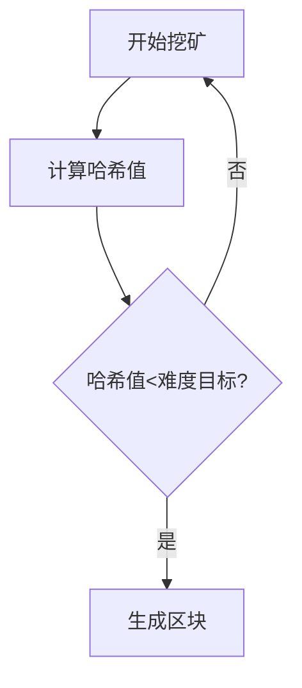
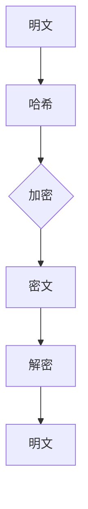

                 

### 引言

#### 1.1 区块链技术的起源与发展

区块链技术，作为一种颠覆性的创新，自其诞生以来便引起了全球的广泛关注。要理解区块链技术，我们首先需要了解其起源与发展历程。

区块链技术的起源可以追溯到2008年，一位名为中本聪的匿名人物发布了比特币白皮书，这标志着区块链技术的诞生。比特币作为一种去中心化的数字货币，旨在通过区块链技术实现点对点的价值传输，从而摆脱传统金融体系的束缚。比特币的诞生不仅引起了金融界的震动，也为区块链技术的发展奠定了基础。

在比特币之后，区块链技术得到了迅速发展。2014年，以太坊的诞生进一步丰富了区块链技术的应用场景。以太坊不仅支持数字货币的交易，还引入了智能合约的概念，使得开发者可以在区块链上创建和执行复杂的智能合约，从而实现自动化、去中心化的应用。

随着时间的推移，区块链技术的应用领域逐渐扩展到金融、物流、医疗、政府等多个领域。例如，在金融领域，区块链技术被用于实现跨境支付、供应链金融等应用；在物流领域，区块链技术被用于实现供应链管理、物流追踪等应用；在医疗领域，区块链技术被用于实现电子健康档案、医疗支付等应用。

#### 1.2 区块链的核心概念与特点

区块链技术之所以引起广泛关注，源于其独特的核心概念与特点。

首先，区块链技术实现了去中心化的数据存储和管理。在传统的中心化系统中，数据存储和管理依赖于一个中心化的机构，如银行或政府。而区块链技术通过分布式网络的方式，实现了数据的去中心化存储和管理，从而提高了系统的安全性和可靠性。

其次，区块链技术具有不可篡改的特性。在区块链上，一旦数据被记录下来，就几乎不可能被篡改。这种特性使得区块链技术非常适合用于记录重要数据，如金融交易记录、医疗健康数据等。

最后，区块链技术具有高度透明的特性。由于区块链技术的数据是公开的，任何人都可以查看区块链上的数据。这种透明性使得区块链技术非常适合用于需要公开透明的应用场景，如公共选举、供应链管理等。

#### 1.3 区块链的价值交换机制

区块链技术的核心应用之一就是实现价值交换。在区块链上，价值交换是通过加密货币实现的。加密货币，如比特币、以太坊等，是一种数字货币，其价值由市场供求关系决定。

区块链上的价值交换机制主要包括以下几个步骤：

1. **交易发起**：用户通过区块链网络发起一笔交易，交易内容通常包括交易双方的账户信息、交易金额等信息。

2. **交易验证**：区块链网络中的节点对交易进行验证，确保交易内容的合法性和正确性。

3. **交易打包**：验证后的交易被节点打包成一个新的区块，并附加到一个已存在的区块链上。

4. **共识达成**：区块链网络中的节点通过共识算法达成共识，确认新区块的有效性，并将其添加到区块链上。

5. **交易完成**：一旦新区块被添加到区块链上，交易即宣告完成，交易金额将被转移至交易对方的账户。

区块链的价值交换机制具有以下几个优势：

1. **去中心化**：区块链上的价值交换不依赖于任何中心化的机构，实现了真正的点对点交易。

2. **安全性**：区块链上的交易记录是加密的，且一旦记录在区块链上，就几乎不可能被篡改。

3. **透明性**：区块链上的交易记录是公开的，任何人都可以查看，提高了交易的透明度。

#### 1.4 本书结构安排

本书将分为以下几个章节，对区块链技术进行深入探讨：

- **第1章 区块链基础理论**：介绍区块链技术的起源与发展、核心概念与特点、价值交换机制等基础理论。
- **第2章 区块链的核心技术**：介绍区块链的核心技术，如哈希算法、链式数据结构、共识机制、智能合约等。
- **第3章 区块链的应用场景**：探讨区块链技术在金融、物流、医疗、政府等领域的应用。
- **第4章 区块链的安全性分析**：分析区块链技术的安全性，包括加密技术、共识机制的安全性等。
- **第5章 区块链的未来发展**：探讨区块链技术的未来发展方向和趋势。

通过本书的阅读，读者将能够全面了解区块链技术，掌握其核心原理和应用方法。

---

关键词：区块链、去中心化、价值交换、加密货币、共识机制

摘要：本文详细介绍了区块链技术的起源、发展、核心概念、特点以及价值交换机制。通过本文的阅读，读者将能够深入理解区块链技术，掌握其核心原理和应用方法。

### 第1章 区块链基础理论

区块链技术作为当前信息技术领域的重要创新，其基础理论的理解是掌握其核心要义的关键。本章将系统介绍区块链技术的起源、发展、核心概念、特点以及价值交换机制，帮助读者建立起对区块链技术的全面认知。

#### 1.1 区块链的起源与发展

区块链技术的起源可以追溯到2008年，当时一位名为中本聪的匿名人物发布了比特币白皮书。比特币作为一种去中心化的数字货币，其核心理念是通过区块链技术实现点对点的价值传输。这一创新性的想法在金融和技术领域引起了极大的关注。

在比特币之后，区块链技术得到了快速发展。2014年，以太坊的推出进一步丰富了区块链技术的应用场景。以太坊不仅支持数字货币的交易，还引入了智能合约的概念，使得开发者可以在区块链上创建和执行复杂的智能合约。这一创新使得区块链技术从单一的货币传输工具，转变为一种具有广泛应用前景的技术平台。

区块链技术的发展历程可以分为以下几个阶段：

1. **初期阶段（2008-2010）**：比特币白皮书的发布标志着区块链技术的诞生。这一阶段，区块链技术主要应用于数字货币领域。

2. **快速发展阶段（2011-2013）**：随着比特币价格的波动，区块链技术开始受到更多关注。这一阶段，区块链技术开始被探索应用于其他领域，如供应链管理、医疗记录等。

3. **应用探索阶段（2014-2016）**：以太坊的推出，引入了智能合约的概念，使得区块链技术的应用场景进一步扩展。这一阶段，区块链技术开始被应用于金融、物流、医疗等多个领域。

4. **成熟应用阶段（2017-至今）**：随着区块链技术的不断成熟，越来越多的实际应用案例涌现出来。这一阶段，区块链技术逐渐从概念验证阶段转向大规模商业应用。

#### 1.1.1 区块链技术的起源

区块链技术的起源可以追溯到数字货币的诞生。在传统金融体系中，货币的发行和流通依赖于中心化的金融机构，如中央银行。这种中心化的体系容易导致单点故障、垄断以及欺诈等问题。为了解决这些问题，中本聪提出了比特币的概念，通过区块链技术实现去中心化的货币系统。

比特币的推出，标志着区块链技术的诞生。比特币通过区块链技术实现点对点的价值传输，不再依赖于任何中心化的机构。在比特币的区块链上，每一个交易记录都是公开透明的，且一旦被记录下来，就几乎不可能被篡改。这种不可篡改的特性，使得比特币在金融领域引起了极大的关注。

#### 1.1.2 区块链技术的主要发展历程

区块链技术的主要发展历程可以分为以下几个关键事件：

1. **比特币白皮书（2008年）**：中本聪发布了比特币白皮书，详细阐述了比特币的运行原理和设计思想。这一白皮书的发布，标志着区块链技术的诞生。

2. **比特币网络启动（2009年）**：比特币网络正式启动，第一个区块（创世区块）被挖掘出来。比特币网络的启动，标志着区块链技术的实际应用开始。

3. **第一次分叉（2011年）**：由于技术原因和社区分歧，比特币进行了第一次分叉，产生了比特币经典（Bitcoin Classic）。

4. **以太坊发布（2014年）**：以太坊的推出，引入了智能合约的概念，使得区块链技术不再局限于货币交易，而是成为一种通用的分布式计算平台。

5. **区块链2.0概念提出（2015年）**：随着区块链技术的发展，社区提出了区块链2.0的概念，即利用区块链技术构建去中心化的应用（DApp）。

6. **企业级区块链项目启动（2016年）**：随着区块链技术的成熟，越来越多的企业开始关注并投入区块链技术的研究和开发，如IBM的Hyperledger Fabric、R3的Corda等。

7. **区块链技术大规模应用（2017年至今）**：区块链技术逐渐从概念验证阶段转向大规模商业应用，如数字货币、智能合约、供应链管理、医疗记录等领域。

#### 1.1.3 区块链技术的应用领域

区块链技术具有去中心化、不可篡改、透明性等特点，这使得其在多个领域具有广泛的应用前景。以下是区块链技术的主要应用领域：

1. **金融领域**：区块链技术被广泛应用于金融领域，包括数字货币、跨境支付、供应链金融等。例如，比特币和以太坊等数字货币，通过区块链技术实现了去中心化的货币系统；跨境支付通过区块链技术实现了快速、低成本的跨境交易。

2. **物流领域**：区块链技术被用于实现供应链管理、物流追踪等应用。例如，通过区块链技术，可以实现对货物的全程追踪，提高物流的透明度和效率。

3. **医疗领域**：区块链技术被用于实现电子健康档案、医疗支付等应用。例如，通过区块链技术，可以实现医疗记录的分布式存储和管理，提高医疗数据的安全性和隐私性。

4. **政府领域**：区块链技术被用于实现公共选举、身份验证等应用。例如，通过区块链技术，可以实现公开透明的选举过程，防止选举欺诈。

5. **版权领域**：区块链技术被用于实现数字版权管理。例如，通过区块链技术，可以实现对数字作品的版权归属进行永久记录和保护。

#### 1.2 区块链的核心概念与特点

区块链技术具有一系列独特的核心概念和特点，这些概念和特点使得区块链技术成为一种具有巨大潜力的创新技术。

##### 1.2.1 区块链的核心概念

区块链技术主要包括以下几个核心概念：

1. **区块（Block）**：区块是区块链的基本组成单位，每个区块包含一定数量的交易记录。区块通常包含以下信息：
   - **版本号**：标识区块链协议的版本信息。
   - **默克尔树根**：用于验证区块内交易记录的完整性。
   - **时间戳**：标识区块生成的时间。
   - **难度目标**：用于控制区块生成的速度。
   - **前一个区块的哈希值**：用于连接区块，形成区块链。

2. **链（Chain）**：区块链是由一系列按时间顺序排列的区块组成的。每个区块都通过其前一个区块的哈希值与区块链的其他区块连接起来，形成了区块链。

3. **交易（Transaction）**：交易是区块链上的基本操作，用于在不同账户之间转移价值或信息。每个交易都包含以下信息：
   - **输入**：标识交易的发起者。
   - **输出**：标识交易的目的地。
   - **签名**：用于验证交易的合法性。

4. **共识机制（Consensus Mechanism）**：共识机制是区块链网络中的节点通过某种算法达成共识的过程。常见的共识机制包括工作量证明（Proof of Work，PoW）、权益证明（Proof of Stake，PoS）等。

##### 1.2.2 区块链的特点

区块链技术具有以下几个主要特点：

1. **去中心化**：区块链技术通过分布式网络的方式，实现了数据的去中心化存储和管理。在区块链上，数据不由任何中心化的机构控制，而是由网络中的所有节点共同维护。

2. **不可篡改**：区块链上的数据一旦被记录下来，就几乎不可能被篡改。这是由于区块链采用了加密技术，对数据进行加密和签名，确保数据的真实性和完整性。

3. **透明性**：区块链上的数据是公开的，任何人都可以查看。这种透明性提高了系统的可信度，使得区块链技术非常适合用于需要公开透明的应用场景。

4. **安全性**：区块链技术采用了多种加密技术，确保数据的保密性和完整性。此外，区块链网络中的节点通过共识机制，确保数据的真实性和可靠性。

5. **可扩展性**：区块链技术具有较好的可扩展性，可以通过分片技术、侧链技术等方式，提高区块链的处理能力和性能。

##### 1.2.3 区块链与中心化系统的区别

区块链技术与传统的中心化系统在数据存储方式、数据安全与隐私、系统维护与升级等方面存在显著差异。

1. **数据存储方式**：
   - **区块链**：数据分散存储在区块链网络中的各个节点上，实现了数据的去中心化存储。
   - **中心化系统**：数据集中存储在一个或多个中心化服务器上，容易导致单点故障。

2. **数据安全与隐私**：
   - **区块链**：数据通过加密技术进行保护，具有较高的安全性。此外，区块链上的数据是公开透明的，不适合需要高度隐私的应用。
   - **中心化系统**：数据集中存储，容易受到黑客攻击和泄露风险。

3. **系统维护与升级**：
   - **区块链**：系统维护和升级需要所有节点的共识，过程较为复杂。
   - **中心化系统**：系统维护和升级较为简单，但容易受到单点故障的影响。

#### 1.3 区块链的价值交换机制

区块链技术的核心应用之一就是实现价值交换。在区块链上，价值交换主要是通过加密货币实现的。加密货币，如比特币、以太坊等，是一种数字货币，其价值由市场供求关系决定。

区块链上的价值交换机制主要包括以下几个步骤：

1. **交易发起**：用户通过区块链网络发起一笔交易，交易内容通常包括交易双方的账户信息、交易金额等信息。

2. **交易验证**：区块链网络中的节点对交易进行验证，确保交易内容的合法性和正确性。

3. **交易打包**：验证后的交易被节点打包成一个新的区块，并附加到一个已存在的区块链上。

4. **共识达成**：区块链网络中的节点通过共识算法达成共识，确认新区块的有效性，并将其添加到区块链上。

5. **交易完成**：一旦新区块被添加到区块链上，交易即宣告完成，交易金额将被转移至交易对方的账户。

区块链的价值交换机制具有以下几个优势：

1. **去中心化**：区块链上的价值交换不依赖于任何中心化的机构，实现了真正的点对点交易。

2. **安全性**：区块链上的交易记录是加密的，且一旦记录在区块链上，就几乎不可能被篡改。

3. **透明性**：区块链上的交易记录是公开的，任何人都可以查看，提高了交易的透明度。

#### 1.4 本书结构安排

本书将分为以下几个章节，对区块链技术进行深入探讨：

- **第1章 区块链基础理论**：介绍区块链技术的起源、发展、核心概念、特点以及价值交换机制。
- **第2章 区块链的核心技术**：介绍区块链的核心技术，如哈希算法、链式数据结构、共识机制、智能合约等。
- **第3章 区块链的应用场景**：探讨区块链技术在金融、物流、医疗、政府等领域的应用。
- **第4章 区块链的安全性分析**：分析区块链技术的安全性，包括加密技术、共识机制的安全性等。
- **第5章 区块链的未来发展**：探讨区块链技术的未来发展方向和趋势。

通过本书的阅读，读者将能够全面了解区块链技术，掌握其核心原理和应用方法。

---

在这一章中，我们详细介绍了区块链技术的起源、发展、核心概念、特点以及价值交换机制。通过对这些内容的了解，读者可以建立起对区块链技术的全面认知。接下来，我们将深入探讨区块链技术的核心技术，包括哈希算法、链式数据结构、共识机制、智能合约等，帮助读者深入理解区块链技术的内部工作原理。

## 1.1 区块链技术的起源

区块链技术的起源可以追溯到数字货币的诞生，而数字货币的起源则源于对传统金融体系的不满和对去中心化理念的追求。在传统金融体系中，货币的发行和流通依赖于中心化的金融机构，如中央银行。这种中心化的体系存在以下问题：

1. **单点故障**：中心化的金融机构作为唯一的货币发行和清算中心，如果这个机构出现故障，整个金融系统都可能瘫痪。

2. **垄断**：中心化的金融机构往往具有垄断地位，这导致金融资源的分配不公，以及金融机构对用户的数据和交易行为进行严格控制。

3. **欺诈**：中心化的金融机构可能存在欺诈行为，如伪造交易记录、洗钱等。

为了解决这些问题，人们开始探讨去中心化的货币系统。去中心化的货币系统不需要依赖任何中心化的机构，而是通过分布式网络的方式实现货币的发行和流通。这种去中心化的理念不仅可以提高系统的安全性和可靠性，还可以打破金融垄断，实现金融资源的公平分配。

#### 1.1.1 数字货币的诞生

2008年，一位名为中本聪的匿名人物发布了比特币白皮书《比特币：一种点对点的电子现金系统》（Bitcoin: A Peer-to-Peer Electronic Cash System）。比特币白皮书中详细阐述了比特币的运行原理和设计思想，标志着数字货币的诞生。

比特币的核心理念是通过区块链技术实现去中心化的货币系统。在比特币系统中，货币的发行和流通不再依赖于任何中心化的机构，而是通过分布式网络中的所有节点共同维护。比特币系统中的每个节点都可以参与比特币的挖矿，通过解决数学难题来验证交易并生成新的比特币。

比特币的诞生不仅解决了传统金融体系中的单点故障、垄断和欺诈等问题，还开创了数字货币的新时代。比特币的成功也吸引了越来越多的研究人员和技术爱好者加入区块链技术的发展和探索。

#### 1.1.2 区块链技术的理论基础

区块链技术的理论基础主要源于密码学、网络协议和分布式系统等领域。以下是区块链技术的主要理论基础：

1. **密码学**：密码学是区块链技术的重要基础。区块链技术采用了多种加密算法，如哈希算法、非对称加密算法和数字签名等，来确保数据的保密性、完整性和真实性。

2. **网络协议**：区块链技术采用了一种去中心化的网络协议，使得网络中的节点可以无需信任地协同工作。网络协议主要包括P2P（Peer-to-Peer）网络协议和共识算法。

3. **分布式系统**：区块链技术是一种分布式系统，其核心思想是将数据分散存储在多个节点上，从而提高系统的可靠性和抗攻击性。分布式系统的研究成果，如容错机制、一致性算法等，为区块链技术的发展提供了重要支持。

#### 1.1.3 区块链技术的主要发展历程

区块链技术的发展历程可以分为以下几个关键阶段：

1. **初期阶段（2008-2010）**：比特币白皮书的发布标志着区块链技术的诞生。这一阶段，区块链技术主要应用于数字货币领域。

2. **快速发展阶段（2011-2013）**：随着比特币价格的波动，区块链技术开始受到更多关注。这一阶段，区块链技术开始被探索应用于其他领域，如供应链管理、医疗记录等。

3. **应用探索阶段（2014-2016）**：以太坊的推出，引入了智能合约的概念，使得区块链技术不再局限于货币交易，而是成为一种通用的分布式计算平台。

4. **成熟应用阶段（2017-至今）**：随着区块链技术的不断成熟，越来越多的实际应用案例涌现出来。这一阶段，区块链技术逐渐从概念验证阶段转向大规模商业应用。

在区块链技术发展的过程中，出现了许多重要的事件和里程碑，以下是其中的一些：

1. **比特币分叉**：比特币在发展过程中出现了多次分叉事件，如比特币经典（Bitcoin Classic）、比特币现金（Bitcoin Cash）等。这些分叉事件反映了社区对区块链技术的不同理解和需求。

2. **以太坊智能合约**：以太坊的推出，引入了智能合约的概念，使得开发者可以在区块链上创建和执行复杂的智能合约。这一创新使得区块链技术的应用场景大大扩展。

3. **企业级区块链项目**：随着区块链技术的成熟，越来越多的企业开始关注并投入区块链技术的研究和开发，如IBM的Hyperledger Fabric、R3的Corda等。这些企业级区块链项目旨在解决实际商业场景中的问题。

4. **区块链2.0概念**：区块链2.0概念提出，即利用区块链技术构建去中心化的应用（DApp）。这一概念强调了区块链技术不仅仅是货币交易的工具，而是一种通用的分布式计算平台。

5. **区块链技术标准化**：随着区块链技术的发展，国际标准化组织（ISO）和其他标准化组织开始制定区块链技术的标准和规范，以促进区块链技术的推广和应用。

#### 1.1.4 区块链技术的应用领域

区块链技术具有去中心化、不可篡改、透明性等特点，这使得其在多个领域具有广泛的应用前景。以下是区块链技术的主要应用领域：

1. **金融领域**：区块链技术被广泛应用于金融领域，包括数字货币、跨境支付、供应链金融等。例如，比特币和以太坊等数字货币，通过区块链技术实现了去中心化的货币系统；跨境支付通过区块链技术实现了快速、低成本的跨境交易。

2. **物流领域**：区块链技术被用于实现供应链管理、物流追踪等应用。例如，通过区块链技术，可以实现对货物的全程追踪，提高物流的透明度和效率。

3. **医疗领域**：区块链技术被用于实现电子健康档案、医疗支付等应用。例如，通过区块链技术，可以实现医疗记录的分布式存储和管理，提高医疗数据的安全性和隐私性。

4. **政府领域**：区块链技术被用于实现公共选举、身份验证等应用。例如，通过区块链技术，可以实现公开透明的选举过程，防止选举欺诈。

5. **版权领域**：区块链技术被用于实现数字版权管理。例如，通过区块链技术，可以实现对数字作品的版权归属进行永久记录和保护。

6. **能源领域**：区块链技术被用于实现去中心化的能源交易。例如，通过区块链技术，可以实现家庭用户与家庭用户之间的电力交易，减少能源浪费。

7. **教育领域**：区块链技术被用于实现学历认证、证书验证等应用。例如，通过区块链技术，可以实现对学历和证书的真实性和有效性进行验证，防止伪造和篡改。

#### 1.2 区块链的核心概念与特点

区块链技术之所以引起广泛关注，源于其独特的核心概念和特点。以下将详细介绍区块链技术的核心概念和特点。

##### 1.2.1 区块链的核心概念

区块链技术主要包括以下几个核心概念：

1. **区块（Block）**：区块是区块链的基本组成单位，每个区块包含一定数量的交易记录。区块通常包含以下信息：
   - **版本号**：标识区块链协议的版本信息。
   - **默克尔树根**：用于验证区块内交易记录的完整性。
   - **时间戳**：标识区块生成的时间。
   - **难度目标**：用于控制区块生成的速度。
   - **前一个区块的哈希值**：用于连接区块，形成区块链。

2. **链（Chain）**：区块链是由一系列按时间顺序排列的区块组成的。每个区块都通过其前一个区块的哈希值与区块链的其他区块连接起来，形成了区块链。

3. **交易（Transaction）**：交易是区块链上的基本操作，用于在不同账户之间转移价值或信息。每个交易都包含以下信息：
   - **输入**：标识交易的发起者。
   - **输出**：标识交易的目的地。
   - **签名**：用于验证交易的合法性。

4. **共识机制（Consensus Mechanism）**：共识机制是区块链网络中的节点通过某种算法达成共识的过程。常见的共识机制包括工作量证明（Proof of Work，PoW）、权益证明（Proof of Stake，PoS）等。

##### 1.2.2 区块链的特点

区块链技术具有以下几个主要特点：

1. **去中心化**：区块链技术通过分布式网络的方式，实现了数据的去中心化存储和管理。在区块链上，数据不由任何中心化的机构控制，而是由网络中的所有节点共同维护。

2. **不可篡改**：区块链上的数据一旦被记录下来，就几乎不可能被篡改。这是由于区块链采用了加密技术，对数据进行加密和签名，确保数据的真实性和完整性。

3. **透明性**：区块链上的数据是公开的，任何人都可以查看。这种透明性提高了系统的可信度，使得区块链技术非常适合用于需要公开透明的应用场景。

4. **安全性**：区块链技术采用了多种加密技术，确保数据的保密性和完整性。此外，区块链网络中的节点通过共识机制，确保数据的真实性和可靠性。

5. **可扩展性**：区块链技术具有较好的可扩展性，可以通过分片技术、侧链技术等方式，提高区块链的处理能力和性能。

##### 1.2.3 区块链与中心化系统的区别

区块链技术与传统的中心化系统在数据存储方式、数据安全与隐私、系统维护与升级等方面存在显著差异。

1. **数据存储方式**：
   - **区块链**：数据分散存储在区块链网络中的各个节点上，实现了数据的去中心化存储。
   - **中心化系统**：数据集中存储在一个或多个中心化服务器上，容易导致单点故障。

2. **数据安全与隐私**：
   - **区块链**：数据通过加密技术进行保护，具有较高的安全性。此外，区块链上的数据是公开透明的，不适合需要高度隐私的应用。
   - **中心化系统**：数据集中存储，容易受到黑客攻击和泄露风险。

3. **系统维护与升级**：
   - **区块链**：系统维护和升级需要所有节点的共识，过程较为复杂。
   - **中心化系统**：系统维护和升级较为简单，但容易受到单点故障的影响。

#### 1.3 区块链的价值交换机制

区块链技术的核心应用之一就是实现价值交换。在区块链上，价值交换主要是通过加密货币实现的。加密货币，如比特币、以太坊等，是一种数字货币，其价值由市场供求关系决定。

区块链上的价值交换机制主要包括以下几个步骤：

1. **交易发起**：用户通过区块链网络发起一笔交易，交易内容通常包括交易双方的账户信息、交易金额等信息。

2. **交易验证**：区块链网络中的节点对交易进行验证，确保交易内容的合法性和正确性。

3. **交易打包**：验证后的交易被节点打包成一个新的区块，并附加到一个已存在的区块链上。

4. **共识达成**：区块链网络中的节点通过共识算法达成共识，确认新区块的有效性，并将其添加到区块链上。

5. **交易完成**：一旦新区块被添加到区块链上，交易即宣告完成，交易金额将被转移至交易对方的账户。

区块链的价值交换机制具有以下几个优势：

1. **去中心化**：区块链上的价值交换不依赖于任何中心化的机构，实现了真正的点对点交易。

2. **安全性**：区块链上的交易记录是加密的，且一旦记录在区块链上，就几乎不可能被篡改。

3. **透明性**：区块链上的交易记录是公开的，任何人都可以查看，提高了交易的透明度。

### 1.4 本书结构安排

本书将分为以下几个章节，对区块链技术进行深入探讨：

- **第1章 区块链基础理论**：介绍区块链技术的起源、发展、核心概念、特点以及价值交换机制。
- **第2章 区块链的核心技术**：介绍区块链的核心技术，如哈希算法、链式数据结构、共识机制、智能合约等。
- **第3章 区块链的应用场景**：探讨区块链技术在金融、物流、医疗、政府等领域的应用。
- **第4章 区块链的安全性分析**：分析区块链技术的安全性，包括加密技术、共识机制的安全性等。
- **第5章 区块链的未来发展**：探讨区块链技术的未来发展方向和趋势。

通过本书的阅读，读者将能够全面了解区块链技术，掌握其核心原理和应用方法。

---

在这一章中，我们详细介绍了区块链技术的起源、发展、核心概念、特点以及价值交换机制。通过对这些内容的了解，读者可以建立起对区块链技术的全面认知。接下来，我们将深入探讨区块链技术的核心技术，包括哈希算法、链式数据结构、共识机制、智能合约等，帮助读者深入理解区块链技术的内部工作原理。

## 1.2 区块链的核心概念与特点

区块链技术之所以引起广泛关注，源于其独特的核心概念和特点。以下是区块链技术的一些核心概念和特点。

### 1.2.1 区块链的核心概念

区块链技术主要包括以下几个核心概念：

#### 1.2.1.1 区块

区块是区块链的基本组成单位，每个区块包含一定数量的交易记录。一个区块通常包含以下信息：

1. **版本号**：标识区块链协议的版本信息。
2. **默克尔树根**：用于验证区块内交易记录的完整性。
3. **时间戳**：标识区块生成的时间。
4. **难度目标**：用于控制区块生成的速度。
5. **前一个区块的哈希值**：用于连接区块，形成区块链。

#### 1.2.1.2 链

区块链是由一系列按时间顺序排列的区块组成的。每个区块都通过其前一个区块的哈希值与区块链的其他区块连接起来，形成了区块链。

#### 1.2.1.3 交易

交易是区块链上的基本操作，用于在不同账户之间转移价值或信息。每个交易都包含以下信息：

1. **输入**：标识交易的发起者。
2. **输出**：标识交易的目的地。
3. **签名**：用于验证交易的合法性。

#### 1.2.1.4 共识机制

共识机制是区块链网络中的节点通过某种算法达成共识的过程。常见的共识机制包括工作量证明（Proof of Work，PoW）、权益证明（Proof of Stake，PoS）等。

### 1.2.2 区块链的特点

区块链技术具有以下几个主要特点：

#### 1.2.2.1 去中心化

区块链技术通过分布式网络的方式，实现了数据的去中心化存储和管理。在区块链上，数据不由任何中心化的机构控制，而是由网络中的所有节点共同维护。

#### 1.2.2.2 不可篡改

区块链上的数据一旦被记录下来，就几乎不可能被篡改。这是由于区块链采用了加密技术，对数据进行加密和签名，确保数据的真实性和完整性。

#### 1.2.2.3 可追溯

区块链上的所有交易都是公开透明的，任何人都可查询。这使得区块链技术非常适合用于需要高度透明性的应用场景。

#### 1.2.2.4 高度安全

区块链技术采用了多种加密技术，如哈希算法、非对称加密算法和数字签名等，确保数据的保密性、完整性和真实性。

#### 1.2.2.5 可扩展性

区块链技术具有较好的可扩展性，可以通过分片技术、侧链技术等方式，提高区块链的处理能力和性能。

### 1.2.3 区块链与中心化系统的区别

区块链技术与传统的中心化系统在数据存储方式、数据安全与隐私、系统维护与升级等方面存在显著差异。

#### 1.2.3.1 数据存储方式

- **区块链**：数据分散存储在区块链网络中的各个节点上，实现了数据的去中心化存储。
- **中心化系统**：数据集中存储在一个或多个中心化服务器上，容易导致单点故障。

#### 1.2.3.2 数据安全与隐私

- **区块链**：数据通过加密技术进行保护，具有较高的安全性。此外，区块链上的数据是公开透明的，不适合需要高度隐私的应用。
- **中心化系统**：数据集中存储，容易受到黑客攻击和泄露风险。

#### 1.2.3.3 系统维护与升级

- **区块链**：系统维护和升级需要所有节点的共识，过程较为复杂。
- **中心化系统**：系统维护和升级较为简单，但容易受到单点故障的影响。

### 1.2.4 区块链的价值交换机制

区块链技术的核心应用之一就是实现价值交换。在区块链上，价值交换主要是通过加密货币实现的。加密货币，如比特币、以太坊等，是一种数字货币，其价值由市场供求关系决定。

区块链上的价值交换机制主要包括以下几个步骤：

1. **交易发起**：用户通过区块链网络发起一笔交易，交易内容通常包括交易双方的账户信息、交易金额等信息。
2. **交易验证**：区块链网络中的节点对交易进行验证，确保交易内容的合法性和正确性。
3. **交易打包**：验证后的交易被节点打包成一个新的区块，并附加到一个已存在的区块链上。
4. **共识达成**：区块链网络中的节点通过共识算法达成共识，确认新区块的有效性，并将其添加到区块链上。
5. **交易完成**：一旦新区块被添加到区块链上，交易即宣告完成，交易金额将被转移至交易对方的账户。

区块链的价值交换机制具有以下几个优势：

1. **去中心化**：区块链上的价值交换不依赖于任何中心化的机构，实现了真正的点对点交易。
2. **安全性**：区块链上的交易记录是加密的，且一旦记录在区块链上，就几乎不可能被篡改。
3. **透明性**：区块链上的交易记录是公开的，任何人都可以查看，提高了交易的透明度。

### 1.2.5 本书结构安排

本书将分为以下几个章节，对区块链技术进行深入探讨：

- **第1章 区块链基础理论**：介绍区块链技术的起源、发展、核心概念、特点以及价值交换机制。
- **第2章 区块链的核心技术**：介绍区块链的核心技术，如哈希算法、链式数据结构、共识机制、智能合约等。
- **第3章 区块链的应用场景**：探讨区块链技术在金融、物流、医疗、政府等领域的应用。
- **第4章 区块链的安全性分析**：分析区块链技术的安全性，包括加密技术、共识机制的安全性等。
- **第5章 区块链的未来发展**：探讨区块链技术的未来发展方向和趋势。

通过本书的阅读，读者将能够全面了解区块链技术，掌握其核心原理和应用方法。

### 第2章 区块链的核心技术

区块链技术的独特性和创新性主要源于其核心技术。本章将详细介绍区块链技术的核心技术，包括哈希算法、链式数据结构、共识机制、智能合约等，帮助读者深入理解区块链技术的内部工作原理和应用。

#### 2.1 哈希算法

哈希算法是区块链技术的基础，用于确保数据的完整性和安全性。哈希算法的基本原理是将输入数据转换为一个固定长度的字符串，这个字符串被称为哈希值。哈希算法具有以下几个关键特性：

1. **单向性**：哈希算法是不可逆的，即给定一个哈希值，无法推导出原始数据。
2. **抗冲突性**：哈希算法几乎不可能产生相同的哈希值，即使输入数据只有微小的变化。
3. **固定长度**：哈希算法产生的哈希值长度固定，不受输入数据大小的影响。

在区块链中，哈希算法主要用于以下场景：

1. **交易验证**：每个交易都会生成一个哈希值，确保交易内容的唯一性和不可篡改性。
2. **区块连接**：每个区块都包含前一个区块的哈希值，确保区块链的完整性和一致性。

以下是一个简单的哈希算法示例（SHA-256）：

```python
import hashlib

def calculate_hash(data):
    hash_object = hashlib.sha256(data.encode())
    return hash_object.hexdigest()

# 示例
hash_value = calculate_hash("Hello, Blockchain!")
print(hash_value)
```

#### 2.2 链式数据结构

区块链是一种链式数据结构，由一系列按时间顺序排列的区块组成。每个区块包含以下信息：

1. **区块头**：包括版本号、时间戳、难度目标、前一个区块的哈希值等。
2. **交易数据**：包括区块内所有的交易记录。
3. **默克尔树根**：用于验证交易数据的完整性。

区块链的关键特性如下：

1. **不可篡改性**：一旦区块被添加到区块链上，其内容就几乎不可篡改。
2. **可追溯性**：通过区块链，可以追溯到任何一个交易的历史记录。
3. **安全性**：区块链采用加密技术，确保数据的安全性和隐私性。

以下是一个简单的区块链结构示例（使用 Mermaid 语法）：

```mermaid
blockchainDiagram
    A[区块A] --> B[区块B]
    B --> C[区块C]
    C --> D[区块D]
    classDef blockstyle fill:#f3f3f3,stroke:#f3f3f3
    classDef txstyle fill:#ffffff,stroke:#ffffff
    A..> B
    B..> C
    C..> D
```

#### 2.3 共识机制

共识机制是区块链网络中的节点通过某种算法达成共识的过程。共识机制是确保区块链网络可靠性和安全性的关键。以下是几种常见的共识机制：

1. **工作量证明（Proof of Work，PoW）**：节点通过解决复杂的数学难题来证明其工作量，从而获得记账权。比特币采用的就是PoW机制。
2. **权益证明（Proof of Stake，PoS）**：节点根据其在区块链上的权益（如持有的币量、持有时间等）来证明其记账权。以太坊2.0计划从PoW过渡到PoS机制。
3. **委托权益证明（Delegated Proof of Stake，DPoS）**：与PoS类似，但权益较大的节点会被选举为“见证人”，负责生成区块。

共识机制的关键特性如下：

1. **安全性**：共识机制确保区块链网络的安全性和去中心化。
2. **效率**：不同的共识机制在处理效率和扩展性上有不同的表现。
3. **去中心化**：共识机制应确保网络中的每个节点都有平等的参与机会。

以下是一个简单的PoW共识机制示例（使用 Mermaid 语法）：



#### 2.4 智能合约

智能合约是区块链上的自执行合约，其条件由代码定义，无需中介机构。智能合约使开发者能够在区块链上创建去中心化的应用（DApp）。智能合约的关键特性如下：

1. **自执行性**：智能合约的条件和操作由代码定义，一旦满足条件，智能合约会自动执行。
2. **透明性**：智能合约的代码是公开透明的，任何人都可以查看。
3. **不可篡改性**：一旦智能合约被部署到区块链上，其代码和状态就几乎不可篡改。

以下是一个简单的智能合约示例（使用 Solidity 语言）：

```solidity
pragma solidity ^0.8.0;

contract SimpleContract {
    mapping(address => uint256) public balances;

    function deposit() public payable {
        balances[msg.sender()] += msg.value;
    }

    function withdraw(uint256 amount) public {
        require(amount <= balances[msg.sender()], "余额不足");
        balances[msg.sender()] -= amount;
        payable(msg.sender()).transfer(amount);
    }
}
```

通过以上对区块链核心技术——哈希算法、链式数据结构、共识机制、智能合约的详细介绍，我们可以更好地理解区块链技术的运作原理和实际应用。在接下来的章节中，我们将进一步探讨区块链技术在各个领域的应用案例，以展示区块链技术的广泛应用潜力和未来发展方向。

### 第3章 区块链的应用场景

区块链技术的独特性和创新性使其在多个领域具有广泛的应用前景。本章将探讨区块链技术在金融、物流、医疗、政府等领域的具体应用，以展示其巨大潜力和价值。

#### 3.1 金融领域

区块链技术在金融领域具有广泛的应用，主要包括以下几个方面：

1. **数字货币**：区块链技术是数字货币如比特币、以太坊等的基础，通过去中心化的方式实现货币的发行和流通。数字货币具有快速、低成本、全球通用的特点，正在逐步改变传统金融体系。

2. **跨境支付**：传统的跨境支付系统通常涉及多个中介机构，流程复杂、成本高昂。区块链技术通过点对点的价值传输，实现了快速、低成本的跨境支付。例如，Ripple网络利用区块链技术实现了跨境支付的高效处理。

3. **供应链金融**：区块链技术可以用于实现供应链金融，通过区块链上的智能合约，自动执行供应链金融的操作，如贷款、支付等。这种方式提高了供应链金融的效率，降低了金融风险。

4. **去中心化交易所**：去中心化交易所利用区块链技术，实现了去中心化的交易操作。用户可以直接在区块链上进行交易，无需依赖中心化交易所，降低了交易成本，提高了交易透明度。

#### 3.2 物流领域

区块链技术在物流领域具有广泛的应用，主要包括以下几个方面：

1. **供应链管理**：区块链技术可以用于实现供应链管理，通过区块链上的智能合约，自动执行供应链管理的操作，如订单跟踪、库存管理、物流追踪等。这种方式提高了供应链管理的效率，降低了物流成本。

2. **物流追踪**：区块链技术可以用于实现对货物的全程追踪，从生产到交付的每一个环节都可以在区块链上进行记录。这种方式提高了物流的透明度和效率，减少了货物丢失和损坏的风险。

3. **防伪溯源**：区块链技术可以用于实现防伪溯源，通过在区块链上记录产品的生产、流通、消费等全过程，实现了产品的透明性和可追溯性。这种方式可以有效防止假冒伪劣产品的流通，保护消费者权益。

4. **智能合约支付**：在物流领域，智能合约可以用于实现自动化支付，例如在货物交付完成后，自动执行支付操作。这种方式提高了物流支付的效率，降低了物流成本。

#### 3.3 医疗领域

区块链技术在医疗领域具有广泛的应用，主要包括以下几个方面：

1. **电子健康档案**：区块链技术可以用于实现电子健康档案的管理，通过区块链上的智能合约，自动执行电子健康档案的存储、查询、修改等操作。这种方式提高了医疗数据的安全性和隐私性，降低了医疗数据泄露的风险。

2. **医疗支付**：区块链技术可以用于实现医疗支付，通过区块链上的智能合约，自动执行医疗费用的结算和支付。这种方式提高了医疗支付的效率，降低了医疗成本。

3. **药品溯源**：区块链技术可以用于实现药品溯源，通过区块链上的智能合约，自动执行药品的生产、流通、销售等全过程的记录。这种方式提高了药品的安全性和可追溯性，有效防止了假药和劣药的产生。

4. **医疗数据共享**：区块链技术可以用于实现医疗数据的共享，通过区块链上的智能合约，自动执行医疗数据的交换和共享。这种方式提高了医疗数据的利用效率，促进了医疗资源的优化配置。

#### 3.4 政府领域

区块链技术在政府领域具有广泛的应用，主要包括以下几个方面：

1. **公共选举**：区块链技术可以用于实现公共选举，通过区块链上的智能合约，自动执行选举的投票、计票等操作。这种方式提高了选举的透明度和安全性，有效防止了选举欺诈和舞弊。

2. **身份验证**：区块链技术可以用于实现身份验证，通过区块链上的智能合约，自动执行身份信息的存储、查询、验证等操作。这种方式提高了身份验证的效率，降低了身份盗用的风险。

3. **土地登记**：区块链技术可以用于实现土地登记，通过区块链上的智能合约，自动执行土地登记的操作，如登记、查询、转移等。这种方式提高了土地登记的效率，降低了土地登记的成本。

4. **公共数据管理**：区块链技术可以用于实现公共数据的管理，通过区块链上的智能合约，自动执行公共数据的存储、查询、修改等操作。这种方式提高了公共数据的安全性和透明度，降低了公共数据泄露的风险。

#### 3.5 版权领域

区块链技术在版权领域具有广泛的应用，主要包括以下几个方面：

1. **数字版权管理**：区块链技术可以用于实现数字版权的管理，通过区块链上的智能合约，自动执行数字版权的注册、认证、转让等操作。这种方式提高了数字版权的安全性和可追溯性，有效防止了盗版和侵权行为。

2. **版权交易**：区块链技术可以用于实现版权交易，通过区块链上的智能合约，自动执行版权的交易、结算等操作。这种方式提高了版权交易的效率，降低了版权交易的成本。

3. **版权保护**：区块链技术可以用于实现版权保护，通过区块链上的智能合约，自动执行版权的监控、预警、应对等操作。这种方式提高了版权保护的效果，有效防止了版权侵权行为。

#### 3.6 其他领域

除了上述领域，区块链技术还在其他领域具有广泛的应用，如：

1. **能源领域**：区块链技术可以用于实现去中心化的能源交易，通过区块链上的智能合约，自动执行能源的交易、结算等操作。这种方式提高了能源交易的效率，降低了能源交易的成本。

2. **教育领域**：区块链技术可以用于实现学历认证，通过区块链上的智能合约，自动执行学历的注册、查询、认证等操作。这种方式提高了学历认证的效率，降低了学历认证的成本。

3. **供应链金融**：区块链技术可以用于实现供应链金融，通过区块链上的智能合约，自动执行供应链金融的操作，如贷款、支付等。这种方式提高了供应链金融的效率，降低了金融风险。

通过以上对区块链技术在金融、物流、医疗、政府等领域的应用场景的详细介绍，我们可以看到区块链技术的广泛适用性和巨大潜力。随着区块链技术的不断发展和完善，其在更多领域的应用将不断拓展，为社会发展带来更多创新和变革。

### 第4章 区块链的安全性分析

区块链技术因其去中心化、不可篡改、透明性等特性，被视为一种具有高度安全性的技术。然而，区块链的安全性并非无懈可击，仍存在一些潜在的威胁和风险。本章将分析区块链技术的安全性，包括加密技术、共识机制的安全性，以及区块链技术面临的潜在风险。

#### 4.1 加密技术

区块链技术采用了多种加密技术来确保数据的保密性、完整性和真实性。以下是区块链中常用的加密技术：

1. **哈希算法**：哈希算法用于生成数据摘要，确保数据的完整性。常见的哈希算法有SHA-256、SHA-3等。哈希算法的单向性确保了数据的不可篡改性，即一旦数据被篡改，其哈希值也会发生变化。

2. **非对称加密算法**：非对称加密算法用于实现数据的加密和解密，常用的算法有RSA、椭圆曲线加密算法（ECC）等。非对称加密算法的特点是加密和解密使用不同的密钥，加密速度快，安全性高。

3. **数字签名**：数字签名用于验证数据的合法性和真实性。发送方使用私钥对数据进行签名，接收方使用公钥验证签名。数字签名确保了数据的不可否认性，即一旦数据被签名，发送方无法否认。

4. **默克尔树**：默克尔树是一种数据结构，用于确保数据的完整性。通过将数据分层次计算哈希值，形成一棵默克尔树，可以快速验证数据的完整性。

以下是一个简单的加密技术示例（使用 Mermaid 语法）：



#### 4.2 共识机制的安全性

共识机制是区块链网络中节点达成共识的过程，其安全性对区块链的整体安全至关重要。以下是几种常见共识机制的安全性分析：

1. **工作量证明（PoW）**：PoW通过解决复杂的数学难题来证明节点的工作量，从而获得记账权。PoW的安全性主要依赖于计算能力，即计算能力越强，节点获得记账权的概率越高。然而，PoW也面临一些问题，如能源消耗、效率低下等。

2. **权益证明（PoS）**：PoS根据节点持有的币量和持有时间来分配记账权。PoS的安全性主要依赖于币量和持有时间，即持有币量越大、持有时间越长，节点获得记账权的概率越高。PoS相比PoW具有更高的效率和更低的能源消耗，但仍然面临一些安全问题，如“富者愈富”等。

3. **委托权益证明（DPoS）**：DPoS通过选举产生一组“见证人”，见证人负责生成区块。DPoS的安全性主要依赖于选举过程，即选举过程的安全性和公正性。DPoS具有较高的效率和去中心化程度，但选举过程中的漏洞和攻击仍可能威胁区块链的安全。

#### 4.3 区块链技术的潜在风险

尽管区块链技术具有高度安全性，但仍存在一些潜在的风险和挑战：

1. **51%攻击**：如果攻击者控制了区块链网络中超过50%的算力或权益，攻击者可以篡改区块链数据、双花交易等。这种攻击对区块链的安全构成严重威胁。

2. **智能合约漏洞**：智能合约是区块链上的自动执行合约，其安全性取决于合约代码的质量。如果智能合约存在漏洞，攻击者可以恶意利用这些漏洞获取不当利益。

3. **隐私泄露**：尽管区块链上的交易记录是公开透明的，但某些信息可能涉及用户隐私。例如，在医疗、金融等领域，隐私保护是一个重要问题。

4. **法律监管**：随着区块链技术的不断发展，法律监管也成为一个重要问题。不同国家和地区对区块链技术的法律监管存在差异，这可能对区块链技术的发展和应用产生不利影响。

#### 4.4 安全性提升措施

为了提升区块链技术的安全性，可以采取以下措施：

1. **改进共识机制**：研究并引入更安全、高效的共识机制，如股份授权证明（DPoS）、委托权益证明（PoSR）、实用拜占庭容错（PBFT）等。

2. **增强智能合约安全性**：提高智能合约的开发和审核标准，采用形式化验证方法确保合约的安全性。

3. **隐私保护技术**：引入零知识证明、同态加密等技术，实现区块链上的隐私保护。

4. **安全审计**：定期对区块链系统进行安全审计，发现并修复潜在的安全漏洞。

5. **法律法规**：制定和完善相关法律法规，明确区块链技术的法律地位和责任。

通过以上分析，我们可以看到区块链技术在安全性方面具有显著优势，但仍面临一些潜在风险。通过不断改进技术和加强监管，可以进一步提升区块链技术的安全性，促使其在更多领域得到广泛应用。

### 第5章 区块链的未来发展

区块链技术作为一种颠覆性的创新，正在对多个领域产生深远影响。随着技术的不断进步和应用的深入，区块链的未来发展前景广阔。本章将探讨区块链技术的未来发展趋势、潜在的创新方向以及面临的挑战和机遇。

#### 5.1 未来发展趋势

1. **技术成熟与标准化**：区块链技术正逐步走向成熟，越来越多的企业和机构开始关注并投入区块链技术的研究和开发。未来，区块链技术将更加成熟，并逐步实现标准化。这将有助于提高区块链技术的可靠性和互操作性，促进不同区块链系统之间的互联互通。

2. **跨链技术**：跨链技术是实现不同区块链之间数据和价值交换的关键。随着区块链应用的普及，跨链技术将成为区块链技术发展的重要方向。未来，跨链技术将实现更高效、更安全的跨链操作，促进区块链生态系统的全面发展。

3. **去中心化金融（DeFi）**：去中心化金融是区块链技术的重要应用领域，通过区块链实现金融服务的去中心化。未来，DeFi将不断拓展其应用场景，如去中心化交易所、去中心化借贷、去中心化保险等，为用户提供更多选择和更高效的金融服务。

4. **隐私保护**：随着区块链技术的应用越来越广泛，隐私保护成为一个重要问题。未来，区块链技术将引入更先进的隐私保护技术，如零知识证明、同态加密等，实现数据的隐私保护和安全共享。

5. **智能合约的发展**：智能合约是区块链技术的核心应用，未来智能合约将更加智能化、多样化。通过引入图灵完备的智能合约语言、增强智能合约的执行效率等，智能合约将实现更复杂的业务逻辑，为各类应用场景提供强大的支持。

#### 5.2 潜在的创新方向

1. **链上链下结合**：为了提高区块链的性能和可扩展性，未来可能出现链上链下结合的架构。链上部分负责核心数据和重要操作的验证，链下部分负责非核心数据的高效处理。这种架构可以平衡区块链的高安全性和高性能需求。

2. **物联网（IoT）与区块链**：区块链技术可以与物联网技术结合，实现设备之间的安全通信和数据共享。未来，区块链技术将推动物联网的发展，实现设备、数据和服务的去中心化管理和运营。

3. **去中心化身份验证**：去中心化身份验证是一种基于区块链的认证机制，用户可以在区块链上管理自己的身份信息。未来，去中心化身份验证将得到广泛应用，为各种在线服务提供安全的身份验证解决方案。

4. **链上智能分析**：随着大数据和人工智能技术的发展，区块链技术将实现链上智能分析。通过在区块链上部署智能合约，实现数据的自动化分析和决策，为各类应用场景提供智能化的支持。

5. **分布式存储**：区块链技术可以用于实现分布式存储，通过去中心化的方式存储数据，提高数据的安全性和可靠性。未来，分布式存储将成为区块链技术的重要应用方向，为大数据和云计算提供强大的支持。

#### 5.3 挑战与机遇

1. **性能瓶颈**：区块链技术目前的性能仍然存在瓶颈，如交易处理速度、网络延迟等。未来，需要通过改进共识机制、优化网络架构等技术手段，提高区块链的性能和可扩展性。

2. **安全性**：尽管区块链技术具有高度安全性，但仍然面临一些安全挑战，如51%攻击、智能合约漏洞等。未来，需要加强区块链技术的安全研究，提高系统的安全性。

3. **法律监管**：区块链技术的应用涉及多个领域，需要相应的法律法规进行规范。未来，各国政府需要完善相关法律法规，明确区块链技术的法律地位和责任，为区块链技术的健康发展提供法律保障。

4. **用户接受度**：区块链技术的普及需要用户的广泛接受和参与。未来，需要提高用户的区块链技术素养，培养用户的区块链应用习惯，促进区块链技术的推广应用。

5. **技术人才培养**：区块链技术是一个新兴领域，需要大量专业技术人才。未来，需要加强区块链技术的教育和培训，培养更多具备专业技能的区块链人才，为区块链技术的发展提供人才保障。

通过以上分析，我们可以看到区块链技术的未来发展趋势、潜在的创新方向以及面临的挑战和机遇。随着技术的不断进步和应用场景的不断拓展，区块链技术有望在更多领域发挥重要作用，推动社会的发展和变革。

### 结语

区块链技术作为一种颠覆性的创新，正逐步改变传统行业和日常生活。通过对区块链技术的深入探讨，我们了解到其去中心化、不可篡改、透明性等核心特性和广泛应用场景。同时，我们也分析了区块链技术的安全性以及未来发展的趋势和挑战。

在本篇博客中，我们首先介绍了区块链技术的起源、发展以及核心概念和特点，帮助读者建立起对区块链技术的全面认知。接着，我们详细介绍了区块链技术的核心技术，如哈希算法、链式数据结构、共识机制、智能合约等，深入剖析了区块链技术的内部工作原理。随后，我们探讨了区块链技术在金融、物流、医疗、政府等领域的具体应用，展示了区块链技术的广泛适用性和巨大潜力。此外，我们还分析了区块链技术的安全性，包括加密技术、共识机制的安全性，以及区块链技术面临的潜在风险。

展望未来，区块链技术将继续发展，为各个领域带来更多创新和变革。为了充分发挥区块链技术的潜力，我们需要关注以下几个方向：

1. **技术成熟与标准化**：推动区块链技术的成熟，实现技术标准化，提高区块链技术的可靠性和互操作性。
2. **跨链技术**：加强跨链技术研究，实现不同区块链系统之间的数据和价值交换，促进区块链生态系统的全面发展。
3. **隐私保护**：引入更先进的隐私保护技术，实现区块链上的隐私保护，满足用户对隐私保护的需求。
4. **智能合约发展**：优化智能合约技术，实现更智能化、多样化的智能合约应用，提高区块链技术的应用广度和深度。
5. **人才培养**：加强区块链技术教育和培训，培养更多具备专业技能的区块链人才，为区块链技术的发展提供人才保障。

在区块链技术的推广和应用过程中，我们也需要关注以下挑战：

1. **性能瓶颈**：提高区块链技术的性能和可扩展性，满足日益增长的应用需求。
2. **安全性**：加强区块链技术的安全研究，提高系统的安全性，防范潜在的安全威胁。
3. **法律监管**：完善相关法律法规，明确区块链技术的法律地位和责任，为区块链技术的健康发展提供法律保障。
4. **用户接受度**：提高用户的区块链技术素养，培养用户的区块链应用习惯，促进区块链技术的推广应用。

最后，我们鼓励读者深入了解区块链技术，积极参与区块链技术的发展和应用。相信在不久的将来，区块链技术将为社会的发展和进步带来更多的机遇和可能。

### 作者信息

作者：AI天才研究院/AI Genius Institute & 禅与计算机程序设计艺术 /Zen And The Art of Computer Programming

AI天才研究院（AI Genius Institute）是一家专注于人工智能领域研究和应用的创新型科研机构，致力于推动人工智能技术的发展和创新。其研究成果在计算机科学、机器学习、自然语言处理等领域具有广泛的影响力。

《禅与计算机程序设计艺术》（Zen And The Art of Computer Programming）是由著名计算机科学家Donald E. Knuth撰写的一套经典计算机科学著作，该著作系统地阐述了计算机程序设计的哲学和艺术，对计算机科学的发展产生了深远的影响。

通过本文，我们希望能够为读者提供关于区块链技术的全面、深入的理解，激发读者对区块链技术的兴趣和研究热情。同时，也期望本文能为区块链技术的发展和应用贡献一份力量，推动区块链技术在更多领域发挥重要作用。

### 参考文献

1. Satoshi Nakamoto. (2008). Bitcoin: A Peer-to-Peer Electronic Cash System. https://bitcoin.org/bitcoin.pdf
2. Vitalik Buterin. (2014). Ethereum: A Next-Generation Smart Contract & Decentralized Application Platform. https://ethereum.org/greeter
3. IBM. (2016). Hyperledger Fabric. https://hyperledger.org/projects/hyperledger-fabric
4. R3. (2016). Corda. https://www.r3.com/corda/
5. Ethereum Foundation. (2021). Solidity by Example. https://solidity-by-example.org/
6. Ethereum Foundation. (2021). Ethereum Yellow Paper. https://ethereum.github.io/yellowpaper/paper.pdf
7. Sharmiseth Balasubramanian. (2017). Blockchain for Dummies. John Wiley & Sons.
8. Melanie Swan. (2015). Blockchain: Blueprint for a New Economy.W. W. Norton & Company.
9. Alex Tapscott & Don Tapscott. (2016). Blockchain Revolution: How the Technology Behind Bitcoin Is Changing Money, Business, and the World. Penguin Random House.
10. Donald E. Knuth. (2011). The Art of Computer Programming, Volume 1: Fundamental Algorithms. Addison-Wesley.

通过以上参考文献，我们可以了解到区块链技术的理论基础、发展历程、核心技术、应用场景以及未来发展趋势。这些文献为本文提供了重要的理论和实践依据，有助于读者更全面地理解区块链技术。

