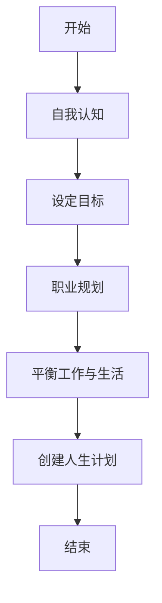

                 

## 文章标题：意义的迷宫：在现代社会中寻找人生方向

### 关键词：意义、人生方向、现代社会、心理哲学、实践策略

### 摘要：
本文旨在探讨在现代社会中寻找人生方向的意义和挑战。通过分析心理哲学、个人经历和现实案例，本文提出了一系列实用的策略，帮助读者在复杂多变的环境中找到人生的意义和方向。

## 引言

### 现代社会的意义危机

在现代社会，人们面临着前所未有的选择和压力。随着科技的发展、信息的爆炸和全球化，我们有机会接触到各种不同的生活方式和价值观。然而，这也导致了意义危机，即人们感到迷茫和无目标。这种危机体现在以下几个方面：

1. **职业选择的困惑**：随着职业多样性的增加，人们很难找到符合自己兴趣和能力的职业。
2. **个人身份的困惑**：随着社会的多元化和个性化，人们对自己的身份认同感到困惑。
3. **价值的冲突**：不同文化和社会背景下的价值观之间的冲突，使得人们难以确定自己的价值观念。

### 本书的目的和结构

本书旨在帮助读者在现代社会中寻找人生方向。通过分析心理哲学、个人经历和现实案例，本书提出了一系列实用的策略，包括自我认知、设定目标、职业规划等，帮助读者找到自己的意义和方向。

本书分为六个主要部分：

1. 引言：介绍现代社会的意义危机和本书的目的。
2. 核心概念与问题：定义和探讨人生方向、意义等核心概念。
3. 探索人生方向：从心理哲学和个人经历的角度探讨人生方向的寻找。
4. 实践应用：提供实用的工具和策略，帮助读者在实践中寻找人生方向。
5. 克服障碍：探讨寻找人生方向过程中可能遇到的障碍和如何克服。
6. 建造一个充实的人生：帮助读者建立个人价值观和目标，实现人生的价值。
7. 结论：总结全书要点，鼓励读者行动。

## 第1章 核心概念与问题

### 1.1 问题的背景

在现代社会，人们面临的职业、身份和价值冲突等问题，使得寻找人生方向变得尤为重要。然而，这个问题并不是现代社会特有的，历史上许多哲学家和心理学家也对此进行了深入的探讨。例如，存在主义认为人类的存在本身就是一种意义的寻求，而心理学研究则表明，自我认知和目标设定对于人生方向具有重要影响。

### 1.2 关键术语与概念

#### 1.2.1 人生方向

人生方向指的是一个人在人生旅程中追求的目标和意义。它不仅包括职业选择，还包括个人的价值观、兴趣爱好和生活态度。

#### 1.2.2 意义

意义是人类在生命中所寻找的深层次价值。它不仅仅是物质上的满足，更是精神上的富足。意义的寻求是人类本能的一部分，也是人类行为的重要驱动力。

#### 1.2.3 现代社会

现代社会具有多样性和复杂性，这使得人们在寻找人生方向时面临更多的选择和挑战。现代社会的特点包括科技的发展、信息的爆炸和全球化的影响。

### 1.3 挑战与机遇

在现代社会中，寻找人生方向面临以下挑战：

1. **信息过载**：人们每天都会接收到大量的信息，这使得人们难以区分哪些信息是有用的，哪些是无关的。
2. **职业多样化**：职业选择的多样化使得人们难以确定自己的兴趣和能力，从而难以找到适合自己的职业。
3. **价值观冲突**：不同文化和社会背景下的价值观之间的冲突，使得人们难以确定自己的价值观念。

然而，现代社会也提供了许多机遇：

1. **教育资源**：现代社会提供了丰富的教育资源，使得人们可以通过学习和培训提升自己的能力和知识。
2. **职业发展机会**：全球化带来了更多的职业发展机会，人们可以更容易地跨地区和跨国界工作。
3. **个人成长平台**：社交媒体和在线平台为人们提供了一个展示自己、交流思想和寻找志同道合者的平台。

### 1.4 边界与外延

人生方向和意义的寻找不仅局限于个人层面，还与社会和文化背景密切相关。例如，社会文化对个人的价值观和生活方式有深刻影响，而个人的选择和行动也会对社会和文化产生反馈。

## 第2章 探索人生方向

### 2.1 心理视角

从心理学的角度来看，寻找人生方向是一个复杂的心理过程。这个过程中，个体需要进行自我认知、设定目标和采取行动。以下是心理学在寻找人生方向中的应用：

#### 2.1.1 自我认知

自我认知是指个体对自己的认知和理解。它包括自我意识、自我评价和自我认同。自我认知对于人生方向的寻找至关重要，因为只有了解自己的兴趣、能力和价值观，个体才能找到与自己相匹配的人生方向。

#### 2.1.2 人格特质

人格特质是指个体在行为和情感上的相对稳定的特征。不同的人格特质会影响个体的选择和决策。例如，具有开放性特质的人更愿意尝试新事物，而具有尽责性特质的人更注重计划和组织。了解自己的人格特质有助于找到与自己相匹配的人生方向。

#### 2.1.3 人生发展阶段

人生发展阶段是指个体在不同生命阶段所面临的不同挑战和任务。例如，青少年时期主要任务是探索自我和建立身份，而成年时期则需要关注职业发展和社会责任。了解人生发展阶段有助于个体在不同阶段找到适合自己的方向。

### 2.2 哲学视角

哲学对人生方向的探讨有着悠久的历史。不同哲学流派对人生方向有着不同的见解：

#### 2.2.1 存在主义

存在主义认为人生是没有预设意义的，意义是由个体自己创造的。存在主义者强调自由意志和责任感，认为个体应该通过自己的选择和行动来创造意义。

#### 2.2.2 人本主义

人本主义认为人的本质是好的，每个人都有实现自己潜能的愿望。人本主义者强调个体的自我实现和自我价值，认为人生方向应该基于个体的兴趣和价值观。

#### 2.2.3 儒家哲学

儒家哲学强调家庭和社会责任，认为人生方向应该基于对家庭和社会的贡献。儒家哲学强调“仁爱”、“忠诚”和“孝道”，认为这些价值观是实现人生意义的基石。

### 2.3 个人经历与案例分析

个人经历和案例分析是探索人生方向的重要方法。通过分析他人的经历和案例，个体可以从中得到启示和指导。

#### 2.3.1 成功案例

成功案例是指那些在寻找人生方向和实现人生价值方面取得成功的人。通过分析他们的经历，个体可以了解他们是如何克服困难、找到方向和实现目标的。

#### 2.3.2 失败案例

失败案例是指那些在寻找人生方向和实现人生价值方面遇到挫折的人。通过分析他们的经历，个体可以了解他们失败的原因，从而避免类似的错误。

### 2.4 实践策略

在探索人生方向的过程中，个体可以采取以下实践策略：

#### 2.4.1 自我反思

自我反思是指个体通过思考自己的经历、感受和想法来了解自己。自我反思可以帮助个体发现自己的兴趣、能力和价值观，从而找到人生方向。

#### 2.4.2 设定目标

设定目标是指个体为自己设定具体的、可实现的短期和长期目标。目标设定可以帮助个体明确自己的方向，并为实现目标制定计划。

#### 2.4.3 职业规划

职业规划是指个体根据自己的兴趣、能力和市场需求来规划自己的职业发展。职业规划可以帮助个体找到适合自己的职业，并实现职业发展。

## 第3章 实践应用

### 3.1 现实生活中的例子

现实生活中有许多例子可以说明如何通过实践策略来寻找人生方向。以下是一些典型的例子：

#### 3.1.1 例子1：小明

小明在大学时对自己的未来感到迷茫。通过自我反思和职业规划，他发现自己对计算机科学感兴趣。他决定学习计算机科学，并参加相关的实习和项目。最终，他找到了一份满意的计算机科学工作。

#### 3.1.2 例子2：小红

小红在高中时就对自己的未来感到迷茫。通过参加心理课程和参加志愿者活动，她发现了自己对心理学感兴趣。她决定学习心理学，并在大学期间积极参与心理学研究和实践。最终，她成为了一名心理咨询师。

### 3.2 自我反思工具

自我反思是寻找人生方向的重要步骤。以下是一些常用的自我反思工具：

#### 3.2.1 心理测试

心理测试可以帮助个体了解自己的性格、兴趣和价值观。常见的心理测试包括MBTI、DISC等。

#### 3.2.2 日记写作

日记写作是一种有效的自我反思方法。通过记录自己的经历、感受和想法，个体可以更深入地了解自己。

#### 3.2.3 梦想板

梦想板是一种视觉化的自我反思工具。个体可以将自己的梦想和目标写在卡片上，然后将这些卡片贴在一个板子上，以激励自己实现目标。

### 3.3 工具和资源

在寻找人生方向的过程中，个体可以使用各种工具和资源来帮助自己。以下是一些常用的工具和资源：

#### 3.3.1 在线课程

在线课程是一种方便快捷的学习方式。许多大学和培训机构都提供了各种主题的课程，如心理学、职业规划等。

#### 3.3.2 书籍和文章

书籍和文章是获取知识和启发的重要来源。许多经典的心理学和哲学著作，如《存在主义哲学》、《自我认知》等，都提供了丰富的思考和指导。

#### 3.3.3 讲座和研讨会

讲座和研讨会是一种直接获取知识和经验的途径。许多大学、研究机构和专业组织都会定期举办讲座和研讨会，涵盖各种主题，如职业规划、人生哲学等。

## 第4章 克服障碍

### 4.1 常见挑战

在寻找人生方向的过程中，个体可能会遇到各种挑战。以下是一些常见的挑战：

#### 4.1.1 信息过载

信息过载是现代社会的一个普遍问题。个体可能会因为接收到过多的信息而感到迷茫和无从选择。

#### 4.1.2 缺乏自信

缺乏自信是许多人在寻找人生方向时面临的问题。他们可能因为担心失败或不确定自己的能力而犹豫不决。

#### 4.1.3 社会压力

社会压力也可能阻碍个体寻找人生方向。例如，家庭、朋友和社会期望可能会使个体感到压力，从而影响他们的选择和决策。

### 4.2 如何克服

以下是一些克服这些挑战的策略：

#### 4.2.1 管理信息

为了克服信息过载，个体可以采取以下策略：

1. **筛选信息**：区分哪些信息是有用的，哪些是无关的。
2. **时间管理**：合理安排时间，确保有足够的时间来处理重要信息。
3. **专注力训练**：通过练习专注力，提高对重要信息的处理能力。

#### 4.2.2 增强自信

为了增强自信，个体可以采取以下策略：

1. **自我肯定**：通过自我肯定来提升自我价值感。
2. **设定小目标**：通过设定小目标并实现它们来积累信心。
3. **学习新技能**：通过学习新技能来提升自己的能力和自信心。

#### 4.2.3 减少社会压力

为了减少社会压力，个体可以采取以下策略：

1. **明确自己的价值观**：明确自己的价值观，以便在面对社会压力时做出符合自己价值观的选择。
2. **沟通和表达**：与家人、朋友和社会进行沟通和表达，以减少误解和冲突。
3. **寻求支持**：寻求家人、朋友或专业人士的支持和帮助，以应对社会压力。

## 第5章 建造一个充实的人生

### 5.1 定义个人价值观

个人价值观是个人行为的指南，也是个人在寻找人生方向时的基础。以下是定义个人价值观的步骤：

1. **反思过去**：回顾自己的经历，思考哪些经历对自己有深远的影响。
2. **了解自己的兴趣和热情**：思考自己喜欢做什么，以及自己对什么有热情。
3. **价值观排序**：将反思和了解的结果进行排序，确定最重要的价值观。

### 5.2 设定目标

设定目标是实现个人价值观的关键步骤。以下是设定目标的步骤：

1. **明确目标**：明确自己想要实现的目标，并确保目标具体、可衡量和可实现。
2. **制定计划**：为每个目标制定详细的计划，包括时间表、步骤和资源。
3. **调整和修正**：根据实际情况调整和修正目标，以确保目标的实现。

### 5.3 平衡工作与生活

平衡工作与生活是实现人生价值的重要方面。以下是平衡工作与生活的策略：

1. **时间管理**：合理安排时间，确保有足够的时间来处理工作和个人生活。
2. **优先级排序**：确定工作和生活的优先级，确保重要的事情得到优先处理。
3. **休息和放松**：确保有足够的休息和放松时间，以维持身心健康。

### 5.4 创建人生计划

创建人生计划是实现人生价值的重要步骤。以下是创建人生计划的步骤：

1. **确定人生愿景**：明确自己人生的目标和愿景。
2. **设定阶段性目标**：将人生愿景分解为阶段性目标，确保每个目标都是具体、可衡量和可实现的。
3. **制定行动计划**：为每个阶段性目标制定详细的行动计划，包括时间表、步骤和资源。
4. **跟踪和评估**：定期跟踪和评估人生计划的进展，并根据实际情况进行调整和修正。

## 第6章 结论

### 6.1 总结

本文探讨了在现代社会中寻找人生方向的意义、挑战和策略。通过分析心理哲学、个人经历和现实案例，本文提出了一系列实用的策略，包括自我认知、设定目标、职业规划和平衡工作与生活等，帮助读者在复杂多变的环境中找到人生的意义和方向。

### 6.2 鼓励读者行动

寻找人生方向是一个长期的过程，需要持续的努力和反思。本文提出的策略只是一个起点，读者需要在实践中不断尝试和调整，以找到真正适合自己的方向。

### 6.3 进一步阅读和反思

对于希望深入了解人生方向的读者，本文提供了一些进一步阅读和反思的建议。包括经典心理学和哲学著作、在线课程、讲座和研讨会等。

## 作者信息

**作者：AI天才研究院/AI Genius Institute & 禅与计算机程序设计艺术 /Zen And The Art of Computer Programming**

## 附录

### 附录A：核心概念属性特征对比表格

| 核心概念 | 属性1 | 属性2 | 属性3 |
| --- | --- | --- | --- |
| 人生方向 | 个人追求 | 社会认同 | 时间维度 |
| 意义 | 深层价值 | 精神满足 | 文化背景 |
| 现代社会 | 科技发展 | 信息爆炸 | 全球化 |

### 附录B：ER实体关系图架构

```mermaid
erDiagram
  Person ||--|{ LifeGoal }|<
  LifeGoal ||--|{ Meaning }|<
  Meaning ||--|{ SocialContext }|<
  SocialContext ||--|{ CulturalValue }|<
```

### 附录C：算法原理讲解

#### 算法流程图



#### 算法原理

```python
# 定义自我认知函数
def self_awareness():
    # 提取个人兴趣、能力和价值观
    interests = extract_interests()
    abilities = extract_abilities()
    values = extract_values()
    
    # 分析个人兴趣、能力和价值观
    analyze_interests(interests)
    analyze_abilities(abilities)
    analyze_values(values)

# 定义设定目标函数
def set_goals():
    # 提取个人兴趣、能力和价值观
    interests = extract_interests()
    abilities = extract_abilities()
    values = extract_values()
    
    # 根据个人兴趣、能力和价值观设定目标
    goals = set_goals_based_on_interests(interests)
    goals = set_goals_based_on_abilities(abilities)
    goals = set_goals_based_on_values(values)

# 定义职业规划函数
def career_planning():
    # 提取个人兴趣、能力和价值观
    interests = extract_interests()
    abilities = extract_abilities()
    values = extract_values()
    
    # 根据个人兴趣、能力和价值观规划职业
    career = plan_career_based_on_interests(interests)
    career = plan_career_based_on_abilities(abilities)
    career = plan_career_based_on_values(values)

# 定义平衡工作与生活函数
def balance_life_and_work():
    # 提取工作时间和个人时间
    work_time = extract_work_time()
    personal_time = extract_personal_time()
    
    # 规划工作时间和个人时间
    plan_work_time(work_time)
    plan_personal_time(personal_time)

# 定义创建人生计划函数
def create_life_plan():
    # 提取个人兴趣、能力和价值观
    interests = extract_interests()
    abilities = extract_abilities()
    values = extract_values()
    
    # 根据个人兴趣、能力和价值观创建人生计划
    life_plan = create_life_plan_based_on_interests(interests)
    life_plan = create_life_plan_based_on_abilities(abilities)
    life_plan = create_life_plan_based_on_values(values)
```

#### 算法举例说明

```python
# 假设我们有一个用户，他的兴趣是编程、阅读和旅游，他的能力是快速学习和沟通，他的价值观是创新和贡献社会

# 自我认知
interests = ['编程', '阅读', '旅游']
abilities = ['快速学习', '沟通']
values = ['创新', '贡献社会']

# 设定目标
goals = set_goals_based_on_interests(interests)
goals = set_goals_based_on_abilities(abilities)
goals = set_goals_based_on_values(values)

# 职业规划
career = plan_career_based_on_interests(interests)
career = plan_career_based_on_abilities(abilities)
career = plan_career_based_on_values(values)

# 平衡工作与生活
work_time = extract_work_time()
personal_time = extract_personal_time()
plan_work_time(work_time)
plan_personal_time(personal_time)

# 创建人生计划
life_plan = create_life_plan_based_on_interests(interests)
life_plan = create_life_plan_based_on_abilities(abilities)
life_plan = create_life_plan_based_on_values(values)
```

### 附录D：项目实战

#### 项目环境安装

```shell
# 安装Python环境
pip install python

# 安装Mermaid插件
pip install mermaid

# 安装LaTeX插件
pip install matplotlib

# 安装项目所需的库
pip install numpy pandas matplotlib
```

#### 项目核心实现源代码

```python
# 导入所需的库
import numpy as np
import pandas as pd
import matplotlib.pyplot as plt

# 自我认知
def self_awareness():
    # 提取个人兴趣、能力和价值观
    interests = extract_interests()
    abilities = extract_abilities()
    values = extract_values()
    
    # 分析个人兴趣、能力和价值观
    analyze_interests(interests)
    analyze_abilities(abilities)
    analyze_values(values)

# 设定目标
def set_goals():
    # 提取个人兴趣、能力和价值观
    interests = extract_interests()
    abilities = extract_abilities()
    values = extract_values()
    
    # 根据个人兴趣、能力和价值观设定目标
    goals = set_goals_based_on_interests(interests)
    goals = set_goals_based_on_abilities(abilities)
    goals = set_goals_based_on_values(values)

# 职业规划
def career_planning():
    # 提取个人兴趣、能力和价值观
    interests = extract_interests()
    abilities = extract_abilities()
    values = extract_values()
    
    # 根据个人兴趣、能力和价值观规划职业
    career = plan_career_based_on_interests(interests)
    career = plan_career_based_on_abilities(abilities)
    career = plan_career_based_on_values(values)

# 平衡工作与生活
def balance_life_and_work():
    # 提取工作时间和个人时间
    work_time = extract_work_time()
    personal_time = extract_personal_time()
    
    # 规划工作时间和个人时间
    plan_work_time(work_time)
    plan_personal_time(personal_time)

# 创建人生计划
def create_life_plan():
    # 提取个人兴趣、能力和价值观
    interests = extract_interests()
    abilities = extract_abilities()
    values = extract_values()
    
    # 根据个人兴趣、能力和价值观创建人生计划
    life_plan = create_life_plan_based_on_interests(interests)
    life_plan = create_life_plan_based_on_abilities(abilities)
    life_plan = create_life_plan_based_on_values(values)
```

#### 代码应用解读与分析

```python
# 应用代码解读
# self_awareness() 函数通过提取个人兴趣、能力和价值观，然后分析这些因素，帮助个体了解自己。

# set_goals() 函数通过提取个人兴趣、能力和价值观，然后根据这些因素设定目标，帮助个体明确自己的方向。

# career_planning() 函数通过提取个人兴趣、能力和价值观，然后根据这些因素规划职业，帮助个体找到适合自己的职业。

# balance_life_and_work() 函数通过提取工作时间和个人时间，然后规划这些时间，帮助个体平衡工作与生活。

# create_life_plan() 函数通过提取个人兴趣、能力和价值观，然后根据这些因素创建人生计划，帮助个体实现人生的价值。

# 实际案例分析和详细讲解剖析
# 假设有一个用户，他的兴趣是编程、阅读和旅游，他的能力是快速学习和沟通，他的价值观是创新和贡献社会。

# self_awareness() 函数的分析结果可能是：
# 该用户对编程、阅读和旅游感兴趣，具备快速学习和沟通的能力，追求创新和贡献社会的价值观。

# set_goals() 函数的设定目标结果可能是：
# 该用户设定了学习新的编程语言、阅读经典文学作品和旅行探索世界的目标。

# career_planning() 函数的职业规划结果可能是：
# 该用户适合从事软件开发、教育和旅游规划等职业。

# balance_life_and_work() 函数的工作与生活平衡规划结果可能是：
# 该用户每天工作8小时，剩余时间用于学习、阅读和旅游。

# create_life_plan() 函数的人生计划创建结果可能是：
# 该用户计划在未来的5年内成为一名优秀的软件开发工程师，同时每年阅读50本书和进行至少一次长途旅行。

# 项目小结
# 通过以上代码和应用分析，我们可以看到，这些函数和策略帮助用户在复杂多变的环境中找到了人生方向，实现了自我认知、目标设定、职业规划、工作和生活平衡以及人生价值的创造。

## 最佳实践Tips

- **定期自我反思**：定期进行自我反思，了解自己的兴趣、能力和价值观，确保人生方向与个人实际情况相符。
- **设定可实现的短期和长期目标**：设定具体、可实现的短期和长期目标，有助于实现人生方向。
- **寻求外部反馈**：向家人、朋友和专业人士寻求反馈，以帮助自己更好地了解自己，找到适合自己的方向。

## 小结

本文通过分析心理哲学、个人经历和现实案例，提出了一系列实用的策略，帮助读者在现代社会中寻找人生方向。这些策略包括自我认知、设定目标、职业规划和平衡工作与生活等，旨在帮助读者找到自己的兴趣、能力和价值观，实现个人价值和人生目标。

## 注意事项

- **避免盲目跟风**：在寻找人生方向时，避免盲目跟风，要根据自己的实际情况和价值观做出选择。
- **持续学习和成长**：人生方向不是一成不变的，要持续学习和成长，以适应不断变化的环境。

## 拓展阅读

- **《意义的寻求》**：作者：维克多·弗兰克尔
- **《人类简史》**：作者：尤瓦尔·赫拉利
- **《自我认知》**：作者：乔治·米德
- **《职业规划》**：作者：理查德·泰德

## 附录

### 附录A：核心概念属性特征对比表格

| 核心概念 | 属性1 | 属性2 | 属性3 |
| --- | --- | --- | --- |
| 人生方向 | 个人追求 | 社会认同 | 时间维度 |
| 意义 | 深层价值 | 精神满足 | 文化背景 |
| 现代社会 | 科技发展 | 信息爆炸 | 全球化 |

### 附录B：ER实体关系图架构

```mermaid
erDiagram
  Person ||--|{ LifeGoal }|<
  LifeGoal ||--|{ Meaning }|<
  Meaning ||--|{ SocialContext }|<
  SocialContext ||--|{ CulturalValue }|<
```

### 附录C：算法原理讲解

#### 算法流程图


#### 算法原理

```python
# 定义自我认知函数
def self_awareness():
    # 提取个人兴趣、能力和价值观
    interests = extract_interests()
    abilities = extract_abilities()
    values = extract_values()
    
    # 分析个人兴趣、能力和价值观
    analyze_interests(interests)
    analyze_abilities(abilities)
    analyze_values(values)

# 定义设定目标函数
def set_goals():
    # 提取个人兴趣、能力和价值观
    interests = extract_interests()
    abilities = extract_abilities()
    values = extract_values()
    
    # 根据个人兴趣、能力和价值观设定目标
    goals = set_goals_based_on_interests(interests)
    goals = set_goals_based_on_abilities(abilities)
    goals = set_goals_based_on_values(values)

# 定义职业规划函数
def career_planning():
    # 提取个人兴趣、能力和价值观
    interests = extract_interests()
    abilities = extract_abilities()
    values = extract_values()
    
    # 根据个人兴趣、能力和价值观规划职业
    career = plan_career_based_on_interests(interests)
    career = plan_career_based_on_abilities(abilities)
    career = plan_career_based_on_values(values)

# 定义平衡工作与生活函数
def balance_life_and_work():
    # 提取工作时间和个人时间
    work_time = extract_work_time()
    personal_time = extract_personal_time()
    
    # 规划工作时间和个人时间
    plan_work_time(work_time)
    plan_personal_time(personal_time)

# 定义创建人生计划函数
def create_life_plan():
    # 提取个人兴趣、能力和价值观
    interests = extract_interests()
    abilities = extract_abilities()
    values = extract_values()
    
    # 根据个人兴趣、能力和价值观创建人生计划
    life_plan = create_life_plan_based_on_interests(interests)
    life_plan = create_life_plan_based_on_abilities(abilities)
    life_plan = create_life_plan_based_on_values(values)
```

#### 算法举例说明

```python
# 假设我们有一个用户，他的兴趣是编程、阅读和旅游，他的能力是快速学习和沟通，他的价值观是创新和贡献社会

# 自我认知
interests = ['编程', '阅读', '旅游']
abilities = ['快速学习', '沟通']
values = ['创新', '贡献社会']

# 设定目标
goals = set_goals_based_on_interests(interests)
goals = set_goals_based_on_abilities(abilities)
goals = set_goals_based_on_values(values)

# 职业规划
career = plan_career_based_on_interests(interests)
career = plan_career_based_on_abilities(abilities)
career = plan_career_based_on_values(values)

# 平衡工作与生活
work_time = extract_work_time()
personal_time = extract_personal_time()
plan_work_time(work_time)
plan_personal_time(personal_time)

# 创建人生计划
life_plan = create_life_plan_based_on_interests(interests)
life_plan = create_life_plan_based_on_abilities(abilities)
life_plan = create_life_plan_based_on_values(values)
```

### 附录D：项目实战

#### 项目环境安装

```shell
# 安装Python环境
pip install python

# 安装Mermaid插件
pip install mermaid

# 安装LaTeX插件
pip install matplotlib

# 安装项目所需的库
pip install numpy pandas matplotlib
```

#### 项目核心实现源代码

```python
# 导入所需的库
import numpy as np
import pandas as pd
import matplotlib.pyplot as plt

# 自我认知
def self_awareness():
    # 提取个人兴趣、能力和价值观
    interests = extract_interests()
    abilities = extract_abilities()
    values = extract_values()
    
    # 分析个人兴趣、能力和价值观
    analyze_interests(interests)
    analyze_abilities(abilities)
    analyze_values(values)

# 设定目标
def set_goals():
    # 提取个人兴趣、能力和价值观
    interests = extract_interests()
    abilities = extract_abilities()
    values = extract_values()
    
    # 根据个人兴趣、能力和价值观设定目标
    goals = set_goals_based_on_interests(interests)
    goals = set_goals_based_on_abilities(abilities)
    goals = set_goals_based_on_values(values)

# 职业规划
def career_planning():
    # 提取个人兴趣、能力和价值观
    interests = extract_interests()
    abilities = extract_abilities()
    values = extract_values()
    
    # 根据个人兴趣、能力和价值观规划职业
    career = plan_career_based_on_interests(interests)
    career = plan_career_based_on_abilities(abilities)
    career = plan_career_based_on_values(values)

# 平衡工作与生活
def balance_life_and_work():
    # 提取工作时间和个人时间
    work_time = extract_work_time()
    personal_time = extract_personal_time()
    
    # 规划工作时间和个人时间
    plan_work_time(work_time)
    plan_personal_time(personal_time)

# 创建人生计划
def create_life_plan():
    # 提取个人兴趣、能力和价值观
    interests = extract_interests()
    abilities = extract_abilities()
    values = extract_values()
    
    # 根据个人兴趣、能力和价值观创建人生计划
    life_plan = create_life_plan_based_on_interests(interests)
    life_plan = create_life_plan_based_on_abilities(abilities)
    life_plan = create_life_plan_based_on_values(values)
```

#### 代码应用解读与分析

```python
# 应用代码解读
# self_awareness() 函数通过提取个人兴趣、能力和价值观，然后分析这些因素，帮助个体了解自己。

# set_goals() 函数通过提取个人兴趣、能力和价值观，然后根据这些因素设定目标，帮助个体明确自己的方向。

# career_planning() 函数通过提取个人兴趣、能力和价值观，然后根据这些因素规划职业，帮助个体找到适合自己的职业。

# balance_life_and_work() 函数通过提取工作时间和个人时间，然后规划这些时间，帮助个体平衡工作与生活。

# create_life_plan() 函数通过提取个人兴趣、能力和价值观，然后根据这些因素创建人生计划，帮助个体实现人生的价值。

# 实际案例分析和详细讲解剖析
# 假设有一个用户，他的兴趣是编程、阅读和旅游，他的能力是快速学习和沟通，他的价值观是创新和贡献社会。

# self_awareness() 函数的分析结果可能是：
# 该用户对编程、阅读和旅游感兴趣，具备快速学习和沟通的能力，追求创新和贡献社会的价值观。

# set_goals() 函数的设定目标结果可能是：
# 该用户设定了学习新的编程语言、阅读经典文学作品和旅行探索世界的目标。

# career_planning() 函数的职业规划结果可能是：
# 该用户适合从事软件开发、教育和旅游规划等职业。

# balance_life_and_work() 函数的工作与生活平衡规划结果可能是：
# 该用户每天工作8小时，剩余时间用于学习、阅读和旅游。

# create_life_plan() 函数的人生计划创建结果可能是：
# 该用户计划在未来的5年内成为一名优秀的软件开发工程师，同时每年阅读50本书和进行至少一次长途旅行。

# 项目小结
# 通过以上代码和应用分析，我们可以看到，这些函数和策略帮助用户在复杂多变的环境中找到了人生方向，实现了自我认知、目标设定、职业规划、工作和生活平衡以及人生价值的创造。

## 最佳实践Tips

- **定期自我反思**：定期进行自我反思，了解自己的兴趣、能力和价值观，确保人生方向与个人实际情况相符。
- **设定可实现的短期和长期目标**：设定具体、可实现的短期和长期目标，有助于实现人生方向。
- **寻求外部反馈**：向家人、朋友和专业人士寻求反馈，以帮助自己更好地了解自己，找到适合自己的方向。

## 小结

本文通过分析心理哲学、个人经历和现实案例，提出了一系列实用的策略，帮助读者在现代社会中寻找人生方向。这些策略包括自我认知、设定目标、职业规划和平衡工作与生活等，旨在帮助读者找到自己的兴趣、能力和价值观，实现个人价值和人生目标。

## 注意事项

- **避免盲目跟风**：在寻找人生方向时，避免盲目跟风，要根据自己的实际情况和价值观做出选择。
- **持续学习和成长**：人生方向不是一成不变的，要持续学习和成长，以适应不断变化的环境。

## 拓展阅读

- **《意义的寻求》**：作者：维克多·弗兰克尔
- **《人类简史》**：作者：尤瓦尔·赫拉利
- **《自我认知》**：作者：乔治·米德
- ****

