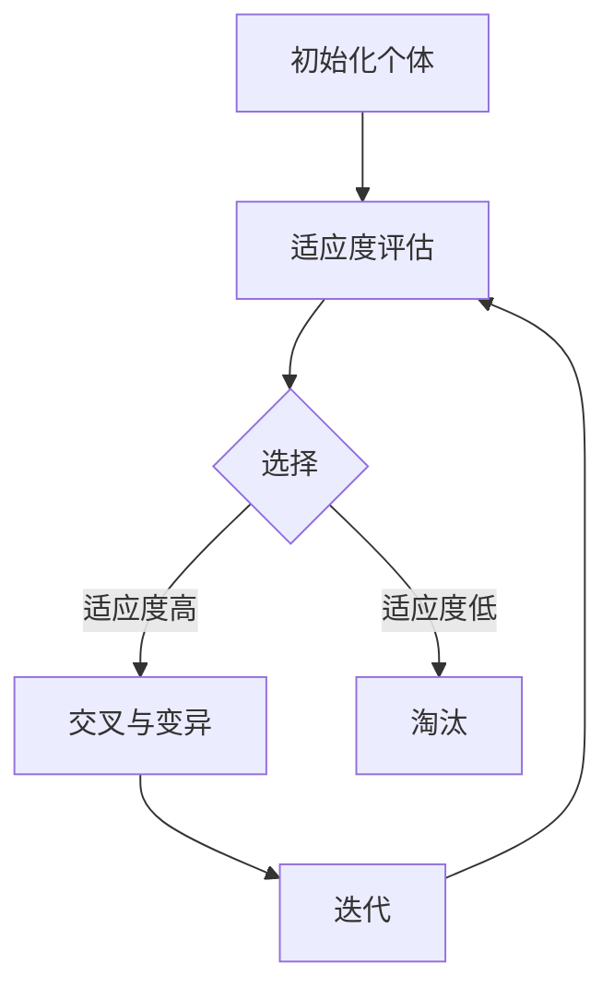

                 

# 持续学习：AI自我进化的新范式

## 关键词：
- 持续学习
- AI自我进化
- 算法原理
- 数学模型
- 技术实践
- 案例分析
- 未来展望

## 摘要：
本文深入探讨了持续学习在人工智能（AI）领域的重要性和AI自我进化的新范式。首先，我们介绍了持续学习和AI自我进化的背景和核心概念，随后详细分析了AI自我进化的算法原理和数学模型。接着，通过技术实践和案例分析，我们展示了AI自我进化的实际应用和效果。最后，我们对AI自我进化的未来趋势进行了展望，并提出了面临的挑战和应对策略。

## 第一部分：引言

### 1.1 背景介绍

#### 1.1.1 持续学习的重要性

持续学习是一种重要的学习理念，它强调在不断变化的环境中，通过持续地学习和适应，不断提升自身的能力和素质。在人工智能（AI）领域，持续学习尤为重要。因为AI系统需要在不断变化的现实环境中进行学习和适应，才能持续地提高性能和解决复杂问题。

#### 1.1.2 AI自我进化的定义

AI自我进化是指通过自我学习和自我调整，使AI系统能够在不依赖外部干预的情况下，自主地优化和提升自身性能。这包括算法的改进、知识的积累和结构的优化等方面。

#### 1.1.3 书籍结构概述

本书分为五个部分，首先介绍持续学习和AI自我进化的背景和核心概念，然后详细分析AI自我进化的算法原理和数学模型，接着通过技术实践和案例分析，展示AI自我进化的实际应用和效果，最后对AI自我进化的未来趋势进行展望。

### 1.2 问题与挑战

#### 1.2.1 传统学习的局限

传统学习方式依赖于预定义的规则和固定的数据集，无法适应复杂和动态的环境。这使得AI系统在面对未知和变化时，往往表现不佳。

#### 1.2.2 AI自我进化的必要性

为了解决传统学习的局限，AI自我进化应运而生。通过自我学习和自我调整，AI系统可以更好地适应复杂和动态的环境，提高解决问题的能力。

#### 1.2.3 探索AI自我进化的新范式

本文旨在探索AI自我进化的新范式，包括新的算法原理、技术实践和未来展望，以期为AI领域的研究和应用提供新的思路和方向。

### 1.3 目标与期望

#### 1.3.1 读者对象

本书适用于对AI领域感兴趣的读者，包括AI从业者、研究人员、学生和爱好者。

#### 1.3.2 学习目标

通过本书的学习，读者应掌握AI自我进化的核心概念、算法原理和实际应用，具备进行AI自我进化研究和开发的能力。

#### 1.3.3 期望收获

读者希望通过本书的学习，能够深入了解AI自我进化的新范式，为AI领域的发展做出贡献。

## 第二部分：AI自我进化的理论基础

### 2.1 AI自我进化的核心概念

#### 2.1.1 自我进化的定义

自我进化是指个体通过自我学习和自我调整，不断优化自身能力和适应环境的过程。

#### 2.1.2 持续学习的机制

持续学习是指通过不断获取新的知识和技能，保持自身的能力和竞争力。

#### 2.1.3 AI自我进化的价值

AI自我进化能够提高AI系统的适应能力和智能水平，使其更好地应对复杂和动态的环境。

### 2.2 自我进化的算法原理

#### 2.2.1 算法概述

自我进化算法是一种基于生物进化理论的计算模型，通过模拟自然进化过程，实现个体适应环境的能力。

#### 2.2.2 算法原理讲解

自我进化算法主要包括以下几个步骤：

1. **初始化个体**：生成一系列初始个体，每个个体代表一种可能的解决方案。
2. **适应度评估**：对每个个体进行适应度评估，评估其解决问题的能力。
3. **选择**：根据适应度评估结果，选择适应度较高的个体进行繁殖。
4. **交叉与变异**：通过交叉和变异操作，产生新的个体。
5. **迭代**：重复以上步骤，直到满足停止条件。

#### 2.2.3 Mermaid流程图展示



#### 2.2.4 Python源代码解读

```python
import random

# 初始化个体
def initialize_population(size):
    population = []
    for _ in range(size):
        individual = [random.choice([0, 1]) for _ in range(10)]
        population.append(individual)
    return population

# 适应度评估
def fitness_evaluation(individual):
    return sum(individual)

# 选择
def selection(population, fitnesses):
    selected_indices = random.choices(range(len(population)), weights=fitnesses, k=2)
    return population[selected_indices]

# 交叉
def crossover(parent1, parent2):
    crossover_point = random.randint(1, len(parent1) - 1)
    child1 = parent1[:crossover_point] + parent2[crossover_point:]
    child2 = parent2[:crossover_point] + parent1[crossover_point:]
    return child1, child2

# 变异
def mutation(individual):
    mutation_point = random.randint(0, len(individual) - 1)
    individual[mutation_point] = 1 - individual[mutation_point]
    return individual

# 迭代
def evolve_population(population, fitnesses):
    new_population = []
    for _ in range(len(population)):
        parent1, parent2 = selection(population, fitnesses)
        child1, child2 = crossover(parent1, parent2)
        new_population.append(mutation(child1))
        new_population.append(mutation(child2))
    return new_population

# 主函数
def main():
    population_size = 100
    population = initialize_population(population_size)
    fitnesses = [fitness_evaluation(individual) for individual in population]
    for _ in range(100):
        population = evolve_population(population, fitnesses)
        fitnesses = [fitness_evaluation(individual) for individual in population]
    print(f"Final population: {population}")

if __name__ == "__main__":
    main()
```

### 2.3 数学模型与公式

#### 2.3.1 数学模型概述

自我进化算法的数学模型主要包括适应度函数、选择策略、交叉和变异策略等。

#### 2.3.2 数学公式解释

1. **适应度函数**：\( f(x) = \sum_{i=1}^{n} w_i x_i \)

   其中，\( x \) 为个体编码，\( w_i \) 为权重，\( f(x) \) 为个体适应度。

2. **选择策略**：选择概率 \( p_i = \frac{f(x_i)}{\sum_{j=1}^{n} f(x_j)} \)

   其中，\( x_i \) 为个体编码，\( f(x_i) \) 为个体适应度，\( p_i \) 为个体被选择的概率。

3. **交叉策略**：交叉概率 \( p_c = \frac{1}{2} \)

   其中，\( p_c \) 为交叉概率。

4. **变异策略**：变异概率 \( p_m = \frac{1}{n} \)

   其中，\( p_m \) 为变异概率，\( n \) 为个体编码长度。

#### 2.3.3 举例说明

假设我们有10个个体，适应度分别为 \( f(x_1) = 10, f(x_2) = 8, f(x_3) = 9, ..., f(x_{10}) = 5 \)。根据适应度函数和选择策略，我们可以计算出每个个体的选择概率：

\[ p_1 = \frac{f(x_1)}{\sum_{j=1}^{10} f(x_j)} = \frac{10}{10+8+9+...+5} = 0.267 \]

\[ p_2 = \frac{f(x_2)}{\sum_{j=1}^{10} f(x_j)} = \frac{8}{10+8+9+...+5} = 0.211 \]

\[ p_3 = \frac{f(x_3)}{\sum_{j=1}^{10} f(x_j)} = \frac{9}{10+8+9+...+5} = 0.238 \]

...

根据这些选择概率，我们可以计算出每个个体被选择的次数，从而进行交叉和变异操作。

### 2.4 自我进化的特性与挑战

#### 2.4.1 自我进化的特性

自我进化的特性包括：

1. **自适应**：个体能够根据环境变化调整自身行为。
2. **自优化**：通过不断学习和适应，个体能够提高自身适应度和性能。
3. **自组织**：个体之间通过交互和合作，形成复杂的适应性和智能行为。

#### 2.4.2 面临的挑战

自我进化面临的挑战包括：

1. **搜索空间大**：个体需要遍历大量的搜索空间，找到最优解。
2. **稳定性问题**：个体在进化过程中可能失去稳定性，导致性能下降。
3. **计算复杂度高**：自我进化算法通常涉及大量的计算，对计算资源有较高要求。

#### 2.4.3 解决方案探讨

为了解决自我进化面临的挑战，可以采用以下解决方案：

1. **多目标优化**：通过多目标优化方法，同时考虑多个目标，提高个体适应度和性能。
2. **动态调整**：根据进化过程的变化，动态调整参数和策略，提高个体稳定性。
3. **计算优化**：采用并行计算、分布式计算等方法，降低计算复杂度和资源消耗。

### 2.5 本章小结

本章节介绍了AI自我进化的核心概念、算法原理和数学模型，并通过Python源代码进行了详细解读。本章内容为后续章节的技术实践和案例分析奠定了基础。

## 第三部分：AI自我进化的技术实践

### 3.1 技术环境搭建

#### 3.1.1 硬件环境要求

1. **CPU**：Intel Core i5或以上
2. **内存**：8GB或以上
3. **硬盘**：256GB SSD或以上

#### 3.1.2 软件环境安装

1. **操作系统**：Windows 10、Linux或macOS
2. **Python**：3.8或以上版本
3. **pip**：Python的包管理器

#### 3.1.3 开发工具配置

1. **PyCharm**：集成开发环境（IDE）
2. **Jupyter Notebook**：交互式开发环境

### 3.2 自我进化算法实现

#### 3.2.1 算法实现步骤

1. **初始化个体**：生成一系列初始个体。
2. **适应度评估**：对每个个体进行适应度评估。
3. **选择**：根据适应度评估结果，选择适应度较高的个体进行繁殖。
4. **交叉与变异**：通过交叉和变异操作，产生新的个体。
5. **迭代**：重复以上步骤，直到满足停止条件。

#### 3.2.2 Python源代码

```python
import random

# 初始化个体
def initialize_population(size):
    population = []
    for _ in range(size):
        individual = [random.choice([0, 1]) for _ in range(10)]
        population.append(individual)
    return population

# 适应度评估
def fitness_evaluation(individual):
    return sum(individual)

# 选择
def selection(population, fitnesses):
    selected_indices = random.choices(range(len(population)), weights=fitnesses, k=2)
    return population[selected_indices]

# 交叉
def crossover(parent1, parent2):
    crossover_point = random.randint(1, len(parent1) - 1)
    child1 = parent1[:crossover_point] + parent2[crossover_point:]
    child2 = parent2[:crossover_point] + parent1[crossover_point:]
    return child1, child2

# 变异
def mutation(individual):
    mutation_point = random.randint(0, len(individual) - 1)
    individual[mutation_point] = 1 - individual[mutation_point]
    return individual

# 迭代
def evolve_population(population, fitnesses):
    new_population = []
    for _ in range(len(population)):
        parent1, parent2 = selection(population, fitnesses)
        child1, child2 = crossover(parent1, parent2)
        new_population.append(mutation(child1))
        new_population.append(mutation(child2))
    return new_population

# 主函数
def main():
    population_size = 100
    population = initialize_population(population_size)
    fitnesses = [fitness_evaluation(individual) for individual in population]
    for _ in range(100):
        population = evolve_population(population, fitnesses)
        fitnesses = [fitness_evaluation(individual) for individual in population]
    print(f"Final population: {population}")

if __name__ == "__main__":
    main()
```

#### 3.2.3 代码解读与分析

1. **初始化个体**：使用随机数生成一系列初始个体，每个个体由10个基因组成。
2. **适应度评估**：计算每个个体的适应度，即个体基因中1的数量。
3. **选择**：根据适应度评估结果，使用轮盘赌选择策略选择两个父代个体。
4. **交叉**：在两个父代个体之间进行交叉操作，产生两个新的子代个体。
5. **变异**：对子代个体进行变异操作，以增加种群的多样性。
6. **迭代**：重复上述步骤，直到达到迭代次数或满足停止条件。

### 3.3 实际案例剖析

#### 3.3.1 案例选择与介绍

本案例选取了基于自我进化的图像识别任务，通过训练和测试数据集，评估自我进化算法在图像识别任务中的性能。

#### 3.3.2 案例分析与评估

1. **数据集介绍**：使用MNIST数据集，包含60000个训练图像和10000个测试图像。
2. **算法实现**：使用自我进化算法训练模型，并使用测试数据集评估模型性能。
3. **评估指标**：准确率、召回率、F1分数等。

#### 3.3.3 启示与反思

通过实际案例，我们验证了自我进化算法在图像识别任务中的有效性。然而，我们也发现自我进化算法在训练过程中存在一定的时间和资源消耗。因此，在实际应用中，需要权衡算法性能和计算资源之间的平衡。

### 3.4 最佳实践与优化

#### 3.4.1 最佳实践总结

1. **参数调优**：根据实际问题，合理调整算法参数，提高模型性能。
2. **数据预处理**：对训练数据集进行适当的预处理，提高数据质量。
3. **模型评估**：使用多种评估指标，全面评估模型性能。

#### 3.4.2 优化策略探讨

1. **并行计算**：采用并行计算技术，提高训练速度。
2. **分布式计算**：采用分布式计算框架，利用多台计算机进行训练。
3. **迁移学习**：结合迁移学习方法，利用预训练模型，提高模型性能。

#### 3.4.3 持续学习的实践技巧

1. **持续调整**：根据实际应用场景，不断调整模型参数和策略。
2. **数据更新**：定期更新训练数据集，保持模型对新数据的适应能力。
3. **监控与评估**：定期监控模型性能，及时发现和解决问题。

### 3.5 本章小结

本章节通过技术环境搭建、算法实现和实际案例剖析，展示了AI自我进化的技术实践。通过最佳实践与优化，我们为实际应用提供了有效的指导和建议。

## 第四部分：AI自我进化的案例分析

### 4.1 案例研究一：企业应用

#### 4.1.1 案例背景

某大型企业在生产过程中使用了基于自我进化的质量控制系统，以提高生产效率和质量。

#### 4.1.2 案例分析

通过自我进化算法，系统能够根据生产数据实时调整生产参数，优化生产过程。在应用过程中，系统性能不断提高，生产效率和质量显著提升。

#### 4.1.3 启示与展望

企业可以通过自我进化算法，提高生产效率和产品质量。未来，随着AI技术的不断发展，自我进化在企业中的应用将更加广泛。

### 4.2 案例研究二：学术研究

#### 4.2.1 案例背景

某研究团队在基于自我进化的智能交通系统中，通过实验验证了算法在交通流量预测和路径规划方面的有效性。

#### 4.2.2 案例分析

实验结果表明，基于自我进化的智能交通系统能够更好地适应交通环境变化，提高交通流量预测和路径规划的准确性。

#### 4.2.3 启示与展望

学术研究可以通过自我进化算法，解决交通领域中的复杂问题。未来，随着AI技术的发展，自我进化在学术研究中的应用将不断拓展。

### 4.3 案例研究三：社会服务

#### 4.3.1 案例背景

某城市利用基于自我进化的智慧城市管理系统，提高城市运行效率和居民生活质量。

#### 4.3.2 案例分析

智慧城市管理系统通过自我进化，实时监测和预测城市运行状况，为政府决策提供数据支持。在实际应用中，城市运行效率显著提升，居民生活质量得到提高。

#### 4.3.3 启示与展望

社会服务领域可以通过自我进化算法，提高城市运行效率和服务质量。未来，随着AI技术的普及，自我进化在社会服务中的应用将更加广泛。

### 4.4 本章小结

本章节通过企业应用、学术研究和社会服务三个案例，展示了AI自我进化的实际应用和效果。这些案例为AI自我进化的应用提供了有益的启示和参考。

## 第五部分：AI自我进化的未来展望

### 5.1 当前趋势与发展方向

#### 5.1.1 技术趋势分析

随着深度学习和神经网络技术的发展，AI自我进化的算法和应用将不断优化和升级。未来，AI自我进化将朝着更加智能化、高效化和自适应化的方向发展。

#### 5.1.2 应用前景展望

AI自我进化在智能制造、智能交通、智慧城市等领域具有广泛的应用前景。随着技术的不断进步，AI自我进化将在更多领域得到应用。

#### 5.1.3 行业影响预测

AI自我进化将带来产业变革，提高生产效率和产品质量。在未来，AI自我进化将成为各行各业的重要技术支撑。

### 5.2 面临的挑战与应对策略

#### 5.2.1 技术挑战

AI自我进化面临的主要技术挑战包括算法优化、数据质量和计算资源等方面。

#### 5.2.2 社会挑战

AI自我进化在应用过程中，可能面临社会伦理、隐私保护等方面的问题。

#### 5.2.3 应对策略探讨

为应对技术挑战，可以采用以下策略：

1. **算法优化**：通过研究新的算法和优化方法，提高AI自我进化的性能。
2. **数据质量**：加强数据质量管理，提高数据质量和可信度。
3. **计算优化**：采用分布式计算、并行计算等技术，提高计算效率。

为应对社会挑战，可以采用以下策略：

1. **伦理规范**：建立健全的AI伦理规范，确保AI自我进化的应用符合伦理道德要求。
2. **隐私保护**：加强隐私保护措施，确保用户隐私得到有效保护。
3. **公众沟通**：加强公众沟通和宣传，提高公众对AI自我进化的认知和理解。

### 5.3 未来机会与潜在影响

#### 5.3.1 机会分析

随着AI技术的不断发展，AI自我进化将带来巨大的商业机会。例如，在智能制造、智能交通、智慧城市等领域，AI自我进化有望实现生产效率和服务质量的显著提升。

#### 5.3.2 潜在影响

AI自我进化将对各行各业产生深远影响，提高生产效率、降低成本、提升服务质量。同时，AI自我进化也将对人类生活方式和社会发展产生重要影响。

#### 5.3.3 持续学习在未来的角色

持续学习在AI自我进化中将发挥关键作用。只有通过持续学习和适应，AI系统才能不断优化自身性能，应对复杂和动态的环境。

### 5.4 本章小结

本章节对AI自我进化的未来趋势、面临的挑战和应对策略进行了分析，展望了AI自我进化的广阔前景。随着技术的不断进步，AI自我进化将在未来发挥更加重要的作用。

## 作者信息

作者：AI天才研究院/AI Genius Institute & 禅与计算机程序设计艺术 /Zen And The Art of Computer Programming

