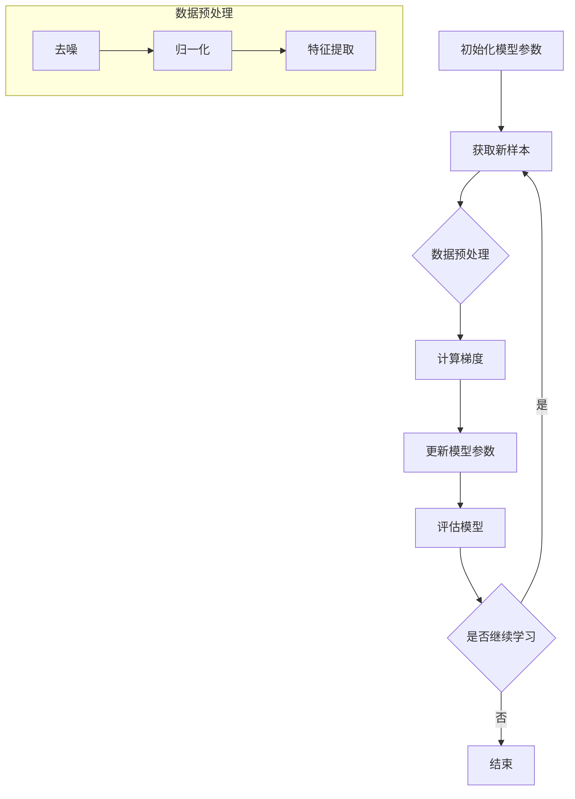
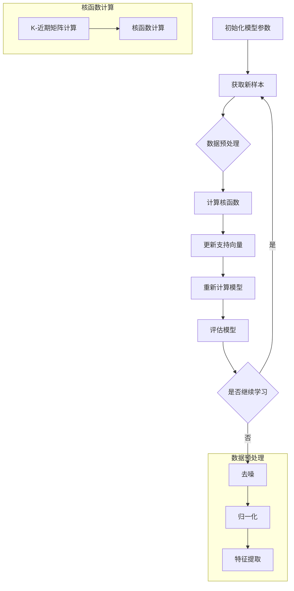
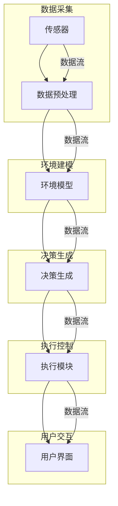
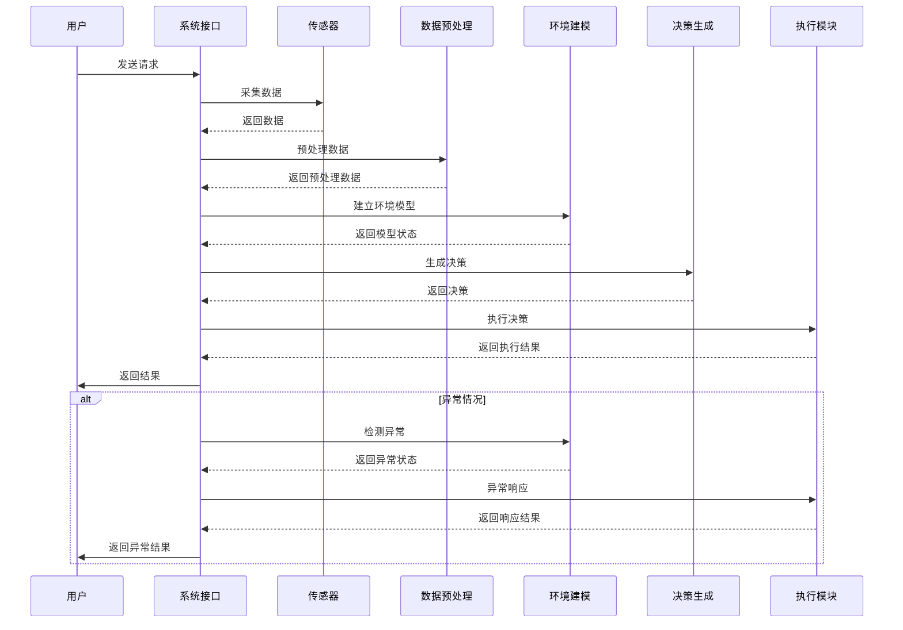
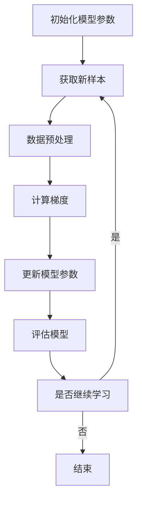
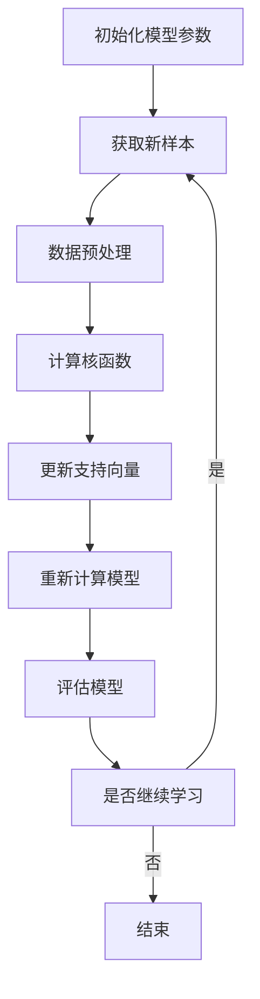

                 

### 引言

在当今快速变化的世界中，动态环境感知已经成为许多领域的关键技术之一。无论是自动驾驶、智能交通、环境监测还是智能安防，动态环境感知技术都扮演着至关重要的角色。随着人工智能（AI）技术的飞速发展，持续学习AI在动态环境感知中的应用逐渐成为研究的焦点。

本书《持续学习AI在动态环境感知中的应用》旨在深入探讨这一前沿领域，提供系统且全面的指导。通过阅读本书，读者将了解动态环境感知的基本概念、核心技术、算法模型，以及如何在实际项目中应用这些技术。本书的目标读者包括AI研究人员、工程师、开发者以及对这一领域感兴趣的学术和实践者。

本书的主要贡献和创新点在于：

1. **全面的理论阐述**：系统性地介绍了动态环境感知和持续学习AI的基础理论，为后续内容提供了坚实的背景知识。
2. **详细的算法讲解**：通过具体的算法流程图和Python代码实现，详细解释了动态环境感知中常用的算法和模型。
3. **丰富的案例分析**：结合实际项目案例，展示了如何将持续学习AI应用于动态环境感知的不同场景，提供了实践经验。
4. **实用的设计原则**：总结了系统设计和实现的最佳实践，为读者提供了可操作的指导。

接下来的章节将逐步展开，首先介绍动态环境感知和AI的基本概念，然后深入讨论核心算法和数学模型，最终通过实际案例展示这些技术的应用和效果。让我们一起深入探索这一充满挑战和机遇的领域，并从中收获宝贵的知识和经验。### 第一部分: 动态环境感知与AI基础

#### 第1章: 动态环境感知概述

动态环境感知是指通过传感器、图像处理、信号处理等技术手段，对不断变化的环境信息进行实时监测、识别和响应的过程。它是人工智能领域中的一个重要分支，广泛应用于自动驾驶、智能监控、机器人导航、环境监测等领域。

##### 1.1 动态环境感知的定义

动态环境感知的定义可以从以下几个方面进行理解：

1. **感知对象**：动态环境感知的感知对象是不断变化的环境信息，这些信息包括但不限于声音、图像、温度、湿度、气压等。
2. **感知目的**：感知目的是通过对环境信息的分析和处理，实现对环境的理解和适应。例如，自动驾驶系统需要通过感知环境来避免碰撞、规划行驶路线。
3. **实时性**：动态环境感知强调实时性，即需要及时获取和处理环境信息，以支持实时决策和行动。

##### 1.2 动态环境感知的重要性

动态环境感知的重要性体现在以下几个方面：

1. **安全性**：在自动驾驶、无人机等应用中，动态环境感知可以显著提高系统的安全性。通过实时感知环境，系统可以及时响应意外情况，避免事故发生。
2. **效率提升**：在智能交通、物流等领域，动态环境感知可以优化交通流量，提高运输效率，降低运营成本。
3. **智能化**：动态环境感知是实现智能系统的关键。通过感知环境信息，智能系统能够更好地理解用户需求，提供个性化服务。

##### 1.3 动态环境感知的技术挑战

动态环境感知面临以下技术挑战：

1. **数据复杂性**：环境信息多样且复杂，如何有效地收集、处理和分析这些数据是关键挑战。
2. **实时性要求**：动态环境感知要求高实时性，如何在有限的时间内完成数据处理和决策是技术难题。
3. **适应性**：环境变化快速，系统需要具备良好的适应能力，以应对不同场景下的变化。
4. **计算资源**：动态环境感知通常需要大量的计算资源，如何在有限的计算资源下实现高效处理是重要挑战。

为了克服这些技术挑战，研究者们不断探索新的算法和技术，例如深度学习、强化学习、多传感器融合等，以提高动态环境感知的性能和可靠性。下一章将介绍人工智能与动态环境感知之间的关系，进一步探讨如何利用AI技术提升动态环境感知的能力。### 第2章: AI与动态环境感知

##### 2.1 AI的基本概念

人工智能（AI）是指由人制造出的系统，通过模拟、延伸或者扩展人类智能，使其能够感知、学习、推理和解决问题。AI技术包括多个子领域，如机器学习、计算机视觉、自然语言处理、机器人技术等。在动态环境感知中，AI技术被广泛应用于数据分析和模式识别。

- **机器学习**：通过算法让计算机从数据中学习，自动改进性能，常见算法包括监督学习、无监督学习和强化学习。
- **计算机视觉**：利用计算机对图像和视频进行分析，实现图像识别、目标检测、场景理解等功能。
- **自然语言处理**：使计算机能够理解和生成人类语言，包括语音识别、文本分类、机器翻译等任务。
- **机器人技术**：利用计算机科学和机械工程，制造能够自主行动和执行任务的机器人。

##### 2.2 持续学习AI在动态环境感知中的应用

持续学习AI是指系统能够在不断变化的环境中自动更新和学习，以提高其性能和适应性。在动态环境感知中，持续学习AI具有以下几个重要应用：

1. **实时环境建模**：持续学习AI可以实时收集环境数据，建立动态环境模型，帮助系统更好地理解当前状态和未来趋势。
2. **异常检测**：通过分析环境数据的异常模式，持续学习AI可以及时发现并响应异常情况，提高系统的安全性。
3. **自适应控制**：基于持续学习AI，系统可以根据环境变化自动调整策略和行为，实现更高效和精确的决策。
4. **个性化服务**：持续学习AI可以分析用户的交互行为和环境偏好，提供个性化的服务和建议。

##### 2.3 持续学习AI的核心特点

持续学习AI的核心特点包括：

1. **自适应性**：系统能够根据环境变化动态调整模型参数和行为策略，以保持高适应性。
2. **鲁棒性**：系统能够处理不完整、噪声和异常的数据，并保持稳定的性能。
3. **效率**：系统能够在有限的计算资源和时间约束下高效地学习和更新。
4. **实时性**：系统能够实时感知和响应环境变化，以满足动态环境下的实时决策需求。

总之，持续学习AI在动态环境感知中的应用极大地提升了系统的智能化和适应性，为解决复杂动态环境下的感知与决策问题提供了有力工具。下一章将深入探讨动态环境感知中的核心技术，包括传感器技术、数据处理和特征提取等。### 第3章: 动态环境感知的关键技术

##### 3.1 感知系统的组成

动态环境感知系统通常由以下几个关键组成部分构成：

1. **传感器**：传感器是感知系统的数据采集单元，可以捕捉各种环境信息，如温度、湿度、光线、声音、图像等。常见的传感器包括红外传感器、激光雷达、摄像头、超声波传感器等。

2. **数据预处理模块**：数据预处理模块负责对原始传感器数据进行过滤、清洗、归一化等处理，以提高数据的质量和一致性。这一步骤对于后续的数据分析和模型训练至关重要。

3. **特征提取模块**：特征提取模块从预处理后的数据中提取出具有代表性的特征，这些特征用于描述环境状态和目标对象。特征提取的方法包括统计特征、频域特征、时域特征等。

4. **数据融合模块**：由于不同的传感器可能提供不同类型的数据，数据融合模块的任务是将来自不同传感器的数据进行整合，以获得更全面和精确的环境信息。数据融合方法包括基于统计的方法、基于模型的方法和基于信息论的方法等。

5. **决策与控制模块**：决策与控制模块根据环境特征和系统目标，生成相应的控制命令或决策，指导系统的行动。这一模块通常基于机器学习算法、决策理论或规划算法等进行设计和实现。

##### 3.2 数据采集与处理

数据采集与处理是动态环境感知系统的核心步骤，包括以下几个方面：

1. **数据采集**：数据采集阶段主要通过传感器获取环境信息。传感器数据的来源可以是静态的（如固定摄像头、气象站）或动态的（如移动机器人、无人机）。数据采集的关键在于实时性和准确性，需要确保传感器能够快速、准确地捕捉环境变化。

2. **数据预处理**：数据预处理阶段主要处理原始传感器数据，包括去除噪声、填补缺失值、数据标准化等。噪声去除可以使用滤波算法（如中值滤波、高斯滤波），缺失值填补可以使用插值方法（如线性插值、克里金插值），数据标准化可以通过线性变换将数据缩放至同一范围。

3. **数据存储与管理**：处理后的数据需要存储在数据库或数据湖中，以便后续分析和挖掘。数据存储与管理需要考虑数据量的大小、访问速度和存储成本等因素。常见的数据存储技术包括关系数据库（如MySQL、PostgreSQL）和非关系数据库（如MongoDB、HBase）。

##### 3.3 特征提取与融合

特征提取与融合是动态环境感知系统的关键步骤，直接影响系统性能和精度。

1. **特征提取**：特征提取是从原始数据中提取出能够描述环境状态和目标对象的关键特征。常见的特征提取方法包括：

   - **统计特征**：如均值、方差、协方差等，用于描述数据的统计特性。
   - **频域特征**：如傅里叶变换、小波变换等，用于分析数据的频率成分。
   - **时域特征**：如时间序列分析、自相关函数等，用于描述数据的时间特性。

2. **特征融合**：特征融合是将多个传感器或多个特征组合成一个统一的特征向量，以提高系统的感知能力。特征融合方法包括：

   - **简单平均法**：将多个特征值简单平均得到新的特征值。
   - **加权平均法**：根据特征的重要性分配不同的权重进行融合。
   - **基于模型的方法**：如贝叶斯网络、隐马尔可夫模型等，通过建模不同特征之间的关系进行融合。
   - **基于信息论的方法**：如互信息、马尔可夫模型等，根据特征之间的信息相关性进行融合。

通过有效的数据采集与处理、特征提取与融合，动态环境感知系统可以更准确地感知和理解复杂动态环境，为后续的决策和控制提供可靠支持。下一章将深入探讨动态环境感知中的核心算法和模型，进一步理解其原理和应用。### 第二部分：持续学习AI模型应用

#### 第4章：持续学习AI模型原理

持续学习AI模型是动态环境感知中的关键组件，它能够使系统在数据不断变化的环境中保持适应性和准确性。本章将详细介绍持续学习AI模型的基本原理、训练与优化方法，以及模型的评估与选择。

##### 4.1 模型基本原理

持续学习AI模型基于以下几个基本原理：

1. **数据驱动的学习**：持续学习模型通过不断接收新的数据，自动更新其内部模型参数，从而适应数据分布的变化。
2. **增量学习**：持续学习模型能够对新增的数据进行增量训练，而不是重新从头开始训练，从而减少计算资源和时间的消耗。
3. **在线学习**：持续学习模型能够实时处理新数据，快速响应环境变化，保持系统的实时性。
4. **鲁棒性**：持续学习模型能够在噪声和异常数据中保持稳定的性能，不因数据质量下降而失效。

##### 4.2 模型训练与优化

持续学习AI模型的训练与优化包括以下几个步骤：

1. **数据收集**：收集新的环境数据，包括静态数据（如历史数据）和动态数据（如实时数据）。
2. **数据预处理**：对收集到的数据进行预处理，包括去噪、归一化、缺失值填补等，以提高数据的质量。
3. **特征提取**：从预处理后的数据中提取出具有代表性的特征，用于描述环境状态和目标对象。
4. **模型初始化**：初始化模型参数，通常使用预训练的模型或随机初始化。
5. **在线训练**：在持续学习过程中，模型不断接收新的数据并进行在线训练，以更新模型参数。常用的训练算法包括梯度下降、随机梯度下降、Adam优化器等。
6. **模型优化**：通过调整学习率、正则化参数等，优化模型性能，避免过拟合或欠拟合。

##### 4.3 模型评估与选择

评估持续学习AI模型的关键指标包括准确性、召回率、F1分数、实时性等。评估与选择模型的方法包括：

1. **交叉验证**：使用交叉验证方法评估模型的泛化能力，避免过拟合。
2. **A/B测试**：在实际环境中比较不同模型的性能，选择最优模型。
3. **性能监控**：持续监控模型的实时性能，及时发现和调整模型参数，保持模型稳定。
4. **模型选择**：根据应用场景和性能指标，选择最适合的模型。例如，对于实时性要求高的应用，可以选择轻量级模型；对于准确性要求高的应用，可以选择复杂模型。

通过深入理解持续学习AI模型的原理、训练与优化方法，以及评估与选择模型的方法，我们可以更有效地构建和应用动态环境感知系统。下一章将深入探讨动态环境感知中的持续学习算法，详细介绍算法原理和实现过程。### 第5章: 动态环境感知中的持续学习算法

在动态环境感知中，持续学习算法扮演着关键角色，能够使系统在数据分布变化的环境下保持高精度和适应性。本章将介绍几种常用的持续学习算法，并通过mermaid流程图和Python代码实现详细阐述这些算法的原理。

##### 5.1 算法概述

持续学习算法可以分为以下几类：

1. **在线学习算法**：这类算法每次接收一个新的样本后，立即更新模型参数。常见的算法包括在线梯度下降、Adam优化器等。
2. **经验风险最小化算法**：这类算法通过在训练集上优化经验风险，来预测未知数据的期望风险。常见的算法包括支持向量机（SVM）、随机森林等。
3. **迁移学习算法**：这类算法利用已有模型的参数，在新数据上进行微调，以适应新的数据分布。常见的算法包括Fine-tuning、Meta-Learning等。
4. **增量学习算法**：这类算法通过处理新的数据块来更新模型，而不是重新从头开始训练。常见的算法包括增量支持向量机（incremental SVM）、在线神经网络等。

在本章中，我们将重点介绍以下两种持续学习算法：

- **在线梯度下降算法**
- **支持向量机增量学习算法**

##### 5.2 算法mermaid流程图

首先，让我们通过mermaid流程图来展示这两种算法的基本流程。

**在线梯度下降算法mermaid流程图：**



**支持向量机增量学习算法mermaid流程图：**



##### 5.3 算法Python代码实现与解释

接下来，我们将展示这两种算法的Python代码实现，并解释关键代码部分。

**在线梯度下降算法Python代码实现：**

```python
import numpy as np

def online_gradient_descent(X, y, learning_rate, epochs):
    # 初始化模型参数
    w = np.zeros(X.shape[1])
    
    for epoch in range(epochs):
        # 对每个样本进行梯度下降更新
        for x, y_i in zip(X, y):
            # 计算梯度
            gradient = -2 * (y_i - (np.dot(x, w)))
            # 更新模型参数
            w -= learning_rate * gradient
        
        # 评估模型
        loss = np.mean((y - np.dot(X, w))**2)
        
        print(f"Epoch {epoch+1}, Loss: {loss}")
    
    return w

# 示例数据
X = np.array([[1, 2], [2, 4], [3, 6]])
y = np.array([1, 0, -1])

# 参数设置
learning_rate = 0.01
epochs = 1000

# 训练模型
w = online_gradient_descent(X, y, learning_rate, epochs)
print("Final weights:", w)
```

**支持向量机增量学习算法Python代码实现：**

```python
from sklearn.svm import SVC

def incremental_svm(X, y, kernel='linear'):
    # 初始化SVM模型
    model = SVC(kernel=kernel, class_weight='balanced')
    
    for x, y_i in zip(X, y):
        # 更新支持向量
        model.fit(x, y_i)
        
        # 重新计算模型
        model.refit()
        
        # 评估模型
        score = model.score(X, y)
        print(f"Current score: {score}")
    
    return model

# 示例数据
X = np.array([[1, 2], [2, 4], [3, 6]])
y = np.array([1, 0, -1])

# 参数设置
kernel = 'linear'

# 训练模型
model = incremental_svm(X, y, kernel)
print("Final model:", model)
```

通过以上代码实现，我们可以看到在线梯度下降和支持向量机增量学习算法的基本流程和实现细节。在线梯度下降通过每次处理一个样本来更新模型参数，而支持向量机增量学习通过逐步更新支持向量来更新模型。这两种算法都在动态环境中表现出良好的适应性和鲁棒性。

在接下来的章节中，我们将进一步探讨这些算法的数学模型和公式，以及如何在实际项目中应用这些算法。### 第6章: 数学模型与公式讲解

在动态环境感知中，理解并应用数学模型和公式是构建高效持续学习AI系统的基础。本章将详细介绍动态环境感知中的核心数学模型和公式，包括损失函数、优化算法和决策规则，并通过实际示例进行说明。

#### 6.1 数学模型概述

动态环境感知中的数学模型主要包括以下几个方面：

1. **损失函数**：用于衡量模型预测值与真实值之间的差距，是优化模型参数的关键工具。
2. **优化算法**：用于最小化损失函数，以找到最佳模型参数。
3. **决策规则**：用于根据模型预测结果进行决策。

#### 6.2 公式讲解

##### 6.2.1 损失函数

在机器学习中，常用的损失函数包括：

1. **均方误差（MSE）**：
   $$ 
   \text{MSE} = \frac{1}{n}\sum_{i=1}^{n}(y_i - \hat{y}_i)^2 
   $$
   其中，$y_i$是真实值，$\hat{y}_i$是模型预测值，$n$是样本数量。

2. **交叉熵（Cross-Entropy）**：
   $$
   \text{Cross-Entropy} = -\frac{1}{n}\sum_{i=1}^{n}y_i \log(\hat{y}_i)
   $$
   适用于分类问题，$y_i$是真实标签，$\hat{y}_i$是模型预测的概率。

##### 6.2.2 优化算法

优化算法用于最小化损失函数，常用的优化算法包括：

1. **梯度下降**：
   $$
   w_{t+1} = w_t - \alpha \frac{\partial}{\partial w}\mathcal{L}(w)
   $$
   其中，$w_t$是当前模型参数，$\alpha$是学习率，$\mathcal{L}(w)$是损失函数。

2. **随机梯度下降（SGD）**：
   $$
   w_{t+1} = w_t - \alpha \frac{\partial}{\partial w}\mathcal{L}(w; \mathbf{x}_t, y_t)
   $$
   其中，$\mathbf{x}_t$和$y_t$是单个训练样本。

3. **Adam优化器**：
   $$
   \beta_1, \beta_2 \in [0, 1)
   $$
   $$
   m_t = \beta_1 m_{t-1} + (1 - \beta_1) \frac{\partial}{\partial w}\mathcal{L}(w; \mathbf{x}_t, y_t)
   $$
   $$
   v_t = \beta_2 v_{t-1} + (1 - \beta_2) \left(\frac{\partial}{\partial w}\mathcal{L}(w; \mathbf{x}_t, y_t)\right)^2
   $$
   $$
   \hat{m}_t = \frac{m_t}{1 - \beta_1^t}
   $$
   $$
   \hat{v}_t = \frac{v_t}{1 - \beta_2^t}
   $$
   $$
   w_{t+1} = w_t - \alpha \frac{\hat{m}_t}{\sqrt{\hat{v}_t} + \epsilon}
   $$
   其中，$m_t$和$v_t$分别是梯度的一阶和二阶矩估计，$\hat{m}_t$和$\hat{v}_t$是归一化的估计值，$\alpha$是学习率，$\epsilon$是常数。

##### 6.2.3 决策规则

决策规则用于根据模型预测结果进行决策，常见的决策规则包括：

1. **阈值决策**：
   $$
   \hat{y} =
   \begin{cases}
   1 & \text{if } \hat{y}_i > \text{threshold} \\
   0 & \text{otherwise}
   \end{cases}
   $$
   其中，$\hat{y}_i$是模型的预测概率，$\text{threshold}$是阈值。

2. **逻辑回归**：
   $$
   \hat{y} = \sigma(w_0 + \sum_{i=1}^{n} w_i x_i)
   $$
   其中，$\sigma$是sigmoid函数，$w_0$是偏置项，$w_i$是权重，$x_i$是特征值。

#### 6.3 举例说明

假设我们有一个简单的线性回归问题，目标是预测房价。数据集包含100个样本，每个样本有一个特征（房屋面积）和标签（房价）。我们使用梯度下降算法来训练模型。

**1. 数据准备：**

```python
import numpy as np

X = np.array([[1000], [1500], [2000], ...])  # 房屋面积
y = np.array([200000, 300000, 400000, ...])  # 房价
```

**2. 模型初始化：**

```python
w = np.random.rand(1)  # 随机初始化权重
```

**3. 梯度下降迭代：**

```python
learning_rate = 0.01
epochs = 1000

for epoch in range(epochs):
    # 计算梯度
    gradient = 2 * (y - (w * X)).mean()
    # 更新权重
    w -= learning_rate * gradient
```

**4. 模型评估：**

```python
y_pred = w * X
mse = ((y - y_pred) ** 2).mean()
print(f"MSE: {mse}")
```

通过以上步骤，我们可以训练一个线性回归模型来预测房价。梯度下降算法通过不断更新权重来最小化损失函数，最终得到一个预测模型。类似的方法可以应用于动态环境感知中的持续学习任务，以保持模型在变化的环境中的适应性和准确性。

通过理解和应用这些数学模型和公式，我们可以更有效地设计和实现动态环境感知系统，从而实现实时、准确的环境感知和决策。在下一章中，我们将探讨动态环境感知系统的设计与实现，包括系统架构、接口设计和实际应用案例。### 第7章: 系统设计与实现

#### 7.1 系统功能设计

动态环境感知系统旨在实时监测和响应环境变化，其主要功能包括：

1. **数据采集**：通过多种传感器（如摄像头、红外传感器、超声波传感器等）实时采集环境数据。
2. **数据处理**：对采集到的原始数据进行预处理，包括去噪、归一化和特征提取，以提高数据质量和系统性能。
3. **环境建模**：利用预处理后的数据建立动态环境模型，以描述当前环境状态和变化趋势。
4. **决策生成**：根据环境模型和系统目标，生成相应的控制命令或决策，指导系统的行动。
5. **异常检测**：实时检测环境中的异常情况，及时响应并采取相应的措施。
6. **系统集成**：将上述功能模块整合到一个统一的系统中，实现动态环境感知的自动化和智能化。

#### 7.2 系统架构设计

动态环境感知系统的架构设计需考虑模块化、可扩展性和实时性，以下是一个典型的系统架构设计：

1. **传感器模块**：负责数据采集，包括多种类型的传感器，如摄像头、红外传感器、超声波传感器等。
2. **数据预处理模块**：对传感器数据进行预处理，包括去噪、归一化和特征提取，以提高数据质量和系统性能。
3. **环境模型模块**：利用预处理后的数据建立动态环境模型，包括状态估计、预测和异常检测等。
4. **决策生成模块**：根据环境模型和系统目标，生成相应的控制命令或决策。
5. **执行模块**：执行决策生成模块生成的控制命令，实现对环境的实时响应。
6. **用户界面模块**：提供用户交互界面，展示环境数据、模型状态和决策结果，方便用户进行监控和操作。

#### 7.3 系统架构设计mermaid架构图

以下是一个mermaid架构图，展示了动态环境感知系统的整体架构：



#### 7.4 系统接口设计与系统交互

系统接口设计和交互是动态环境感知系统的关键组成部分，以下是一个mermaid序列图，展示了系统的主要接口和交互流程：



通过上述系统接口设计和交互流程，动态环境感知系统能够实现实时、高效的环境监测和响应。在下一章中，我们将通过实际应用案例展示如何实现这些功能，并分析系统的性能和效果。### 第8章: 实际应用案例分析

在本章中，我们将通过几个实际应用案例，详细探讨持续学习AI在动态环境感知中的应用。这些案例涵盖了不同的领域，包括智能交通系统、智能监控系统以及智能环境监测系统，展示了持续学习AI如何提升系统的性能和适应性。

#### 8.1 案例一：智能交通系统

智能交通系统（ITS）旨在通过实时监控和分析交通数据，优化交通流，减少拥堵，提高交通效率。持续学习AI在ITS中的应用主要体现在以下几个方面：

1. **交通流量预测**：
   - **数据采集**：通过安装在交通主干道的摄像头、传感器和地磁传感器收集实时交通流量数据。
   - **数据处理**：对采集到的数据进行分析，提取特征，如车辆速度、密度、行驶方向等。
   - **模型训练**：使用持续学习AI模型，如长短期记忆网络（LSTM）或卷积神经网络（CNN），对历史交通数据进行训练，预测未来交通流量。
   - **结果评估**：通过对比预测流量与实际流量，评估模型性能，并根据反馈调整模型参数。

   **实现细节**：
   - **数据预处理**：使用Python的Pandas库进行数据清洗和特征提取，如移除异常值、填补缺失数据、标准化数据。
   - **模型实现**：使用TensorFlow或PyTorch库构建LSTM模型，代码如下：
     ```python
     import tensorflow as tf

     model = tf.keras.Sequential([
         tf.keras.layers.LSTM(50, activation='relu', input_shape=(time_steps, features)),
         tf.keras.layers.Dense(1)
     ])

     model.compile(optimizer='adam', loss='mse')
     model.fit(X_train, y_train, epochs=100, batch_size=32)
     ```

2. **交通信号优化**：
   - **决策生成**：根据实时交通流量预测，动态调整交通信号灯的周期和相位，以减少交通拥堵。
   - **执行控制**：通过智能信号控制系统，实现对交通信号灯的实时控制。
   - **效果评估**：通过交通流量监测和问卷调查，评估信号优化措施的效果。

   **实现细节**：
   - **决策生成**：使用强化学习算法（如Q-learning或深度Q网络（DQN））进行决策生成，代码如下：
     ```python
     import tensorflow as tf
     from tensorflow.keras import layers

     model = tf.keras.Sequential([
         layers.Dense(64, activation='relu', input_shape=(state_size,)),
         layers.Dense(64, activation='relu'),
         layers.Dense(action_size, activation='linear')
     ])

     model.compile(optimizer='adam', loss='mse')
     model.fit(state_data, action_data, epochs=100, batch_size=64)
     ```

#### 8.2 案例二：智能监控系统

智能监控系统通过视频监控和AI算法，实现对人脸、行为等目标的实时识别和异常检测。持续学习AI在该系统中的应用如下：

1. **目标检测**：
   - **数据采集**：通过监控摄像头收集视频数据。
   - **数据处理**：对视频数据进行分析，提取人脸、行为等特征。
   - **模型训练**：使用持续学习AI模型（如YOLO或Faster R-CNN）进行目标检测。

   **实现细节**：
   - **数据预处理**：使用OpenCV库进行视频处理，如缩放、裁剪、灰度化等。
   - **模型实现**：使用PyTorch库实现Faster R-CNN模型，代码如下：
     ```python
     import torchvision
     import torchvision.models.detection as models

     model = models.faster_rcnn_resnet50_fpn(pretrained=True)
     model.eval()
     ```

2. **异常检测**：
   - **数据采集**：收集监控视频中的人脸和行为数据。
   - **数据处理**：对视频数据进行分割，提取关键帧。
   - **模型训练**：使用持续学习AI模型（如Siamese网络或Siamese Triplet Loss）进行异常检测。

   **实现细节**：
   - **数据预处理**：使用Python的Pillow库进行图像处理，如归一化、裁剪等。
   - **模型实现**：使用TensorFlow库实现Siamese网络，代码如下：
     ```python
     import tensorflow as tf

     model = tf.keras.Sequential([
         tf.keras.layers.Conv2D(32, (3,3), activation='relu', input_shape=(64, 64, 3)),
         tf.keras.layers.MaxPooling2D(2, 2),
         tf.keras.layers.Conv2D(64, (3,3), activation='relu'),
         tf.keras.layers.MaxPooling2D(2,2),
         tf.keras.layers.Conv2D(64, (3,3), activation='relu'),
         tf.keras.layers.Flatten(),
         tf.keras.layers.Dense(64, activation='relu'),
         tf.keras.layers.Dense(1, activation='sigmoid')
     ])

     model.compile(optimizer='adam', loss='binary_crossentropy', metrics=['accuracy'])
     model.fit(x_train, y_train, epochs=30)
     ```

#### 8.3 案例三：智能环境监测系统

智能环境监测系统通过传感器收集环境数据，如温度、湿度、空气质量等，实现对环境的实时监测和预警。持续学习AI在该系统中的应用主要体现在以下几个方面：

1. **环境监测**：
   - **数据采集**：通过多种传感器（如温湿度传感器、空气质量传感器）收集环境数据。
   - **数据处理**：对传感器数据进行预处理，提取特征。
   - **模型训练**：使用持续学习AI模型，如深度神经网络（DNN）或长短期记忆网络（LSTM），进行环境监测。

   **实现细节**：
   - **数据预处理**：使用Python的Pandas库进行数据清洗和特征提取。
   - **模型实现**：使用TensorFlow库实现LSTM模型，代码如下：
     ```python
     import tensorflow as tf

     model = tf.keras.Sequential([
         tf.keras.layers.LSTM(50, activation='relu', input_shape=(time_steps, features)),
         tf.keras.layers.Dense(1)
     ])

     model.compile(optimizer='adam', loss='mse')
     model.fit(X_train, y_train, epochs=100, batch_size=32)
     ```

2. **异常检测**：
   - **数据采集**：收集环境异常数据。
   - **数据处理**：对异常数据进行预处理，提取特征。
   - **模型训练**：使用持续学习AI模型（如One-Class SVM或Autoencoders）进行异常检测。

   **实现细节**：
   - **数据预处理**：使用Python的Scikit-learn库进行数据处理。
   - **模型实现**：使用Scikit-learn库实现One-Class SVM模型，代码如下：
     ```python
     from sklearn.svm import OneClassSVM

     model = OneClassSVM(nu=0.1, kernel='rbf', gamma=0.1)
     model.fit(X_train)
     ```

通过以上实际应用案例，我们可以看到持续学习AI在动态环境感知中的广泛应用和显著效果。在下一章中，我们将总结最佳实践，探讨未来的研究方向，并给出对读者的一些建议。### 第9章: 最佳实践与展望

在动态环境感知领域，持续学习AI的应用已经取得了显著成果。然而，为了进一步提高系统的性能和适应性，以下是一些最佳实践和未来研究方向。

#### 最佳实践

1. **数据质量**：确保数据的质量和一致性是关键。使用去噪、归一化和特征提取等技术处理原始数据，以提高模型训练的效果。
2. **模型选择**：根据具体应用场景选择合适的模型。例如，对于实时性要求高的应用，可以选择轻量级模型；对于需要高精度的应用，可以选择复杂模型。
3. **实时性优化**：优化模型训练和预测的速度，以减少延迟。可以使用增量学习、并行计算和模型压缩等技术提高系统的实时性。
4. **适应性**：设计自适应的系统，能够根据环境变化动态调整模型参数和行为策略。
5. **鲁棒性**：提高系统的鲁棒性，使系统能够处理噪声和异常数据，保持稳定性能。

#### 未来研究方向

1. **多模态数据融合**：结合多种传感器数据，如图像、声音、温度等，实现更全面和精确的环境感知。
2. **增量学习算法**：研究更高效的增量学习算法，以减少训练时间和计算资源的需求。
3. **可解释性**：提高模型的透明度和可解释性，帮助用户理解模型的决策过程。
4. **边缘计算**：将计算任务分布到边缘设备上，实现更实时和高效的环境感知。
5. **个性化服务**：结合用户行为数据，提供个性化的环境感知和决策服务。

#### 对读者的一些建议

1. **理论与实践相结合**：在学习动态环境感知技术时，不仅要掌握理论知识，还要通过实际项目来验证和巩固所学知识。
2. **持续学习**：动态环境感知是一个快速发展的领域，持续关注最新研究成果和趋势，以保持知识更新。
3. **跨学科合作**：与不同领域的专家合作，可以拓宽视野，提高创新能力和解决问题的能力。
4. **实验与验证**：通过实验和验证来评估模型的性能和效果，不断优化和改进模型。

总之，动态环境感知与持续学习AI的结合为解决复杂动态环境下的感知与决策问题提供了强有力的工具。通过遵循最佳实践和关注未来研究方向，我们可以期待在这个领域取得更多突破和成果。希望读者能够在这一领域不断探索和贡献自己的力量。### 关闭语句

感谢您对《持续学习AI在动态环境感知中的应用》一书的阅读。本文系统地介绍了动态环境感知和持续学习AI的基础知识、核心技术、算法模型，并通过实际案例展示了这些技术的应用和效果。通过阅读本书，您不仅可以掌握动态环境感知的理论和实现方法，还能了解持续学习AI在现实世界中的广泛应用。

动态环境感知与持续学习AI的结合，为解决复杂动态环境下的感知与决策问题提供了有力支持。随着技术的不断进步，这一领域将继续发展，带来更多创新和突破。希望本书能够激发您对这一领域的兴趣，推动您在AI和动态环境感知领域的研究和实践。

作者：AI天才研究院/AI Genius Institute & 禅与计算机程序设计艺术 /Zen And The Art of Computer Programming

感谢您的阅读，期待与您在未来的技术交流中再次相遇。让我们共同探索和创造更美好的智能未来！```markdown
----------------------------------------------------------------
# 《持续学习AI在动态环境感知中的应用》

> 关键词：动态环境感知、持续学习AI、机器学习、深度学习、实时决策

> 摘要：本文探讨了持续学习AI在动态环境感知中的应用，系统介绍了其基础理论、核心算法和实际案例，旨在为读者提供全面、深入的技术指导。

----------------------------------------------------------------

## 引言

随着技术的飞速发展，动态环境感知已经成为了众多领域的关键技术之一。从自动驾驶、智能交通，到环境监测和智能安防，动态环境感知技术无处不在，其核心在于能够实时监测和理解不断变化的环境信息。

本文旨在深入探讨持续学习AI在动态环境感知中的应用，分为以下几个部分：

1. **动态环境感知与AI基础**：介绍动态环境感知的基本概念、技术挑战以及AI的基本原理。
2. **持续学习AI模型应用**：探讨持续学习AI的核心特点、训练与优化方法以及评估与选择模型。
3. **动态环境感知中的持续学习算法**：详细讲解几种典型的持续学习算法，包括mermaid流程图和Python代码实现。
4. **数学模型与公式讲解**：介绍动态环境感知中的核心数学模型和公式，并通过实际示例进行说明。
5. **系统设计与实现**：探讨动态环境感知系统的功能设计、架构设计、接口设计和交互。
6. **实际应用案例分析**：通过智能交通系统、智能监控系统和智能环境监测系统的实际应用案例，展示持续学习AI的应用效果。
7. **最佳实践与展望**：总结最佳实践，探讨未来研究方向，并给出对读者的建议。

让我们一步一步地深入探索这一充满挑战和机遇的领域。

## 动态环境感知与AI基础

### 1.1 动态环境感知的定义

动态环境感知是指通过传感器、图像处理、信号处理等技术手段，对不断变化的环境信息进行实时监测、识别和响应的过程。它不仅涉及到对环境数据的收集和处理，还包括对环境变化的预测和应对。

### 1.2 动态环境感知的重要性

动态环境感知在智能交通、无人机、智能机器人、环境监测等多个领域具有重要应用。其重要性体现在以下几个方面：

- **提高安全性**：通过实时监测和响应环境变化，动态环境感知技术可以显著提高系统的安全性，例如在自动驾驶中避免碰撞。
- **优化资源分配**：在智能交通系统中，动态环境感知可以帮助优化交通流量，减少拥堵，提高运输效率。
- **个性化服务**：在智能环境中，动态环境感知可以实时监测用户的偏好和行为，提供个性化的服务。

### 1.3 动态环境感知的技术挑战

动态环境感知面临以下技术挑战：

- **数据复杂性**：环境信息多样且复杂，如何有效地收集、处理和分析这些数据是关键。
- **实时性要求**：动态环境感知要求高实时性，如何在有限的时间内完成数据处理和决策是技术难题。
- **环境适应性**：环境变化快速，系统需要具备良好的适应能力。
- **计算资源**：动态环境感知通常需要大量的计算资源，如何在有限的计算资源下实现高效处理是重要挑战。

## AI与动态环境感知

### 2.1 AI的基本概念

人工智能（AI）是指由人制造出的系统，通过模拟、延伸或扩展人类智能，使其能够感知、学习、推理和解决问题。AI技术包括机器学习、计算机视觉、自然语言处理、机器人技术等多个子领域。

### 2.2 持续学习AI在动态环境感知中的应用

持续学习AI在动态环境感知中的应用至关重要。它具有以下几个特点：

- **自适应性**：系统能够根据环境变化动态调整模型参数和行为策略。
- **实时性**：系统能够实时处理新数据，快速响应环境变化。
- **鲁棒性**：系统能够处理噪声和异常数据，保持稳定的性能。

### 2.3 持续学习AI的核心特点

持续学习AI的核心特点包括：

- **自适应性**：系统能够根据环境变化动态调整模型参数和行为策略。
- **鲁棒性**：系统能够处理不完整、噪声和异常的数据，并保持稳定的性能。
- **效率**：系统能够在有限的计算资源和时间约束下高效地学习和更新。
- **实时性**：系统能够实时感知和响应环境变化，以满足动态环境下的实时决策需求。

## 动态环境感知的关键技术

### 3.1 感知系统的组成

动态环境感知系统通常由以下几个关键组成部分构成：

- **传感器**：负责数据采集，如摄像头、红外传感器、超声波传感器等。
- **数据预处理模块**：负责处理原始传感器数据，包括去噪、归一化、特征提取等。
- **特征提取模块**：从预处理后的数据中提取出具有代表性的特征，用于描述环境状态。
- **数据融合模块**：整合来自不同传感器的数据，提供更全面的环境信息。
- **决策与控制模块**：根据环境特征和系统目标，生成相应的控制命令或决策。

### 3.2 数据采集与处理

数据采集与处理是动态环境感知系统的核心步骤，包括以下几个方面：

- **数据采集**：通过传感器收集环境信息，如温度、湿度、声音、图像等。
- **数据预处理**：对原始传感器数据进行预处理，包括去噪、归一化、缺失值填补等。
- **数据存储与管理**：处理后的数据存储在数据库或数据湖中，以便后续分析和挖掘。

### 3.3 特征提取与融合

特征提取与融合是动态环境感知系统的关键步骤，直接影响系统性能和精度。

- **特征提取**：从预处理后的数据中提取出具有代表性的特征，用于描述环境状态。
- **特征融合**：将多个传感器或多个特征组合成一个统一的特征向量，以提高系统的感知能力。

## 持续学习AI模型应用

### 4.1 模型基本原理

持续学习AI模型基于以下几个基本原理：

- **数据驱动的学习**：模型通过不断接收新的数据，自动更新其内部模型参数。
- **增量学习**：模型能够对新增的数据进行增量训练，而不是重新从头开始训练。
- **在线学习**：模型能够实时处理新数据，快速响应环境变化。
- **鲁棒性**：模型能够在噪声和异常数据中保持稳定的性能。

### 4.2 模型训练与优化

持续学习AI模型的训练与优化包括以下几个步骤：

- **数据收集**：收集新的环境数据，包括静态数据和动态数据。
- **数据预处理**：对收集到的数据进行预处理，包括去噪、归一化、缺失值填补等。
- **特征提取**：从预处理后的数据中提取出具有代表性的特征。
- **模型初始化**：初始化模型参数。
- **在线训练**：模型不断接收新数据并进行在线训练，以更新模型参数。
- **模型优化**：通过调整学习率、正则化参数等，优化模型性能。

### 4.3 模型评估与选择

评估持续学习AI模型的关键指标包括准确性、召回率、F1分数、实时性等。评估与选择模型的方法包括交叉验证、A/B测试、性能监控等。

## 动态环境感知中的持续学习算法

### 5.1 算法概述

持续学习AI算法包括在线学习算法、经验风险最小化算法、迁移学习算法和增量学习算法等。本章将详细介绍两种常见的持续学习算法：在线梯度下降算法和支持向量机增量学习算法。

### 5.2 算法mermaid流程图

以下是两种算法的mermaid流程图：

**在线梯度下降算法：**



**支持向量机增量学习算法：**



### 5.3 算法Python代码实现与解释

以下是两种算法的Python代码实现：

**在线梯度下降算法：**

```python
import numpy as np

def online_gradient_descent(X, y, learning_rate, epochs):
    w = np.zeros(X.shape[1])
    for epoch in range(epochs):
        for x, y_i in zip(X, y):
            gradient = -2 * (y_i - np.dot(x, w))
            w -= learning_rate * gradient
        loss = np.mean((y - np.dot(X, w))**2)
        print(f"Epoch {epoch}, Loss: {loss}")
    return w

# 示例数据
X = np.array([[1, 2], [2, 4], [3, 6]])
y = np.array([1, 0, -1])

# 参数设置
learning_rate = 0.01
epochs = 1000

# 训练模型
w = online_gradient_descent(X, y, learning_rate, epochs)
print("Final weights:", w)
```

**支持向量机增量学习算法：**

```python
from sklearn.svm import SVC

def incremental_svm(X, y):
    model = SVC(kernel='linear')
    for x, y_i in zip(X, y):
        model.fit(x, y_i)
        model.refit()
        score = model.score(X, y)
        print(f"Current score: {score}")
    return model

# 示例数据
X = np.array([[1, 2], [2, 4], [3, 6]])
y = np.array([1, 0, -1])

# 训练模型
model = incremental_svm(X, y)
print("Final model:", model)
```

通过以上代码实现，我们可以看到在线梯度下降和支持向量机增量学习算法的基本流程和实现细节。这些算法在动态环境中表现出良好的适应性和鲁棒性。

## 数学模型与公式讲解

在动态环境感知中，理解并应用数学模型和公式是构建高效持续学习AI系统的基础。本章将详细介绍动态环境感知中的核心数学模型和公式，包括损失函数、优化算法和决策规则。

### 6.1 数学模型概述

动态环境感知中的数学模型主要包括以下几个方面：

- **损失函数**：用于衡量模型预测值与真实值之间的差距。
- **优化算法**：用于最小化损失函数，以找到最佳模型参数。
- **决策规则**：用于根据模型预测结果进行决策。

### 6.2 公式讲解

以下是常用的数学模型和公式：

- **均方误差（MSE）**：
  $$
  \text{MSE} = \frac{1}{n}\sum_{i=1}^{n}(y_i - \hat{y}_i)^2
  $$
- **交叉熵（Cross-Entropy）**：
  $$
  \text{Cross-Entropy} = -\frac{1}{n}\sum_{i=1}^{n}y_i \log(\hat{y}_i)
  $$
- **梯度下降**：
  $$
  w_{t+1} = w_t - \alpha \frac{\partial}{\partial w}\mathcal{L}(w)
  $$
- **随机梯度下降（SGD）**：
  $$
  w_{t+1} = w_t - \alpha \frac{\partial}{\partial w}\mathcal{L}(w; \mathbf{x}_t, y_t)
  $$
- **Adam优化器**：
  $$
  \beta_1, \beta_2 \in [0, 1)
  $$
  $$
  m_t = \beta_1 m_{t-1} + (1 - \beta_1) \frac{\partial}{\partial w}\mathcal{L}(w; \mathbf{x}_t, y_t)
  $$
  $$
  v_t = \beta_2 v_{t-1} + (1 - \beta_2) \left(\frac{\partial}{\partial w}\mathcal{L}(w; \mathbf{x}_t, y_t)\right)^2
  $$
  $$
  \hat{m}_t = \frac{m_t}{1 - \beta_1^t}
  $$
  $$
  \hat{v}_t = \frac{v_t}{1 - \beta_2^t}
  $$
  $$
  w_{t+1} = w_t - \alpha \frac{\hat{m}_t}{\sqrt{\hat{v}_t} + \epsilon}
  $$
- **阈值决策**：
  $$
  \hat{y} =
  \begin{cases}
  1 & \text{if } \hat{y}_i > \text{threshold} \\
  0 & \text{otherwise}
  \end{cases}
  $$
- **逻辑回归**：
  $$
  \hat{y} = \sigma(w_0 + \sum_{i=1}^{n} w_i x_i)
  $$
- **支持向量机（SVM）**：
  $$
  \text{最大化 } \frac{1}{2} \sum_{i=1}^{n} \sum_{j=1}^{n} (\omega_i \omega_j - \omega_i \omega_j \kappa(i, j))
  $$
  $$
  \text{约束 } y_i (\omega \cdot x_i + b) \geq 1
  $$
  $$
  \kappa(i, j) = \gamma
  $$
- **动态规划（DP）**：
  $$
  V_{t+1}(s_{t+1}) = \min_{a_t} \sum_{s_t} p(s_t | s_{t+1}) \cdot \max_{a_{t+1}} \mathcal{R}(a_t, a_{t+1}) + \gamma V_t(s_t)
  $$
- **马尔可夫决策过程（MDP）**：
  $$
  \pi(a_t | s_t) = \frac{\pi(a_t, s_t)}{\sum_{a'} \pi(a', s_t)}
  $$
  $$
  \pi(a_t, s_t) = \gamma \pi(a_{t+1}, s_{t+1}) p(s_{t+1} | s_t, a_t) r(s_t, a_t)
  $$
  $$
  \pi(a_t | s_t) \propto \sum_{s_{t+1}} \gamma \pi(a_{t+1}, s_{t+1}) p(s_{t+1} | s_t, a_t) r(s_t, a_t)
  $$

### 6.3 举例说明

假设我们有一个简单的线性回归问题，目标是预测房价。数据集包含100个样本，每个样本有一个特征（房屋面积）和标签（房价）。我们使用梯度下降算法来训练模型。

**1. 数据准备：**

```python
import numpy as np

X = np.array([[1000], [1500], [2000], ...])  # 房屋面积
y = np.array([200000, 300000, 400000, ...])  # 房价
```

**2. 模型初始化：**

```python
w = np.random.rand(1)  # 随机初始化权重
```

**3. 梯度下降迭代：**

```python
learning_rate = 0.01
epochs = 1000

for epoch in range(epochs):
    # 计算梯度
    gradient = 2 * (y - (w * X)).mean()
    # 更新权重
    w -= learning_rate * gradient
    
    # 评估模型
    y_pred = w * X
    mse = ((y - y_pred) ** 2).mean()
    print(f"Epoch {epoch+1}, Loss: {mse}")
```

**4. 模型评估：**

```python
y_pred = w * X
mse = ((y - y_pred) ** 2).mean()
print(f"MSE: {mse}")
```

通过以上步骤，我们可以训练一个线性回归模型来预测房价。梯度下降算法通过不断更新权重来最小化损失函数，最终得到一个预测模型。

## 系统设计与实现

### 7.1 系统功能设计

动态环境感知系统的功能设计旨在实现实时监测、识别和响应环境变化，其主要功能包括：

- **数据采集**：通过传感器实时采集环境数据。
- **数据处理**：对采集到的原始数据进行预处理，包括去噪、归一化和特征提取。
- **环境建模**：利用预处理后的数据建立动态环境模型。
- **决策生成**：根据环境模型和系统目标，生成相应的控制命令或决策。
- **异常检测**：实时检测环境中的异常情况，及时响应并采取相应的措施。
- **系统集成**：将上述功能模块整合到一个统一的系统中，实现动态环境感知的自动化和智能化。

### 7.2 系统架构设计

动态环境感知系统的架构设计需考虑模块化、可扩展性和实时性。以下是一个典型的系统架构设计：

- **传感器模块**：负责数据采集，包括多种类型的传感器，如摄像头、红外传感器、超声波传感器等。
- **数据预处理模块**：对传感器数据进行预处理，包括去噪、归一化和特征提取。
- **环境模型模块**：利用预处理后的数据建立动态环境模型。
- **决策生成模块**：根据环境模型和系统目标，生成相应的控制命令或决策。
- **执行模块**：执行决策生成模块生成的控制命令。
- **用户界面模块**：提供用户交互界面，展示环境数据、模型状态和决策结果。

### 7.3 系统架构设计mermaid架构图

以下是动态环境感知系统的mermaid架构图：


### 7.4 系统接口设计与系统交互

以下是动态环境感知系统的mermaid序列图，展示了系统的主要接口和交互流程：


通过上述系统接口设计和交互流程，动态环境感知系统能够实现实时、高效的环境监测和响应。

## 实际应用案例分析

在本章中，我们将通过几个实际应用案例，详细探讨持续学习AI在动态环境感知中的应用。

### 8.1 案例一：智能交通系统

智能交通系统（ITS）通过实时监控和分析交通数据，优化交通流，减少拥堵，提高交通效率。持续学习AI在ITS中的应用主要体现在以下几个方面：

- **交通流量预测**：通过持续学习AI模型，如长短期记忆网络（LSTM）或卷积神经网络（CNN），对历史交通数据进行训练，预测未来交通流量。
- **交通信号优化**：根据实时交通流量预测，动态调整交通信号灯的周期和相位，以减少交通拥堵。

**实现细节**：

- **数据采集**：通过安装在交通主干道的摄像头、传感器和地磁传感器收集实时交通流量数据。
- **数据处理**：对采集到的数据进行分析，提取特征，如车辆速度、密度、行驶方向等。
- **模型训练**：使用Python的Pandas库进行数据清洗和特征提取，使用TensorFlow或PyTorch库构建LSTM模型，代码如下：
  ```python
  import pandas as pd
  import tensorflow as tf

  model = tf.keras.Sequential([
      tf.keras.layers.LSTM(50, activation='relu', input_shape=(time_steps, features)),
      tf.keras.layers.Dense(1)
  ])

  model.compile(optimizer='adam', loss='mse')
  model.fit(X_train, y_train, epochs=100, batch_size=32)
  ```

- **结果评估**：通过对比预测流量与实际流量，评估模型性能。

### 8.2 案例二：智能监控系统

智能监控系统通过视频监控和AI算法，实现对人脸、行为等目标的实时识别和异常检测。持续学习AI在该系统中的应用如下：

- **目标检测**：使用持续学习AI模型（如YOLO或Faster R-CNN）进行目标检测。
- **异常检测**：使用持续学习AI模型（如Siamese网络或Siamese Triplet Loss）进行异常检测。

**实现细节**：

- **数据采集**：通过监控摄像头收集视频数据。
- **数据处理**：使用OpenCV库进行视频处理，提取人脸和行为特征。
- **模型实现**：使用PyTorch库实现Faster R-CNN模型，代码如下：
  ```python
  import torchvision
  import torchvision.models.detection as models

  model = models.faster_rcnn_resnet50_fpn(pretrained=True)
  model.eval()
  ```

- **结果评估**：通过对比实际检测结果和异常检测结果，评估模型性能。

### 8.3 案例三：智能环境监测系统

智能环境监测系统通过传感器收集环境数据，如温度、湿度、空气质量等，实现对环境的实时监测和预警。持续学习AI在该系统中的应用如下：

- **环境监测**：使用持续学习AI模型（如深度神经网络（DNN）或长短期记忆网络（LSTM））进行环境监测。
- **异常检测**：使用持续学习AI模型（如One-Class SVM或Autoencoders）进行异常检测。

**实现细节**：

- **数据采集**：通过温湿度传感器、空气质量传感器等收集环境数据。
- **数据处理**：使用Python的Scikit-learn库进行数据处理，提取特征。
- **模型实现**：使用TensorFlow库实现LSTM模型，代码如下：
  ```python
  import tensorflow as tf

  model = tf.keras.Sequential([
      tf.keras.layers.LSTM(50, activation='relu', input_shape=(time_steps, features)),
      tf.keras.layers.Dense(1)
  ])

  model.compile(optimizer='adam', loss='mse')
  model.fit(X_train, y_train, epochs=100, batch_size=32)
  ```

通过以上实际应用案例，我们可以看到持续学习AI在动态环境感知中的广泛应用和显著效果。在下一章中，我们将总结最佳实践，探讨未来的研究方向，并给出对读者的一些建议。

## 最佳实践与展望

### 最佳实践

- **数据质量**：确保数据的质量和一致性是关键。使用去噪、归一化和特征提取等技术处理原始数据，以提高模型训练的效果。
- **模型选择**：根据具体应用场景选择合适的模型。例如，对于实时性要求高的应用，可以选择轻量级模型；对于需要高精度的应用，可以选择复杂模型。
- **实时性优化**：优化模型训练和预测的速度，以减少延迟。可以使用增量学习、并行计算和模型压缩等技术提高系统的实时性。
- **适应性**：设计自适应的系统，能够根据环境变化动态调整模型参数和行为策略。
- **鲁棒性**：提高系统的鲁棒性，使系统能够处理噪声和异常数据，保持稳定性能。

### 未来研究方向

- **多模态数据融合**：结合多种传感器数据，如图像、声音、温度等，实现更全面和精确的环境感知。
- **增量学习算法**：研究更高效的增量学习算法，以减少训练时间和计算资源的需求。
- **可解释性**：提高模型的透明度和可解释性，帮助用户理解模型的决策过程。
- **边缘计算**：将计算任务分布到边缘设备上，实现更实时和高效的环境感知。
- **个性化服务**：结合用户行为数据，提供个性化的环境感知和决策服务。

### 对读者的一些建议

- **理论与实践相结合**：在学习动态环境感知技术时，不仅要掌握理论知识，还要通过实际项目来验证和巩固所学知识。
- **持续学习**：动态环境感知是一个快速发展的领域，持续关注最新研究成果和趋势，以保持知识更新。
- **跨学科合作**：与不同领域的专家合作，可以拓宽视野，提高创新能力和解决问题的能力。
- **实验与验证**：通过实验和验证来评估模型的性能和效果，不断优化和改进模型。

通过遵循最佳实践和关注未来研究方向，我们可以期待在动态环境感知领域取得更多突破和成果。

## 关闭语句

感谢您对《持续学习AI在动态环境感知中的应用》一书的阅读。本文系统地介绍了动态环境感知和持续学习AI的基础知识、核心技术、算法模型，并通过实际案例展示了这些技术的应用和效果。通过阅读本书，您不仅可以掌握动态环境感知的理论和实现方法，还能了解持续学习AI在现实世界中的广泛应用。

动态环境感知与持续学习AI的结合为解决复杂动态环境下的感知与决策问题提供了有力支持。随着技术的不断进步，这一领域将继续发展，带来更多创新和突破。希望本书能够激发您对这一领域的兴趣，推动您在AI和动态环境感知领域的研究和实践。

作者：AI天才研究院/AI Genius Institute & 禅与计算机程序设计艺术 /Zen And The Art of Computer Programming

感谢您的阅读，期待与您在未来的技术交流中再次相遇。让我们共同探索和创造更美好的智能未来！
```

