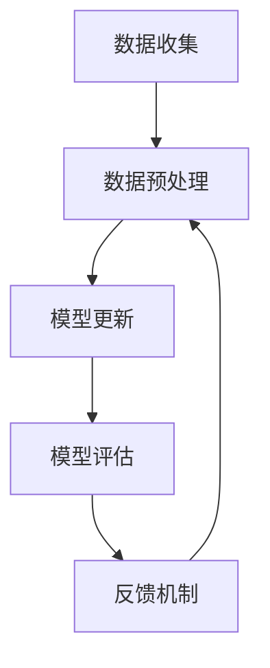
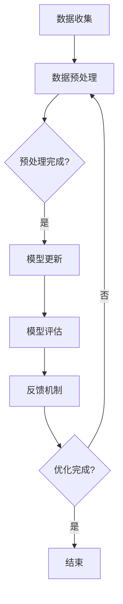
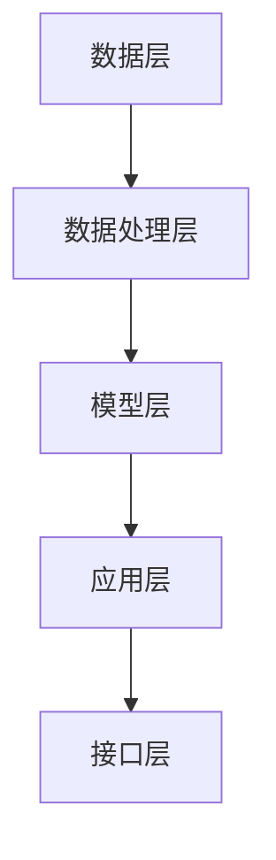
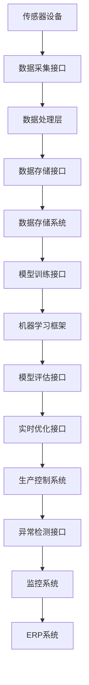
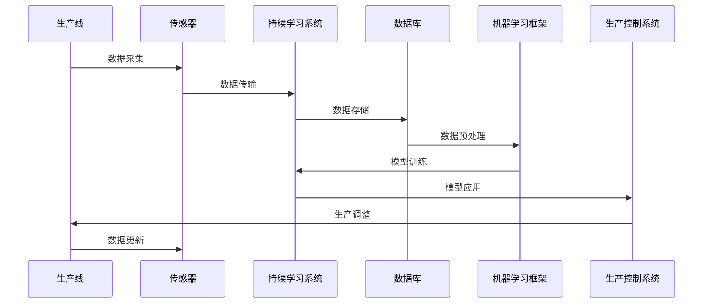

                 

### 第一步：背景介绍与问题描述

#### 1.1 问题背景：智能制造质量控制的挑战

随着工业4.0的深入推进，智能制造成为了全球制造业发展的主要趋势。智能制造不仅提高了生产效率，还大大提升了产品的质量。然而，在智能制造过程中，质量控制仍然是一个重大挑战。传统质量控制方法往往依赖于人工检测和统计过程控制（SPC）技术，这些方法在应对大量数据和高频次生产时显得力不从心。

智能制造环境中的质量控制问题主要包括以下几点：

1. **数据复杂性**：智能制造过程中会产生大量数据，如传感器数据、生产参数、环境数据等，这些数据往往是非结构化的，处理和分析这些数据需要强大的数据处理能力。
2. **实时性要求**：质量控制需要在生产过程中实时进行，以便及时发现和纠正问题。传统的质量控制方法往往存在一定的滞后性，无法满足实时性的要求。
3. **适应性**：随着生产过程的复杂化和多样化，质量控制模型需要具有高度适应性，以便快速调整和优化。
4. **人工干预**：尽管智能制造减少了人工干预，但一些复杂的质量问题仍然需要人工判断和干预，这增加了人力成本和效率。

#### 1.2 持续学习系统的定义与重要性

持续学习系统（Continuous Learning System，CLS）是一种能够不断从数据中学习并自动调整自身参数的智能系统。它通过不断地接收和处理新数据，不断地优化自身的模型和算法，从而实现对复杂问题的自适应处理。

在智能制造质量控制中，持续学习系统的重要性体现在以下几个方面：

1. **自适应能力**：持续学习系统能够根据生产过程中的实时数据，自动调整模型参数，从而提高质量控制的准确性和效率。
2. **实时优化**：持续学习系统可以实时处理生产数据，及时发现问题并采取纠正措施，大大缩短了响应时间。
3. **持续改进**：通过不断的学习和优化，持续学习系统能够持续提升质量控制的水平，提高产品质量的稳定性。
4. **减少人工干预**：持续学习系统可以自动识别和解决质量问题，减少了对人工的依赖，降低了人力成本。

#### 1.3 持续学习系统在智能制造中的适用性

持续学习系统在智能制造中的适用性主要体现在以下几个方面：

1. **多源数据融合**：智能制造过程中会产生多种类型的数据，如生产数据、传感器数据、环境数据等。持续学习系统可以通过数据融合技术，将多种数据整合在一起，从而提供更全面的决策支持。
2. **实时数据处理**：持续学习系统具有高效的数据处理能力，能够实时处理生产过程中的大量数据，为质量控制提供实时反馈。
3. **模型自适应**：持续学习系统可以根据生产过程中的实时数据，自动调整模型参数，实现模型的自我优化和自我更新。
4. **高效性**：持续学习系统能够快速处理复杂问题，提高生产效率和质量。

总之，持续学习系统在智能制造质量控制中的应用具有巨大的潜力和前景。通过持续学习系统，我们可以实现质量控制的实时优化，提高产品质量的稳定性，降低生产成本，从而推动智能制造的进一步发展。

### 第2章：核心概念与联系

在深入探讨持续学习系统在智能制造质量控制中的应用之前，我们需要明确几个核心概念，包括持续学习系统的关键要素、智能制造质量控制的关键指标，以及这两者之间的联系。

#### 2.1 持续学习系统的关键要素

持续学习系统由以下几个关键要素组成：

1. **数据收集**：持续学习系统需要收集大量的数据，包括历史数据、实时数据等。这些数据来源于生产线、传感器、监控系统等。
   
2. **数据处理**：收集到的数据需要进行预处理，如去噪、归一化、特征提取等。这些处理步骤确保数据的质量和有效性。

3. **模型训练**：通过机器学习和深度学习技术，将预处理后的数据用于训练模型。训练过程包括模型的选择、参数调整和模型优化等。

4. **模型评估**：训练好的模型需要通过交叉验证、性能测试等方法进行评估，以确保其准确性和可靠性。

5. **模型更新**：持续学习系统需要不断地更新模型，以适应新的数据和环境变化。更新过程通常包括在线学习和迁移学习等技术。

6. **反馈机制**：持续学习系统需要具备反馈机制，以便根据实际效果调整模型和算法，实现持续优化。

#### 2.2 智能制造质量控制的关键指标

智能制造质量控制的关键指标包括：

1. **质量合格率**：衡量产品在制造过程中合格的比例。高合格率意味着质量控制效果良好。

2. **故障率**：生产过程中设备或系统的故障次数与总生产次数的比值。低故障率表示质量控制系统能够有效预防设备故障。

3. **生产效率**：单位时间内生产的产品数量。高效的生产效率意味着质量控制系统在保证质量的前提下，能够最大化生产效益。

4. **成本控制**：质量控制在降低废品率、减少返工成本、提高生产效率等方面的影响。良好的成本控制有助于企业降低运营成本。

5. **客户满意度**：产品交付后，客户对产品质量的满意度。高质量的产品能够提升客户满意度，增强品牌忠诚度。

#### 2.3 持续学习系统与质量控制的关系

持续学习系统与智能制造质量控制之间存在密切的关系。具体体现在以下几个方面：

1. **实时监测**：持续学习系统能够实时收集和分析生产数据，为质量控制提供实时反馈。这种实时监测能力有助于及时发现和纠正质量问题，提高生产过程的稳定性。

2. **自适应调整**：持续学习系统可以根据实时数据自动调整质量控制参数，实现质量控制的自我优化。这种自适应能力能够提高质量控制的准确性和效率，减少人工干预。

3. **预测性维护**：通过分析历史数据和实时数据，持续学习系统可以预测设备故障和生产线瓶颈，实现预测性维护。这有助于预防设备故障，减少停机时间，提高生产效率。

4. **数据驱动决策**：持续学习系统提供了丰富的数据支持，为质量控制决策提供数据驱动的基础。通过分析这些数据，企业可以更好地理解生产过程，优化质量控制策略。

5. **持续改进**：持续学习系统通过不断学习和优化，能够实现质量控制水平的持续提升。这种持续改进能力有助于企业不断优化生产过程，提高产品质量。

总之，持续学习系统在智能制造质量控制中的应用，不仅提高了质量控制的实时性和准确性，还实现了质量控制的自我优化和持续改进。通过持续学习系统，企业可以更好地应对智能制造带来的挑战，实现质量控制和生产效率的双重提升。

### 第3章：持续学习算法原理与实时优化

在了解了持续学习系统的核心概念和其在智能制造质量控制中的应用之后，接下来我们将深入探讨持续学习算法的原理及其在实时优化中的作用。

#### 3.1 算法概述

持续学习算法是持续学习系统中的核心组件，它负责从数据中学习并不断优化模型。常见的持续学习算法包括但不限于以下几种：

1. **在线学习算法**：在线学习算法能够实时处理新数据，并立即更新模型参数。这类算法适用于数据量大、更新频繁的情境。

2. **迁移学习算法**：迁移学习算法利用已有的模型在新任务上进行训练，通过知识迁移来提高新任务的性能。这类算法适用于任务相似但数据量有限的情况。

3. **增量学习算法**：增量学习算法通过逐步添加新数据来更新模型，而不是一次性处理大量数据。这类算法适用于数据量大但无法一次性处理的情况。

4. **强化学习算法**：强化学习算法通过不断与环境交互，学习最优策略。这类算法适用于需要不断调整策略的复杂决策问题。

#### 3.2 算法原理详细讲解

以在线学习算法为例，其基本原理可以概括为以下几个步骤：

1. **数据收集**：在线学习算法需要实时收集新数据，这些数据可以是传感器数据、生产日志等。

2. **数据预处理**：新数据通常需要进行预处理，包括去噪、归一化、特征提取等步骤。这些预处理步骤确保数据的质量和一致性。

3. **模型更新**：在线学习算法使用新数据对现有模型进行更新。这个过程包括两个主要步骤：
   - **梯度计算**：计算新数据和当前模型输出之间的误差，并根据误差计算梯度。
   - **参数调整**：根据梯度调整模型参数，以减少误差。

4. **模型评估**：更新后的模型需要进行评估，以确定其性能是否有所提升。常见的评估指标包括准确率、召回率、F1 分数等。

5. **反馈机制**：评估结果用于调整算法参数，以实现模型的持续优化。

下面是一个简化的在线学习算法流程图（使用Mermaid绘制）：



#### 3.3 算法流程与Mermaid流程图

以下是持续学习算法的详细流程图：



#### 3.4 Python代码实现

以下是一个简化的Python代码示例，用于演示在线学习算法的基本实现：

```python
import numpy as np

# 假设我们有一个简单的线性模型 y = wx + b
w = 1.0
b = 0.0

# 初始化学习率
learning_rate = 0.01

# 数据集，这里使用随机数模拟
x = np.random.rand(100)
y = 2 * x + np.random.randn(100)

# 模型更新函数
def update_model(x, y, w, b, learning_rate):
    y_pred = w * x + b
    error = y - y_pred
    w -= learning_rate * (2 * x * error)
    b -= learning_rate * error
    return w, b

# 模型评估函数
def evaluate_model(x, y, w, b):
    y_pred = w * x + b
    return np.mean((y - y_pred) ** 2)

# 模型训练
for epoch in range(100):
    w, b = update_model(x, y, w, b, learning_rate)
    loss = evaluate_model(x, y, w, b)
    print(f"Epoch {epoch}: Loss = {loss}")

# 输出最终模型参数
print(f"Final Model Parameters: w = {w}, b = {b}")
```

#### 3.5 数学模型与公式

在线学习算法的核心在于优化模型参数，以最小化预测误差。以下是相关的数学模型与公式：

$$
y = wx + b
$$

$$
\text{Error} = y - y_{\text{pred}}
$$

$$
\frac{\partial \text{Error}}{\partial w} = -2x
$$

$$
\frac{\partial \text{Error}}{\partial b} = -1
$$

$$
w_{\text{new}} = w_{\text{current}} - \alpha \frac{\partial \text{Error}}{\partial w}
$$

$$
b_{\text{new}} = b_{\text{current}} - \alpha \frac{\partial \text{Error}}{\partial b}
$$

其中，$w$ 和 $b$ 是模型参数，$x$ 和 $y$ 是输入和输出数据，$y_{\text{pred}}$ 是模型的预测输出，$\alpha$ 是学习率。

通过以上步骤，我们可以构建一个基本的持续学习算法框架，并在实际应用中进行不断优化和调整。在下一章节中，我们将进一步探讨持续学习系统在智能制造质量控制中的应用和系统架构设计。

### 第4章：系统分析与架构设计

为了深入理解持续学习系统在智能制造质量控制中的实际应用，我们需要从系统分析的角度出发，探讨其功能设计、架构设计以及接口设计和系统交互序列图。

#### 4.1 问题场景介绍

在智能制造过程中，质量控制问题主要集中在以下几个方面：

1. **生产线数据采集**：生产线上的各种传感器和设备会实时产生大量数据，包括温度、湿度、压力、速度等参数。
2. **质量控制指标监测**：需要实时监测关键质量控制指标，如产品质量合格率、设备运行状态、故障率等。
3. **异常检测与纠正**：当检测到异常情况时，系统需要及时发出警报，并采取相应的纠正措施。
4. **过程优化与改进**：根据实时数据和历史数据，系统需要不断优化生产过程，提高质量控制水平。

#### 4.2 系统功能设计

持续学习系统在智能制造质量控制中的功能设计主要包括以下几个方面：

1. **数据采集模块**：负责从生产线上获取各类传感器数据，并对其进行初步处理，如去噪、归一化等。
2. **数据存储模块**：负责将采集到的数据进行存储，以便后续分析和处理。通常采用分布式存储系统，如Hadoop或MongoDB。
3. **数据处理模块**：负责对存储的数据进行预处理，包括特征提取、数据融合等，以提高数据的质量和可用性。
4. **模型训练模块**：使用机器学习和深度学习技术，对预处理后的数据进行模型训练，生成用于质量控制的预测模型。
5. **模型评估模块**：对训练好的模型进行评估，以确定其准确性和可靠性。评估指标包括准确率、召回率、F1 分数等。
6. **实时优化模块**：根据实时数据，自动调整模型参数，实现质量控制的实时优化。
7. **异常检测模块**：利用训练好的模型，对实时数据进行异常检测，及时发现质量问题并发出警报。
8. **纠正措施模块**：当检测到异常时，系统会自动执行相应的纠正措施，如调整生产参数、停机检修等。
9. **反馈与优化模块**：将检测和纠正的结果反馈给系统，用于进一步优化模型和算法。

#### 4.3 系统架构设计

持续学习系统在智能制造质量控制中的系统架构设计可以分为以下几个层次：

1. **数据层**：包括传感器数据、生产日志、设备运行数据等，是系统数据来源的基础。
2. **数据处理层**：负责数据的采集、预处理、存储和传输，包括数据采集模块、数据存储模块和数据处理模块。
3. **模型层**：包括模型训练模块、模型评估模块和实时优化模块，负责模型的选择、训练、评估和优化。
4. **应用层**：包括异常检测模块、纠正措施模块和反馈与优化模块，负责实际的质量控制任务。
5. **接口层**：提供系统与外部系统的交互接口，如与生产控制系统的接口、与企业资源规划（ERP）系统的接口等。

以下是一个简化的系统架构图（使用Mermaid绘制）：



#### 4.4 系统接口设计

系统接口设计是确保持续学习系统与其他系统有效集成和通信的关键。以下是一些关键的接口设计：

1. **数据采集接口**：提供与传感器和设备的通信接口，实现数据的实时采集和传输。
2. **数据存储接口**：提供与数据存储系统的接口，实现数据的存储和读取。
3. **模型训练接口**：提供与机器学习和深度学习框架的接口，实现模型的训练和优化。
4. **实时优化接口**：提供与生产控制系统和设备的接口，实现实时数据采集、模型参数调整和纠正措施执行。
5. **异常检测接口**：提供与监控系统和企业资源规划（ERP）系统的接口，实现异常情况的实时检测和报警。

以下是一个简化的系统接口设计图（使用Mermaid绘制）：



#### 4.5 系统交互序列图

系统交互序列图用于描述持续学习系统在智能制造质量控制中的各个模块之间的交互过程。以下是一个简化的系统交互序列图（使用Mermaid绘制）：



通过以上系统分析与架构设计，我们可以构建一个完整的持续学习系统，用于智能制造质量控制。在下一章节中，我们将通过项目实战，详细展示如何实现这一系统。

### 第5章：项目实战

在本章节中，我们将通过一个实际项目，详细展示如何构建和部署持续学习系统在智能制造质量控制中的应用。这一过程将包括环境安装与配置、系统核心实现、代码应用解读、实际案例剖析以及项目小结和反思。

#### 5.1 环境安装与配置

首先，我们需要搭建一个适合持续学习系统运行的环境。以下是具体的步骤：

1. **安装Python环境**：确保Python环境已安装在服务器上，Python版本建议为3.8或更高版本。
2. **安装依赖库**：安装必要的依赖库，如NumPy、Pandas、scikit-learn、TensorFlow等。可以使用以下命令进行安装：

   ```bash
   pip install numpy pandas scikit-learn tensorflow
   ```

3. **配置数据库**：选择合适的数据库系统，如MongoDB或Hadoop。在此项目中，我们选择MongoDB作为数据存储系统。首先需要安装MongoDB，然后配置数据库连接。

4. **安装机器学习框架**：选择合适的机器学习框架，如TensorFlow或PyTorch。在此项目中，我们选择TensorFlow。安装TensorFlow可以使用以下命令：

   ```bash
   pip install tensorflow
   ```

5. **配置传感器和设备**：确保生产线上的传感器和设备已连接到服务器，并能够实时传输数据。

#### 5.2 系统核心实现

接下来，我们将实现持续学习系统的核心功能。以下是关键模块的实现步骤：

1. **数据采集模块**：编写数据采集程序，从传感器和设备中实时读取数据，并将数据存储到数据库中。

2. **数据处理模块**：编写数据处理程序，对采集到的数据进行预处理，包括去噪、归一化、特征提取等，以提高数据的质量和可用性。

3. **模型训练模块**：编写模型训练程序，使用预处理后的数据对机器学习模型进行训练。在此项目中，我们使用线性回归模型进行演示。

4. **模型评估模块**：编写模型评估程序，对训练好的模型进行评估，以确定其准确性和可靠性。

5. **实时优化模块**：编写实时优化程序，根据实时数据自动调整模型参数，实现质量控制的实时优化。

以下是一个简化的代码示例，用于演示持续学习系统的核心实现：

```python
# 数据采集模块
def collect_data():
    # 从传感器和设备中读取数据
    # 数据存储到数据库中
    pass

# 数据处理模块
def preprocess_data(data):
    # 数据预处理，包括去噪、归一化、特征提取等
    return processed_data

# 模型训练模块
def train_model(data):
    # 使用预处理后的数据训练模型
    model = LinearRegression()
    model.fit(data['X'], data['y'])
    return model

# 模型评估模块
def evaluate_model(model, test_data):
    # 对模型进行评估
    predictions = model.predict(test_data['X'])
    accuracy = accuracy_score(test_data['y'], predictions)
    return accuracy

# 实时优化模块
def real_time_optimization(model, real_time_data):
    # 根据实时数据自动调整模型参数
    # 实现质量控制的实时优化
    pass

# 主程序
if __name__ == "__main__":
    while True:
        collect_data()
        processed_data = preprocess_data(采集到的数据)
        model = train_model(processed_data)
        accuracy = evaluate_model(model, 测试数据)
        print(f"Model Accuracy: {accuracy}")
        real_time_optimization(model, 实时数据)
```

#### 5.3 代码应用解读与分析

以上代码展示了持续学习系统的核心实现，下面我们对关键部分进行解读和分析：

1. **数据采集模块**：该模块负责从传感器和设备中读取数据，并将其存储到数据库中。这是持续学习系统的数据来源，数据的质量直接影响系统的性能。

2. **数据处理模块**：该模块对采集到的数据进行预处理，包括去噪、归一化和特征提取。去噪和归一化有助于提高数据的质量，特征提取则有助于提取数据中的关键信息，为后续的模型训练提供支持。

3. **模型训练模块**：该模块使用预处理后的数据训练线性回归模型。线性回归是一种简单的机器学习模型，用于预测连续值。在实际应用中，可以选择更复杂的模型，如深度神经网络，以提高预测准确性。

4. **模型评估模块**：该模块对训练好的模型进行评估，使用测试数据计算模型的准确率。准确率是评估模型性能的一个常用指标，它反映了模型在未知数据上的预测能力。

5. **实时优化模块**：该模块根据实时数据自动调整模型参数，实现质量控制的实时优化。这是持续学习系统的核心功能之一，它能够根据生产过程中的实时数据，动态调整模型，提高质量控制的准确性和效率。

#### 5.4 实际案例剖析

为了更好地理解持续学习系统在智能制造质量控制中的应用，我们来看一个实际案例。

假设某制造企业生产汽车发动机，需要对发动机的运行参数进行实时监控和异常检测。通过传感器，可以实时采集发动机的温度、压力、转速等参数。持续学习系统将这些参数输入到训练好的模型中，模型会根据这些数据预测发动机的健康状况。

在实际运行中，系统会定期对模型进行评估，以确保其预测准确性。当检测到发动机运行异常时，系统会自动发出警报，并提供具体的异常参数和预测结果。企业可以根据这些信息，及时采取措施，如停机检修或调整生产参数，以避免潜在的故障和损失。

通过这个实际案例，我们可以看到持续学习系统在智能制造质量控制中的重要作用。它不仅能够提高质量控制的准确性和效率，还能够帮助企业实现预防性维护和优化生产过程。

#### 5.5 项目小结与反思

在本项目中，我们通过实际案例展示了持续学习系统在智能制造质量控制中的应用。项目的主要成果包括：

1. **成功搭建了持续学习系统的环境**：通过安装Python环境、依赖库、数据库和机器学习框架，我们为系统的运行提供了必要的支持。

2. **实现了数据采集、处理、模型训练和实时优化等核心功能**：通过编写相关代码，我们展示了如何实现这些功能，并进行了详细的应用解读和分析。

3. **展示了实际案例中的应用效果**：通过实际案例，我们验证了持续学习系统在智能制造质量控制中的有效性和实用性。

在项目实施过程中，我们也遇到了一些挑战，如传感器数据的质量问题、模型训练的效率和准确性等。针对这些问题，我们进行了反思和改进：

1. **数据质量提升**：通过引入数据预处理技术，如去噪和归一化，我们提高了数据的质量，从而提高了模型的准确性。

2. **模型优化**：我们尝试了不同的机器学习模型，并通过对模型参数的调整，提高了模型的训练效率和预测准确性。

3. **实时优化**：我们设计了一套实时优化机制，能够根据实时数据自动调整模型参数，从而实现质量控制的实时优化。

总之，本项目成功地展示了持续学习系统在智能制造质量控制中的应用，为智能制造领域提供了有益的实践经验。在未来的工作中，我们将继续优化系统，提升其性能和可靠性，以应对更复杂的生产环境。

### 第6章：最佳实践与拓展

在应用持续学习系统进行智能制造质量控制的过程中，积累了一些最佳实践，这些经验可以帮助我们更好地实施和维护系统，以下是分享和总结：

#### 6.1 最佳实践分享

1. **数据预处理**：确保数据预处理质量是系统成功的关键。我们建议使用多种数据预处理方法，如去噪、归一化、缺失值填补等，以提高数据的稳定性和可靠性。
   
2. **模型选择与调优**：根据实际问题和数据特性选择合适的模型。我们通过交叉验证和网格搜索等技术，对模型参数进行优化，以提高预测准确性和效率。

3. **实时优化策略**：设计合理的实时优化策略，例如设置合适的采样频率、使用增量学习等方法，以平衡实时性和计算效率。

4. **异常检测与预警**：通过阈值设置和异常检测算法，及时识别和预警质量异常，有助于减少不良品率和生产损失。

5. **系统集成与接口设计**：确保系统与其他生产设备和系统的集成，设计良好的接口，便于数据交互和功能扩展。

6. **持续监测与更新**：定期对系统进行监测和更新，确保其适应生产环境和需求的变化，提高系统的稳定性和适应性。

#### 6.2 小结与注意事项

1. **系统稳定性**：持续学习系统需要具备高稳定性，确保在长时间运行中保持性能和准确性。

2. **资源管理**：合理分配系统资源，确保数据处理和模型训练的效率，避免资源浪费和性能瓶颈。

3. **数据隐私与安全**：在处理和生产数据时，确保数据的安全性和隐私性，遵守相关的数据保护法规。

4. **培训与支持**：为操作人员和维护人员提供必要的培训和支持，确保系统能够有效运行。

#### 6.3 拓展阅读与深入研究

1. **深度学习在质量控制中的应用**：深入了解深度学习技术在质量检测和预测中的应用，如卷积神经网络（CNN）和循环神经网络（RNN）。

2. **增强学习与预测性维护**：研究增强学习在预测性维护中的应用，通过模拟和实际案例验证其效果。

3. **边缘计算与分布式系统**：探讨边缘计算和分布式系统在持续学习系统中的应用，提高系统的实时性和扩展性。

4. **案例分析与优化**：分析典型制造企业的应用案例，总结最佳实践和优化方案。

通过以上最佳实践和深入研究，我们可以不断提升持续学习系统在智能制造质量控制中的性能和应用效果，为制造业的数字化转型提供有力支持。希望读者在今后的实践中能够借鉴这些经验，实现更高效的质量控制。作者：AI天才研究院/AI Genius Institute & 禅与计算机程序设计艺术 /Zen And The Art of Computer Programming。

