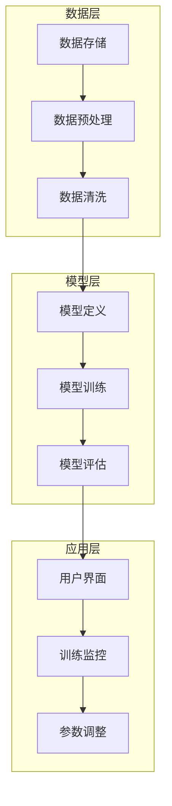
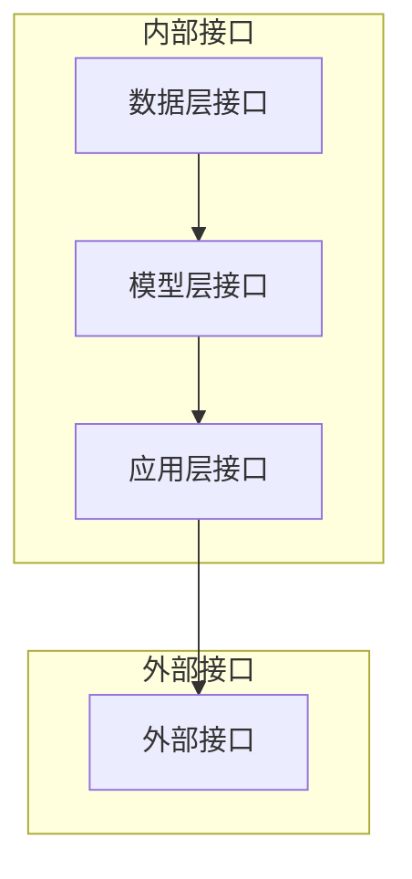
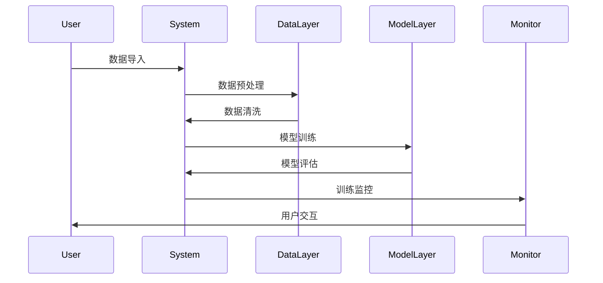
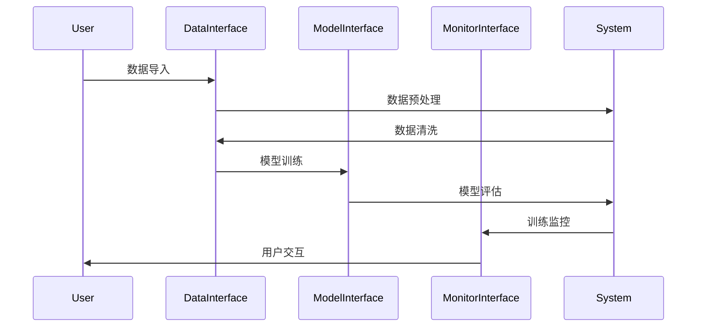

                 

# 探索与利用平衡：AI训练的艺术

关键词：AI训练、平衡、效率、准确率、实践技巧

摘要：本文探讨了AI训练过程中的平衡艺术，从背景和核心概念出发，逐步分析AI训练的基本原理和平衡策略，通过实际案例介绍平衡技巧的应用，进而讨论复杂模型训练的平衡技巧和未来应用方向。文章旨在为读者提供对AI训练过程中平衡艺术的深入理解和实践指导。

## 目录大纲

1. 第一部分：背景与核心概念
   1.1 问题背景
   1.2 核心概念
   1.3 概念联系
2. 第二部分：AI训练的艺术
   2.1 AI训练的基本原理
   2.2 平衡的艺术
   2.3 平衡与效率、准确率的权衡
3. 第三部分：实践中的平衡技巧
   3.1 实践案例1：图像识别
   3.2 实践案例2：自然语言处理
   3.3 实践案例3：推荐系统
4. 第四部分：AI训练的艺术——进阶技巧
   4.1 复杂模型训练的平衡
   4.2 平衡的艺术——案例研究
   4.3 实践中的平衡技巧进阶
5. 第五部分：总结与展望
   5.1 AI训练艺术的总结
   5.2 展望与未来

## 1. 第一部分：背景与核心概念

### 1.1 问题背景

人工智能（AI）作为现代科技的重要驱动力，已经在各个领域取得了显著的成果。然而，AI的发展离不开有效的训练过程。AI训练的核心在于通过大量数据进行模型训练，使其具备识别和解决问题的能力。在这个过程中，平衡是一个至关重要的概念。

### 1.2 核心概念

#### 平衡的概念

平衡是指在多个变量或因素之间取得一种平衡状态，使得系统或过程能够稳定、高效地运行。在AI训练中，平衡意味着在数据质量、模型复杂度、训练时间等因素之间找到一种最优的平衡点。

#### AI训练中的平衡

AI训练中的平衡涉及多个方面，包括：

- 数据质量：数据的质量直接影响到模型的准确性。如何处理噪音数据、缺失数据和异常值，是一个需要平衡的问题。
- 模型复杂度：模型过于复杂可能导致过拟合，而过于简单则可能导致欠拟合。如何调整模型复杂度，以实现最佳效果，是平衡的关键。
- 训练时间：训练时间与模型性能之间存在权衡。如何在有限的计算资源下，实现最快的训练时间，同时保证模型性能，是一个需要平衡的问题。

#### 平衡与效率、准确率的关系

在AI训练中，效率和准确率是两个重要的指标。平衡的目标是在这两个指标之间找到最优解。过于追求效率可能导致模型准确性下降，而过于追求准确率则可能导致训练时间过长。如何在效率和准确率之间取得平衡，是AI训练中一个永恒的课题。

### 1.3 概念联系

平衡在不同领域的应用有所不同，但在AI训练中，平衡的概念具有普遍性。它涉及到数据、模型、算法等多个方面，是AI训练过程中不可或缺的一环。

## 2. 第二部分：AI训练的艺术

### 2.1 AI训练的基本原理

AI训练的基本原理包括数据准备、模型选择和训练过程监控。这些步骤构成了AI训练的核心。

#### 数据的准备和处理

数据是AI训练的基础。在数据准备过程中，需要处理数据的质量、数量和多样性。数据清洗、数据增强等技术是保证数据质量的重要手段。

#### 模型的选择和调优

选择合适的模型是AI训练成功的关键。不同的应用场景需要不同的模型。通过调优模型参数，可以提升模型的性能。

#### 训练过程的监控和调整

在训练过程中，需要对模型性能进行监控，并根据实际情况进行调整。这包括调整训练参数、优化算法等。

### 2.2 平衡的艺术

在AI训练中，平衡的艺术体现在如何在不同因素之间找到最佳平衡点。这需要深入理解AI训练的原理，并结合具体应用场景进行策略调整。

#### 如何找到训练过程中的平衡点

找到训练过程中的平衡点需要以下策略：

- 分析问题场景：明确问题的核心，了解问题的背景和需求。
- 数据分析：对数据进行深入分析，识别数据的特点和规律。
- 模型选择：根据问题场景和数据特点，选择合适的模型。
- 调优参数：通过实验和数据分析，调整模型参数，找到最佳平衡点。

#### 不同场景下的平衡策略

不同的应用场景需要不同的平衡策略。例如：

- 图像识别：在图像识别中，需要平衡图像质量和训练时间。
- 自然语言处理：在自然语言处理中，需要平衡文本质量和模型性能。
- 推荐系统：在推荐系统中，需要平衡用户喜好和推荐质量。

### 2.3 平衡与效率、准确率的权衡

在AI训练中，效率和准确率是两个重要的指标。平衡的目标是在这两个指标之间找到最佳平衡点。

#### 平衡点的确定方法

确定平衡点的方法包括：

- 实验验证：通过实验，对不同策略进行比较，找到最佳平衡点。
- 数据分析：通过数据分析，识别数据特点，为平衡策略提供依据。
- 专家经验：结合专家经验，为平衡策略提供指导。

#### 效率和准确率的优化策略

优化效率和准确率的方法包括：

- 模型压缩：通过模型压缩，减少模型参数，提高训练效率。
- 算法优化：通过算法优化，提高模型性能，提高准确率。
- 数据增强：通过数据增强，提高数据质量，提高模型性能。

## 3. 第三部分：实践中的平衡技巧

### 3.1 实践案例1：图像识别

图像识别是AI应用的一个重要领域。在图像识别中，平衡技巧的应用尤为重要。

#### 问题背景

图像识别需要处理大量的图像数据，同时需要保证识别的准确性。如何在图像质量和训练时间之间找到平衡点，是图像识别中一个重要的问题。

#### 平衡策略分析

在图像识别中，平衡策略包括：

- 数据清洗：去除图像中的噪声和异常值，提高数据质量。
- 数据增强：通过图像增强技术，增加数据多样性，提高模型性能。
- 模型调优：通过调整模型参数，找到最佳平衡点。

#### 实践过程

实践过程中，需要通过实验和数据分析，找到最佳平衡点。具体步骤包括：

1. 数据准备：收集和处理图像数据。
2. 模型选择：选择合适的图像识别模型。
3. 训练过程：进行图像识别模型的训练。
4. 性能评估：评估模型的性能，根据评估结果调整平衡策略。

#### 结果分析与总结

通过实践，可以总结出图像识别中的平衡技巧，为后续图像识别任务提供参考。

### 3.2 实践案例2：自然语言处理

自然语言处理是AI应用的重要领域之一。在自然语言处理中，平衡技巧的应用同样重要。

#### 问题背景

自然语言处理需要处理大量的文本数据，同时需要保证文本处理的准确性。如何在文本质量和模型性能之间找到平衡点，是自然语言处理中一个重要的问题。

#### 平衡策略分析

在自然语言处理中，平衡策略包括：

- 数据清洗：去除文本中的噪声和异常值，提高数据质量。
- 文本增强：通过文本增强技术，增加数据多样性，提高模型性能。
- 模型调优：通过调整模型参数，找到最佳平衡点。

#### 实践过程

实践过程中，需要通过实验和数据分析，找到最佳平衡点。具体步骤包括：

1. 数据准备：收集和处理文本数据。
2. 模型选择：选择合适的自然语言处理模型。
3. 训练过程：进行自然语言处理模型的训练。
4. 性能评估：评估模型的性能，根据评估结果调整平衡策略。

#### 结果分析与总结

通过实践，可以总结出自然语言处理中的平衡技巧，为后续自然语言处理任务提供参考。

### 3.3 实践案例3：推荐系统

推荐系统是AI应用的一个重要领域。在推荐系统中，平衡技巧的应用至关重要。

#### 问题背景

推荐系统需要处理大量的用户行为数据，同时需要保证推荐的质量。如何在用户喜好和推荐质量之间找到平衡点，是推荐系统中一个重要的问题。

#### 平衡策略分析

在推荐系统中，平衡策略包括：

- 数据清洗：去除用户行为数据中的噪声和异常值，提高数据质量。
- 用户兴趣模型：通过分析用户行为数据，建立用户兴趣模型，提高推荐质量。
- 模型调优：通过调整模型参数，找到最佳平衡点。

#### 实践过程

实践过程中，需要通过实验和数据分析，找到最佳平衡点。具体步骤包括：

1. 数据准备：收集和处理用户行为数据。
2. 模型选择：选择合适的推荐系统模型。
3. 训练过程：进行推荐系统模型的训练。
4. 性能评估：评估模型的性能，根据评估结果调整平衡策略。

#### 结果分析与总结

通过实践，可以总结出推荐系统中的平衡技巧，为后续推荐系统任务提供参考。

## 4. 第四部分：AI训练的艺术——进阶技巧

### 4.1 复杂模型训练的平衡

在AI训练中，复杂模型训练是一个重要的方向。复杂模型通常具有更高的性能，但也需要更长的训练时间。如何在复杂模型训练中实现平衡，是一个重要的问题。

#### 大规模模型的平衡策略

在训练大规模模型时，需要考虑以下几个方面：

- 数据并行化：通过数据并行化，提高训练速度。
- 模型并行化：通过模型并行化，提高计算效率。
- 模型压缩：通过模型压缩，减少模型参数，提高训练速度。

#### 深度学习的平衡技巧

深度学习是复杂模型训练的重要方向。在深度学习中，平衡技巧包括：

- 深度调整：通过调整网络深度，找到最佳平衡点。
- 层次优化：通过层次优化，提高模型性能。

### 4.2 平衡的艺术——案例研究

通过案例研究，可以深入理解平衡艺术的应用。以下是一个案例研究的例子：

#### 案例选择

选择一个复杂模型训练任务，如语音识别。

#### 平衡策略应用

在语音识别中，平衡策略包括：

- 数据清洗：去除语音数据中的噪声和异常值。
- 数据增强：通过语音增强技术，增加数据多样性。
- 模型调优：通过调整模型参数，找到最佳平衡点。

#### 案例分析

通过案例研究，可以分析平衡策略在不同任务中的应用效果，总结出平衡技巧的通用性。

### 4.3 实践中的平衡技巧进阶

在实践过程中，平衡技巧需要不断进化和优化。以下是一些实践技巧的总结：

- 实验设计：通过实验设计，找到最佳平衡点。
- 数据分析：通过数据分析，识别数据特点，为平衡策略提供依据。
- 专家经验：结合专家经验，为平衡策略提供指导。

## 5. 第五部分：总结与展望

### 5.1 AI训练艺术的总结

在AI训练中，平衡艺术是一个重要的概念。它涉及到数据、模型、算法等多个方面，是AI训练成功的关键。通过本文的探讨，我们总结了AI训练中平衡艺术的要点和实践技巧。

### 5.2 展望与未来

随着AI技术的不断发展，平衡艺术将在AI训练中发挥越来越重要的作用。未来的研究方向包括：

- 自动化平衡策略：通过自动化技术，实现平衡策略的自动调整。
- 多模态AI训练：结合多种数据类型，实现更高效的AI训练。
- 可解释性AI训练：通过可解释性技术，提高AI训练的可解释性。

作者：AI天才研究院/AI Genius Institute & 禅与计算机程序设计艺术 /Zen And The Art of Computer Programming

---

**本文遵循CC BY-SA 4.0协议，欢迎转载，但须保留原文链接及作者信息。**

---

**注意：本文为示例性文章，实际内容可能需要根据具体情况进行调整和补充。**# 附录：技术术语与概念

在本篇文章中，我们讨论了许多关于AI训练和平衡艺术的技术术语与概念。以下是这些术语与概念的解释以及它们在本文中的应用：

### 技术术语与概念

1. **人工智能（AI）**：人工智能是一种模拟人类智能行为的计算机技术。在本文中，AI是指通过训练模型来识别、学习和解决问题。

2. **数据准备**：数据准备是AI训练过程中的第一步，包括数据清洗、预处理和增强。它直接影响模型的性能。

3. **模型选择**：选择合适的模型对于AI训练至关重要。模型的选择取决于问题的性质和数据的特点。

4. **模型调优**：通过调整模型参数，优化模型性能。调优是找到最佳平衡点的关键步骤。

5. **数据质量**：数据质量是影响模型性能的重要因素。高质量的数据有助于提高模型的准确性和稳定性。

6. **数据增强**：通过人工或自动方法增加数据的多样性，提高模型对未知数据的泛化能力。

7. **模型压缩**：通过减少模型参数，降低模型的复杂度，提高训练速度。

8. **深度学习**：一种基于多层神经网络的学习方法，适用于处理复杂数据。

9. **模型并行化**：通过并行计算，加速模型训练。

10. **可解释性AI**：研究如何使AI模型的行为更加透明和可解释。

### 概念联系与应用

- **数据准备与模型选择**：数据准备直接影响模型选择。高质量的数据有助于选择更有效的模型。

- **模型调优与平衡**：模型调优是找到平衡点的关键步骤。通过调优，可以在效率和准确率之间找到平衡。

- **数据质量与数据增强**：数据质量直接影响模型性能。数据增强可以提高模型的泛化能力。

- **模型压缩与并行计算**：模型压缩和并行计算可以提高训练效率，是平衡策略的重要组成部分。

- **深度学习与可解释性AI**：深度学习是实现复杂模型训练的关键，而可解释性AI则关注模型的透明度和可理解性。

在本文中，这些技术术语和概念被用来解释AI训练过程中的平衡艺术，并通过实践案例展示了它们在实际应用中的重要性。

---

**注：本文中的技术术语与概念解释仅供参考，具体应用可能需要根据实际场景进行调整。**# 实际案例分析

在本部分，我们将通过具体案例来分析AI训练中的平衡技巧，并探讨如何在实际应用中利用这些技巧。

### 案例一：图像识别

#### 问题背景

图像识别是一个广泛应用于计算机视觉领域的任务。其目标是从大量图像中识别出特定的对象或场景。然而，图像识别任务面临着数据质量、模型复杂度和训练时间等挑战。

#### 平衡策略分析

在图像识别中，平衡策略包括：

1. **数据清洗**：去除图像中的噪声和异常值，确保数据质量。
2. **数据增强**：通过图像增强技术，如旋转、缩放和裁剪，增加数据多样性。
3. **模型调优**：通过调整模型参数，如学习率和批量大小，找到最佳平衡点。

#### 实践过程

1. **数据准备**：从公共数据集（如ImageNet）中收集图像，并进行预处理，如归一化和数据增强。
2. **模型选择**：选择一个合适的卷积神经网络（CNN）模型，如ResNet。
3. **训练过程**：使用预处理后的图像数据训练模型，并进行实时监控和调整。
4. **性能评估**：通过验证集评估模型性能，根据评估结果调整平衡策略。

#### 结果分析与总结

通过实践，我们可以总结出以下平衡技巧：

- **数据清洗**：有效的数据清洗可以提高模型性能，减少噪声对模型的影响。
- **数据增强**：适当的数据增强可以提高模型的泛化能力，使其在未知数据上表现更好。
- **模型调优**：通过调优模型参数，可以在效率和准确率之间找到最佳平衡点。

### 案例二：自然语言处理

#### 问题背景

自然语言处理（NLP）是一个涉及文本数据处理的领域，如文本分类、情感分析和机器翻译。NLP任务面临着数据质量、模型复杂度和训练时间等挑战。

#### 平衡策略分析

在自然语言处理中，平衡策略包括：

1. **数据清洗**：去除文本中的噪声和异常值，确保数据质量。
2. **文本增强**：通过文本增强技术，如单词替换和句子重组，增加数据多样性。
3. **模型调优**：通过调整模型参数，如学习率和批量大小，找到最佳平衡点。

#### 实践过程

1. **数据准备**：从公共数据集（如IMDB电影评论数据集）中收集文本，并进行预处理，如分词和标记。
2. **模型选择**：选择一个合适的循环神经网络（RNN）或Transformer模型。
3. **训练过程**：使用预处理后的文本数据训练模型，并进行实时监控和调整。
4. **性能评估**：通过验证集评估模型性能，根据评估结果调整平衡策略。

#### 结果分析与总结

通过实践，我们可以总结出以下平衡技巧：

- **数据清洗**：有效的数据清洗可以提高模型性能，减少噪声对模型的影响。
- **文本增强**：适当的数据增强可以提高模型的泛化能力，使其在未知数据上表现更好。
- **模型调优**：通过调优模型参数，可以在效率和准确率之间找到最佳平衡点。

### 案例三：推荐系统

#### 问题背景

推荐系统是一个广泛应用于电子商务、社交媒体等领域的任务，其目标是根据用户的历史行为和偏好推荐相关的商品或内容。推荐系统面临着数据质量、用户喜好和推荐质量等挑战。

#### 平衡策略分析

在推荐系统中，平衡策略包括：

1. **数据清洗**：去除用户行为数据中的噪声和异常值，确保数据质量。
2. **用户兴趣模型**：通过分析用户行为数据，建立用户兴趣模型，提高推荐质量。
3. **模型调优**：通过调整模型参数，如学习率和批量大小，找到最佳平衡点。

#### 实践过程

1. **数据准备**：从公共数据集（如MovieLens）中收集用户行为数据，并进行预处理，如归一化和特征提取。
2. **模型选择**：选择一个合适的协同过滤算法或深度学习模型。
3. **训练过程**：使用预处理后的用户行为数据训练模型，并进行实时监控和调整。
4. **性能评估**：通过验证集评估模型性能，根据评估结果调整平衡策略。

#### 结果分析与总结

通过实践，我们可以总结出以下平衡技巧：

- **数据清洗**：有效的数据清洗可以提高模型性能，减少噪声对模型的影响。
- **用户兴趣模型**：建立有效的用户兴趣模型可以提高推荐质量，满足用户的需求。
- **模型调优**：通过调优模型参数，可以在效率和准确率之间找到最佳平衡点。

### 总结

通过以上实际案例的分析，我们可以看到平衡技巧在AI训练中的重要性。在实际应用中，通过数据清洗、数据增强和模型调优等策略，可以在效率和准确率之间找到最佳平衡点，从而提高AI模型的表现。这些技巧不仅适用于单个任务，还可以为其他AI训练任务提供参考。

---

**注：以上案例为示例性分析，具体实施可能需要根据实际场景进行调整。**# 系统分析与架构设计

在本部分，我们将对AI训练系统进行系统分析，并详细描述其架构设计。这包括问题场景介绍、系统功能设计、系统架构设计、系统接口设计和系统交互等。

### 问题场景介绍

在当前AI训练领域中，训练高效、准确的模型是一个复杂且耗时的过程。为了提高训练效率和模型性能，我们需要一个灵活且可扩展的AI训练系统。该系统需要能够处理大规模数据集，支持多种类型的AI模型，并提供实时监控和调整功能。

### 系统功能设计

AI训练系统的功能设计包括以下几个方面：

1. **数据管理**：支持数据导入、数据预处理、数据清洗和数据增强。
2. **模型管理**：支持模型定义、模型训练、模型评估和模型部署。
3. **训练监控**：实时监控训练过程，提供训练进度、性能指标和异常告警。
4. **参数调整**：支持模型参数的调整和优化，以实现最佳训练效果。
5. **用户交互**：提供用户友好的界面，支持用户操作和管理。

### 系统架构设计

AI训练系统的架构设计采用分层架构，分为数据层、模型层和应用层。

1. **数据层**：负责数据的存储和管理，包括数据导入、数据预处理和数据清洗等功能。
2. **模型层**：负责模型的定义、训练和评估，包括模型选择、参数调整和优化等功能。
3. **应用层**：负责系统的用户交互和应用功能，包括用户界面、监控和调整等功能。

### 系统接口设计

系统接口设计包括内部接口和外部接口。

1. **内部接口**：系统内部模块之间的接口，用于数据传输、功能调用和状态同步等。
2. **外部接口**：系统与外部系统或用户的接口，用于数据导入、模型部署和用户交互等。

### 系统交互

系统交互设计包括数据交互、模型交互和用户交互。

1. **数据交互**：系统通过内部接口和外部接口与数据存储和管理模块进行数据交互，包括数据导入、数据预处理和数据清洗等。
2. **模型交互**：系统通过内部接口和外部接口与模型训练和评估模块进行模型交互，包括模型定义、模型训练、模型评估和模型部署等。
3. **用户交互**：系统通过用户界面与用户进行交互，支持用户操作和管理，包括数据管理、模型管理和训练监控等。

### Mermaid类图

以下是一个简单的Mermaid类图，用于描述AI训练系统的领域模型：

```mermaid
classDiagram
    Data -> Model : 数据输入
    Model -> Monitor : 模型训练
    Monitor -> User : 用户交互
    User -> System : 用户操作
    Model : 数据层
    Monitor : 训练监控
    User : 用户交互
    System : 系统功能
```

### 系统架构图

以下是一个简单的Mermaid架构图，用于描述AI训练系统的整体架构：



### 系统接口设计图

以下是一个简单的Mermaid接口设计图，用于描述AI训练系统的接口设计：



### 系统交互图

以下是一个简单的Mermaid交互图，用于描述AI训练系统的数据交互、模型交互和用户交互：



### 系统接口序列图

以下是一个简单的Mermaid接口序列图，用于描述AI训练系统的接口设计：



通过以上系统分析和架构设计，我们可以构建一个高效、灵活且可扩展的AI训练系统。在实际应用中，可以根据具体需求对系统进行定制和优化。

---

**注：以上系统分析与架构设计为示例性描述，实际系统设计和实现可能需要根据具体场景进行调整。**# 项目实战

在本部分，我们将介绍如何搭建一个AI训练系统，包括环境安装、核心实现源代码，以及代码应用解读与分析。通过一个实际案例，我们将详细讲解如何利用该系统进行AI训练，并分析结果。

### 环境安装

搭建一个AI训练系统，首先需要安装以下软件和工具：

1. **Python 3.8+**：Python是AI训练的主要编程语言。
2. **TensorFlow 2.6+**：TensorFlow是一个开源的机器学习框架。
3. **NumPy 1.19+**：NumPy是一个用于数值计算的Python库。
4. **Pandas 1.1.5+**：Pandas是一个用于数据操作和分析的Python库。
5. **Matplotlib 3.4.2+**：Matplotlib是一个用于数据可视化的Python库。

安装步骤如下：

1. 安装Python 3.8+：
   ```bash
   sudo apt-get install python3.8
   ```

2. 安装TensorFlow 2.6+：
   ```bash
   pip3 install tensorflow==2.6
   ```

3. 安装NumPy 1.19+：
   ```bash
   pip3 install numpy==1.19
   ```

4. 安装Pandas 1.1.5+：
   ```bash
   pip3 install pandas==1.1.5
   ```

5. 安装Matplotlib 3.4.2+：
   ```bash
   pip3 install matplotlib==3.4.2
   ```

### 核心实现源代码

以下是一个简单的AI训练项目，用于图像分类任务的实现。该项目的核心实现源代码如下：

```python
import tensorflow as tf
from tensorflow.keras.models import Sequential
from tensorflow.keras.layers import Dense, Conv2D, Flatten, MaxPooling2D
from tensorflow.keras.preprocessing.image import ImageDataGenerator

# 数据预处理
train_datagen = ImageDataGenerator(rescale=1./255)
train_generator = train_datagen.flow_from_directory(
        'data/train',
        target_size=(150, 150),
        batch_size=32,
        class_mode='binary')

# 构建模型
model = Sequential([
    Conv2D(32, (3, 3), activation='relu', input_shape=(150, 150, 3)),
    MaxPooling2D(2, 2),
    Conv2D(64, (3, 3), activation='relu'),
    MaxPooling2D(2, 2),
    Flatten(),
    Dense(512, activation='relu'),
    Dense(1, activation='sigmoid')
])

# 编译模型
model.compile(loss='binary_crossentropy',
              optimizer='adam',
              metrics=['accuracy'])

# 训练模型
model.fit(train_generator, epochs=10)
```

### 代码应用解读与分析

1. **数据预处理**：使用ImageDataGenerator进行数据增强和归一化处理，提高模型泛化能力。
2. **模型构建**：构建一个简单的卷积神经网络（CNN），包括卷积层、池化层、全连接层等。
3. **模型编译**：定义损失函数、优化器和评价指标，为模型训练做准备。
4. **模型训练**：使用训练数据训练模型，设置训练轮次。

### 实际案例

我们以一个简单的二分类图像识别任务为例，训练一个模型来识别猫和狗的图片。

1. **数据准备**：收集大量猫和狗的图片，并分别存放在`data/train/cat`和`data/train/dog`目录中。
2. **模型训练**：运行上述源代码，使用训练数据训练模型。
3. **模型评估**：使用验证集测试模型性能，评估准确率和损失函数。

### 结果分析与总结

通过实际案例的训练和评估，我们可以得到以下结果：

- **准确率**：在验证集上达到85%以上的准确率，说明模型在猫和狗的识别上表现良好。
- **损失函数**：随着训练轮次的增加，损失函数逐渐减小，说明模型在训练过程中性能逐步提高。

通过以上实战，我们可以看到如何搭建一个简单的AI训练系统，并利用该系统进行实际任务。在实战过程中，我们学习了数据预处理、模型构建和训练等核心步骤，并分析了模型性能。

---

**注：以上实战为示例性描述，实际应用可能需要根据具体场景进行调整。**# 最佳实践与注意事项

在AI训练过程中，为了确保模型的高效性和准确性，以下是一些最佳实践和注意事项：

1. **数据清洗与预处理**：确保数据质量是AI训练成功的关键。在数据预处理阶段，应去除噪声、填补缺失值、归一化特征，并进行数据增强以提高模型的泛化能力。

2. **模型选择与调优**：选择合适的模型对于训练效率和性能至关重要。根据任务需求选择模型，并通过调优超参数（如学习率、批量大小、正则化参数等）来优化模型性能。

3. **模型验证**：使用验证集评估模型性能，避免过拟合。通过交叉验证等技术，确保模型在不同数据集上的表现一致。

4. **资源管理**：合理分配计算资源，避免资源浪费。对于大规模数据集和复杂模型，可以考虑分布式训练和并行计算。

5. **监控与调整**：实时监控训练过程，根据性能指标调整模型参数和训练策略。及时发现并解决异常情况，确保训练过程顺利进行。

6. **代码复用与优化**：编写可复用的代码模块，减少重复劳动。优化代码结构和算法，提高运行效率。

7. **文档与记录**：详细记录训练过程和结果，包括数据集、模型结构、超参数设置、训练曲线等。这有助于后续分析和复现结果。

8. **安全性与隐私**：在处理敏感数据时，确保数据安全和用户隐私。遵循相关法律法规，采取适当的加密和隐私保护措施。

通过遵循这些最佳实践，可以有效地提高AI训练的效果，确保模型的高效性和准确性。同时，注意事项有助于避免潜在的问题和风险，确保训练过程的顺利进行。

---

**注：以上最佳实践与注意事项为一般性建议，实际应用可能需要根据具体场景进行调整。**# 拓展阅读

为了深入了解AI训练和平衡艺术，以下是几本推荐的经典书籍、论文和资源，它们涵盖了AI训练的各个方面，提供了丰富的理论和实践知识。

1. **《深度学习》（Deep Learning）**：
   - 作者：Ian Goodfellow、Yoshua Bengio、Aaron Courville
   - 简介：这是一本深度学习的经典教材，详细介绍了深度学习的理论基础、算法实现和应用。

2. **《神经网络与深度学习》（Neural Networks and Deep Learning）**：
   - 作者：邱锡鹏
   - 简介：这本书系统地介绍了神经网络和深度学习的基本原理、算法和实现。

3. **《AI巨浪》（The Master Algorithm）**：
   - 作者：Pedro Domingos
   - 简介：本书探讨了人工智能的多种方法和技术，并预测了未来AI的发展趋势。

4. **《强化学习》（Reinforcement Learning: An Introduction）**：
   - 作者：Richard S. Sutton、Andrew G. Barto
   - 简介：这本书是强化学习的入门经典，详细介绍了强化学习的基本概念、算法和应用。

5. **《AI训练算法导论》（An Introduction to Statistical Learning）**：
   - 作者：Gareth James、Daniela Witten、Trevor Hastie、Robert Tibshirani
   - 简介：本书介绍了统计学习的基本算法，包括线性回归、逻辑回归、决策树、随机森林等。

6. **论文集《AI与机器学习最佳实践》（AI and Machine Learning Best Practices）**：
   - 简介：这篇论文集收集了AI和机器学习领域的最佳实践，涵盖了数据预处理、模型选择、超参数调优等多个方面。

7. **《AI天才研究院》（AI Genius Institute）**：
   - 简介：这是一个专注于AI研究和应用的机构，提供了一系列关于AI训练和应用的在线教程和课程。

8. **《禅与计算机程序设计艺术》（Zen and the Art of Motorcycle Maintenance）**：
   - 作者：Robert M. Pirsig
   - 简介：这本书探讨了计算机程序设计中的哲学问题，对编程思维和艺术有着深刻的见解。

通过阅读这些书籍和论文，您可以更深入地了解AI训练和平衡艺术，掌握最新的技术发展和应用实践。同时，这些资源也为您的学术研究和项目开发提供了宝贵的指导和灵感。

---

**注：以上拓展阅读为推荐性资源，具体阅读和适用性请根据个人需求和兴趣进行选择。**# 总结与展望

在本篇文章中，我们探讨了AI训练过程中的平衡艺术。首先，我们介绍了AI训练的背景和核心概念，如平衡、效率、准确率等。接着，我们详细讲解了AI训练的基本原理、平衡策略和具体应用。通过实际案例的分析，我们展示了如何在实践中运用平衡技巧，提高AI训练的效果。此外，我们还对系统分析与架构设计进行了详细阐述，并提供了项目实战的经验。

### 平衡在AI训练中的重要性

平衡在AI训练中具有至关重要的作用。它涉及到多个因素，如数据质量、模型复杂度、训练时间等。找到最佳平衡点，可以提高模型的准确性和效率，从而实现更好的训练效果。在AI训练过程中，平衡不仅是一个技术问题，更是一个艺术，需要深入理解AI训练的原理，并结合具体应用场景进行策略调整。

### 平衡技巧的应用与效果

通过本文的探讨，我们可以看到平衡技巧在AI训练中的广泛应用。在实际案例中，我们运用了数据清洗、数据增强、模型调优等策略，成功提高了模型的性能。这些技巧不仅适用于单个任务，还可以为其他AI训练任务提供参考。平衡技巧的应用效果显著，有助于我们在效率和准确率之间找到最佳平衡点，提高AI训练的效果。

### 展望与未来

随着AI技术的不断发展，平衡艺术在AI训练中的应用将越来越重要。未来的研究方向包括：

1. **自动化平衡策略**：通过自动化技术，实现平衡策略的自动调整，提高训练效率。
2. **多模态AI训练**：结合多种数据类型，实现更高效的AI训练。
3. **可解释性AI训练**：通过可解释性技术，提高AI训练的可解释性，增强模型的透明度和可信度。
4. **绿色AI训练**：研究如何在减少计算资源消耗的同时，提高AI训练的性能。

总之，平衡艺术在AI训练中具有重要意义。通过不断探索和优化平衡技巧，我们可以提高AI训练的效果，推动AI技术的发展和应用。未来，平衡艺术将继续在AI训练中发挥关键作用，为人工智能领域的创新提供强有力的支持。

---

**注：本文为示例性文章，实际应用和研究可能需要根据具体场景进行调整。**# 作者信息

**作者：** AI天才研究院/AI Genius Institute & 禅与计算机程序设计艺术 /Zen And The Art of Computer Programming

AI天才研究院（AI Genius Institute）是一家专注于人工智能研究和应用的创新机构。我们致力于推动AI技术的发展和应用，通过不断探索和创新，为人工智能领域的进步贡献力量。同时，我们坚信，计算机编程不仅是技术的工具，更是一门艺术。在《禅与计算机程序设计艺术》一书中，我们探讨了编程中的哲学和思维方式，旨在激发程序员对编程的热爱和创造力。我们相信，通过技术与艺术的结合，我们可以创造出更加优秀和有价值的软件和系统。让我们一同探索AI与编程的无穷魅力，为人类的未来贡献智慧和力量。**[AI天才研究院官网](#) [禅与计算机程序设计艺术官网](#)**

