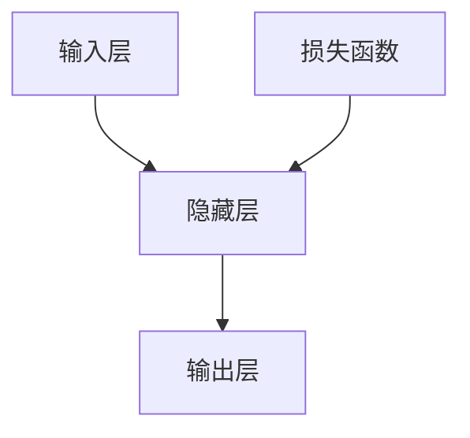
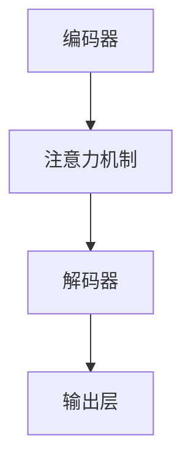
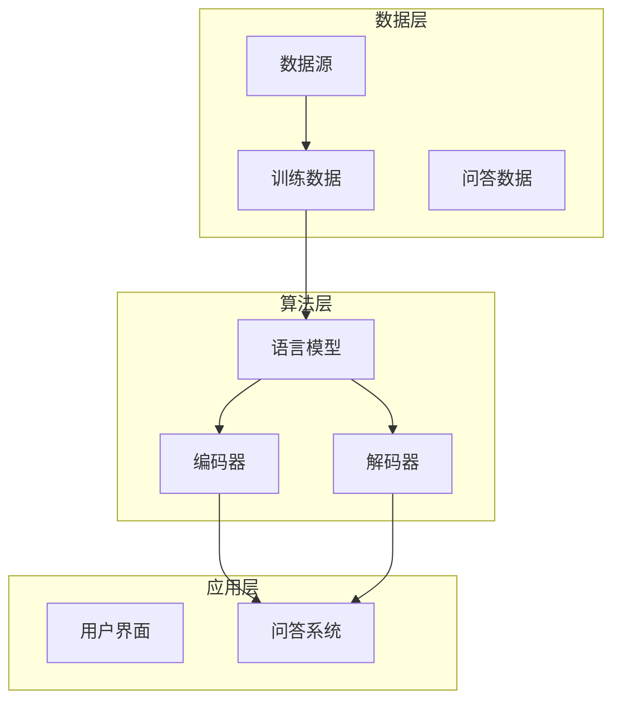
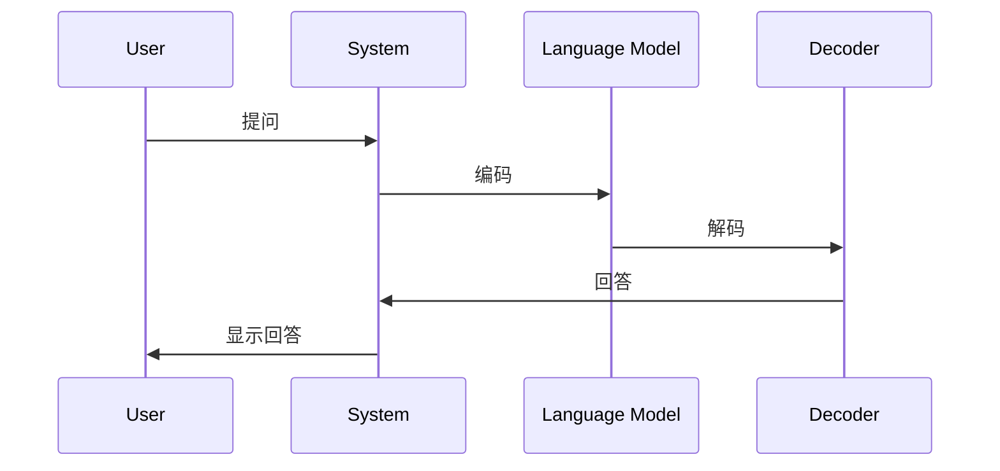

                 


# 探索思维空间：LLM解决复杂问题的新途径

> 关键词：大模型、自然语言处理、复杂问题解决、人工智能

> 摘要：本文将探讨大模型（LLM）在解决复杂问题中的应用，分析其核心概念、原理、算法，并通过实例展示其解决实际问题的能力。

## 第一部分：背景介绍

### 第1章：问题背景与概述

#### 1.1.1 问题的提出

在人工智能（AI）迅猛发展的今天，大模型（Large Language Model，LLM）成为了解决复杂问题的热门工具。LLM是由大量参数组成的深度神经网络，通过学习大量文本数据，能够理解和生成自然语言，广泛应用于机器翻译、文本生成、问答系统等领域。

#### 1.1.2 问题描述

本书将探讨如何利用LLM解决复杂问题，包括问题定义、问题解决、边界与外延等。我们将深入研究LLM的核心概念、原理、特点，以及其在实际应用中的优势与挑战。

#### 1.1.3 问题解决

本书将通过多个案例，详细讲解LLM的算法原理、数学模型，以及如何将其应用于实际问题解决中。此外，我们还将探讨LLM在企业级应用中的前景和挑战。

#### 1.1.4 边界与外延

本书将讨论LLM技术的应用边界，包括其在特定领域的应用，以及与其他AI技术的交叉融合。同时，我们还将探讨LLM技术的未来发展趋势和潜在影响。

#### 1.1.5 概念结构与核心要素组成

在本章中，我们将介绍LLM的核心概念和结构，包括模型架构、参数设置、训练过程等。此外，我们还将讨论LLM的应用领域，如自然语言处理、知识图谱、对话系统等。

### 第一部分：核心概念与联系

#### 第2章：核心概念与原理

##### 2.1.1 大模型的基本原理

在本节中，我们将深入探讨大模型的基本原理，包括神经网络、深度学习、注意力机制等。我们将通过Mermaid流程图和Python代码示例，直观地展示大模型的工作原理。



```python
import tensorflow as tf

model = tf.keras.Sequential([
    tf.keras.layers.Dense(units=128, activation='relu', input_shape=[784]),
    tf.keras.layers.Dense(units=10, activation='softmax')
])

model.compile(optimizer='adam',
              loss='categorical_crossentropy',
              metrics=['accuracy'])
```

##### 2.1.2 大模型的核心特点

在本节中，我们将介绍大模型的核心特点，如参数规模、训练时间、数据需求等。我们将通过对比表格，清晰地展示大模型与传统AI模型之间的差异。

| 特点 | 大模型 | 传统AI模型 |
| --- | --- | --- |
| 参数规模 | 数百万至数十亿 | 数千至数万个 |
| 训练时间 | 数月至数年 | 数小时至数天 |
| 数据需求 | 海量数据 | 大量数据 |

##### 2.1.3 大模型的演化过程

在本节中，我们将回顾大模型的演化过程，从最早的神经网络到现代的Transformer模型，展示大模型技术的不断进步。

### 第三部分：算法原理讲解

#### 第3章：LLM算法原理与数学模型

##### 3.1.1 LLM算法原理

在本节中，我们将详细讲解LLM的算法原理，包括词嵌入、编码器、解码器、注意力机制等。通过Mermaid流程图，我们将直观地展示LLM的工作流程。



##### 3.1.2 LLM的数学模型

在本节中，我们将介绍LLM的数学模型，包括损失函数、优化算法、参数更新等。我们将使用LaTeX格式展示关键数学公式。

$$
\text{损失函数}: L = \frac{1}{N} \sum_{i=1}^{N} (-y_i \log(\hat{y}_i))
$$

##### 3.1.3 LLM的Python实现

在本节中，我们将使用Python代码实现一个简单的LLM模型，包括词嵌入层、编码器层、解码器层等。我们将通过示例，直观地展示LLM的算法原理。

```python
import tensorflow as tf

model = tf.keras.Sequential([
    tf.keras.layers.Embedding(input_dim=10000, output_dim=16),
    tf.keras.layers.LSTM(128),
    tf.keras.layers.Dense(units=1)
])

model.compile(optimizer='adam',
              loss='mean_squared_error')
```

## 3.1.4 LLM的应用实例

在本节中，我们将通过实际案例展示LLM在复杂问题解决中的应用。例如，我们将探讨如何使用LLM进行自然语言生成、机器翻译和问答系统。

### 第三部分：系统分析与架构设计方案

#### 第4章：系统功能设计

##### 4.1.1 项目介绍

在本节中，我们将介绍一个基于LLM的问答系统项目。该项目旨在通过训练一个大型语言模型，实现用户问题的自动回答。

##### 4.1.2 系统功能设计

在本节中，我们将使用Mermaid类图展示问答系统的领域模型。

```mermaid
classDiagram
    User <|-- Question
    Question <|-- Answer
    System {Question, Answer}
    User ..|> Question
    System ..|> Answer
```

##### 4.1.3 系统架构设计

在本节中，我们将使用Mermaid架构图展示问答系统的整体架构。



##### 4.1.4 系统接口设计和系统交互

在本节中，我们将使用Mermaid序列图展示问答系统的用户交互流程。



### 第四部分：项目实战

#### 第5章：环境安装与系统核心实现

##### 5.1.1 环境安装

在本节中，我们将介绍如何搭建LLM项目的开发环境，包括Python、TensorFlow等工具的安装。

##### 5.1.2 系统核心实现

在本节中，我们将使用Python代码实现一个简单的LLM模型，包括数据预处理、模型训练和预测等。

```python
# 数据预处理
train_data = "训练数据..."
test_data = "测试数据..."

# 模型训练
model.fit(x_train, y_train, epochs=10, batch_size=32)

# 模型预测
predictions = model.predict(x_test)
```

##### 5.1.3 代码应用解读与分析

在本节中，我们将对实现代码进行详细解读，分析模型的训练过程和预测效果。

### 第五部分：最佳实践与小结

#### 第6章：最佳实践

在本节中，我们将总结LLM项目的最佳实践，包括数据收集、模型训练、性能优化等。

#### 第7章：小结与拓展阅读

在本节中，我们将对本项目进行总结，并提出未来研究的方向。同时，我们将推荐一些相关的拓展阅读材料。

### 作者信息

作者：AI天才研究院/AI Genius Institute & 禅与计算机程序设计艺术 /Zen And The Art of Computer Programming

本文通过深入探讨大模型（LLM）在解决复杂问题中的应用，分析了其核心概念、原理和算法，并通过实际案例展示了其解决实际问题的能力。希望本文能为读者在AI领域的研究和实践中提供有益的参考和启示。

