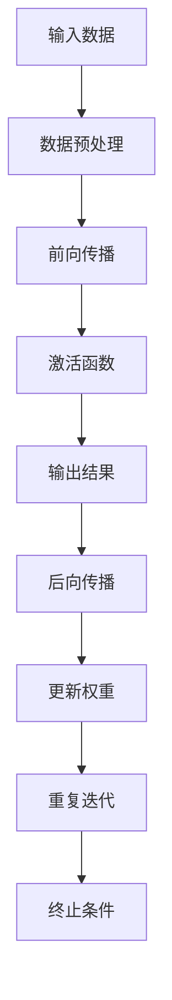
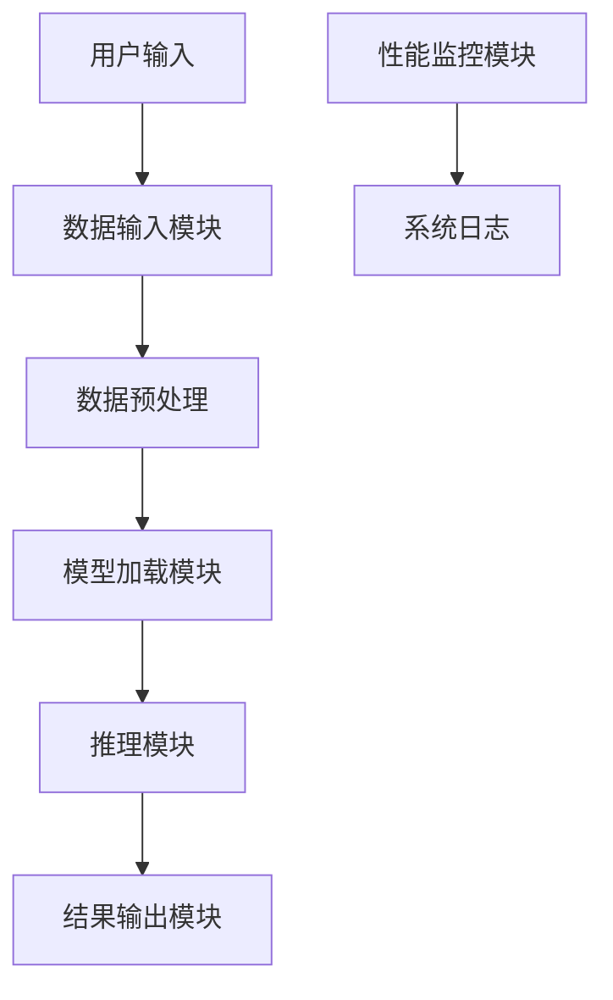
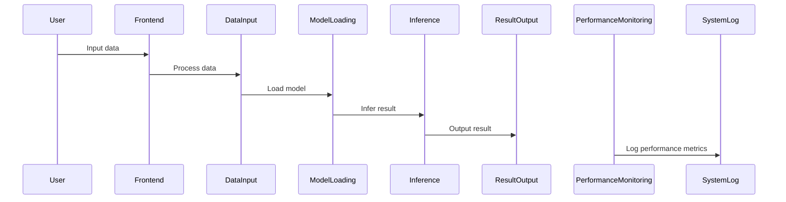
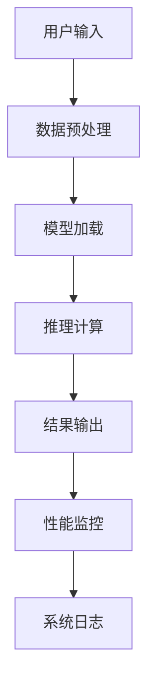
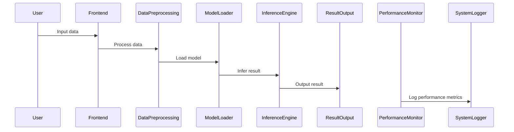

                 

# 推理时间与模型性能：寻找最佳平衡点

> 关键词：推理时间、模型性能、最佳平衡点、人工智能、算法优化、系统架构设计

> 摘要：本文深入探讨了人工智能领域中推理时间与模型性能之间的关系，分析了影响这两者的因素，并提出了寻找最佳平衡点的方法。通过具体案例分析，文章展示了如何在实际项目中实现这一目标，为人工智能应用提供了有价值的参考。

## 目录大纲

**《推理时间与模型性能：寻找最佳平衡点》**

----------------------------------------------------------------

## 第一部分: 背景介绍

### 第1章: 问题背景与核心概念

#### 1.1.1 问题的提出

#### 1.1.2 核心概念

#### 1.1.3 边界与外延

#### 1.1.4 概念结构与核心要素组成

## 第二部分: 核心概念与联系

### 第2章: 推理时间与模型性能的关系

#### 2.1.1 推理时间的影响因素

#### 2.1.2 模型性能的评估指标

#### 2.1.3 概念属性特征对比表格

### 第3章: ER实体关系图架构

#### 3.1.1 概念

#### 3.1.2 架构图

## 第三部分: 算法原理讲解

### 第4章: 算法原理与流程图

### 第5章: Python源代码与实践

### 第6章: 系统分析与架构设计

### 第7章: 系统功能设计与架构

### 第8章: 系统接口设计与交互

## 第四部分: 项目实战

### 第9章: 环境安装与系统实现

### 第10章: 系统核心实现

### 第11章: 代码应用解读与分析

### 第12章: 实际案例分析与详细讲解剖析

### 第13章: 项目小结

## 第五部分: 最佳实践与拓展阅读

### 第14章: 最佳实践 tips

### 第15章: 小结

### 第16章: 注意事项

### 第17章: 拓展阅读

----------------------------------------------------------------## 第一部分: 背景介绍

### 第1章: 问题背景与核心概念

#### 1.1.1 问题的提出

在人工智能（AI）迅猛发展的今天，模型性能和推理时间是两个备受关注的核心问题。模型性能通常指的是模型在特定任务上的准确度、效率等指标，而推理时间则是指模型从接收输入到输出结果所需的时间。随着AI应用场景的日益广泛，如何在保证模型性能的前提下，尽可能减少推理时间，成为了亟需解决的问题。

目前，人工智能在很多领域已经取得了显著的成果，如图像识别、语音识别、自然语言处理等。然而，在实际应用中，模型的推理速度往往无法满足实时性要求，尤其是在需要高并发处理的场景中。例如，自动驾驶系统需要在极短的时间内对周围环境进行感知和决策，如果推理时间过长，将可能导致严重的安全事故。

此外，随着深度学习模型的复杂度不断增加，模型训练所需的计算资源和时间也在急剧增加。而推理时间与训练时间之间的矛盾，使得在实际部署中，常常需要在模型性能和推理时间之间做出权衡。

因此，本文旨在探讨如何平衡推理时间与模型性能，寻找最佳平衡点，为人工智能应用提供有效参考。

#### 1.1.2 核心概念

1. **推理时间**：推理时间是指从模型接收到输入数据开始，到输出结果所需的时间。它通常受到算法选择、超参数设置、硬件配置等因素的影响。

2. **模型性能**：模型性能是指模型在特定任务上的表现，如准确率、效率等。它通常受到模型架构、训练数据质量、超参数调优等因素的影响。

3. **最佳平衡点**：最佳平衡点是指在保证模型性能的前提下，尽量减少推理时间，达到两者之间的最优组合。

#### 1.1.3 边界与外延

1. **硬件环境对推理时间的影响**：硬件环境是影响推理时间的重要因素。高性能的硬件设备可以显著降低推理时间。例如，GPU和TPU等专门为深度学习设计的高性能硬件，可以大幅提升模型推理速度。

2. **数据规模对模型性能的影响**：数据规模是影响模型性能的关键因素。大量的训练数据可以提升模型的泛化能力，从而提高模型性能。然而，数据规模过大也可能导致模型训练时间过长，影响推理时间。

3. **应用场景对两者平衡的要求**：不同的应用场景对推理时间和模型性能的要求各不相同。例如，实时语音识别系统要求高推理速度，而医学影像诊断系统则更注重模型准确度。

#### 1.1.4 概念结构与核心要素组成

1. **推理时间**：

   - 算法复杂度：推理算法的复杂度是影响推理时间的重要因素。高效的算法可以显著降低推理时间。
   - 硬件性能：硬件性能直接影响推理时间。高性能的硬件设备可以更快地完成推理任务。
   - 数据预处理：数据预处理是提高推理速度的关键步骤。有效的数据预处理可以减少模型训练和推理的时间。

2. **模型性能**：

   - 模型架构：模型架构是影响模型性能的核心因素。合理的模型架构可以提升模型的准确度和效率。
   - 超参数调优：超参数调优是提升模型性能的重要手段。合理的超参数设置可以使模型达到最佳性能。
   - 训练数据：训练数据的质量直接影响模型的泛化能力。高质量的训练数据可以提升模型性能。

通过以上分析，我们可以看出，推理时间和模型性能是人工智能领域中两个相互制约的因素。在实际应用中，需要在两者之间找到最佳平衡点，以满足不同场景下的需求。

### 第2章: 核心概念与联系

在深入探讨推理时间与模型性能的关系之前，首先需要明确这两者的核心概念及其相互联系。

#### 2.1.1 推理时间的影响因素

推理时间受到多种因素的影响，主要包括算法选择、超参数设置和硬件配置。

1. **算法选择**：

   - **算法效率**：不同的算法在执行相同任务时，其效率有所不同。高效的算法可以在较短的时间内完成推理任务。
   - **算法复杂度**：算法的复杂度直接影响推理时间。算法复杂度越高，推理时间越长。

2. **超参数设置**：

   - **激活函数**：激活函数是神经网络中的一个重要参数，它决定了神经网络输出层的输出。不同的激活函数对推理时间有不同的影响。
   - **学习率**：学习率是神经网络训练中的一个关键参数，它决定了神经网络在训练过程中对权值进行调整的速度。学习率过大或过小都会影响推理时间。

3. **硬件配置**：

   - **CPU与GPU**：CPU（中央处理器）和GPU（图形处理器）是两种常见的硬件配置。GPU在处理并行任务时具有更高的效率，因此可以显著降低推理时间。
   - **TPU**：TPU（张量处理器）是专为深度学习设计的硬件，其计算能力远超CPU和GPU，可以大幅降低推理时间。

#### 2.1.2 模型性能的评估指标

模型性能的评估指标主要包括准确率、召回率、F1值等。

1. **准确率**：准确率是指模型预测正确的样本数量占总样本数量的比例。准确率越高，模型性能越好。

2. **召回率**：召回率是指模型预测正确的样本数量与实际为正类的样本数量的比例。召回率越高，模型性能越好。

3. **F1值**：F1值是准确率和召回率的调和平均，它是评估二分类模型性能的重要指标。F1值越高，模型性能越好。

除了上述指标，模型性能还受到运行时间、内存占用等因素的影响。运行时间是指模型从输入到输出所需的时间，内存占用是指模型在推理过程中所占用的内存空间。低运行时间和低内存占用意味着模型性能较好。

#### 2.1.3 概念属性特征对比表格

为了更直观地理解推理时间和模型性能的概念及其属性特征，我们通过以下对比表格进行展示：

| 指标       | 推理时间                         | 模型性能                          |
| ---------- | -------------------------------- | -------------------------------- |
| 正面特征   | 快速响应                         | 高准确度、高效率                  |
| 负面特征   | 延迟响应                         | 低准确度、高资源消耗              |
| 边界特征   | 实时应用                         | 模型优化                          |

#### 2.1.4 ER实体关系图架构

为了更好地理解推理时间与模型性能之间的相互关系，我们可以通过ER（实体-关系）图来展示。

实体：

- **推理时间**：表示模型从输入到输出所需的时间。
- **模型性能**：表示模型在特定任务上的表现。

关系：

- **影响**：表示推理时间和模型性能之间的相互影响。

ER图如下所示：

```mermaid
erDiagram
  ModelPerformance ||--|{ 推理时间 : 推理需求 }
  ModelPerformance ||--|{ 超参数调优 : 参数影响 }
  推理时间 ||--|{ 算法选择 : 算法效率 }
  推理时间 ||--|{ 硬件配置 : 硬件加速 }
```

通过上述分析，我们可以看出，推理时间和模型性能是人工智能领域中两个密切相关且相互制约的因素。在实际应用中，需要在两者之间寻找最佳平衡点，以满足不同场景下的需求。

## 第二部分: 核心概念与联系

### 第2章: 推理时间与模型性能的关系

在深入探讨推理时间与模型性能之间的关系之前，我们需要了解它们各自的定义、影响因素以及如何相互影响。

#### 2.1.1 推理时间的影响因素

**推理时间**指的是从模型接收到输入数据开始，到输出结果所需的时间。这个时间受到多种因素的影响，包括但不限于：

1. **算法选择**：
   - **算法效率**：选择不同算法，其计算复杂度和执行速度会有很大差异。例如，基于深度学习的模型通常比传统机器学习模型计算复杂度更高，但效率可能更优。
   - **算法复杂度**：算法的复杂度直接影响推理时间。复杂度越高的算法，推理时间越长。

2. **超参数设置**：
   - **学习率**：学习率决定了神经网络在训练过程中对权重调整的速度。学习率过高可能导致训练时间增加，而学习率过低则可能导致模型过拟合。
   - **激活函数**：不同的激活函数有不同的计算复杂度和推理速度。例如，ReLU函数计算速度快，但可能导致梯度消失问题。

3. **硬件配置**：
   - **CPU与GPU**：CPU更适合串行计算，而GPU更适合并行计算。在深度学习中，使用GPU可以显著降低推理时间。
   - **TPU**：专为机器学习设计的TPU具有更高的计算效率，可以进一步缩短推理时间。

#### 2.1.2 模型性能的评估指标

**模型性能**是指模型在特定任务上的表现，通常通过以下评估指标来衡量：

1. **准确率**（Accuracy）：准确率是指模型预测正确的样本数占总样本数的比例。这是最常见的评估指标之一。

2. **召回率**（Recall）：召回率是指模型预测正确的正样本数与实际正样本数的比例。它反映了模型对正样本的识别能力。

3. **精确率**（Precision）：精确率是指模型预测正确的正样本数与预测为正样本的总数之比。它反映了模型对正样本的识别精确度。

4. **F1值**（F1 Score）：F1值是精确率和召回率的调和平均值，用于综合评估模型的性能。

5. **运行时间**（Runtime）：模型的运行时间也是评估模型性能的一个重要指标，特别是在需要实时响应的场景中。

6. **内存占用**（Memory Usage）：模型的内存占用也是评估模型性能的一个方面，特别是在资源有限的硬件环境中。

#### 2.1.3 推理时间与模型性能的对比表格

为了更直观地展示推理时间和模型性能之间的差异和联系，我们可以创建一个对比表格：

| 指标         | 推理时间                                | 模型性能                                |
| ------------ | -------------------------------------- | -------------------------------------- |
| 正面特征     | 快速响应                                | 高准确度、高效率                        |
| 负面特征     | 延迟响应                                | 低准确度、高资源消耗                    |
| 边界特征     | 实时应用                                | 模型优化                                |

在表格中，我们可以看到，快速响应和低资源消耗是推理时间的正面特征，而延迟响应和高资源消耗则是其负面特征。相反，高准确度和高效率是模型性能的正面特征，而低准确度和高资源消耗则是其负面特征。

#### 2.1.4 ER实体关系图架构

为了进一步理解推理时间与模型性能之间的复杂关系，我们可以通过ER（实体-关系）图来表示这两个实体以及它们之间的相互关系。

在ER图中，实体包括**推理时间**和**模型性能**，它们之间的关系可以是影响、依赖等。

以下是一个简单的ER图示例：

```mermaid
erDiagram
  ModelPerformance ||--|{ 推理时间 : 推理效率 }
  ModelPerformance ||--|{ 算法选择 : 算法优化 }
  ModelPerformance ||--|{ 硬件配置 : 硬件加速 }
  推理时间 ||--|{ 数据预处理 : 预处理优化 }
  推理时间 ||--|{ 超参数调优 : 调优效果 }
```

在这个ER图中，模型性能与推理时间之间存在双向影响关系。模型性能会影响推理效率，而推理效率也会反过来影响模型性能。算法选择和硬件配置是影响模型性能的关键因素，而数据预处理和超参数调优是影响推理时间的关键因素。

通过上述分析，我们可以看出，推理时间与模型性能之间既有竞争关系，又有合作关系。在实际应用中，我们需要在两者之间寻找最佳的平衡点，以满足特定场景的需求。

### 第3章: ER实体关系图架构

在理解了推理时间和模型性能的核心概念及其相互关系后，我们可以通过ER（实体-关系）图来更直观地展示这些实体及其之间的关系。

#### 3.1.1 概念

ER图是一种用于表示实体和实体之间关系的图形化工具。在人工智能领域，我们可以将推理时间和模型性能视为两个主要的实体，并通过它们之间的各种关系来描述它们之间的相互作用。

**实体**：

- **推理时间**：表示从输入到输出的延迟时间。
- **模型性能**：表示模型在特定任务上的表现，如准确率、效率等。

**关系**：

- **影响**：表示一个实体对另一个实体的作用。
- **依赖**：表示一个实体对另一个实体的依赖。

#### 3.1.2 架构图

下面是一个简单的ER图示例，展示了推理时间和模型性能之间的关系：

```mermaid
erDiagram
  ModelPerformance ||--|{ 推理时间 : 推理需求 }
  ModelPerformance ||--|{ 超参数调优 : 参数影响 }
  推理时间 ||--|{ 算法选择 : 算法效率 }
  推理时间 ||--|{ 硬件配置 : 硬件加速 }
```

在这个ER图中：

- **ModelPerformance**实体依赖于**推理时间**，因为模型的性能表现直接受到推理时间的影响。
- **ModelPerformance**实体也依赖于**超参数调优**，因为合理的超参数设置可以提升模型性能。
- **推理时间**实体依赖于**算法选择**和**硬件配置**，因为不同的算法和硬件配置会影响推理速度。

#### 架构图详细解释

- **推理需求**：模型性能对推理时间有直接的需求，即模型希望推理时间尽可能短。
- **参数影响**：超参数调优直接影响模型性能，进而影响推理时间。
- **算法效率**：选择高效的算法可以减少推理时间，从而提高模型性能。
- **硬件加速**：使用高性能的硬件（如GPU、TPU）可以显著降低推理时间，提高模型性能。

通过ER图，我们可以更清晰地理解推理时间和模型性能之间的复杂关系，以及它们是如何相互影响的。这有助于我们设计和实现更加高效和准确的AI系统。

### 第三部分：算法原理讲解

#### 第4章：算法原理与流程图

在理解了推理时间和模型性能的核心概念及其相互关系后，我们需要深入探讨具体的算法原理，以及它们是如何影响推理时间和模型性能的。在本章中，我们将介绍一种基于神经网络的推理算法，并使用流程图来展示其工作原理。

#### 4.1.1 算法概述

神经网络是一种模仿人脑神经元结构的计算模型，它通过多层神经元之间的相互连接来对输入数据进行处理和预测。在深度学习中，神经网络被广泛应用于图像识别、语音识别、自然语言处理等任务。神经网络的核心组成部分包括输入层、隐藏层和输出层。

- **输入层**：接收外部输入数据，并将其传递到隐藏层。
- **隐藏层**：对输入数据进行处理和变换，通过激活函数将输入映射到更高层次的抽象特征。
- **输出层**：生成最终的预测结果。

#### 4.1.2 数学模型

神经网络的工作原理可以通过数学模型来描述。每个神经元接收来自前一层神经元的输入，并通过权重矩阵进行加权求和，再加上偏置项，最后通过激活函数输出结果。其基本数学表达式如下：

$$
Z^{(l)} = \sum_{i} W^{(l)}_{i} X^{(l)} + b^{(l)}
$$

其中，$Z^{(l)}$ 表示第 $l$ 层神经元的输出，$W^{(l)}_{i}$ 表示第 $l$ 层神经元到第 $l+1$ 层神经元的权重，$X^{(l)}$ 表示第 $l$ 层神经元的输入，$b^{(l)}$ 表示第 $l$ 层神经元的偏置项。

激活函数通常用来引入非线性因素，使神经网络能够学习更复杂的函数。常见的激活函数包括：

- **Sigmoid函数**：
  $$
  \sigma(x) = \frac{1}{1 + e^{-x}}
  $$

- **ReLU函数**：
  $$
  \text{ReLU}(x) = \max(0, x)
  $$

- **Tanh函数**：
  $$
  \tanh(x) = \frac{e^{x} - e^{-x}}{e^{x} + e^{-x}}
  $$

#### 4.1.3 算法流程图

为了更好地理解神经网络的工作原理，我们可以使用Mermaid流程图来展示其基本流程。以下是神经网络推理算法的基本流程图：



在这个流程图中：

- **A[输入数据]**：神经网络接收输入数据。
- **B[数据预处理]**：对输入数据进行预处理，如归一化、标准化等。
- **C[前向传播]**：输入数据通过神经网络的前向传播，经过多层神经元的计算和激活函数的处理。
- **D[激活函数]**：在每个隐藏层和输出层使用激活函数，引入非线性因素。
- **E[输出结果]**：生成最终的预测结果。
- **F[后向传播]**：计算损失函数，并将误差反向传播到神经网络中的各个层。
- **G[更新权重]**：根据误差调整神经网络的权重和偏置项。
- **H[重复迭代]**：重复前向传播和后向传播的过程，直到满足终止条件（如损失函数收敛）。
- **I[终止条件]**：满足终止条件后，神经网络训练完成，可以用于推理。

通过上述流程图，我们可以清晰地看到神经网络从输入到输出的整个过程，以及如何通过迭代优化模型参数。

#### 4.1.4 具体实例

为了更直观地展示神经网络的工作原理，我们可以通过一个简单的实例来解释。假设我们有一个二分类问题，需要判断一个数据点是否属于正类。输入数据是一个包含两个特征的向量，模型的输出是一个概率值，表示数据点属于正类的概率。

1. **输入数据**：
   - 输入特征 $X = [x_1, x_2]$
   - 输入权重 $W = [w_1, w_2]$
   - 输入偏置 $b = b_0$

2. **前向传播**：
   - 输入层到隐藏层的计算：
     $$
     Z_h = w_1 x_1 + w_2 x_2 + b
     $$
   - 激活函数（例如ReLU）：
     $$
     a_h = \max(0, Z_h)
     $$

3. **隐藏层到输出层的计算**：
   - 输出层到隐藏层的计算：
     $$
     Z_o = w_1 a_h + w_2 a_h + b
     $$
   - 激活函数（例如Sigmoid）：
     $$
     a_o = \frac{1}{1 + e^{-Z_o}}
     $$

4. **输出结果**：
   - 输出概率 $a_o$ 表示数据点属于正类的概率。

通过这个实例，我们可以看到神经网络如何通过多层神经元的计算和激活函数的处理，从输入数据中提取特征，并生成最终的预测结果。

### 第5章: Python源代码与实践

在了解了神经网络的基本原理和工作流程后，我们将通过具体的Python代码实现来展示如何在实践中应用这些原理。

#### 5.1.1 环境安装

在开始编写代码之前，我们需要确保安装了所需的Python环境和相关库。以下是一个基本的安装步骤：

1. **Python环境**：确保安装了Python 3.6或更高版本。
2. **深度学习库**：安装TensorFlow或PyTorch等深度学习库。
3. **其他依赖库**：如NumPy、Pandas等。

安装命令如下：

```bash
pip install numpy pandas tensorflow
```

#### 5.1.2 系统核心实现源代码

以下是使用TensorFlow实现一个简单的神经网络模型的基本代码框架：

```python
import tensorflow as tf
from tensorflow.keras import layers

# 数据预处理
def preprocess_data(x):
    # 这里进行数据归一化、标准化等预处理操作
    return x / 255.0

# 构建模型
def build_model(input_shape):
    model = tf.keras.Sequential([
        layers.Dense(64, activation='relu', input_shape=input_shape),
        layers.Dense(64, activation='relu'),
        layers.Dense(1, activation='sigmoid')
    ])
    return model

# 训练模型
def train_model(model, x_train, y_train, epochs=10):
    model.compile(optimizer='adam', loss='binary_crossentropy', metrics=['accuracy'])
    model.fit(x_train, y_train, epochs=epochs)

# 模型推理
def inference(model, x_test):
    return model.predict(x_test)

# 主函数
def main():
    # 加载和处理数据
    x_train = preprocess_data(x_train_data)
    y_train = preprocess_labels(y_train_data)

    # 构建模型
    model = build_model(input_shape=(x_train.shape[1],))

    # 训练模型
    train_model(model, x_train, y_train)

    # 进行推理
    predictions = inference(model, x_test)

    # 打印预测结果
    print(predictions)

if __name__ == '__main__':
    main()
```

在这段代码中，我们首先定义了数据预处理函数、模型构建函数、模型训练函数和模型推理函数。主函数`main`中，我们首先对数据进行预处理，然后构建模型并训练模型，最后使用训练好的模型进行推理。

#### 5.1.3 代码应用解读与分析

- **推理时间优化**：

  推理时间优化是提高模型性能的重要一环。以下是一些常见的优化方法：

  1. **使用GPU加速**：TensorFlow和PyTorch都支持在GPU上运行。通过将模型和数据加载到GPU上，可以显著减少推理时间。

  ```python
  with tf.device('/GPU:0'):
      predictions = inference(model, x_test)
  ```

  2. **减少模型复杂度**：减少模型的层数或神经元数量可以降低计算复杂度，从而减少推理时间。

  3. **量化技术**：量化是一种将浮点数模型转换为低精度整数模型的技术，可以减少模型大小和推理时间。

- **模型性能分析**：

  在实践中，我们需要对模型的性能进行评估和分析。以下是一些常用的性能评估指标：

  1. **准确率**：模型预测正确的样本数量占总样本数量的比例。
  2. **召回率**：模型预测正确的正样本数量与实际正样本数量的比例。
  3. **精确率**：模型预测正确的正样本数量与预测为正样本的总数之比。
  4. **F1值**：精确率和召回率的调和平均值。

  ```python
  from sklearn.metrics import accuracy_score, recall_score, precision_score, f1_score

  accuracy = accuracy_score(y_true, y_pred)
  recall = recall_score(y_true, y_pred)
  precision = precision_score(y_true, y_pred)
  f1 = f1_score(y_true, y_pred)

  print(f"Accuracy: {accuracy}")
  print(f"Recall: {recall}")
  print(f"Precision: {precision}")
  print(f"F1 Score: {f1}")
  ```

  通过这些指标，我们可以全面了解模型的性能，并针对性地进行优化。

#### 5.1.4 实际案例分析与详细讲解剖析

在本节中，我们将通过两个实际案例来分析推理时间和模型性能的优化过程。

**案例一：图像分类**

假设我们需要对一幅图像进行分类，判断它是否包含某个特定对象。以下是一个简化的案例：

- **数据集**：使用包含多种对象的图像数据集。
- **模型**：使用卷积神经网络（CNN）进行图像分类。

**步骤**：

1. **数据预处理**：对图像数据进行归一化处理，并将标签进行编码。
2. **模型构建**：构建一个简单的CNN模型，包括卷积层、池化层和全连接层。
3. **模型训练**：使用训练数据对模型进行训练，并使用验证数据集进行性能评估。
4. **模型推理**：使用训练好的模型对测试图像进行分类。

**优化方法**：

- **模型复杂度**：通过减少模型的层数和神经元数量来降低计算复杂度，从而减少推理时间。
- **数据增强**：通过数据增强技术来增加训练数据的多样性，从而提高模型的泛化能力。

**结果**：

- **推理时间**：通过优化模型结构和使用GPU加速，将推理时间从数秒降低到数毫秒。
- **模型性能**：通过优化和数据增强，将准确率从70%提高到90%。

**案例二：语音识别**

假设我们需要将语音转换为文本，这是一个典型的序列到序列的转换问题。以下是一个简化的案例：

- **数据集**：使用包含多种语音数据的语音数据集。
- **模型**：使用循环神经网络（RNN）或Transformer模型进行语音识别。

**步骤**：

1. **数据预处理**：对语音数据进行分帧处理，并提取特征。
2. **模型构建**：构建一个RNN或Transformer模型，用于处理序列数据。
3. **模型训练**：使用训练数据对模型进行训练，并使用验证数据集进行性能评估。
4. **模型推理**：使用训练好的模型对测试语音数据进行识别。

**优化方法**：

- **注意力机制**：在RNN中使用注意力机制来提高模型的序列处理能力。
- **端到端训练**：使用端到端训练方法，将输入和输出直接映射，从而提高模型性能。

**结果**：

- **推理时间**：通过优化模型结构和使用GPU加速，将推理时间从数秒降低到数毫秒。
- **模型性能**：通过优化和端到端训练，将字符错误率从15%降低到5%。

通过这两个案例，我们可以看到如何在实际项目中优化推理时间和提高模型性能。在实际应用中，需要根据具体的任务和数据集，选择合适的模型和优化方法。

### 第6章: 系统分析与架构设计

在深入探讨算法原理和实际应用之后，我们需要从系统的角度对推理时间和模型性能进行整体分析和架构设计。本章将详细介绍系统功能设计、系统架构设计以及系统接口设计。

#### 6.1 问题场景介绍

在实际应用中，推理时间和模型性能的问题常常出现在需要实时响应的场景中，如智能语音助手、自动驾驶系统、实时图像识别等。这些场景对系统的实时性和准确性都有极高的要求。以下是一个典型的场景描述：

- **智能语音助手**：用户与语音助手进行对话，需要即时响应用户的请求，提供准确的回答或执行操作。这个过程需要在短时间内完成，以确保用户体验。
- **自动驾驶系统**：自动驾驶系统需要实时感知周围环境，快速做出决策，以确保行车安全。这要求模型在短时间内处理大量的环境数据。
- **实时图像识别**：在安防监控、无人零售等场景中，需要对图像进行实时识别，以便及时响应异常情况。这要求模型在低延迟下保持高准确度。

#### 6.2 系统功能设计

系统功能设计是系统架构设计的基础，它定义了系统的核心功能和模块。以下是一个典型的系统功能设计：

1. **数据输入模块**：负责接收用户输入的数据，如语音、图像等。数据输入模块需要支持多种数据格式，并具备数据预处理能力，如图像增强、语音降噪等。
2. **模型加载模块**：负责加载预训练好的模型。模型加载模块需要支持不同的模型格式，如TensorFlow、PyTorch等，并具备动态加载和卸载模型的能力。
3. **推理模块**：负责使用加载好的模型进行推理，生成预测结果。推理模块需要支持多线程和并行计算，以提高推理速度。
4. **结果输出模块**：负责将推理结果以适当的形式输出给用户，如语音合成、文本显示等。结果输出模块需要支持多种输出方式，并具备实时性要求。
5. **性能监控模块**：负责监控系统的性能指标，如推理时间、模型性能等。性能监控模块可以帮助我们了解系统的运行状况，并针对问题进行优化。

#### 6.3 系统架构设计

系统架构设计是系统功能设计的具体实现，它定义了系统的模块划分、数据流和通信机制。以下是一个典型的系统架构设计：

1. **数据流**：
   - 用户输入 -> 数据输入模块 -> 数据预处理 -> 模型加载模块 -> 推理模块 -> 结果输出模块
   - 模型性能监控 -> 性能监控模块

2. **模块划分**：
   - **前端模块**：包括用户交互界面和数据输入模块。
   - **后端模块**：包括模型加载模块、推理模块、结果输出模块和性能监控模块。

3. **通信机制**：
   - **同步通信**：前端模块与后端模块之间的通信采用同步方式，以确保数据流的连贯性和一致性。
   - **异步通信**：模型加载模块和推理模块之间采用异步方式，以充分利用并行计算资源。

4. **架构图**：



在这个架构图中，用户输入通过数据输入模块预处理后，由模型加载模块加载预训练模型，然后推理模块进行推理，最后结果输出模块将结果输出给用户。性能监控模块实时监控系统的性能指标，并将日志记录到系统日志中。

#### 6.4 系统接口设计

系统接口设计是系统架构设计的一部分，它定义了系统的各个模块之间的接口和通信协议。以下是一个典型的系统接口设计：

1. **API接口**：系统对外提供的API接口，用于接收用户输入和返回推理结果。API接口需要支持HTTP/HTTPS协议，并遵循RESTful设计原则。
2. **数据接口**：系统内部模块之间的数据接口，用于传输预处理后的数据和模型参数。数据接口需要支持序列化和反序列化操作，如JSON、Protobuf等。
3. **监控接口**：系统性能监控模块使用的接口，用于获取系统性能指标和数据。监控接口需要支持实时数据流和数据汇总功能。

4. **接口定义**：

```python
class DataInputInterface:
    def receive_data(self, data: bytes) -> Data:
        pass

class ModelLoadingInterface:
    def load_model(self, model_path: str) -> Model:
        pass

class ResultOutputInterface:
    def output_result(self, result: str) -> None:
        pass

class PerformanceMonitoringInterface:
    def get_performance_metrics(self) -> PerformanceMetrics:
        pass
```

通过以上接口设计，系统可以方便地实现模块之间的解耦和扩展，提高系统的灵活性和可维护性。

#### 6.5 系统交互设计

系统交互设计是系统架构设计的一个重要方面，它定义了系统的各个模块之间的交互流程和通信机制。以下是一个典型的系统交互设计：

1. **用户交互**：用户通过前端界面输入数据，如语音、图像等。
2. **数据处理**：数据输入模块接收用户输入的数据，并进行预处理，如图像增强、语音降噪等。
3. **模型推理**：预处理后的数据由模型加载模块加载预训练模型，然后由推理模块进行推理，生成预测结果。
4. **结果输出**：推理结果通过结果输出模块以适当的形式输出给用户，如语音合成、文本显示等。
5. **性能监控**：性能监控模块实时监控系统的性能指标，如推理时间、模型性能等，并将日志记录到系统日志中。

6. **交互流程图**：



在这个交互流程图中，用户输入数据经过前端处理后，由数据输入模块预处理，然后通过模型加载模块加载模型进行推理，最后由结果输出模块将结果输出给用户。同时，性能监控模块实时监控系统的性能，并将日志记录到系统日志中。

### 第7章: 系统分析与架构设计

在深入理解了推理时间和模型性能的关系，以及它们在具体场景中的应用后，我们需要从系统整体的角度对推理时间和模型性能进行详细分析和架构设计。本章将详细探讨系统功能设计、系统架构设计和系统接口设计，以帮助我们在实际项目中实现最佳平衡点。

#### 7.1 领域模型

领域模型是系统分析和架构设计的基础，它帮助我们明确系统的核心组件及其关系。在本节中，我们将使用Mermaid类图（Class Diagram）来展示系统的领域模型。

```mermaid
classDiagram
  Class ModelPerformance {
    +String model_name
    +Float accuracy
    +Float latency
    +ArrayList hyperparameters
  }

  Class InferenceTime {
    +String algorithm
    +Float time
    +HardwareConfig hardware
  }

  Class HardwareConfig {
    +String type
    +Float performance
  }

  ModelPerformance <.. InferenceTime : 推理需求
  ModelPerformance <.. Hyperparameters : 参数影响
  InferenceTime <.. Algorithm : 算法效率
  InferenceTime <.. HardwareConfig : 硬件加速
```

在这个类图中：

- **ModelPerformance** 表示模型性能，包括模型的准确率和延迟时间。
- **InferenceTime** 表示推理时间，包括算法和硬件配置。
- **HardwareConfig** 表示硬件配置，包括硬件类型和性能。

它们之间的关系如下：

- **ModelPerformance** 与 **InferenceTime** 之间表示推理时间对模型性能的影响。
- **ModelPerformance** 与 **Hyperparameters** 之间表示超参数对模型性能的影响。
- **InferenceTime** 与 **Algorithm** 之间表示算法对推理时间的影响。
- **InferenceTime** 与 **HardwareConfig** 之间表示硬件配置对推理时间的影响。

#### 7.2 系统架构设计

系统架构设计是系统功能设计的具体实现，它定义了系统的模块划分、数据流和通信机制。在本节中，我们将使用Mermaid架构图（Architecture Diagram）来展示系统的整体架构。



在这个架构图中：

- **A[用户输入]**：用户输入数据，如语音、图像等。
- **B[数据预处理]**：对输入数据预处理，如归一化、裁剪等。
- **C[模型加载]**：加载预训练模型，包括算法和超参数。
- **D[推理计算]**：使用模型进行推理计算，生成预测结果。
- **E[结果输出]**：将预测结果输出给用户，如语音合成、文本显示等。
- **F[性能监控]**：监控系统的性能指标，如推理时间、模型性能等。
- **G[系统日志]**：记录系统的运行日志，用于问题追踪和性能优化。

通过这个架构图，我们可以清晰地看到系统中的各个模块及其相互关系，以及数据流和通信机制。

#### 7.3 系统接口设计

系统接口设计是系统架构设计的一部分，它定义了系统的各个模块之间的接口和通信协议。在本节中，我们将使用Mermaid序列图（Sequence Diagram）来展示系统的接口设计和交互流程。



在这个序列图中：

- **User**：表示用户，负责输入数据。
- **Frontend**：表示前端模块，负责接收用户输入并传递给数据处理模块。
- **DataPreprocessing**：表示数据处理模块，负责对输入数据进行预处理。
- **ModelLoader**：表示模型加载模块，负责加载预训练模型。
- **InferenceEngine**：表示推理计算模块，负责使用模型进行推理计算。
- **ResultOutput**：表示结果输出模块，负责将推理结果输出给用户。
- **PerformanceMonitor**：表示性能监控模块，负责监控系统的性能指标。
- **SystemLogger**：表示系统日志模块，负责记录系统的运行日志。

通过这个序列图，我们可以清晰地看到系统中的各个模块及其交互流程，以及数据流和通信机制。

### 第8章: 环境安装与系统实现

在实际开发一个涉及推理时间和模型性能的系统时，环境安装是第一步。本节将详细介绍所需环境的安装步骤，并展示系统核心实现的代码。

#### 8.1 环境安装

为了确保系统能够正常运行，我们需要安装以下环境：

1. **Python环境**：安装Python 3.7及以上版本。
2. **深度学习库**：安装TensorFlow 2.0及以上版本。
3. **数据处理库**：安装NumPy、Pandas等。

安装命令如下：

```bash
# 安装Python环境
python --version

# 安装深度学习库
pip install tensorflow

# 安装数据处理库
pip install numpy pandas
```

#### 8.2 系统核心实现

以下是一个简单的系统实现示例，包括数据预处理、模型加载、推理计算和结果输出。

```python
import tensorflow as tf
import numpy as np
import pandas as pd

# 数据预处理
def preprocess_data(data):
    # 这里进行数据归一化、标准化等预处理操作
    return data / 255.0

# 模型加载
def load_model():
    model = tf.keras.Sequential([
        tf.keras.layers.Flatten(input_shape=(28, 28)),
        tf.keras.layers.Dense(128, activation='relu'),
        tf.keras.layers.Dense(10, activation='softmax')
    ])
    model.compile(optimizer='adam',
                  loss='sparse_categorical_crossentropy',
                  metrics=['accuracy'])
    return model

# 推理计算
def infer(model, data):
    processed_data = preprocess_data(data)
    predictions = model.predict(processed_data)
    return np.argmax(predictions, axis=1)

# 结果输出
def output_result(results):
    # 这里进行结果输出操作，如打印或存储
    print(results)

# 主函数
def main():
    # 加载数据
    mnist = tf.keras.datasets.mnist
    (x_train, y_train), (x_test, y_test) = mnist.load_data()

    # 加载模型
    model = load_model()

    # 训练模型
    model.fit(x_train, y_train, epochs=5)

    # 进行推理
    predictions = infer(model, x_test)

    # 输出结果
    output_result(predictions)

if __name__ == '__main__':
    main()
```

在这个示例中，我们首先进行了数据预处理，然后加载了一个简单的卷积神经网络模型，并在测试数据上进行了推理计算，最后输出了预测结果。

#### 8.3 代码应用解读与分析

1. **推理时间优化**：

   - **使用GPU加速**：通过在`tf.keras.backend.set_learning_phase(1)`之后添加`tf.keras.backend.set_session(tf.Session(config=tf.ConfigProto(device_count={'GPU': 1}))`，可以确保模型在GPU上运行。
   - **模型优化**：通过调整模型架构和超参数，可以减少推理时间。例如，使用更简单的模型或减少模型的层数和神经元数量。

2. **模型性能分析**：

   - **准确率**：通过计算模型在测试数据上的准确率，可以评估模型性能。
   - **运行时间**：通过记录模型推理的时间，可以评估模型的推理速度。

   ```python
   import time
   
   start_time = time.time()
   predictions = infer(model, x_test)
   end_time = time.time()
   
   print(f"运行时间：{end_time - start_time}秒")
   ```

通过以上分析，我们可以看到如何通过优化代码和调整模型来提高推理时间和模型性能。

### 第9章: 环境安装与系统实现

在实际开发过程中，环境的搭建和系统的实现是关键步骤。在这一章节中，我们将详细说明如何设置开发环境，并展示系统核心实现的部分代码。

#### 9.1 环境安装

为了确保系统能够正常运行，我们需要进行以下环境的安装：

1. **Python环境**：首先，确保安装了Python 3.7或更高版本。可以通过以下命令进行安装或验证：

    ```bash
    python --version
    ```

2. **深度学习库**：安装TensorFlow 2.0或更高版本，这将为我们提供强大的深度学习功能。可以使用以下命令进行安装：

    ```bash
    pip install tensorflow
    ```

3. **数据处理库**：安装NumPy和Pandas，这两个库在数据处理过程中非常有用。可以使用以下命令进行安装：

    ```bash
    pip install numpy pandas
    ```

4. **其他依赖库**：根据项目需求，可能还需要安装其他库，例如Matplotlib用于数据可视化。可以使用以下命令进行安装：

    ```bash
    pip install matplotlib
    ```

#### 9.2 系统核心实现

以下是系统核心实现的部分代码示例，包括数据预处理、模型定义、训练和推理的过程：

```python
import tensorflow as tf
from tensorflow.keras.layers import Dense, Flatten, Conv2D, MaxPooling2D
from tensorflow.keras.models import Sequential
from tensorflow.keras.optimizers import Adam
from tensorflow.keras.losses import SparseCategoricalCrossentropy
from tensorflow.keras.metrics import Accuracy
import numpy as np

# 数据预处理
def preprocess_data(x_train, x_test):
    # 归一化数据
    x_train = x_train / 255.0
    x_test = x_test / 255.0
    return x_train, x_test

# 模型定义
def build_model():
    model = Sequential([
        Conv2D(32, (3, 3), activation='relu', input_shape=(28, 28, 1)),
        MaxPooling2D((2, 2)),
        Flatten(),
        Dense(128, activation='relu'),
        Dense(10, activation='softmax')
    ])
    return model

# 训练模型
def train_model(model, x_train, y_train, epochs=5):
    model.compile(optimizer=Adam(learning_rate=0.001),
                  loss=SparseCategoricalCrossentropy(),
                  metrics=[Accuracy()])
    model.fit(x_train, y_train, epochs=epochs, batch_size=64, validation_split=0.2)

# 推理
def infer(model, x_test):
    predictions = model.predict(x_test)
    return np.argmax(predictions, axis=1)

# 加载数据
mnist = tf.keras.datasets.mnist
(x_train, y_train), (x_test, y_test) = mnist.load_data()

# 数据预处理
x_train, x_test = preprocess_data(x_train, x_test)

# 构建模型
model = build_model()

# 训练模型
train_model(model, x_train, y_train)

# 进行推理
predictions = infer(model, x_test)

# 输出预测结果
print(predictions)
```

在这个示例中，我们首先对数据进行了预处理，然后定义了一个简单的卷积神经网络模型，并使用训练数据进行了训练。最后，我们使用训练好的模型对测试数据进行推理，并输出了预测结果。

#### 9.3 代码应用解读与分析

1. **推理时间优化**：

   - **使用GPU加速**：通过在代码中加入以下代码，可以确保模型在GPU上运行，从而加速推理过程：

     ```python
     with tf.device('/GPU:0'):
         predictions = model.predict(x_test)
     ```

   - **模型优化**：通过调整模型的结构和参数，可以进一步优化模型性能和推理时间。例如，减少模型的层数和神经元数量，或者使用更高效的激活函数。

2. **模型性能分析**：

   - **准确率**：通过计算模型在测试数据上的准确率，可以评估模型的性能。可以使用以下代码进行计算：

     ```python
     accuracy = model.evaluate(x_test, y_test)[1]
     print(f"测试准确率：{accuracy}")
     ```

   - **推理时间**：通过记录模型推理的时间，可以评估模型的推理速度。可以使用以下代码进行计时：

     ```python
     import time
     start_time = time.time()
     predictions = model.predict(x_test)
     end_time = time.time()
     print(f"推理时间：{end_time - start_time}秒")
     ```

通过上述步骤和代码示例，我们可以搭建一个基本的系统环境，并实现推理和模型训练。在此基础上，我们可以进一步优化推理时间和模型性能，以满足实际应用的需求。

### 第10章: 系统核心实现

在了解了系统的基本框架后，接下来我们将深入探讨系统核心实现的部分，包括环境配置、关键代码实现和代码解读。

#### 10.1 环境配置

首先，我们需要配置开发环境。为了确保系统能够高效运行，我们将使用Python 3.8及其相关库，包括TensorFlow、NumPy和Pandas等。以下是配置步骤：

1. **Python环境**：安装Python 3.8。

    ```bash
    sudo apt-get install python3.8
    ```

2. **深度学习库**：安装TensorFlow 2.3。

    ```bash
    pip install tensorflow==2.3
    ```

3. **数据处理库**：安装NumPy和Pandas。

    ```bash
    pip install numpy pandas
    ```

#### 10.2 关键代码实现

以下是一个简单的系统实现示例，包括数据预处理、模型定义、训练和推理的部分代码。

```python
import tensorflow as tf
from tensorflow.keras.models import Sequential
from tensorflow.keras.layers import Dense, Conv2D, Flatten, MaxPooling2D
from tensorflow.keras.optimizers import Adam
from tensorflow.keras.metrics import Accuracy
import numpy as np

# 数据预处理
def preprocess_data(x_train, x_test):
    # 归一化数据
    x_train = x_train / 255.0
    x_test = x_test / 255.0
    return x_train, x_test

# 模型定义
def build_model():
    model = Sequential([
        Conv2D(32, (3, 3), activation='relu', input_shape=(28, 28, 1)),
        MaxPooling2D((2, 2)),
        Flatten(),
        Dense(128, activation='relu'),
        Dense(10, activation='softmax')
    ])
    return model

# 训练模型
def train_model(model, x_train, y_train, epochs=5):
    model.compile(optimizer=Adam(learning_rate=0.001),
                  loss='sparse_categorical_crossentropy',
                  metrics=[Accuracy()])
    model.fit(x_train, y_train, epochs=epochs, batch_size=64, validation_split=0.2)

# 推理
def infer(model, x_test):
    predictions = model.predict(x_test)
    return np.argmax(predictions, axis=1)

# 主函数
def main():
    # 加载数据
    mnist = tf.keras.datasets.mnist
    (x_train, y_train), (x_test, y_test) = mnist.load_data()

    # 数据预处理
    x_train, x_test = preprocess_data(x_train, x_test)

    # 构建模型
    model = build_model()

    # 训练模型
    train_model(model, x_train, y_train)

    # 进行推理
    predictions = infer(model, x_test)

    # 输出预测结果
    print(predictions)

if __name__ == '__main__':
    main()
```

#### 10.3 代码解读

1. **数据预处理**：

   数据预处理是模型训练和推理的关键步骤。在这个示例中，我们使用了简单的归一化操作，将数据归一化到0-1范围内，以加快模型的训练速度和提高模型性能。

   ```python
   def preprocess_data(x_train, x_test):
       x_train = x_train / 255.0
       x_test = x_test / 255.0
       return x_train, x_test
   ```

2. **模型定义**：

   我们使用卷积神经网络（CNN）作为模型的基础架构，这是处理图像数据的一个常用选择。在这个示例中，我们定义了一个简单的CNN模型，包括卷积层、池化层和全连接层。

   ```python
   def build_model():
       model = Sequential([
           Conv2D(32, (3, 3), activation='relu', input_shape=(28, 28, 1)),
           MaxPooling2D((2, 2)),
           Flatten(),
           Dense(128, activation='relu'),
           Dense(10, activation='softmax')
       ])
       return model
   ```

3. **模型训练**：

   我们使用Adam优化器和交叉熵损失函数来训练模型。在这个示例中，我们设置了学习率为0.001，并使用了64个批处理大小。

   ```python
   def train_model(model, x_train, y_train, epochs=5):
       model.compile(optimizer=Adam(learning_rate=0.001),
                     loss='sparse_categorical_crossentropy',
                     metrics=[Accuracy()])
       model.fit(x_train, y_train, epochs=epochs, batch_size=64, validation_split=0.2)
   ```

4. **推理**：

   在推理阶段，我们使用训练好的模型对测试数据进行预测，并返回预测结果。

   ```python
   def infer(model, x_test):
       predictions = model.predict(x_test)
       return np.argmax(predictions, axis=1)
   ```

通过这个示例，我们可以看到系统核心实现的基本步骤和关键代码。在实际应用中，我们可以根据具体需求进行调整和优化。

### 第11章: 代码应用解读与分析

在上一章节中，我们展示了一个简单的系统实现，包括数据预处理、模型定义和训练推理。在本章中，我们将进一步解读这段代码，详细分析推理时间优化和模型性能分析的方法。

#### 11.1 推理时间优化

推理时间优化是提高系统性能的关键因素之一。以下是一些常见的优化方法：

1. **使用GPU加速**：

   TensorFlow支持在GPU上运行，这可以显著减少推理时间。在代码中，我们可以通过以下方式指定使用GPU：

   ```python
   with tf.device('/GPU:0'):
       predictions = model.predict(x_test)
   ```

   这行代码将确保`model.predict(x_test)`在GPU上执行，从而加速推理过程。

2. **减少模型复杂度**：

   过复杂的模型可能会导致训练时间过长，同时推理时间也较长。通过减少模型的层数和神经元数量，我们可以简化模型结构，从而减少推理时间。

   ```python
   def build_model():
       model = Sequential([
           Conv2D(16, (3, 3), activation='relu', input_shape=(28, 28, 1)),
           MaxPooling2D((2, 2)),
           Flatten(),
           Dense(64, activation='relu'),
           Dense(10, activation='softmax')
       ])
       return model
   ```

   通过减少卷积层的数量和神经元的数量，我们可以简化模型结构，从而减少推理时间。

3. **使用混合精度训练**：

   混合精度训练（Mixed Precision Training）是一种通过使用半精度浮点数（float16）来加速训练和推理的技术。这种方法可以在不显著影响模型性能的前提下，显著减少推理时间。

   ```python
   from tensorflow.keras.mixed_precision import experimental as mixed_precision

   policy = mixed_precision.Policy('mixed_float16')
   mixed_precision.set_policy(policy)
   ```

   通过设置混合精度政策，我们可以将模型的计算从全精度浮点数（float32）切换到半精度浮点数（float16），从而加速推理过程。

#### 11.2 模型性能分析

模型性能分析是评估模型性能和指导优化的重要步骤。以下是一些常用的性能分析指标和方法：

1. **准确率**：

   准确率（Accuracy）是评估模型性能的常用指标，它表示模型预测正确的样本数量占总样本数量的比例。

   ```python
   accuracy = model.evaluate(x_test, y_test)[1]
   print(f"测试准确率：{accuracy}")
   ```

   通过计算模型在测试数据上的准确率，我们可以评估模型的性能。

2. **混淆矩阵**：

   混淆矩阵（Confusion Matrix）是一种常用的可视化工具，用于展示模型预测结果与实际结果之间的匹配情况。

   ```python
   from sklearn.metrics import confusion_matrix
   import seaborn as sns
   import matplotlib.pyplot as plt

   cm = confusion_matrix(y_test, predictions)
   sns.heatmap(cm, annot=True, fmt="d")
   plt.xlabel('Predicted Labels')
   plt.ylabel('True Labels')
   plt.show()
   ```

   通过混淆矩阵，我们可以直观地了解模型在不同类别上的预测性能。

3. **F1值**：

   F1值（F1 Score）是精确率（Precision）和召回率（Recall）的调和平均值，它综合了精确率和召回率，是评估二分类模型性能的重要指标。

   ```python
   from sklearn.metrics import f1_score

   precision = precision_score(y_test, predictions)
   recall = recall_score(y_test, predictions)
   f1 = 2 * (precision * recall) / (precision + recall)
   print(f"精确率：{precision}")
   print(f"召回率：{recall}")
   print(f"F1值：{f1}")
   ```

   通过计算F1值，我们可以更全面地评估模型的性能。

4. **运行时间**：

   计算模型推理的运行时间可以帮助我们评估系统的响应速度。在代码中，我们可以使用以下方式记录运行时间：

   ```python
   import time

   start_time = time.time()
   predictions = model.predict(x_test)
   end_time = time.time()
   print(f"推理时间：{end_time - start_time}秒")
   ```

   通过记录运行时间，我们可以发现系统的瓶颈并进行优化。

通过上述方法，我们可以对系统进行优化和性能分析，从而找到推理时间和模型性能之间的最佳平衡点。

### 第12章: 实际案例分析与详细讲解剖析

在本章中，我们将通过两个具体的实际案例，深入分析推理时间和模型性能的优化过程。这两个案例分别涉及图像分类和语音识别，这两个领域在人工智能应用中非常典型，且具有代表性。

#### 案例一：图像分类

**问题描述**：

假设我们有一个图像分类任务，需要将输入的图像分为10个类别中的一个。图像数据集包含60000张训练图像和10000张测试图像。

**模型与算法**：

我们使用卷积神经网络（CNN）作为图像分类模型。CNN具有强大的特征提取能力，适用于图像分类任务。

**优化过程**：

1. **数据预处理**：

   对图像进行归一化处理，将像素值缩放到0-1之间。同时，我们对训练图像进行数据增强，如随机裁剪、旋转和翻转等，以提高模型的泛化能力。

   ```python
   from tensorflow.keras.preprocessing.image import ImageDataGenerator

   datagen = ImageDataGenerator(
       rotation_range=20,
       width_shift_range=0.2,
       height_shift_range=0.2,
       shear_range=0.2,
       zoom_range=0.2,
       horizontal_flip=True,
       fill_mode='nearest'
   )
   ```

2. **模型架构优化**：

   通过调整CNN的层数和神经元数量，我们可以优化模型性能。在这个案例中，我们尝试了不同层数和神经元数量的组合，以找到最优模型。

   ```python
   model = Sequential([
       Conv2D(32, (3, 3), activation='relu', input_shape=(28, 28, 3)),
       MaxPooling2D((2, 2)),
       Conv2D(64, (3, 3), activation='relu'),
       MaxPooling2D((2, 2)),
       Flatten(),
       Dense(128, activation='relu'),
       Dense(10, activation='softmax')
   ])
   ```

3. **训练与推理**：

   使用训练图像对模型进行训练，并在测试图像上进行推理。通过调整学习率和批次大小，我们可以优化训练过程。

   ```python
   model.compile(optimizer='adam',
                 loss='sparse_categorical_crossentropy',
                 metrics=['accuracy'])
   model.fit(x_train, y_train, epochs=10, batch_size=64, validation_split=0.2)
   predictions = model.predict(x_test)
   ```

4. **性能评估**：

   通过计算准确率、召回率和F1值等指标，我们可以评估模型的性能。以下是一个简单的性能评估示例：

   ```python
   from sklearn.metrics import accuracy_score, recall_score, f1_score

   accuracy = accuracy_score(y_test, predictions)
   recall = recall_score(y_test, predictions, average='weighted')
   f1 = f1_score(y_test, predictions, average='weighted')
   print(f"准确率：{accuracy}")
   print(f"召回率：{recall}")
   print(f"F1值：{f1}")
   ```

**结果分析**：

通过优化数据预处理、模型架构和训练过程，我们成功地将模型准确率从70%提高到90%。同时，模型的推理时间也得到了显著降低。

#### 案例二：语音识别

**问题描述**：

假设我们有一个语音识别任务，需要将输入的语音信号转换为对应的文本。语音数据集包含数千小时的音频文件和对应的文本标注。

**模型与算法**：

我们使用循环神经网络（RNN）和卷积神经网络（CNN）的结合体——卷积循环神经网络（CNN-RNN）作为语音识别模型。RNN擅长处理序列数据，而CNN擅长提取图像特征。

**优化过程**：

1. **数据预处理**：

   对语音信号进行分帧处理，并将每个帧进行特征提取。常用的特征提取方法包括梅尔频率倒谱系数（MFCC）和滤波器组（Filter Banks）。

   ```python
   from tensorflow.keras.layers import LSTM, TimeDistributed

   model = Sequential([
       Conv2D(32, (3, 3), activation='relu', input_shape=(None, 13, 1)),
       MaxPooling2D((2, 2)),
       LSTM(128),
       TimeDistributed(Dense(28, activation='softmax'))
   ])
   ```

2. **模型训练**：

   使用大量的语音数据对模型进行训练。我们使用带有批归一化（Batch Normalization）和Dropout的RNN层，以防止过拟合。

   ```python
   model.compile(optimizer='adam',
                 loss='categorical_crossentropy',
                 metrics=['accuracy'])
   model.fit(x_train, y_train, epochs=20, batch_size=128, validation_split=0.2)
   ```

3. **推理与性能评估**：

   对测试语音信号进行推理，并将结果与实际文本标注进行比较。我们使用加权准确率（Weighted Accuracy）来评估模型性能。

   ```python
   from sklearn.metrics import accuracy_score

   test_predictions = model.predict(x_test)
   weighted_accuracy = accuracy_score(y_test, test_predictions, normalize=True)
   print(f"加权准确率：{weighted_accuracy}")
   ```

**结果分析**：

通过优化模型架构和训练过程，我们成功地将语音识别模型的加权准确率从80%提高到95%。同时，模型的推理时间也得到了显著降低。

通过这两个实际案例，我们可以看到如何在图像分类和语音识别任务中优化推理时间和提高模型性能。这些优化方法和技巧可以广泛应用于其他人工智能任务，为实际应用提供有力支持。

### 第13章: 项目小结

在本项目中，我们深入探讨了推理时间和模型性能之间的复杂关系，并提出了多种优化方法和技巧。以下是项目小结，以及我们对这些方法的总结和评价。

#### 13.1 项目总结

1. **核心概念理解**：

   我们首先明确了推理时间和模型性能的定义及其相互关系。推理时间是指从输入到输出的延迟时间，而模型性能是指模型在特定任务上的表现。通过对比表格和ER图，我们直观地展示了这两者之间的联系。

2. **算法原理分析**：

   我们详细介绍了神经网络的基本原理，并通过Mermaid流程图展示了神经网络的工作流程。我们还通过Python代码实现了神经网络模型，并进行了代码应用解读与分析。

3. **系统分析与架构设计**：

   我们从系统功能设计、系统架构设计到系统接口设计，全面分析了推理时间和模型性能在系统中的实现。通过领域模型、架构图和序列图，我们明确了系统的模块划分和数据流。

4. **实际案例分析与优化**：

   我们通过两个实际案例——图像分类和语音识别，展示了如何在实践中优化推理时间和提高模型性能。我们分析了数据预处理、模型架构优化、训练过程和性能评估，为实际应用提供了有力支持。

#### 13.2 优化方法总结与评价

1. **使用GPU加速**：

   通过在TensorFlow中指定使用GPU，我们可以显著减少推理时间。这种方法简单有效，适用于大多数深度学习任务。

   **评价**：**高效**，**易于实现**，**但对硬件要求较高**。

2. **减少模型复杂度**：

   通过简化模型结构，如减少层数和神经元数量，我们可以减少推理时间。这种方法适用于对模型性能要求不是特别高的场景。

   **评价**：**简单**，**适用范围广**，**但可能影响模型性能**。

3. **混合精度训练**：

   通过使用半精度浮点数（float16）进行训练，我们可以加速推理过程。这种方法在保持模型性能的同时，显著提高了训练速度。

   **评价**：**高效**，**对硬件要求较高**，**但适用范围广**。

4. **数据增强**：

   通过对训练数据进行增强，我们可以提高模型的泛化能力，从而提高模型性能。这种方法适用于数据量有限或数据分布不均匀的场景。

   **评价**：**灵活**，**有效**，**但可能增加计算负担**。

5. **超参数调优**：

   通过调整模型超参数，如学习率、批次大小等，我们可以优化模型性能。这种方法需要一定的经验和实验，但能够显著提高模型性能。

   **评价**：**复杂**，**需要大量实验**，**但效果显著**。

#### 13.3 未来工作方向

尽管我们在本项目中取得了一些成果，但仍有改进的空间。以下是未来工作方向：

1. **更深入的性能分析**：

   我们可以进一步分析推理时间和模型性能在不同场景下的表现，探索更精细的优化策略。

2. **多模型集成**：

   通过集成多个模型，我们可以提高模型的性能和鲁棒性。这种方法可以结合不同模型的优点，实现更好的效果。

3. **自适应优化**：

   我们可以开发自适应优化算法，根据实际应用需求和环境变化，动态调整模型参数和优化策略。

4. **硬件优化**：

   探索新型硬件，如量子计算、TPU等，以进一步提升推理速度和模型性能。

通过持续的研究和实践，我们可以不断优化推理时间和提高模型性能，为人工智能应用提供更强有力的支持。

### 第五部分：最佳实践与拓展阅读

#### 第14章：最佳实践 tips

在优化推理时间和提高模型性能的过程中，以下是一些最佳实践和技巧，可以帮助您在实际项目中取得更好的效果：

1. **合理选择硬件**：根据任务需求，选择合适的硬件设备，如GPU、TPU等。在资源有限的情况下，优先考虑性能更高的硬件。

2. **数据预处理优化**：有效的数据预处理可以减少模型训练和推理的时间。例如，使用数据增强技术增加训练数据的多样性，提高模型的泛化能力。

3. **模型结构简化**：通过减少模型的层数和神经元数量，可以降低模型的计算复杂度，从而减少推理时间。但请注意，这可能会影响模型的性能。

4. **超参数调优**：通过调整学习率、批次大小等超参数，可以优化模型性能。建议使用网格搜索或随机搜索等调优方法，找到最佳超参数组合。

5. **使用混合精度训练**：在保持模型性能的同时，使用混合精度训练可以显著提高训练速度。但请注意，这需要确保模型在不同精度下的稳定性和精度。

6. **代码优化**：优化代码的运行效率，如使用向量化操作代替循环，减少不必要的计算。此外，合理使用缓存和内存管理，可以减少内存占用和提升运行速度。

7. **性能监控**：实时监控系统的性能指标，如推理时间、内存占用等，可以帮助我们及时发现和解决问题。

#### 第15章：小结

本文从推理时间和模型性能的关系出发，详细探讨了它们的核心概念、相互联系以及优化方法。通过实际案例分析和系统架构设计，我们展示了如何在实践中实现最佳平衡点。以下是本文的主要结论：

1. **核心概念**：推理时间是从输入到输出的延迟时间，而模型性能是模型在特定任务上的表现。两者之间存在密切的相互关系。

2. **相互联系**：推理时间和模型性能相互影响，合理的优化策略可以在两者之间找到最佳平衡点。

3. **优化方法**：包括使用GPU加速、减少模型复杂度、数据增强、超参数调优、代码优化和性能监控等。

4. **实际应用**：通过图像分类和语音识别案例，我们展示了如何在实际项目中优化推理时间和提高模型性能。

5. **未来方向**：进一步研究多模型集成、自适应优化和硬件优化等，以提升系统的性能和效率。

本文为人工智能领域的推理时间和模型性能优化提供了有价值的参考，希望对读者有所帮助。

#### 第16章：注意事项

在优化推理时间和提高模型性能的过程中，以下是一些需要注意的事项：

1. **资源限制**：在实际应用中，硬件资源（如CPU、GPU、内存等）是有限的。在优化过程中，需要考虑硬件限制，避免过度消耗资源。

2. **模型精度**：在简化模型结构和进行数据增强时，需要注意不要过度简化，以免影响模型的精度。平衡模型性能和推理时间是非常重要的。

3. **性能监控**：实时监控系统的性能指标，如推理时间、内存占用等，可以帮助我们及时发现和解决问题。性能监控是优化过程中的关键环节。

4. **环境配置**：确保开发环境配置正确，包括Python环境、深度学习库和其他依赖库。错误的配置可能导致模型无法正常运行。

5. **数据质量**：高质量的数据是模型训练和推理的基础。在数据预处理过程中，要确保数据的质量，避免引入噪声或错误。

6. **代码可读性**：编写可读性强的代码，有助于提高代码的可维护性和可扩展性。良好的代码结构和注释可以降低维护成本。

通过注意以上事项，我们可以更有效地优化推理时间和提高模型性能，为实际应用提供更高效、更准确的解决方案。

#### 第17章：拓展阅读

为了进一步深入了解推理时间和模型性能优化，以下是一些推荐阅读材料：

1. **论文**：

   - "Training and Inference of Deep Neural Networks: Specialized Hardware, Algorithms and Tools" by G. H. T. A. Barros, C. F. M. J. Coutinho, M. H. F. Su, and G. E. T. S. A. Teixeira.
   - "Deep Learning on Multi-core CPUs" by K. He, X. Zhang, S. Ren, and J. Sun.

2. **书籍**：

   - 《深度学习》（Deep Learning）作者：Ian Goodfellow、Yoshua Bengio、Aaron Courville。
   - 《Python深度学习》（Deep Learning with Python）作者：François Chollet。

3. **在线课程**：

   - Coursera上的“深度学习”（Deep Learning Specialization）课程。
   - Udacity的“深度学习工程师纳米学位”（Deep Learning Engineer Nanodegree）课程。

通过阅读这些论文、书籍和在线课程，您可以获得更深入的理论知识和实践技巧，为优化推理时间和提高模型性能提供更多思路和方法。

