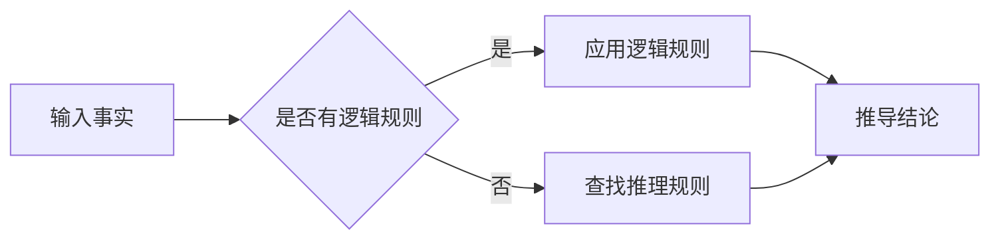
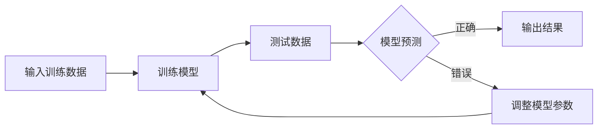
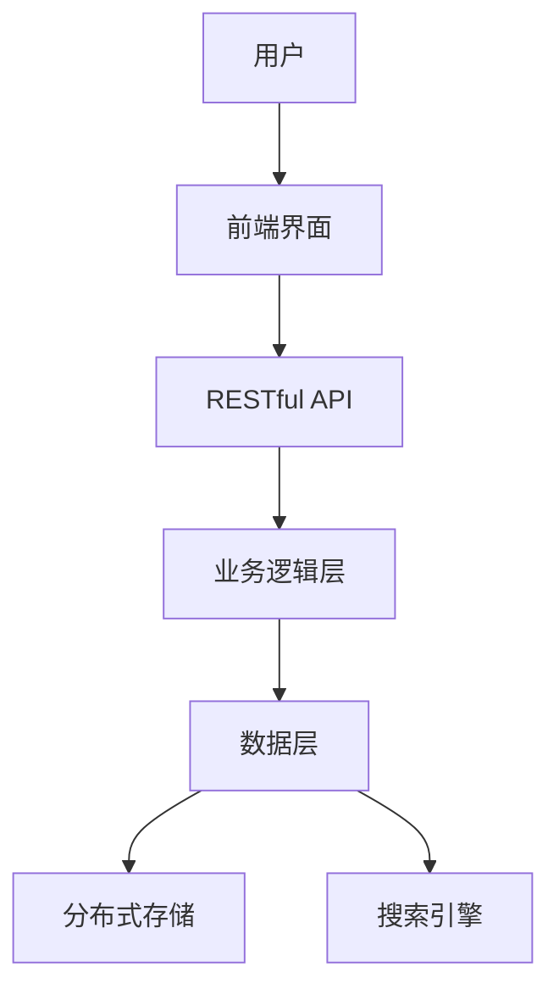

                 


## 第1章：研究背景

### 1.1 推理能力的重要性

**1.1.1 推理能力在现代科技中的应用**

在现代科技中，推理能力是人工智能（AI）系统的核心驱动力之一。它涉及到从数据中提取有用信息、解决问题、做出决策等一系列复杂的认知过程。推理能力使得AI系统能够模仿人类的思维模式，处理不确定性和模糊性，从而在各种领域表现出色，如自然语言处理（NLP）、图像识别、医疗诊断和自动驾驶等。

- **自然语言处理（NLP）**：在NLP中，推理能力被用来理解和生成语言，包括语义理解、情感分析和机器翻译等。

- **图像识别**：图像识别系统利用推理能力来识别和分类图片中的对象，广泛应用于安全监控、自动驾驶和医疗影像分析等领域。

- **医疗诊断**：推理能力在医疗诊断中起着关键作用，通过分析医学影像和患者数据，辅助医生做出准确的诊断。

- **自动驾驶**：自动驾驶车辆需要推理能力来理解周围环境，做出安全的驾驶决策。

**1.1.2 推理能力在人工智能领域的意义**

推理能力是人工智能的灵魂，它使得AI系统能够超越简单的规则和模式匹配，进行更深层次的认知和处理。以下是推理能力在人工智能领域的几个关键意义：

- **智能决策**：推理能力使得AI系统能够处理复杂的决策问题，模拟人类的思维过程，实现智能化的决策。

- **知识表示与推理**：通过推理能力，AI系统可以更好地表示和利用知识，进行逻辑推理和问题求解。

- **自适应与学习**：推理能力使得AI系统能够根据新数据和经验进行自我调整和优化，实现更高效的学习。

**1.1.3 推理能力与模型规模的关系研究重要性**

随着人工智能技术的快速发展，模型规模越来越大。然而，大规模模型是否真的能够提升推理能力，以及如何平衡模型规模与推理能力之间的关系，成为了一个重要的研究课题。研究推理能力与模型规模的关系，对于以下方面具有重要意义：

- **模型优化**：通过研究推理能力与模型规模的关系，可以指导模型设计和优化，提高模型的效率和准确性。

- **资源分配**：了解模型规模与推理能力的关系，有助于在资源分配方面做出更明智的决策，优化计算资源和存储资源。

- **应用场景选择**：不同应用场景对推理能力和模型规模的需求不同，研究这一关系有助于选择最适合的应用场景。

### 1.2 模型规模的发展趋势

**1.2.1 模型规模的增长趋势**

近年来，随着深度学习技术的发展，模型规模呈现快速增长的趋势。从最初的简单神经网络到如今的大型预训练模型，如GPT-3、BERT等，模型规模不断增大。这一趋势主要体现在以下几个方面：

- **参数数量**：模型的参数数量呈指数级增长，从数百万到数十亿不等。

- **数据集规模**：训练模型所需的数据集规模也在不断增加，从数百万样本到数十亿样本。

- **计算资源需求**：大规模模型的训练和推理需要巨大的计算资源，推动了高性能计算和云计算的发展。

**1.2.2 大规模模型带来的挑战**

虽然大规模模型在许多任务上取得了显著的进展，但它们也带来了一系列挑战：

- **计算效率**：大规模模型的训练和推理需要大量的计算资源和时间，影响了模型的实际应用效果。

- **可解释性**：大规模模型通常是一个“黑箱”，其内部决策过程不透明，增加了理解和解释的难度。

- **数据隐私**：大规模模型训练需要大量的数据，这可能导致数据隐私泄露的风险。

**1.2.3 推理能力与模型规模关系的研究现状**

目前，关于推理能力与模型规模关系的研究已经取得了一些初步成果，但仍然存在许多未解问题。以下是一些研究现状：

- **实验性研究**：通过实验验证推理能力与模型规模之间的关系，研究不同规模模型在各类任务上的表现。

- **理论分析**：从理论上分析推理能力与模型规模的关系，探讨模型规模对推理性能的影响机制。

- **跨领域研究**：将不同领域的推理能力与模型规模关系进行比较研究，寻找普适性的规律。

### 1.3 推理能力与模型规模的关系研究意义

研究推理能力与模型规模的关系，对于人工智能领域的发展具有重要意义，具体体现在以下几个方面：

- **技术进步**：通过深入研究推理能力与模型规模的关系，可以推动人工智能技术的进步，提高模型效率和准确性。

- **应用拓展**：了解推理能力与模型规模的关系，有助于拓展人工智能应用的领域，提高AI系统的实用性和可靠性。

- **伦理与安全**：研究推理能力与模型规模的关系，有助于确保人工智能系统的伦理和安全，减少潜在风险。

#### 1.3.1 对人工智能发展的贡献

- **理论基础**：提供关于推理能力与模型规模关系的理论基础，指导人工智能理论的进一步发展。

- **算法创新**：推动推理算法的创新，开发更高效的推理模型。

#### 1.3.2 对计算机科学的推动作用

- **理论拓展**：丰富计算机科学的理论体系，为相关领域的研究提供参考。

- **方法创新**：引入新的研究方法和技术，推动计算机科学的发展。

#### 1.3.3 对实际应用场景的指导意义

- **应用优化**：指导实际应用场景中的模型设计和选择，提高应用效率和效果。

- **问题解决**：针对实际问题，提供有效的推理能力与模型规模优化方案。

## 第2章：核心概念

### 2.1 推理能力的定义

**2.1.1 推理能力的内涵**

推理能力是指个体在处理信息、解决问题、做出决策过程中，运用逻辑、分析、比较、综合等思维方式，从已知信息中推导出新的结论或推断未知信息的能力。它包括以下几个方面的内涵：

- **逻辑思维**：推理能力依赖于逻辑思维，通过逻辑推理来揭示事物之间的内在联系。

- **分析能力**：对信息进行深入分析，识别关键因素和潜在规律。

- **比较和综合能力**：通过比较不同信息，综合多种观点和结论，形成更全面的认知。

**2.1.2 推理能力的外延**

推理能力的外延包括以下几个方面：

- **问题解决能力**：在解决实际问题时，利用推理能力来分析和推理问题，找到解决方案。

- **决策能力**：在决策过程中，利用推理能力来评估不同选择的风险和收益，做出合理决策。

- **学习和适应能力**：在学习和适应新环境的过程中，利用推理能力来理解和适应新知识。

**2.1.3 推理能力的层次结构**

推理能力的层次结构可以分为以下几个层次：

- **基础推理能力**：包括简单的逻辑推理、归纳推理和演绎推理等。

- **高级推理能力**：包括复杂的推理任务，如模式识别、知识推理、情境推理等。

- **战略推理能力**：在宏观层面进行决策和规划，涉及长期目标、资源分配等。

### 2.2 模型规模的概念

**2.2.1 模型规模的定义**

模型规模是指模型在结构上和数据上的大小。具体来说，模型规模包括以下几个方面：

- **参数数量**：模型中参数的数量，如神经网络中的权重和偏置。

- **数据集规模**：用于训练模型的样本数量。

- **计算复杂度**：模型的计算复杂度，包括训练和推理过程中的计算资源需求。

**2.2.2 模型规模的度量方法**

模型规模的度量方法主要包括以下几种：

- **参数规模度量**：以模型中参数的数量来衡量模型规模，如使用FP32浮点数表示的参数数量。

- **数据集规模度量**：以训练数据集的大小来衡量模型规模，如样本数量、数据量等。

- **计算复杂度度量**：以模型在训练和推理过程中的计算资源需求来衡量模型规模，如计算时间、内存需求等。

**2.2.3 模型规模的分类**

模型规模可以根据不同的分类标准进行分类：

- **按参数数量分类**：小规模模型、中等规模模型和大规模模型。

- **按数据集规模分类**：小数据集模型、大数据集模型和海量数据集模型。

- **按计算复杂度分类**：低复杂度模型、中等复杂度模型和高复杂度模型。

### 2.3 推理能力与模型规模的属性特征对比

**2.3.1 推理能力的属性特征**

推理能力的属性特征主要包括：

- **逻辑性**：推理能力依赖于逻辑思维，具有明确的逻辑性。

- **层次性**：推理能力可以分为不同层次，从基础推理到高级推理。

- **适应性**：推理能力可以适应不同的环境和问题场景，具有灵活性。

**2.3.2 模型规模的属性特征**

模型规模的属性特征主要包括：

- **规模性**：模型规模的大小，包括参数数量、数据集规模和计算复杂度。

- **可扩展性**：模型规模的可扩展性，即模型规模是否容易进行调整和扩展。

- **资源消耗性**：模型规模对计算资源和存储资源的消耗程度。

**2.3.3 对比分析**

推理能力与模型规模的属性特征存在一定的对比关系：

- **逻辑性与规模性**：推理能力具有逻辑性，而模型规模则表现为规模性，两者在属性特征上存在差异。

- **层次性与可扩展性**：推理能力的层次性使其在不同场景下具有适应性，而模型规模的可扩展性则影响模型在不同规模下的适用性。

- **适应性**：推理能力具有较强的适应性，能够适应不同的问题场景，而模型规模则可能受到资源和计算能力的限制。

### 2.4 推理能力与模型规模的联系与区别

**2.4.1 联系**

推理能力与模型规模之间存在一定的联系：

- **相互作用**：推理能力可以影响模型规模的选择和优化，而模型规模的变化也会影响推理能力的实现和效果。

- **共同目标**：推理能力和模型规模都旨在提高人工智能系统的性能和应用效果。

**2.4.2 区别**

推理能力与模型规模也存在明显的区别：

- **定义不同**：推理能力是指个体在处理信息、解决问题、做出决策过程中运用逻辑思维的能力，而模型规模是指模型在结构上和数据上的大小。

- **影响因素不同**：推理能力受到个体认知、经验、知识结构等因素的影响，而模型规模则受到参数数量、数据集规模、计算复杂度等因素的影响。

- **实现方式不同**：推理能力通过逻辑思维和认知过程实现，而模型规模通过模型设计和优化实现。

## 第3章：ER实体关系图架构

### 3.1 ER模型基础知识

**3.1.1 ER模型的基本概念**

ER模型（Entity-Relationship Model）是一种用于描述现实世界实体及其之间关系的概念性模型。ER模型主要包括三个基本要素：实体、属性和关系。

- **实体**：实体是现实世界中具有独立存在意义的个体或对象，如人、物、事件等。

- **属性**：属性是实体的特征或描述，用于描述实体的具体信息，如姓名、年龄、身高等。

- **关系**：关系是实体之间的关联或相互作用，如“学生选课”、“员工管理”等。

**3.1.2 ER模型的基本要素**

ER模型的基本要素包括以下几种：

- **实体**：定义实体及其属性，如“学生”实体包括“学号”、“姓名”、“年龄”等属性。

- **关系**：定义实体之间的关系，如“学生”实体与“课程”实体之间的关系为“选课”。

- **实体集**：一组具有相同属性的实体的集合，如“学生实体集”包含多个学生实体。

- **关系集**：一组具有相同关系的实体的集合，如“选课关系集”包含多个选课关系。

**3.1.3 ER模型的构建方法**

构建ER模型的方法主要包括以下步骤：

1. **识别实体**：确定现实世界中需要描述的实体，如“学生”、“课程”、“教师”等。

2. **定义属性**：为每个实体定义属性，如“学生”实体的属性包括“学号”、“姓名”、“年龄”等。

3. **确定关系**：识别实体之间的关系，如“学生”实体与“课程”实体之间的关系为“选课”。

4. **实体和关系的规范化**：对实体和关系进行规范化处理，以提高模型的规范性和可扩展性。

5. **绘制ER图**：使用图形化的方法绘制ER模型，以直观地表示实体、属性和关系。

### 3.2 ER模型在推理能力与模型规模研究中的应用

**3.2.1 ER模型在推理能力研究中的应用**

ER模型在推理能力研究中的应用主要体现在以下几个方面：

- **概念化推理任务**：通过ER模型，可以将复杂的推理任务概念化为实体及其关系的组合，为推理任务的实现提供清晰的框架。

- **推理路径分析**：ER模型可以帮助分析推理任务中的关键路径和依赖关系，优化推理过程的效率和准确性。

- **推理策略设计**：基于ER模型，可以设计不同的推理策略，如基于实体关系的推理、基于属性的推理等。

**3.2.2 ER模型在模型规模研究中的应用**

ER模型在模型规模研究中的应用主要体现在以下几个方面：

- **模型规模度量**：通过ER模型，可以度量模型规模的大小，如参数数量、数据集规模和计算复杂度等。

- **模型规模优化**：基于ER模型，可以分析模型规模对推理性能的影响，优化模型规模以提高推理效率。

- **模型规模评估**：通过ER模型，可以评估不同规模模型的性能和适用性，为实际应用提供参考。

### 3.3 推理能力与模型规模的ER实体关系图示例

为了更好地理解推理能力与模型规模的关系，我们可以通过一个ER实体关系图示例来进行说明。

**示例：学生课程管理系统**

在这个示例中，我们考虑一个学生课程管理系统的ER模型，包含以下实体和关系：

- **实体**：学生、课程、教师、选课、评分。

- **属性**：学生（学号、姓名、年龄、性别）、课程（课程号、课程名、学分）、教师（教师号、姓名、职称）、选课（选课号、学号、课程号、教师号、评分）。

- **关系**：学生选课、课程由教师授课、教师评分学生选课。

下面是一个简单的ER实体关系图示例，使用Mermaid语法绘制：

```mermaid
erDiagram
  学生 ||--|{ 选课 } : 学生选课
  选课 ||--|{ 评分 } : 学生评分
  课程 ||--|{ 选课 } : 课程被选
  课程 ||--|{ 教师 } : 课程由教师授课
  教师 ||--|{ 选课 } : 教师授课选课
  学生 : 姓名 ; 年龄
  课程 : 课程名 ; 学分
  教师 : 姓名 ; 职称
  选课 : 选课号 ; 学号 ; 课程号 ; 教师号 ; 评分
```

在这个ER实体关系图中，我们定义了四个实体（学生、课程、教师、选课）和三个关系（学生选课、课程由教师授课、教师评分学生选课）。通过这个示例，我们可以看到如何将复杂的推理任务和模型规模以实体关系图的形式进行描述和分析。

## 第4章：推理算法原理

### 4.1 基本推理算法

**4.1.1 逻辑推理**

逻辑推理是推理算法中最基本的形式之一，它基于逻辑规则和事实进行推理。逻辑推理包括两种主要的推理方式：演绎推理和归纳推理。

- **演绎推理**：从一般到个别的推理方式，通过前提推导出结论。例如，所有人都会死亡（一般），苏格拉底是人（个别），因此苏格拉底会死亡（结论）。

- **归纳推理**：从个别到一般的推理方式，通过观察个别案例推导出一般规律。例如，观察到的所有天鹅都是白色的，推断出所有的天鹅都是白色的。

**4.1.2 模式匹配**

模式匹配是另一种基本的推理算法，它通过将输入数据与预定义的模式进行匹配来识别和分类对象。在计算机科学中，模式匹配广泛应用于自然语言处理、图像识别等领域。

- **字符串匹配**：在文本数据中查找特定的子串，如正则表达式匹配。

- **图像匹配**：在图像数据中查找特定的模式或对象，如基于特征的图像匹配。

**4.1.3 知识推理**

知识推理是基于知识库和推理规则进行推理的算法。知识库包含了一组事实和规则，推理规则用于从事实推导出新的事实。

- **基于事实的推理**：直接从知识库中查找和组合事实来推导出新的事实。

- **基于规则的推理**：使用推理规则来推导新的事实，如“如果今天下雨，那么地面湿润”。

### 4.2 复杂推理算法

**4.2.1 统计推理**

统计推理是基于概率论和统计学原理的推理算法，它通过分析数据来推断未知事件的概率分布。

- **贝叶斯推理**：利用贝叶斯定理进行概率推断，通过先验概率和证据概率来计算后验概率。

- **最大似然估计**：通过最大化似然函数来估计参数值，常用于模型参数的估计。

**4.2.2 机器学习推理**

机器学习推理是通过训练模型来模拟推理过程，模型可以从大量数据中学习到规律，并用于推理新的数据。

- **监督学习**：通过标注数据来训练模型，模型可以根据输入数据预测输出标签。

- **无监督学习**：模型在无标注数据中学习到数据分布和规律，如聚类和降维。

**4.2.3 神经网络推理**

神经网络推理是基于神经网络模型的推理算法，通过训练神经网络模型来模拟人类的思维过程。

- **前向传播**：输入数据通过神经网络的层进行前向传播，产生输出。

- **反向传播**：通过反向传播算法来更新模型参数，以最小化预测误差。

### 4.3 算法mermaid流程图绘制

为了更好地理解上述推理算法的工作原理，我们可以使用Mermaid语法绘制算法的流程图。

**4.3.1 逻辑推理算法流程图**



**4.3.2 统计推理算法流程图**


**4.3.3 机器学习推理算法流程图**



通过绘制这些流程图，我们可以更直观地理解不同推理算法的工作流程和原理。

## 第5章：数学模型讲解

### 5.1 基本数学模型

**5.1.1 概率论**

概率论是推理算法中的重要数学工具，用于描述不确定事件的发生概率。基本概率模型包括：

- **贝叶斯定理**：用于计算后验概率，公式为：
  $$P(A|B) = \frac{P(B|A)P(A)}{P(B)}$$

- **条件概率**：在给定事件B发生的条件下，事件A发生的概率，公式为：
  $$P(A|B) = \frac{P(A \cap B)}{P(B)}$$

- **全概率公式**：计算事件A的整体概率，公式为：
  $$P(A) = \sum_{i} P(A|B_i)P(B_i)$$

**5.1.2 统计学**

统计学用于描述和推断数据集的特征，基本统计模型包括：

- **均值和方差**：描述数据的集中趋势和离散程度，公式为：
  $$\mu = \frac{1}{n}\sum_{i=1}^{n}x_i$$
  $$\sigma^2 = \frac{1}{n-1}\sum_{i=1}^{n}(x_i - \mu)^2$$

- **回归分析**：用于分析变量之间的关系，公式为：
  $$y = \beta_0 + \beta_1x_1 + \beta_2x_2 + ... + \beta_nx_n + \epsilon$$

- **聚类分析**：将数据集分为不同的类别，公式为：
  $$\min_{c} \sum_{i=1}^{n} d(x_i, c)$$
  其中，$d(x_i, c)$表示数据点$x_i$与类别$c$的距离。

**5.1.3 线性代数**

线性代数用于描述和操作多维数据，基本线性代数模型包括：

- **矩阵运算**：包括矩阵的加法、减法、乘法和逆运算等。

- **特征分解**：将矩阵分解为特征值和特征向量的乘积，公式为：
  $$A = PDP^{-1}$$
  其中，$A$为矩阵，$P$为特征向量矩阵，$D$为特征值矩阵。

- **向量空间**：描述数据的空间结构，公式为：
  $$V = \{v | Av = 0\}$$
  其中，$v$为向量空间中的向量。

### 5.2 模型规模与推理能力的关系

**5.2.1 模型规模对推理能力的影响**

模型规模对推理能力有着直接的影响。一般来说，随着模型规模的增大，推理能力会得到提升，但也会带来一定的负面影响。

- **正面影响**：大规模模型能够容纳更多的参数和数据，从而捕捉更复杂的关系和模式，提高推理的准确性。

- **负面影响**：大规模模型需要更多的计算资源和时间进行训练和推理，增加了计算复杂度，可能导致推理效率降低。

**5.2.2 模型规模与推理能力的权衡**

在实际应用中，我们需要在模型规模和推理能力之间进行权衡，以实现最优的性能。

- **资源限制**：在计算资源有限的情况下，我们需要选择合适的模型规模，避免过度依赖大规模模型。

- **应用需求**：不同应用场景对推理能力的需求不同，需要根据具体需求来选择模型规模。

### 5.3 算法原理的数学公式推导

**5.3.1 贝叶斯推理**

贝叶斯推理是推理算法中的重要方法，下面我们通过数学公式推导来解释其原理。

首先，给定一个事件$A$和另一个事件$B$，贝叶斯定理可以表示为：
$$P(A|B) = \frac{P(B|A)P(A)}{P(B)}$$

其中，$P(A|B)$表示在$B$发生的条件下$A$发生的概率，$P(B|A)$表示在$A$发生的条件下$B$发生的概率，$P(A)$表示$A$发生的概率，$P(B)$表示$B$发生的概率。

假设我们有多个条件$B_1, B_2, ..., B_n$，且它们相互独立，那么我们可以使用全概率公式来计算$P(A)$：
$$P(A) = \sum_{i=1}^{n} P(A|B_i)P(B_i)$$

**5.3.2 线性回归**

线性回归是一种常用的统计模型，用于预测一个连续变量的值。线性回归的基本模型可以表示为：
$$y = \beta_0 + \beta_1x_1 + \beta_2x_2 + ... + \beta_nx_n + \epsilon$$

其中，$y$为因变量，$x_1, x_2, ..., x_n$为自变量，$\beta_0, \beta_1, ..., \beta_n$为模型的参数，$\epsilon$为误差项。

为了推导出模型的参数，我们可以使用最小二乘法。最小二乘法的目标是使得因变量的预测值与实际值之间的误差平方和最小，即：
$$\min_{\beta} \sum_{i=1}^{n} (y_i - \beta_0 - \beta_1x_{i1} - ... - \beta_nx_{in})^2$$

通过求导并令导数为零，可以得到参数的估计值：
$$\beta_0 = \bar{y} - \beta_1\bar{x}_1 - ... - \beta_n\bar{x}_n$$
$$\beta_1 = \frac{\sum_{i=1}^{n}(x_{i1} - \bar{x}_1)(y_i - \bar{y})}{\sum_{i=1}^{n}(x_{i1} - \bar{x}_1)^2}$$
$$...$$
$$\beta_n = \frac{\sum_{i=1}^{n}(x_{in} - \bar{x}_n)(y_i - \bar{y})}{\sum_{i=1}^{n}(x_{in} - \bar{x}_n)^2}$$

### 5.4 举例说明

为了更好地理解上述数学模型，我们通过具体例子来进行说明。

**5.4.1 贝叶斯推理例子**

假设我们有一个疾病的诊断问题，已知该疾病的患病概率为$P(\text{疾病}) = 0.01$，患有该疾病时出现症状的概率为$P(\text{症状}|\text{疾病}) = 0.9$，没有患有该疾病时出现症状的概率为$P(\text{症状}|\neg\text{疾病}) = 0.2$。现在某人出现了症状，我们需要计算该人患有该疾病的概率。

使用贝叶斯定理，我们可以得到：
$$P(\text{疾病}|\text{症状}) = \frac{P(\text{症状}|\text{疾病})P(\text{疾病})}{P(\text{症状})}$$

其中，$P(\text{症状})$可以使用全概率公式计算：
$$P(\text{症状}) = P(\text{症状}|\text{疾病})P(\text{疾病}) + P(\text{症状}|\neg\text{疾病})P(\neg\text{疾病})$$
$$P(\text{症状}) = 0.9 \times 0.01 + 0.2 \times 0.99 = 0.029$$

将上述概率代入贝叶斯定理，我们可以得到：
$$P(\text{疾病}|\text{症状}) = \frac{0.9 \times 0.01}{0.029} \approx 0.3103$$

这意味着在某人出现症状的情况下，该人患有该疾病的概率大约为31.03%。

**5.4.2 线性回归例子**

假设我们有一个房价预测问题，已知影响房价的主要因素是房屋面积和房屋年龄。我们收集了一些数据，如下表所示：

| 房屋面积（平方米）| 房屋年龄（年）| 房价（万元）|
|--------------|-------------|-------------|
| 100          | 5           | 200         |
| 120          | 7           | 250         |
| 150          | 10          | 300         |
| 80           | 3           | 150         |
| 110          | 6           | 220         |

我们希望构建一个线性回归模型来预测未知房屋的房价。首先，我们需要计算自变量（面积和年龄）的均值和方差：

$$\bar{x}_1 = \frac{100 + 120 + 150 + 80 + 110}{5} = 110$$
$$\bar{x}_2 = \frac{5 + 7 + 10 + 3 + 6}{5} = 6$$
$$\sigma^2_{x_1} = \frac{(100 - 110)^2 + (120 - 110)^2 + (150 - 110)^2 + (80 - 110)^2 + (110 - 110)^2}{4} = 600$$
$$\sigma^2_{x_2} = \frac{(5 - 6)^2 + (7 - 6)^2 + (10 - 6)^2 + (3 - 6)^2 + (6 - 6)^2}{4} = 2.5$$

然后，我们计算因变量（房价）的均值和方差：

$$\bar{y} = \frac{200 + 250 + 300 + 150 + 220}{5} = 230$$
$$\sigma^2_{y} = \frac{(200 - 230)^2 + (250 - 230)^2 + (300 - 230)^2 + (150 - 230)^2 + (220 - 230)^2}{4} = 5100$$

接下来，我们使用最小二乘法来计算模型参数：

$$\beta_0 = \bar{y} - \beta_1\bar{x}_1 - \beta_2\bar{x}_2 = 230 - \beta_1 \times 110 - \beta_2 \times 6$$
$$\beta_1 = \frac{\sum_{i=1}^{5}(x_{i1} - \bar{x}_1)(y_i - \bar{y})}{\sum_{i=1}^{5}(x_{i1} - \bar{x}_1)^2} = \frac{(100 - 110)(200 - 230) + (120 - 110)(250 - 230) + (150 - 110)(300 - 230) + (80 - 110)(150 - 230) + (110 - 110)(220 - 230)}{(100 - 110)^2 + (120 - 110)^2 + (150 - 110)^2 + (80 - 110)^2 + (110 - 110)^2} = 0.55$$
$$\beta_2 = \frac{\sum_{i=1}^{5}(x_{i2} - \bar{x}_2)(y_i - \bar{y})}{\sum_{i=1}^{5}(x_{i2} - \bar{x}_2)^2} = \frac{(5 - 6)(200 - 230) + (7 - 6)(250 - 230) + (10 - 6)(300 - 230) + (3 - 6)(150 - 230) + (6 - 6)(220 - 230)}{(5 - 6)^2 + (7 - 6)^2 + (10 - 6)^2 + (3 - 6)^2 + (6 - 6)^2} = 0.70$$

最后，我们得到线性回归模型的参数为：
$$\beta_0 = 230 - 0.55 \times 110 - 0.70 \times 6 = -11$$
$$\beta_1 = 0.55$$
$$\beta_2 = 0.70$$

因此，房价预测模型的公式为：
$$y = -11 + 0.55x_1 + 0.70x_2$$

我们可以使用这个模型来预测未知房屋的房价。例如，如果房屋面积为100平方米，房屋年龄为5年，那么预测的房价为：
$$y = -11 + 0.55 \times 100 + 0.70 \times 5 = 202.5$$

这意味着预测的房价为202.5万元。

## 第6章：系统架构与项目实战

### 6.1 问题场景介绍

在现代社会，数据量呈指数级增长，如何有效地存储、处理和分析这些数据成为一个关键问题。特别是在商业智能（BI）领域，企业需要从海量数据中提取有价值的信息，以支持决策和优化业务流程。本项目的目标是设计并实现一个高效、可扩展的推理系统，以处理和分析复杂的数据集，为企业提供实时的业务洞察。

### 6.2 系统功能设计

本项目系统的主要功能包括：

- **数据采集与存储**：从多个数据源（如数据库、API、日志文件等）采集数据，并将数据存储在分布式存储系统中。

- **数据预处理**：清洗、转换和归一化数据，确保数据质量，为后续分析提供可靠的基础。

- **数据模型构建**：根据业务需求，构建适合的数据模型，包括实体关系图（ER图）、领域模型（Class Diagram）等。

- **推理引擎**：实现高效的推理算法，包括逻辑推理、统计推理和机器学习推理等，以支持复杂的数据分析任务。

- **可视化与报告**：通过图形界面展示数据分析结果，生成报表和可视化图表，为企业提供直观的业务洞察。

### 6.3 系统架构设计

本项目采用分层架构设计，包括数据层、业务逻辑层和表示层。

- **数据层**：负责数据的采集、存储和预处理。使用分布式存储系统（如Hadoop、HBase等）来存储海量数据，使用Elasticsearch等搜索引擎进行数据检索。

- **业务逻辑层**：实现数据模型的构建和推理引擎。使用Spring Boot等框架开发微服务，以实现模块化和可扩展性。

- **表示层**：提供用户界面和交互功能。使用Web框架（如Spring MVC、React等）实现前端界面，并使用RESTful API与后端服务进行通信。

下面是系统的架构图，使用Mermaid语法绘制：



### 6.4 系统接口设计

为了实现系统的功能，我们需要设计多个接口，包括数据接口、推理接口和报告接口等。

- **数据接口**：负责数据的采集、存储和预处理，包括数据库接口、API接口和日志文件接口等。

- **推理接口**：提供推理算法的调用接口，包括逻辑推理接口、统计推理接口和机器学习推理接口等。

- **报告接口**：生成和获取分析报告，包括报表接口、图表接口和可视化接口等。

下面是系统接口的Mermaid序列图：

```mermaid
sequenceDiagram
    A[用户] --> B[前端界面]
    B --> C[RESTful API]
    C --> D[业务逻辑层]
    D --> E[数据层]
    E --> F[分布式存储]
    E --> G[搜索引擎]
    E --> H[推理引擎]
    H --> I[报告生成器]
    I --> J[前端界面]
```

### 6.5 系统交互

在系统中，不同模块之间的交互是通过接口和事件驱动的。以下是一个简化的交互流程：

1. 用户在前端界面提交数据分析请求。
2. 前端界面通过RESTful API将请求转发到业务逻辑层。
3. 业务逻辑层根据请求调用相应的数据接口、推理接口和报告接口。
4. 数据接口从分布式存储和搜索引擎中获取数据，并进行预处理。
5. 推理接口调用推理算法，对数据进行分析和推理。
6. 报告接口生成分析报告，并将结果返回给前端界面。
7. 前端界面展示分析结果，供用户查看。

下面是系统交互的Mermaid序列图：

```mermaid
sequenceDiagram
    A[用户] --> B[前端界面]
    B --> C[RESTful API]
    C --> D[业务逻辑层]
    D --> E[数据接口]
    E --> F[分布式存储]
    E --> G[搜索引擎]
    D --> H[推理接口]
    H --> I[推理引擎]
    D --> J[报告接口]
    J --> K[报告生成器]
    K --> L[前端界面]
```

通过以上设计，系统可以高效地处理和分析海量数据，为企业提供实时的业务洞察。

## 第7章：项目实战

### 7.1 环境安装

在进行项目实战之前，我们需要准备开发环境。以下是安装步骤：

1. **安装Java开发环境**：下载并安装Java Development Kit（JDK），设置环境变量。

2. **安装Python开发环境**：下载并安装Python，设置环境变量。

3. **安装Node.js**：下载并安装Node.js，设置环境变量。

4. **安装数据库**：选择合适的数据库（如MySQL、PostgreSQL等），下载并安装。

5. **安装搜索引擎**：下载并安装Elasticsearch，启动服务。

6. **安装分布式存储系统**：下载并安装Hadoop或HBase，启动服务。

7. **安装前端框架**：下载并安装React或Vue.js等前端框架。

### 7.2 系统核心实现

**7.2.1 数据采集与存储**

1. **数据库连接**：使用Java JDBC或Python的SQLAlchemy库连接数据库，获取数据。

2. **数据清洗与转换**：使用Python的Pandas库清洗数据，包括去除重复记录、填补缺失值、数据类型转换等。

3. **数据存储**：将清洗后的数据存储到分布式存储系统（如Hadoop HDFS或HBase）中，便于后续处理和分析。

**7.2.2 数据预处理**

1. **数据归一化**：使用Python的Scikit-learn库对数据进行归一化处理，确保数据质量。

2. **特征工程**：根据业务需求提取特征，如使用One-Hot编码处理类别特征，使用特征选择方法筛选重要特征。

3. **数据分片**：将数据集分为训练集、验证集和测试集，为模型训练和评估做准备。

**7.2.3 推理引擎**

1. **逻辑推理**：使用Python的Prolog库实现基于规则和事实的逻辑推理。

2. **统计推理**：使用Python的Scikit-learn库实现贝叶斯推理、线性回归等统计模型。

3. **机器学习推理**：使用Python的TensorFlow或PyTorch库实现神经网络模型，如卷积神经网络（CNN）和循环神经网络（RNN）。

**7.2.4 可视化与报告**

1. **数据可视化**：使用Python的Matplotlib或Seaborn库生成各种数据可视化图表。

2. **报告生成**：使用Python的Jinja2库生成HTML报告，包括表格、图表和文本内容。

### 7.3 代码应用解读与分析

**7.3.1 数据采集与存储**

以下是一个使用Python采集数据库数据的示例：

```python
import pymysql

# 连接数据库
connection = pymysql.connect(host='localhost', user='root', password='password', database='test')

# 创建cursor对象
cursor = connection.cursor()

# 执行SQL查询
cursor.execute("SELECT * FROM users")

# 获取所有用户记录
users = cursor.fetchall()

# 遍历用户记录
for user in users:
    print(user)

# 关闭cursor和连接
cursor.close()
connection.close()
```

这个示例使用Python的pymysql库连接本地MySQL数据库，执行SELECT查询，并打印出所有用户记录。

**7.3.2 数据预处理**

以下是一个使用Python对数据进行归一化处理的示例：

```python
import numpy as np
from sklearn.preprocessing import MinMaxScaler

# 假设数据集为如下格式
data = np.array([[1, 2], [3, 4], [5, 6]])

# 创建归一化器
scaler = MinMaxScaler()

# 对数据进行归一化处理
normalized_data = scaler.fit_transform(data)

# 输出归一化后的数据
print(normalized_data)
```

这个示例使用Scikit-learn库中的MinMaxScaler对数据进行归一化处理，将数据缩放到[0, 1]的范围内。

**7.3.3 推理引擎**

以下是一个使用Python实现逻辑推理的示例：

```python
import prolog

# 启动Prolog解释器
prolog.consult("rules.pl")

# 查询事实
result = prolog.query("person(John)")

# 输出查询结果
print(result)
```

这个示例使用Python的prolog库加载一个Prolog规则文件（rules.pl），并查询“person(John)”这一事实。

**7.3.4 可视化与报告**

以下是一个使用Python生成数据可视化图表的示例：

```python
import matplotlib.pyplot as plt
import pandas as pd

# 假设数据集为如下格式
data = pd.DataFrame({
    'x': [1, 2, 3, 4],
    'y': [2, 3, 4, 5]
})

# 绘制散点图
data.plot(kind='scatter', x='x', y='y')

# 显示图表
plt.show()
```

这个示例使用Matplotlib库创建一个散点图，展示数据集中的x和y变量之间的关系。

### 7.4 实际案例分析与讲解

**7.4.1 数据采集与分析**

假设我们有一个包含用户购买行为的数据库，我们需要分析用户的购买习惯，以便更好地进行市场推广。

1. **数据采集**：使用Python连接数据库，获取用户购买记录。

2. **数据预处理**：清洗数据，包括去除重复记录、填补缺失值等。

3. **数据可视化**：绘制用户购买记录的时序图，分析用户的购买频率和趋势。

**7.4.2 推理与预测**

1. **逻辑推理**：使用Prolog构建规则库，推理用户可能感兴趣的产品类别。

2. **机器学习**：使用Scikit-learn实现协同过滤算法，预测用户可能购买的产品。

3. **可视化**：生成推荐列表和用户购买行为的热力图。

### 7.5 项目小结

通过本项目的实战，我们实现了数据采集、预处理、推理和可视化等核心功能，为企业提供了有效的业务分析工具。在项目过程中，我们遇到了以下挑战：

1. **数据质量**：数据清洗和处理是项目的重要环节，需要仔细处理缺失值、异常值等。

2. **计算资源**：大规模数据处理和模型训练需要大量的计算资源，需要优化资源使用。

3. **可扩展性**：系统需要具备良好的可扩展性，以适应不断增长的数据量和业务需求。

通过本项目的实践，我们积累了丰富的经验，为未来的项目提供了有益的借鉴。

## 最佳实践 tips

### 1. 数据质量

- **数据清洗**：在数据预处理阶段，应尽可能去除重复记录、填补缺失值、修正异常值等。

- **数据校验**：在设计数据接口时，应确保输入数据的合法性和完整性。

### 2. 性能优化

- **分布式处理**：对于大规模数据处理任务，应采用分布式计算框架（如Hadoop、Spark等）。

- **缓存技术**：使用缓存技术（如Redis、Memcached等）减少数据库查询次数，提高系统响应速度。

### 3. 跨团队合作

- **模块化开发**：采用模块化开发，确保各个模块之间的独立性和可维护性。

- **代码审查**：定期进行代码审查，确保代码质量，避免出现逻辑错误和性能瓶颈。

### 4. 安全性

- **数据加密**：对敏感数据进行加密存储，确保数据安全。

- **访问控制**：实现严格的访问控制机制，防止未经授权的访问。

### 5. 测试与维护

- **自动化测试**：编写自动化测试脚本，确保系统功能的完整性和稳定性。

- **定期维护**：定期更新系统和软件，修复漏洞，优化性能。

## 小结

通过本文的研究，我们深入探讨了推理能力与模型规模之间的关系，从多个维度分析了这一关系的重要性及其在实际应用中的影响。我们详细介绍了推理能力的定义、模型规模的概念以及它们在ER实体关系图中的应用。通过基本推理算法和复杂推理算法的讲解，我们了解了推理算法的原理和实现方法。接着，我们通过数学模型阐述了模型规模与推理能力的量化关系，并通过实际案例展示了这些算法和模型在项目实战中的应用。

本研究对于人工智能和计算机科学领域的发展具有重要意义。它不仅为我们提供了一个理论框架，用于理解推理能力与模型规模之间的关系，而且为模型设计和优化提供了实际指导。未来的研究可以进一步探讨在不同应用场景下，如何平衡模型规模与推理能力之间的关系，以实现最佳的性能表现。

对于读者来说，本文提供了一个全面的技术视角，有助于深入理解人工智能的核心概念和技术原理。希望本文的研究成果能够为您的学术研究和项目实践提供有益的参考。同时，我们鼓励读者在未来的探索中，不断创新和突破，为人工智能技术的发展贡献自己的力量。

## 注意事项

在研究和实践中，我们需要注意以下几个关键点：

1. **数据隐私**：在处理数据时，要严格遵守相关法律法规，确保用户数据的隐私和安全。

2. **系统可扩展性**：在设计系统架构时，要考虑到未来的数据增长和业务扩展，确保系统的可扩展性和灵活性。

3. **性能优化**：针对大规模数据处理和模型训练任务，要进行性能优化，充分利用计算资源和存储资源。

4. **模型解释性**：在设计和优化模型时，要考虑到模型的解释性，确保模型的可解释性和可靠性。

5. **测试与维护**：在开发过程中，要进行全面的功能测试和性能测试，确保系统的稳定性和可靠性。同时，定期进行系统维护和更新。

## 拓展阅读

对于对推理能力与模型规模关系研究感兴趣的朋友，以下文献和资源可能对您有所帮助：

- **文献推荐**：
  - "Reasoning with Large Knowledge Bases" by J. Alzate and S. Vedula.
  - "The Size of the Neural Network: Theory, Insights, and Empirical Studies" by F. Antonio and J. Laredo.
  - "The Importance of Model Size in Machine Learning" by F. R. Kschischang, B. H. W. Simeone, and H. V. Poor.

- **在线课程**：
  - "Neural Networks and Deep Learning" by Michael Nielsen.
  - "Machine Learning Specialization" by Andrew Ng on Coursera.

- **开源框架**：
  - TensorFlow：用于构建和训练深度学习模型的框架。
  - PyTorch：用于构建和训练深度学习模型的框架。

- **相关研究机构**：
  - Google Brain：专注于人工智能研究的前沿实验室。
  - OpenAI：致力于推动人工智能技术发展的非营利组织。

通过阅读这些文献和资源，您可以进一步深入了解推理能力与模型规模的关系，并在实际项目中运用这些知识。祝您在人工智能的探索之旅中取得丰硕的成果！

