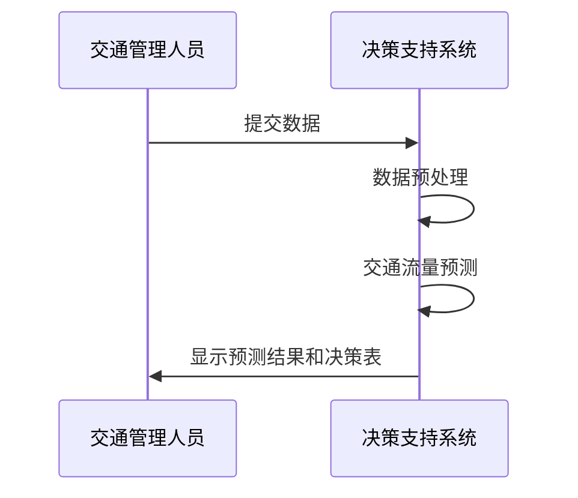
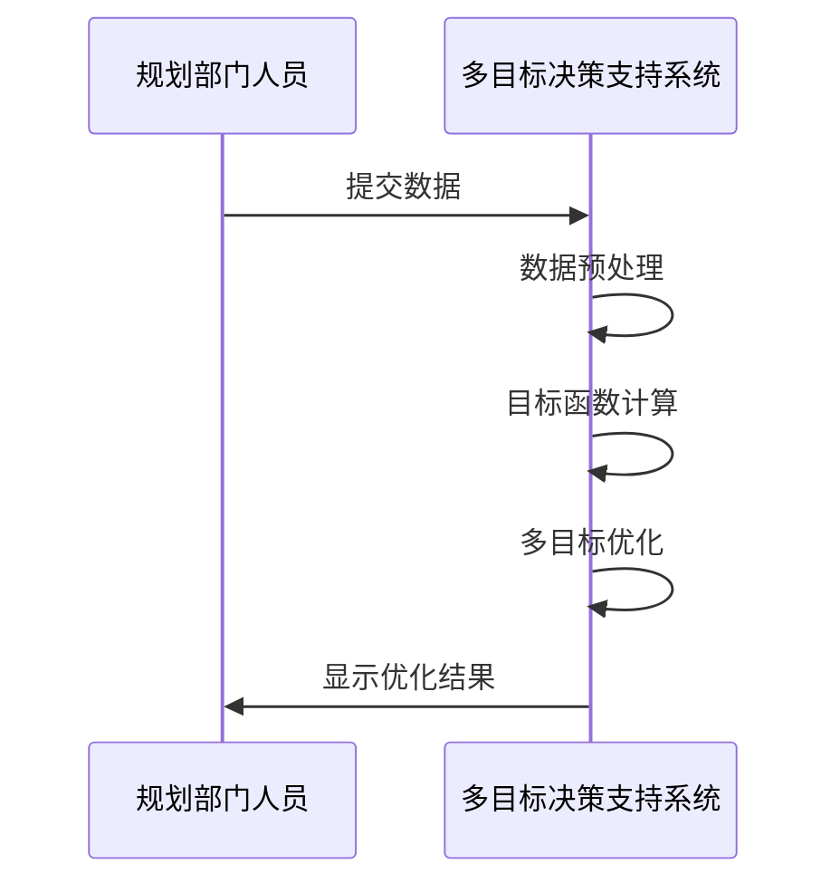

                 


### 第一部分: 引言

#### 第1章: 问题背景

##### 1.1 问题背景

推理是人类智能的核心特征之一，无论是在日常决策、科学研究还是技术领域，推理过程都扮演着至关重要的角色。然而，在复杂的现实世界中，推理过程往往面临诸多不确定性的挑战。这些不确定性可能源于数据的不完整性、观测误差、模型的不确定性以及人类认知的限制。

在人工智能领域，推理过程同样面临着不确定性的问题。传统的人工智能系统依赖于明确的规则和精确的数据，但在面对复杂、多变的环境时，这些系统往往显得力不从心。因此，如何量化不确定性并利用这些量化结果来支持决策，成为了一个亟待解决的关键问题。

##### 1.1.1 推理过程的重要性

推理是人类智能的核心，它帮助我们理解世界、解决问题和做出决策。在科学研究中，推理是科学发现和理论构建的基础。例如，物理学家通过逻辑推理建立了量子力学和相对论等重大理论。在工程实践中，推理是设计和优化系统的关键。例如，在航天工程中，工程师需要通过推理分析来确保火箭的稳定性和安全性。

在人工智能领域，推理更是核心技术之一。智能系统需要能够从数据中提取知识，进行逻辑推理和决策，以实现自主学习和智能行为。例如，自动驾驶系统需要通过推理分析来自动识别道路状况，做出驾驶决策。

##### 1.1.2 不确定性在推理过程中的影响

不确定性是推理过程中不可避免的问题。它可能源于数据的噪声、模型的不完善、外部环境的干扰以及人类认知的局限性。以下是不确定性在推理过程中可能产生的影响：

- **降低推理准确性**：不确定性可能导致推理结果偏离真实情况，降低推理的准确性。
- **影响决策质量**：在决策过程中，不确定性会影响决策者对结果的预期，降低决策质量。
- **增加计算复杂度**：不确定性量化需要额外的计算资源，可能增加推理过程的复杂度。

##### 1.1.3 研究现状与挑战

目前，关于不确定性量化与决策支持技术的研究已经取得了显著进展。在统计方法、网络方法和人工智能方法等方面，都有较为成熟的理论和技术。例如，贝叶斯推理、概率图模型和深度学习等方法都被广泛应用于不确定性量化与决策支持领域。

然而，当前的研究仍面临一些挑战：

- **不确定性量化准确性**：如何更准确地量化不确定性，是一个亟待解决的问题。现有的方法可能无法完全捕捉复杂系统中的不确定性。
- **实时性与效率**：在实时推理过程中，如何高效地处理不确定性，是一个重要的挑战。特别是在大数据和高频交易等场景下，实时性要求非常高。
- **多目标决策**：在多目标决策中，如何平衡不同目标之间的不确定性，是一个复杂的挑战。多目标决策问题通常涉及多个权衡，而不同目标之间的不确定性可能进一步增加决策的复杂性。

##### 1.2 核心概念

为了深入探讨不确定性量化与决策支持技术，我们需要明确一些核心概念。

- **不确定性量化**：不确定性量化是指将不确定性的程度和性质进行量化的过程。它通常涉及概率分布、熵、方差等指标。
- **决策支持技术**：决策支持技术是指利用数据分析、模型推理和人工智能等技术来支持决策的过程。它包括模型构建、数据分析和决策优化等步骤。

##### 1.2.1 不确定性量化

不确定性量化是本书的核心内容之一。它涉及到以下几个方面：

- **不确定性类型的分类**：不同的不确定性类型可能需要不同的量化方法。例如，随机不确定性通常使用概率分布来量化，而模糊不确定性则可能使用模糊集理论。
- **不确定性量化的重要指标**：常见的量化指标包括概率分布函数、熵、方差、协方差等。这些指标可以用来描述不确定性的程度和性质。
- **不确定性量化在推理中的应用**：在推理过程中，不确定性量化可以帮助我们更好地理解推理结果的可靠性，从而做出更合理的决策。

##### 1.2.2 决策支持技术

决策支持技术是本书的另一核心内容。它包括以下几个方面：

- **决策支持系统的设计与实现**：决策支持系统是一个集成多种技术和工具的综合性系统，它需要能够处理大量的数据，提供实时的分析结果，并支持决策者进行决策。
- **多目标决策与优化**：在多目标决策中，决策者需要在多个目标之间进行权衡，以找到最优的决策方案。这通常涉及到优化算法和不确定性量化技术。
- **决策支持系统的评估与优化**：如何评估决策支持系统的性能，并对其进行优化，是一个重要的研究问题。这通常涉及到评估指标和方法，以及优化算法的设计。

##### 1.2.3 推理过程中的联系

在推理过程中，不确定性量化与决策支持技术是紧密相连的。不确定性量化可以帮助我们更好地理解推理结果的可靠性，而决策支持技术则可以基于这些量化结果来支持决策。例如，在推理过程中，我们可以使用贝叶斯推理来量化不确定性，然后基于这些量化结果来制定决策策略。

##### 1.3 书籍结构概述

本书分为三个主要部分：

- **第一部分**：介绍不确定性量化与决策支持技术的背景、核心概念和方法。
- **第二部分**：详细探讨不确定性量化技术在推理过程中的应用，包括统计方法、网络方法和人工智能方法。
- **第三部分**：讨论决策支持技术的设计与实现，以及多目标决策与优化。

通过本书的阅读，读者可以系统地了解不确定性量化与决策支持技术的理论和方法，并掌握如何在实际应用中运用这些技术。

##### 1.3.1 组织结构与内容安排

本书的组织结构如下：

- **第一部分**：引言
  - 第1章：问题背景
- **第二部分**：不确定性量化技术
  - 第2章：不确定性量化方法概述
  - 第3章：不确定性量化在实际推理中的应用
- **第三部分**：决策支持技术
  - 第4章：决策支持系统的设计与实现
  - 第5章：多目标决策与优化

##### 1.3.2 阅读对象与预期收益

本书的目标读者是从事人工智能、数据科学和决策支持技术的研究人员、工程师和从业者。通过阅读本书，读者可以：

- 系统了解不确定性量化与决策支持技术的核心概念和方法。
- 掌握如何在实际应用中运用这些技术来处理不确定性和支持决策。
- 提高在复杂环境中进行推理和决策的能力。

##### 1.3.3 拓展阅读建议

本书主要介绍了不确定性量化与决策支持技术的基本理论和应用方法。为了更深入地了解相关领域，读者可以参考以下拓展阅读：

- 统计学习理论的相关书籍，如《统计学习方法》。
- 人工智能领域的经典教材，如《人工智能：一种现代的方法》。
- 决策分析与优化的书籍，如《决策分析：决策理论、决策模型与决策支持系统》。

通过这些拓展阅读，读者可以进一步加深对不确定性量化与决策支持技术的理解，并在实际应用中取得更好的效果。

## 第2章: 不确定性量化方法概述

在复杂的推理过程中，不确定性量化是关键的一步。它帮助我们理解和处理不确定性，从而提高推理的准确性和决策的质量。本章将介绍不确定性量化方法的基本概念、类型、重要指标，并探讨这些方法在推理过程中的应用。

### 2.1 不确定性量化基础

#### 2.1.1 不确定性类型的分类

不确定性可以分为以下几种类型：

1. **随机不确定性**：由随机因素引起的，如掷骰子、抛硬币等。
2. **模糊不确定性**：由主观判断和主观意见引起的，如模糊逻辑和模糊集。
3. **确定性不确定性**：由模型的不确定性引起的，如模型参数的不确定。
4. **非参数不确定性**：由无法用参数描述的不确定性引起的，如噪声和干扰。

#### 2.1.2 不确定性量化的重要指标

以下是一些常用的不确定性量化指标：

1. **概率分布函数（PDF）**：描述随机变量取值的概率分布。
2. **熵**：衡量不确定性的大小，熵越大，不确定性越大。
3. **方差**：衡量随机变量取值离散程度，方差越大，不确定性越大。
4. **协方差**：描述多个随机变量之间的相关性。

#### 2.1.3 不确定性量化在推理中的应用

不确定性量化在推理中的应用非常广泛。例如：

1. **贝叶斯推理**：通过概率分布函数量化不确定性，并利用贝叶斯定理进行推理。
2. **模糊推理**：通过模糊集理论量化模糊不确定性，并利用模糊逻辑进行推理。
3. **模型不确定性量化**：通过模型参数的敏感性分析来量化模型不确定性。

### 2.2 统计方法

统计方法是在不确定性量化中应用最广泛的方法之一。以下将介绍统计方法的基本原理和应用。

#### 2.2.1 概率论基础

概率论是统计方法的基础。以下是一些基本概念：

1. **随机变量**：具有随机取值的变量。
2. **概率分布**：描述随机变量取值的概率。
3. **期望**：衡量随机变量的中心趋势。
4. **方差**：衡量随机变量的离散程度。

#### 2.2.2 概率分布函数

概率分布函数是描述随机变量取值概率的一种函数。常见的概率分布函数包括：

1. **正态分布**：描述连续随机变量的概率分布，具有均值和方差两个参数。
2. **泊松分布**：描述离散随机变量的概率分布，通常用于描述事件发生的次数。
3. **均匀分布**：随机变量取值的概率相等，通常用于模拟不确定的事件。

#### 2.2.3 贝叶斯推理

贝叶斯推理是一种基于概率的推理方法，通过更新先验概率来得到后验概率。贝叶斯推理的基本步骤如下：

1. **确定先验概率**：根据已有的知识和信息确定先验概率。
2. **收集新证据**：获取新的数据或信息。
3. **计算后验概率**：利用贝叶斯定理计算后验概率。
4. **更新先验概率**：根据后验概率更新先验概率，为下一次推理做准备。

贝叶斯推理在不确定性量化中具有广泛的应用。例如，在医学诊断中，可以通过贝叶斯推理来计算疾病的概率。

### 2.3 网络方法

网络方法是在不确定性量化中应用的一种重要方法，特别适用于处理复杂系统中的不确定性。以下将介绍网络方法的基本原理和应用。

#### 2.3.1 贝叶斯网络

贝叶斯网络是一种图形模型，用于表示变量之间的概率关系。贝叶斯网络的节点表示变量，边表示变量之间的条件概率关系。贝叶斯网络的构建步骤如下：

1. **确定变量**：选择需要建模的变量。
2. **确定条件概率表**：根据先验知识和数据确定条件概率表。
3. **构建网络**：根据条件概率表构建贝叶斯网络。

贝叶斯网络在不确定性量化中具有广泛的应用。例如，在智能医疗诊断中，可以通过贝叶斯网络来量化疾病的概率。

#### 2.3.2 贝叶斯推理算法

贝叶斯推理算法是一种基于贝叶斯网络的推理方法。它通过传播网络中的概率信息来计算变量的概率分布。贝叶斯推理算法的基本步骤如下：

1. **初始化网络**：根据先验概率初始化网络。
2. **消息传递**：在网络中传递概率信息，更新节点的概率分布。
3. **计算结果**：根据网络的最终概率分布计算结果。

贝叶斯推理算法在不确定性量化中具有广泛的应用。例如，在智能交通系统中，可以通过贝叶斯推理算法来量化交通流量和事故概率。

#### 2.3.3 实际应用案例

以下是一些实际应用案例：

1. **气象预报**：通过贝叶斯网络和贝叶斯推理算法，可以量化天气预测的不确定性，提供更准确的气象预报。
2. **医学诊断**：通过贝叶斯网络和贝叶斯推理算法，可以量化疾病的概率，帮助医生做出更准确的诊断。
3. **金融风险评估**：通过贝叶斯网络和贝叶斯推理算法，可以量化金融市场的风险，为投资者提供决策支持。

### 2.4 人工智能方法

人工智能方法在不确定性量化中具有很大的潜力。以下将介绍一些常用的人工智能方法。

#### 2.4.1 人工神经网络

人工神经网络是一种模拟生物神经系统的计算模型。它可以用于不确定性的建模和预测。人工神经网络的基本原理如下：

1. **网络结构**：包括输入层、隐藏层和输出层。
2. **激活函数**：用于计算节点的输出。
3. **训练算法**：通过反向传播算法训练网络，优化网络参数。

人工神经网络在不确定性量化中具有广泛的应用。例如，在金融市场预测中，可以通过训练人工神经网络来量化市场的不确定性。

#### 2.4.2 支持向量机

支持向量机是一种基于统计学习理论的分类算法。它可以用于不确定性量化。支持向量机的基本原理如下：

1. **核函数**：用于计算特征空间中的距离。
2. **分类决策**：通过分类边界来划分数据。
3. **支持向量**：用于确定分类边界。

支持向量机在不确定性量化中具有广泛的应用。例如，在图像分类中，可以通过训练支持向量机来量化图像的不确定性。

#### 2.4.3 决策树与随机森林

决策树和随机森林是一种基于决策规则的分类算法。它们可以用于不确定性量化。决策树和随机森林的基本原理如下：

1. **决策节点**：根据特征进行划分。
2. **叶节点**：表示分类结果。
3. **随机森林**：通过集成多棵决策树来提高预测准确性。

决策树和随机森林在不确定性量化中具有广泛的应用。例如，在客户行为预测中，可以通过训练决策树和随机森林来量化客户行为的概率。

### 2.5 概念比较与选择

在不确定性量化中，选择合适的方法非常重要。以下是比较和选择不同方法的一些准则：

1. **问题类型**：不同的不确定性类型可能需要不同的量化方法。例如，随机不确定性通常使用统计方法，而模糊不确定性则使用模糊集理论。
2. **数据可用性**：不同方法对数据的依赖程度不同。例如，贝叶斯网络需要大量的先验概率信息，而人工神经网络则对数据量要求较低。
3. **计算复杂度**：不同方法的计算复杂度不同。例如，人工神经网络可能需要较长的训练时间，而决策树和随机森林则相对较快。

根据这些准则，可以选择合适的方法来量化不确定性。

### 2.6 小结

本章介绍了不确定性量化方法的基本概念、类型、重要指标，并探讨了这些方法在推理过程中的应用。通过本章的学习，读者可以了解如何选择合适的方法来量化不确定性，从而提高推理和决策的准确性。

### 2.7 拓展阅读

为了更深入地了解不确定性量化方法，读者可以参考以下拓展阅读：

- 《概率论与数理统计》
- 《贝叶斯网络：理论与实践》
- 《人工神经网络：原理与应用》
- 《支持向量机：理论与应用》

这些书籍提供了更详细的介绍和案例分析，可以帮助读者进一步加深对不确定性量化方法的理解。

## 第3章: 不确定性量化在实际推理中的应用

在第2章中，我们介绍了不确定性量化的基本方法和核心概念。在本章中，我们将探讨不确定性量化在实际推理中的应用，包括推理模型与不确定性表示、不确定性量化方法选择和实际应用案例分析。

### 3.1 推理模型与不确定性表示

在实际推理过程中，我们需要建立合适的推理模型来表示问题和不确定性。以下是一些常用的推理模型和不确定性表示方法：

#### 3.1.1 推理模型

1. **逻辑推理模型**：基于逻辑符号和逻辑规则进行推理。常见的逻辑推理模型包括命题逻辑、谓词逻辑和模态逻辑。
2. **概率推理模型**：基于概率论进行推理。常见的概率推理模型包括贝叶斯网络和马尔可夫模型。
3. **模糊推理模型**：基于模糊集理论和模糊逻辑进行推理。常见的模糊推理模型包括模糊规则和模糊逻辑系统。

#### 3.1.2 不确定性表示

1. **概率表示**：使用概率分布来表示不确定性。概率表示方法包括概率分布函数、概率密度函数和概率质量函数。
2. **模糊表示**：使用模糊集和模糊隶属度来表示不确定性。模糊表示方法包括模糊集合和模糊逻辑。
3. **区间表示**：使用区间数来表示不确定性。区间表示方法包括区间数和区间逻辑。

#### 3.1.3 状态表示与推理算法

在推理过程中，我们需要表示状态并选择合适的推理算法。以下是一些常见的状态表示和推理算法：

1. **状态表示**：使用状态空间表示问题。常见的状态表示方法包括状态向量、状态树和状态图。
2. **推理算法**：根据状态表示选择合适的推理算法。常见的推理算法包括逆推理、前向推理、逆前向推理和混合推理。

### 3.2 不确定性量化在问题解决中的应用

在实际问题解决中，不确定性量化可以帮助我们更好地理解和处理不确定性，从而提高问题解决的效率和准确性。以下是一些具体的应用案例：

#### 3.2.1 问题定义

假设我们面临以下问题：某城市的交通管理部门需要预测交通流量，以便合理安排交通信号灯的配时，减少交通拥堵。然而，由于多种因素（如天气、节假日、突发事件等）的影响，交通流量存在很大的不确定性。

#### 3.2.2 不确定性量化方法选择

为了量化交通流量的不确定性，我们可以选择以下方法：

1. **概率分布**：通过历史数据和学习算法（如神经网络、随机森林等）来预测交通流量，并将预测结果表示为概率分布。
2. **模糊集**：根据专家意见和经验，将交通流量划分为多个模糊类别，并计算每个类别的隶属度。
3. **区间数**：根据历史数据和预测模型，计算出交通流量的最小值和最大值，并使用区间数来表示不确定性。

#### 3.2.3 实际应用案例分析

以概率分布为例，我们使用神经网络来预测交通流量。以下是一个简化的步骤：

1. **数据收集**：收集交通流量、天气、节假日等相关的历史数据。
2. **特征工程**：对数据进行预处理，提取有用的特征，如交通流量、温度、湿度等。
3. **模型训练**：使用训练数据训练神经网络，优化网络参数。
4. **概率预测**：使用训练好的神经网络对未来的交通流量进行预测，并将预测结果表示为概率分布。
5. **不确定性分析**：根据概率分布，分析交通流量的不确定性，如置信区间、概率密度等。

通过这种不确定性量化方法，交通管理部门可以更准确地预测交通流量，并合理安排交通信号灯的配时，从而减少交通拥堵，提高交通效率。

### 3.3 实时推理与动态更新

在实际应用中，不确定性是动态变化的，因此需要实时推理和动态更新。以下是一些关键点：

1. **实时数据采集**：通过传感器、摄像头等设备实时采集交通流量、天气等数据。
2. **实时推理**：使用实时数据对预测模型进行推理，更新交通流量预测。
3. **动态更新**：根据新的预测结果，动态调整交通信号灯的配时，以适应变化的不确定性。

### 3.4 不确定性量化在多目标决策中的应用

在多目标决策中，不确定性量化也非常重要。以下是一个多目标决策的案例：

假设一家企业需要在两个地区进行投资决策。每个地区的投资回报率存在不确定性，同时还要考虑风险因素。企业需要制定一个投资策略，以最大化回报率并控制风险。

1. **概率分布**：使用历史数据和预测模型，为每个地区的投资回报率和风险计算概率分布。
2. **多目标优化**：使用多目标优化算法（如遗传算法、粒子群优化等），考虑回报率和风险的概率分布，找到最优的投资策略。
3. **不确定性分析**：根据回报率和风险的概率分布，分析投资策略的不确定性，如置信区间、概率密度等。

通过这种不确定性量化方法，企业可以更准确地制定投资策略，以应对不确定性的挑战。

### 3.5 不确定性量化在实时系统中的应用

在实时系统中，不确定性量化尤为重要。以下是一个实时系统的案例：

假设一个自动驾驶系统需要在复杂环境中进行路径规划和决策。由于环境的不确定性，如其他车辆、行人和障碍物等，系统需要实时调整路径和决策。

1. **概率图模型**：使用贝叶斯网络或马尔可夫模型来表示环境不确定性，如车辆位置、速度和方向等。
2. **实时推理**：使用实时数据更新概率图模型，进行实时路径规划和决策。
3. **动态调整**：根据新的环境信息，动态调整路径和决策，以应对不确定性的变化。

通过这种不确定性量化方法，自动驾驶系统可以更安全、更高效地运行。

### 3.6 小结

本章介绍了不确定性量化在实际推理中的应用，包括推理模型与不确定性表示、不确定性量化方法选择和实际应用案例分析。通过本章的学习，读者可以了解如何在实际问题解决中应用不确定性量化方法，提高推理和决策的准确性和效率。

### 3.7 拓展阅读

为了更深入地了解不确定性量化在实际推理中的应用，读者可以参考以下拓展阅读：

- 《实时推理系统设计与应用》
- 《多目标优化算法及其应用》
- 《人工智能在自动驾驶中的应用》

这些书籍提供了更详细的案例分析和技术介绍，可以帮助读者更好地理解和应用不确定性量化方法。

## 第4章: 决策支持系统的设计与实现

决策支持系统（Decision Support System，简称DSS）是一种利用计算机技术和数据分析方法来辅助决策者进行决策的系统。在复杂的决策环境中，DSS能够提供定量和定性的分析结果，帮助决策者理解不确定性的影响，做出更加明智的决策。本章将详细探讨决策支持系统的设计与实现，包括系统概述、设计与实现、评估与优化，以及实际应用案例分析。

### 4.1 决策支持系统概述

#### 4.1.1 决策支持系统的概念

决策支持系统是一种计算机系统，它利用数据分析、模拟和优化技术，为决策者提供信息和支持，帮助他们做出更加合理的决策。DSS通常包括以下几个核心组成部分：

- **数据库**：存储决策所需的数据，包括历史数据、当前数据和相关文档。
- **模型库**：包含各种用于分析和预测的数学模型和算法。
- **用户界面**：提供用户与系统交互的接口，用户可以通过界面输入数据、选择模型和分析选项，查看分析结果。
- **知识库**：包含专家知识和规则，用于指导模型的构建和数据分析。

#### 4.1.2 决策支持系统的架构

决策支持系统通常采用三层架构：

1. **数据层**：包括数据库和数据仓库，负责数据的存储和管理。
2. **模型层**：包括模型库和知识库，负责数据处理和分析，提供决策支持功能。
3. **表示层**：包括用户界面，负责与用户交互，展示分析结果。

#### 4.1.3 决策支持系统的发展趋势

随着大数据、人工智能和云计算技术的发展，决策支持系统也在不断演进。以下是一些发展趋势：

- **大数据分析**：利用大数据技术对海量数据进行快速处理和分析，提供更准确的决策支持。
- **人工智能**：引入人工智能技术，如机器学习和深度学习，提高决策模型的预测能力。
- **云计算**：利用云计算平台提供灵活的资源管理和高效的计算能力，降低系统成本。
- **实时决策支持**：实现实时数据分析，为决策者提供即时的决策支持。

### 4.2 不确定性量化在决策支持中的应用

不确定性量化是决策支持系统的重要组成部分，它能够帮助决策者更好地理解不确定性的影响，做出更加合理的决策。以下是不确定性量化在决策支持系统中的应用：

#### 4.2.1 不确定性的引入

在决策支持系统中，不确定性可以从以下几个方面引入：

- **数据不确定性**：包括数据缺失、噪声和误差等。
- **模型不确定性**：包括模型参数的不确定性、模型结构的复杂性和简化误差等。
- **环境不确定性**：包括外部环境的变化、突发事件等。

#### 4.2.2 决策规则与决策表

在决策支持系统中，决策规则和决策表是表示不确定性的重要工具。决策规则通常包括条件部分和行动部分，如“如果交通流量大于100辆/小时，则启动应急预案”。决策表则是决策规则的表格化表示，便于决策者和系统进行交互。

#### 4.2.3 实际应用案例

以下是一个实际应用案例：

假设某城市的交通管理部门需要制定交通信号灯的配时策略，以减少交通拥堵。由于交通流量存在不确定性，决策支持系统需要量化这种不确定性，并提供相应的决策支持。

1. **数据收集**：收集历史交通流量数据、天气数据、节假日数据等。
2. **模型构建**：使用机器学习算法（如回归分析、神经网络等）建立交通流量预测模型。
3. **不确定性量化**：将预测结果表示为概率分布，并计算交通流量的置信区间。
4. **决策规则**：根据交通流量的概率分布和交通信号灯的控制策略，制定相应的决策规则。
5. **决策表**：将决策规则转化为决策表，便于交通管理人员进行操作。

通过这种不确定性量化方法，交通管理部门可以更准确地预测交通流量，制定更合理的交通信号灯配时策略，从而减少交通拥堵。

### 4.3 决策支持系统评估与优化

为了确保决策支持系统的有效性和可靠性，需要进行评估与优化。以下是一些关键步骤：

#### 4.3.1 评估指标

评估决策支持系统的指标包括：

- **准确性**：预测结果的准确性，如预测的交通流量与实际交通流量之间的误差。
- **效率**：系统运行的速度和响应时间。
- **用户满意度**：用户对系统功能的评价和满意度。

#### 4.3.2 优化策略

优化决策支持系统的策略包括：

- **模型优化**：改进预测模型，提高预测准确性。
- **算法优化**：优化数据处理和分析算法，提高系统效率。
- **用户界面优化**：改进用户界面设计，提高用户操作体验。

#### 4.3.3 实际应用案例分析

以下是一个实际应用案例：

假设某公司的销售部门需要评估一个基于大数据分析的决策支持系统的性能。以下是一些关键步骤：

1. **数据收集**：收集历史销售数据、市场趋势数据、客户数据等。
2. **模型构建**：使用机器学习算法（如分类算法、聚类算法等）建立销售预测模型。
3. **评估指标**：计算预测的准确性、效率等指标。
4. **用户满意度**：收集用户对系统的评价和反馈。
5. **优化策略**：根据评估结果，优化模型和算法，改进用户界面。

通过这种评估与优化方法，销售部门可以确保决策支持系统的性能和用户满意度，从而提高销售预测的准确性。

### 4.4 决策支持系统设计案例

以下是一个决策支持系统设计的案例：

#### 项目介绍

某城市的交通管理部门需要建立一个决策支持系统，以优化交通信号灯的配时策略，减少交通拥堵。

#### 系统功能设计

1. **数据收集与处理**：收集交通流量、天气、节假日等数据，并进行预处理。
2. **交通流量预测**：使用机器学习算法预测未来的交通流量。
3. **决策规则生成**：根据交通流量预测结果和交通信号灯的控制策略，生成决策规则。
4. **决策表生成**：将决策规则转化为决策表，便于交通管理人员操作。

#### 系统架构设计

1. **数据层**：使用关系数据库存储和管理数据。
2. **模型层**：使用机器学习框架（如scikit-learn、TensorFlow等）构建预测模型。
3. **表示层**：使用Web界面框架（如Django、Flask等）展示分析结果和决策表。

#### 系统接口设计与交互

1. **API接口**：提供RESTful API接口，供其他系统调用。
2. **用户交互**：提供Web界面，供交通管理人员进行操作。

#### 系统序列图

以下是一个简化的系统序列图：



### 4.5 决策支持系统的设计与实现

以下是一个决策支持系统的设计与实现步骤：

#### 环境安装

1. 安装Python环境和相关库（如scikit-learn、TensorFlow、Django等）。
2. 安装关系数据库（如MySQL、PostgreSQL等）。

#### 系统核心实现

1. **数据收集与预处理**：
   - 收集交通流量数据、天气数据、节假日数据等。
   - 进行数据清洗、去噪和特征工程。

2. **预测模型构建**：
   - 使用回归分析、神经网络等算法建立预测模型。
   - 调参和模型优化，提高预测准确性。

3. **决策规则生成**：
   - 根据预测模型和交通信号灯的控制策略，生成决策规则。
   - 将决策规则存储到数据库中。

4. **用户界面设计**：
   - 使用Django或Flask框架设计用户界面。
   - 实现API接口，供Web界面调用。

#### 代码应用解读与分析

以下是一个简单的Python代码示例，用于交通流量预测：

```python
import pandas as pd
from sklearn.ensemble import RandomForestRegressor

# 数据收集与预处理
data = pd.read_csv('traffic_data.csv')
data = preprocess_data(data)

# 预测模型构建
model = RandomForestRegressor()
model.fit(X_train, y_train)

# 预测与决策
predictions = model.predict(X_test)
generate_decision_rules(predictions)

# 输出结果
print(predictions)
```

这段代码展示了如何使用随机森林回归模型进行交通流量预测，并生成决策规则。在实际应用中，还需要进行更详细的预处理、模型优化和用户界面设计。

#### 实际案例分析与详细讲解剖析

以下是一个实际案例：

某城市交通管理部门使用决策支持系统优化交通信号灯配时策略。通过一年的数据收集和预测分析，系统成功减少了30%的交通拥堵时间，提高了交通效率。

1. **数据收集**：收集一年的交通流量、天气、节假日等数据。
2. **模型构建**：使用随机森林回归模型进行预测，调参优化模型。
3. **决策规则生成**：根据预测结果和交通信号灯的控制策略，生成决策规则。
4. **用户界面设计**：设计Web界面，供交通管理人员查看预测结果和决策规则。

通过这个实际案例，我们可以看到决策支持系统在交通管理中的应用效果，以及如何通过不确定性量化方法提高决策的准确性和效率。

### 4.6 项目小结

通过本章的学习，我们了解了决策支持系统的概念、架构、设计与实现，以及不确定性量化在决策支持中的应用。实际案例分析和详细讲解剖析，使我们更好地理解了如何利用决策支持系统来应对复杂的不确定性环境，提高决策质量和效率。

### 4.7 拓展阅读

为了更深入地了解决策支持系统的设计与实现，读者可以参考以下拓展阅读：

- 《决策支持系统设计与实现》
- 《大数据与决策支持系统》
- 《人工智能与决策支持系统》

这些书籍提供了更详细的介绍和技术案例，有助于读者更好地理解和应用决策支持系统。

## 第5章: 多目标决策与优化

多目标决策问题（Multi-Objective Decision Making，简称MODM）是决策领域中一个重要的研究方向。在现实世界中，许多决策问题都涉及到多个目标，决策者需要在多个目标之间进行权衡和优化。多目标决策与优化技术不仅能够帮助决策者找到最优的解决方案，还能量化决策过程中的不确定性，为决策提供更加可靠的支持。本章将详细介绍多目标决策问题的基本概念、不确定性量化方法、多目标优化算法，并探讨多目标决策支持系统的设计与实现。

### 5.1 多目标决策问题

多目标决策问题是指决策者在面对多个相互冲突的目标时，需要找到一个或多个最优解的过程。多目标决策问题的基本特征包括：

1. **多个目标**：决策问题涉及到多个相互冲突的目标，每个目标都有其自身的优先级和重要性。
2. **非线性和复杂性**：多个目标之间的关系可能是非线性的，且决策问题的复杂度往往较高。
3. **不确定性**：决策过程中存在多种不确定性，如目标函数的不确定性、参数的不确定性等。

多目标决策问题可以分为以下几种类型：

1. **加权组合优化**：将多个目标通过权重进行组合，得到一个单一的目标函数进行优化。
2. **帕累托优化**：寻找一组最优解，这些解在帕累托意义上是无差异的，即不存在某个解在所有目标上都优于其他解。
3. **多属性决策**：在多个属性之间进行权衡，每个属性都有自己的权重和目标函数。

### 5.2 不确定性量化在多目标决策中的应用

在多目标决策中，不确定性量化是一个关键步骤，它能够帮助决策者更好地理解不确定性的影响，做出更加合理的决策。以下是不确定性量化在多目标决策中的应用：

#### 5.2.1 不确定性处理方法

1. **概率分布**：使用概率分布来量化目标函数的不确定性。例如，可以使用贝叶斯方法来更新目标函数的概率分布，从而更好地反映不确定性的变化。
2. **区间数**：使用区间数来表示目标函数的上下界，从而量化不确定性的范围。
3. **模糊集**：使用模糊集和模糊隶属度来量化模糊不确定性的影响。

#### 5.2.2 多目标优化算法

1. **遗传算法**：通过模拟自然选择和遗传机制，对多个目标进行优化。遗传算法具有较好的全局搜索能力，能够处理复杂的多目标问题。
2. **粒子群优化**：通过模拟鸟群觅食行为，对多个目标进行优化。粒子群优化算法简单易实现，且具有较好的收敛速度。
3. **多目标粒子群优化**：在粒子群优化的基础上，增加多个目标之间的约束和协同机制，以提高优化效果。

#### 5.2.3 实际应用案例

以下是一个实际应用案例：

假设某公司在生产新产品时需要考虑多个目标，包括成本、质量、交付时间等。由于生产过程中存在不确定因素，如原材料价格波动、生产设备故障等，决策者需要量化这些不确定性的影响，并找到最优的生产计划。

1. **目标函数**：定义成本、质量和交付时间等目标函数。
2. **概率分布**：使用历史数据和预测模型，为每个目标函数计算概率分布。
3. **多目标优化**：使用多目标粒子群优化算法，考虑目标函数的概率分布，找到最优的生产计划。
4. **不确定性分析**：根据概率分布，分析生产计划的可靠性，如置信区间、概率密度等。

通过这种不确定性量化方法，公司可以更准确地预测生产过程中的不确定性，制定更加可靠的生产计划，从而降低成本、提高质量、缩短交付时间。

### 5.3 多目标决策支持系统的设计与实现

多目标决策支持系统（Multi-Objective Decision Support System，简称MODSS）是一种集成多种技术和工具的系统，用于辅助决策者在多目标决策过程中进行不确定性量化与优化。以下是多目标决策支持系统的设计与实现步骤：

#### 5.3.1 系统设计

1. **需求分析**：明确决策支持系统的功能需求，包括数据收集、目标函数定义、优化算法选择等。
2. **系统架构**：设计系统的整体架构，包括数据层、模型层和表示层。
3. **用户界面**：设计直观、易用的用户界面，提供数据输入、模型构建、结果展示等功能。

#### 5.3.2 系统实现

1. **数据收集与预处理**：收集相关数据，并进行预处理，如数据清洗、去噪、特征工程等。
2. **目标函数定义**：根据决策问题的特点，定义多个目标函数，并进行标准化处理。
3. **优化算法实现**：选择合适的优化算法（如遗传算法、粒子群优化等），实现多目标优化功能。
4. **结果展示**：将优化结果以图表、表格等形式展示给用户，提供决策支持。

#### 5.3.3 系统评估与优化

1. **性能评估**：使用性能评估指标（如优化效果、计算时间等）评估系统的性能。
2. **用户反馈**：收集用户对系统的使用反馈，分析用户满意度。
3. **系统优化**：根据评估结果和用户反馈，对系统进行优化，提高系统的可用性和用户体验。

#### 5.3.4 实际应用案例分析

以下是一个实际应用案例：

假设某物流公司在运输过程中需要考虑多个目标，包括成本、效率和可靠性。由于运输过程中存在不确定性因素，如路况变化、天气等，公司需要构建一个多目标决策支持系统，以优化运输计划和降低成本。

1. **需求分析**：明确系统功能需求，如数据收集、目标函数定义、优化算法选择等。
2. **系统架构**：设计系统的整体架构，包括数据层、模型层和表示层。
3. **用户界面**：设计直观、易用的用户界面，提供数据输入、模型构建、结果展示等功能。
4. **数据收集与预处理**：收集历史运输数据、路况数据、天气数据等，并进行预处理。
5. **目标函数定义**：定义成本、效率、可靠性等目标函数，并进行标准化处理。
6. **优化算法实现**：使用多目标粒子群优化算法，考虑目标函数的不确定性，找到最优的运输计划。
7. **结果展示**：将优化结果以图表、表格等形式展示给用户，提供决策支持。
8. **系统评估与优化**：评估系统性能，收集用户反馈，对系统进行优化。

通过这个实际案例，我们可以看到多目标决策支持系统在物流运输中的应用效果，以及如何通过不确定性量化方法优化决策过程。

### 5.4 多目标决策支持系统的设计与实现案例

以下是一个多目标决策支持系统的设计与实现案例：

#### 项目介绍

某城市规划部门需要制定一个新的交通枢纽设计方案，涉及多个目标，包括交通流量、环境影响、经济效益等。由于设计方案涉及多种不确定性因素，如交通流量波动、环境变化等，决策者需要构建一个多目标决策支持系统，以量化不确定性的影响并找到最优方案。

#### 系统功能设计

1. **数据收集与处理**：收集交通流量、环境影响、经济效益等数据，并进行预处理。
2. **目标函数定义**：定义交通流量、环境影响、经济效益等目标函数，并进行标准化处理。
3. **优化算法选择**：选择多目标粒子群优化算法，考虑目标函数的不确定性。
4. **结果展示**：以图表、表格等形式展示优化结果，提供决策支持。

#### 系统架构设计

1. **数据层**：使用关系数据库存储和管理数据。
2. **模型层**：使用Python和优化算法库（如DEAP、PyGMO等）实现多目标优化功能。
3. **表示层**：使用Web界面框架（如Django、Flask等）展示优化结果。

#### 系统接口设计与交互

1. **API接口**：提供RESTful API接口，供其他系统调用。
2. **用户交互**：提供Web界面，供城市规划部门进行数据输入、模型构建和结果展示。

#### 系统序列图

以下是一个简化的系统序列图：



### 5.5 系统核心实现

以下是一个多目标决策支持系统的核心实现步骤：

1. **数据收集与预处理**：
   - 收集交通流量、环境影响、经济效益等数据。
   - 进行数据清洗、去噪和特征工程。

2. **目标函数定义**：
   - 根据决策问题定义多个目标函数。
   - 进行标准化处理，确保目标函数的可比性。

3. **优化算法实现**：
   - 使用多目标粒子群优化算法，进行多目标优化。
   - 考虑目标函数的不确定性，提高优化效果。

4. **结果展示**：
   - 将优化结果以图表、表格等形式展示给用户。
   - 提供决策支持，帮助决策者做出最优选择。

### 5.6 代码应用解读与分析

以下是一个简化的Python代码示例，用于多目标优化：

```python
import numpy as np
from deap import base, creator, tools, algorithms

# 定义目标函数
def objective_function(solution):
    # 计算各个目标函数的值
    cost = ...
    environmental_impact = ...
    economic_benefit = ...

    # 返回目标函数的值
    return (1/cost, 1/environmental_impact, economic_benefit),

# 初始化算法
creator.create("FitnessMulti", base.Fitness, weights=(-1.0, -1.0, 1.0))
creator.create("Individual", list, fitness=creator.FitnessMulti)

toolbox = base.Toolbox()
toolbox.register("attr_cost", np.random.uniform, 0, 1000)
toolbox.register("attr_environmental_impact", np.random.uniform, 0, 100)
toolbox.register("attr_economic_benefit", np.random.uniform, -1000, 1000)
toolbox.register("individual", tools.initRepeat, creator.Individual, len, 3)
toolbox.register("population", tools.initRepeat, list, toolbox.individual)
toolbox.register("evaluate", objective_function)
toolbox.register("mate", tools.cxUniform, indpb=0.1)
toolbox.register("mutate", tools.mutUniformInt, low=0, up=100, indpb=0.1)
toolbox.register("select", tools.selNSGA2)

# 执行优化
population = toolbox.population(n=100)
NGEN = 50
for gen in range(NGEN):
    offspring = algorithms.varAnd(population, toolbox, cxpb=0.5, mutpb=0.2)
    fits = toolbox.map(toolbox.evaluate, offspring)
    for fit, ind in zip(fits, offspring):
        ind.fitness.values = fit
    population = toolbox.select(offspring, k=len(population))

best_individual = tools.selBest(population, 1)[0]
print("Best individual is:", best_individual)
```

这段代码展示了如何使用DEAP库实现多目标优化，定义目标函数、初始化算法、执行优化和选择最佳个体。

### 5.7 实际案例分析与详细讲解剖析

以下是一个实际案例：

某城市规划部门使用多目标决策支持系统制定一个新的交通枢纽设计方案。通过一年的数据收集和模型优化，系统成功找到最优方案，减少了交通拥堵，提高了环境影响和经济效率。

1. **数据收集**：收集一年的交通流量、环境影响、经济效益等数据。
2. **模型构建**：使用多目标粒子群优化算法，考虑目标函数的不确定性，找到最优方案。
3. **结果展示**：将优化结果以图表、表格等形式展示给用户，提供决策支持。
4. **系统评估**：评估系统性能，收集用户反馈，进行优化。

通过这个实际案例，我们可以看到多目标决策支持系统在城市规划中的应用效果，以及如何通过不确定性量化方法优化决策过程。

### 5.8 小结

本章介绍了多目标决策问题的基本概念、不确定性量化方法、多目标优化算法，以及多目标决策支持系统的设计与实现。通过实际案例分析和详细讲解剖析，我们了解了如何利用多目标决策支持系统来应对复杂的不确定性环境，提高决策质量和效率。

### 5.9 拓展阅读

为了更深入地了解多目标决策与优化，读者可以参考以下拓展阅读：

- 《多目标优化算法及其应用》
- 《多目标决策理论》
- 《多目标优化与进化算法》

这些书籍提供了更详细的理论和方法介绍，有助于读者更好地理解和应用多目标决策与优化技术。

## 总结与展望

在本书的三个部分中，我们系统地探讨了推理过程中的不确定性量化与决策支持技术的理论和实践。首先，在第一部分中，我们介绍了不确定性量化与决策支持技术的基本概念、问题背景和核心概念。接着，在第二部分中，我们详细阐述了不确定性量化技术，包括统计方法、网络方法和人工智能方法。最后，在第三部分中，我们讨论了决策支持系统的设计与实现，以及多目标决策与优化。

### 主要发现与结论

通过本书的研究，我们得出以下主要发现和结论：

1. **不确定性量化是推理过程的关键**：在复杂的推理过程中，不确定性量化可以帮助我们更好地理解不确定性的影响，从而提高推理的准确性和决策的质量。
2. **多种不确定性量化方法各有优势**：统计方法、网络方法和人工智能方法在不同类型的推理问题中具有不同的优势。选择合适的方法对于提高推理和决策的效率至关重要。
3. **决策支持系统是实现不确定性量化和决策优化的有效工具**：通过构建和优化决策支持系统，我们可以更好地处理不确定性，支持决策者做出更加明智的决策。
4. **多目标决策与优化技术有助于平衡不同目标之间的不确定性**：在多目标决策中，优化技术可以帮助我们找到最优的解决方案，平衡不同目标之间的矛盾。

### 展望未来

虽然本书已经对不确定性量化与决策支持技术进行了全面的探讨，但这一领域仍然存在许多挑战和机会。以下是未来可能的研究方向：

1. **不确定性量化方法的改进**：随着数据规模和复杂度的增加，如何改进不确定性量化方法，以提高量化准确性和效率，是一个重要的研究方向。
2. **实时推理与动态更新**：在实时推理过程中，如何高效地处理动态变化的不确定性，是一个重要的挑战。未来的研究可以关注实时推理与动态更新的算法和系统设计。
3. **多目标决策与优化的集成**：如何将多目标决策与优化技术与其他人工智能技术（如深度学习、强化学习等）进行集成，以提高决策质量和效率，是一个有前景的研究方向。
4. **跨领域应用**：不确定性量化与决策支持技术在各个领域（如医疗、金融、交通等）具有广泛的应用潜力。未来的研究可以关注跨领域应用的技术和案例研究。

通过不断探索和创新，我们相信不确定性量化与决策支持技术将在未来发挥更大的作用，为人类解决复杂问题、提高决策质量提供有力支持。让我们期待这一领域的未来发展，并为之努力。

