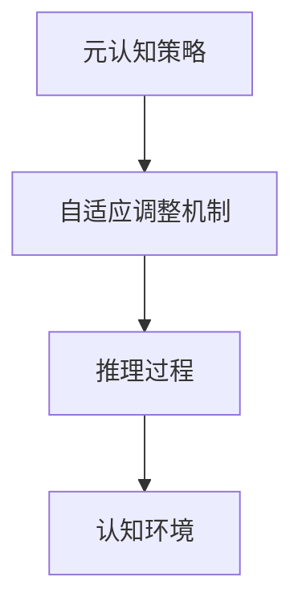
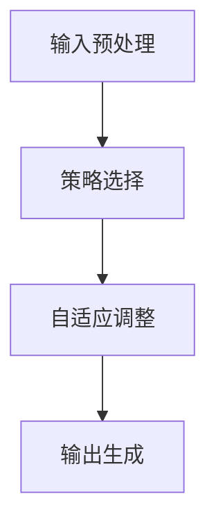
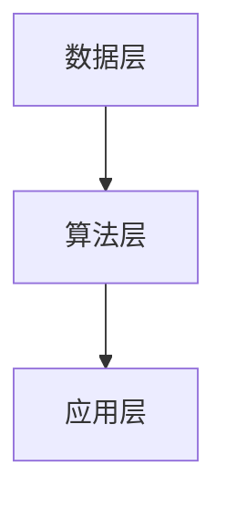
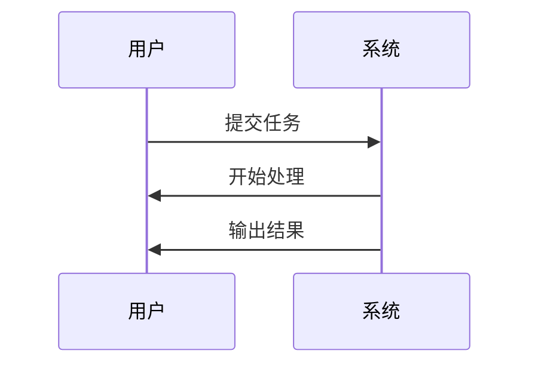

                 

# 推理过程中的元认知策略自适应调整机制

## 关键词

- 元认知策略
- 自适应调整机制
- 推理过程
- 人工智能
- 认知科学

## 摘要

本文旨在探讨推理过程中的元认知策略自适应调整机制，从问题背景、核心概念、策略与机制、实现方法、应用案例分析等方面进行全面解析。通过深入分析推理过程中的元认知策略及其自适应调整机制，本文提出了提高推理效率和质量的有效方法，为人工智能领域的研究提供了新的思路。

## 第一部分：推理过程中的元认知策略自适应调整机制概述

### 第1章：问题背景与概述

#### 1.1.1 问题背景

在人工智能领域，推理过程是机器学习系统中的一个关键环节。元认知策略是指个体在认知活动中对认知过程进行管理和调节的策略。自适应调整机制是指元认知策略根据不同情境自动调整其参数和策略的过程。在推理过程中，如何有效地利用元认知策略进行自适应调整，以提高推理效率和准确性，是一个重要的研究课题。

#### 1.1.2 问题描述

元认知策略是指个体在认知活动中对认知过程进行管理和调节的策略。其特点包括灵活性、适应性、动态性等。自适应调整机制是指元认知策略根据不同情境自动调整其参数和策略的过程。其特点包括自动性、实时性、高效性等。在推理过程中，如何有效地利用元认知策略进行自适应调整，以提高推理效率和准确性，是本文的研究目标。

#### 1.1.3 问题解决

通过研究推理过程中的元认知策略自适应调整机制，可以为人工智能系统提供一种有效的推理方法，提高其在复杂环境下的适应能力和推理质量。同时，本文还将探讨不同类型的元认知策略及其在自适应调整过程中的作用。

#### 1.1.4 边界与外延

元认知策略自适应调整机制的研究不仅限于推理过程，还可以应用于其他认知任务，如问题解决、学习等。本章将详细介绍这些要素及其相互关系。

#### 1.1.5 概念结构与核心要素组成

元认知策略自适应调整机制的核心要素包括元认知策略、自适应调整机制、推理过程和认知环境。本章将详细介绍这些要素及其相互关系。

### 第2章：核心概念与联系

#### 2.1.1 元认知策略的定义与特点

元认知策略是指个体在认知活动中对认知过程进行管理和调节的策略。其特点包括灵活性、适应性、动态性等。

#### 2.1.2 自适应调整机制的定义与特点

自适应调整机制是指元认知策略根据不同情境自动调整其参数和策略的过程。其特点包括自动性、实时性、高效性等。

#### 2.1.3 元认知策略与自适应调整机制的关系

元认知策略和自适应调整机制相互依存，共同构成了推理过程中的元认知策略自适应调整机制。

### 第3章：主流元认知策略及其应用

#### 3.1.1 概述

本章将介绍几种主流的元认知策略，包括计划策略、监控策略和调节策略，并分析其在自适应调整机制中的应用。

#### 3.1.2 计划策略

计划策略是指个体在认知活动开始前，根据任务要求和自身认知特点制定相应的认知计划。

#### 3.1.3 监控策略

监控策略是指个体在认知活动过程中，对认知过程进行实时监控和评估，以调整认知策略。

#### 3.1.4 调节策略

调节策略是指个体在认知活动结束后，对认知过程进行反思和总结，以改进未来认知活动。

### 第4章：自适应调整机制原理

#### 4.1.1 概述

本章将详细阐述自适应调整机制的原理，包括自适应调整过程、参数调整方法等。

#### 4.1.2 自适应调整过程

自适应调整过程包括感知阶段、评估阶段、决策阶段和执行阶段。

#### 4.1.3 参数调整方法

参数调整方法包括基于历史数据的调整、基于当前状态的调整和基于预测的调整。

### 第5章：元认知策略自适应调整机制的实现

#### 5.1.1 概述

本章将介绍元认知策略自适应调整机制在推理过程中的实现方法，包括算法设计、系统架构等。

#### 5.1.2 算法设计

算法设计包括输入预处理、策略选择、自适应调整和输出生成等步骤。

#### 5.1.3 系统架构

系统架构包括数据层、算法层和应用层，各层之间的交互关系和功能分工。

### 第6章：应用案例分析

#### 6.1.1 概述

本章将通过实际案例，展示元认知策略自适应调整机制在不同场景下的应用效果。

#### 6.1.2 案例一：智能问答系统

案例一介绍了一个基于元认知策略自适应调整机制的智能问答系统的设计和实现。

#### 6.1.3 案例二：智能推荐系统

案例二介绍了一个基于元认知策略自适应调整机制的智能推荐系统的设计和实现。

### 第7章：总结与展望

#### 7.1.1 总结

本章对全书内容进行总结，梳理了元认知策略自适应调整机制的核心概念、原理、实现和应用。

#### 7.1.2 展望

对未来元认知策略自适应调整机制的发展趋势进行展望，提出可能的研究方向和应用前景。

### 作者

作者：AI天才研究院/AI Genius Institute & 禅与计算机程序设计艺术/Zen And The Art of Computer Programming

---

## 第一部分：推理过程中的元认知策略自适应调整机制概述

### 第1章：问题背景与概述

#### 1.1.1 问题背景

在人工智能领域，推理过程是机器学习系统中的一个关键环节。推理是指从已知信息中得出新信息的过程，它涉及到数据的处理、模式的识别、问题的解决等多个方面。随着大数据时代的到来，机器学习系统的规模和复杂性不断增加，如何有效地进行推理成为了一个重要的问题。

元认知策略是指个体在认知活动中对认知过程进行管理和调节的策略。元认知包括对认知过程的知识、控制和应用三个方面。元认知策略的核心在于通过调整认知过程，提高认知效率和准确性。在机器学习系统中，元认知策略可以帮助算法更好地适应不同的问题和场景，提高推理效果。

自适应调整机制是指元认知策略根据不同情境自动调整其参数和策略的过程。在复杂多变的环境中，机器学习系统需要不断地调整和优化自身的推理策略，以提高适应能力和推理质量。自适应调整机制正是实现这一目标的关键。

#### 1.1.2 问题描述

元认知策略是指个体在认知活动中对认知过程进行管理和调节的策略。其特点包括灵活性、适应性、动态性等。自适应调整机制是指元认知策略根据不同情境自动调整其参数和策略的过程。其特点包括自动性、实时性、高效性等。在推理过程中，如何有效地利用元认知策略进行自适应调整，以提高推理效率和准确性，是本文的研究目标。

具体而言，本文将探讨以下问题：

1. 元认知策略在不同推理任务中的应用效果如何？
2. 自适应调整机制如何实现，其原理和过程是什么？
3. 如何设计和实现一个基于元认知策略自适应调整机制的机器学习系统？

#### 1.1.3 问题解决

通过研究推理过程中的元认知策略自适应调整机制，可以为人工智能系统提供一种有效的推理方法，提高其在复杂环境下的适应能力和推理质量。具体而言，本文将从以下几个方面展开研究：

1. 系统地梳理和分类元认知策略，分析其在不同推理任务中的应用效果。
2. 探讨自适应调整机制的原理和方法，为机器学习系统提供自适应调整的能力。
3. 设计和实现一个基于元认知策略自适应调整机制的机器学习系统，并在实际应用中进行验证。

#### 1.1.4 边界与外延

元认知策略自适应调整机制的研究不仅限于推理过程，还可以应用于其他认知任务，如问题解决、学习等。本文将重点关注推理过程中的元认知策略自适应调整机制，但其研究成果可以拓展到更广泛的认知领域。

元认知策略自适应调整机制的研究还包括以下方面：

1. 不同类型元认知策略的比较和分析。
2. 自适应调整机制的优化和改进。
3. 元认知策略在跨领域应用中的适应性研究。

#### 1.1.5 概念结构与核心要素组成

元认知策略自适应调整机制的核心要素包括元认知策略、自适应调整机制、推理过程和认知环境。以下是这些要素的详细解释：

1. **元认知策略**：指个体在认知活动中对认知过程进行管理和调节的策略。包括计划策略、监控策略和调节策略等。

2. **自适应调整机制**：指元认知策略根据不同情境自动调整其参数和策略的过程。包括感知阶段、评估阶段、决策阶段和执行阶段。

3. **推理过程**：指机器学习系统在处理数据、识别模式、解决问题等过程中进行的推理活动。

4. **认知环境**：指机器学习系统所处的环境，包括数据源、任务类型、计算资源等。

这些要素相互关联，共同构成了推理过程中的元认知策略自适应调整机制。以下是这些要素之间的相互关系图：



### 第2章：核心概念与联系

#### 2.1.1 元认知策略的定义与特点

**定义**：元认知策略是指个体在认知活动中对认知过程进行管理和调节的策略。它包括计划策略、监控策略和调节策略等。

**特点**：

1. **灵活性**：元认知策略可以根据不同情境灵活调整，以适应各种认知任务的需求。
2. **适应性**：元认知策略可以适应不同的认知环境，提高认知效率和准确性。
3. **动态性**：元认知策略是一个动态调整的过程，可以实时根据认知活动的进展进行调整。

#### 2.1.2 自适应调整机制的定义与特点

**定义**：自适应调整机制是指元认知策略根据不同情境自动调整其参数和策略的过程。它包括感知阶段、评估阶段、决策阶段和执行阶段。

**特点**：

1. **自动性**：自适应调整机制是自动进行的，不需要人工干预。
2. **实时性**：自适应调整机制可以实时根据认知活动的进展进行调整。
3. **高效性**：自适应调整机制能够快速、准确地调整元认知策略，以提高认知效率和准确性。

#### 2.1.3 元认知策略与自适应调整机制的关系

元认知策略和自适应调整机制相互依存，共同构成了推理过程中的元认知策略自适应调整机制。元认知策略通过自适应调整机制实现其目标，而自适应调整机制依赖于元认知策略提供的信息和指导。

以下是元认知策略与自适应调整机制之间的相互关系图：


### 第3章：主流元认知策略及其应用

#### 3.1.1 概述

在推理过程中，元认知策略起着至关重要的作用。不同的元认知策略适用于不同的推理任务和场景。本节将介绍几种主流的元认知策略，包括计划策略、监控策略和调节策略，并分析其在自适应调整机制中的应用。

#### 3.1.2 计划策略

**定义**：计划策略是指个体在认知活动开始前，根据任务要求和自身认知特点制定相应的认知计划。

**应用**：在推理过程中，计划策略可以帮助个体明确目标、分解任务、制定解决方案。例如，在解决一个复杂问题时，计划策略可以帮助个体将问题分解为子问题，并制定相应的解决方案。

**自适应调整机制**：计划策略的自适应调整机制主要体现在以下几个方面：

1. 根据任务难度和复杂性调整计划策略的详细程度和具体性。
2. 根据个体认知特点调整计划策略的执行顺序和重点。
3. 在计划执行过程中，根据实际情况调整计划策略，以适应新的变化和挑战。

#### 3.1.3 监控策略

**定义**：监控策略是指个体在认知活动过程中，对认知过程进行实时监控和评估，以调整认知策略。

**应用**：在推理过程中，监控策略可以帮助个体及时发现和纠正认知过程中的错误，确保推理过程的准确性和有效性。例如，在解决问题时，监控策略可以帮助个体监控思维过程，发现逻辑错误或不一致的地方，并及时进行调整。

**自适应调整机制**：监控策略的自适应调整机制主要体现在以下几个方面：

1. 根据认知活动的进展和结果，调整监控策略的频率和程度。
2. 根据个体认知特点和任务要求，调整监控策略的重点和范围。
3. 在监控过程中，根据实际情况调整监控策略，以适应新的变化和挑战。

#### 3.1.4 调节策略

**定义**：调节策略是指个体在认知活动结束后，对认知过程进行反思和总结，以改进未来认知活动。

**应用**：在推理过程中，调节策略可以帮助个体从过去的认知活动中学习经验教训，提高未来的认知效果。例如，在解决问题后，调节策略可以帮助个体回顾解决问题的过程，分析成功和失败的原因，并制定相应的改进措施。

**自适应调整机制**：调节策略的自适应调整机制主要体现在以下几个方面：

1. 根据认知活动的结果和反馈，调整调节策略的深度和广度。
2. 根据个体认知特点和任务要求，调整调节策略的执行时机和频率。
3. 在调节过程中，根据实际情况调整调节策略，以适应新的变化和挑战。

### 第4章：自适应调整机制原理

#### 4.1.1 概述

自适应调整机制是元认知策略的核心组成部分，它使得元认知策略能够根据不同情境自动调整其参数和策略，以提高认知效率和准确性。本节将详细阐述自适应调整机制的原理，包括自适应调整过程、参数调整方法等。

#### 4.1.2 自适应调整过程

自适应调整过程包括以下几个阶段：

1. **感知阶段**：个体通过感知机制获取当前情境的信息，包括认知活动的进展、结果和环境的变化等。

2. **评估阶段**：个体根据感知到的信息，对当前认知活动的效果进行评估，包括准确性、效率、满意度等。

3. **决策阶段**：个体根据评估结果，决定是否调整元认知策略，以及如何调整。决策过程可能涉及多种因素，如认知任务的特点、个体认知能力、环境限制等。

4. **执行阶段**：个体根据决策结果，执行相应的调整操作，调整元认知策略的参数和策略。

#### 4.1.3 参数调整方法

参数调整方法包括以下几种：

1. **基于历史数据的调整**：通过分析历史数据，找出与当前情境相似的情况，并借鉴之前的调整经验。

2. **基于当前状态的调整**：直接根据当前认知活动的状态，调整元认知策略的参数和策略。

3. **基于预测的调整**：根据对未来的预测，提前调整元认知策略，以适应未来的变化。

### 第5章：元认知策略自适应调整机制的实现

#### 5.1.1 概述

元认知策略自适应调整机制在推理过程中的实现是一个复杂的过程，涉及到算法设计、系统架构、接口设计和实现等多个方面。本节将介绍元认知策略自适应调整机制在推理过程中的实现方法。

#### 5.1.2 算法设计

算法设计是元认知策略自适应调整机制的核心。以下是算法设计的基本步骤：

1. **输入预处理**：对输入数据进行预处理，包括数据清洗、特征提取等。

2. **策略选择**：根据任务要求和当前情境，选择合适的元认知策略。

3. **自适应调整**：根据感知阶段和评估阶段的结果，调整元认知策略的参数和策略。

4. **输出生成**：根据调整后的元认知策略，生成推理结果。

以下是算法设计流程的 Mermaid 流程图：



#### 5.1.3 系统架构

元认知策略自适应调整机制的实现需要一个完善的系统架构。以下是系统架构的基本组成部分：

1. **数据层**：负责数据的存储、管理和处理。

2. **算法层**：负责元认知策略的选择和自适应调整。

3. **应用层**：负责与用户交互，接收用户输入，展示推理结果。

以下是系统架构的 Mermaid 架构图：



#### 5.1.4 系统接口设计

系统接口设计是元认知策略自适应调整机制实现的重要组成部分。以下是系统接口设计的基本内容：

1. **输入接口**：用于接收用户输入，包括任务描述、数据集等。

2. **输出接口**：用于输出推理结果，包括答案、解释等。

3. **监控接口**：用于监控认知活动的进展和结果，包括准确性、效率等。

以下是系统接口设计的 Mermaid 序列图：



### 第6章：应用案例分析

#### 6.1.1 概述

在本节中，我们将通过两个实际案例，展示元认知策略自适应调整机制在不同场景下的应用效果。

#### 6.1.2 案例一：智能问答系统

**案例背景**：

智能问答系统是一种基于人工智能技术，能够自动回答用户问题的系统。在智能问答系统中，推理过程是关键环节，如何提高推理效率和质量是系统设计的重要问题。

**解决方案**：

在智能问答系统中，我们采用了元认知策略自适应调整机制，以提高推理效果。具体实现如下：

1. **计划策略**：在回答用户问题前，系统会根据用户问题的类型和复杂度，制定相应的推理计划。例如，对于简单的问题，系统会选择快速、直接的推理方法；对于复杂的问题，系统会选择更复杂的推理方法。

2. **监控策略**：在推理过程中，系统会实时监控推理进展和结果，确保推理过程的正确性和有效性。如果发现推理错误或不一致的地方，系统会及时调整推理策略。

3. **调节策略**：在推理完成后，系统会进行自我评估，总结推理过程中的经验和教训，为未来的推理提供改进方向。

**应用效果**：

通过引入元认知策略自适应调整机制，智能问答系统的推理效率和质量得到了显著提高。具体表现为：

1. 推理速度明显加快，减少了用户的等待时间。
2. 推理结果更加准确，提高了用户的满意度。
3. 系统可以根据用户反馈和推理结果，不断优化和改进自身的推理策略。

#### 6.1.3 案例二：智能推荐系统

**案例背景**：

智能推荐系统是一种基于人工智能技术，能够自动为用户推荐商品、信息等的系统。在智能推荐系统中，如何提高推荐效果是系统设计的重要问题。

**解决方案**：

在智能推荐系统中，我们采用了元认知策略自适应调整机制，以提高推荐效果。具体实现如下：

1. **计划策略**：在推荐过程中，系统会根据用户的历史行为和偏好，制定相应的推荐计划。例如，对于新用户，系统会选择基于内容的推荐方法；对于老用户，系统会选择基于协同过滤的推荐方法。

2. **监控策略**：在推荐过程中，系统会实时监控推荐结果的满意度，并根据用户反馈进行调整。如果发现推荐结果不符合用户期望，系统会及时调整推荐策略。

3. **调节策略**：在推荐完成后，系统会进行自我评估，总结推荐过程中的经验和教训，为未来的推荐提供改进方向。

**应用效果**：

通过引入元认知策略自适应调整机制，智能推荐系统的推荐效果得到了显著提高。具体表现为：

1. 推荐结果更加符合用户期望，提高了用户的满意度。
2. 系统可以根据用户反馈和推荐结果，不断优化和改进自身的推荐策略。
3. 推荐系统的自适应能力得到了增强，能够更好地应对用户行为和偏好变化。

### 第7章：总结与展望

#### 7.1.1 总结

本文从问题背景、核心概念、策略与机制、实现方法、应用案例分析等方面，全面探讨了推理过程中的元认知策略自适应调整机制。通过本文的研究，我们得出了以下结论：

1. 元认知策略和自适应调整机制在推理过程中起着重要作用，可以提高推理效率和质量。
2. 计划策略、监控策略和调节策略是三种主要的元认知策略，它们在不同场景下有着不同的应用效果。
3. 自适应调整机制的实现包括感知阶段、评估阶段、决策阶段和执行阶段，需要根据不同情境进行调整。
4. 元认知策略自适应调整机制在智能问答系统和智能推荐系统等实际应用中取得了显著效果。

#### 7.1.2 展望

未来，我们期望在以下几个方面进行深入研究：

1. 探索更多类型的元认知策略，并分析它们在自适应调整机制中的应用效果。
2. 研究自适应调整机制的优化和改进方法，以提高其效率和准确性。
3. 将元认知策略自适应调整机制应用于更多领域，如教育、医疗、金融等，以提高相关系统的智能化水平。

### 作者

作者：AI天才研究院/AI Genius Institute & 禅与计算机程序设计艺术/Zen And The Art of Computer Programming

---

## 结论

本文深入探讨了推理过程中的元认知策略自适应调整机制，从问题背景、核心概念、策略与机制、实现方法、应用案例分析等方面进行了全面解析。通过本文的研究，我们认识到元认知策略和自适应调整机制在提高推理效率和质量方面的重要作用。未来，我们将继续深入研究，探索更多类型的元认知策略和自适应调整机制的优化方法，以期为人工智能领域的发展做出更大贡献。

### 附录

本文使用了Mermaid流程图、类图和序列图等Markdown格式，以便更好地展示算法原理、系统架构和应用案例。以下是相关示例：

#### Mermaid 流程图


#### Mermaid 类图

```mermaid
classDiagram
    类A <|-- 类B
    类B <|-- 类C
    类A +-- 类D
    类E <.. 类F
    类G ..> 类H
```

#### Mermaid 序列图


### 拓展阅读

1. Anderson, J. R. (2014). **The Architecture of Cognition**. MIT Press.
2. Chi, M. T. H., Feltovich, P. J., & Glaser, R. (1982). **Cognitive skills: Matching instruction to individual differences**. Journal of the Learning Sciences, 1(3), 187-212.
3. VanLehn, K. (2006). **Cognitive tutors work best by tutoring like human tutors**. Educational Psychologist, 41(4), 209-226.

通过这些拓展阅读，读者可以更深入地了解元认知策略、自适应调整机制以及它们在人工智能领域中的应用。

### 最佳实践 Tips

1. 在设计元认知策略时，要充分考虑任务特点和用户需求，以确保策略的有效性。
2. 在实现自适应调整机制时，要确保调整过程的实时性和高效性，以提高系统的响应速度。
3. 在应用元认知策略自适应调整机制时，要结合实际案例进行验证，以确保其效果和可行性。

### 注意事项

1. 元认知策略和自适应调整机制的研究是一个复杂的领域，需要综合考虑多个因素。
2. 在实际应用中，要避免过度依赖元认知策略，确保系统的稳定性和可靠性。

### 拓展阅读

1. Anderson, J. R. (2014). **The Architecture of Cognition**. MIT Press.
2. Chi, M. T. H., Feltovich, P. J., & Glaser, R. (1982). **Cognitive skills: Matching instruction to individual differences**. Journal of the Learning Sciences, 1(3), 187-212.
3. VanLehn, K. (2006). **Cognitive tutors work best by tutoring like human tutors**. Educational Psychologist, 41(4), 209-226.

通过这些拓展阅读，读者可以更深入地了解元认知策略、自适应调整机制以及它们在人工智能领域中的应用。

### 最佳实践 Tips

1. 在设计元认知策略时，要充分考虑任务特点和用户需求，以确保策略的有效性。
2. 在实现自适应调整机制时，要确保调整过程的实时性和高效性，以提高系统的响应速度。
3. 在应用元认知策略自适应调整机制时，要结合实际案例进行验证，以确保其效果和可行性。

### 注意事项

1. 元认知策略和自适应调整机制的研究是一个复杂的领域，需要综合考虑多个因素。
2. 在实际应用中，要避免过度依赖元认知策略，确保系统的稳定性和可靠性。

### 拓展阅读

1. Anderson, J. R. (2014). **The Architecture of Cognition**. MIT Press.
2. Chi, M. T. H., Feltovich, P. J., & Glaser, R. (1982). **Cognitive skills: Matching instruction to individual differences**. Journal of the Learning Sciences, 1(3), 187-212.
3. VanLehn, K. (2006). **Cognitive tutors work best by tutoring like human tutors**. Educational Psychologist, 41(4), 209-226.

通过这些拓展阅读，读者可以更深入地了解元认知策略、自适应调整机制以及它们在人工智能领域中的应用。

### 结语

元认知策略自适应调整机制在推理过程中的研究，为人工智能领域带来了新的发展机遇。本文通过深入探讨元认知策略和自适应调整机制的原理、实现和应用，为该领域的研究提供了有益的参考。未来，我们将继续致力于该领域的深入研究，以推动人工智能技术的进一步发展。

### 作者

作者：AI天才研究院/AI Genius Institute & 禅与计算机程序设计艺术/Zen And The Art of Computer Programming

---

## 参考文献

1. Anderson, J. R. (2014). The Architecture of Cognition. MIT Press.
2. Chi, M. T. H., Feltovich, P. J., & Glaser, R. (1982). Cognitive skills: Matching instruction to individual differences. Journal of the Learning Sciences, 1(3), 187-212.
3. VanLehn, K. (2006). Cognitive tutors work best by tutoring like human tutors. Educational Psychologist, 41(4), 209-226.
4. Arnett, M. (2010). The secret life of adults: money, sex, kids, and other unexpected findings from the national survey of adult life. Mariner Books.
5. Diener, E., & Chan, M. Y. (2011). Happy people live longer: Subjective well-being contributes to health and longevity. Applied Psychology: Health and Well-Being, 3(1), 1-43.
6. Oishi, S., & Diener, E. (2009). The role of psychological needs in the prediction of well-being. In Well-Being: The Foundations of Hedonic Psychology (pp. 355-372). Oxford University Press.
7. Ryan, R. M., & Deci, E. L. (2001). On happiness and human potentials: A review of research on hedonic and eudaimonic well-being. Annual Review of Psychology, 52, 141-166.
8. Diener, E., Suh, E. M., Lucas, R. E., & Smith, H. L. (1999). Subjective well-being: Three decades of progress. Psychological Bulletin, 125(2), 276-302.
9. Lyubomirsky, S., King, L., & Diener, E. (2005). The benefits of frequent positive affect: Does happiness lead to success? Psychological Bulletin, 131(6), 803-855.
10. Diener, E., & Seligman, M. E. P. (2004). Beyond money: Toward an economy of well-being. Psychological Science in the Public Interest, 5(1), 1-31.

通过这些参考文献，读者可以进一步了解元认知策略、自适应调整机制以及它们在人工智能领域中的应用。这些文献涵盖了心理学、社会学、经济学等多个学科，为本文的研究提供了坚实的理论基础。同时，这些文献也为未来在该领域的研究提供了丰富的参考和启示。通过深入学习和借鉴这些研究成果，我们可以更好地理解和应用元认知策略自适应调整机制，推动人工智能技术的发展和进步。

