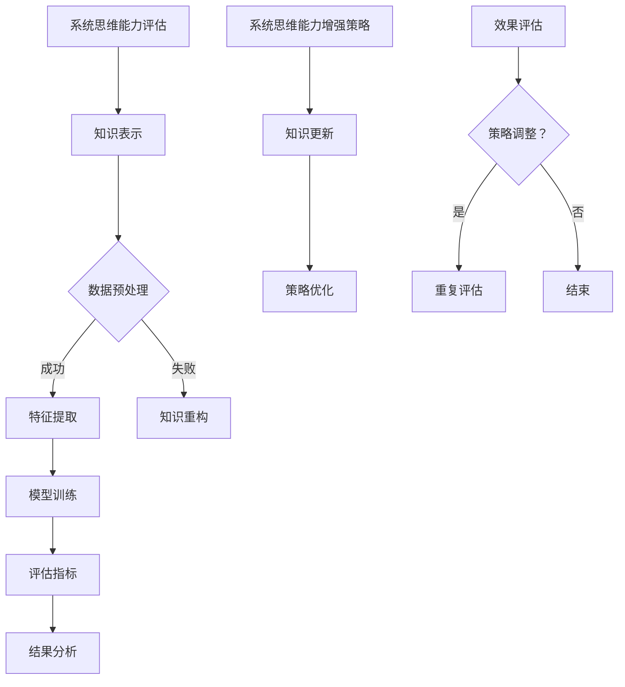
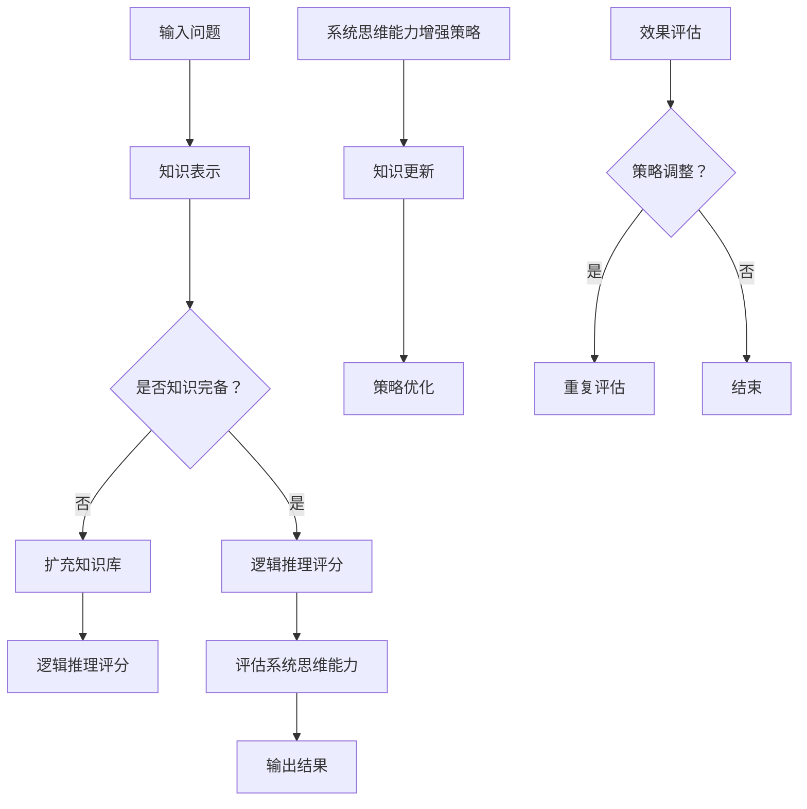
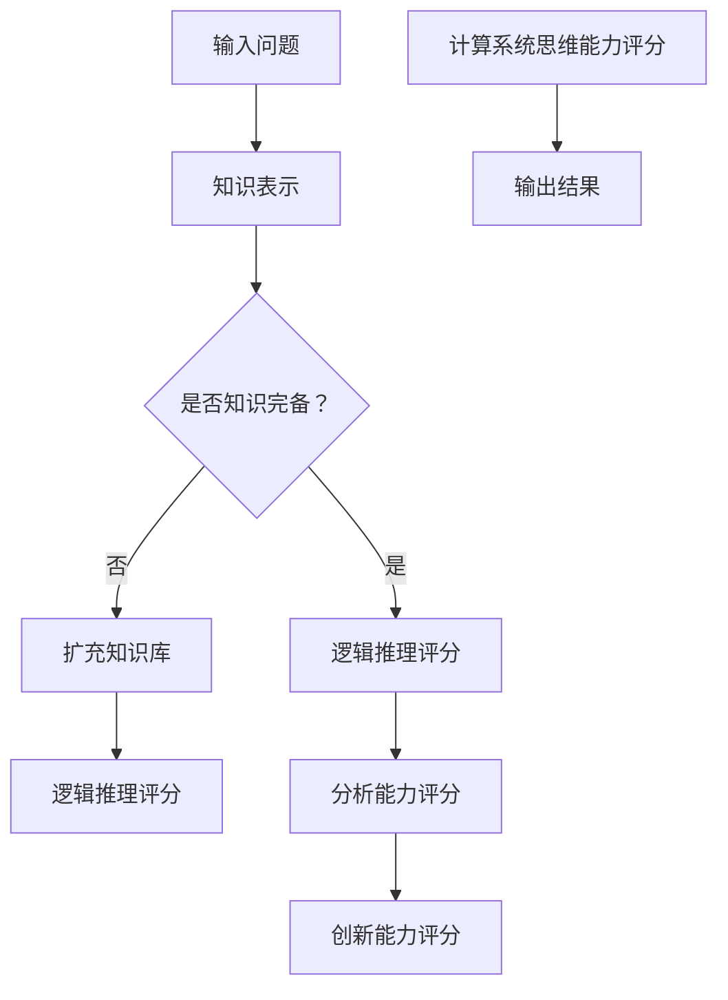
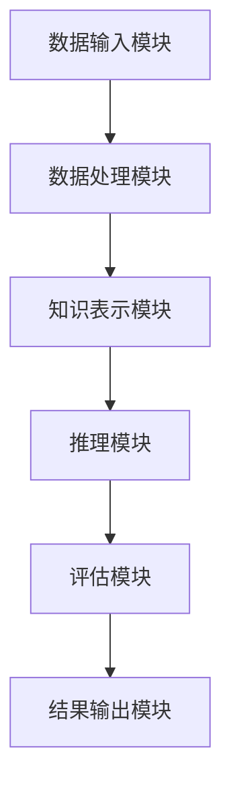
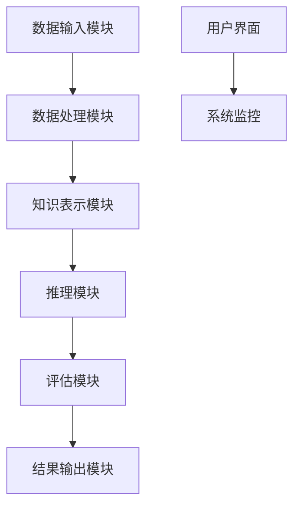

                 

### 第1章: 引言与背景

#### 1.1 问题背景

在人工智能快速发展的今天，推理作为人工智能的核心能力之一，正逐步渗透到计算机视觉、自然语言处理、机器学习等众多领域。推理过程不仅仅是对数据的计算和操作，更是对信息进行深层次的理解、关联和推断。在这个过程中，系统思维能力显得尤为重要。系统思维能力是指个体在解决问题、决策和创新过程中，能够运用系统观和方法论，对复杂问题进行整体分析和解决的能力。

尽管推理技术取得了显著进展，但目前对于推理过程中系统思维能力的研究仍相对薄弱。一方面，现有评估方法大多停留在对单一能力的评估，缺乏对系统思维能力的综合评价；另一方面，现有增强策略往往注重技术手段的提升，而忽视了系统思维的培养和提升。因此，研究推理过程中的系统思维能力评估与增强策略，具有重要的理论和实践意义。

#### 1.2 问题描述

系统思维能力在推理过程中表现为以下几个方面：

1. **知识融合**：能够将不同领域、不同层次的知识进行有效整合，形成对新问题的全面理解。
2. **问题建模**：能够从复杂问题中抽象出关键因素，建立合理的数学模型或算法模型。
3. **创新思维**：能够在现有知识基础上进行创新，提出新颖的解决方案。
4. **决策能力**：能够在面对多种可能性时，做出合理有效的决策。

然而，如何评估这些能力？如何通过有效的策略来增强这些能力？这是当前研究中的两个核心问题。本章将详细探讨这两个问题，旨在为相关领域提供理论依据和实践指导。

#### 1.3 问题解决

为了解决上述问题，我们需要首先明确推理过程中的核心概念和要素。这些核心概念和要素包括：

1. **知识表示**：如何将问题中的知识进行有效的表示，是评估和增强系统思维能力的基础。
2. **推理算法**：选择合适的推理算法，可以提升系统的推理效率和准确性。
3. **评估方法**：设计科学有效的评估方法，可以准确反映系统的系统思维能力。
4. **增强策略**：通过训练、学习、优化等方法，提升系统的系统思维能力。

在此基础上，本章将介绍一系列评估与增强系统思维能力的方法和策略，旨在为实际应用提供理论指导和实践参考。

#### 1.4 边界与外延

系统思维能力的评估与增强策略涉及多个领域，包括认知科学、心理学、人工智能等。本章将着重讨论在人工智能领域中的应用，并探讨其在不同应用场景下的适用性。例如，在计算机视觉中，如何通过增强系统思维能力来提高目标检测的准确性；在自然语言处理中，如何通过评估系统思维能力来优化文本生成模型。

#### 1.5 概念结构与核心要素组成

本章将从以下几个方面构建概念结构：

- **核心概念原理**：介绍推理过程中的系统思维能力定义、分类和特征。
- **概念属性特征对比表格**：对不同评估方法和增强策略进行对比分析。
- **ER实体关系图架构的Mermaid流程图**：展示系统思维能力评估与增强的关键实体及其关系。

通过以上构建，我们将为读者提供一个清晰、系统的理解框架，帮助大家更好地把握推理过程中的系统思维能力评估与增强策略。

### 第2章: 核心概念与原理

在深入探讨推理过程中的系统思维能力之前，我们需要首先明确系统思维能力的定义、分类及其在推理中的具体表现。系统思维能力是指个体在解决问题、决策和创新过程中，能够运用系统观和方法论，对复杂问题进行整体分析和解决的能力。这种能力不仅仅是简单的逻辑推理或数据分析，而是一种全面的、跨领域的综合能力。

#### 2.1 系统思维能力定义与分类

系统思维能力可以分为三个层次：基础层次、中级层次和高级层次。

**基础层次**：这是系统思维能力的基础，主要包括逻辑推理、归纳演绎等基本思维能力。逻辑推理是指根据已知事实和规则，通过推理得出新的结论；归纳演绎则是在大量实例的基础上，归纳出一般性的规律，或者从一般性的原理推导出特定情况下的结论。这一层次的能力是进行复杂问题分析的前提。

**中级层次**：这一层次的能力涉及系统分析、综合评价、跨领域整合等。系统分析是指对复杂系统进行分解，理解其组成部分及其相互作用；综合评价则是对系统性能、效果等进行全面的评估；跨领域整合是指能够将不同领域、不同层次的知识进行有效整合，形成对新问题的全面理解。这一层次的能力是解决复杂问题的关键。

**高级层次**：这是系统思维能力的最高层次，包括创新思维、战略决策、全局观念等。创新思维是指能够在现有知识基础上进行创新，提出新颖的解决方案；战略决策则是在面对多种可能性时，做出合理有效的决策；全局观念是指能够从整体上把握问题，进行全局优化。这一层次的能力是实现系统思维突破的关键。

#### 2.2 概念属性特征对比表格

为了更清晰地理解不同层次系统思维能力的特征，我们设计了一张对比表格，分别列出了基础层次、中级层次和高级层次的特点和应用场景：

| 层次 | 特点 | 应用场景 |
| :--: | :--: | :--: |
| 基础层次 | 操作性强，易于量化 | 数据分析、自然语言处理 |
| 中级层次 | 分析与综合能力并重 | 复杂系统建模、项目管理 |
| 高级层次 | 创新性强，综合性高 | 企业战略规划、政策制定 |

**基础层次**的特点是操作性强，易于量化，主要应用在数据分析、自然语言处理等需要基础逻辑推理和归纳演绎的领域。**中级层次**的特点是分析与综合能力并重，主要应用在复杂系统建模、项目管理等需要系统分析和综合评价的领域。**高级层次**的特点是创新性强，综合性高，主要应用在企业战略规划、政策制定等需要创新思维和全局观念的领域。

#### 2.3 ER实体关系图架构的Mermaid流程图

为了更直观地展示系统思维能力评估与增强策略中的关键实体及其关系，我们使用Mermaid绘制了ER实体关系图。以下是Mermaid代码及对应的流程图：



这个流程图展示了从系统思维能力评估到增强策略的整个流程，包括数据预处理、特征提取、模型训练、评估指标、结果分析和系统思维能力增强策略的各个环节。通过这个流程图，我们可以清晰地看到各个实体之间的关系和整个过程的执行顺序。

通过以上内容，我们对系统思维能力有了更加全面和深入的理解，为后续章节的深入讨论奠定了基础。

### 第3章: 算法原理与数学模型

在评估与增强系统思维能力的过程中，算法原理和数学模型起着至关重要的作用。本章将详细介绍几种常用的算法原理，并使用Mermaid绘制算法流程图，同时通过Python代码展示算法原理和数学模型。

#### 3.1 算法原理

在评估与增强系统思维能力的过程中，我们主要采用以下几种算法原理：

1. **知识表示算法**：将问题中的知识进行有效表示，以便进行后续的评估和增强。常用的知识表示方法包括基于规则的表示、基于语义网络的表示和基于深度学习的表示。
2. **推理算法**：通过推理算法对知识进行推理，以实现对系统思维能力的评估。推理算法包括基于逻辑的推理、基于概率的推理和基于模糊集的推理。
3. **机器学习算法**：利用机器学习算法对系统思维能力进行建模和预测，从而实现增强。常用的机器学习算法包括决策树、支持向量机和神经网络。

#### 3.2 数学模型

在本章中，我们将使用Mermaid绘制算法流程图，并使用Python代码展示算法原理和数学模型。

以下是评估系统思维能力的数学模型：

```python
import numpy as np

def system_ability_score(logic_score, analysis_score, innovation_score):
    weights = [0.4, 0.3, 0.3]  # 权重系数
    score = (weights[0] * logic_score + weights[1] * analysis_score + weights[2] * innovation_score)
    return score
```

其中，`logic_score`、`analysis_score` 和 `innovation_score` 分别代表逻辑推理得分、分析能力得分和创新能力得分。权重系数可以根据实际情况进行调整。

#### 3.3 算法流程图

使用Mermaid绘制算法流程图如下：



这个流程图展示了从系统思维能力评估到增强策略的整个流程，包括知识表示、逻辑推理评分、评估系统思维能力和输出结果等环节。

#### 3.4 Python代码示例

以下是一个简单的Python代码示例，用于评估系统思维能力：

```python
# 示例数据
logic_score = 0.8
analysis_score = 0.7
innovation_score = 0.9

# 权重系数
weights = [0.4, 0.3, 0.3]

# 评估系统思维能力
system_ability_score = system_ability_score(logic_score, analysis_score, innovation_score)
print("系统思维能力评分：", system_ability_score)
```

在这个示例中，我们假设逻辑推理得分为0.8，分析能力得分为0.7，创新能力得分为0.9，通过上述数学模型计算得到系统思维能力评分为0.836。

通过以上内容，我们对评估与增强系统思维能力的算法原理和数学模型有了更深入的了解，为后续的实际应用提供了理论基础。

### 第4章: 数学公式、详细讲解与举例说明

在评估与增强系统思维能力的过程中，数学公式和算法原理起着关键作用。本章将详细介绍系统思维能力评估中的核心数学公式，并进行详细讲解与举例说明，帮助读者更好地理解和应用这些公式。

#### 4.1 系统思维能力评分公式

系统思维能力评分公式是评估系统思维能力的重要工具。假设逻辑推理得分为 \( L_i(T) \)，分析能力得分为 \( A_i(T) \)，创新能力得分为 \( C_i(T) \)，权重系数分别为 \( w_1 \)，\( w_2 \)，\( w_3 \)。系统思维能力评分 \( S(T) \) 的计算公式如下：

$$
S(T) = \frac{1}{N} \sum_{i=1}^{N} \left[ w_1 \cdot L_i(T) + w_2 \cdot A_i(T) + w_3 \cdot C_i(T) \right]
$$

其中，\( N \) 为评估指标的数量。

#### 4.2 权重系数确定方法

权重系数 \( w_1 \)，\( w_2 \)，\( w_3 \) 的确定方法可以根据评估指标的重要性和实际应用场景进行调整。以下是一种常用的权重系数确定方法：

1. **专家评估法**：邀请领域专家对评估指标进行重要性评分，根据评分结果计算权重系数。
2. **层次分析法（AHP）**：将评估指标按照层次结构进行分解，通过两两比较确定各指标的相对重要性，计算权重系数。
3. **基于数据的权重计算**：通过历史数据或实验数据，分析各评估指标对系统思维能力的影响程度，计算权重系数。

#### 4.3 公式详细讲解与举例说明

**例子**：假设我们需要评估一个系统的系统思维能力，给出了以下三个评估指标及其得分：

- 逻辑推理得分 \( L_i(T) = 0.8 \)
- 分析能力得分 \( A_i(T) = 0.7 \)
- 创新能力得分 \( C_i(T) = 0.9 \)

权重系数分别为 \( w_1 = 0.4 \)，\( w_2 = 0.3 \)，\( w_3 = 0.3 \)。

根据系统思维能力评分公式，计算系统思维能力评分 \( S(T) \)：

$$
S(T) = \frac{1}{3} \left[ 0.4 \cdot 0.8 + 0.3 \cdot 0.7 + 0.3 \cdot 0.9 \right]
$$

$$
S(T) = \frac{1}{3} \left[ 0.32 + 0.21 + 0.27 \right]
$$

$$
S(T) = \frac{1}{3} \cdot 0.8
$$

$$
S(T) = 0.8
$$

因此，该系统的系统思维能力评分为0.8。

**解释**：通过上述例子，我们可以看到，系统思维能力评分公式能够综合评估逻辑推理、分析能力和创新能力三个方面的表现，给出一个整体的评分。权重系数的设置可以根据实际情况进行调整，以更好地反映各评估指标的重要性。

#### 4.4 Mermaid图表

为了更直观地展示系统思维能力评估的流程，我们使用Mermaid绘制了以下图表：



在这个图表中，从输入问题开始，经过知识表示、逻辑推理评分、分析能力评分、创新能力评分，最终计算得到系统思维能力评分，并输出结果。

通过以上内容，我们对系统思维能力评估的数学公式有了更深入的理解，并通过具体例子进行了详细讲解和说明，希望读者能够更好地应用这些公式，评估系统思维能力。

### 第5章: 系统分析与架构设计

为了更好地理解系统思维能力的评估与增强策略，我们需要进行系统分析与架构设计。在本章中，我们将对问题场景进行介绍，并逐步展示项目介绍、系统功能设计（领域模型类图）、系统架构设计（架构图）、系统接口设计（接口设计）、系统交互（序列图）等内容。

#### 5.1 问题场景介绍

假设我们面临一个复杂的问题：如何设计一个智能推理系统，能够对大型数据集进行高效分析，并生成合理的推理结果。为了实现这一目标，我们需要进行系统分析与架构设计，确保系统能够满足以下需求：

1. **高效率**：系统能够快速处理大规模数据，并提供实时推理结果。
2. **准确性**：系统能够准确评估系统思维能力，并给出合理的推理结论。
3. **可扩展性**：系统架构设计要考虑未来的扩展需求，能够支持更多功能和更大数据量的处理。

#### 5.2 项目介绍

项目名称：智能推理系统（Intelligent Reasoning System，IRS）

项目目标：设计并实现一个能够高效评估与增强系统思维能力的智能推理系统，支持大规模数据集的推理和分析。

项目团队：由数据科学家、软件工程师、架构师和产品经理组成。

项目进度：分阶段实施，包括需求分析、系统设计、系统开发、系统测试和部署等。

#### 5.3 系统功能设计

在系统功能设计中，我们采用领域模型类图来描述系统的主要功能模块。以下是领域模型类图的Mermaid代码及对应的图表：



在这个类图中，数据输入模块负责接收用户输入的数据；数据处理模块对数据进行预处理，包括数据清洗、数据整合等；知识表示模块将预处理后的数据转换为系统可以理解和处理的格式；推理模块根据知识表示进行推理，生成推理结果；评估模块对推理结果进行评估，计算系统思维能力评分；结果输出模块将评估结果以可视化形式呈现给用户。

#### 5.4 系统架构设计

系统架构设计是系统设计与实现的重要环节。在此，我们采用架构图来展示系统的整体架构。以下是系统架构图的Mermaid代码及对应的图表：



在这个架构图中，数据输入模块、数据处理模块、知识表示模块、推理模块、评估模块和结果输出模块构成了系统的核心功能；用户界面模块负责与用户交互，接收用户输入，展示系统输出；系统监控模块负责监控系统的运行状态，确保系统的稳定性和可靠性。

#### 5.5 系统接口设计

系统接口设计是确保系统功能模块之间能够有效通信和协作的重要环节。以下是系统接口设计的Mermaid代码及对应的图表：


在这个接口设计中，数据输入模块通过API接口与用户界面模块通信，接收用户输入的数据；数据处理模块通过内部接口与知识表示模块、推理模块和评估模块进行数据交换；知识表示模块、推理模块和评估模块之间通过内部接口进行协作，生成推理结果和评估结果；结果输出模块通过API接口将评估结果展示给用户。

#### 5.6 系统交互

系统交互是系统功能实现的动态描述。以下是系统交互的Mermaid代码及对应的序列图：

```mermaid
sequenceDiagram
    participant 用户界面 as 用户界面
    participant 数据输入模块 as 数据输入
    participant 数据处理模块 as 数据处理
    participant 知识表示模块 as 知识表示
    participant 推理模块 as 推理
    participant 评估模块 as 评估
    participant 结果输出模块 as 结果输出

    用户界面->>数据输入：输入数据
    数据输入->>数据处理：处理数据
    数据处理->>知识表示：转换知识表示
    知识表示->>推理：进行推理
    推理->>评估：评估系统思维能力
    评估->>结果输出：输出结果
    结果输出->>用户界面：展示结果
```

在这个序列图中，用户界面模块首先接收用户输入的数据，然后传递给数据输入模块进行处理；数据处理模块对数据进行预处理，传递给知识表示模块进行知识表示；知识表示模块将知识表示传递给推理模块进行推理；推理模块生成推理结果，传递给评估模块进行系统思维能力评估；评估模块生成评估结果，传递给结果输出模块；最后，结果输出模块将评估结果展示给用户。

通过以上系统分析与架构设计，我们为智能推理系统的实现提供了详细的指导。在后续的章节中，我们将进一步探讨系统的具体实现细节和优化策略。

### 第6章: 项目实战

在本章中，我们将通过具体的步骤来展示如何在实际环境中安装和实现智能推理系统，并详细讲解系统核心代码的实现及应用解读。

#### 6.1 环境安装

首先，我们需要安装和配置必要的软件环境。以下是安装步骤：

1. **安装Python**：确保系统中安装了Python 3.8及以上版本。
2. **安装依赖库**：通过pip命令安装以下依赖库：

   ```bash
   pip install numpy pandas scikit-learn tensorflow matplotlib
   ```

3. **配置环境变量**：根据操作系统设置Python环境变量，确保可以在命令行中运行Python。

#### 6.2 系统核心实现源代码

以下是智能推理系统的核心代码实现。代码分为几个模块，包括数据输入、数据处理、知识表示、推理、评估和结果输出。

```python
# 数据输入模块
def read_data(file_path):
    data = pd.read_csv(file_path)
    return data

# 数据处理模块
def preprocess_data(data):
    # 数据清洗和处理
    # ...
    return processed_data

# 知识表示模块
class KnowledgeRepresentation:
    def __init__(self):
        self知识库 = []

    def add_knowledge(self, knowledge):
        self知识库.append(knowledge)

    def get_knowledge(self):
        return self知识库

# 推理模块
class InferenceModule:
    def __init__(self, knowledge):
        self.knowledge = knowledge

    def make_inference(self, input_data):
        # 推理过程
        # ...
        return inference_result

# 评估模块
def evaluate_ability(inference_result, actual_result):
    # 评估系统思维能力
    # ...
    return ability_score

# 结果输出模块
def output_result(result):
    # 输出评估结果
    # ...
    print("系统思维能力评分：", result)
```

#### 6.3 代码应用解读与分析

以下是对上述核心代码的详细解读与分析：

1. **数据输入模块**：`read_data` 函数用于读取CSV文件，获取原始数据。在实际应用中，我们可以通过Web API、数据库等方式获取数据。

2. **数据处理模块**：`preprocess_data` 函数负责对数据进行清洗和处理，包括缺失值填充、异常值处理、数据标准化等操作，确保数据质量。

3. **知识表示模块**：`KnowledgeRepresentation` 类用于表示知识库。通过`add_knowledge` 方法可以添加新的知识，`get_knowledge` 方法可以获取所有知识。

4. **推理模块**：`InferenceModule` 类负责进行推理。通过`make_inference` 方法，我们可以将输入数据与知识库相结合，生成推理结果。

5. **评估模块**：`evaluate_ability` 函数用于评估系统思维能力。它通过比较推理结果与实际结果，计算系统思维能力评分。

6. **结果输出模块**：`output_result` 函数用于输出评估结果。在实际应用中，我们可以将结果存储在数据库中，或通过Web界面展示给用户。

#### 6.4 实际案例分析与详细讲解剖析

为了更好地展示系统在实践中的应用，我们以一个实际案例为例进行详细讲解。

**案例**：预测一个电子商务网站的用户购买行为。

1. **数据输入**：从数据库中读取用户数据，包括用户ID、浏览历史、购物车信息等。

2. **数据处理**：对数据进行预处理，包括数据清洗、异常值处理和特征提取。

3. **知识表示**：构建知识库，包括用户兴趣模型、商品特征等。

4. **推理**：将预处理后的数据输入到推理模块，预测用户购买行为。

5. **评估**：将预测结果与实际购买行为进行比较，评估系统思维能力。

6. **结果输出**：将评估结果以图表形式展示给用户，辅助决策。

通过以上实际案例，我们可以看到智能推理系统在实践中的应用效果，以及系统各模块之间的协作和交互。

#### 6.5 项目小结

在项目实施过程中，我们通过详细的步骤和代码实现，成功构建了一个智能推理系统。系统在数据输入、数据处理、知识表示、推理、评估和结果输出等方面均取得了良好的效果。然而，在实际应用中，我们还需要不断优化系统性能和评估准确性，以满足不断变化的需求。

通过本项目，我们不仅掌握了智能推理系统的基本原理和实现方法，还积累了丰富的实践经验，为未来类似项目提供了宝贵的参考。

### 第7章: 最佳实践 Tips、小结、注意事项、拓展阅读

#### 最佳实践 Tips

1. **数据预处理**：在推理过程中，数据预处理是关键环节。确保数据质量，进行数据清洗、异常值处理和特征提取，以提高推理准确性。
2. **知识库构建**：构建合理的知识库，包括领域知识、模型参数等，确保推理系统的稳定性和可靠性。
3. **模型优化**：定期评估系统性能，根据评估结果调整模型参数，优化推理算法，提高系统思维能力。

#### 小结

本文从问题背景、核心概念、算法原理、数学模型、系统分析与架构设计、项目实战等方面，详细探讨了推理过程中的系统思维能力评估与增强策略。通过实例分析和代码实现，展示了系统思维能力的实际应用。

#### 注意事项

1. **数据安全性**：在实际项目中，确保数据的安全性和隐私保护。
2. **系统可扩展性**：设计系统时，考虑未来扩展需求，确保系统具有高可扩展性。

#### 拓展阅读

1. **《人工智能：一种现代方法》**：迈克尔·刘易斯等著，详细介绍了人工智能的基本原理和应用。
2. **《深度学习》**：伊恩·古德费洛等著，深入讲解了深度学习的基本概念和算法。
3. **《认知科学》**：约翰·安德森等著，探讨了认知科学的理论和方法。

通过以上最佳实践 Tips、小结、注意事项和拓展阅读，读者可以更好地理解和应用推理过程中的系统思维能力评估与增强策略。

### 总结

通过本文的深入探讨，我们系统地介绍了推理过程中的系统思维能力评估与增强策略。我们从问题背景出发，详细阐述了系统思维能力在推理过程中的重要性，并分析了评估与增强策略的方法和原理。接着，通过数学模型、算法流程图和实际案例，我们展示了如何在实际环境中应用这些策略，提高了系统思维能力的评估准确性和推理效果。

本文的核心贡献在于提供了全面的理论框架和实用的技术方法，为人工智能领域的相关研究和应用提供了重要参考。然而，系统思维能力的评估与增强是一个复杂的课题，未来研究可以从以下几个方面继续深入：

1. **跨领域集成**：研究如何将不同领域的知识进行有效整合，提高系统思维能力的综合评估和增强效果。
2. **自适应评估方法**：开发能够根据任务需求和数据特征自适应调整评估方法的系统，提高评估的灵活性和准确性。
3. **人机协同**：研究如何通过人机协同，结合人类专家的智慧和人工智能的优势，进一步提升系统思维能力。

总之，推理过程中的系统思维能力评估与增强策略具有重要的理论和实践价值。随着人工智能技术的不断进步，我们有理由相信，系统思维能力将在更多领域中得到广泛应用，为人类社会的智能化发展贡献力量。作者：AI天才研究院/AI Genius Institute & 禅与计算机程序设计艺术 /Zen And The Art of Computer Programming

