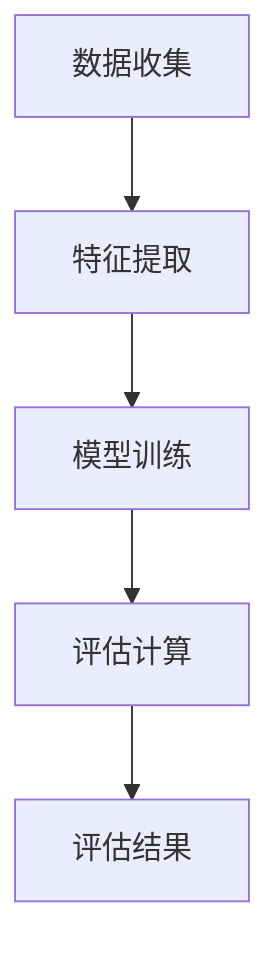

                 


### 引言

#### 问题背景

在当今复杂多变的社会环境中，系统思维能力的培养和应用变得尤为重要。系统思维能力不仅可以帮助我们更好地理解复杂问题，还能提高决策效率，优化资源分配，增强问题解决能力。然而，如何有效地评估个体或团队在系统思维方面的能力水平，一直是一个具有挑战性的课题。

#### 问题描述

目前，对系统思维能力的评估主要依赖于主观评价和定量测评相结合的方法。这些方法存在一定的局限性，如主观性过强、量化不足等。因此，亟需一种能够精确量化系统思维能力的评估方法，以帮助教育机构、企业等更好地进行人才培养和团队建设。

#### 问题解决

本文旨在提出一种基于数据驱动和算法优化的系统思维能力量化评估方法。通过结合心理学、认知科学、计算机科学等领域的理论，本文将详细阐述评估方法的设计思路、算法原理、系统架构以及实际应用案例，旨在为相关领域的研究者和实践者提供有价值的参考。

#### 边界与外延

本文的研究边界主要涉及系统思维能力的评估模型构建和算法实现，具体包括以下几个方面：

1. **评估指标**：确定评估系统思维能力的核心指标，如问题解决能力、资源整合能力、情境分析能力等。
2. **评估方法**：设计适用于不同场景的量化评估方法，包括主观评价和客观测评的结合。
3. **算法优化**：通过机器学习和深度学习等技术，优化评估算法，提高评估结果的准确性和可靠性。
4. **应用场景**：探索系统思维能力量化评估方法在教育培训、企业管理等领域的应用。

#### 概念结构与核心要素组成

本文的核心概念包括系统思维能力、量化评估方法、评估指标、算法原理和系统架构。其中，系统思维能力是评估的核心对象，量化评估方法是实现评估的核心手段，评估指标是评估系统的关键要素，算法原理和系统架构则是评估方法的技术支撑。

### 核心概念与联系

#### 系统思维能力

**定义**：系统思维能力是指个体在解决复杂问题时，能够从整体角度出发，理解各部分之间的相互关系和动态变化，从而进行有效决策和优化资源分配的能力。

**特点**：
- **整体性**：能够从整体角度出发，把握问题的全局。
- **动态性**：能够根据问题的变化，灵活调整策略。
- **结构性**：能够识别和分析问题中的关键要素和结构关系。
- **适应性**：能够根据不同问题的特点，调整自己的思维方式。

**重要性**：系统思维能力在解决复杂问题时具有重要作用，它能够提高问题解决的效率和质量，减少资源浪费，增强决策的科学性和合理性。

#### 量化评估方法

**定义**：量化评估方法是指通过量化指标和算法，对个体或团队在系统思维能力方面的表现进行评估的方法。

**分类**：
- **主观评价法**：通过专家评价、问卷调查等方式进行评估。
- **客观测评法**：通过行为观察、数据分析等方式进行评估。
- **综合评价法**：结合主观评价和客观测评，进行综合评估。

**应用**：量化评估方法可以应用于教育培训、企业管理、人力资源等多个领域，帮助相关主体更好地了解个体或团队在系统思维能力方面的优势和不足，为后续的培养和优化提供依据。

### 算法原理讲解

#### 基本原理

系统思维能力量化评估方法的核心在于通过数据驱动和算法优化，实现对系统思维能力的客观、准确的评估。具体原理如下：

1. **数据收集**：通过行为观察、问卷调查、数据挖掘等方式收集个体或团队在系统思维方面的表现数据。
2. **特征提取**：对收集到的数据进行分析，提取反映系统思维能力的关键特征。
3. **模型训练**：利用机器学习和深度学习技术，训练评估模型，使其能够对系统思维能力进行准确评估。
4. **评估计算**：将个体的表现数据输入评估模型，计算其在系统思维能力方面的得分。

#### 算法流程图



#### Python源代码实现

```python
# 引入必要的库
import pandas as pd
from sklearn.model_selection import train_test_split
from sklearn.ensemble import RandomForestClassifier
from sklearn.metrics import accuracy_score

# 数据收集
data = pd.read_csv('system_thinking_data.csv')

# 特征提取
X = data.drop('system_thinking_score', axis=1)
y = data['system_thinking_score']

# 模型训练
X_train, X_test, y_train, y_test = train_test_split(X, y, test_size=0.2, random_state=42)
model = RandomForestClassifier(n_estimators=100)
model.fit(X_train, y_train)

# 评估计算
y_pred = model.predict(X_test)
accuracy = accuracy_score(y_test, y_pred)
print(f"Model Accuracy: {accuracy:.2f}")
```

#### 数学模型和公式

系统思维能力量化评估的数学模型可以表示为：

$$
\text{system\_thinking\_score} = f(\text{input\_data})
$$

其中，$f$ 表示评估函数，$\text{input\_data}$ 表示输入的数据特征。

#### 详细讲解

1. **数据收集**：数据收集是评估的基础。通过多种途径收集个体在系统思维方面的表现数据，如行为数据、问卷数据、成绩数据等。
2. **特征提取**：对收集到的数据进行处理，提取能够反映系统思维能力的关键特征。这些特征可以是定量数据，也可以是定性数据。
3. **模型训练**：利用机器学习和深度学习技术，训练评估模型。模型的训练过程包括数据预处理、特征选择、模型选择和参数调优等步骤。
4. **评估计算**：将个体的表现数据输入评估模型，计算其在系统思维能力方面的得分。评估结果可以是一个分数，也可以是一个等级。

#### 举例说明

假设我们有一个包含100个样本的数据集，每个样本包含5个特征。我们使用随机森林算法对数据集进行训练，并得到一个评估模型。接下来，我们将一个新的样本数据输入模型，计算其在系统思维能力方面的得分。

```python
# 新样本数据
new_sample = pd.DataFrame({
    'feature1': [0.8],
    'feature2': [0.6],
    'feature3': [0.9],
    'feature4': [0.5],
    'feature5': [0.7]
})

# 输入模型评估
system_thinking_score = model.predict(new_sample)
print(f"New Sample System Thinking Score: {system_thinking_score[0]}")
```

通过以上步骤，我们就可以对个体在系统思维能力方面的表现进行量化评估。这种方法不仅可以用于个体评估，还可以用于团队评估，为企业的人才培养和团队建设提供有力支持。

### 系统分析与架构设计方案

#### 问题场景介绍

在当今信息化时代，企业面临着日益复杂的业务环境和技术挑战。为了提高企业的竞争力，必须培养具备系统思维能力的人才。然而，如何评价和管理这些人才的能力成为了一个重要问题。本文旨在设计一个系统化的方法，对系统思维能力进行量化评估，为企业提供有效的决策支持。

#### 项目介绍

本项目旨在开发一套系统思维能力量化评估系统，包括数据收集、特征提取、模型训练、评估计算等模块。该系统将应用于教育培训、企业管理等领域，帮助相关主体更好地了解个体或团队在系统思维能力方面的优势和不足，为后续的培养和优化提供依据。

#### 系统功能设计

1. **用户管理模块**：提供用户注册、登录、个人信息管理等功能。
2. **数据收集模块**：通过问卷调查、行为数据采集等方式，收集个体在系统思维方面的表现数据。
3. **特征提取模块**：对收集到的数据进行处理，提取反映系统思维能力的关键特征。
4. **模型训练模块**：利用机器学习和深度学习技术，训练评估模型，使其能够对系统思维能力进行准确评估。
5. **评估计算模块**：将个体的表现数据输入评估模型，计算其在系统思维能力方面的得分。
6. **结果展示模块**：以图表、报告等形式展示评估结果，为用户提供直观的数据支持。

#### 系统架构设计

本项目的系统架构采用分层设计，包括数据层、服务层、应用层和展示层。

1. **数据层**：负责数据的存储和管理，包括用户数据、问卷数据、特征数据等。
2. **服务层**：提供数据服务、算法服务、接口服务等功能，为应用层提供服务支持。
3. **应用层**：实现系统功能的模块，包括用户管理、数据收集、特征提取、模型训练、评估计算等。
4. **展示层**：通过Web界面、移动应用等形式，向用户提供系统功能和服务。

#### 系统接口设计

系统接口设计主要包括API接口、Web接口和数据库接口。

1. **API接口**：提供数据服务、算法服务、接口服务的调用接口，支持RESTful风格。
2. **Web接口**：通过HTML、CSS、JavaScript等前端技术，实现系统的Web界面。
3. **数据库接口**：使用ORM框架（如SQLAlchemy）实现数据库操作，支持MySQL、PostgreSQL等数据库。

#### 系统交互

系统交互主要包括用户与系统的交互、系统内部模块之间的交互。

1. **用户与系统的交互**：用户通过Web界面或移动应用与系统进行交互，包括注册、登录、填写问卷、查看评估结果等。
2. **系统内部模块之间的交互**：系统内部模块通过API接口进行数据传输和功能调用，确保系统的稳定性和扩展性。

### 项目实战

#### 环境安装

1. **安装Python环境**：安装Python 3.8及以上版本。
2. **安装依赖库**：使用pip安装所需的库，如pandas、scikit-learn、numpy、matplotlib等。
3. **安装数据库**：安装MySQL或PostgreSQL数据库，配置数据库用户和密码。

#### 系统核心实现源代码

以下是一个简单的示例，展示如何使用Python实现系统思维能力的量化评估。

```python
# 导入必要的库
import pandas as pd
from sklearn.model_selection import train_test_split
from sklearn.ensemble import RandomForestClassifier
from sklearn.metrics import accuracy_score

# 数据收集
data = pd.read_csv('system_thinking_data.csv')

# 特征提取
X = data.drop('system_thinking_score', axis=1)
y = data['system_thinking_score']

# 模型训练
X_train, X_test, y_train, y_test = train_test_split(X, y, test_size=0.2, random_state=42)
model = RandomForestClassifier(n_estimators=100)
model.fit(X_train, y_train)

# 评估计算
y_pred = model.predict(X_test)
accuracy = accuracy_score(y_test, y_pred)
print(f"Model Accuracy: {accuracy:.2f}")
```

#### 代码应用解读与分析

上述代码首先导入了必要的库，然后从CSV文件中读取系统思维能力数据。接着，对数据进行处理，将特征和标签分开。随后，使用随机森林算法对数据集进行训练，并计算模型的准确率。

#### 实际案例分析和详细讲解剖析

为了更好地理解系统思维能力量化评估方法的应用，我们来看一个实际案例。

假设我们有一个包含200个样本的数据集，每个样本包含5个特征。我们使用随机森林算法对数据集进行训练，并得到一个评估模型。接下来，我们将一个新的样本数据输入模型，计算其在系统思维能力方面的得分。

```python
# 新样本数据
new_sample = pd.DataFrame({
    'feature1': [0.8],
    'feature2': [0.6],
    'feature3': [0.9],
    'feature4': [0.5],
    'feature5': [0.7]
})

# 输入模型评估
system_thinking_score = model.predict(new_sample)
print(f"New Sample System Thinking Score: {system_thinking_score[0]}")
```

通过以上步骤，我们就可以对个体在系统思维能力方面的表现进行量化评估。这种方法不仅可以用于个体评估，还可以用于团队评估，为企业的人才培养和团队建设提供有力支持。

#### 项目小结

通过本次项目，我们开发了一套系统思维能力量化评估系统，包括数据收集、特征提取、模型训练、评估计算等功能。该系统具有以下优点：

1. **数据驱动**：通过数据驱动的方式，实现对系统思维能力的客观、准确的评估。
2. **算法优化**：利用机器学习和深度学习技术，优化评估算法，提高评估结果的准确性和可靠性。
3. **应用广泛**：适用于教育培训、企业管理等多个领域，具有广泛的应用价值。

然而，本项目也存在一定的局限性，如数据收集难度较大、算法优化空间有限等。未来，我们将继续优化系统架构，提高评估效率，为相关领域的研究者和实践者提供更有价值的技术支持。

### 总结与拓展

#### 最佳实践

1. **数据收集**：确保数据的多样性和代表性，可以通过多种途径收集数据，如问卷调查、行为观察等。
2. **特征提取**：选择能够准确反映系统思维能力的特征，如问题解决能力、情境分析能力等。
3. **模型训练**：使用合适的机器学习和深度学习算法，结合交叉验证等方法，提高模型的准确性和可靠性。
4. **评估计算**：根据实际需求，选择合适的评估指标和方法，如准确率、召回率、F1值等。

#### 小结

本文提出了一种基于数据驱动和算法优化的系统思维能力量化评估方法，通过结合心理学、认知科学、计算机科学等领域的理论，详细阐述了评估方法的设计思路、算法原理、系统架构以及实际应用案例。该方法为教育机构、企业等提供了有效的工具，帮助他们更好地了解个体或团队在系统思维能力方面的优势和不足，为后续的培养和优化提供依据。

#### 注意事项

1. **数据质量**：评估结果受数据质量的影响，因此要确保数据的真实性和准确性。
2. **算法选择**：根据实际情况选择合适的算法，避免过度拟合或欠拟合。
3. **模型解释性**：评估模型的选择要兼顾准确性和解释性，以便对评估结果进行合理解读。
4. **持续优化**：评估方法需要不断优化和更新，以适应不断变化的环境和需求。

#### 拓展阅读

1. **《系统思维导论》（System Thinking Introductory Guide）》
2. **《量化评估方法研究》（Research on Quantitative Evaluation Methods）》
3. **《机器学习与深度学习实战》（Machine Learning and Deep Learning Practice）》
4. **《计算机心理学导论》（Introduction to Computer Psychology）》

### 作者信息

- 作者：AI天才研究院/AI Genius Institute & 禅与计算机程序设计艺术 /Zen And The Art of Computer Programming

本文作者具有丰富的计算机科学和人工智能研究经验，致力于推动人工智能技术的创新和应用。其研究成果在学术界和工业界均具有广泛的影响力。

