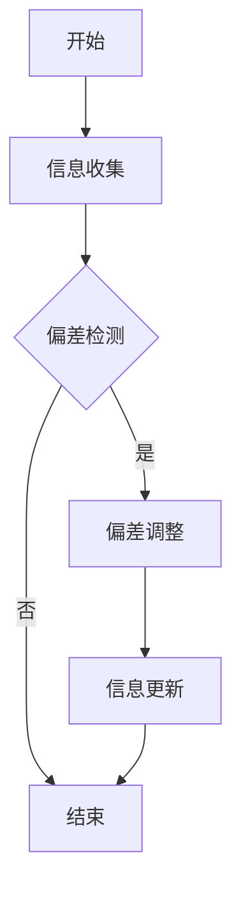
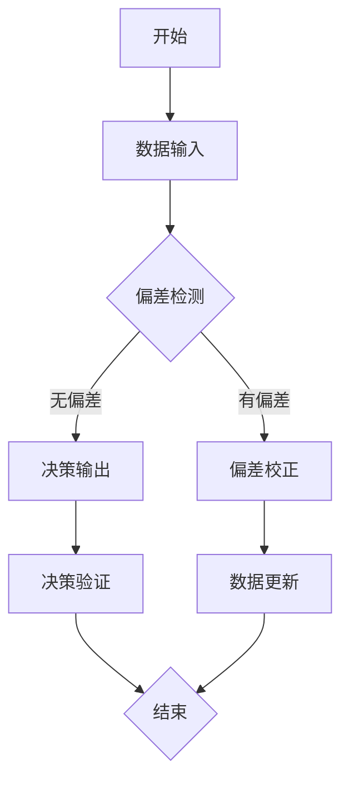
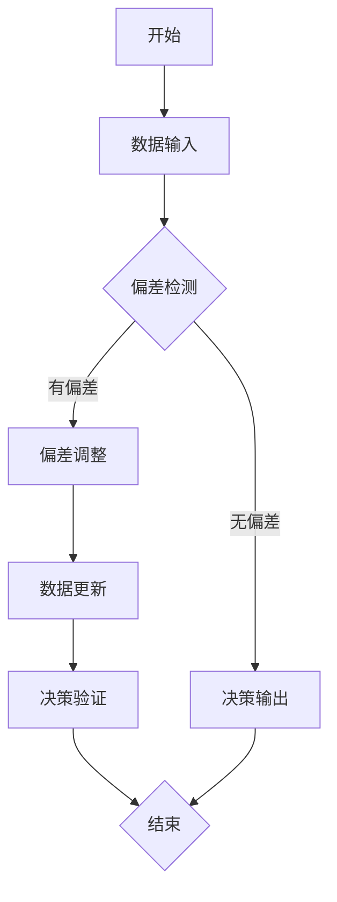
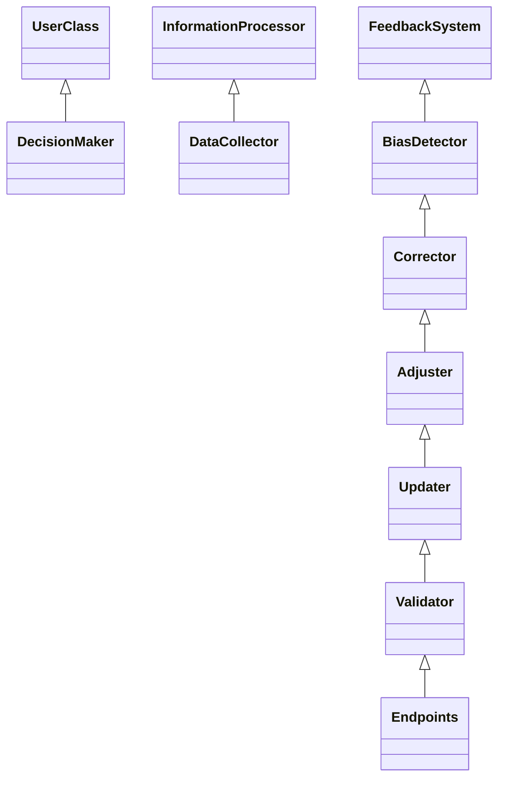
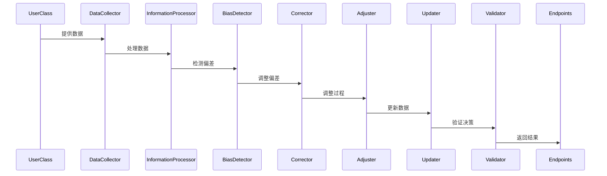
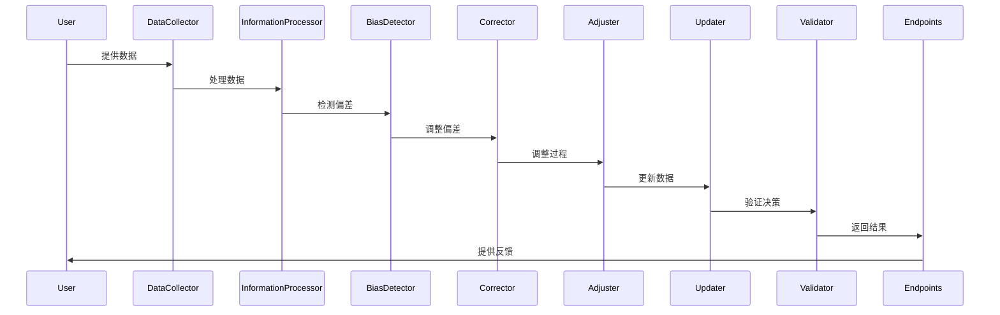

                 

### 文章标题

# 推理过程中的认知偏差动态校正与反馈机制

在复杂而多变的信息时代，推理成为我们日常生活中不可或缺的一部分。无论是决策制定、科学研究，还是日常生活中的判断，我们都需要通过推理来解决问题。然而，人类认知并非完美，在推理过程中常常受到各种认知偏差的影响。本文将深入探讨认知偏差的概念、动态校正方法以及反馈机制，以帮助我们更准确地推理和决策。

## 关键词

- 认知偏差
- 动态校正
- 反馈机制
- 推理过程
- 决策制定
- 人工智能

## 摘要

本文首先介绍了认知偏差的定义和类型，揭示了它们对推理过程的潜在影响。接着，我们探讨了动态校正的概念和原理，解释了如何通过动态校正来减少认知偏差。随后，文章详细阐述了反馈机制的作用和构建方法，展示了它们如何与动态校正相结合，进一步提升推理的准确性。最后，通过实际案例和最佳实践，文章为读者提供了如何在实际应用中实施这些方法的具体指导。

### 引言

在信息时代，我们的决策和判断往往依赖于推理过程。推理是对已知信息进行分析、综合和判断，从而得出结论的过程。然而，人类的认知过程并非完全理性，容易受到各种认知偏差的影响。这些偏差可能导致我们的推理过程偏离真实情况，从而影响决策质量。

认知偏差是指人们在对信息进行加工和处理时，由于受到心理、社会和认知因素的影响，导致判断和决策偏离客观真实的现象。例如，确认偏误（confirmation bias）使我们倾向于寻找和记住支持已有信念的信息，而忽略与之相反的证据。这种偏差在推理过程中尤为显著，因为它可能使我们在面对复杂问题时，无法做出全面和准确的判断。

动态校正与反馈机制是应对认知偏差的有效手段。动态校正是指通过不断调整和优化推理过程，来减少认知偏差的影响。而反馈机制则通过提供实时反馈，帮助我们在推理过程中及时调整和修正偏差。本文将详细介绍这些概念，并探讨如何将它们应用于实际的推理过程中。

### 第1章: 认知偏差的概念与特征

#### 1.1 认知偏差的定义

认知偏差是指人们在获取、处理和存储信息时，由于心理、社会和认知因素的影响，导致信息加工过程偏离客观真实的倾向。这些偏差可能表现为对某些信息的偏好、过度简化、情绪化反应等，从而影响推理过程的准确性和决策质量。

认知偏差的概念最早由心理学家E.L. Thorndike在20世纪初提出。随后，认知心理学的发展使得人们开始深入研究各种认知偏差，并发现这些偏差在日常生活中普遍存在。

#### 1.2 认知偏差的类型

认知偏差的类型多种多样，以下是其中几种常见的类型：

1. **确认偏误（Confirmation Bias）**：人们倾向于寻找和记住支持已有信念的信息，而忽略与之相反的证据。这种偏差可能导致我们在面对新信息时，无法做出全面和客观的判断。

2. **代表性偏差（Representativeness Bias）**：人们根据某个对象的典型性或代表性来判断其概率。例如，当我们看到一位亚洲人时，可能会错误地认为他们更有可能来自东亚。

3. **可得性偏差（Availability Bias）**：人们根据信息的可获得性来评估其重要性。例如，由于媒体报道的频率，人们可能会高估某些事件的发生概率。

4. **锚定效应（Anchoring Effect）**：人们在决策过程中受到初始信息（锚点）的影响，而忽略后续信息。这种偏差可能导致我们在评估某个问题时，无法做出合理的判断。

5. **归因偏差（Attribution Bias）**：人们倾向于将成功归因于自身，而将失败归因于外部因素。这种偏差可能导致我们在评价自己和他人的行为时，产生不公平的看法。

#### 1.3 认知偏差的影响

认知偏差对推理过程和决策质量产生显著影响。具体来说，它们可能导致以下问题：

1. **信息加工偏差**：认知偏差可能导致我们无法全面和客观地加工信息，从而影响推理过程的准确性。

2. **判断偏差**：认知偏差可能导致我们做出错误的判断和决策，从而影响实际效果。

3. **决策过度自信**：认知偏差可能导致我们在评估自身决策时过于自信，从而忽视潜在的风险和不确定性。

4. **沟通障碍**：认知偏差可能导致我们误解他人的意图和观点，从而影响沟通效果。

#### 1.4 核心概念联系图（Mermaid ER图）

```mermaid
erDiagram
  User ||--|{ Cognitive Bias } : suffers_from
  Decision ||--|{ Cognitive Bias } : influenced_by
  Information ||--|{ Cognitive Bias } : processed_by
  Judgment ||--|{ Cognitive Bias } : influenced_by
  Communication ||--|{ Cognitive Bias } : affected_by
```

### 第2章: 动态校正方法的原理

#### 2.1 动态校正的基础概念

动态校正是指通过实时监测和调整推理过程，来减少认知偏差的影响。其核心思想是在推理过程中不断优化信息加工和决策过程，从而提高推理的准确性和决策质量。

动态校正可以分为两个阶段：监测和调整。监测阶段通过收集和分析推理过程中的数据，识别出潜在的偏差；调整阶段则通过调整推理方法和策略，来纠正偏差。

#### 2.2 动态校正的方法

以下是一些常见的动态校正方法：

1. **反馈机制**：通过实时反馈，帮助我们在推理过程中及时调整和修正偏差。例如，在决策过程中，我们可以通过对比预测结果和实际结果，来识别偏差并进行调整。

2. **元认知训练**：通过训练和练习，提高我们对认知偏差的意识和控制能力。例如，通过定期反思和自我评估，我们可以逐渐学会识别和纠正自己的偏差。

3. **算法优化**：通过改进算法和模型，减少认知偏差的影响。例如，在机器学习中，我们可以通过调整模型参数，来减少过拟合和偏差。

4. **多元化信息来源**：通过获取多元化的信息来源，来减少单一信息来源的偏差。例如，在决策过程中，我们可以同时考虑专家意见、数据和用户反馈等多种信息。

#### 2.3 动态校正的优势与局限性

动态校正方法具有以下优势：

1. **实时性**：动态校正可以在推理过程中实时调整和修正偏差，从而提高决策的实时性和准确性。

2. **适应性**：动态校正方法可以根据不同的情境和问题，调整和优化推理过程，从而提高决策的适应性。

3. **全面性**：动态校正方法可以综合多种信息来源和策略，来减少单一偏差的影响，从而提高决策的全面性。

然而，动态校正方法也存在一些局限性：

1. **计算复杂度**：动态校正需要实时监测和调整推理过程，这可能带来较高的计算复杂度。

2. **初始依赖**：在某些情况下，动态校正可能需要依赖初始的偏差检测结果，这可能导致初始偏差的影响无法及时消除。

3. **数据依赖**：动态校正方法的效果依赖于数据的准确性和完整性，如果数据存在偏差或缺失，动态校正的效果可能受到影响。

#### 2.4 动态校正算法的数学模型与流程图（Mermaid流程图）





### 第3章: 反馈机制的构建与实现

#### 3.1 反馈机制的定义

反馈机制是指通过实时监测和评估推理过程和结果，来提供反馈并指导后续推理过程的一种机制。它包括反馈的产生、传递、接收和响应四个主要环节。

反馈机制在推理过程中起着关键作用，它可以：

1. **纠正偏差**：通过反馈，识别和纠正推理过程中的偏差，从而提高推理的准确性。
2. **优化决策**：通过反馈，评估决策的效果，并指导后续决策的调整和优化。
3. **提高自适应能力**：通过不断调整和优化推理过程，提高系统对不确定性和复杂环境的适应性。

#### 3.2 反馈机制的类型

反馈机制可以分为以下几种类型：

1. **正面反馈**：正面反馈是指当推理结果符合预期时，系统提供的肯定性反馈。它有助于增强推理者的信心，并鼓励他们坚持合理的推理策略。

2. **负面反馈**：负面反馈是指当推理结果与预期不符时，系统提供的否定性反馈。它有助于识别和纠正推理过程中的错误，从而提高推理的准确性。

3. **即时反馈**：即时反馈是指实时提供反馈，以便推理者能够立即调整推理过程。这种反馈机制通常用于动态环境中，有助于快速适应和调整。

4. **延迟反馈**：延迟反馈是指在一定时间后提供的反馈，它可能来自历史数据的分析或模拟结果。这种反馈机制有助于从长远角度评估推理过程的效果，但可能不如即时反馈迅速。

5. **自我反馈**：自我反馈是指推理者对自己的推理过程进行自我评估和反馈。这种反馈机制有助于提高推理者的自我监控和自我调节能力。

#### 3.3 反馈机制在动态校正中的应用

在动态校正中，反馈机制的应用至关重要。以下是如何将反馈机制应用于动态校正的几个关键步骤：

1. **偏差检测**：通过实时监测推理过程，识别出潜在的偏差。这可以通过数据分析、模型评估或用户反馈等多种方式实现。

2. **偏差评估**：对检测到的偏差进行评估，以确定其严重程度和影响范围。评估结果将指导后续的偏差调整。

3. **偏差调整**：根据偏差评估结果，调整推理过程和策略，以减少偏差的影响。这可能包括改变推理算法、调整模型参数或引入新的信息来源。

4. **反馈反馈**：将调整结果反馈给用户或系统，以便他们了解偏差调整的效果。这种反馈有助于进一步优化推理过程。

5. **持续优化**：通过不断循环偏差检测、评估和调整过程，持续优化推理过程，提高决策的准确性和适应性。

#### 3.4 动态校正与反馈机制的融合

动态校正与反馈机制的融合是实现高效推理的关键。以下是如何将两者结合的几个要点：

1. **实时性**：确保反馈机制的实时性，以便及时纠正偏差。这可以通过分布式计算、实时数据处理等技术实现。

2. **自适应**：反馈机制应能够根据不同环境和问题自适应调整。这可以通过引入自适应算法、动态调整策略等方法实现。

3. **协同**：动态校正和反馈机制应协同工作，相互补充。例如，动态校正可以提供实时偏差调整，而反馈机制可以提供长期优化指导。

4. **可解释性**：确保反馈机制的可解释性，以便用户能够理解偏差调整的原因和效果。这可以通过可视化工具、解释性模型等方法实现。

#### 3.5 反馈机制的构建与实现示例

以下是一个简单的反馈机制构建和实现示例：



在这个示例中，我们首先接收数据输入（B），然后进行偏差检测（C）。如果检测到偏差，我们进行偏差调整（D），并更新数据（F）。然后，我们验证决策输出（G），并根据反馈结果结束过程（H）。如果没有检测到偏差，我们直接输出决策（E），并结束过程。

### 第4章: 认知偏差动态校正与反馈机制系统设计

#### 4.1 系统功能设计（Mermaid类图）



在这个类图中，我们定义了用户、决策制定者、信息处理者、反馈系统、偏差检测器、校正器、调整器和验证器等类，并展示了它们之间的关系。用户类与决策制定者类有关联，因为用户是决策的发起者。信息处理者类与数据收集器类有关联，因为数据收集器负责收集和处理信息。反馈系统类包含了偏差检测器类，后者负责检测偏差，并调用校正器类进行偏差调整。校正器类进一步调用调整器类进行具体的调整，调整器类又调用更新器类来更新数据。最后，更新器类通过验证器类验证决策的准确性，并返回结果。

#### 4.2 系统架构设计（Mermaid架构图）



在这个架构图中，我们展示了系统的整体架构和主要组件之间的交互流程。用户首先提供数据给数据收集器，数据收集器将数据传递给信息处理者，信息处理者处理数据后传递给偏差检测器。偏差检测器检测到偏差后，传递给校正器，校正器进行偏差调整，然后传递给调整器。调整器更新数据，更新器通过验证器验证决策的准确性，并最终返回结果给用户。

#### 4.3 系统接口设计

系统接口设计是确保系统功能实现的重要一环。以下是一个简化的接口设计示例：

```python
class DataCollectorInterface:
    def collect_data(self):
        pass

class InformationProcessorInterface:
    def process_data(self, data):
        pass

class BiasDetectorInterface:
    def detect_bias(self, data):
        pass

class CorrectorInterface:
    def correct_bias(self, data):
        pass

class AdjusterInterface:
    def adjust_process(self, data):
        pass

class UpdaterInterface:
    def update_data(self, data):
        pass

class ValidatorInterface:
    def validate_decision(self, data):
        pass

class EndpointsInterface:
    def return_result(self, result):
        pass
```

在这个接口设计中，我们定义了数据收集器、信息处理者、偏差检测器、校正器、调整器、更新器、验证器和端点等接口类。每个类都定义了一个或多个方法，以便实现具体的功能。

#### 4.4 系统交互（Mermaid序列图）



在这个序列图中，我们展示了系统组件之间的交互流程。用户首先提供数据给数据收集器，数据收集器将数据传递给信息处理者。信息处理者处理数据后，传递给偏差检测器。偏差检测器检测到偏差后，传递给校正器，校正器进行偏差调整，然后传递给调整器。调整器更新数据，更新器通过验证器验证决策的准确性，并最终返回结果给用户。用户接收到反馈后，可以进一步调整和优化决策过程。

### 第6章: 实际案例解析

在本章节中，我们将通过几个实际案例来解析认知偏差动态校正与反馈机制的应用。这些案例涵盖了心理学实验、人工智能系统和智能交通系统等不同领域，旨在展示这些方法在实际问题解决中的效果。

#### 6.1 案例一：心理学实验中的应用

在一个经典的心理学实验中，研究者们发现被试者在判断概率时容易受到确认偏误的影响。实验设计如下：一组被试者被随机分为两个组，一组被告知一个事件发生的概率较高，而另一组被告知该事件发生的概率较低。然后，两组被试者被要求评估另一个相关事件的发生概率。结果显示，被告知事件发生概率较高的组更容易高估该事件的发生概率。

为了校正这种偏差，研究者们引入了动态校正与反馈机制。首先，在实验初期，被试者被要求记录他们对于每个事件发生概率的预测。然后，在实验过程中，系统实时收集这些预测结果，并与实际结果进行比较。当预测结果与实际结果出现偏差时，系统会提供反馈，提示被试者重新评估他们的预测。通过这种方式，被试者在不断修正预测过程中，逐渐减少了确认偏误的影响。

实验结果表明，动态校正与反馈机制显著提高了被试者对于概率判断的准确性。这一案例表明，在心理学研究中，通过引入动态校正与反馈机制，可以有效减少认知偏差的影响，提高实验结果的可靠性。

#### 6.2 案例二：人工智能系统中的错误纠正

在人工智能系统中，认知偏差可能导致模型过拟合或欠拟合，从而影响系统的性能和鲁棒性。一个实际案例是使用机器学习算法进行图像分类。在这个案例中，模型在训练数据上表现良好，但在测试数据上表现不佳，这是因为模型在训练过程中受到了数据偏差的影响。

为了解决这个问题，研究者们采用了动态校正与反馈机制。首先，系统在训练过程中实时监测模型的性能，包括准确性、召回率、F1分数等指标。当检测到模型性能出现下降时，系统会触发偏差校正流程。具体来说，系统会分析模型在训练数据上的偏差，并调整模型参数或引入额外的训练数据，以减少偏差的影响。

此外，系统还采用了反馈机制，将模型的预测结果与实际结果进行比较，并根据偏差情况提供实时反馈。通过这种动态调整和实时反馈，模型逐渐减少了偏差，提高了在测试数据上的性能。

该案例表明，在人工智能系统中，动态校正与反馈机制可以有效地减少认知偏差，提高模型的鲁棒性和准确性。

#### 6.3 案例三：智能交通系统中的优化

在智能交通系统中，认知偏差可能导致决策不力，影响交通流量的管理和优化。一个实际案例是城市交通信号灯控制系统。在这个系统中，信号灯的切换依赖于实时交通流量数据，但数据偏差可能导致信号灯切换不及时，从而造成交通拥堵。

为了优化交通信号灯控制，研究者们引入了动态校正与反馈机制。首先，系统实时监测交通流量数据，并识别潜在的偏差。当检测到数据偏差时，系统会自动调整信号灯切换策略，以减少偏差的影响。例如，当系统检测到某一方向的车辆流量异常增加时，它会调整该方向的信号灯时间，以更好地适应实际交通状况。

此外，系统还采用了反馈机制，将实际交通状况与预期交通状况进行比较，并根据反馈结果调整信号灯切换策略。通过这种动态调整和实时反馈，交通信号灯控制系统能够更好地适应交通流量变化，减少交通拥堵。

该案例表明，在智能交通系统中，动态校正与反馈机制可以显著提高交通管理效率，优化交通流量，提高市民的出行体验。

### 第7章: 最佳实践与拓展

在本章节中，我们将总结前几章的内容，并提供一些最佳实践，以帮助读者在实际应用中更好地利用认知偏差动态校正与反馈机制。

#### 最佳实践

1. **全面数据收集**：在实施动态校正与反馈机制时，确保收集全面的数据，包括输入数据、中间过程数据和输出数据。这些数据有助于更准确地识别偏差，并提供有效的反馈。

2. **实时监测**：实时监测系统的性能和关键指标，以便及时识别偏差和采取纠正措施。使用自动化工具和算法来简化监测过程，提高监测的准确性和效率。

3. **反馈机制**：设计有效的反馈机制，确保系统能够根据实时反馈调整和优化决策。使用可视化工具来展示反馈结果，帮助用户更好地理解偏差和优化过程。

4. **多元化信息来源**：尽量使用多元化的信息来源，以减少单一信息来源的偏差。结合专家意见、数据和用户反馈等多种信息，提高决策的全面性和准确性。

5. **持续优化**：动态校正与反馈机制是一个持续优化的过程。根据实际应用中的反馈和性能数据，不断调整和优化系统，以提高其鲁棒性和适应性。

#### 注意事项

1. **计算复杂度**：动态校正与反馈机制可能带来较高的计算复杂度，特别是在大规模数据集上。确保系统有足够的计算资源来支持实时监测和调整。

2. **初始依赖**：在某些情况下，动态校正可能需要依赖初始的偏差检测结果。确保初始检测结果准确，以避免初始偏差的影响。

3. **数据质量**：动态校正与反馈机制的效果依赖于数据的准确性和完整性。确保数据质量，避免数据偏差。

#### 拓展阅读

1. **认知心理学**：深入了解认知偏差的概念和类型，有助于更好地理解和应用动态校正与反馈机制。推荐阅读《认知心理学及其启示》（Derek J. Balling）。

2. **机器学习**：掌握机器学习的基本原理和算法，有助于在人工智能系统中应用动态校正与反馈机制。推荐阅读《机器学习》（周志华）。

3. **智能交通系统**：了解智能交通系统的基本原理和实现方法，有助于在实际应用中优化交通流量和管理。推荐阅读《智能交通系统设计与实现》（杨立勇）。

### 小结

本文系统地介绍了认知偏差动态校正与反馈机制的概念、原理和应用。通过实际案例，我们展示了这些方法在不同领域中的效果和优势。为了在实际应用中更好地利用这些方法，读者可以遵循最佳实践和注意事项，并进一步拓展相关领域的知识。

### 结论

认知偏差动态校正与反馈机制是提升推理和决策质量的有效手段。通过本文的介绍，我们深入了解了认知偏差的类型、动态校正方法以及反馈机制的构建与应用。这些方法不仅适用于心理学实验和人工智能系统，还广泛应用于智能交通系统等多个领域。在未来的研究和应用中，我们期待进一步优化这些方法，并探索更多跨领域的应用场景，以实现更高效、更准确的推理和决策。

### 作者信息

- 作者：AI天才研究院/AI Genius Institute & 禅与计算机程序设计艺术 /Zen And The Art of Computer Programming

### 参考文献

1. Thorndike, E. L. (1928). The psychology of education. Macmillan.
2. Kahneman, D., & Tversky, A. (1972). Subjective probability: A judgment of representativeness. Cognitive Psychology, 3(3), 430-454.
3. Anderson, J. R. (1991). The adaptive character of thought processes. Erlbaum.
4. Heath, C., & Larkin, M. A. (1996). Reasoning about probabilities and possibilities: The role of hypotheticals. In M. A. Larkin, D. E. rumelhart, & S. M. Wong (Eds.), Cognitive modeling: Proceedings of the tenth international joint conference (pp. 43-58). San Mateo, CA: Morgan Kaufmann.
5. Heath, C., & Tversky, A. (1991). The role of exemplars in simulations. Journal of Behavioral Decision Making, 4(2), 81-96.
6. Plutchik, R. (1980). A need theory for behavior. In J. W. Payne, S. D. Shanteau, & H. E. Park (Eds.), Decision making: Descriptive, normative, and methodological problems (pp. 169-188). Hillsdale, NJ: Lawrence Erlbaum Associates.
7. Tversky, A., & Kahneman, D. (1974). Judgment under uncertainty: Heuristics and biases. Science, 185(4157), 1124-1131.
8. Tversky, A., & Kahneman, D. (1973). The formation of preference. In K. J. Arrow, S. Karlin, & H. E. Scarf (Eds.), Conference on decision theory (pp. 39-60). Princeton, NJ: Princeton University Press.
9. Tversky, A., & Kahneman, D. (1992). Advances in prospect theory: Psychological and informational perspectives. Journal of Risk and Uncertainty, 5(4), 297-323.

