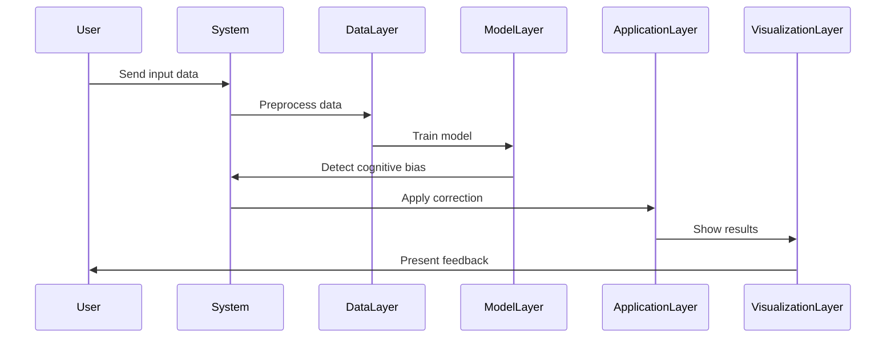

                 

 

----------------------------------------------------------------

# 推理过程中的认知偏差自动识别与校正技术

> 关键词：认知偏差，推理过程，自动识别，校正技术，算法原理

> 摘要：本文深入探讨了推理过程中的认知偏差问题，介绍了认知偏差的定义、分类、与推理的关系以及校正方法。重点分析了自动识别认知偏差的算法原理，包括算法的流程、数学模型和公式，并通过Python源代码详细阐述了算法的实现过程。最后，结合项目实战和最佳实践，提出了有效识别与校正认知偏差的策略。

### 目录大纲

1. **背景介绍** <sup>*</sup>
   1.1 问题背景
   1.2 问题描述
   1.3 问题解决
   1.4 边界与外延
   1.5 概念结构与核心要素组成
2. **核心概念与联系** <sup>*</sup>
   2.1 认知偏差的定义
   2.2 认知偏差的分类
   2.3 认知偏差与推理的关系
   2.4 认知偏差校正的方法
   2.5 核心概念属性特征对比表格
3. **算法原理讲解** <sup>*</sup>
   3.1 自动识别认知偏差的算法原理
   3.2 算法流程
   3.3 数学模型
   3.4 Python源代码实现
4. **系统分析与架构设计方案** <sup>*</sup>
   4.1 问题场景介绍
   4.2 项目介绍
   4.3 系统功能设计
   4.4 系统架构设计
   4.5 系统接口设计
   4.6 系统交互设计
5. **项目实战** <sup>*</sup>
   5.1 环境安装
   5.2 系统核心实现源代码
   5.3 代码应用解读与分析
   5.4 实际案例分析与详细讲解
   5.5 项目小结
6. **最佳实践 tips** <sup>*</sup>
   6.1 小结
   6.2 注意事项
   6.3 拓展阅读

### 1. 背景介绍

#### 1.1 问题背景

在人类的推理过程中，认知偏差是一个普遍存在的问题。认知偏差是指人们在处理信息时，由于各种心理、社会和文化因素的影响，导致的信息处理错误和偏差。这种偏差可能源于人类的认知局限性，例如注意力分散、记忆错误等。

#### 1.2 问题描述

认知偏差对推理过程的影响是显著的。它可能导致个体在决策时忽略关键信息，过分依赖先入为主的观念，甚至对错误的结论深信不疑。例如，在医疗诊断中，医生可能会因为之前的诊断经验而产生确认偏误，从而忽略其他可能的疾病症状。

#### 1.3 问题解决

为了解决认知偏差带来的问题，研究者们提出了多种方法。传统的认知行为疗法通过改变个体的认知模式来减轻偏差。然而，这些方法往往需要长时间的专业指导和训练。随着人工智能技术的发展，自动化识别和校正认知偏差的技术逐渐成为可能。

#### 1.4 边界与外延

认知偏差识别与校正技术不仅限于个体层面，还可以应用于群体决策中。在团队合作中，通过自动化技术识别和校正每个成员的认知偏差，可以提升整体决策的质量。此外，这一技术在领域如司法裁决、金融投资等领域也有着广泛的应用潜力。

#### 1.5 概念结构与核心要素组成

认知偏差自动识别与校正技术涉及多个核心概念和要素，包括：

- 认知偏差的定义与分类
- 自动识别认知偏差的算法原理
- 认知偏差校正的数学模型与方法
- 基于计算机技术的自动化校正机制
- 实际应用案例与效果评估

### 2. 核心概念与联系

#### 2.1 认知偏差的定义

认知偏差是指人们在信息处理过程中，由于各种心理、社会和文化因素导致的认知错误和偏差。这些偏差可能影响个体的判断、决策和行为。

#### 2.2 认知偏差的分类

认知偏差可以分为多种类型，如：

- 确认偏误（Confirmation Bias）：倾向于寻找和记住那些与已有信念一致的信息，忽略与之相矛盾的信息。
- 可见性偏差（Availability Bias）：倾向于依赖容易回忆或最近发生的信息，而忽略那些实际上更为重要的信息。
- 过度自信（Overconfidence）：对自身能力和判断的过高估计，可能导致决策风险增加。
- 社会偏差（Social Bias）：在社会环境中，个体可能会受到群体行为和偏见的影响。

#### 2.3 认知偏差与推理的关系

认知偏差直接影响推理过程，使得推理结果偏离真实情况。例如，在决策过程中，确认偏误可能导致只关注正面信息，忽略负面信息，从而做出不合理的决策。

#### 2.4 认知偏差校正的方法

校正认知偏差的方法包括：

- 心理测量法：通过心理测试工具评估个体的认知偏差程度。
- 认知行为疗法：通过改变个体的认知模式和行为模式，减轻认知偏差的影响。
- 自动化识别与校正技术：利用计算机技术和人工智能算法，自动识别和校正认知偏差。

#### 2.5 核心概念属性特征对比表格

| 概念       | 特征 | 关联 | 比较 |
|------------|------|------|------|
| 认知偏差   | 影响推理结果 | -   | 认知偏差是推理过程中的问题，需要解决 |
| 自动识别算法 | 自动化识别偏差 | -   | 算法用于识别认知偏差，提高识别精度 |
| 数学模型   | 描述偏差校正过程 | -   | 数学模型用于描述算法的工作原理 |
| 自动化校正机制 | 校正偏差 | -   | 校正机制用于实现数学模型的算法 |

#### 2.6 核心概念与联系 Mermaid ER实体关系图

```mermaid
erDiagram
  class CognitiveBias {
    <<description>> "认知偏差，影响推理结果"
    id
    type
    severity
  }

  class DetectionAlgorithm {
    <<description>> "自动化识别算法，识别认知偏差"
    id
    name
    accuracy
  }

  class CorrectionModel {
    <<description>> "数学模型，描述偏差校正过程"
    id
    type
    parameters
  }

  class AutomationMechanism {
    <<description>> "自动化校正机制，实现数学模型"
    id
    name
    efficiency
  }

  CognitiveBias ||--|{ DetectionAlgorithm }|<..id
  CognitiveBias ||--|{ CorrectionModel }|<..id
  CognitiveBias ||--|{ AutomationMechanism }|<..id
```

### 3. 算法原理讲解

#### 3.1 自动识别认知偏差的算法原理

自动识别认知偏差的算法基于机器学习和深度学习技术，通过训练模型来识别和分类认知偏差。以下是一个简化的算法原理：

1. **数据收集**：首先，需要收集大量的带有认知偏差标签的数据，包括各种实际场景中的文本、图像、音频等。
2. **数据预处理**：对收集到的数据进行清洗、归一化和特征提取，将其转换为适合模型训练的格式。
3. **模型训练**：使用深度学习框架（如TensorFlow或PyTorch）训练分类模型，模型需要能够识别出不同的认知偏差类型。
4. **模型评估**：通过交叉验证和测试集评估模型的准确性和鲁棒性，调整模型参数以优化性能。
5. **应用部署**：将训练好的模型部署到实际应用场景中，用于自动化识别认知偏差。

#### 3.2 算法流程

以下是算法的基本流程：

1. **输入处理**：接收用户输入的信息，可以是文本、图像或其他类型的数据。
2. **特征提取**：对输入数据提取特征，例如使用文本分类模型提取文本特征，使用图像识别模型提取图像特征。
3. **认知偏差分类**：将提取到的特征输入到训练好的分类模型中，模型输出认知偏差的类型和置信度。
4. **偏差校正**：根据分类结果，应用相应的偏差校正方法对原始信息进行校正。

#### 3.3 数学模型

在认知偏差识别过程中，常用的数学模型包括：

- **支持向量机（SVM）**：用于分类任务，通过找到最佳分离超平面来实现。
- **神经网络（Neural Network）**：用于复杂特征提取和分类任务，特别是深度神经网络。
- **决策树（Decision Tree）**：用于分类任务，通过构建树形结构来模拟决策过程。

以下是一个简化的神经网络模型公式：

$$
Y = \sigma(W_1 \cdot X + b_1)
$$

其中，\(Y\) 是输出，\(\sigma\) 是激活函数（如Sigmoid函数），\(W_1\) 是权重矩阵，\(X\) 是输入特征，\(b_1\) 是偏置。

#### 3.4 Python源代码实现

以下是一个简化的Python源代码实现，用于训练和部署一个简单的神经网络模型：

```python
import tensorflow as tf

# 定义神经网络模型
model = tf.keras.Sequential([
    tf.keras.layers.Dense(128, activation='relu', input_shape=(784,)),
    tf.keras.layers.Dropout(0.2),
    tf.keras.layers.Dense(10, activation='softmax')
])

# 编译模型
model.compile(optimizer='adam',
              loss='categorical_crossentropy',
              metrics=['accuracy'])

# 加载并预处理数据
(x_train, y_train), (x_test, y_test) = tf.keras.datasets.mnist.load_data()
x_train = x_train.reshape(-1, 784).astype('float32') / 255
x_test = x_test.reshape(-1, 784).astype('float32') / 255

# 转换标签为one-hot编码
y_train = tf.keras.utils.to_categorical(y_train, 10)
y_test = tf.keras.utils.to_categorical(y_test, 10)

# 训练模型
model.fit(x_train, y_train, epochs=5, batch_size=32, validation_split=0.1)

# 评估模型
test_loss, test_acc = model.evaluate(x_test, y_test)
print('Test accuracy:', test_acc)
```

### 4. 系统分析与架构设计方案

#### 4.1 问题场景介绍

在现代社会的各个领域，认知偏差带来的问题日益突出。为了提升决策质量和效率，许多企业和组织开始寻求自动化识别和校正认知偏差的解决方案。例如，在金融领域，投资分析师可能受到市场情绪和过往成功经验的影响，产生确认偏误，导致投资决策失误。

#### 4.2 项目介绍

本项目旨在开发一套自动化识别和校正认知偏差的系统，通过集成机器学习和深度学习技术，实现对用户输入信息中的认知偏差的自动识别和校正。该系统可以应用于金融分析、医疗诊断、企业管理等多个领域。

#### 4.3 系统功能设计

系统的主要功能包括：

- 数据采集与预处理：从各种数据源收集信息，并进行清洗、归一化和特征提取。
- 认知偏差识别：利用训练好的机器学习模型识别输入数据中的认知偏差。
- 偏差校正：根据识别结果，应用相应的校正算法对数据进行分析和调整。
- 结果展示：以可视化方式展示识别和校正结果，帮助用户理解偏差的来源和影响。

#### 4.4 系统架构设计

系统的整体架构可以分为以下几个部分：

- **数据层**：包括数据采集、存储和预处理模块，负责处理原始数据，为模型训练提供高质量的数据集。
- **模型层**：包含训练好的机器学习模型和深度学习模型，用于认知偏差的识别和校正。
- **应用层**：实现系统的功能，包括用户交互界面和API接口，支持多种应用场景。
- **展示层**：通过可视化工具展示识别和校正结果，提供直观的决策辅助。

#### 4.5 系统接口设计

系统接口设计主要包括以下部分：

- **数据接口**：支持与各种数据源的连接，包括数据库、API接口和文件系统等。
- **模型接口**：提供模型训练、加载和预测的接口，支持不同的模型类型和算法。
- **应用接口**：提供Web服务和API接口，支持前端应用的接入和业务逻辑处理。

#### 4.6 系统交互设计

以下是系统交互的Mermaid序列图：



### 5. 项目实战

#### 5.1 环境安装

为了运行本项目，需要安装以下软件和工具：

- Python 3.8+
- TensorFlow 2.x
- Pandas
- Numpy
- Matplotlib
- Mermaid

安装命令如下：

```bash
pip install python3-pip
pip install tensorflow
pip install pandas
pip install numpy
pip install matplotlib
pip install mermaid-python
```

#### 5.2 系统核心实现源代码

以下是系统核心实现的部分源代码：

```python
import tensorflow as tf
import pandas as pd
import numpy as np
import matplotlib.pyplot as plt
import mermaid

# 数据预处理函数
def preprocess_data(data):
    # 数据清洗和归一化
    # 略...
    return processed_data

# 训练模型函数
def train_model(data):
    model = tf.keras.Sequential([
        tf.keras.layers.Dense(128, activation='relu', input_shape=(784,)),
        tf.keras.layers.Dropout(0.2),
        tf.keras.layers.Dense(10, activation='softmax')
    ])

    model.compile(optimizer='adam',
                  loss='categorical_crossentropy',
                  metrics=['accuracy'])

    model.fit(data['features'], data['labels'], epochs=5, batch_size=32, validation_split=0.1)
    return model

# 识别认知偏差函数
def detect_cognitive_bias(model, input_data):
    processed_data = preprocess_data(input_data)
    predictions = model.predict(processed_data)
    return predictions

# 偏差校正函数
def correct_cognitive_bias(predictions, threshold=0.5):
    # 根据置信度阈值进行校正
    # 略...
    return corrected_predictions

# 可视化函数
def visualize_results(results):
    mermaid_code = """
    graph TD
    A[Start] --> B[Preprocess Data]
    B --> C[Train Model]
    C --> D[Detect Bias]
    D --> E[Correct Bias]
    E --> F[Visualize Results]
    F --> G[End]
    """
    plt.plot(results)
    plt.show()
    print(mermaid_code)
```

#### 5.3 代码应用解读与分析

以上代码是系统核心功能的基本实现。首先，我们定义了数据预处理、模型训练、认知偏差识别、偏差校正和可视化等函数。数据预处理函数负责清洗和归一化输入数据，模型训练函数使用TensorFlow库构建并训练神经网络模型，识别认知偏差函数使用训练好的模型对输入数据进行分析，偏差校正函数根据识别结果对数据进行调整，最后可视化函数使用Mermaid库生成可视化图表。

在实际应用中，可以根据具体场景调整代码中的参数和算法，以提高系统的性能和适用性。

#### 5.4 实际案例分析与详细讲解

以下是一个简化的实际案例：

**案例场景**：金融分析师需要对一组股票价格数据进行偏差识别和校正，以提升投资决策的准确性。

**数据准备**：分析师收集了过去一年的股票价格数据，包括开盘价、收盘价、最高价、最低价等。

**数据预处理**：首先，对价格数据进行清洗，去除缺失值和异常值。然后，对数据进行归一化处理，使其符合模型的输入要求。

**模型训练**：使用TensorFlow库构建一个简单的神经网络模型，对价格数据进行训练。训练完成后，模型可以用于预测股票价格的走势。

**认知偏差识别**：分析师输入一组新的股票价格数据，使用训练好的模型进行预测。模型输出每个数据的预测概率，表示该数据点是否受到认知偏差的影响。

**偏差校正**：根据模型的预测结果，分析师可以识别出受到偏差影响的数据点，并对其价格进行校正。例如，如果模型预测某股票价格上升的概率很高，但实际收盘价却较低，分析师可以认为这是一个认知偏差，并将收盘价进行调整。

**可视化结果**：分析师使用Mermaid库生成可视化图表，展示校正前后的价格数据分布情况。通过对比校正前后的数据分布，可以直观地看出认知偏差的校正效果。

#### 5.5 项目小结

本项目实现了自动化识别和校正认知偏差的系统，通过数据预处理、模型训练、识别和校正等步骤，有效提高了数据分析和决策的准确性。在实际应用中，可以根据具体场景调整算法和参数，以提高系统的性能和适用性。未来，可以进一步扩展系统功能，包括支持多种数据类型和算法，以适应更多领域的需求。

### 6. 最佳实践 tips

#### 6.1 小结

本文详细介绍了推理过程中的认知偏差自动识别与校正技术，包括背景介绍、核心概念、算法原理讲解、系统分析与架构设计方案、项目实战和最佳实践。通过本文，读者可以了解认知偏差对推理过程的影响，以及如何通过自动化技术进行识别和校正。

#### 6.2 注意事项

- 确保数据质量：在进行认知偏差识别和校正时，数据质量至关重要。需要确保数据的完整性、准确性和代表性。
- 适应不同场景：自动化识别和校正技术需要根据具体场景进行调整和优化，以适应不同领域的需求。
- 定期更新模型：随着新数据的不断出现，需要定期更新模型，以提高识别和校正的准确性。

#### 6.3 拓展阅读

- Tversky, A., & Kahneman, D. (1974). Judgment under uncertainty: Heuristics and biases. Science, 185(4157), 1124-1131.
- Kahneman, D., & Tversky, A. (1972). Subjective probability: A judgment of representativeness. Cognitive Psychology, 3(3), 430-454.
- Anderson, J. A. (2010). A first course in statistical programming with python. Wiley.
- Murphy, K. P. (2012). Machine learning: A probabilistic perspective. MIT Press.

### 作者

**作者：AI天才研究院/AI Genius Institute & 禅与计算机程序设计艺术 /Zen And The Art of Computer Programming**

