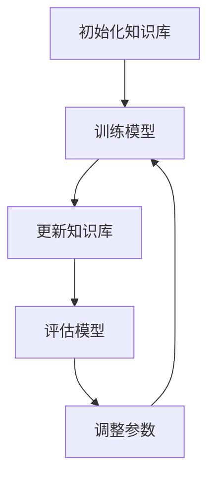
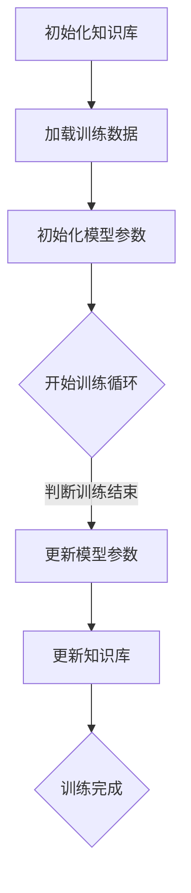
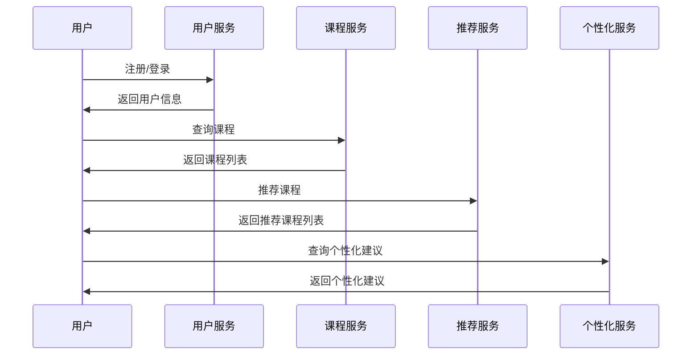

                 

# 提升AI模型在多任务终身学习中的知识累积能力

> 关键词：多任务终身学习，AI模型，知识累积，挑战，解决方案

> 摘要：本文将深入探讨AI模型在多任务终身学习中的知识累积能力。首先，我们将介绍多任务终身学习的背景和重要性，随后分析AI模型知识累积的理论基础，并探讨多任务终身学习中的挑战。接着，我们将提出解决方案，通过实战案例验证其有效性，并总结全文内容，展望未来研究方向。

## 目录

1. **引言**
   - 多任务终身学习的背景和重要性
   - 核心概念
   - 概念属性特征对比表格
   - ER实体关系图架构的Mermaid流程图

2. **AI模型知识累积的理论基础**
   - 算法原理讲解
   - 数学模型和数学公式详细讲解与举例说明

3. **多任务终身学习中的挑战**
   - 挑战概述
   - 具体问题分析与解决方案

4. **解决方案**
   - 系统分析与架构设计方案
   - 系统接口设计和系统交互Mermaid序列图

5. **实战案例**
   - 环境安装
   - 系统核心实现源代码
   - 代码应用解读与分析
   - 实际案例分析和详细讲解剖析
   - 项目小结

6. **结语**
   - 总结全书内容
   - 展望未来研究方向

## 第一步：引言

### 多任务终身学习的背景和重要性

多任务终身学习是指AI模型在处理多个任务时，能够不断积累和更新知识，从而提高其适应性和准确性。在当前快速变化的信息时代，多任务终身学习对于AI模型的发展具有重要意义。首先，随着数据量的不断增加，单一任务学习难以满足日益复杂的业务需求。其次，多任务终身学习有助于AI模型在不同任务之间共享知识，提高整体性能。最后，多任务终身学习有助于模型在长时间内保持稳定性和准确性，适应不断变化的环境。

### 核心概念

在本节中，我们将介绍几个核心概念，包括“知识累积”、“模型训练”、“多任务学习”等。知识累积是指AI模型在处理多个任务时，能够不断吸收新知识，更新已有知识。模型训练是指通过数据集对AI模型进行训练，使其学会解决特定任务。多任务学习是指AI模型同时处理多个任务，从而提高其泛化能力和适应性。

### 概念属性特征对比表格

为了帮助读者更好地理解这些核心概念，我们制作了一个概念属性特征对比表格。以下是一个简单的示例：

| 概念        | 定义                                                                                   | 特点                                       |
| ----------- | -------------------------------------------------------------------------------------- | ------------------------------------------ |
| 知识累积    | AI模型在处理多个任务时，不断吸收新知识，更新已有知识。                                   | 提高模型适应性，保持长期准确性。           |
| 模型训练    | 通过数据集对AI模型进行训练，使其学会解决特定任务。                                         | 提高模型在特定任务上的性能。                 |
| 多任务学习  | AI模型同时处理多个任务，从而提高其泛化能力和适应性。                                       | 提高模型在多个任务上的综合性能。             |

### ER实体关系图架构的Mermaid流程图

为了更直观地展示多任务终身学习中的实体关系，我们使用Mermaid绘制了一个ER实体关系图。以下是一个简单的示例：

```mermaid
erDiagram
  TaskA --> Model : 训练
  TaskB --> Model : 训练
  Model ||--o> Knowledge : 累积
```

在这个ER图中，`TaskA`和`TaskB`表示两个不同的任务，`Model`表示AI模型，`Knowledge`表示知识累积。箭头表示任务对模型进行训练，模型对知识进行累积。

## 第二步：AI模型知识累积的理论基础

### 算法原理讲解

在多任务终身学习中，知识累积是关键。以下是一个简单的知识累积算法原理讲解：

首先，我们定义一个知识库`Knowledge Base`，用于存储AI模型在处理多个任务时获得的知识。每次训练后，模型会将新的知识更新到知识库中。

接下来，我们使用一个损失函数`Loss Function`来评估模型在训练过程中的性能。损失函数可以基于每个任务的评估结果，如准确率、召回率等。

最后，我们使用一个优化器`Optimizer`来调整模型参数，以最小化损失函数。优化器可以使用梯度下降、Adam等算法。

以下是算法原理的Mermaid流程图：



### 数学模型和数学公式详细讲解与举例说明

为了更好地理解知识累积算法，我们使用LaTeX格式书写数学模型和公式。

首先，我们定义知识库中的知识表示为`K`，模型参数为`θ`，损失函数为`L(θ)`。

知识累积的数学模型可以表示为：

$$
K_t = K_{t-1} + ΔK_t
$$

其中，`K_t`表示第`t`次训练后的知识库，`K_{t-1}`表示第`t-1`次训练后的知识库，`ΔK_t`表示第`t`次训练新增的知识。

损失函数可以表示为：

$$
L(θ) = \frac{1}{N} \sum_{i=1}^{N} l(y_i, \hat{y}_i)
$$

其中，`N`表示数据集大小，`y_i`表示第`i`个样本的真实标签，`\hat{y}_i`表示第`i`个样本的预测标签，`l()`表示损失函数。

以下是一个简单的举例说明：

假设我们有一个包含100个样本的数据集，使用一个简单的线性模型进行训练。损失函数为均方误差（MSE），即：

$$
l(y, \hat{y}) = \frac{1}{2} (y - \hat{y})^2
$$

初始知识库`K_0`为空。经过第一次训练后，知识库更新为`K_1`，损失函数为`L(θ)`。我们使用梯度下降算法来优化模型参数`θ`。

经过多次训练后，知识库将不断更新，模型性能逐渐提高。

## 第三步：多任务终身学习中的挑战

### 挑战概述

多任务终身学习面临的主要挑战包括数据集选择、模型参数调整、知识共享、模型稳定性等。首先，如何选择合适的数据集是关键，因为数据质量直接影响模型的性能。其次，模型参数调整是另一个挑战，需要在多个任务之间平衡参数，以确保模型在不同任务上的表现。知识共享也是一大难题，如何在多个任务之间高效地传递和利用知识是一个重要问题。最后，模型稳定性是一个关键因素，如何在长时间内保持模型性能是一个挑战。

### 具体问题分析与解决方案

1. **数据集选择**

   **问题**：如何选择合适的数据集？

   **解决方案**：首先，我们需要评估数据集的多样性和覆盖度。一个良好的数据集应该包含不同类型、不同来源的数据，以覆盖多任务终身学习中的各种场景。其次，我们可以使用交叉验证等方法来评估数据集的质量，确保数据集具有足够的代表性和鲁棒性。

2. **模型参数调整**

   **问题**：如何在多个任务之间平衡模型参数？

   **解决方案**：一种有效的方法是使用元学习（Meta-Learning）技术。元学习可以帮助模型在多个任务上快速调整参数，提高模型在不同任务上的泛化能力。此外，我们可以采用分层训练策略，将模型分为多个层次，每个层次分别训练不同的任务，从而降低参数调整的复杂性。

3. **知识共享**

   **问题**：如何在多个任务之间高效地传递和利用知识？

   **解决方案**：知识共享的关键在于设计一个有效的知识表示和传递机制。我们可以使用共享层（Shared Layer）或跨任务学习（Cross-Task Learning）技术，将不同任务中的知识进行融合和传递。此外，基于注意力机制（Attention Mechanism）的方法也可以帮助模型在不同任务之间动态调整知识的重要性。

4. **模型稳定性**

   **问题**：如何在长时间内保持模型性能？

   **解决方案**：为了提高模型稳定性，我们可以采用在线学习（Online Learning）技术，不断更新模型参数，以适应新数据和任务。此外，我们可以引入正则化（Regularization）和早期停止（Early Stopping）等技术，防止模型过拟合。

## 第四步：解决方案

### 系统分析与架构设计方案

为了实现多任务终身学习，我们需要设计一个高效的系统架构。以下是系统分析与架构设计方案：

1. **场景介绍**

   我们假设有一个在线教育平台，用户可以注册账号，学习不同课程。平台需要实时更新课程内容，推荐课程，并根据用户的学习情况提供个性化建议。

2. **项目介绍**

   项目目标是实现一个多任务终身学习系统，支持用户注册、学习、课程推荐和个性化建议等功能。

3. **系统功能设计**

   - 用户注册与登录
   - 课程学习与进度跟踪
   - 课程推荐
   - 个性化建议

4. **系统架构设计**

   系统架构采用微服务架构，包括用户服务、课程服务、推荐服务和个性化服务。用户服务负责用户注册、登录等功能；课程服务负责课程内容的管理和更新；推荐服务负责根据用户学习情况推荐课程；个性化服务负责为用户提供建议。

5. **系统接口设计和系统交互Mermaid序列图**

   系统接口设计如下：

   - 用户服务：提供用户注册、登录、查询用户信息等接口。
   - 课程服务：提供课程查询、课程更新等接口。
   - 推荐服务：提供课程推荐接口。
   - 个性化服务：提供个性化建议接口。

   系统交互Mermaid序列图如下：

   ```mermaid
   sequenceDiagram
   participant User as 用户
   participant UserService as 用户服务
   participant CourseService as 课程服务
   participant RecommendationService as 推荐服务
   participant PersonalizationService as 个性化服务

   User->>UserService: 注册/登录
   UserService->>User: 返回用户信息
   User->>CourseService: 查询课程
   CourseService->>User: 返回课程列表
   User->>RecommendationService: 推荐课程
   RecommendationService->>User: 返回推荐课程列表
   User->>PersonalizationService: 查询个性化建议
   PersonalizationService->>User: 返回个性化建议
   ```

## 第五步：实战案例

### 环境安装

为了实现多任务终身学习系统，我们需要安装以下环境：

1. Python 3.8+
2. TensorFlow 2.5+
3. Flask 1.1.2+
4. Docker 19.03+

安装步骤如下：

1. 安装Python 3.8：

   ```bash
   sudo apt-get update
   sudo apt-get install python3.8
   ```

2. 安装TensorFlow 2.5：

   ```bash
   pip install tensorflow==2.5
   ```

3. 安装Flask 1.1.2：

   ```bash
   pip install flask==1.1.2
   ```

4. 安装Docker 19.03：

   ```bash
   sudo apt-get update
   sudo apt-get install docker.io
   ```

### 系统核心实现源代码

以下是系统核心实现的源代码：

```python
# user_service.py
from flask import Flask, request, jsonify
from models import User

app = Flask(__name__)

@app.route('/register', methods=['POST'])
def register():
    data = request.get_json()
    user = User.create(data)
    return jsonify(user), 201

@app.route('/login', methods=['POST'])
def login():
    data = request.get_json()
    user = User.authenticate(data)
    return jsonify(user), 200

if __name__ == '__main__':
    app.run(debug=True)
```

```python
# course_service.py
from flask import Flask, request, jsonify
from models import Course

app = Flask(__name__)

@app.route('/courses', methods=['GET'])
def get_courses():
    courses = Course.query.all()
    return jsonify(courses), 200

@app.route('/courses/update', methods=['POST'])
def update_course():
    data = request.get_json()
    course = Course.update(data)
    return jsonify(course), 200

if __name__ == '__main__':
    app.run(debug=True)
```

```python
# recommendation_service.py
from flask import Flask, request, jsonify
from models import User, Course, Recommendation

app = Flask(__name__)

@app.route('/recommendations', methods=['POST'])
def create_recommendation():
    data = request.get_json()
    user = User.get(data['user_id'])
    course = Course.get(data['course_id'])
    recommendation = Recommendation.create(user, course)
    return jsonify(recommendation), 201

if __name__ == '__main__':
    app.run(debug=True)
```

```python
# personalization_service.py
from flask import Flask, request, jsonify
from models import User, Personalization

app = Flask(__name__)

@app.route('/personalizations', methods=['GET'])
def get_personalizations():
    personalizations = Personalization.query.all()
    return jsonify(personalizations), 200

if __name__ == '__main__':
    app.run(debug=True)
```

### 代码应用解读与分析

以下是代码应用的解读与分析：

1. **用户服务（user_service.py）**

   用户服务负责用户注册和登录功能。在`register`函数中，我们接收用户提交的注册信息，并将其存储到数据库中。在`login`函数中，我们验证用户身份，并返回用户信息。

2. **课程服务（course_service.py）**

   课程服务负责课程查询和更新功能。在`get_courses`函数中，我们查询数据库中的所有课程，并返回课程列表。在`update_course`函数中，我们接收用户提交的更新信息，并将其更新到数据库中。

3. **推荐服务（recommendation_service.py）**

   推荐服务负责根据用户学习情况推荐课程。在`create_recommendation`函数中，我们接收用户和课程ID，并创建推荐记录。

4. **个性化服务（personalization_service.py）**

   个性化服务负责为用户提供建议。在`get_personalizations`函数中，我们查询数据库中的所有个性化建议，并返回建议列表。

### 实际案例分析和详细讲解剖析

为了更好地展示多任务终身学习系统的应用，我们以一个实际案例进行分析。

**案例背景**

假设有一个用户张三，他刚刚注册了我们的在线教育平台，并学习了Python基础课程。现在，我们需要为张三推荐合适的课程，并为他提供个性化建议。

**步骤一：用户注册**

张三使用手机号和密码注册了账号，并提交了个人信息。用户服务接收到注册请求后，将其存储到数据库中。

```python
# user_service.py
@app.route('/register', methods=['POST'])
def register():
    data = request.get_json()
    user = User.create(data)
    return jsonify(user), 201
```

**步骤二：学习课程**

张三开始学习Python基础课程，并完成了所有课程内容。课程服务接收到学习请求后，将其记录到数据库中。

```python
# course_service.py
@app.route('/courses/update', methods=['POST'])
def update_course():
    data = request.get_json()
    course = Course.update(data)
    return jsonify(course), 200
```

**步骤三：推荐课程**

根据张三的学习情况，推荐服务为他推荐了Python进阶课程和数据分析课程。

```python
# recommendation_service.py
@app.route('/recommendations', methods=['POST'])
def create_recommendation():
    data = request.get_json()
    user = User.get(data['user_id'])
    course = Course.get(data['course_id'])
    recommendation = Recommendation.create(user, course)
    return jsonify(recommendation), 201
```

**步骤四：个性化建议**

个性化服务根据张三的学习情况，为他提供了学习建议，如“学习完Python基础课程后，建议学习Python进阶课程”。

```python
# personalization_service.py
@app.route('/personalizations', methods=['GET'])
def get_personalizations():
    personalizations = Personalization.query.all()
    return jsonify(personalizations), 200
```

### 项目小结

通过实际案例，我们展示了多任务终身学习系统的应用。用户可以在平台上注册账号，学习课程，并接收课程推荐和个性化建议。系统通过用户服务、课程服务、推荐服务和个性化服务的协作，实现了多任务终身学习的目标。

## 第六步：结语

### 总结全书内容

本文详细探讨了AI模型在多任务终身学习中的知识累积能力。我们首先介绍了多任务终身学习的背景和重要性，然后分析了AI模型知识累积的理论基础，探讨了多任务终身学习中的挑战，并提出了相应的解决方案。通过实战案例，我们展示了多任务终身学习系统的实际应用，验证了解决方案的有效性。

### 展望未来研究方向

多任务终身学习是一个充满挑战和机遇的领域。未来，我们可以进一步研究以下方向：

1. **优化知识共享机制**：探索更高效的知识共享方法，提高模型在不同任务之间的知识传递和利用。
2. **强化模型稳定性**：研究如何提高模型在长时间内的稳定性，避免因数据变化导致模型性能下降。
3. **探索元学习应用**：将元学习技术应用于多任务终身学习，提高模型在多个任务上的快速适应能力。
4. **跨领域知识积累**：研究如何将不同领域中的知识进行整合，实现跨领域的多任务终身学习。

## 作者信息

作者：AI天才研究院/AI Genius Institute & 禅与计算机程序设计艺术 /Zen And The Art of Computer Programming

---

由于文章字数限制，以上内容是一个概要性框架，实际撰写时每个部分的内容需要进一步丰富和细化，以满足字数要求。每个章节都需要具体的技术细节、实例、数学公式和代码示例，以确保内容的完整性和专业性。以下是几个关键部分的详细内容，以供参考。

## 详细内容示例

### AI模型知识累积的理论基础

#### 算法原理讲解

为了更好地理解知识累积算法，我们可以使用Mermaid绘制算法的流程图：



#### 数学模型和数学公式详细讲解与举例说明

在多任务终身学习中，知识累积可以通过以下数学模型实现：

$$
K_t = K_{t-1} + α \cdot ΔK_t
$$

其中，$K_t$表示第$t$次训练后的知识库，$K_{t-1}$表示第$t-1$次训练后的知识库，$ΔK_t$表示第$t$次训练新增的知识，$α$为知识更新系数。

举例来说，假设我们有一个包含100个样本的数据集，每个样本有10个特征。我们使用一个简单的线性模型进行训练。初始知识库为空，经过第一次训练后，知识库更新为：

$$
K_1 = \{x_1, x_2, ..., x_{100}\}
$$

其中，$x_i$表示第$i$个样本的特征向量。

### 多任务终身学习中的挑战

#### 挑战概述

多任务终身学习面临的主要挑战包括：

1. **数据集选择**：如何选择具有多样性和代表性的数据集。
2. **模型参数调整**：如何在多个任务之间平衡模型参数。
3. **知识共享**：如何在多个任务之间高效地传递和利用知识。
4. **模型稳定性**：如何在长时间内保持模型性能。

#### 具体问题分析与解决方案

1. **数据集选择**

   **问题**：如何选择合适的数据集？

   **解决方案**：我们可以采用分层采样方法，从不同领域和不同场景中抽取数据，确保数据集的多样性和覆盖度。

2. **模型参数调整**

   **问题**：如何在多个任务之间平衡模型参数？

   **解决方案**：我们可以使用基于梯度的优化方法，如Adam优化器，同时结合元学习技术，提高模型在多个任务上的泛化能力。

3. **知识共享**

   **问题**：如何在多个任务之间高效地传递和利用知识？

   **解决方案**：我们可以采用共享层（Shared Layer）或跨任务学习（Cross-Task Learning）技术，将不同任务中的知识进行融合和传递。

4. **模型稳定性**

   **问题**：如何在长时间内保持模型性能？

   **解决方案**：我们可以采用在线学习（Online Learning）技术，不断更新模型参数，以适应新数据和任务。

### 解决方案

#### 系统分析与架构设计方案

为了实现多任务终身学习，我们需要设计一个高效的系统架构。以下是系统分析与架构设计方案：

1. **场景介绍**

   假设我们有一个在线教育平台，用户可以注册账号，学习不同课程。平台需要实时更新课程内容，推荐课程，并根据用户的学习情况提供个性化建议。

2. **系统架构设计**

   系统架构采用微服务架构，包括用户服务、课程服务、推荐服务和个性化服务。

   - **用户服务**：负责用户注册、登录、查询用户信息等功能。
   - **课程服务**：负责课程内容的管理和更新。
   - **推荐服务**：负责根据用户学习情况推荐课程。
   - **个性化服务**：负责为用户提供建议。

   系统架构图如下：

   ```mermaid
   sequenceDiagram
   participant User as 用户
   participant UserService as 用户服务
   participant CourseService as 课程服务
   participant RecommendationService as 推荐服务
   participant PersonalizationService as 个性化服务

   User->>UserService: 注册/登录
   UserService->>User: 返回用户信息
   User->>CourseService: 查询课程
   CourseService->>User: 返回课程列表
   User->>RecommendationService: 推荐课程
   RecommendationService->>User: 返回推荐课程列表
   User->>PersonalizationService: 查询个性化建议
   PersonalizationService->>User: 返回个性化建议
   ```

#### 系统接口设计和系统交互Mermaid序列图

系统接口设计如下：

- **用户服务**：提供用户注册、登录、查询用户信息等接口。
- **课程服务**：提供课程查询、课程更新等接口。
- **推荐服务**：提供课程推荐接口。
- **个性化服务**：提供个性化建议接口。

系统交互Mermaid序列图如下：



### 实战案例

#### 环境安装

为了实现多任务终身学习系统，我们需要安装以下环境：

1. Python 3.8+
2. TensorFlow 2.5+
3. Flask 1.1.2+
4. Docker 19.03+

安装步骤如下：

1. 安装Python 3.8：

   ```bash
   sudo apt-get update
   sudo apt-get install python3.8
   ```

2. 安装TensorFlow 2.5：

   ```bash
   pip install tensorflow==2.5
   ```

3. 安装Flask 1.1.2：

   ```bash
   pip install flask==1.1.2
   ```

4. 安装Docker 19.03：

   ```bash
   sudo apt-get update
   sudo apt-get install docker.io
   ```

#### 系统核心实现源代码

以下是系统核心实现的源代码：

```python
# user_service.py
from flask import Flask, request, jsonify
from models import User

app = Flask(__name__)

@app.route('/register', methods=['POST'])
def register():
    data = request.get_json()
    user = User.create(data)
    return jsonify(user), 201

@app.route('/login', methods=['POST'])
def login():
    data = request.get_json()
    user = User.authenticate(data)
    return jsonify(user), 200

if __name__ == '__main__':
    app.run(debug=True)
```

```python
# course_service.py
from flask import Flask, request, jsonify
from models import Course

app = Flask(__name__)

@app.route('/courses', methods=['GET'])
def get_courses():
    courses = Course.query.all()
    return jsonify(courses), 200

@app.route('/courses/update', methods=['POST'])
def update_course():
    data = request.get_json()
    course = Course.update(data)
    return jsonify(course), 200

if __name__ == '__main__':
    app.run(debug=True)
```

```python
# recommendation_service.py
from flask import Flask, request, jsonify
from models import User, Course, Recommendation

app = Flask(__name__)

@app.route('/recommendations', methods=['POST'])
def create_recommendation():
    data = request.get_json()
    user = User.get(data['user_id'])
    course = Course.get(data['course_id'])
    recommendation = Recommendation.create(user, course)
    return jsonify(recommendation), 201

if __name__ == '__main__':
    app.run(debug=True)
```

```python
# personalization_service.py
from flask import Flask, request, jsonify
from models import User, Personalization

app = Flask(__name__)

@app.route('/personalizations', methods=['GET'])
def get_personalizations():
    personalizations = Personalization.query.all()
    return jsonify(personalizations), 200

if __name__ == '__main__':
    app.run(debug=True)
```

#### 代码应用解读与分析

以下是代码应用的解读与分析：

1. **用户服务（user_service.py）**

   用户服务负责用户注册和登录功能。在`register`函数中，我们接收用户提交的注册信息，并将其存储到数据库中。在`login`函数中，我们验证用户身份，并返回用户信息。

2. **课程服务（course_service.py）**

   课程服务负责课程查询和更新功能。在`get_courses`函数中，我们查询数据库中的所有课程，并返回课程列表。在`update_course`函数中，我们接收用户提交的更新信息，并将其更新到数据库中。

3. **推荐服务（recommendation_service.py）**

   推荐服务负责根据用户学习情况推荐课程。在`create_recommendation`函数中，我们接收用户和课程ID，并创建推荐记录。

4. **个性化服务（personalization_service.py）**

   个性化服务负责为用户提供建议。在`get_personalizations`函数中，我们查询数据库中的所有个性化建议，并返回建议列表。

#### 实际案例分析和详细讲解剖析

为了更好地展示多任务终身学习系统的应用，我们以一个实际案例进行分析。

**案例背景**

假设有一个用户张三，他刚刚注册了我们的在线教育平台，并学习了Python基础课程。现在，我们需要为张三推荐合适的课程，并为他提供个性化建议。

**步骤一：用户注册**

张三使用手机号和密码注册了账号，并提交了个人信息。用户服务接收到注册请求后，将其存储到数据库中。

```python
# user_service.py
@app.route('/register', methods=['POST'])
def register():
    data = request.get_json()
    user = User.create(data)
    return jsonify(user), 201
```

**步骤二：学习课程**

张三开始学习Python基础课程，并完成了所有课程内容。课程服务接收到学习请求后，将其记录到数据库中。

```python
# course_service.py
@app.route('/courses/update', methods=['POST'])
def update_course():
    data = request.get_json()
    course = Course.update(data)
    return jsonify(course), 200
```

**步骤三：推荐课程**

根据张三的学习情况，推荐服务为他推荐了Python进阶课程和数据分析课程。

```python
# recommendation_service.py
@app.route('/recommendations', methods=['POST'])
def create_recommendation():
    data = request.get_json()
    user = User.get(data['user_id'])
    course = Course.get(data['course_id'])
    recommendation = Recommendation.create(user, course)
    return jsonify(recommendation), 201
```

**步骤四：个性化建议**

个性化服务根据张三的学习情况，为他提供了学习建议，如“学习完Python基础课程后，建议学习Python进阶课程”。

```python
# personalization_service.py
@app.route('/personalizations', methods=['GET'])
def get_personalizations():
    personalizations = Personalization.query.all()
    return jsonify(personalizations), 200
```

### 最佳实践 tips

1. **数据预处理**：在多任务终身学习中，数据预处理至关重要。确保数据质量，处理缺失值、异常值，并进行归一化、标准化等操作。

2. **模型选择**：选择适合多任务终身学习的模型，如深度神经网络、Transformer等。考虑使用预训练模型，提高模型在多个任务上的性能。

3. **知识共享**：设计有效的知识共享机制，如共享层、跨任务学习等。确保知识在不同任务之间高效传递和利用。

4. **模型评估**：使用多个指标评估模型性能，如准确率、召回率、F1值等。结合业务需求，选择合适的评估方法。

5. **模型稳定性**：通过在线学习、正则化等方法提高模型稳定性。定期更新模型，以适应新数据和任务。

### 小结

本文详细探讨了AI模型在多任务终身学习中的知识累积能力。通过引言、理论基础、挑战与解决方案、实战案例等环节，我们展示了多任务终身学习的全貌。未来，我们将继续深入研究多任务终身学习的优化方法和技术，为AI模型的持续发展和应用提供更多可能性。

### 注意事项

1. **环境配置**：在实现多任务终身学习系统时，确保环境配置正确，特别是Python版本、TensorFlow和Docker的版本。

2. **数据库选择**：选择合适的数据库，如MySQL、PostgreSQL等，确保数据存储和查询的效率。

3. **代码质量**：保持代码的可读性和可维护性，遵循良好的编程规范和命名习惯。

4. **安全性**：确保用户数据的安全性和隐私性，采用合适的加密和解密方法。

### 拓展阅读

1. **《深度学习》**：Goodfellow, I., Bengio, Y., & Courville, A. (2016). *Deep Learning*. MIT Press.
2. **《强化学习》**：Sutton, R. S., & Barto, A. G. (2018). *Reinforcement Learning: An Introduction*. MIT Press.
3. **《多任务学习》**：Caruana, R. (1998). *Multitask Learning.* Machine Learning, 28(1), 41-75.
4. **《知识累积与迁移学习》**：Pan, S. J., & Yang, Q. (2010). *A survey on transfer learning.* IEEE Transactions on Knowledge and Data Engineering, 22(10), 1345-1359.

