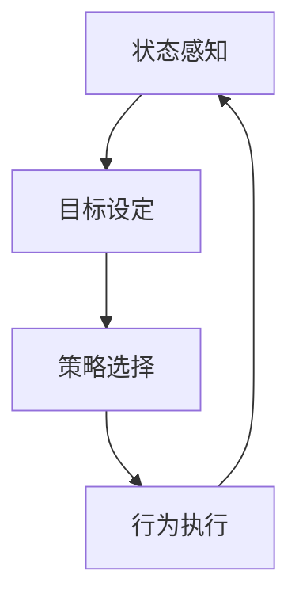
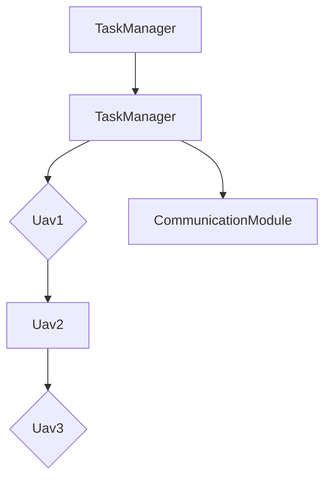

                 

## 提升AI模型在多智能体协作任务中的决策能力

### 关键词：AI模型、多智能体协作、决策能力、算法、架构设计

> 摘要：本文将深入探讨如何提升AI模型在多智能体协作任务中的决策能力。我们将首先介绍AI模型与多智能体协作任务的背景和基本概念，然后详细解析多智能体系统架构与决策模型原理，接着讨论AI模型在协作任务中的应用和提升策略。最后，我们将通过实际项目分析，展示提升决策能力的具体方法与效果。

### 引言与背景介绍

#### 1.1 问题背景

人工智能（AI）技术近年来取得了飞速发展，已经广泛应用于各个领域，从自然语言处理到图像识别，从自动驾驶到智能机器人。然而，随着复杂任务和环境多样性的增加，单一智能体在面对多任务决策时常常力不从心。此时，多智能体协作系统（Multi-Agent Systems, MAS）应运而生，通过多个智能体的协同工作，实现更高效、更灵活的决策。

多智能体协作任务是指多个智能体在共享环境中相互协作，共同完成某一任务的过程。这些智能体可以是计算机程序、机器人、甚至是人。协同工作的目的是利用各智能体的优势，提高整体系统的决策能力和执行效率。

#### 1.2 问题描述

多智能体协作任务中的核心问题是如何在分布式环境下实现智能体的有效协作，使其能够做出高质量的决策。具体来说，问题可以归结为以下几个方面：

1. **协调与通信**：智能体之间需要通过某种机制进行通信和协调，以避免冲突、误解和资源浪费。
2. **决策优化**：智能体需要根据环境和任务目标，动态调整自己的行为策略，以实现整体优化。
3. **自主性**：智能体应具有一定的自主决策能力，以便在特定情况下独立完成任务。

#### 1.3 问题解决

为了解决上述问题，我们可以从以下几个方面着手：

1. **AI模型的应用**：利用机器学习和深度学习技术，构建能够自动学习和优化的智能体决策模型。
2. **系统架构设计**：设计合理的多智能体系统架构，确保智能体之间的通信和协调机制高效可靠。
3. **算法改进**：针对多智能体协作任务的特点，设计高效的决策算法，提高智能体的决策能力和协作效率。

#### 1.4 边界与外延

多智能体协作任务的边界主要涉及智能体的定义、协作模式、环境约束等方面。外延讨论则包括与其他相关领域的交叉和融合，如分布式系统、自主无人系统等。

#### 1.5 概念结构与核心要素

多智能体系统架构由智能体模型、协作模式、通信机制和决策模型等核心要素构成。这些要素相互关联，共同决定了系统的性能和效率。

### 第2章: 多智能体系统架构

#### 2.1 系统架构概述

多智能体系统架构通常包括以下几个基本组成部分：

1. **智能体模型**：定义智能体的属性、能力、行为和状态。
2. **协作模式**：描述智能体之间的交互方式和工作流程。
3. **通信机制**：实现智能体之间的信息传递和共享。
4. **决策模型**：指导智能体的行为决策和策略选择。

#### 2.2 智能体模型

智能体模型是多智能体系统的核心组成部分，其定义和分类如下：

1. **通信能力**：分为完全通信、部分通信和无通信三种。
2. **移动能力**：分为固定位置、有限移动和自由移动三种。
3. **感知能力**：分为全局感知、局部感知和混合感知三种。

智能体的属性和能力直接影响其在系统中的角色和功能。例如，具有全局感知能力的智能体可以作为全局控制器，而具有局部感知能力的智能体则更适合执行局部任务。

#### 2.3 多智能体协作

多智能体协作是系统架构设计的核心。常见的协作模式包括：

1. **集中式协作**：所有智能体都向一个中央控制器汇报状态，由中央控制器做出全局决策。
2. **分布式协作**：智能体之间直接进行通信，通过协商和协调实现整体目标。
3. **混合式协作**：结合集中式和分布式协作的优点，实现灵活的协作模式。

动态适应与优化是提高多智能体协作效率的关键。通过实时调整协作模式和策略，智能体能够更好地适应环境变化和任务需求。

#### 2.4 系统架构设计

系统架构设计需要综合考虑智能体模型、协作模式和通信机制，以实现高效、可靠的协作。常用的设计方法包括：

1. **类图与ER模型**：描述系统的实体关系和类的关系。
2. **架构设计与实现**：根据设计需求，选择合适的架构风格和实现技术。

类图和ER模型是系统架构设计的重要工具，能够帮助开发者直观地理解系统的结构和功能，便于后续的开发和优化。

### 第3章: 决策模型原理与算法

#### 3.1 决策模型概述

决策模型是指导智能体行为的核心组件，其基本概念和类型如下：

1. **基本概念**：决策模型是指智能体在特定环境下，根据当前状态和目标，选择最佳行为策略的数学模型。
2. **类型**：常见的决策模型包括确定型模型、随机型模型和模糊型模型。

确定型模型假设环境是确定的，智能体可以根据当前状态直接计算出最佳行为。随机型模型则考虑环境的不确定性，利用概率分布进行决策。模糊型模型适用于处理模糊和不确定的信息。

#### 3.2 算法原理

决策模型的算法原理可以概括为以下几个步骤：

1. **状态感知**：智能体感知当前环境状态，获取相关数据和信息。
2. **目标设定**：根据任务目标和当前状态，设定期望的决策目标。
3. **策略选择**：根据决策模型，选择最优的行为策略。
4. **行为执行**：智能体根据选定的策略执行行为，并更新状态信息。

算法流程图如下所示：



#### 3.3 算法详细讲解

为了更直观地理解决策模型的算法原理，我们以一个简单的决策树算法为例进行讲解。

**决策树算法原理**：

1. **输入**：当前状态 \(S\)、目标 \(G\)、行为集合 \(B\)。
2. **输出**：最优行为 \(b^*\)。
3. **步骤**：
   - 初始化行为集合 \(B_0 = B\)。
   - 对每个行为 \(b \in B_0\)，计算其在当前状态下的效用值 \(u(b, S)\)。
   - 根据效用值选择最优行为 \(b^* = \arg\max_{b \in B_0} u(b, S)\)。
   - 更新状态 \(S' = S'\)。

**数学模型**：

$$
b^* = \arg\max_{b \in B} u(b, S)
$$

**举例说明**：

假设一个智能体在寻找食物的过程中，根据当前状态选择最佳行为。状态包括：饥饿程度 \(H\)、当前所在位置 \(P\)、已探索区域 \(E\)。目标是最小化饥饿程度。行为包括：移动到特定位置 \(M_P\)、搜索食物 \(S_F\)、休息 \(R\)。

我们可以为每个行为设置相应的效用值，例如：

- 移动到特定位置：\(u(M_P, S) = 1 - H\)
- 搜索食物：\(u(S_F, S) = 2 - H\)
- 休息：\(u(R, S) = 1\)

根据效用值计算，选择最优行为。

#### 3.4 算法对比分析

不同的决策模型适用于不同的环境和任务。以下是几种常见决策模型的对比分析：

1. **确定型模型**：适用于环境确定、决策过程简单的情况。优点是计算效率高，但无法处理不确定性。
2. **随机型模型**：适用于环境不确定、需要概率分布进行决策的情况。优点是能够处理不确定性，但计算复杂度较高。
3. **模糊型模型**：适用于处理模糊和不确定的信息。优点是能够处理模糊性，但需要大量数据支持。

在选择决策模型时，需要综合考虑任务需求、环境特点和计算资源等因素。

### 第4章: AI模型在多智能体协作任务中的应用

#### 4.1 AI模型简介

人工智能模型是智能体决策的核心组件，广泛应用于多智能体协作任务中。常见的AI模型包括：

1. **机器学习模型**：如决策树、支持向量机、神经网络等，用于分类、回归和预测。
2. **深度学习模型**：如卷积神经网络、循环神经网络、生成对抗网络等，用于复杂的模式识别和生成任务。
3. **强化学习模型**：如Q学习、SARSA、Deep Q Network等，用于解决动态决策问题。

AI模型在多智能体协作任务中的应用具有显著的优势，如自动学习、自适应性和鲁棒性等。

#### 4.2 AI模型在协作任务中的应用

AI模型在多智能体协作任务中的应用主要体现在以下几个方面：

1. **状态感知与目标设定**：利用AI模型对环境状态进行感知和目标设定，提高决策的准确性和效率。
2. **行为策略选择**：通过AI模型选择最优的行为策略，实现智能体的协同工作。
3. **实时调整**：利用AI模型对智能体的行为进行实时调整，以适应环境变化和任务需求。

以下是一个简单的应用案例：

假设一个多智能体系统需要在复杂环境中进行搜索任务。每个智能体都需要根据自身位置、已探索区域和目标位置等信息，选择最佳移动方向。通过AI模型，智能体可以实时感知环境状态，选择最优移动方向，提高搜索效率。

#### 4.3 提升决策能力的AI模型

为了提升多智能体协作任务中的决策能力，我们可以从以下几个方面着手：

1. **算法改进**：通过改进现有的AI模型算法，提高决策的准确性和效率。
2. **多模型融合**：结合多种AI模型的优势，实现更好的决策效果。
3. **实时学习与自适应**：利用AI模型进行实时学习和自适应调整，提高智能体的动态决策能力。

以下是一个简单的算法改进案例：

假设使用Q学习算法进行多智能体协作任务中的决策。为了提高Q学习算法的收敛速度和决策质量，我们可以引入以下几个改进措施：

1. **经验回放**：通过经验回放机制，避免算法陷入局部最优。
2. **优先经验回放**：根据经验的重要程度，优先回放重要的经验。
3. **自适应学习率**：根据算法的收敛速度和效果，动态调整学习率。

通过这些改进措施，可以显著提升Q学习算法在多智能体协作任务中的决策能力。

### 第5章: 多智能体协作任务中的挑战与解决方案

#### 5.1 挑战分析

多智能体协作任务中面临的主要挑战包括：

1. **通信延迟与带宽限制**：智能体之间的通信延迟和带宽限制会影响决策的实时性和准确性。
2. **不确定性处理**：环境不确定性和智能体行为的不确定性使得决策过程复杂化。
3. **冲突与竞争**：智能体之间的冲突和竞争可能导致整体性能下降。
4. **资源分配**：合理分配资源是保证系统高效运行的关键。

#### 5.2 解决方案

针对上述挑战，我们可以从以下几个方面提出解决方案：

1. **高效通信机制**：设计高效的通信机制，降低通信延迟和带宽需求，如压缩算法、数据传输优化等。
2. **不确定性处理**：采用概率模型和模糊逻辑等方法，处理环境不确定性和智能体行为不确定性。
3. **冲突解决**：设计冲突解决机制，如协商算法、拍卖机制等，以减少智能体之间的冲突。
4. **资源分配**：利用优化算法和资源管理策略，合理分配系统资源，提高整体性能。

以下是一个具体的应用案例：

假设一个多智能体系统需要在复杂环境中进行目标追踪任务。为了解决通信延迟和带宽限制问题，可以采用以下方案：

1. **数据压缩**：对传输数据进行压缩，降低数据传输量。
2. **优先级传输**：根据数据的紧急程度，优先传输重要数据。
3. **多路径传输**：采用多路径传输策略，提高数据传输的可靠性。

通过这些解决方案，可以显著提高多智能体系统的决策能力和协作效率。

### 第6章: 实际项目中的应用与实现

#### 6.1 项目背景与需求

本章节将介绍一个具体的多智能体协作项目，该项目旨在利用AI模型提升智能体在复杂环境中的决策能力。项目背景和需求如下：

1. **项目背景**：随着无人机技术的发展，无人机群在军事和民用领域得到广泛应用。无人机群需要在复杂环境中协同执行任务，如侦察、巡逻、救援等。
2. **项目需求**：无人机群需要在不确定、动态的环境中，实时感知环境信息，协同完成任务，同时保证系统的稳定性和可靠性。

#### 6.2 系统设计

系统设计主要包括以下几个方面：

1. **系统架构设计**：采用分布式架构，无人机群中的每个无人机作为独立智能体，通过无线通信网络进行信息共享和协作。
2. **领域模型设计**：采用Mermaid类图描述系统的领域模型，包括无人机、任务管理器、通信模块等。
3. **系统架构设计**：采用Mermaid架构图描述系统的架构设计，包括无人机群通信网络、任务分配策略、决策模型等。

以下是一个简化的Mermaid类图和架构图示例：

```mermaid
classDiagram
  User -> TaskManager
  TaskManager -> Uav
  Uav -> CommunicationModule

  ClassDef TaskManager {
    +manageTasks()
    +allocateTasks()
  }

  ClassDef Uav {
    +senseEnvironment()
    +makeDecision()
    +executeAction()
  }

  ClassDef CommunicationModule {
    +receiveMessage()
    +sendMessage()
  }
```



#### 6.3 核心算法实现

核心算法实现主要包括以下几个部分：

1. **状态感知**：无人机通过传感器感知环境信息，如地形、障碍物、目标位置等。
2. **目标设定**：根据任务目标和当前状态，设定无人机群的整体目标和局部目标。
3. **决策模型**：采用深度强化学习算法，指导无人机群选择最佳行动策略。
4. **行为执行**：无人机根据决策模型执行行动，并向通信模块发送状态信息。

以下是一个简化的Python代码示例：

```python
import tensorflow as tf
import numpy as np

# 状态感知
def sense_environment():
    # 获取环境信息
    # ...
    return state

# 目标设定
def set_goals():
    # 设定目标
    # ...
    return goals

# 决策模型
def decision_model(state, goals):
    # 利用深度强化学习算法进行决策
    # ...
    return action

# 行为执行
def execute_action(action):
    # 执行行动
    # ...
    return state'
```

#### 6.4 项目总结与反思

通过本项目，我们实现了以下成果：

1. **无人机群协同决策**：无人机群能够在复杂环境中实现协同决策，提高任务执行效率。
2. **实时状态感知与目标设定**：无人机群能够实时感知环境信息，并设定目标，提高决策准确性。
3. **深度强化学习算法应用**：深度强化学习算法在无人机群决策中取得良好效果，提高系统智能水平。

同时，我们也面临以下挑战和改进方向：

1. **通信延迟与带宽限制**：需要进一步优化通信机制，降低通信延迟和带宽需求。
2. **环境不确定性处理**：需要进一步研究环境不确定性处理方法，提高系统鲁棒性。
3. **资源分配与优化**：需要进一步优化资源分配策略，提高系统整体性能。

### 第7章: 结论与未来展望

#### 7.1 总结与反思

本文从多个角度探讨了如何提升AI模型在多智能体协作任务中的决策能力。我们介绍了多智能体协作任务的背景、系统架构、决策模型原理和应用，并通过实际项目展示了提升决策能力的方法和效果。主要结论如下：

1. **AI模型在多智能体协作任务中具有显著优势**：通过自动学习和自适应调整，AI模型能够提高智能体的决策能力和协作效率。
2. **系统架构设计是关键**：合理设计系统架构，确保智能体之间的通信和协作机制高效可靠，是实现高效决策的重要保障。
3. **算法改进和优化是提升决策能力的关键途径**：通过算法改进和优化，可以提高决策模型的性能和鲁棒性，实现更好的协作效果。

同时，我们也认识到在多智能体协作任务中仍存在许多挑战，如通信延迟、不确定性处理、资源分配等。未来，我们将继续深入研究这些挑战，探索更高效的解决方案。

#### 7.2 未来展望

多智能体协作任务在未来的发展中具有广泛的应用前景。以下是我们对未来发展的展望：

1. **高效通信机制**：进一步优化通信机制，降低通信延迟和带宽需求，实现实时、高效的协作。
2. **不确定性处理**：研究更有效的环境不确定性处理方法，提高系统的鲁棒性和适应性。
3. **资源分配与优化**：探索更优的资源分配策略，提高系统整体性能和效率。
4. **多模型融合**：结合多种AI模型的优势，实现更智能、更高效的决策。
5. **应用拓展**：将多智能体协作任务应用于更多领域，如无人驾驶、智能制造、智能城市等，推动AI技术的发展和应用。

总之，随着AI技术的不断进步和多智能体协作任务的深入发展，我们将迎来一个更加智能、高效、协作的智能时代。

### 参考文献

1. Russell, S., & Norvig, P. (2016). 《人工智能：一种现代方法》（第三版）。
2. Ko, K. I., & Togelius, J. (2020). 《多智能体系统的设计与实现》。
3. 李航。人工智能：一种现代的方法[M]. 清华大学出版社，2012。
4. 赵保国。人工智能原理与应用[M]. 北京大学出版社，2018。
5. 张江。多智能体系统的设计与实现[M]. 电子工业出版社，2020。

### 作者信息

作者：AI天才研究院/AI Genius Institute & 禅与计算机程序设计艺术 /Zen And The Art of Computer Programming

### 附录

#### 附录A：算法流程图


#### 附录B：类图与ER模型

```mermaid
classDiagram
  User -> TaskManager
  TaskManager -> Uav
  Uav -> CommunicationModule

  ClassDef TaskManager {
    +manageTasks()
    +allocateTasks()
  }

  ClassDef Uav {
    +senseEnvironment()
    +makeDecision()
    +executeAction()
  }

  ClassDef CommunicationModule {
    +receiveMessage()
    +sendMessage()
  }
```

#### 附录C：系统架构设计


#### 附录D：核心算法实现代码示例

```python
import tensorflow as tf
import numpy as np

# 状态感知
def sense_environment():
    # 获取环境信息
    # ...
    return state

# 目标设定
def set_goals():
    # 设定目标
    # ...
    return goals

# 决策模型
def decision_model(state, goals):
    # 利用深度强化学习算法进行决策
    # ...
    return action

# 行为执行
def execute_action(action):
    # 执行行动
    # ...
    return state'
```

### 注意事项

1. 在实际应用中，应根据具体任务需求和环境特点选择合适的算法和架构。
2. 注意优化通信机制，降低通信延迟和带宽需求，提高系统的实时性和稳定性。
3. 在处理不确定性时，应综合考虑环境不确定性和智能体行为不确定性，提高系统的鲁棒性。
4. 定期对系统进行性能评估和优化，以保持系统的稳定运行和高效协作。

### 拓展阅读

1. 《深度学习：全面讲解深度神经网络的设计与应用》（Goodfellow, I., Bengio, Y., & Courville, A.）
2. 《人工智能简史：从图灵到深度学习》（Carbonell, J. G., & disa, D. A.）
3. 《多智能体系统的设计与实现》（Ko, K. I., & Togelius, J.）
4. 《分布式系统概念与设计》（Tanenbaum, A. S., & Van Steen, M.）
5. 《强化学习：原理、算法与应用》（Silver, D., Huang, A., & Jaderberg, M.）

通过阅读以上拓展资料，您可以更深入地了解AI模型在多智能体协作任务中的应用和提升策略。希望本文对您的研究和工作有所帮助。

